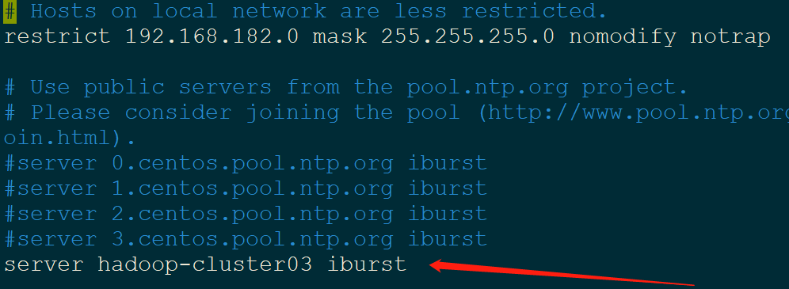
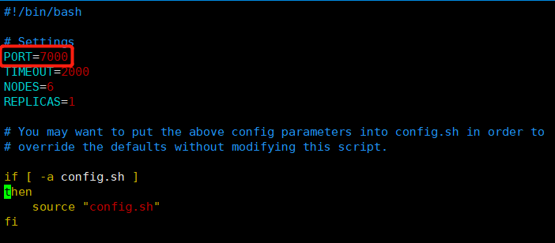

# 1.大数据集群环境搭建

- 本文档为hadoop集群环境搭建手册

- 需要用到的软件：
  - `jdk1.8.0_202`
  - `zookeeper-3.4.12`
  - `hadoop-2.7.5`
  - `scala-2.12.3`
  - `spark-2.2.1-bin-hadoop2.7`
  - `kafka_2.12-1.1.1`
  - `confluent-4.0.0 `
  - `hbase-1.2.4`
  - `redis-5.0.5`
  
- 操作系统为`centos7`，统一安装目录为`/opt`

- 由于安装软件较多，所以单独提供`big_data.sh`脚本放于`/etc/profile.d/`

- 集群规划：

  ```properties
  172.16.1.131(hadoop-master)			172.16.1.132(hadoop-slave1)
  172.16.1.133(hadoop-slave2)			172.16.1.134(hadoop-slave3)  
  172.16.1.135(hadoop-slave4)			172.16.1.136(hadoop-slave5) 
  ```

- 规划：

```properties
Zookeeper(安全考虑安装5个,1个leader,4个follower):hadoop-master/ hadoop-slave1 /hadoop-hadoop/hadoop-slave3/hadoop-slave4 

Namenode(常规安装即可2个): hadoop-master/hadoop-slave1

Hdfs/datanode(全部安装)

Yarn(主备yarn集群)：
	nodeManager		: hadoop-slave02/hadoop-slave03/hadoop-slave04/hadoop-slave05 
	Resourcemanager	: hadoop-master/hadoop-slave01

Hbase(为保障速度6台均安装)：其中Hregionserver 6台全部安装，Hmaster（主备即可） 备用主节点：hadoop-slave2
master在哪台服务器启动那台就是，可以启动多个，active hmaster由zookeeper随机选举一个.

Redis(安装集群6台服务器):其中3主3从。hadoop-master/hadoop-slave1/hadoop-slave2为主节点
hadoop-slave3/hadoop-slave4/hadoop-slave5 为从节点


Kafka(安装confluent kafka 5台):hadoop-slave1/ /hadoop-slave2/hadoop-slave3/hadoop-slave4/hadoop-slave5 
schema-registry/ kafka-rest （spark-slave1单机）

spark(搭建主备的): master节点随便启动，在哪台服务器启动哪台就是master,备用master在另一台启动start-master.sh，可启动多个.
hadoop-master/hadoop-slave01/hadoop-slave02/hadoop-slave03/hadoop-slave04/hadoop-slave05 --> Worker节点

Nginx:先搭建单机，主备同步的看单机稳定性再议  -->  六台均安装
```


| 主机名称       | 执行服务                                                     |
| -------------- | ------------------------------------------------------------ |
| hadoop-master  | zkfc，namenode，datanode，journalnode， resourcemanager，hbase(Hregionserver)，spark(master + Worker)，redis(master) |
| hadoop-slave01 | zkfc，namenode，datanode，journalnode，resourcemanager，hbase(HMaster + Hregionserver)，spark(master + Worker)，redis(master)，kafka |
| hadoop-slave02 | zkfc，datanode，journalnode，nodemanager，hbase(HMaster + Hregionserver)，spark(Worker)，redis(master)，kafka |
| hadoop-slave03 | zkfc，datanode，nodemanager，nodemanager，hbase(Hregionserver)，spark(Worker)，redis(slave)，kafka |
| hadoop-slave04 | zkfc，datanode，nodemanager，nodemanager，hbase(Hregionserver)，spark(Worker)，redis(slave)，kafka |
| hadoop-slave05 | datanode，nodemanager，spark(Worker)，redis(slave)，kafka    |

- [参考链接](<https://blog.csdn.net/hliq5399/article/details/78193113>)

## 1.1ssh免密登陆

- 服务器之间配置ssh免密登陆

### 1.1.1ssh-keygen命令及文件介绍

`ssh-keygen -t [rsa|dsa]`：（加密方式选 rsa|dsa，默认dsa）

- 通过命令`ssh-keygen -t rsa`生成之后会在用户的根目录生成一个 “.ssh”的文件夹。进入“.ssh”会生成以下几个文件：
  - authorized_keys	: 存放远程免密登录的公钥,主要通过这个文件记录多台机器的公钥
  - id_rsa                      : 生成的私钥文件
  - id_rsa.pub 		    : 生成的公钥文件
  - know_hosts 		 : 已知的主机公钥清单
- 注意：如果希望ssh公钥生效需满足至少下面两个条件
  - 1) .ssh目录的权限必须是700
  - 2) .ssh/authorized_keys文件权限必须是600

### 1.1.2配置多台服务器免密

- 需要分别在每个节点上创建一对密钥文件，密钥文件包括公钥文件`id_rsa.pub`和私钥文件 `id_rsa`。客户端在使用ssh登录到其他节点上的时候，ssh会发送私钥去和其他节点上的公钥去匹配，如果匹配成功，那么就会自动登录，而不需要输入密码，这就实现了无密码登录。  
- 所以，客户端要实现免密码登录到目标节点上的时候，就需要把公钥写入目标节点上的authorized_keys中。
- 具体步骤
  - 1）在6台机器上分别新建~/.ssh目录
  - 2）分别在机器上执行`ssh-keygen -t rsa`，生成公钥和私钥
  - 3）找一台主服务器，将其余节点的公钥文件内容复制到该主服务器的`authorized_keys`中
    - 方法一：将所有机器的`id_rsa.pub`文件复制到一台主机上，然后将所有`id_rsa.pub`内容追加到一个`id_rsa.pub`文件中。
    - `ssh-copy-id`
  - 4）将上述主服务器上包含所有节点公钥的authorized_keys文件分别复制到各个节点
  - 5）在主服务器上ssh连接其他节点的每台服务器，然后退出，这样可以将每个节点的公钥摘要写入到 `~/.ssh/known_hosts`中。
  - 6）将主服务器的`~/.ssh/known_hosts`文件scp到每个节点，替换掉原来的文件

## 1.2NTP时间同步

- 集群中的所有服务器需要配置ntp时间同步，否则会遇到各种奇怪的问题

### 1.2.1各个节点安装ntp服务

```shell
yum -y install ntp
```

### 1.2.2在master节点修改ntp.conf配置文件

- 设置`server`为其自身,再新增`restrict`表示可接受网段

```properties
# For more information about this file, see the man pages
# ntp.conf(5), ntp_acc(5), ntp_auth(5), ntp_clock(5), ntp_misc(5), ntp_mon(5).

driftfile /var/lib/ntp/drift

# Permit time synchronization with our time source, but do not
# permit the source to query or modify the service on this system.
restrict default nomodify notrap nopeer noquery

# Permit all access over the loopback interface.  This could
# be tightened as well, but to do so would effect some of
# the administrative functions.
restrict 127.0.0.1 
restrict ::1

# Hosts on local network are less restricted.
# 可以接收的网段，即集群内部网络
restrict 192.168.182.0 mask 255.255.255.0 nomodify notrap

# Use public servers from the pool.ntp.org project.
# Please consider joining the pool (http://www.pool.ntp.org/join.html).
#server 0.centos.pool.ntp.org iburst
#server 1.centos.pool.ntp.org iburst
#server 2.centos.pool.ntp.org iburst
#server 3.centos.pool.ntp.org iburst

# 新增server为自身,注意：此处配置表示，以该及其的事件作为标准时间
server hadoop-cluster03 iburst
server 127.127.1.0
fudge 127.127.1.0 stratum 8

#broadcast 192.168.1.255 autokey	# broadcast server
#broadcastclient			# broadcast client
#broadcast 224.0.1.1 autokey		# multicast server
#multicastclient 224.0.1.1		# multicast client
#manycastserver 239.255.254.254		# manycast server
#manycastclient 239.255.254.254 autokey # manycast client

# Enable public key cryptography.
#crypto

includefile /etc/ntp/crypto/pw

# Key file containing the keys and key identifiers used when operating
# with symmetric key cryptography. 
keys /etc/ntp/keys

# Specify the key identifiers which are trusted.
#trustedkey 4 8 42

# Specify the key identifier to use with the ntpdc utility.
#requestkey 8

# Specify the key identifier to use with the ntpq utility.
#controlkey 8

# Enable writing of statistics records.
#statistics clockstats cryptostats loopstats peerstats

# Disable the monitoring facility to prevent amplification attacks using ntpdc
# monlist command when default restrict does not include the noquery flag. See
# CVE-2013-5211 for more details.
# Note: Monitoring will not be disabled with the limited restriction flag.
disable monitor
```

### 1.2.3在slave节点修改ntp.conf配置文件

- 设置ntp服务器ip

```properties
server hadoop-cluster03 iburst
```



### 1.2.4配置crontab自动同步

- `crontab -e`

```shell
*/2     *       *       *       *       /usr/sbin/ntpdate hadoop-cluster03
```

### 1.2.5重启ntp，实行同步

- `systemctl restart ntpd.service`
- ntpdate -d hadoop-cluster03

### 1.2.6设置ntp开机自启动

```shell
systemctl enable ntpd
```

### 1.2.6遇到的问题

- 在ntp客户端运行ntpdate serverIP，出现`no server suitable for synchronization found`的错误。

  在ntp客户端用ntpdate –d serverIP查看，发现有“Server dropped: strata too high”的错误，并且显示“stratum 16”。而正常情况下stratum这个值得范围是“0~15”。

=>  这是**因为NTP server还没有和其自身或者它的server同步上**。

​		以下的定义是让NTP Server和其自身保持同步，如果在/ntp.conf中定义的server都不可用时，将使用local时间作为ntp服务提供给ntp客户端。

```properties
server 127.127.1.0
fudge 127.127.1.0 stratum 8
```

## 1.3jdk安装

- 将jdk解压到`/opt`
- 将jdk环境变量配置于`big_data.sh`

```bash
export JAVA_HOME=/opt/jdk1.8.0_171
export JRE_HOME=$JAVA_HOME/jre
export CLASSPATH=.:$JAVA_HOME/lib:$JRE_HOME/lib
export PATH=$JAVA_HOME/bin:$PATH
```

```shell
source /etc/profile
echo $JAVA_HOME
```

## 1.4zookeeper安装

### 1.4.1解压，配置环境变量

```bash
# zookeeper
 export ZOOKEEPER_HOME=/opt/zookeeper-3.4.12
 export PATH=$PATH:$ZOOKEEPER_HOME/bin
```

### 1.4.2修改配置文件

- 提供`zoo.cfg`

```bash
1. cd /opt/zookeeper-3.4.12/conf/

2. cp zoo_sample.cfg zoo.cfg

3. mkdir /home/data/zookeeper/zkdata -p
   mkdir /home/data/zookeeper/zkdatalog -p
   
4.zoo.conf新增以下配置：

dataDir=/home/data/zookeeper/zkdata
dataLogDir=/home/data/zookeeper/zkdatalog
clientPort=2181
server.1=hadoop-master:2888:3888
server.2=hadoop-slave1:2888:3888
server.3=hadoop-slave2:2888:3888
server.4=hadoop-slave3:2888:3888
server.5=hadoop-slave4:2888:3888
```

- 提供zookeeper的服务器创建myid文件

  在上述1-5这5台服务器上分别执行对应的指令：

  ```bash
  echo "1/2/3/4/5" > /home/data/zookeeper/zkdata/myid
  ```

### 1.4.3启动与验证

```shell
#进入到Zookeeper的bin目录下
cd /opt/zookeeper/zookeeper-3.4.12/bin

#启动服务（3台都需要操作）
./zkServer.sh start

#检查服务状态
./zkServer.sh status

#客户点登陆查看
./zkCli
```

### 1.4.4更改日志路径

- 新增环境变量`ZOO_LOG_DIR`

```properties
# log dir
export ZOO_LOG_DIR=/home/data/zookeeper/zkdatalog
```

### 1.4.5配置zookeeper开机自启动

把zookeeper配置到系统服务中，然后系统重启后自动重启zookeeper，另外，设置zookeeper意外停止能立即重启。

在`/usr/lib/systemd/system`路径下新建zookeeper.service文件，新增内容如下：

```shell
[Unit]
Description=zookeeper
After=network.target remote-fs.target nss-lookup.target syslog.target
 
[Service]
Type=forking
ExecStart=/home/data/zookeeper-3.4.11/bin/zkServer.sh start
ExecStop=/home/data/zookeeper-3.4.11/bin/zkServer.sh stop
ExecReload=/home/data/zookeeper-3.4.11/bin/zkServer.sh restart
Restart=always
 
[Install]
WantedBy=multi-user.target
```

然后修改该文件的权限为754。

```bash
#系统重启后自动启动zookeeper
systemctl enable zookeeper.service

#启动zookeeper
systemctl start zookeeper.service
```

## 1.4hadoop安装

### 1.4.1解压，配置环境变量

```bash
export HADOOP_HOME=/opt/hadoop-2.7.5/
export PATH=$PATH:$HADOOP_HOME/bin
```

### 1.4.2配置文件修改

#### 1.4.2.1 core-site.xml

- `/opt/hadoop-2.7.5/etc/hadoop/core-site.xml`核心配置文件配置

```xml
<?xml version="1.0" encoding="UTF-8"?>
<?xml-stylesheet type="text/xsl" href="configuration.xsl"?>
<!--
  Licensed under the Apache License, Version 2.0 (the "License");
  you may not use this file except in compliance with the License.
  You may obtain a copy of the License at

    http://www.apache.org/licenses/LICENSE-2.0

  Unless required by applicable law or agreed to in writing, software
  distributed under the License is distributed on an "AS IS" BASIS,
  WITHOUT WARRANTIES OR CONDITIONS OF ANY KIND, either express or implied.
  See the License for the specific language governing permissions and
  limitations under the License. See accompanying LICENSE file.
-->

<!-- Put site-specific property overrides in this file. -->

<configuration>
        <!--
                指定 HDFS 的 nameservice 为 lj-nameservice
                亦可直接使用 NameNode 的RPC通信地址，如 hdfs://spark-master:9000
        -->
        <property>
                <name>fs.defaultFS</name>
                <value>hdfs://lj-nameservice</value>
        </property>

        <!--
                指定 Hadoop 临时文件目录
                默认临时文件会生成在 /tmp/hadoop-[用户名] 路径下，机器重启后临时文件会被清空
        -->
        <property>
                <name>hadoop.tmp.dir</name>
                <value>/home/data/hadoop/tmp</value>
        </property>

        <!-- 指定 Zookeeper 集群访问地址 -->
        <property>
                <name>ha.zookeeper.quorum</name>
                <value>hadoop-master:2181,hadoop-slave01:2181,hadoop-slave02:2181,hadoop-slave03:2181,hadoop-slave04:2181</value>
        </property>

        <!-- 配置隔离机制方法，多个机制用换行分割，即每个机制暂用一行-->
        <property>
                <name>dfs.ha.fencing.methods</name>
                <value>
                        sshfence
                        shell(/bin/true)
                </value>
        </property>

        <!-- 使用 sshfence 隔离机制时需要 ssh 免登陆 -->
        <property>
                <name>dfs.ha.fencing.ssh.private-key-files</name>
                <value>/root/.ssh/id_rsa</value>
        </property>

        <!-- 配置 sshfence 隔离机制超时时间 -->
        <property>
                <name>dfs.ha.fencing.ssh.connect-timeout</name>
                <value>30000</value>
        </property>
</configuration>
```

#### 1.4.2.2 hdfs-site.xml

- `/opt/hadoop-2.7.5/etc/hadoop/hdfs-site.xml`namenode和datanode配置文件配置

```xml
<?xml version="1.0" encoding="UTF-8"?>
<?xml-stylesheet type="text/xsl" href="configuration.xsl"?>
<!--
  Licensed under the Apache License, Version 2.0 (the "License");
  you may not use this file except in compliance with the License.
  You may obtain a copy of the License at

    http://www.apache.org/licenses/LICENSE-2.0

  Unless required by applicable law or agreed to in writing, software
  distributed under the License is distributed on an "AS IS" BASIS,
  WITHOUT WARRANTIES OR CONDITIONS OF ANY KIND, either express or implied.
  See the License for the specific language governing permissions and
  limitations under the License. See accompanying LICENSE file.
-->

<!-- Put site-specific property overrides in this file. -->

<configuration>
        <!-- 指定副本数 -->
        <property>
                <name>dfs.replication</name>
                <value>2</value>
        </property>

        <!-- 指定 NameService，需要和 core-site.xml 中 fs.defaultFS 配置项保持一致 -->
        <property>
                <name>dfs.nameservices</name>
                <value>lj-nameservice</value>
        </property>

        <!-- 设置 NameService 下的 NameNode 名称 -->
        <property>
                <name>dfs.ha.namenodes.lj-nameservice</name>
                <value>namenode1,namenode2</value>
        </property>

        <!-- namenode1 的 RPC 通信地址 -->
        <property>
                <name>dfs.namenode.rpc-address.lj-nameservice.namenode1</name>
                <value>hadoop-master:9000</value>
        </property>

        <!-- namenode1 的 HTTP 通信地址 -->
        <property>
                <name>dfs.namenode.http-address.lj-nameservice.namenode1</name>
                <value>hadoop-master:50070</value>
        </property>

        <!-- namenode2 的 RPC 通信地址 -->
        <property>
                <name>dfs.namenode.rpc-address.lj-nameservice.namenode2</name>
                <value>hadoop-slave01:9000</value>
        </property>

        <!-- namenode2 的 HTTP 通信地址 -->
        <property>
                <name>dfs.namenode.http-address.lj-nameservice.namenode2</name>
                <value>hadoop-slave01:50070</value>
        </property>

        <!-- 指定 NameNode 在本地磁盘存放数据的位置(可选) -->
        <property>
                <name>dfs.namenode.name.dir</name>
                <value>/home/data/hadoop/hdfs/name</value>
        </property>

        <!-- 指定 DataNode 在本地磁盘存放数据的位置(可选) -->
        <property>
                <name>dfs.namenode.data.dir</name>
                <value>/home/data/hadoop/hdfs/data</value>
        </property>

        <!-- 指定 JournalNode 在本地磁盘存放数据的位置(可选) -->
        <property>
                <name>dfs.journalnode.edits.dir</name>
                <value>/home/data/hadoop/hdfs/journal</value>
        </property>

        <!-- 开启 NameNode 失败自动切换(HA，单NameNode时此配置无效) -->
        <property>
                <name>dfs.ha.automatic-failover.enabled</name>
                <value>true</value>
        </property>

        <!--
                指定HA集群中多个NameNode之间的共享存储路径(单NameNode时此配置无效)
                指定URL对应的机器上会启动 JournalNode 服务
                设定该配置需要启用HA(dfs.ha.automatic-failover.enabled设置为true)
                JournalNode至少需要配置3个，数量需要为奇数
                JournalNode配置不正确会造成NameNode启动失败
        -->
        <property>
                <name>dfs.namenode.shared.edits.dir</name>
                <value>qjournal://hadoop-master:8485;hadoop-slave01:8485;hadoop-slave02:8485/lj-nameservice</value>
        </property>
</configuration>
```

#### 1.4.2.3 slaves配置

- `/opt/hadoop-2.7.5/etc/hadoop/slaves` datanode节点配置文件

```bash
hadoop-master
hadoop-slave01
hadoop-slave02
hadoop-slave03
hadoop-slave04
hadoop-slave05
```

#### 1.4.2.4yarn-site.xml

```xml
<configuration>
    <!-- 开启RM高可用 -->
    <property>
        <name>yarn.resourcemanager.ha.enabled</name>
        <value>true</value>
    </property>
    <!-- 指定RM的cluster id -->
    <property>
        <name>yarn.resourcemanager.cluster-id</name>
        <value>yrc</value>
    </property>
    <!-- 指定RM的名字 -->
    <property>
        <name>yarn.resourcemanager.ha.rm-ids</name>
        <value>rm1,rm2</value>
    </property>
    <!-- 分别指定RM的地址 -->
    <property>
        <name>yarn.resourcemanager.hostname.rm1</name>
        <value>spark-slave1</value>
    </property>
    <property>
        <name>yarn.resourcemanager.hostname.rm2</name>
        <value>spark-slave2</value>
    </property>
    <!-- 指定zk集群地址 -->
    <property>
        <name>yarn.resourcemanager.zk-address</name>
        <value>spark-master:2181,spark-slave1:2181,spark-slave2:2181</value>
    </property>
    <property>
        <name>yarn.nodemanager.aux-services</name>
        <value>mapreduce_shuffle</value>
    </property>
</configuration>
```

#### 1.4.2.5Mapred-site.xml

```xml
<configuration>
    <!-- 指定mr框架为yarn方式 -->
    <property>
        <name>mapreduce.framework.name</name>
        <value>yarn</value>
    </property>
</configuration>
```

### 1.4.3分发&创建目录

- 将上述配置文件`scp`到各个服务器对应位置

```bash
scp slaves root@hadoop-slave01:/opt/hadoop-2.7.5/etc/hadoop/

......
```

- 创建上述制定的nanode和datanode对应的目录

```shell
mkdir -p /home/data/hadoop/hdfs/name
mkdir -p /home/data/hadoop/hdfs/journal
mkdir -p /home/data/hadoop/hdfs/data

mkdir -p /home/data/hadoop/tmp
```

### 1.4.4格式化与准备

#### 1.4.4.1启动journalnode

- 登陆需要配置journalnode的机器，在hadoop目录下执行：

```shell
./sbin/hadoop-daemon.sh start journalnode
```

注：后续启动dfs的时候也会启动journalnode，所以我觉得**这步可以省略**。

#### 1.4.4.2格式化hdfs

- namenode节点执行格式化指令

  `hdfs namenode -format`
  
- 注意：

  - 格式化namenode,**需要先启动集群**在进行，否则报连接失败
  - 重复格式化namenode,需要删除之前的data信息，否则datanode全部启动不了。原因：namenode的ip和datanode的ip不一致。
  - Datanode启动正常。Namenode只启动一个。原因，format后namenode的相应信息拷贝到备份namenode相同目录，否则无法实现HA.

#### 1.4.4.3格式化zkfc

- 在namenode机器上执行：

```shell
hdfs zkfc -formatZK
```

注意：需先开启zookeeper

### 1.4.5启动

#### 1.4.5.1启动hdfs

- 在namenode机器上执行

```shell
./sbin/start-dfs.sh

./sbin/start-all.sh
```

#### 1.4.5.2启动yarn

- 在resourcemanager机器上执行：

```shel
./sbin/start-yarn.sh
```

**注意**：`start-yarn.sh`只能启动一个`resourcemanager`，另一个还需要登陆另一台机子用`./sbin/yarn-daemon.sh start resourcemanager`启动。

```shell
./sbin/yarn-daemon.sh start resourcemanager
```

- 全部启动完成的jps截图图下：


### 1.4.6验证

#### 1.4.6.1验证namenode

- 浏览器登陆`http://hadoop-cluster01:50070`，查看namenode是主还是备。kill掉主的namenode，在通过浏览器查看主备是否切换，此时的hdfs服务不中断。

- 通过命令`hdfs haadmin -getServiceState namenode1`查看当前namenode状态

  `hdfs haadmin -transitionToActive --forcemanual namenode2` 强制切换。

#### 1.4.6.2验证yarn

- 使用hadoop自带的Mr示例程序，在resourcemanager机器上提交：

```shell
./bin/hadoop jar share/hadoop/mapreduce/hadoop-mapreduce-examples-2.4.1.jar wordcount /input /out
```

其中/input需要提前放入一个文本文件，最后统计词数，输出到/out中。

### 1.4.7管理界面

- 两个管理页面
  - 一个是namenode对应的机器的50070端口，可以访问namenode，查看hdfs文件，上传下载hdfs文件等
  - 一个是resourcemanager对应机器的8088端口，可以查看资源使用情况。

## 1.5spark安装

### 1.5.1scala安装

#### 1.5.1.1解压，配置环境变量-> 

```bash
export SCALA_HOME=/opt/scala-2.12.3
export PATH=$PATH:$SCALA_HOME/bin
```

### 1.5.2spark安装

#### 1.5.2.1解压，配置环境变量

```bash
export SPARK_HOME=/opt/spark-2.2.1-bin-hadoop2.7
```

#### 1.5.2.2Spark配置（单master）

`cd /opt/spark-2.2.1-bin-hadoop2.7/conf/`

`cp spark-env.sh.template spark-env.sh`

在`spark-env.sh`中加入

```bash
export SPARK_MASTER_HOST=172.16.0.126 #spark集群的master节点

export SPARK_WORKER_CORES=4 #使用几个核

export SPARK_WORKER_MEMORY=16g #指定的work节点能够最大分配给#Executors的内存大小

export HADOOP_CONF_DIR=/home/data/hadoop-2.8.2/etc/hadoop #指定Hadoop集群的配置文件目录

#保存退出.
```

- 添加worker配置

`cp slaves.template slaves `

在`slaves`文件里加上需要做worker的主机名，例如`spark-master  #我新建机子的主机名`。

然后把spark的配置都分发到slave上。

#### 1.5.2.3Spark配置（多master）

`cd /home/data/spark-2.2.1-bin-hadoop2.7/conf/`

`cp spark-env.sh.template spark-env.sh`

在`spark-env.sh`中加入

```bash
export YARN_CONF_DIR=$HADOOP_HOME/etc/hadoop
export SPARK_WORKER_CORES=4
export HADOOP_CONF_DIR=$HADOOP_HOME/etc/hadoop
export SPARK_WORKER_MEMORY=16g
export SPARK_DAEMON_JAVA_OPTS="-Dspark.deploy.recoveryMode=ZOOKEEPER -Dspark.deploy.zookeeper.url=spark-master:2181,spark-slave1:2181,spark-slave2:2181,spark-slave3:2181,spark-slave4:2181 -Dspark.deploy.zookeeper.dir=/spark"
```

### 1.5.3Spark启动

**注意**：

- 上述配置可以放到每台机器上，然后在其中一台机器上执行`./sbin/start-all.sh`,则在该机器上起一个master和所有配置的worker，然后到另一台机器上执行`./sbin/start-master.sh`起另一个master，两个master就可以区分主备了。Master可以起多个，完全看需求。

worker的配置还是添加在slaves文件中，worker可以不跟master一起启动，执行`./sbin/start-slaves.sh`。

在spark安装路径下:

```bash
sbin/start-all.sh

sbin/stop-all.sh
```

检查：

用`jps`查看，是否有`master`和`worker`进程，有则启动完毕。

### 1.5.4Web访问

用`master-ip:8080`访问spark查看资源状况。

### 1.5.5History Server

Application Detail UI中的信息仅在应用执行期间可查看，默认配置下，应用结束后仅能查看文本日志。 若需要在应用结束后保留应用的执行信息，则需要启动`Spark History Server`。

在HDFS中为Spark创建Spark Event Log路径:

```
$ hdfs dfs -mkdir [HDFS路径]
```

编辑`$SPARK_HOME/conf/spark-defaults.conf`文件，加入以下配置：

```
# 启用 Spark Event Log
spark.eventLog.enabled           true
# 设置 Spark Event Log 的写入路径
spark.eventLog.dir               [HDFS路径]

# 配置 Spark History Server 的服务端口和实现类
spark.history.provider           org.apache.spark.deploy.history.FsHistoryProvider
spark.history.ui.port            18081
# 配置 Spark History Server 访问的日志路径，需要与 spark.eventLog.dir 路径相同
spark.history.fs.logDirectory    [HDFS路径]
```

之后启用Spark History Server服务：

```
$ start-history-server.sh

// 关闭服务
$ stop-history-server.sh
```

## 1.6confluent Kafka

### 1.6.1集群配置

#### 1.6.1.1解压

#### 1.6.1.2修改配置文件

主要修改的是kafka路径中`/opt/confluent-4.0.0/etc/kafka`下的`server.properties，consumer.properties，producer.properties`文件

- server.properties

```properties
broker.id=1
zookeeper.connect=spark-master:2181,spark-slave1:2181,spark-slave2:2181,spark-slave3:2181,spark-slave4:2181
listeners = PLAINTEXT://spark-slave1:9092 
```

​	说明：

>如果是单机版，则默认配置就可以，其它主机也需要修改这三项。第三项如果不修改的话，producer必须用默认的hostname方式连接，在producer的主机上还需要把hosts对应关系配置上。
>
>message.max.bytes=5000000  //默认值为1000000，broker能接收消息的最大字节数，这个值应该比消费端的fetch.message.max.bytes更小才对，否则broker就会因为消费端无法使用这个消息而挂起。
>
>replica.fetch.max.bytes=5001000 //broker
>
>可复制的消息的最大字节数。这个值应该比message.max.bytes大，否则broker会接收此消息，但无法将此消息复制出去，从而造成数据丢失。

- consumer.properties

```properties
max.partition.fetch.bytes=5000000//服务器每个patition返回的最大数据大小，在批量返回的时候，如果第一批次比这个值大，也会继续返回后面的批次。这个值必须和broker的message.max.bytes，producer的max.request.size配合使用。
fetch.message.max.bytes=5000000//消费者一次获取请求能取得的数据最大值，这些数据被读入到内存中，所以可以用来控制消费者的内存使用，这个值必须大于等于最大消息长度。
```

- producer.properties

```properties
max.request.size=5000000  //发送消息的请求最大字节数，这个是kakfa服务器上的限制，有些client也会通过这个参数去限制，注意同步设置。
```

#### 1.6.1.3启动与验证

```shell
#启动：
kafka/bin/kafka-server-start.sh -daemon kafka/config/server.properties
#通过jps查看Kafka进程是否启动。

#查看kafka状态
kafka-topics --describe --zookeeper hadoop-cluster01:2181
```

#### 1.6.1.4相关操作

```shell
#创建topic：
bin/kafka-topics.sh --create --zookeeper 172.16.0.126:2181 --replication-factor 1 --partitions 1 --topic test

#查看topic：
bin/kafka-topics.sh --list --zookeeper 172.16.0.126:2181

# 移除话题，若移除话题失败需要在Kafka服务端配置中添加设定 delete.topic.enble = true
$ kafka-topics --delete --topic [话题名称] --zookeeper [Zookeeper集群IP:端口]
```

```shell
#发布消息/生产数据
#使用 --producer.config 参数指定生产者端使用的配置文件
$ kafka-console-producer --broker-list [listeners IP:端口] --topic [话题名称]：

bin/kafka-console-producer.sh --broker-list 172.16.0.126:9092 --topic test

#消费消息：
#使用 --from-beginning 参数输出该话题从创建开始后的消息
#使用 --consumer.config 参数指定消费端使用的配置文件
#使用 --offset [偏移量] --partion [分区编号] 参数自定义读取消息时的偏移量
$ kafka-console-consumer --bootstrap-server [listeners IP:端口] --topic [话题名称]

bin/kafka-console-consumer.sh --bootstrap-server 172.16.0.126:9092 --topic test --from-beginning
```

#### 1.6.1.5日志路径配置

- 默认Kafka运行的时候都会通过log4j打印很多日志文件，比如server.log, controller.log, state-change.log等，而都会将其输出到$KAFKA_HOME/logs目录下，这样很不利于线上运维，因为经常容易出现打爆文件系-统，一般安装的盘都比较小，而数据和日志会指定打到另一个或多个更大空间的分区盘

- 具体方法是，打开$KAFKA_HOME/bin/kafka-run-class.sh，找到下面标示的位置，并定义一个变量，指定的值为系统日志输出路径，重启broker即可生效。

  

  

### 1.6.2Kafka Connect

- `Kafka Connect`是一套在`Apache Kafka`和其它数据系统间进行可靠的、可扩展的流式数据传输的框架。 Kafka Connect使得向Kafka输入、输出数据变得简单。

#### 1.6.2.1依赖服务配置 

Kafka Connect使用前除了启动Zookeeper和Kafka主进程外，还需要启动以下服务：

##### 1.6.2.1.1 Schema Registry

SchemaRegistry服务提供了对出入Kafka的消息的监控，并对数据进行序列化/反序列化处理。 服务配置文件为`$KAFKA_HOME/etc/schema-registry/schema-registry.properties`，配置说明：

```properties
 listeners = http://服务地址:服务端口
 # 设置 Schema Registry 服务绑定的地址与服务端口，默认端口8081
 # 示例： listeners = http://spark-master:8081

 kafkastore.connection.url = Zookeeper集群地址:端口
 # 示例： kafkastore.connection.url = spark-master:2181, spark-slave0:2181, spark-slave1:2181

 kafkastore.bootstrap.servers = Kafka服务监听协议://监听地址:监听端口
 # 对应 $KAFKA_HOME/etc/kafka/server.properties 中设定的 listeners 配置
 # 示例： kafkastore.bootstrap.servers = PLAINTEXT://spark-master:9092

 kafkastore.topic = 话题名称
 # Schema Registry 服务存储内部信息使用的 topic，默认话题名称为 _schemas
 # 示例： kafkastore.topic = _schemas

 debug = 是否开启调试模式
 # 示例： debug = false
```

启动服务：

```shell
 $ schema-registry-start -daemon $KAFKA_HOME/etc/schema-registry/schema-registry.properties
```

##### 1.6.2.1.2 Kafka Rest

KafkaRest服务为Kafka提供了`Rest API`支持，使Kafka可以通过HTTP请求进行互操作。 服务配置文件为`$KAFKA_HOME/etc/kafka-rest/kafka-rest.properties`，配置说明：

```properties
 id = 服务ID
 # 示例： id = kafka-rest-server

 listeners = http://服务地址:服务端口
 # 设置 Kafka Rest 服务绑定的地址与服务端口，默认端口为8082
 # 示例： listeners = http://spark-master:8082

 schema.registry.url = SchemaRegistry服务地址:端口
 # 对应 $KAFKA_HOME/etc/schema-registry/schema-registry.properties 中设定的 listeners 配置
 # 示例： schema.registry.url = http://spark-master:8081

 zookeeper.connect = Zookeeper集群地址:端口
 # 示例： zookeeper.connect = spark-master:2181, spark-slave0:2181, spark-slave1:2181

 bootstrap.servers = Kafka服务监听协议://监听地址:监听端口
 # 对应 $KAFKA_HOME/etc/kafka/server.properties 中设定的 listeners 配置
 # 示例： bootstrap.servers = PLAINTEXT://spark-master:9092
```

启动服务：

```
 $ kafka-rest-start -daemon $KAFKA_HOME/etc/kafka-rest/kafka-rest.properties
```

#### 1.6.2.2 JDBC Source Connector

`JDBC Source Connector`可以实现通过Kafka监控数据库变化，通过Kafka导入、导出数据， [官方文档地址](https://docs.confluent.io/current/connect/kafka-connect-jdbc/source-connector/source_config_options.html)(最新版本)。

按下列步骤创建监控MySQL新增数据的服务:

1. 确保所连接数据库的驱动存在。

   连接`MySQL`数据库时，需要提供额外的`JDBC Driver`。 从`https://www.mysql.com/downloads/`或`Maven`下载MySQL对应的JDBC驱动Jar包。 将`mysql-connector-java-x.x.xx.jar`放置在`$KAFKA_HOME/share/java/kafka-connect-jdbc`路径下。

2. 修改连接配置：

   连接配置文件为`$KAFKA_HOME/etc/schema-registry/connect-avro-standalone.properties`。 配置项说明：

   ```properties
   bootstrap.servers = Kafka服务监监听地址:监听端口
   # 对应 $KAFKA_HOME/etc/kafka/server.properties 中设定的 listeners 配置，仅需要服务地址、端口
   # 示例： bootstrap.servers = spark-master:9092
   
   kafkastore.connection.url = Zookeeper集群地址:端口
   # 示例： kafkastore.connection.url = spark-master:2181, spark-slave0:2181, spark-slave1:2181
   
   rest.host.name = Kafka Rest 服务地址
   # 示例：
   # rest.host.name = spark-master
   # rest.port = 8083
   ```

3. 创建数据源配置。

   创建配置`$KAFKA_HOME/etc/kafka-connect-jdbc/test-mysql.properties`。 配置项说明：

   ```properties
   name = 连接名称
   # 示例： name = kafka-connector-mysql
   
   connector.class = 连接驱动类
   # 示例： connector.class = io.confluent.connect.jdbc.JdbcSourceConnector
   
   connection.url = 数据库连接的 JDBC URL
   # 示例： connection.url = jdbc:mysql://xxx.xxx.xxx.xxx:3306/Xxx?user=xxx&password=xxx
   
   topic.prefix = 生成话题的前缀
   # 示例： topic.prefix = mysql-
   
   mode = 模式
   # 设置 JDBC Connector 的工作模式，支持 incrementing(自增)、timestamp(时间戳)、bulk(直接导入) 等模式
   # 示例：
   # mode = incrementing
   # mode = timestamp
   # mode = bulk
   # mode = timestamp+incrementing
   
   timestamp.column.name = 监控的列名
   # 根据监控列的变化返回数据，仅在 timestamp/timestamp+incrementing 模式下有效
   # 示例： timestamp.column.name = id
   
   incrementing.column.name = 监控的列名
   # 根据监控列的变化返回数据，仅在 incrementing 模式下有效
   # incrementing.column.name = id
   
   table.whitelist = 需要监控的表格白名单
   # 默认配置下，JDBC Connector 会尝试监控数据库内所有表格，使用白名单配置需要监控的表格名称
   # 示例： table.whitelist = testTable1, testTable2
   
   query = 查询SQL语句
   # mode 配置项为查询模式时才有效，用于自定义返回数据的查询逻辑
   # 示例： query = select * from testTable1 order by id desc limit 1
   ```

4. 启动数据连接服务：

   使用`connect-standalone`工具创建数据连接服务，使用之前修改的连接配置和创建的数据源配置：

   ```shell
   $ connect-standalone -daemon $KAFKA_HOME/etc/schema-registry/connect-avro-standalone.properties $KAFKA_HOME/etc/kafka-connect-jdbc/test-mysql.properties
   ```

   執行connect-standalone指令時，當前路徑需要為$KAFKA_HOME。

数据监控服务正常启动后，会按照数据源配置项`topic.prefix`以`话题前缀 + 表格名称`的规则创建话题， 在话题中以JSON形式输出表格新增的数据。 话题中输出的数据以`Apache Avro`做为数据交互格式，直接使用`kafka-console-consumer`获取话题中的数据得到的信息不具备可读性。 应使用`kafka-avro-console-consumer`工具消费数据：

```shell
$ kafka-avro-console-consumer --bootstrap-server [listeners IP:端口] --from-beginning --topic [话题名称] --property schema.registry.url=[http://SchemaRegistry服务地址:端口]
```

JDBC Source Connector提供了多种数据源导入/监控模式：

| 模式                     | 功能                                                         |
| ------------------------ | ------------------------------------------------------------ |
| bulk                     | 在轮询时导入整张表的数据                                     |
| incrementing             | 严格通过自增列来检测新增行(仅检测表格中的新增行，不会检测已存在的行的修改与删除) |
| timestamp                | 通过时间戳来检测新增与变化的行                               |
| timestamp + incrementing | 使用时间戳检测新增与修改的行，并通过自增列为更新提供全局唯一ID，每行能被分配一个唯一的流偏移量 |

## 1.7Hbase安装

### 1.7.1解压，配置环境变量

```shell
export HBASE_HOME=/opt/hbase-1.2.4
export PATH=$PATH:$HBASE_HOME/bin
```

### 1.7.2修改配置

#### 1.7.2.1hbase-env.sh

```shell
export JAVA_HOME=/opt/jdk1.8.0_171	#表示修改为自己的jdk目录
export HBASE_MANAGES_ZK=false	#表示不引用hbase自带的zookeeper，用我们自己安装的
```

#### 1.7.2.2hbase-site.xml

```xml
<configuration>
        <property>
<!-- 指定hbase在HDFS上存储的路径 -->
                <name>hbase.rootdir</name>
                <value>hdfs://myha01/hbase</value>
        </property>
        <property>
<!-- 指定hbase是分布式的 -->
                <name>hbase.cluster.distributed</name>
                <value>true</value>
        </property>
        <property>
<!-- 指定zk的地址，多个用“,”分割 -->
                <name>hbase.zookeeper.quorum</name>
                <value>spark-master:2181,spark-slave1:2181,spark-slave2:2181,spark-slave3:2181,spark-slave4:2181</value>
        </property>
</configuration>
```

#### 1.7.2.3regionservers

```properties
spark-master
spark-slave1
spark-slave2
spark-slave3
spark-slave4
spark-slave5
```

#### 1.7.2.4backup-masters

- 指定备用的主节点

```properties
spark-slave1  #备用主节点随hbase进程启动而一起启动
```

#### 1.7.2.5最后(重要)

- 把hadoop的hdfs-site.xml和core-site.xml 放到hbase/conf下

```shell
cp ~/opt/hadoop-2.7.5/etc/hadoop/core-site.xml ~/opt/hbase-1.2.6/conf/
cp ~/opt/hadoop-2.7.5/etc/hadoop/hdfs-site.xml ~/opt/hbase-1.2.6/conf/
```

### 1.7.3分发安装到各节点

```shell
scp -r hbase-1.2.6 root@spark-slave1:/opt/
scp -r hbase-1.2.6 root@spark-slave2:/opt/
scp -r hbase-1.2.6 root@spark-slave3:/opt/
scp -r hbase-1.2.6 root@spark-slave4:/opt/
scp -r hbase-1.2.6 root@spark-slave5:/opt/
```

### 1.7.4查看时间是否同步

### 1.7.5启动

```shell
# 1、先启动zookeeper集群
zkServer.sh start

# 2、启动hdfs集群
start-dfs.sh

# 3、启动hbase, 在主节点上启动：
start-hbase.sh
```


### 1.7.6查看启动是否正常

- 检查各进程是否启动正常

  主节点和备用节点都启动`hmaster`进程

  各从节点都启动`hregionserver`进程


- 1、 通过访问浏览器页面，格式为“主节点：16010”

  http://hadoop02:16010/

- 如果有节点相应的进程没有启动，那么可以手动启动

```shell
hbase-daemon.sh start master
hbase-daemon.sh start regionserver
```

## 1.8redis5集群搭建

- 搭建3主3从的redis5.0.5集群

### 1.8.1源码编译安装

```shell
wget http://download.redis.io/releases/redis-5.0.5.tar.gz
tar zxvf redis-5.0.5.tar.gz
cd redis-5.0.5
make
```

### 1.8.2新建redis集群配置文件

注：6个配置文件不能在同一个目录，此处我们定义如下：

```shell
/opt/redis-5.0.5/redis-cluster-conf/7001/redis.conf
/opt/redis-5.0.5/redis-cluster-conf/7002/redis.conf
/opt/redis-5.0.5/redis-cluster-conf/7003/redis.conf
/opt/redis-5.0.5/redis-cluster-conf/7004/redis.conf
/opt/redis-5.0.5/redis-cluster-conf/7005/redis.conf
/opt/redis-5.0.5/redis-cluster-conf/7006/redis.conf
```

配置文件的内容:

```properties
port 7001 #端口
cluster-enabled yes #启用集群模式
cluster-config-file nodes-7001.conf
cluster-node-timeout 5000 #超时时间
appendonly yes
daemonize yes #后台运行
protected-mode no #非保护模式
pidfile  /var/run/redis_7001.pid
```

### 1.8.3启动节点

```shell
/root/software/redis/redis-5.0.0/src/redis-server  /opt/redis-5.0.5/redis-cluster-conf/7001/redis.conf

/root/software/redis/redis-5.0.0/src/redis-server  /opt/redis-5.0.5/redis-cluster-conf/7002/redis.conf

/root/software/redis/redis-5.0.0/src/redis-server  /opt/redis-5.0.5/redis-cluster-conf/7003/redis.conf

/root/software/redis/redis-5.0.0/src/redis-server  /opt/redis-5.0.5/redis-cluster-conf/7004/redis.conf

/root/software/redis/redis-5.0.0/src/redis-server  /opt/redis-5.0.5/redis-cluster-conf/7005/redis.conf

/root/software/redis/redis-5.0.0/src/redis-server  /opt/redis-5.0.5/redis-cluster-conf/7006/redis.conf
```

### 1.8.4创建集群

```shell
/opt/redis-5.0.5/src/redis-cli --cluster create  172.16.1.131:7001 172.16.1.132:7002 172.16.1.133:7003 172.16.1.134:7004 172.16.1.135:7005 172.16.1.136:7006 --cluster-replicas 1

# 选项--cluster-replicas 1  意味着我们希望每个创建的主服务器都有一个从服务器

# 键入yes接受建议的配置。将配置并加入群集，这意味着实例将被引导为彼此通信。
成功 -> [OK] All 16384 slots covered
```

至此，Reids5集群搭建完成。

### 1.8.6集群管理

- 命令行连接集群

```shell
# 参数 -c 可连接到集群，因为 redis.conf 将 bind 改为了ip地址，所以 -h 参数不可以省略，-p 参数为端口号
/opt/redis-5.0.5/src/redis-cli -c  -p 7002 -h 172.16.1.132
```

- 关闭集群

redis5 提供了关闭集群的工具，在如下目录：

`/root/software/redis/redis-5.0.0/utils/create-cluster`

打开此文件修改端口为我们自己的，如下所示：



端口PROT设置为7000，NODES为6，工具会自动累加1 生成7001-7006 六个节点 用于操作。

修改后，执行如下命令关闭集群：

`/root/software/redis/redis-5.0.0/utils/create-cluster/create-cluster  stop`

- 重新启动集群

`/opt/redis-5.0.0/utils/create-cluster/create-cluster  start`

- 使用脚本文件启动集群

```bash
#!/bin/sh

/opt/redis-5.0.5/src/redis-server  /opt/redis-cluster-conf/7001/redis.conf
/opt/redis-5.0.5/src/redis-server  /opt/redis-cluster-conf/7002/redis.conf
/opt/redis-5.0.5/src/redis-server  /opt/redis-cluster-conf/7003/redis.conf
/opt/redis-5.0.5/src/redis-server  /opt/redis-cluster-conf/7004/redis.conf
/opt/redis-5.0.5/src/redis-server  /opt/redis-cluster-conf/7005/redis.conf
/opt/redis-5.0.5/src/redis-server  /opt/redis-cluster-conf/7006/redis.conf

/opt/redis-5.0.5/src/redis-cli --cluster create 172.16.1.131:7001 172.16.1.132:7002 172.16.1.133:7003 172.16.1.134:7004 172.16.1.135:7005 172.16.1.136:7006 --cluster-replicas 1
```

- 查看主从节点

```shell
/opt/redis-5.0.5/src/redis-cli -c  -p 7002 cluster nodes [| grep master/slave]
```

# 2.nginx安装

## 2.1.添加Nginx到YUM源

```shell
sudo rpm -Uvh http://nginx.org/packages/centos/7/noarch/RPMS/nginx-release-centos-7-0.el7.ngx.noarch.rpm
```

## 2.2安装Nginx

```shell
yum install -y nginx
```

## 2.3启动

```shell
systemctl enable nginx.service
```

## 2.4Nginx配置信息

网站文件存放默认目录

/usr/share/nginx/html
网站默认站点配置

/etc/nginx/conf.d/default.conf
自定义Nginx站点配置文件存放目录

/etc/nginx/conf.d/
Nginx全局配置

/etc/nginx/nginx.conf
Nginx启动

nginx -c nginx.conf

# 3.lvm磁盘管理

- 安装好的系统默认分区大小

```shell
[root@hadoop-slave01 ~]# lsblk
NAME                            MAJ:MIN RM  SIZE RO TYPE MOUNTPOINT
sda                               8:0    0  2.7T  0 disk
├─sda1                            8:1    0    1M  0 part
├─sda2                            8:2    0  300M  0 part /boot
└─sda3                            8:3    0  514G  0 part
  ├─centos_hadoop--slave01-root 253:0    0   50G  0 lvm  /
  ├─centos_hadoop--slave01-swap 253:1    0   64G  0 lvm  [SWAP]
  ├─centos_hadoop--slave01-home 253:2    0  200G  0 lvm  /home
  └─centos_hadoop--slave01-var  253:3    0  200G  0 lvm  /var
sr0                              11:0    1 1024M  0 rom
```

其中，大数据集群数据，mysql数据库数据，统一放到`/home`下。

```shell
[root@hadoop-slave03 ~]# ls /home/data/
hadoop  kafka  mysql  zookeeper

#注意：mysql目录的用户和组为mysql
```

所以，需要对剩余2T的磁盘进行lvm动态挂载到`/home`下。

## 3.1parted新建分区

```shell
[root@hadoop-master ~]# parted /dev/sda

(parted) print free
Model: LSI LSI (scsi)
Disk /dev/sda: 2995GB
Sector size (logical/physical): 512B/512B
Partition Table: gpt
Disk Flags: pmbr_boot

Number  Start   End     Size    File system  Name  标志
        17.4kB  1049kB  1031kB  Free Space
 1      1049kB  2097kB  1049kB                     bios_grub
 2      2097kB  317MB   315MB   ext4
 3      317MB   552GB   552GB                      lvm
        552GB   2995GB  2443GB  Free Space
```

- 其中，`552GB~2995GB`还未进行管理，执行`mkpart`命令来划分一个新的分区出来，分区名称可忽略，文件系统为ext4，起始地址Start为151GB，结束地址End为2995GB；具体过程如下：

```shell
(parted) mkpart
分区名称？  []?
文件系统类型？  [ext2]? ext4
起始点？ 552GB
结束点？ 2995GB
(parted) print free
Model: LSI LSI (scsi)
Disk /dev/sda: 2995GB
Sector size (logical/physical): 512B/512B
Partition Table: gpt
Disk Flags: pmbr_boot

Number  Start   End     Size    File system  Name  标志
        17.4kB  1049kB  1031kB  Free Space
 1      1049kB  2097kB  1049kB                     bios_grub
 2      2097kB  317MB   315MB   ext4
 3      317MB   552GB   552GB                      lvm
 4      552GB   2995GB  2443GB
        2995GB  2995GB  1032kB  Free Space
```

- 接着，对扩展分区设置分区标志lvm

```shell
(parted) set 4 lvm on
(parted) print free
Model: LSI LSI (scsi)
Disk /dev/sda: 2995GB
Sector size (logical/physical): 512B/512B
Partition Table: gpt
Disk Flags: pmbr_boot

Number  Start   End     Size    File system  Name  标志
        17.4kB  1049kB  1031kB  Free Space
 1      1049kB  2097kB  1049kB                     bios_grub
 2      2097kB  317MB   315MB   ext4
 3      317MB   552GB   552GB                      lvm
 4      552GB   2995GB  2443GB                     lvm
        2995GB  2995GB  1032kB  Free Space
```

此时，新建分区已经完成。

```shell
[root@hadoop-master ~]# lsblk
NAME                           MAJ:MIN RM  SIZE RO TYPE MOUNTPOINT
sda                              8:0    0  2.7T  0 disk
├─sda1                           8:1    0    1M  0 part
├─sda2                           8:2    0  300M  0 part /boot
├─sda3                           8:3    0  514G  0 part
│ ├─centos_hadoop--master-root 253:0    0   50G  0 lvm  /
│ ├─centos_hadoop--master-swap 253:1    0   64G  0 lvm  [SWAP]
│ ├─centos_hadoop--master-home 253:2    0  200G  0 lvm  /home
│ └─centos_hadoop--master-var  253:3    0  200G  0 lvm  /var
└─sda4                           8:4    0  2.2T  0 part
sr0                             11:0    1 1024M  0 rom
```

## 3.2新建物理卷

- 查看现在物理卷的情况

```shell
[root@hadoop-master ~]# pvdisplay
  --- Physical volume ---
  PV Name               /dev/sda3
  VG Name               centos_hadoop-master
  PV Size               <514.00 GiB / not usable 3.00 MiB
  Allocatable           yes (but full)
  PE Size               4.00 MiB
  Total PE              131583
  Free PE               0
  Allocated PE          131583
  PV UUID               obIurH-gZ1q-rAaP-atZk-4g5o-h10O-tTekn3
```

- 新建物理卷

```shell
pvcreate /dev/sda4
  Physical volume "/dev/sda4" successfully created.
[root@hadoop-master ~]# pvdisplay
  --- Physical volume ---
  PV Name               /dev/sda3
  VG Name               centos_hadoop-master
  PV Size               <514.00 GiB / not usable 3.00 MiB
  Allocatable           yes (but full)
  PE Size               4.00 MiB
  Total PE              131583
  Free PE               0
  Allocated PE          131583
  PV UUID               obIurH-gZ1q-rAaP-atZk-4g5o-h10O-tTekn3

  "/dev/sda4" is a new physical volume of "2.22 TiB"
  --- NEW Physical volume ---
  PV Name               /dev/sda4
  VG Name
  PV Size               2.22 TiB
  Allocatable           NO
  PE Size               0
  Total PE              0
  Free PE               0
  Allocated PE          0
  PV UUID               PsfdFd-nqQh-alow-TKQn-7Ied-W33M-kBdbBF
```


## 3.3扩展卷组

- 查看现在卷组的情况

```shell
[root@hadoop-master ~]# vgdisplay
  --- Volume group ---
  VG Name               centos_hadoop-master
  System ID
  Format                lvm2
  Metadata Areas        1
  Metadata Sequence No  5
  VG Access             read/write
  VG Status             resizable
  MAX LV                0
  Cur LV                4
  Open LV               4
  Max PV                0
  Cur PV                1
  Act PV                1
  VG Size               <514.00 GiB
  PE Size               4.00 MiB
  Total PE              131583
  Alloc PE / Size       131583 / <514.00 GiB
  Free  PE / Size       0 / 0
  VG UUID               lzG8YS-DXIt-bBmW-qSjU-7N77-imvA-VToVwr
```


- 扩展卷组

```shell
[root@hadoop-master ~]# vgextend centos_hadoop-master /dev/sda4
  Volume group "centos_hadoop-master" successfully extended

[root@hadoop-master ~]# vgdisplay
  --- Volume group ---
  VG Name               centos_hadoop-master
  System ID
  Format                lvm2
  Metadata Areas        2
  Metadata Sequence No  6
  VG Access             read/write
  VG Status             resizable
  MAX LV                0
  Cur LV                4
  Open LV               4
  Max PV                0
  Cur PV                2
  Act PV                2
  VG Size               2.72 TiB
  PE Size               4.00 MiB
  Total PE              713985
  Alloc PE / Size       131583 / <514.00 GiB
  Free  PE / Size       582402 / 2.22 TiB
  VG UUID               lzG8YS-DXIt-bBmW-qSjU-7N77-imvA-VToVwr
```


## 3.4扩展逻辑卷

- 查看现在逻辑卷

```shell
[root@hadoop-master ~]# lvdisplay
  --- Logical volume ---
  LV Path                /dev/centos_hadoop-master/root
  LV Name                root
  VG Name                centos_hadoop-master
  LV UUID                zRwBYV-jOyd-aGmq-r5jc-IjsY-Tfxt-Skh1ip
  LV Write Access        read/write
  LV Creation host, time hadoop-master, 2019-07-16 09:30:37 +0800
  LV Status              available
  # open                 1
  LV Size                50.00 GiB
  Current LE             12800
  Segments               1
  Allocation             inherit
  Read ahead sectors     auto
  - currently set to     256
  Block device           253:0

  --- Logical volume ---
  LV Path                /dev/centos_hadoop-master/home
  LV Name                home
  VG Name                centos_hadoop-master
  LV UUID                EWXxfX-fycL-0TvS-XWt8-3uL1-tOXs-O3e2On
  LV Write Access        read/write
  LV Creation host, time hadoop-master, 2019-07-16 09:30:38 +0800
  LV Status              available
  # open                 1
  LV Size                200.00 GiB
  Current LE             51200
  Segments               1
  Allocation             inherit
  Read ahead sectors     auto
  - currently set to     256
  Block device           253:2

  --- Logical volume ---
  LV Path                /dev/centos_hadoop-master/swap
  LV Name                swap
  VG Name                centos_hadoop-master
  LV UUID                LwWMkT-4p9f-u2MA-O7se-NMD6-FiAK-BhG4T3
  LV Write Access        read/write
  LV Creation host, time hadoop-master, 2019-07-16 09:30:39 +0800
  LV Status              available
  # open                 2
  LV Size                <64.00 GiB
  Current LE             16383
  Segments               1
  Allocation             inherit
  Read ahead sectors     auto
  - currently set to     256
  Block device           253:1

  --- Logical volume ---
  LV Path                /dev/centos_hadoop-master/var
  LV Name                var
  VG Name                centos_hadoop-master
  LV UUID                fACeAJ-1L7f-jSDb-HNrO-egm5-sDwZ-o0SNSe
  LV Write Access        read/write
  LV Creation host, time hadoop-master, 2019-07-16 09:30:40 +0800
  LV Status              available
  # open                 1
  LV Size                200.00 GiB
  Current LE             51200
  Segments               1
  Allocation             inherit
  Read ahead sectors     auto
  - currently set to     256
  Block device           253:3
```


- 扩展逻辑卷

```shell
[root@hadoop-master ~]# lvresize -L +200GB  /dev/centos_hadoop-master/var
  Size of logical volume centos_hadoop-master/var changed from 200.00 GiB (51200 extents) to 400.00 GiB (102400 extents).
  Logical volume centos_hadoop-master/var successfully resized.
```

- 此时再查看

```shell
[root@hadoop-master ~]# lvdisplay
  --- Logical volume ---
  LV Path                /dev/centos_hadoop-master/root
  LV Name                root
  VG Name                centos_hadoop-master
  LV UUID                zRwBYV-jOyd-aGmq-r5jc-IjsY-Tfxt-Skh1ip
  LV Write Access        read/write
  LV Creation host, time hadoop-master, 2019-07-16 09:30:37 +0800
  LV Status              available
  # open                 1
  LV Size                50.00 GiB
  Current LE             12800
  Segments               1
  Allocation             inherit
  Read ahead sectors     auto
  - currently set to     256
  Block device           253:0

  --- Logical volume ---
  LV Path                /dev/centos_hadoop-master/home
  LV Name                home
  VG Name                centos_hadoop-master
  LV UUID                EWXxfX-fycL-0TvS-XWt8-3uL1-tOXs-O3e2On
  LV Write Access        read/write
  LV Creation host, time hadoop-master, 2019-07-16 09:30:38 +0800
  LV Status              available
  # open                 1
  LV Size                200.00 GiB
  Current LE             51200
  Segments               1
  Allocation             inherit
  Read ahead sectors     auto
  - currently set to     256
  Block device           253:2

  --- Logical volume ---
  LV Path                /dev/centos_hadoop-master/swap
  LV Name                swap
  VG Name                centos_hadoop-master
  LV UUID                LwWMkT-4p9f-u2MA-O7se-NMD6-FiAK-BhG4T3
  LV Write Access        read/write
  LV Creation host, time hadoop-master, 2019-07-16 09:30:39 +0800
  LV Status              available
  # open                 2
  LV Size                <64.00 GiB
  Current LE             16383
  Segments               1
  Allocation             inherit
  Read ahead sectors     auto
  - currently set to     256
  Block device           253:1

  --- Logical volume ---
  LV Path                /dev/centos_hadoop-master/var
  LV Name                var
  VG Name                centos_hadoop-master
  LV UUID                fACeAJ-1L7f-jSDb-HNrO-egm5-sDwZ-o0SNSe
  LV Write Access        read/write
  LV Creation host, time hadoop-master, 2019-07-16 09:30:40 +0800
  LV Status              available
  # open                 1
  LV Size                400.00 GiB
  Current LE             102400
  Segments               2
  Allocation             inherit
  Read ahead sectors     auto
  - currently set to     256
  Block device           253:3
```


```shell
[root@hadoop-master ~]# lsblk
NAME                           MAJ:MIN RM  SIZE RO TYPE MOUNTPOINT
sda                              8:0    0  2.7T  0 disk
├─sda1                           8:1    0    1M  0 part
├─sda2                           8:2    0  300M  0 part /boot
├─sda3                           8:3    0  514G  0 part
│ ├─centos_hadoop--master-root 253:0    0   50G  0 lvm  /
│ ├─centos_hadoop--master-swap 253:1    0   64G  0 lvm  [SWAP]
│ ├─centos_hadoop--master-home 253:2    0  200G  0 lvm  /home
│ └─centos_hadoop--master-var  253:3    0  400G  0 lvm  /var
└─sda4                           8:4    0  2.2T  0 part
  └─centos_hadoop--master-var  253:3    0  400G  0 lvm  /var
sr0                             11:0    1 1024M  0 rom
```


## 3.5刷新磁盘信息与写入

注意：

按照上述方法执行后，`lsblk`命令可以看到磁盘已经扩容，但是`df -h`可能还未扩容。


我们需要用`resize2fs/xfs_growfs`重设分区大小, 这样才能使`df -h` 也能生效. 

>  xfs用以下命令来扩磁盘空间；而ext2/3/4需要用resize2fs来扩展磁盘空间。


```shell
[root@host-application ~]# xfs_growfs /dev/mapper/cl-root
meta-data=/dev/mapper/cl-root    isize=512    agcount=4, agsize=1113856 blks
         =                       sectsz=512   attr=2, projid32bit=1
         =                       crc=1        finobt=0 spinodes=0
data     =                       bsize=4096   blocks=4455424, imaxpct=25
         =                       sunit=0      swidth=0 blks
naming   =version 2              bsize=4096   ascii-ci=0 ftype=1
log      =internal               bsize=4096   blocks=2560, version=2
         =                       sectsz=512   sunit=0 blks, lazy-count=1
realtime =none                   extsz=4096   blocks=0, rtextents=0
data blocks changed from 4455424 to 7024640
```

