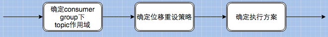

# Kafka

[Kafka 入门介绍-博客链接](<https://lotabout.me/2018/kafka-introduction/>)

[kafka官网](<https://kafka.apache.org/>)

[confluent](<https://www.confluent.io/>)

## 1.相关概念

`massage`： kafka中最基本的传递对象，有固定格式。

`topic`：话题，代表 一类消息，如page view，click行为等。

`producer`： 产生信息的主体，可以是服务器日志信息等。

`consumer`： 消费producer产生话题消息的主体。

`Consumer Group`：每个 Consumer 属于一个特定的 Consumer Group（可为每个 Consumer 指定 group name，若不指定 group name 则属于默认的 group）。

`broker`： 消息处理结点，多个broker组成kafka集群。

`partition`： topic的物理分组，每个partition都是一个有序队列。

`segment`： 多个大小相等的段组成了一个partition。

`offset`： 一个连续的用于定位被追加到分区的每一个消息的序列号，最大值为64位的long大小，19位数字字符长度。

- topic、partition、segment、offset的关系：


- 每个topic可以分为多个partition，一个partition相当于一个大目录，每个partition下面有多个大小相等的segment文件，这个segment是由message组成的，而每一个的segment不一定由大小相等的message组成。segment大小及生命周期在server.properties文件中配置。offset用于定位位于段里的唯一消息。

  

- segment
  - segment由index和data文件组成，两个文件成对出现，分别存储索引和数据。
  - segment文件命名规则：对于所有的partition来说，segment名称从0开始，之后的每一个segment名称为上一个segment文件最后一条消息的offset值。

- offset

对于分区中的一个offset例如等于345552怎么去查找相应的message呢？

> 先找到该message所在的segment文件，通过二分查找的方式寻找小于等于345552的offset，假如叫S的segment符合要求，如果S等于345552则S上一个segment的最后一个message即为所求；如果S小于345552则依次遍历当前segment即可找到。

- topic 和 partition


- kafka消息传递语义

```properties
# 有这么几种可能的delivery guarantee：
At most once 消息可能会丢，但绝不会重复传输
At least one 消息绝不会丢，但可能会重复传输
Exactly once 每条消息肯定会被传输一次且仅传输一次，很多时候这是用户所想要的。
```

- offset更新的方式

```properties
自动提交，设置enable.auto.commit=true，更新的频率根据参数【auto.commit.interval.ms】来定。这种方式也被称为【at most once】，fetch到消息后就可以更新offset，无论是否消费成功。

手动提交，设置enable.auto.commit=false，这种方式称为【at least once】。fetch到消息后，等消费完成再调用方法【consumer.commitSync()】，手动更新offset；如果消费失败，则offset也不会更新，此条消息会被重复消费一次。
```

- 消息分发

  > Kafka 中最基本的数据单元就是消息，而一条消息其实是由 Key + Value 组成的（Key 是可选项，可传空值，Value 也可以传空值）。在发送一条消息时，我们可以指定这个 Key，那么 Producer 会根据 Key 和 partition 机制来判断当前这条消息应该发送并存储到哪个 partition 中（这个就跟分片机制类似）。我们可以根据需要进行扩展 Producer 的 partition 机制（默认算法是 hash 取 %）。

  扩展自己的 partition：

  ```java
  
  package dongguabai.kafka.partition;
   
  import org.apache.kafka.clients.producer.Partitioner;
  import org.apache.kafka.common.Cluster;
  import org.apache.kafka.common.PartitionInfo;
   
  import java.util.List;
  import java.util.Map;
  import java.util.Random;
   
  /**
   * 消息发送后会调用自定义的策略
   *
   * @author Dongguabai
   * @date 2019/1/18 15:40
   */
  public class MyPartitioner implements Partitioner {
   
      @Override
      public int partition(String topic, Object key, byte[] keyBytes, Object value, byte[] valueBytes, Cluster cluster) {
          //获取当前 topic 有多少个分区（分区列表）
          List<PartitionInfo> partitions = cluster.partitionsForTopic(topic);
          int partitionNum = 0;
          if (key == null) { //之前介绍过 Key 是可以传空值的
              partitionNum = new Random().nextInt(partitions.size());   //随机
          } else {
              //取 %
              partitionNum = Math.abs((key.hashCode()) % partitions.size());
          }
          System.out.println("key：" + key + "，value：" + value + "，partitionNum：" + partitionNum);
          //发送到指定分区
          return partitionNum;
      }
   
      @Override
      public void close() {
   
      }
   
      @Override
      public void configure(Map<String, ?> configs) {
   
      }
  }
  ```

  

## 2.实例讲解

### 2.1创建一个 test2 test-demo（注意这里的 partitions 参数为 3）：

```shell
[root@spark-master ~]# kafka-topics --create --partitions 3 --replication-factor 2  --zookeeper spark-master:2181 --topic test-demo

Created topic "test-demo".
```

### 2.2查看`test-demo`

```shell
[root@spark-master ~]# kafka-topics --describe  --zookeeper spark-master:2181 | grep test-demo
Topic:test-demo PartitionCount:3        ReplicationFactor:2     Configs:
      Topic: test-demo        Partition: 0    Leader: 1       Replicas: 1,5   Isr: 1,5
      Topic: test-demo        Partition: 1    Leader: 2       Replicas: 2,1   Isr: 2,1
      Topic: test-demo        Partition: 2    Leader: 3       Replicas: 3,2   Isr: 3,2
```

> PartitionCount:3 表示该话题有3个分区（0，1，2）；Leader1，2，3表示3个分区分别为broker1，2，3；Replicas表示该分区的备份broker id

### 2.3进入kafka数据目录查看

```shell
# broker 1
[root@spark-master ~]# ls /home/data/kafka/kafkadata/ | grep test-demo
test-demo-0
test-demo-1

# broker 2
[root@spark-slave0 ~]# ls /home/data/kafka/kafkadata/ | grep test-demo
test-demo-1
test-demo-2

# broker 5
[root@spark-slave1 ~]# ls /home/data/kafka/kafkadata/ | grep test-demo
test-demo-0

# broker 3
[root@spark-slave2 ~]# ls /home/data/kafka/kafkadata/ | grep test-demo
test-demo-2

```

### 2.4生产数据（producer）

```shell
[root@spark-slave0 ~]# kafka-console-producer --broker-list spark-slave1:9092 --topic test-demo
>hello:world
>question:what is your name?
>answer:jams
```

### 2.5消费数据（consumer）

```shell
[root@spark-slave0 ~]# kafka-console-consumer --bootstrap-server spark-slave1:9092 --topic test-demo [--consumer-property group.id=group_test] --from-beginning
question:what is your name?
answer:jams
hello:world
```

### 2.6查看话题偏移量（offset）

```shell
[root@spark-slave0 confluent-4.0.0]# bin/kafka-consumer-groups --bootstrap-server spark-slave1:9092 --describe --group group_test
Note: This will not show information about old Zookeeper-based consumers.

Consumer group 'group_test' has no active members.

TOPIC                          PARTITION  CURRENT-OFFSET  LOG-END-OFFSET  LAG        CONSUMER-ID                                       HOST                           CLIENT-ID
test-demo                      2          2               2               0          -                                                 -                              -
test-demo                      1          2               2               0          -                                                 -                              -
test-demo                      0          4               4               0          -                                                 -                              -

# current-offset 当前已经消费到偏移量为2,可以理解为已经消费2条。
# log-end-offset可以理解为总共2条记录。
# lag可以理解为未消费记录条数。
```

```shell
$ bin/kafka-run-class kafka.tools.GetOffsetShell --broker-list spark-slave1:9092 --topic test-demo --time -1

test-demo:2:2
test-demo:1:2
test-demo:0:4
```

### 2.7命令行调整offset

前提是：consumer group状态必须是inactive的，即不能是处于正在工作中的状态。

```shell
# kafka-consumer-groups --bootstrap-server spark-slave1:9092 --reset-offsets --group group_test --topic test-demo --to-offset 20 --execute
Note: This will not show information about old Zookeeper-based consumers.


TOPIC                          PARTITION  NEW-OFFSET
test-demo                      2          20
test-demo                      1          20
test-demo                      0          20
```

讲解：



- 确定topic作用域――当前有3种作用域指定方式：--all-topics（为consumer group下所有topic的所有分区调整位移），--topic t1 --topic t2（为指定的若干个topic的所有分区调整位移），--topic t1:0,1,2（为指定的topic分区调整位移）

- 确定位移重设策略――当前支持8种设置规则：

  - --to-earliest：把位移调整到分区当前最小位移
  - --to-latest：把位移调整到分区当前最新位移
  - --to-current：把位移调整到分区当前位移
  - --to-offset <offset>： 把位移调整到指定位移处
  - --shift-by N： 把位移调整到当前位移 + N处，注意N可以是负数，表示向前移动
  - --to-datetime <datetime>：把位移调整到大于给定时间的最早位移处，datetime格式是yyyy-MM-ddTHH:mm:ss.xxx，比如2017-08-04T00:00:00.000
  - --by-duration <duration>：把位移调整到距离当前时间指定间隔的位移处，duration格式是PnDTnHnMnS，比如PT0H5M0S
  - --from-file <file>：从CSV文件中读取调整策略

- 确定执行方案――当前支持3种方案：

- - 什么参数都不加：只是打印出位移调整方案，不具体执行
  - --execute：执行真正的位移调整
  - --export：把位移调整方案按照CSV格式打印，方便用户成csv文件，供后续直接使用

查看kafka数据文件.log

```shell
# --print-data-log 是表示查看消息内容的，不加此项是查看不到详细的消息内容。如果要查看多个log文件可以用逗号分隔。
$ kafka-run-class kafka.tools.DumpLogSegments --files /home/data/kafka/kafkadata/test-demo-1/00000000000000000000.log --print-data-log
```

查看kafka索引文件.index

```shell
$ kafka-run-class kafka.tools.DumpLogSegments --files /home/data/kafka/kafkadata/test-demo-1/00000000000000000000.index
```


## 3.kafka文件存储机制

### 3.1topic中partition存储分布

- 同一个topic下有多个不同partition，每个partition为一个目录，partiton命名规则为topic名称+有序序号

- Partition是一个Queue的结构，每个Partition中的消息都是有序的，生产的消息被不断追加到Partition上，其中的每一个消息都被赋予了一个唯一的offset值。
- Kafka集群会保存所有的消息，不管消息有没有被消费；我们可以**设定消息的过期时间**，只有过期的数据才会被自动清除以释放磁盘空间。
- Kafka只维护在Partition中的offset值，因为这个offsite标识着这个partition的message消费到哪条了。Consumer每消费一个消息，offset就会加1。其实消息的状态完全是由Consumer控制的，Consumer可以跟踪和重设这个offset值，这样的话Consumer就可以读取任意位置的消息。
- Kafka中的topic是以partition的形式存放的，每一个topic都可以设置它的partition数量，Partition的数量决定了组成topic的message的数量。Producer在生产数据时，会按照一定规则（这个规则是可以自定义的）把消息发布到topic的各个partition中。上面将的副本都是以partition为单位的，不过只有一个partition的副本会被选举成leader作为读写用。
- 如何设置partition值
  1. 一个partition只能被一个消费者消费（一个消费者可以同时消费多个partition）因此，如果设置的partition的数量小于consumer的数量，就会有消费者消费不到数据。所以，推荐partition的数量一定要大于同时运行的consumer的数量。
  2. 建议partition的数量大于集群broker的数量，这样leader partition就可以均匀的分布在各个broker中，最终使得集群负载均衡。

### 3.2partiton中文件存储方式 (partition在linux服务器上就是一个目录)

- 每个partion(目录)相当于一个巨型文件被平均分配到多个大小相等segment(段)数据文件中。但每个段segment file消息数量不一定相等，这种特性方便old segment file快速被删除。
- 每个partiton只需要支持顺序读写就行了，segment文件生命周期由**服务端配置参数**决定。

### 3.3partiton中segment文件存储结构

producer发message到某个topic，message会被均匀的分布到多个partition上（随机或根据用户指定的回调函数进行分布），kafka broker收到message往对应partition的最后一个segment上添加该消息，当某个segment上的消息条数达到配置值或消息发布时间超过阈值时，segment上的消息会被flush到磁盘，只有flush到磁盘上的消息consumer才能消费，segment达到一定的大小后将不会再往该segment写数据，broker会创建新的segment。


每个part在内存中对应一个index，记录每个segment中的第一条消息偏移。

- segment file组成：由2大部分组成，分别为index file和data file，此2个文件一一对应，成对出现，后缀".index"和“.log”分别表示为segment索引文件、数据文件.
- segment文件命名规则：partion全局的第一个segment从0开始，后续每个segment文件名为上一个全局partion的最大offset(偏移message数)。数值最大为64位long大小，19位数字字符长度，没有数字用0填充。


每个segment中存储很多条消息，消息id由其逻辑位置决定，即从消息id可直接定位到消息的存储位置，避免id到位置的额外映射。

下面文件列表是笔者在Kafka broker上做的一个实验，创建一个topicXXX包含1 partition，设置每个segment大小为500MB,并启动producer向Kafka broker写入大量数据,如下图2所示segment文件列表形象说明了上述2个规则：


以上述图2中一对segment file文件为例，说明segment中index<―->data file对应关系物理结构如下：


上述图3中索引文件存储大量元数据，数据文件存储大量消息，索引文件中元数据指向对应数据文件中message的物理偏移地址。其中以索引文件中 元数据3,497为例，依次在数据文件中表示第3个message(在全局partiton表示第368772个message)、以及该消息的物理偏移 地址为497。

从上述图3了解到segment data file由许多message组成，下面详细说明message物理结构如下：


### 参数说明：

| 关键字              | 解释说明                                                     |
| :------------------ | :----------------------------------------------------------- |
| 8 byte offset       | 在parition(分区)内的每条消息都有一个有序的id号，这个id号被称为偏移(offset),它可以唯一确定每条消息在parition(分区)内的位置。即**offset表示partiion的第多少message** |
| 4 byte message size | message大小                                                  |
| 4 byte CRC32        | 用crc32校验message                                           |
| 1 byte “magic"      | 表示本次发布Kafka服务程序协议版本号                          |
| 1 byte “attributes" | 表示为独立版本、或标识压缩类型、或编码类型。                 |
| 4 byte key length   | 表示key的长度,当key为-1时，K byte key字段不填                |
| K byte key          | 可选                                                         |
| value bytes payload | 表示实际消息数据。                                           |

### 3.4在partition中如何通过offset查找message

例如读取offset=368776的message，需要通过下面2个步骤查找。

- 第一步查找segment file

  上述图2为例，其中00000000000000000000.index表示最开始的文件，起始偏移量(offset)为0.第二个文件 00000000000000368769.index的消息量起始偏移量为368770 = 368769 + 1.同样，第三个文件00000000000000737337.index的起始偏移量为737338=737337 + 1，其他后续文件依次类推，以起始偏移量命名并排序这些文件，只要根据offset **二分查找**文件列表，就可以快速定位到具体文件。

  当offset=368776时定位到00000000000000368769.index|log

- 第二步通过segment file查找message通过第一步定位到segment file，当offset=368776时，依次定位到00000000000000368769.index的元数据物理位置和 00000000000000368769.log的物理偏移地址，然后再通过00000000000000368769.log顺序查找直到 offset=368776为止。

segment index file采取稀疏索引存储方式，它减少索引文件大小，通过mmap可以直接内存操作，稀疏索引为数据文件的每个对应message设置一个元数据指针,它 比稠密索引节省了更多的存储空间，但查找起来需要消耗更多的时间。

## 4.Kafka 生产者-消费者

### 4.1Producers

- Producers直接发送消息到broker上的leader partition，不需要经过任何中介或其他路由转发。为了实现这个特性，kafka集群中的每个broker都可以响应producer的请求，并返回topic的一些元信息，这些元信息包括哪些机器是存活的，topic的leader partition都在哪，现阶段哪些leader partition是可以直接被访问的。

- **Producer客户端自己控制着消息被推送到哪些partition。**实现的方式可以是随机分配、实现一类随机负载均衡算法，或者指定一些分区算法。Kafka提供了接口供用户实现自定义的partition，用户可以为每个消息指定一个partitionKey，通过这个key来实现一些hash分区算法。比如，把userid作为partitionkey的话，相同userid的消息将会被推送到同一个partition。

- 以`Batch`的方式推送数据可以极大的提高处理效率，kafka Producer 可以将消息在内存中累计到一定数量后作为一个batch发送请求。Batch的数量大小可以通过Producer的参数控制，参数值可以设置为累计的消息的数量（如500条）、累计的时间间隔（如100ms）或者累计的数据大小(64KB)。通过增加batch的大小，可以减少网络请求和磁盘IO的次数，当然具体参数设置需要在效率和时效性方面做一个权衡。

- Producers可以异步的并行的向kafka发送消息，但是通常producer在发送完消息之后会得到一个future响应，返回的是offset值或者发送过程中遇到的错误。这其中有个非常重要的参数“acks”,这个参数决定了producer要求leader partition 收到确认的副本个数，如果acks设置数量为0，表示producer不会等待broker的响应，所以，producer无法知道消息是否发送成功，这样有可能会导致数据丢失，但同时，acks值为0会得到最大的系统吞吐量。

  若acks设置为1，表示producer会在leader partition收到消息时得到broker的一个确认，这样会有更好的可靠性，因为客户端会等待直到broker确认收到消息。若设置为-1，producer会在所有备份的partition收到消息时得到broker的确认，这个设置可以得到最高的可靠性保证。

- Kafka没有限定单个消息的大小，但我们推荐消息大小不要超过1MB,通常一般消息大小都在1~10k

### 4.2Consumers

- Kafka提供了两套consumer api，分为`high-level api`和`sample-api`。

  - **Sample-api** 是一个底层的API，通过直接操作底层API获取数据的方式获取Kafka中的数据，需要自行给定分区、偏移量等属性。优点：可操作性强；缺点：代码相对而言比较复杂。(入口类：SimpleConsumer) 
  - **High Level Consumer API**：高度抽象的Kafka消费者API；将底层具体获取数据、更新offset、设置偏移量等操作屏蔽掉，直接将操作数据流的处理工作提供给编写程序的人员。优点是：操作简单；缺点：可操作性太差，无法按照自己的业务场景选择处理方式。(入口类：ConsumerConnector)

- **在kafka中，当前读到哪条消息的offset值是由consumer来维护的**，因此，consumer可以自己决定如何读取kafka中的数据。比如，consumer可以通过重设offset值来重新消费已消费过的数据。不管有没有被消费，kafka会保存数据一段时间，这个时间周期是**可配置**的，只有到了过期时间，kafka才会删除这些数据。

- High-level API封装了对集群中一系列broker的访问，可以透明的消费一个topic。它自己维持了已消费消息的状态，即每次消费的都是下一个消息。

  High-level API还支持以组的形式消费topic，如果consumers有同一个组名，那么kafka就相当于一个队列消息服务，而各个consumer均衡的消费相应partition中的数据。若consumers有不同的组名，那么此时kafka就相当与一个广播服务，会把topic中的所有消息广播到每个consumer。

  

  High level api和Low level api是针对consumer而言的，和producer无关。

  

  High level api是consumer读的partition的offsite是存在zookeeper上。High level api 会启动另外一个线程去每隔一段时间，offsite自动同步到zookeeper上。换句话说，如果使用了High level api， 每个message只能被读一次，一旦读了这条message之后，无论我consumer的处理是否ok。High level api的另外一个线程会自动的把offiste+1同步到zookeeper上。如果consumer读取数据出了问题，offsite也会在zookeeper上同步。因此，如果consumer处理失败了，会继续执行下一条。这往往是不对的行为。因此，Best Practice是一旦consumer处理失败，直接让整个conusmer group抛Exception终止，但是最后读的这一条数据是丢失了，因为在zookeeper里面的offsite已经+1了。等再次启动conusmer group的时候，已经从下一条开始读取处理了。

  

  Low level api是consumer读的partition的offsite在consumer自己的程序中维护。不会同步到zookeeper上。但是为了kafka manager能够方便的监控，一般也会手动的同步到zookeeper上。这样的好处是一旦读取某个message的consumer失败了，这条message的offsite我们自己维护，我们不会+1。下次再启动的时候，还会从这个offsite开始读。这样可以做到exactly once对于数据的准确性有保证。

- Consumer与Partition的关系：
  - 如果consumer比partition多，是浪费，因为kafka的设计是在一个partition上是不允许并发的，所以consumer数不要大于partition数
  - 如果consumer比partition少，一个consumer会对应于多个partitions，这里主要合理分配consumer数和partition数，否则会导致partition里面的数据被取的不均匀
  - 如果consumer从多个partition读到数据，不保证数据间的顺序性，kafka只保证在一个partition上数据是有序的，但多个partition，根据你读的顺序会有不同
  - 增减consumer，broker，partition会导致rebalance，所以rebalance后consumer对应的partition会发生变化
  - High-level接口中获取不到数据的时候是会block的