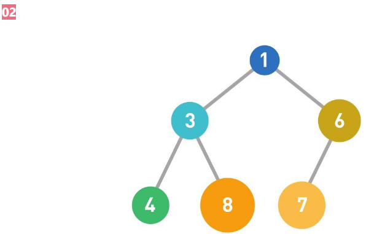

[TOC]


# 概览


# 线性表

线性表：零个或者多个数据元素的有限序列。

性质：

- 数据元素可以为空
- 数据元素有限
- 数据元素之间的逻辑结构为线性结构，也就是一对一的关系
- 数据元素类型相同


线性表根据在计算机的储存方式可以分为两种：

- 顺序线性表
- 链式线性表


## 顺序线性表

顺序线性表：使用一段连续的地址存储单元放置线性表的数据元素。->数组

顺序线性表的优缺点：

> 优点：
>
> - 可以快速获取下标的数据元素，时间复杂度为O(1)
> - 逻辑关系是一对一的关系，连续存储单元足以储存，不需要增加额外的存储空间
>
> 缺点：
> - 插入和删除操作需要移动大量的元素，时间复杂度为O(n)
> - 线性表的存储空间大小难以确定，并且不好扩展
> - 造成存储空间碎片


- AyyayList
- Vector


## 链式线性表

链式线性表：线性表的数据元素可以存储在随意的存储单元，每一个节点不仅仅包括数据元素还有一个指向下一个节点的指针（基本的单链表）。


链式（单链表）和顺序线性表优缺点对比：

> 存储分配方式：
> - 顺序 -> 一段地址连续的存储空间
> - 链式 -> 任意地址存储空间
>
> 时间性能：
> - 查找
>   顺序 -> O(1)
>   链式 -> O(n)
> - 插入和删除
>   顺序 -> O(n)
>   链式 -> 寻找相应的节点，时间复杂度为O(n)，然后，插入和删除为O(1)
>
> 空间性能：
> - 顺序 -> 需要提前分配存储空间，分配大了，浪费空间，分配小了，容易发生上溢
> - 链式 -> 不需要提前分配空间，只要有存储空间分配就行，数据元素个数只受可分配存储空间大小的限制


### 链式线性表的基本分类

#### 单向链表

```java
public class Linked<E> {

    private static class Node<E>{
        private E item;
        private Node<E> next;

        Node(E data, Node<E> next) {
            this.item = data;
            this.next = next;
        }
    }
}
```


#### 静态链表

使用顺序结构实现链式线性表

```java
public class StaticLinked<E> {

    private static class Node<E> {
        /**
	         * 数据
	         */
        E item;
        /**
	         * 后续引用的数组下标
	         * 默认情况下，应该是当前size
	         */
        Integer nextIndex;
    }

    Node[] linkeds;

    /**
	     * getter&setter&general functions
	     */
}
```


#### 双向链表

每个节点除了数据元素，还包含一个指向上一个节点的指针和一个指向下一个节点的指针

```java
public class DoublyLinked<E> {

    private static class Node<E>{
        /**
	         * 前驱引用
	         */
        private Node<E> pre;
        /**
	         * 当前
	         */
        private E item;
        /**
	         * 后续引用
	         */
        private Node<E> next;
    }

    /**
	* getter&setter&general functions
	*/
}
```


#### 循环链表

线性表的尾部指向头节点，形成一个闭环

```java
public class CircleLinked<E> {

    private static class Node<E> {
        private Node<E> pre;
        private E item;
        /**
	         * 如果是终端结点，这里保存的是第一个结点的引用地址
	         * 从而形成一个闭环
	         */
        private Node<E> next;
    }

    /**
	     * getter&setter&general functions
	     */
}
```


# 堆

> 基于堆的优先队列 PriorityQueue

- 大顶堆
- 小顶堆

堆是一种图的树形结构，被用于实现“优先队列”（priority queues）

> 优先队列是一种数据结构，可以自由添加数据，但取出数据时要从最小值开始按顺序取出。

在堆的树形结构中，各个顶点被称为“结点”（node），数据就存储在这些结点中。


- 存储规则

> 子结点必定大于父结点。因此，最小值被存储在顶端的根结点中。
>
> 往堆中添加数据时，为了遵守这条规则，一般会把新数据放在最下面一行靠左的位置。当最下面一行里没有多余空间时，就再往下另起一行，把数据加在这一行的最左端。


这就是堆的示例。结点内的数字就是存储的数据。堆中的每个结点最多有两个子结点。树的形状取决于数据的个数。另外，结点的排列顺序为从上到下，同一行里则为从左到右。




此时往堆里添加数字5。


首先寻找新数据的位置。该图中最下面一排空着一个位置，所以将数据加在此处。


如果父结点大于子结点，则不符合上文提到的规则，因此需要交换父子结点的位置。


这里由于父结点的6大于子结点的5，所以交换了这两个数字。重复这样的操作直到数据都符合规则，不再需要交换为止。


现在，父结点的1小于子结点的5，父结点的数字更小，所以不再交换。


这样，往堆中添加数据的操作就完成了。


从堆中取出数据时，取出的是最上面的数据。这样，堆中就能始终保持最上面的数据最小。


由于最上面的数据被取出，因此堆的结构也需要重新调整。


按照01中说明的排列顺序，将最后的数据（此处为6）移动到最顶端。


如果子结点的数字小于父结点的，就将父结点与其左右两个子结点中较小的一个进行交换。


这里由于父结点的6大于子结点（右）的5大于子结点（左）的3，所以将左边的子结点与父结点进行交换。重复这个操作直到数据都符合规则，不再需要交换为止。


现在，子结点（右）的8大于父结点的6大于子结点（左）的4，需要将左边的子结点与父结点进行交换。


这样，从堆中取出数据的操作便完成了。


**总结**

堆中最顶端的数据始终最小，所以无论数据量有多少，取出最小值的时间复杂度都为O（1）。

另外，因为取出数据后需要将最后的数据移到最顶端，然后一边比较它与子结点数据的大小，一边往下移动，所以取出数据需要的运行时间和树的高度成正比。假设数据量为n，根据堆的形状特点可知树的高度为log2n，那么重构树的时间复杂度便为O（logn）。

添加数据也一样。在堆的最后添加数据后，数据会一边比较它与父结点数据的大小，一边往上移动，直到满足堆的条件为止，所以添加数据需要的运行时间与树的高度成正比，也是O（logn）。


# 栈与队列

## 栈

- LIFO，入口和出口为同一个

- java.util.Stack

## 队列

- FIFO，数据只能通过队尾添加，从队列头取出

- Queue


# 树

## 二叉树

- 定义： 二叉树的每个结点至多只有二棵子树(不存在度大于2的结点)，二叉树的子树有左右之分，次序不能颠倒。二叉树的第i层至多有2i-1个结点；深度为k的二叉树至多有2k-1个结点

- 二叉树的示例


### 满二叉树

定义：除最后一层无任何子节点外，每一层上的所有结点都有两个子结点。也可以这样理解，除叶子结点外的所有结点均有两个子结点。节点数达到最大值，所有叶子结点必须在同一层上。

- 性质：

1) 一颗树深度为h，最大层数为k，深度与最大层数相同，k=h; 
2) 叶子数为2h; 
3) 第k层的结点数是：2k-1; 
4) 总结点数是：2k-1，且总节点数一定是奇数。  

### 完全二叉树

- 定义

若设二叉树的深度为h，除第 h 层外，其它各层 (1～(h-1)层) 的结点数都达到最大个数，第h层所有的结点都连续集中在最左边，这就是完全二叉树。

- 示例
  

### 二叉查找树/二叉排序树/二叉搜索树

- 特点：

1) 若左子树不空，则左子树上所有结点的值均小于它的根结点的值；
2) 若右子树不空，则右子树上所有结点的值均大于或等于它的根结点的值；
3) 左、右子树也分别为二叉查找树；
4) 没有键值相等的节点。  

- 性质：

对二叉查找树进行中序遍历，即可得到有序的数列。

- 时间复杂度：

它和二分查找一样，插入和查找的时间复杂度均为O(logn)，但是在最坏的情况下仍然会有O(n)的时间复杂度。  

原因在于插入和删除元素的时候，树没有保持平衡。

我们追求的是在最坏的情况下仍然有较好的时间复杂度，这就是平衡查找树设计的初衷。

- 二叉查找树的高度决定了二叉查找树的查找效率。

- 示例


### 平衡二叉树/AVL树

也叫平衡二叉查找树，AVL树，平衡二叉树的提出就是为了保证树不至于太倾斜，尽量保证两边平衡。

- 性质：

> 它是一 棵空树
>
> 它的左右两个子树的高度差的绝对值不超过1
>
> 左右两个子树都是一棵平衡二叉树。  

- 特性

在平衡二叉搜索树中可以看到，其高度一般都良好地维持在O(log2n)，大大降低了操作的时间复杂度。

严格的平衡二叉树


- 适用场景

AVL树适合用于插入与删除次数比较少，但查找多的情况。这时AVL还是较优于红黑树


- 示例


- 单旋转

单旋转是针对于左左和右右这两种情况的解决方案，这两种情况是对称的，只要解决了左左这种情况，右右就很好办了。
下图是左左情况的解决方案，节点k2不满足平衡特性，因为它的左子树k1比右子树Z深2层，而且k1子树中，更深的一层的是k1的左子树X子树，所以属于左左情况。


为使树恢复平衡，我们把k2变成这棵树的根节点，因为k2大于k1，把k2置于k1的右子树上，而原本在k1右子树的Y大于k1，小于k2，
就把Y置于k2的左子树上，这样既满足了二叉查找树的性质，又满足了平衡二叉树的性质。

这样的操作只需要一部分指针改变，结果我们得到另外一颗二叉查找树，它是一棵AVL树，因为X向上一移动了一层，
Y还停留在原来的层面上，Z向下移动了一层。整棵树的新高度和之前没有在左子树上插入的高度相同，插入操作使得X高度长高了。
因此，由于这颗子树高度没有变化，所以通往根节点的路径就不需要继续旋转了。

- 双旋转

对于左右和右左这两种情况，单旋转不能使它达到一个平衡状态，要经过两次旋转。双旋转是针对于这两种情况的解决方案，
同样的，这样两种情况也是对称的，只要解决了左右这种情况，右左就很好办了。
下图是左右情况的解决方案，节点k3不满足平衡特性，因为它的左子树k1比右子树Z深2层，而且k1子树中，
更深的一层的是k1的右子树k2子树，所以属于左右情况。


为使树恢复平衡，我们需要进行两步，第一步，把k1作为根，进行一次右右旋转，旋转之后就变成了左左情况，
所以第二步再进行一次左左旋转，最后得到了一棵以k2为根的平衡二叉树。

### 红黑树

抛开了AVL树的平衡条件（左右子树高度差最多差1），但是提出了节点颜色的概念。它是用非严格的平衡来换取增删节点时候旋转次数的降低。任何不平衡都可以在3次旋转之内解决。

- 描述

红黑树是一种自平衡二叉查找树。  

虽然它是复杂的，但它的操作有着良好的最坏情况运行时间，并且在实践中是高效的

>  它可以在O(logn)时间内做查找,插入和删除，这里的n是树中元素的数目。

- 性质

红黑树是每个节点都带有颜色属性的**二叉查找树**，颜色为红色或黑色。在二叉查找树强制的一般要求以外，对于任何有效的红黑树我们增加了如下的额外要求:

> 性质1. 节点是红色或黑色。 
>
> 性质2. 根是黑色。 
>
> 性质3. 所有叶子都是黑色（叶子是NIL节点）。 
>
> 性质4. 每个红色节点必须有两个黑色的子节点。(从每个叶子到根的所有路径上不能有两个连续的红色节点。) 
>
> 性质5. 从任一节点到其每个叶子的所有简单路径都包含相同数目的黑色节点。 

- 图例


- 红黑树的自平衡性
- 红黑树的应用

> jdk TreeMap
>
> IO多路复用的epoll的的的实现采用红黑树组织管理的的的sockfd，以支持快速的增删改查;
>
> linux 虚拟内存管理


### AVL树对比红黑树

AVL 树是高度平衡的树, 每一次对树的修改, 都要 rebalance, 这里的开销会比红黑树大。

红黑树插入只要两次旋转, 删除至多三次旋转。

AVL 树搜索的效率是非常稳定的，选取红黑树, 是一种折中的方案


> 1. 如果插入一个node引起了树的不平衡，AVL和RB-Tree都是最多只需要2次旋转操作，即两者都是O(1)；但是在删除node引起树的不平衡时，最坏情况下，AVL需要维护从被删node到root这条路径上所有node的平衡性，因此需要旋转的量级O(logN)，而RB-Tree最多只需3次旋转，只需要O(1)的复杂度。
> 2. 其次，AVL的结构相较RB-Tree来说更为平衡，在插入和删除node更容易引起Tree的unbalance，因此在大量数据需要插入或者删除时，AVL需要rebalance的频率会更高。因此，RB-Tree在需要大量插入和删除node的场景下，效率更高。自然，由于AVL高度平衡，因此AVL的search效率更高。
> 3. 红黑树的查询性能略微逊色于AVL树，因为他比avl树会稍微不平衡最多一层，也就是说红黑树的查询性能只比相同内容的avl树最多多一次比较，但是，红黑树在插入和删除上优于avl树很多，avl树每次插入删除会进行大量的平衡度计算，而红黑树为了维持红黑性质所做的红黑变换和旋转的开销，相较于avl树为了维持平衡的开销要小得多


### 堆与二叉堆

- 堆的定义：

[性质一] 堆中任意节点的值总是不大于(不小于)其子节点的值； 
[性质二] 堆总是一棵完全树。

- 将任意节点不大于其子节点的堆叫做**最小堆**或小根堆，而将任意节点不小于其子节点的堆叫做**最大堆**或大根堆。

- 二叉堆

二叉堆是完全二元树或者是近似完全二元树，它分为两种：最大堆和最小堆。

最大堆：父结点的键值总是大于或等于任何一个子节点的键值； 
最小堆：父结点的键值总是小于或等于任何一个子节点的键值。

- 图示


- 二叉堆的实现

二叉堆一般都通过"数组"来实现。数组实现的二叉堆，父节点和子节点的位置存在一定的关系。 
有时候，我们将"二叉堆的第一个元素"放在数组索引0的位置，有时候放在1的位置。 
当然，它们的本质一样(都是二叉堆)，只是实现上稍微有一丁点区别。 
假设"第一个元素"在数组中的索引为 0 的话，则父节点和子节点的位置关系如下：  

	(01) 索引为i的左孩子的索引是 (2*i+1);
	(02) 索引为i的左孩子的索引是 (2*i+2);
	(03) 索引为i的父结点的索引是 floor((i-1)/2);


假设"第一个元素"在数组中的索引为 1 的话，则父节点和子节点的位置关系如下：
	
	(01) 索引为i的左孩子的索引是 (2*i);
	(02) 索引为i的左孩子的索引是 (2*i+1);
	(03) 索引为i的父结点的索引是 floor(i/2);


## b树

B树是一种用于查找的平衡树，但是它不是二叉树，而是一种多叉树。

- 定义

  B树（B-tree）是一种树状数据结构，能够用来存储排序后的数据。 

  这种数据结构能够让查找数据、循序存取、插入数据及删除的动作，都在对数时间内完成。 

  概括来说是一个一般化的二叉查找树，可以拥有多于2个子节点。 

  这种数据结构常被应用在数据库和文件系统的实作上。

- B树中查找给定关键字的方法

	在B树中查找给定关键字的方法是，首先把根结点取来，在根结点所包含的关键字K1,…,Kn查找给定的关键字（可用顺序查找或二分查找法），若找到等于给定值的关键字，则查找成功；
	
	否则，一定可以确定要查找的关键字在Ki与Ki+1之间，Pi为指向子树根节点的指针，此时取指针Pi所指的结点继续查找，直至找到，或指针Pi为空时查找失败。  


B树作为一种多路搜索树（并不是二叉的）

	1) 定义任意非叶子结点最多只有M个儿子；且M>2；
	2) 根结点的儿子数为[2, M]；
	3) 除根结点以外的非叶子结点的儿子数为[M/2, M]；
	4) 每个结点存放至少M/2-1（取上整）和至多M-1个关键字；（至少2个关键字）
	5) 非叶子结点的关键字个数=指向儿子的指针个数-1；
	6) 非叶子结点的关键字：K[1], K[2], …, K[M-1]；且K[i] < K[i+1]；
	7) 非叶子结点的指针：P[1], P[2], …, P[M]；其中P[1]指向关键字小于K[1]的子树，P[M]指向关键字大于K[M-1]的子树，
	其它P[i]指向关键字属于(K[i-1], K[i])的子树；
	8) 所有叶子结点位于同一层；


- B-树的特性：

	1.关键字集合分布在整颗树中； 
	2.任何一个关键字出现且只出现在一个结点中； 
	3.搜索有可能在非叶子结点结束； 
	4.其搜索性能等价于在关键字全集内做一次二分查找； 
	5.自动层次控制； 
	由于限制了除根结点以外的非叶子结点，至少含有M/2个儿子，确保了结点的至少利用率


## b+树

- B+树是B树的变体，也是一种多路搜索树：

	1) 其定义基本与B-树相同
	
	2) 非叶子结点的子树指针与关键字个数相同
	
	3) 非叶子结点的子树指针P[i]，指向关键字值属于[K[i], K[i+1])的子树（B-树是开区间，B+树是闭区间）
	
	4) 为所有叶子结点增加一个指针
	
	5) 所有关键字都在叶子结点出现


下图为M=3的B+树的示意图：


B+树的搜索与B树也基本相同，区别是B+树只有达到叶子结点才命中（B树可以在非叶子结点命中），其性能也等价于在关键字全集做一次二分查找；

- B+的性质

	1.所有关键字都出现在叶子结点的链表中（稠密索引），且链表中的关键字恰好是有序的
	
	2.不可能在非叶子结点命中； 
	
	3.非叶子结点相当于是叶子结点的索引（稀疏索引），叶子结点相当于是存储（关键字）数据的数据层
	
	4.更适合文件索引系统。  

<https://www.cs.usfca.edu/~galles/visualization/BPlusTree.html>

B+树创建：


# 散列表

哈希表（Hash Table）：也叫散列表，是根据关键码值（key-value）而直接进行访问的数据结构，也就是我们常用到的map。

> 数组的最大特点就是：寻址容易，插入和删除困难；
>
> 而链表正好相反，寻址困难，而插入和删除操作容易。
>
> 那么如果能够结合两者的优点，做出一种寻址、插入和删除操作同样快速容易的数据结构，那该有多好。这就是哈希表创建的基本思想


哈希函数/散列函数：是Hash表的映射函数，它可以把任意长度的输入变换成固定长度的输出，该输出就是哈希值。


哈希表和哈希函数的标准定义：若关键字为k，则其值存放在f(k)的存储位置上。由此，不需比较便可直接取得所查记录。称这个对应关系f为哈希函数，按这个思想建立的表为哈希表。


## 哈希表定址

常用的“定址”的手法有“五种”：

1. 直接定址法：很容易理解，key=Value+C；这个“C”是常量。Value+C其实就是一个简单的哈希函数。
2. 除法取余法：key=value%C
3. 数字分析法：这种蛮有意思，比如有一组value1=112233，value2=112633，value3=119033，针对这样的数我们分析数中间两个数比较波动，其他数不变。那么我们取key的值就可以是key1=22,key2=26,key3=90。
4. 平方取中法
5. 折叠法：举个例子，比如value=135790，要求key是2位数的散列值。那么我们将value变为13+57+90=160，然后去掉高位“1”,此时key=60，哈哈，这就是他们的哈希关系，这样做的目的就是key与每一位value都相关，来做到“散列地址”尽可能分散的目地。


## 哈希冲突

Hash表解决冲突的方法主要有以下几种


### 链接地址法

将哈希值相同的数据元素存放在一个链表中，在查找哈希表的过程中，当查找到这个链表时，必须采用线性查找方法。


### 开放定址法

也叫再散列法，当关键字`key`的哈希地址`p=H（key）`出现冲突时，以`p`为基础，产生另一个哈希地址`p1`，如果`p1`仍然冲突，再以`p`为基础，产生另一个哈希地址`p2，…，`直到找出一个不冲突的哈希地址`pi`，将相应元素存入其中。

通常都是用以下公式计算：`Hi=（H（key）+di）% m i=1，2，…，n`

其中`H（key）`为哈希函数，`m` 为表长，`di`称为增量序列。增量序列的取值方式不同，相应的再散列方式也不同。

主要有三种

#### 线性探测再散列

`dii=1，2，3，…，m-1`

冲突发生时，顺序查看表中下一单元，直到找出一个空单元或查遍全表

#### 二次探测再散列

`di=12，-12，22，-22，…，k2，-k2 ( k<=m/2 )`

冲突发生时，在表的左右进行跳跃式探测，直到找到空单元。这种方法的特点是：冲突发生时，在表的左右进行跳跃式探测，比较灵活。

#### 伪随机探测再散列

`di=伪随机数序列`


### 再哈希法

多写几个哈希函数，算出来一个`hashcode`重复的就用另一个哈希函数算，直到算出来不一样。

发生冲突时就换一个散列函数计算，总会有一个可以把冲突解决掉，它能够使得关键字不产生聚集，但相应地增加了计算的时间。


### 建立公共溢出区法

其实就是为所有的冲突，额外开辟一块存储空间。如果相对基本表而言，冲突的数据很少的时候，使用这种方法比较合适。


# 跳跃表

跳表(skip List)是一种随机化的数据结构，基于并联的链表，实现简单，插入、删除、查找的复杂度均为O(logN)。

简单说来跳表也是链表的一种，只不过它在链表的基础上增加了跳跃功能，正是这个跳跃的功能，使得在查找元素时，跳表能够提供O(logN)的时间复杂度。


## 引言

先来看一个有序链表


在这样一个链表中，如果我们要查找某个数据，那么需要从头开始逐个进行比较，直到找到包含数据的那个节点，或者找到第一个比给定数据大的节点为止（没找到）。也就是说，时间复杂度为O(n)。同样，当我们要插入新数据的时候，也要经历同样的查找过程，从而确定插入位置。


假如我们每相邻两个节点增加一个指针，让指针指向下下个节点


这样所有新增加的指针连成了一个新的链表，但它包含的节点个数只有原来的一半（上图中是7, 19, 26）。现在当我们想查找数据的时候，可以先沿着这个新链表进行查找。当碰到比待查数据大的节点时，再回到原来的链表中进行查找。比如，我们想查找23，查找的路径是沿着下图中标红的指针所指向的方向进行的：


在这个查找过程中，由于新增加的指针，我们不再需要与链表中每个节点逐个进行比较了。需要比较的节点数大概只有原来的一半。

利用同样的方式，我们可以在上层新产生的链表上，继续为每相邻的两个节点增加一个指针，从而产生第三层链表。如下图：


可以想象，当链表足够长的时候，这种多层链表的查找方式能让我们跳过很多下层节点，大大加快查找的速度。

`skiplist`正是受这种多层链表的想法的启发而设计出来的。


## 不足

实际上，按照上面生成链表的方式，上面每一层链表的节点个数，是下面一层的节点个数的一半，这样查找过程就

非常类似于一个二分查找，使得查找的时间复杂度可以降低到O(log n)。


但是，这种方法在插入数据的时候有很大的问题：

```properties
新插入一个节点之后，就会打乱上下相邻两层链表上节点个数严格的2比1的对应关系。

如果要维持这种对应关系，就必须把新插入的节点后面的所有节点（也包括新插入的节点）重新进行调整，这会让时间复杂度重新蜕化成O(n)。

删除数据也有同样的问题。
```


## 改进

`skiplist`为了避免这一问题，它不要求上下相邻两层链表之间的节点个数有严格的对应关系，而是为每个节点随机出一个层数(`level`)。

比如，一个节点随机出的层数是3，那么就把它链入到第1层到第3层这三层链表中。

下图展示了如何通过一步步的插入操作从而形成一个`skiplist`的过程：


从上面skiplist的创建和插入过程可以看出，<font color=#00dd00>每一个节点的层数（level）是随机出来的，而且新插入一个节点不会影响其它节点的层数。</font>

因此，插入操作只需要修改插入节点前后的指针，而不需要对很多节点都进行调整。这就降低了插入操作的复杂度。

实际上，这是skiplist的一个很重要的特性，这让它在插入性能上明显优于平衡树的方案。


skiplist，指的就是除了最下面第1层链表之外，它会产生若干层稀疏的链表，这些链表里面的指针故意跳过了一些节点（而且越高层的链表跳过的节点越多）。

这就使得我们在查找数据的时候能够先在高层的链表中进行查找，然后逐层降低，最终降到第1层链表来精确地确定数据位置。

在这个过程中，我们跳过了一些节点，从而也就加快了查找速度。


刚刚创建的这个skiplist总共包含4层链表，现在假设我们在它里面依然查找23，下图给出了查找路径：


需要注意的是，前面演示的各个节点的插入过程，实际上在插入之前也要先经历一个类似的查找过程，在确定插入位置后，再完成插入操作。


实际应用中的skiplist每个节点应该包含key和value两部分。前面的描述中我们没有具体区分key和value，但实际上列表中是按照key(score)进行排序的，查找过程也是根据key在比较。


执行插入操作时计算随机数的过程，是一个很关键的过程，它对skiplist的统计特性有着很重要的影响。这并不是一个普通的服从均匀分布的随机数，它的计算过程如下：

- 首先，每个节点肯定都有第1层指针（每个节点都在第1层链表里）。
- 如果一个节点有第i层(i>=1)指针（即节点已经在第1层到第i层链表中），那么它有第(i+1)层指针的概率为p。
- 节点最大的层数不允许超过一个最大值，记为MaxLevel。

这个计算随机层数的伪码如下所示：

```java
randomLevel()
    level := 1
    // random()返回一个[0...1)的随机数
    while random() < p and level < MaxLevel do
        level := level + 1
    return level
    
// randomLevel()的伪码中包含两个参数，一个是p，一个是MaxLevel。    
```


## skiplist与平衡树、哈希表的比较

- skiplist和各种平衡树（如AVL、红黑树等）的元素是有序排列的，而哈希表不是有序的。因此，在哈希表上只能做单个key的查找，不适宜做范围查找。所谓范围查找，指的是查找那些大小在指定的两个值之间的所有节点。
- 在做范围查找的时候，平衡树比skiplist操作要复杂。在平衡树上，我们找到指定范围的小值之后，还需要以中序遍历的顺序继续寻找其它不超过大值的节点。如果不对平衡树进行一定的改造，这里的中序遍历并不容易实现。而在skiplist上进行范围查找就非常简单，只需要在找到小值之后，对第1层链表进行若干步的遍历就可以实现。
- 平衡树的插入和删除操作可能引发子树的调整，逻辑复杂，而skiplist的插入和删除只需要修改相邻节点的指针，操作简单又快速。
- 从内存占用上来说，skiplist比平衡树更灵活一些。一般来说，平衡树每个节点包含2个指针（分别指向左右子树），而skiplist每个节点包含的指针数目平均为1/(1-p)，具体取决于参数p的大小。如果像Redis里的实现一样，取p=1/4，那么平均每个节点包含1.33个指针，比平衡树更有优势。
- 查找单个key，skiplist和平衡树的时间复杂度都为O(log n)，大体相当；而哈希表在保持较低的哈希值冲突概率的前提下，查找时间复杂度接近O(1)，性能更高一些。所以我们平常使用的各种Map或dictionary结构，大都是基于哈希表实现的。
- 从算法实现难度上来比较，skiplist比平衡树要简单得多。


## 应用

- JDK concurrentSkipListMap

  > TreeMap的线程安全版本

- redis zset

  ```c
  /* 有序集 */
  typedef struct zset {
      // 字典
      dict *dict;
      // 跳跃表
      zskiplist *zsl;
  } zset;
  /*
  dict用来查询数据到分数的对应关系，skiplist用来根据分数查询数据（可能是范围查找）。
  */
  ```


# 图

图由节点（node）和边（edge）组成。

图G由顶点集V和边集E组成，记为G=(V,E)，其中V(G)表示图G中顶点的有限非空集；E(G)表示图G中顶点之间的关系(边)的集合。

**注意：线性表可以是空表，树可以是空树，图不可以是空图，图可以没有边，但是至少要有一个顶点**。


## 深度优先搜索（Depth First Search，DFS）


## 广度优先搜索（Breadth First Search，BFS）


## 无向图

## 有向图

## 简单图

## 完全图

## 有向完全图