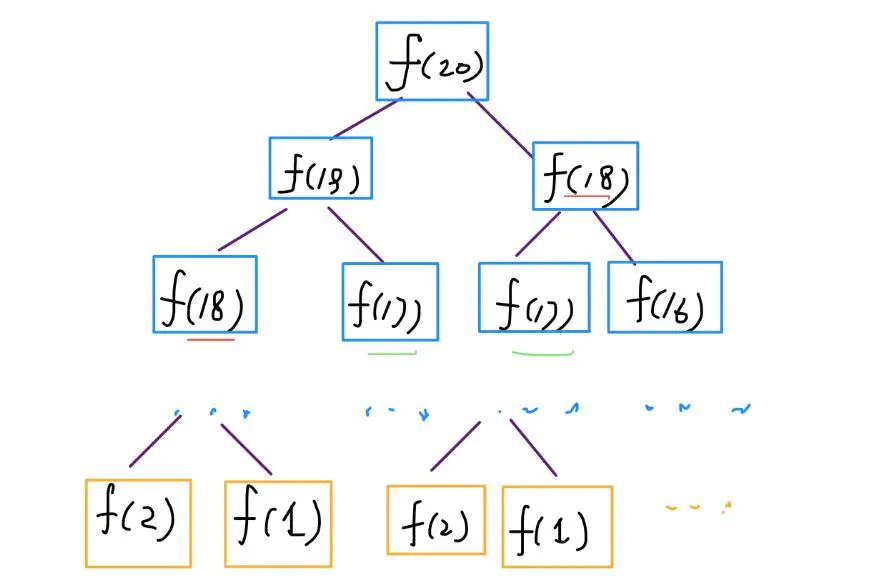
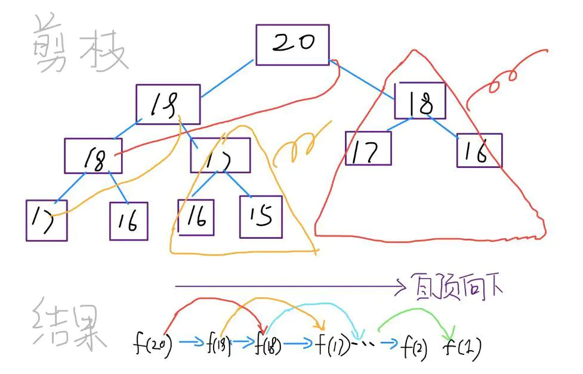
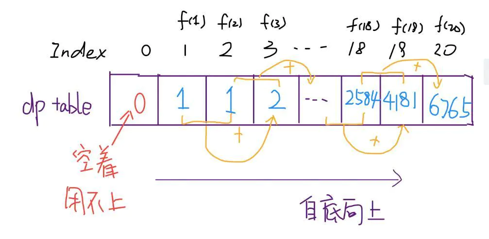
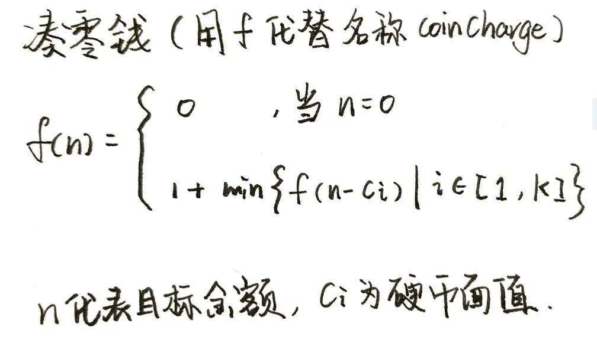
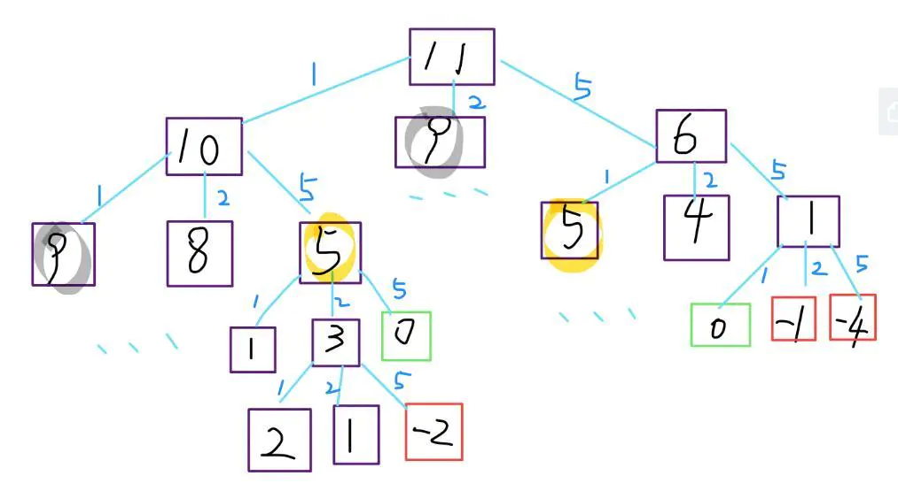
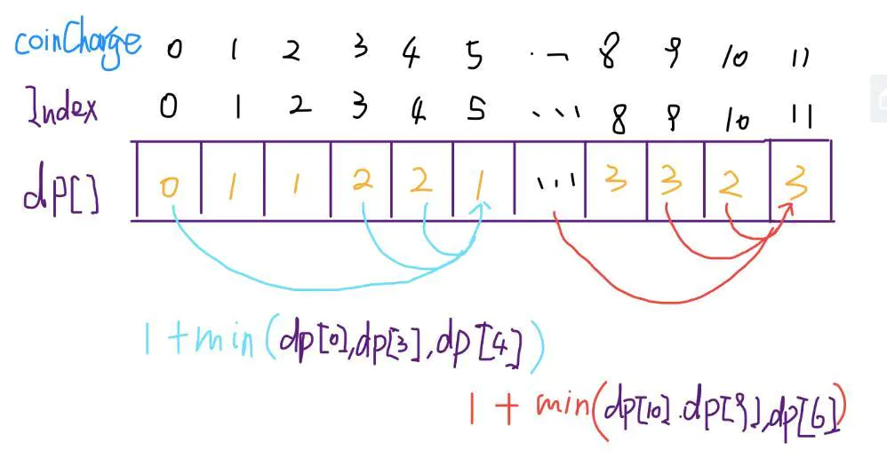

# 排序算法

快排

冒泡

选择

插入

归并


# 哈希算法

HashMap

Redis dict


# 贪心算法

## 定义

贪心算法是指在对问题求解时，总是做出<font color=#dd0000>在当前看来是最好的选择</font>。也就是说，不从整体最优上加以考虑，只做出在某种意义上的<font color=#dd0000>局部最优解</font>。

贪心算法不是对所有问题都能得到整体最优解，关键是贪心策略的选择，选择的贪心策略必须具备无后效性，即某个状态以后的过程不会影响以前的状态，只与当前状态有关。


解题的一般步骤是：

1.建立数学模型来描述问题；

2.把求解的问题分成若干个子问题；

3.对每一子问题求解，得到子问题的局部最优解；

4.把子问题的局部最优解合成原来问题的一个解。


## 贪心策略


## 示例

### 钱币找零问题

这个问题在我们的日常生活中很普遍。假设1元、2元、5元、10元、20元、50元、100元的纸币分别有c0, c1, c2, c3, c4, c5, c6张。现在要用这些钱来支付K元，至少要用多少张纸币？用贪心算法的思想，很显然，每一步尽可能用面值大的纸币即可。在日常生活中我们自然而然也是这么做的。在程序中已经事先将Value按照从小到大的顺序排好。

```c++
#include<iostream>
#include<algorithm>

using namespace std;

const int N=7;
int Count[N]={3,0,2,1,0,3,5};
int Value[N]={1,2,5,10,20,50,100};

int solve(int money)
{
    int num=0;
    for(int i=N-1;i>=0;i--)
    {
        int c=min(money/Value[i],Count[i]);
        money=money-c*Value[i];
        num+=c;
    }
    if(money<=0)
        num=-1;
    return num;
}

int main()   
{
    int money;
    cin>>money;
    int res=solve(money);
    if(res!=-1)
        cout<<res<<endl;
    else cout<<"NO"<<endl;
}
```


### 背包问题

背包问题：有一个背包，背包容量是M=150。有7个物品，物品可以分割成任意大小。要求尽可能让装入背包中的物品总价值最大，但不能超过总容量。

物品 A B C D E F G

重量 35 30 60 50 40 10 25

价值 10 40 30 50 35 40 30


约束条件

> 装入的物品总重量不超过背包容量


贪心策略选择

> （1）根据贪心的策略，每次挑选价值最大的物品装入背包，得到的结果是否最优？
>
> （2）每次挑选所占重量最小的物品装入是否能得到最优解？
>
> （3）每次选取单位重量价值最大的物品，成为解本题的策略。


值得注意的是，贪心算法并不是完全不可以使用，贪心策略一旦经过证明成立后，它就是一种高效的算法。

贪心算法还是很常见的算法之一，这是由于它简单易行，构造贪心策略不是很困难。

可惜的是，它需要证明后才能真正运用到题目的算法中。

一般来说，贪心算法的证明围绕着：整个问题的最优解一定由在贪心策略中存在的子问题的最优解得来的。


对于背包问题中的3种贪心策略，都是无法成立（无法被证明）的，解释如下：

（1）贪心策略：选取价值最大者。反例：

W=30

物品：A B C

重量：28 12 12

价值：30 20 20

根据策略，首先选取物品A，接下来就无法再选取了，可是，选取B、C则更好。

（2）贪心策略：选取重量最小。它的反例与第一种策略的反例差不多。

（3）贪心策略：选取单位重量价值最大的物品。反例：

W=30

物品：A B C

重量：28 20 10

价值：28 20 10

根据策略，三种物品单位重量价值一样，程序无法依据现有策略作出判断，如果选择A，则答案错误。但是果在条件中加一句当遇见单位价值相同的时候,优先装重量小的,这样的问题就可以解决.

所以需要说明的是，贪心算法可以与随机化算法一起使用，具体的例子就不再多举了。（因为这一类算法普及性不高，而且技术含量是非常高的，需要通过一些反例确定随机的对象是什么，随机程度如何，但也是不能保证完全正确，只能是极大的几率正确）。

```c++
#include <iostream>
using namespace std;

struct Node
{
	float weight;
	float value;
	bool mark;
	char char_mark;
	float pre_weight_value;
};
 
int main(int argc, char* argv[])
{
	float Weight[7] = {35,30,60,50,40,15,20};
	float Value [7] = {10,40,30,50,35,40,30};
	Node array[7];
	for(int i=0; i<7; i++)
	{
		array[i].value = Value[i];
		array[i].weight = Weight[i];
		array[i].char_mark = 65 + i;
		array[i].mark = false;
		array[i].pre_weight_value = Value[i] / Weight[i];
	}
	
	for(i=0;i<7;i++)
		cout<<array[i].pre_weight_value<<" ";
	cout<<endl;
	
	float weight_all=0.0;
	float value_all = 0.0;
	float max = 0.0;
	char charArray[7];
	int flag,n = 0;
	
	while(weight_all <= 150)
	{
		for(int index=0;index < 7; ++index)
		{
			if(array[index].pre_weight_value > max && array[index].mark == false)
			{
				max = array[index].pre_weight_value ;
				flag = index;
			}
		}
		
		charArray[n++] = array[flag].char_mark;
		array[flag].mark = true;
		weight_all += array[flag].weight;
		value_all += array[flag].value;
		max = 0.0;
	}
	
	for(i=0;i<n-1;i++)
		cout<<charArray[i]<<" ";
	cout<<endl;
	cout<<"weight_all:"<<weight_all- array[n-1].weight<<endl;
	cout<<"value_all:"<<value_all<<endl;
	
	system("pause");
	return 0;
}
```


这个算法里面就是采用的贪心第三方案，一般这个方案是成功率最大的，其他两个方案我在这里没有考虑，在这里得到的结果是利用了115容量装了价值195的东西，但是这明显不是最优结果，分明还可以装一个A进去！刚好满足150重量，由于在算法中我单纯的利用第三种贪心方法求解，当剩余的包裹中最优的再加进来的时候已经超过了，所以这个时候可以选择剩余包裹中次优的（如这里选择A），再不行就次次优的，尽量把包裹装满，这样得到的结果就很接近了（不保证一定为最优），但是我们一般不这样来求解，动态规划算法可以解决这个问题，动态规划很好的弥补了贪心算法的不足！


还需要说明的是，如果包裹是可以拆分的，那这个问题就得到了整体最优解，前面不变，就是当最后一次装进去已经超过容量的时候可以选择只装她的一部分！


## 应用

求图中的最小生成树、求哈夫曼编码…对于其他问题，贪心法一般不能得到我们所要求的答案。一旦一个问题可以通过贪心法来解决，那么贪心法一般是解决这个问题的最好办法。由于贪心法的高效性以及其所求得的答案比较接近最优结果，贪心法也可以用作辅助算法或者直接解决一些要求结果不特别精确的问题。


# 动态规划与递归

动态规划是自底向上，递归树是自顶向下

动态规划一般都脱离了递归，而是由循环迭代完成计算。

## 斐波那契数列

指的是这样一个数列：1、1、2、3、5、8、13、21、34、……在数学上，斐波那契数列以如下被以递推)的方法定义：*F*(1)=1，*F*(2)=1, *F*(n)=*F*(n - 1)+*F*(n - 2)（*n* ≥ 3，*n* ∈ N*）


### 递归

从一个规模较大的原问题比如说 f(20)，向下逐渐分解规模，直到 f(1) 和 f(2) 触底，然后逐层返回答案

```cpp
int fib(size_t n) 
{ 
    if(n == 1 || n == 2) 
    {
        return 1;
    }
    return fib(n-1) + fib(n-2); 
} 
```




> 想要计算原问题 f(20)，我就得先计算出子问题 f(19) 和 f(18)，然后要计算 f(19)，我就要先算出子问题 f(18) 和 f(17)，以此类推。最后遇到 f(1) 或者 f(2) 的时候，结果已知，就能直接返回结果，递归树不再向下生长了。


**算法复杂度**

> 子问题个数，即递归树中节点的总数。显然二叉树节点总数为指数级别，所以子问题个数为 O(2^n)。
>
> 解决一个子问题的时间，在本算法中，没有循环，只有 f(n - 1) + f(n - 2) 一个加法操作，时间为 O(1)。
>
> 所以，这个算法的时间复杂度为 **O(2^n)**


观察递归树，很明显发现了算法低效的原因：存在大量重复计算，比如 f(18) 被计算了两次，而且可以看到，以 f(18) 为根的这个递归树体量巨大，多算一遍，会耗费巨大的时间。况且，还不止 f(18) 这一个节点被重复计算，所以这个算法及其低效。


<font color=#dd0000>这就是动态规划问题的第一个性质：重叠子问题。</font>


### 带备忘录的递归

我们可以造一个「备忘录」，每次算出某个子问题的答案后别急着返回，先记到「备忘录」里再返回；每次遇到一个子问题先去「备忘录」里查一查，如果发现之前已经解决过这个问题了，直接把答案拿出来用，不要再耗时去计算了。

```java
// 使用一个数组充当这个「备忘录」，也可以使用哈希表（字典），思想都是一样的
int fib(int N) {
    if (N < 1) 
        return 0;
    // 备忘录全初始化为 0
    vector<int> memo(N + 1, 0);
    return helper(memo, N);
}
int helper(vector<int>& memo, int n) {
    if (n == 1 || n == 2) 
        return 1;
    if (memo[n] != 0) 
        return memo[n];
    // 未被计算过
    memo[n] = helper(memo, n - 1) + helper(memo, n - 2);
    return memo[n];
}
```




实际上，带「备忘录」的递归算法，把一棵存在巨量冗余的递归树通过「剪枝」，改造成了一幅不存在冗余的递归图，极大减少了子问题（即递归图中节点）的个数。


**算法复杂度**

子问题个数 乘以 解决一个子问题需要的时间。

> 子问题个数，即图中节点的总数，由于本算法不存在冗余计算，子问题就是 f(1), f(2), f(3) ... f(20)，数量和输入规模 n = 20 成正比，所以子问题个数为 O(n)。
>
> 解决一个子问题的时间，同上，没有什么循环，时间为 O(1)。
>
> 所以，本算法的时间复杂度是 O(n)。


**自顶向下**

上述递归树，是从上向下延伸，都是从一个规模较大的原问题比如说 f(20)，向下逐渐分解规模，直到 f(1) 和 f(2) 触底，然后逐层返回答案，这就叫自顶向下。


**自底向上**

直接从最底下，最简单，问题规模最小的 f(1) 和 f(2) 开始往上推，直到推到我们想要的答案 f(20)，这就是动态规划的思路，这也是为什么动态规划一般都脱离了递归，而是由循环迭代完成计算。


### 动态规划

有了上一步「备忘录」的启发，我们可以把这个「备忘录」独立出来成为一张表，就叫做 DP table ，在这张表上完成「自底向上」的推算。

```java
int fib(int N) {
    vector<int> dp(N + 1, 0);
    dp[1] = dp[2] = 1;
    for (int i = 3; i <= N; i++)
        dp[i] = dp[i - 1] + dp[i - 2];
    return dp[N];
}
```



这个 DP table 特别像之前那个「剪枝」后的结果，只是反过来算而已。实际上，带备忘录的递归解法中的「备忘录」，最终完成后就是这个 DP table，所以说这两种解法其实是差不多的，大部分情况下，效率也基本相同。


**动态转移方程**

对于上述问题，把 f(n) 想做一个状态 n，这个状态 n 是由状态 n - 1 和状态 n - 2 相加转移而来，这就叫状态转移

值得注意的是，上面的几种解法中的所有操作，例如 `return f(n - 1) + f(n - 2)`，`dp[i] = dp[i - 1] + dp[i - 2]`，以及对备忘录或 DP table 的初始化操作，都是围绕这个方程式的不同表现形式。可见列出「状态转移方程」的重要性，它是解决问题的核心。很容易发现，<font color=#dd0000>其实状态转移方程直接代表着暴力解法。</font>

**而动态规划问题最困难的就是写出状态转移方程，也就是这个暴力解**。优化方法无非是用备忘录或者 DP table


最后，讲一个细节优化。根据斐波那契数列的状态转移方程，当前状态只和之前的两个状态有关，其实并不需要那么长的一个 DP table 来存储所有的状态，只要想办法存储之前的两个状态就行了。所以，可以进一步优化，把空间复杂度降为 O(1)：

```java
int fib(int n) {
    if (n < 2) 
        return n;
    int prev = 0, curr = 1;
    for (int i = 0; i < n - 1; i++) {
        int sum = prev + curr;
        prev = curr;
        curr = sum;
    }
    return curr;
}
```


**最优子结构**


## 凑零钱问题

**题目**：给你 k 种面值的硬币，面值分别为 c1, c2 ... ck，再给一个总金额 n，问你最少需要几枚硬币凑出这个金额，如果不可能凑出，则回答 -1 。

> 比如说，k = 3，面值分别为 1，2，5，总金额 n = 11，那么最少需要 3 枚硬币，即 11 = 5 + 5 + 1 。


### 暴力解法

首先是最困难的一步，写出状态转移方程。




这个方程就用到了**最优子结构**性质：<font color=#dd0000>原问题的解由子问题的最优解构成。</font>即 f(11) 由 f(10), f(9), f(6) 的最优解转移而来。

**注意：**要符合「最优子结构」，**子问题间必须互相独立**。

```java
int coinChange(vector<int>& coins, int amount) {
    if (amount == 0) 
        return 0;
    int ans = INT_MAX;
    for (int coin : coins) {
        // 金额不可达
        if (amount - coin < 0) 
            continue;
        int subProb = coinChange(coins, amount - coin);
        // 子问题无解
        if (subProb == -1) 
            continue;
        ans = min(ans, subProb + 1);
    }
    return ans == INT_MAX ? -1 : ans;
}
```




> 时间复杂度分析：子问题总数 x 每个子问题的时间。子问题总数为递归树节点个数，这个比较难看出来，是 O(n^k)，总之是指数级别的。每个子问题中含有一个 for 循环，复杂度为 O(k)。所以总时间复杂度为 O(k*n^k)，指数级别。


### 带备忘录的递归算法

```java
int coinChange(vector<int>& coins, int amount) {
    // 备忘录初始化为 -2
    vector<int> memo(amount + 1, -2);
    return helper(coins, amount, memo);
}

int helper(vector<int>& coins, int amount, vector<int>& memo) {
    if (amount == 0) 
        return 0;
    if (memo[amount] != -2) 
        return memo[amount];
    int ans = INT_MAX;
    for (int coin : coins) {
        // 金额不可达
        if (amount - coin < 0) 
            continue;
        int subProb = helper(coins, amount - coin, memo);
        // 子问题无解
        if (subProb == -1) 
            continue;
        ans = min(ans, subProb + 1);
    }
    // 记录本轮答案
    memo[amount] = (ans == INT_MAX) ? -1 : ans;
    return memo[amount];
}
```


> 很显然「备忘录」大大减小了子问题数目，完全消除了子问题的冗余，所以子问题总数不会超过金额数 n，即子问题数目为 O(n)。处理一个子问题的时间不变，仍是 O(k)，所以总的时间复杂度是 O(kn)。


### 动态规划

```java
int coinChange(vector<int>& coins, int amount) {
    vector<int> dp(amount + 1, amount + 1);
    dp[0] = 0;
    for (int i = 1; i <= amount; i++) {
        for (int coin : coins)
            if (coin <= i)
                dp[i] = min(dp[i], dp[i - coin] + 1);
    }
    return dp[amount] > amount ? -1 : dp[amount];
}
```





# 分治算法

排序中典型例子：归并排序、堆排序、快速排序、二分查找；

forkJoin


