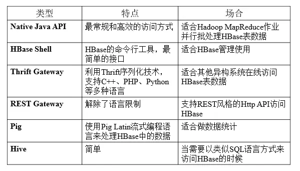
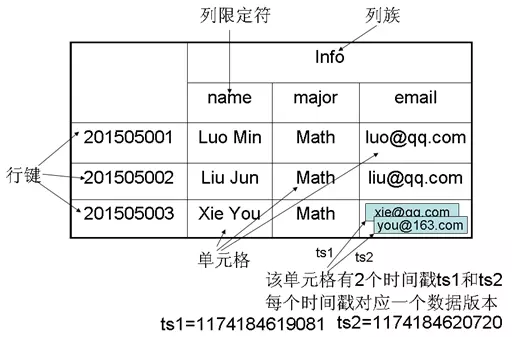
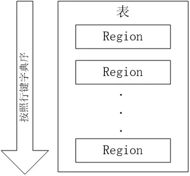
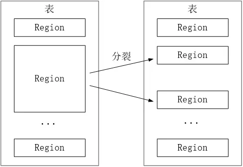
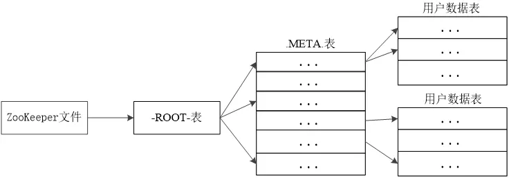
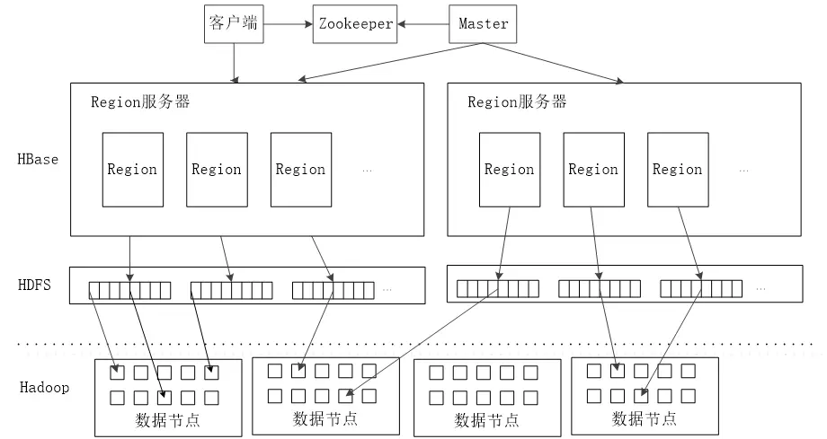
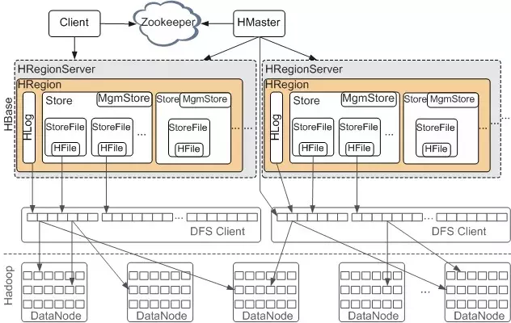

# HBase简介

HBase是一个高可靠、高性能、**面向列**、可伸缩的分布式数据库，是谷歌BigTable的开源实现，主要用来存储非结构化和半结构化的松散数据。HBase的目标是处理非常庞大的表，可以通过水平扩展的方式，利用廉价计算机集群处理由超过10亿行数据和数百万列元素组成的数据表。

# Hbase访问接口

# Hbase数据模型

Hbase是一个稀疏、多维度、排序的映射表，这张表的索引是行键（RowKey）、列族、列限定符和时间戳。

- 每个值是一个未经解释的字符串，没有数据类型。用户在表中存储数据，每一行都有一个可排序的行键和任意多的列。
- 表在水平方向由一个或多个列族组成，一个列族中可以包含任意多个列，同一个列族里面的数据存储在一个文件。
- 列族支持动态扩展，可以很轻松地添加一个列族或列，无需预先定义列的数量以及类型，所有列均以字符串形式存储，用户需要自行进行数据类型转换。
- HBase中执行更新操作时，并不会删除数据旧的版本，而是生成一个新的版本，旧的版本仍然保留（这是和HDFS只允许追加不允许修改的特性相关的）

表：HBase采用表来组织数据，表由行和列组成，列划分为若干列族。

行：每个HBase表都由若干行组成，每个行由行键（row key）来标识。

列族：一个HBase表被分组成许多“列族”（Column Family）的集合，它是基本的访问控制单元。

列限定符：列族里的数据通过限定符（或列）来定位。

单元格：在HBase表中，通过行、列族和列限定符确定一个“单元格”（cell），单元格中存储的数据没有数据类型，总被视为字节数组byte[]

时间戳：每个单元格都保存着同一份数据的多个版本，这些版本采用时间戳进行索引。

# 实现原理

HBase的实现包括三个主要的功能组件：

- 1、库函数：链接到每个客户端
- 2、一个Master主服务器
- 3、许多个Region服务器

主服务器Master负责管理和维护Hbase表的分区信息，维护Region服务器列表，分配Region，负载均衡。

Region服务器负责存储和维护分配给自己的Region，处理来自客户端的读写请求。

客户端并不是直接从Master主服务器上读取数据，而是在获得Region的存储位置信息后，直接从Region服务器上读取数据。

客户端并不依赖Master，而是通过Zookeeper来获取Region位置信息，大多数客户端甚至从来不和Master通信，这种设计方式使得Master负载很小。

## 表和Region

一个HBase表被划分成多个Region

开始只有一个Region，后台不断分裂。Region拆分操作非常快，接近瞬间，因为拆分之后Region读取的仍然是原存储文件，直到“合并”过程把存储文件异步地写到独立的文件之后，才会读取新文件。

## Region的定位

**元数据表**，又名.META.表，存储了Region和Region服务器的映射关系。当HBase表很大时， .META.表也会被分裂成多个Region

**根数据表**，又名-ROOT-表，记录所有元数据的具体位置，-ROOT-表只有唯一一个Region，名字是在程序中被写死的。Zookeeper文件记录了-ROOT-表的位置

客户端访问数据时的“**三级寻址**”：

- 为了加速寻址，客户端会缓存位置信息，同时，需要解决缓存失效问题。
- 寻址过程客户端只需要询问`Zookeeper`服务器，不需要连接`Master`服务器。

# Hbase系统架构

## 架构概览

- Zookeeper，作为分布式的协调。RegionServer也会把自己的信息写到ZooKeeper中。

- HDFS是Hbase运行的底层文件系统

- RegionServer，理解为数据节点，存储数据的。

- Master RegionServer要实时的向Master报告信息。Master知道全局的RegionServer运行情况，可以控制RegionServer的故障转移和Region的切分。

## 架构详情

HMaster是Master Server的实现，负责监控集群中的RegionServer实例，同时是所有metadata改变的接口，在集群中，通常运行在NameNode上面

- HMaster Interface暴露的接口: 
  - Table(createTable, modifyTable, removeTable, enable, disable)
  - ColumnFamily (addColumn, modifyColumn, removeColumn)
  - Region (move, assign, unassign)
- Master运行的后台线程：
  - LoadBalancer线程，控制region来平衡集群的负载。
  - CatalogJanitor线程，周期性的检查hbase:meta表。

HRegionServer是RegionServer的实现，服务和管理Regions，集群中RegionServer运行在DataNode

- HRegionRegion Interface暴露接口：
  - Data (get, put, delete, next, etc.)
  - Region (splitRegion, compactRegion, etc.)
- RegionServer后台线程：
  - CompactSplitThread
  - MajorCompactionChecker
  - MemStoreFlusher
  - LogRoller

Regions，代表table，Region有多个Store(列簇)，Store有一个Memstore和多个StoreFiles(HFiles)，StoreFiles的底层是Block。

# 存储设计

在Hbase中，表被分割成多个更小的块然后分散的存储在不同的服务器上，这些小块叫做Regions，存放Regions的地方叫做RegionServer。Master进程负责处理不同的RegionServer之间的Region的分发。在Hbase实现中HRegionServer和HRegion类代表RegionServer和Region。HRegionServer除了包含一些HRegions之外，还处理两种类型的文件用于数据存储

- HLog 预写日志文件，也叫做WAL(write-ahead log)
- HFile 真实的数据存储文件

