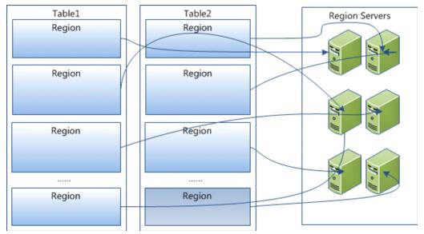
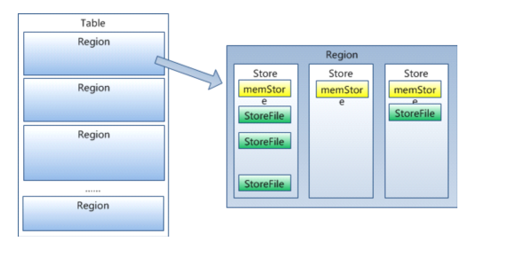
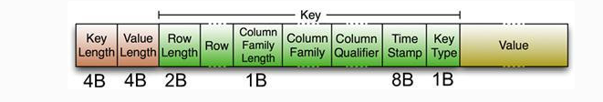
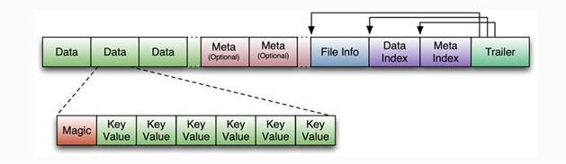
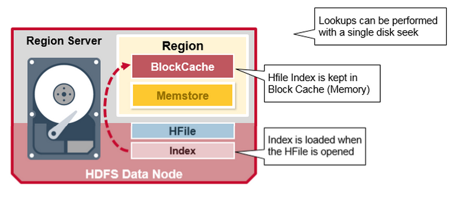

# HBase简介

HBase是一个高可靠、高性能、**面向列**、可伸缩的分布式数据库，是谷歌BigTable的开源实现，主要用来存储非结构化和半结构化的松散数据。HBase的目标是处理非常庞大的表，可以通过水平扩展的方式，利用廉价计算机集群处理由超过10亿行数据和数百万列元素组成的数据表。


# Hbase访问接口


`MapReduce`: 直接使用`MapReduce`作业处理`Hbase`数据； 

`spring`中:  `java` 利用 `sping-data-hadoop` `HbaseTemplate` 操作 `hbase`


# 安装

```shell
$ docker run -d -h 10.0.105.94 -p 2181:2181 -p 8080:8080 -p 8085:8085 -p 9090:9090 -p 9095:9095 -p 16000:16000 -p 16010:16010 -p 16201:16201 -p 16301:16301 --name hbase1.3 harisekhon/hbase:1.3
```


# Hbase数据模型

Hbase是一个稀疏、多维度、排序的映射表，这张表的索引是行键（RowKey）、列族、列限定符和时间戳。

- 每个值是一个未经解释的字符串，<font color=#dd0000>没有数据类型</font>。用户在表中存储数据，每一行都有一个可排序的行键和任意多的列。
- 表在水平方向由一个或多个列族组成，一个列族中可以包含任意多个列，同一个列族里面的数据存储在一个文件。
- <font color=#dd0000>列族支持动态扩展</font>，可以很轻松地添加一个列族或列，无需预先定义列的数量以及类型，所有列均以<font color=#dd0000>字符串形式存储</font>，用户需要自行进行数据类型转换。
- HBase中执行更新操作时，并不会删除数据旧的版本，而是生成一个新的版本，旧的版本仍然保留（这是和HDFS只允许追加不允许修改的特性相关的）


表：HBase采用表来组织数据，表由行和列组成，列划分为若干列族。

行：每个HBase表都由若干行组成，每个行由行键（row key）来标识。

列族：一个HBase表被分组成许多“列族”（Column Family）的集合，它是基本的访问控制单元。

列限定符：列族里的数据通过限定符（或列）来定位。

单元格：在HBase表中，通过行、列族和列限定符确定一个“单元格”（cell），单元格中存储的数据没有数据类型，总被视为字节<font color=00dd00>数组byte[]</font>

时间戳：每个单元格都保存着同一份数据的多个版本，这些版本采用时间戳进行索引。


| Row Key  | Time Stamp | CF1       | CF2       | CF3       |
| -------- | ---------- | --------- | --------- | --------- |
|          | t6         |           | CF2:q2=v2 | CF3:q3=v3 |
| 11248112 | t3         |           |           |           |
|          | t2         | CF1:q1=v1 |           |           |

> 一行，三列的数据，CF1、CF2、CF3是三个不同的列族，在t2时刻CF1下存入列名为q1，值为q2,rowkey为11248112；
>
> 在t6时刻CF2、CF3下分别存入列名为q2，q3,值为q2，q3,rowkey为11248112；
>
> t3时刻没有存入 。和关系数据库不同这里的空白处是不占用空间的。


# 实现原理

HBase的实现包括三个主要的功能组件：

- 1、库函数：链接到每个客户端
- 2、一个Master主服务器
- 3、许多个Region服务器

主服务器Master负责管理和维护Hbase表的分区信息，维护Region服务器列表，分配Region，负载均衡。

Region服务器负责存储和维护分配给自己的Region，处理来自客户端的读写请求。

客户端并不是直接从Master主服务器上读取数据，而是在获得Region的存储位置信息后，直接从Region服务器上读取数据。

客户端并不依赖Master，而是通过Zookeeper来获取Region位置信息，大多数客户端甚至从来不和Master通信，这种设计方式使得Master负载很小。


## 表和Region

<font color=#dd0000>一张HBase表被划分成多个Region</font>


开始只有一个Region，后台不断分裂。Region拆分操作非常快，接近瞬间，因为拆分之后Region读取的仍然是原存储文件，直到“合并”过程把存储文件异步地写到独立的文件之后，才会读取新文件。


## Region的定位

**元数据表**，又名.META.表，存储了Region和Region服务器的映射关系。当HBase表很大时， .META.表也会被分裂成多个Region

**根数据表**，又名-ROOT-表，记录所有元数据的具体位置，-ROOT-表只有唯一一个Region，名字是在程序中被写死的。Zookeeper文件记录了-ROOT-表的位置


客户端访问数据时的**三级寻址**

- 为了加速寻址，客户端会缓存位置信息，同时，需要解决缓存失效问题。
- 寻址过程客户端只需要询问`Zookeeper`服务器，不需要连接`Master`服务器。


# Hbase系统架构

## 架构概览


- Zookeeper，作为分布式的协调。RegionServer也会把自己的信息写到ZooKeeper中。

- HDFS是Hbase运行的底层文件系统

- RegionServer，理解为数据节点，存储数据的。

- RegionServer要实时的向Master报告信息。Master知道全局的RegionServer运行情况，可以控制RegionServer的故障转移和Region的切分。

## 架构详情


HMaster是Master Server的实现，负责监控集群中的RegionServer实例，同时是所有metadata改变的接口，在集群中，通常运行在NameNode上面

- HMaster Interface暴露的接口: 
  - Table(createTable, modifyTable, removeTable, enable, disable)
  - ColumnFamily (addColumn, modifyColumn, removeColumn)
  - Region (move, assign, unassign)
- Master运行的后台线程：
  - LoadBalancer线程，控制region来平衡集群的负载。
  - CatalogJanitor线程，周期性的检查hbase:meta表。


HRegionServer是RegionServer的实现，服务和管理Regions，集群中RegionServer运行在DataNode

- HRegionRegion Interface暴露接口：
  - Data (get, put, delete, next, etc.)
  - Region (splitRegion, compactRegion, etc.)
- RegionServer后台线程：
  - CompactSplitThread
  - MajorCompactionChecker
  - MemStoreFlusher
  - LogRoller


Regions，代表table，Region有多个Store(列簇)，Store有一个Memstore和多个StoreFiles(HFiles)，StoreFiles的底层是Block。


# 存储设计

在Hbase中，<font color=#00dd00>Table被分割成多个更小的块然后分散的存储在不同的服务器上</font>，这些小块叫做Regions，存放Regions的地方叫做RegionServer。Master进程负责处理不同的RegionServer之间的Region的分发。在Hbase实现中HRegionServer和HRegion类代表RegionServer和Region。HRegionServer除了包含一些HRegions之外，还处理两种类型的文件用于数据存储

- HLog 预写日志文件，也叫做WAL(write-ahead log)
- HFile 真实的数据存储文件





每个HRegion由多个Store构成，每个Store由一个MemStore和多个StoreFile组成，每个Store保存一个Columns Family。



StoreFile以HFile格式存储在HDFS中。


# 存储架构

HBase中的存储包括HMaster、HRegionSever、HRegion、HLog、Store、MemStore、StoreFile、HFile等


HBase中的每张表都通过键按照一定的范围被分割成多个子表（HRegion），默认一个HRegion超过256M就要被分割成两个，这个过程由HRegionServer管理，而HRegion的分配由HMaster管理。


## HMaster

```properties
1.为HRegionServer分配HRegion

2.负责HRegionServer的负载均衡

3.发现失效的HRegionServer并重新分配

4.HDFS上的垃圾文件回收

5.处理Schema更新请求

6.DDL(新增和删除表结构)
```

## HRegionServer

```properties
1.维护HMaster分配给它的HRegion，处理对这些HRegion的IO请求

2.负责切分正在运行过程中变得过大的HRegion
```


## zookeeper

```properties
负责维护和记录整个HBase集群的状态
```


总结

> Client访问HBase上的数据并不需要HMaster参与，寻址访问ZooKeeper和HRegionServer，数据读写访问HRegionServer，HMaster仅仅维护Table和Region的元数据信息，Table的元数据信息保存在ZooKeeper上，负载很低。
>
> HRegionServer存取一个子表时，会创建一个HRegion对象，然后对表的每个列簇创建一个Store对象，每个Store都会有一个MemStore和多个StoreFile与之对应，每个StoreFile都会对应一个HFile，HFile就是实际的存储文件。因此，一个HRegion有多少列簇就有多少个Store。
>
> 一个HRegionServer会有多个HRegion和一个HLog。


## HRegion

Table在行的方向上分割为多个HRegion（根据Row Key的区域划分），HRegion是HBase中分布式存储和负载均衡的<font color=#00dd00>最小单元</font>，即不同的HRegion可以分别在不同的HRegionServer上，但同一个HRegion是不会拆分到多个HRegionServer上的。

- 一张表垂直分割成一个或多个region, 一个region包括一组连续并且有序的row key, 每一个row key对应一行的数据.

- 每个region最大1GB(默认)

- 一个Region server最多可以管理1000个region(这些region可以属于相同的表,也可以属于不同的表)

HRegion按大小分割，每个表一般只有一个HRegion，随着数据不断插入表，HRegion不断增大，当HRegion的某个列簇达到一个阀值（默认256M）时就会分成两个新的HRegion，2个子region各占原始region的一半数据

> 1、<表名，StartRowKey, 创建时间>
>
> 2、由目录表(-ROOT-和.META.)记录该Region的EndRowKey


**HRegion定位**

HRegion被分配给哪个HRegionServer是完全动态的，所以需要机制来定位HRegion具体在哪个HRegionServer，HBase使用三层结构来定位HRegion：

> 1、通过zookeeper里的文件/hbase/rs得到-ROOT-表的位置。-ROOT-表只有一个region。
>
> 2、通过-ROOT-表查找.META.表的第一个表中相应的HRegion位置。其实-ROOT-表是.META.表的第一个region；
>
> .META.表中的每一个Region在-ROOT-表中都是一行记录。
>
> 3、通过.META.表找到所要的用户表HRegion的位置。用户表的每个HRegion在.META.表中都是一行记录。

-ROOT-表永远不会被分隔为多个HRegion，保证了最多需要三次跳转，就能定位到任意的region。Client会将查询的位置信息保存缓存起来，缓存不会主动失效，因此如果Client上的缓存全部失效，则需要进行6次网络来回，才能定位到正确的HRegion，其中三次用来发现缓存失效，另外三次用来获取位置信息。


## Store

每一个HRegion由一个或多个Store组成，至少是一个Store，HBase会把一起访问的数据放在一个Store里面，即为每个ColumnFamily建一个Store，如果有几个ColumnFamily，也就有几个Store。

一个Store由一个MemStore和多个StoreFile组成。 

HBase以Store的大小来判断是否需要切分HRegion。


## MemStore

MemStore 是放在内存里的，保存修改的数据即key-Values。在数据真正被写入硬盘前, Memstore在内存中缓存新写入的数据。

memstore的数据在写入硬盘前, 会<font color=#00dd00>先根据key排序, 然后写入硬盘</font>

当MemStore的大小达到一个阀值（默认64MB）时，MemStore会被Flush到文件，即生成一个快照。目前HBase会有一个线程来负责MemStore的Flush操作。


## StoreFile

MemStore内存中的数据写到文件后就是StoreFile，StoreFile底层是以HFile的格式保存。


## HFile

HDFS上的数据文件，以Key-Value数据的存储格式，是Hadoop的二进制格式文件。 首先HFile文件是不定长的，长度固定的只有其中的两块：Trailer和FileInfo。

Trailer中有指针指向其他数据块的起始点，FileInfo记录了文件的一些meta信息。

### Data Block

Data Block是HBase IO的基本单元，为了提高效率，HRegionServer中有基于LRU的Block Cache机制。每个Data块的大小可以在创建一个Table的时候通过参数指定（默认块大小64KB），<font color=#dd0000>大号的Block有利于顺序Scan，小号的Block利于随机查询。</font>

每个Data块除了开头的Magic以外就是一个个Key-Value对拼接而成，Magic内容就是一些随机数字，目的是防止数据损坏，`Data Bolck` 结构如下




### HFile文件结构

HFile 使用多层索引来查询数据而不必读取整个文件，这种多层索引类似于一个 B+ tree

- KeyValues 有序存储。
- rowkey 指向 index，而 index 则指向了具体的 data block，以 64 KB 为单位。
- 每个 block 都有它的叶索引。
- 每个 block 的最后一个 key 都被存储在中间层索引。
- 索引根节点指向中间层索引。

trailer 指向原信息数据块，它是在数据持久化为 HFile 时被写在 HFile 文件尾部。

trailer 还包含例如布隆过滤器和时间范围等信息。布隆过滤器用来跳过那些不包含指定 rowkey 的文件，时间范围信息则是根据时间来过滤，跳过那些不在请求的时间范围之内的文件。




Data Block段用来保存表中的数据，这部分可以被压缩。

Meta Block段（可选的）用来保存用户自定义的kv段，可以被压缩。 

FileInfo段用来保存HFile的元信息，不能被压缩，用户也可以在这一部分添加自己的元信息。

Data Block Index段（可选的）用来保存Meta Blcok的索引。

Trailer这一段是定长的。保存了每一段的偏移量，读取一个HFile时，会首先读取Trailer，Trailer保存了每个段的起始位置(段的Magic Number用来做安全check)，然后，DataBlock Index会被读取到内存中，这样，当检索某个key时，不需要扫描整个HFile，而只需从内存中找到key所在的block，通过一次磁盘io将整个 block读取到内存中，再找到需要的key。

DataBlock Index采用LRU机制淘汰。 HFile的Data Block，Meta Block通常采用压缩方式存储，压缩之后可以大大减少网络IO和磁盘IO，随之而来的开销当然是需要花费cpu进行压缩和解压缩。

（备注： DataBlock Index的缺陷。 a) 占用过多内存　b) 启动加载时间缓慢）


### HFile 索引

索引在 HFile 被打开时会被载入内存，这样数据查询只要一次硬盘查询。




## HLog

HLog(WAL log)：WAL意为`write ahead log`，用来做灾难恢复使用，HLog记录数据的所有变更，一旦region server 宕机，就可以从log中进行恢复。


当hbase客户端发起Put请求, 第一步是将数据写入预写日志(WAL):

- 将修改的操作记录在预写日志(WAL)的末尾
- 预写日志(WAL)被用来在region server崩溃时, 恢复memstore中的数据


## LogFlusher

定期的将缓存中信息写入到日志文件中


## LogRoller　

对日志文件进行管理维护


# HBase shell

```shell
$ status 	# 查看状态
$ version 	# 查看版本
$ 命名空间
```


## DDL

数据定义语言 Data Definition Language


```shell
$ create ‘表名称’,’列名称1’，’列名称2’，’列名称3’ ......
$ create 'student','info','grade'


$ list ‘abc.*’ #显示abc开头的表

$ describe ‘table_name’ 

# 删除一个列族  alter,disable, enable
# 删除列族时必须先将表给disable

$ disable 'table_name'
$ drop 'table_name'

$ exists 'table_name'

# 更改表名
# 需要开启快照功能，在hbase-site.xml文件中添加配置项 hbase.snapshot.enabled
```


## DML

数据操作语言 data manipulation language


```shell
$ put

$ get <table>,<rowkey>,[<family:column>,….]

# 通过timestrap来获取两个版本的数据
$ get 'table_name','row',{COLUMN=>``'info:column'``,TIMESTRAP=>1321586238965}
# 得到另一个个时间版本的记录
$ get 'table_name','row',{COLUMN=>``'info:column'``,TIMESTRAP=>1321586271843}

# 全表扫描 scanner 相当于：select * from table_name
$ scan <table>, {COLUMNS => [ <family:column>,.... ], LIMIT => num}
# 另外，还可以添加STARTROW、TIMERANGE和FITLER等高级功能

# 删除记录
# 删除指定rowkey的 'info:age' 字段
$ delete 'table_name','row_index','info:age'
# 删除整行
$ deleteall 'table_name','row_index'

# 查询表中有多少行
$ count 'namespace1:t1'
$ count 't1', INTERVAL => 100000 # 每隔多少行显示一次count，默认是1000
$ count 't1', CACHE => 1000 # 每次去取的缓存区大小，默认是10，调整该参数可提高查询速度

###     清空表
$ truncate 'students'
```


## Scan查询

### 限制条件

#### 限制查找列

```shell
$ scan ‘table_name’,{COLUMNS=> 'column-familyinfo’}  # 列族
$ scan ‘table_name’,{COLUMNS=> 'info:regioninfo’}    # 字段
$ scan ‘table_name’,{COLUMNS=>[‘c1’,’c2’]}    # 多个列、字段
```

#### 限制查找条数

```shell
$ scan 'table_name', {COLUMNS=>[ 'c'], LIMIT => n}
```

#### 限制时间范围

```shell
$ scan 'table_name', {TIMERANGE=>[ minStamp, maxStamp]}
```


### FILTER 过滤器

#### rowkey过滤

##### 行键前缀过滤-PrefixFilter

```shell
$ scan 'table_name',{FILTER=> "PrefixFilter('rowkey_prefix')"}
```

#### 列族过滤 

##### 列名限定符过滤器 QuanlifierFilter

```shell
$ scan 'table_name',{FILTER=> "QualifierFilter(CompareOp,'BinaryComparator')"} 
# 参数是关系比较运算符 和 二进制比较器
```

##### 列名前缀过滤器 ColumnPrexfixFilter

```shell
$ scan 'table_name',{FILTER=> "ColumnPrefixFilter('colunm')"}
```

##### 多个列名前缀过滤器 MultipleColumnPrexfixFilter

```shell
$ scan 'table_name',{FILTER=> "MultipleColumnPrefixFilter('c1','c2')" }
```

#### 列值过滤 SingleColumnValueFilter

```shell
# 需要导入类
import org.apache.hadoop.hbase.filter.SingleColumnValueFilter
import org.apache.hadoop.hbase.filter.CompareFilter
import org.apache.hadoop.hbase.filter.SubstringComparator
$ scan 'table_name',{FILTER=> SingleColumnValueFilter.new(Bytes.toBytes('info'),  
    # 列族 
    Bytes.toBytes('column),    
    # 字段  
    CompareFilter::CompareOp.valueOf('EQUAL'), 
    # 比较器 
    Bytes.toBytes('my value')) 
    # 值
}
```

参数介绍

```properties
（1）比较运算符 CompareFilter.CompareOp
    EQUAL                      相等
    GREATER                    大于
    GREATER_OR_EQUAL           大于等于
    LESS                       小于
    LESS_OR_EQUAL              小于等于
    NOT_EQUAL                  不等于

（2）比较器  
    BinaryComparator           匹配完整字节数组 
    BinaryPrefixComparator     匹配字节数组前缀 
    RegexStringComparator      正则表达式匹配
    SubstringComparator        子串匹配
```

#### 组合过滤器

多个过滤器可以通过 AND OR 连接进行组合过滤

```shell
$ scan 'emp', {FILTER=> "(MultipleColumnPrefixFilter('sal','COMM','deptno')) AND (SingleColumnValueFilter('empinfo','deptno',=,'substring:20'))"}
```


# HBase API

Apache HBase APIs 是 hbase 官方提供的操作 api

Using Java Data Objects (JDO) 是官方提供的 java 操作 api

> JDO需要几个以来条件方可使用。
>
> HBase 0.90.x or newer
>
> commons-beanutils.jar (https://commons.apache.org/)
>
> commons-pool-1.5.5.jar (https://commons.apache.org/)
>
> transactional-tableindexed for HBase 0.90 (https://github.com/hbase-trx/hbase-transactional-tableindexed)


## Apache HBase API

对于数据操作，HBase支持四类主要的数据操作，分别是：
	

```properties
Put ：增加一行，修改一行；
		
Delete ：删除一行，删除指定列族，删除指定column的多个版本，删除指定column的制定版本等；

Get ：获取指定行的所有信息，获取指定行和指定列族的所有colunm，获取指定column，获取指定column的几个版本， 获取指定column的指定版本等； 

Scan ：获取所有行，获取指定行键范围的行，获取从某行开始的几行，获取满足过滤条件的行等。
```


### 命名空间Namespace

```shell
create_namespace 'my_ns'		
create 'my_ns:my_table', 'fam'
		
drop_namespace 'my_ns'
		
alter_namespace 'my_ns', {METHOD => 'set', 'PROPERTY_NAME' => 'PROPERTY_VALUE'}

# 预定义的命名空间	
hbase  # 系统命名空间，用于包含hbase的内部表 

default  # 所有未指定命名空间的表都自动进入该命名空间
```


### 创建表

```java
Configuration conf = HBaseConfiguration.create ();
HBaseAdmin admin =  new  HBaseAdmin(conf);
//create  namespace  named "my_ns"
admin.createNamespace(NamespaceDescriptor. create ( "my_ns" ).build());

//create tableDesc, with  namespace  name "my_ns" and table name "mytable "
HTableDescriptor tableDesc =  new  HTableDescriptor(TableName. valueOf ("my_ns:mytable" ));
tableDesc.setDurability(Durability.SYNC_WAL);//设置写 WAL 日志的级别
//add a column family " mycf "
HColumnDescriptor hcd =  new  HColumnDescriptor( "mycf" );
tableDesc.addFamily(hcd);
admin.createTable(tableDesc);

admin.close();
```


关键知识点：

```properties
1. 必须将HBase集群的 hbase-site.xml 文件添加进工程的 classpath 中，否则Configuration conf = HBaseConfiguration. create () 代码获取不到需要的集群相关信息，也就无法找到集群，运行程序时会报错； 

2. HTableDescriptor tableDesc =  new  HTableDescriptor(TableName. valueOf ("my_ns:mytable" )) 
		
代码是描述表 mytable ，并将 mytable 放到了 my_ns 命名空间中，前提是该命名空间已存在，如果指定的是不存在命名空间，则会报 错 org.apache.hadoop.hbase.NamespaceNotFoundException；

3. 命名空间一般在建模阶段通过命令行创建，在java代码中通过admin.createNamespace(NamespaceDescriptor. create ( "my_ns" ).build()) 创建的机会不多；

4. 创建 HBaseAdmin 对象时就已经建立了客户端程序与 HBase 集群的 connection ，

所以在程序执行完成后，务必通过 admin.close() 关闭 connection；

5. 可以通过 HTableDescriptor 对象设置 表的特性 ，比如： 通过 tableDesc.setMaxFileSize(512) 

设置一个 region 中的 store 文件的最大 size ，当一个 region 中的最大 store 文件达到这个 size 时，

region 就开始分裂； 通过 tableDesc.setMemStoreFlushSize(512) 设置 region 内存中的 memstore 的最大值，

当 memstore 达到这个值时，开始往磁盘中刷数据。 更多特性请自行查阅官网API；

6. 可以通过 HColumnDescriptor 对象设置 列族的特性 ，比如：通过 hcd.setTimeToLive(5184000) 设置数据保存的最长时间；

通过 hcd.setInMemory(true ) 设置数据保存在内存中以提高响应速度；

通过 hcd.setMaxVersions(10) 设置数据保存的最大版本数；

通过 hcd.setMinVersions(5) 设置数据保存的最小版本数（配合 TimeToLive 使用）。更多特性请自行查阅官网API； 

7. 数据的版本数只能通过 HColumnDescriptor 对象设置，不能通过 HTableDescriptor 对象设置；

8. 由于 HBase 的数据是先写入内存，数据累计达到内存阀值时才往磁盘中flush数据，所以，

如果在数据还没有 flush 进硬盘时， regionserver down 掉了，内存中的数据将丢失。

要想解决这个场景的问题就需要用到 WAL （Write-Ahead-Log）， 

tableDesc.setDurability(Durability. SYNC_WAL ) 就是设置写 WAL 日志的级别，

示例中设置的是同步写 WAL，该方式安全性较高，但无疑会一定程度影响性能，请根据具体场景选择使用；

9. setDurability (Durability d)方法可以在相关的三个对象中使用，

分别是： HTableDescriptor ， Delete ， Put （其中Delete和Put的该方法都是继承自父类

org.apache.hadoop.hbase.client.Mutation ） 。分别针对表、插入操作、删除操作设定 WAL 日志写入级别。

需要注意的是， Delete 和 Put 并不会继承 Table 的 Durability 级别（已实测验证） 。

Durability是一个枚举变量。如果不通过该方法指定WAL日志级别，则为 默认 USE_DEFAULT 级别。
```

### 删除表

```java
// 删除表前必须先disable表。

Configuration conf = HBaseConfiguration. create ();
HBaseAdmin admin =  new  HBaseAdmin(conf);
String tablename =  "my_ns:mytable" ;
if (admin.tableExists(tablename)) {
    try  {
        admin.disableTable(tablename);
        admin.deleteTable(tablename);
    }  catch  (Exception e) {
        //  TODO : handle exception
        e.printStackTrace();
    }
}

admin.close();
```

### 修改表

```java
// 删除列族、新增列族
Configuration conf = HBaseConfiguration. create ();
HBaseAdmin admin =  new  HBaseAdmin(conf);
String tablename =  "rd_ns:itable" ;
if (admin.tableExists(tablename)) {
    try  {
        admin.disableTable(tablename);
        //get the TableDescriptor of target table
        // 通过 admin.getTableDescriptor (Bytes. toBytes ( "rd_ns:itable" )) 取得目标表的描述对象，应该就是取得指向该对象的指针了；
        HTableDescriptor newtd =  admin.getTableDescriptor (Bytes. toBytes ("rd_ns:itable" ));

        //remove 3 useless column families
        newtd.removeFamily(Bytes. toBytes ( "note" ));
        newtd.removeFamily(Bytes. toBytes ( "newcf" ));
        newtd.removeFamily(Bytes. toBytes ( "sysinfo" ));

        //create HColumnDescriptor for new column family
        HColumnDescriptor newhcd =  new  HColumnDescriptor( "action_log" );
        newhcd.setMaxVersions(10);
        newhcd.setKeepDeletedCells( true );

        //add the new column family(HColumnDescriptor) to HTableDescriptor
        newtd.addFamily(newhcd);

        //modify target table  struture
		// 通过 admin. modifyTable (Bytes. toBytes ( "rd_ns:itable" ),newtd) 将修改后的描述对象应用到目标表
        admin. modifyTable (Bytes. toBytes ( "rd_ns:itable" ),newtd);

        admin.enableTable(tablename);
    }  catch  (Exception e) {
        //  TODO : handle exception
        e.printStackTrace();
    }
}
admin.close();
```


​				
```java
// 修改现有列族的属性（setMaxVersions）

Configuration conf = HBaseConfiguration. create ();
HBaseAdmin admin =  new  HBaseAdmin(conf);
String tablename =  "rd_ns:itable" ;
if (admin.tableExists(tablename)) {
    try  {
        admin.disableTable(tablename);
        //get the TableDescriptor of target table
        HTableDescriptor htd = admin.getTableDescriptor(Bytes. toBytes ("rd_ns:itable" ));
        HColumnDescriptor infocf = htd.getFamily(Bytes. toBytes ( "info" ));
        infocf.setMaxVersions(100);
        //modify target table  struture
        admin.modifyTable(Bytes. toBytes ( "rd_ns:itable" ),htd);
        admin.enableTable(tablename);
    }  catch  (Exception e) {
        //  TODO : handle exception
        e.printStackTrace();
    }
}

admin.close();
```

### 新增、更新数据 Put

```java
// 常用构造函数：

    // （1）指定行键

    public Put(byte[] row)

    //  参数： row 行键

    // （2）指定行键和时间戳

    public Put(byte[] row, long ts)

    // 参数： row 行键， ts 时间戳

    // （3）从目标字符串中提取子串，作为行键

    Put(byte[] rowArray, int rowOffset, int rowLength)

    // （4）从目标字符串中提取子串，作为行键，并加上时间戳

    Put(byte[] rowArray, int rowOffset, int rowLength, long ts)

// 常用方法：

    // （1）指定 列族、限定符 ，添加值

    add(byte[] family, byte[] qualifier, byte[] value)

    // （2）指定 列族、限定符、时间戳 ，添加值

    add(byte[] family, byte[] qualifier, long ts, byte[] value)

    // （3） 设置写WAL （Write-Ahead-Log）的级别

    public void setDurability(Durability d)

    // 参数是一个枚举值，可以有以下几种选择：

    ASYNC_WAL ： 当数据变动时，异步写WAL日志
    SYNC_WAL ： 当数据变动时，同步写WAL日志
    FSYNC_WAL ： 当数据变动时，同步写WAL日志，并且，强制将数据写入磁盘
    SKIP_WAL ： 不写WAL日志
    USE_DEFAULT ： 使用HBase全局默认的WAL写入级别，即 SYNC_WAL 
```


```java
// 1）插入行

Configuration conf = HBaseConfiguration. create ();
HTable table =  new  HTable(conf,  "rd_ns:leetable" );

Put put =  new  Put(Bytes. toBytes ( "100001" ));
put.add(Bytes. toBytes ( "info" ), Bytes. toBytes ( "name" ), Bytes. toBytes ("lion" ));
put.add(Bytes. toBytes ( "info" ), Bytes. toBytes ( "address" ), Bytes. toBytes ("shangdi" ));
put.add(Bytes. toBytes ( "info" ), Bytes. toBytes ( "age" ), Bytes. toBytes ("30" ));

put.setDurability(Durability. SYNC_WAL );

table.put(put);

table.close();

// 2）更新行

Configuration conf = HBaseConfiguration. create ();
HTable table =  new  HTable(conf,  "rd_ns:leetable" );

Put put =  new  Put(Bytes. toBytes ( "100001" ));
put.add(Bytes. toBytes ( "info" ), Bytes. toBytes ( "name" ), Bytes. toBytes ("lee" ));
put.add(Bytes. toBytes ( "info" ), Bytes. toBytes ( "address" ), Bytes. toBytes ("longze" ));
put.add(Bytes. toBytes ( "info" ), Bytes. toBytes ( "age" ), Bytes. toBytes ("31" ));

put.setDurability(Durability. SYNC_WAL );

table.put(put);         

table.close();

// 注意：

Put 的构造函数都需要指定行键，如果是全新的行键，则新增一行；如果是已有的行键，则更新现有行。
创建 Put 对象及 put.add 过程都是在构建一行的数据，创建 Put 对象时相当于创建了行对象，
add 的过程就是往目标行里添加 cell ，直到 table.put 才将数据插入表格；
以上代码创建 Put 对象用的是构造函数1，也可用构造函数2，第二个参数是时间戳； 
Put还有别的构造函数，请查阅官网API。

// 3） 从目标字符串中提取子串，作为行键，构建 Put

Configuration conf = HBaseConfiguration. create ();
HTable table =  new  HTable(conf,  "rd_ns:leetable" );

Put put =  new  Put(Bytes. toBytes ( "100001_100002" ),7,6);
put.add(Bytes. toBytes ( "info" ), Bytes. toBytes ( "name" ), Bytes. toBytes ("show" ));
put.add(Bytes. toBytes ( "info" ), Bytes. toBytes ( "address" ), Bytes. toBytes ("caofang" ));
put.add(Bytes. toBytes ( "info" ), Bytes. toBytes ( "age" ), Bytes. toBytes ("30" ));

table.put(put);

table.close();

// 注意，关于： Put put =  new  Put(Bytes. toBytes ( "100001_100002" ),7,6)
// 第二个参数是偏移量，也就是行键从第一个参数的第几个字符开始截取；
// 第三个参数是截取长度；
//这个代码实际是从 100001_100002 中截取了100002子串作为目标行的行键。
```

### 删除数据 Delete

Delete 类用于删除表中的一行数据，通过 HTable.delete 来执行该动作。

在执行 Delete 操作时，HBase并不会立即删除数据，而是对需要删除的数据打上一个“墓碑”标记，
	直到当 Storefile 合并时，再清除这些被标记上“墓碑”的数据。

如果希望删除整行，用行键来初始化一个 Delete 对象即可。

如果希望进一步定义删除的具体内容，可以使用以下这些 Delete 对象的方法：

为了删除指定的列族，可以使用 deleteFamily

为了删除指定列的多个版本，可以使用 deleteColumns

为了删除指定列的 指定版本 ，可以使用 deleteColumn ，这样的话就只会删除版本号 （时间戳） 与指定版本相同的列。
如果不指定时间戳，默认只删除最新的版本

```java
// 构造函数
（1）指定要删除的行键

    Delete(byte[] row)

    删除行键指定行的数据。

    如果没有进一步的操作，使用该构造函数将删除行键指定的行中 所有列族中所有列的所有版本 ！

（2）指定要删除的行键和时间戳

    Delete(byte[] row, long timestamp)

    删除行键和时间戳共同确定行的数据。

    如果没有进一步的操作，使用该构造函数将删除行键指定的行中，所有列族中所有列的 时间戳 小于等于 指定时间戳的数据版本 。

    注意 ：该时间戳仅仅和删除行有关，如果需要进一步指定列族或者列，你必须分别为它们指定时间戳。

（3）给定一个字符串，目标行键的偏移，截取的长度

    Delete(byte[] rowArray, int rowOffset, int rowLength)

（4）给定一个字符串，目标行键的偏移，截取的长度，时间戳

    Delete(byte[] rowArray, int rowOffset, int rowLength, long ts)

    // 常用方法

    Delete   deleteColumn (byte[] family, byte[] qualifier)     
    删除指定列的 最新版本 的数据。

    Delete   deleteColumns (byte[] family, byte[] qualifier)     
    删除指定列的 所有版本的数据。

    Delete   deleteColumn (byte[] family, byte[] qualifier, long  timestamp )     
    删除指定列的 指定版本 的数据。

    Delete   deleteColumns (byte[] family, byte[] qualifier, long  timestamp )     
    删除指定列的，时间戳 小于等于给定时间戳 的 所有 版本的数据。

    Delete   deleteFamily (byte[] family)     
    删除指定列族的所有列的 所有 版本数据。

    Delete   deleteFamily (byte[] family, long timestamp)     
    删除指定列族的所有列中时间戳 小于等于 指定时间戳 的所有数据。

    Delete   deleteFamilyVersion (byte[] family, long timestamp)     
    删除指定列族中所有 列的时间戳 等于 指定时间戳 的版本数据。

    void setTimestamp (long timestamp)     
    为Delete对象设置时间戳。

// 实例代码

// 1）删除整行的所有列族、所有行、所有版本

    Configuration conf = HBaseConfiguration. create ();
HTable table =  new  HTable(conf,  "rd_ns:leetable" );

Delete delete =  new  Delete(Bytes. toBytes ( "000" ));
table.delete(delete);

table.close();

// 2）删除 指定列的最新版本

    Configuration conf = HBaseConfiguration. create ();
HTable table =  new  HTable(conf,  "rd_ns:leetable" );
Delete delete =  new  Delete(Bytes. toBytes ( "100003" ));
delete.deleteColumn(Bytes. toBytes ( "info" ), Bytes. toBytes ( "address" ));

table.delete(delete);

table.close();

// 3）删除 指定列的所有版本
    Configuration conf = HBaseConfiguration. create ();
HTable table =  new  HTable(conf,  "rd_ns:leetable" );
Delete delete =  new  Delete(Bytes. toBytes ( "100003" ));
delete. deleteColumns (Bytes. toBytes ( "info" ), Bytes. toBytes ( "address"));

table.delete(delete);

table.close();

// 4） 删除指定列族中所有 列的时间戳 等于 指定时间戳 的版本数据
Configuration conf = HBaseConfiguration. create ();
HTable table =  new  HTable(conf,  "rd_ns:leetable" );

Delete delete =  new  Delete(Bytes. toBytes ( "100003" ));
delete. deleteFamilyVersion (Bytes. toBytes ( "info" ), 1405390959464L);

table.delete(delete);

table.close();
```

### 获取单行 Get

如果希望获取整行数据，用行键初始化一个Get对象就可以;

如果希望进一步缩小获取的数据范围，可以使用Get对象的以下方法：

如果希望取得指定列族的所有列数据，使用 addFamily 添加所有的目标列族即可； 

如果希望取得指定列的数据，使用 addColumn 添加所有的目标列即可； 

如果希望取得目标列的指定时间戳范围的数据版本，使用 setTimeRange ； 

如果仅希望获取目标列的指定时间戳版本，则使用 setTimestamp ； 

如果希望限制每个列返回的版本数，使用 setMaxVersions ； 

如果希望添加过滤器，使用 setFilter 

```java
// 构造函数
// Get的构造函数很简单，只有一个构造函数： Get(byte[] row) 参数是行键。

// 常用方法

Get addFamily(byte[] family)  指定希望获取的列族 

Get addColumn(byte[] family, byte[] qualifier)  指定希望获取的列 

Get setTimeRange(long minStamp, long maxStamp)  设置获取数据的 时间戳范围

Get setTimeStamp(long timestamp)  设置获取数据的时间戳 

Get setMaxVersions(int maxVersions) 设定获取数据的版本数 

Get setMaxVersions()  设定获取数据的 所有版本 

Get setFilter(Filter filter)  为Get对象添加过滤器，

void setCacheBlocks(boolean cacheBlocks)  设置该Get获取的数据是否缓存在内存中 

// 实测代码

// 1）获取行键指定行的 所有列族、所有列 的 最新版本 数据
Configuration conf = HBaseConfiguration. create ();
HTable table =  new  HTable(conf,  "rd_ns:leetable" );
Get get =  new  Get(Bytes.toBytes ( "100003" ));
Result r = table.get(get);
for  (Cell cell : r.rawCells()) {
    System. out .println(
        "Rowkey : " +Bytes. toString (r.getRow())+
        "   Familiy:Quilifier : " +Bytes. toString (CellUtil. cloneQualifier (cell))+
        "   Value : " +Bytes. toString (CellUtil. cloneValue (cell))
    );
}

table.close();

// 2）获取行键指定行中， 指定列 的最新版本数据
Configuration conf = HBaseConfiguration. create ();
HTable table =  new  HTable(conf,  "rd_ns:leetable" );
Get get =  new  Get(Bytes.toBytes ( "100003" ));
get.addColumn(Bytes. toBytes ( "info" ), Bytes. toBytes ( "name" ));
Result r = table.get(get);
for  (Cell cell : r.rawCells()) {
    System. out .println(
        "Rowkey : " +Bytes. toString (r.getRow())+
        "   Familiy:Quilifier : " +Bytes. toString (CellUtil. cloneQualifier (cell))+
        "   Value : " +Bytes. toString (CellUtil. cloneValue (cell))
    );
}

table.close();

// 3）获取行键指定的行中， 指定时间戳 的数据
 Configuration conf = HBaseConfiguration. create ();
HTable table =  new  HTable(conf,  "rd_ns:leetable" );
Get get =  new  Get(Bytes. toBytes ( "100003" ));
get.setTimeStamp(1405407854374L);
Result r = table.get(get);
for  (Cell cell : r.rawCells()) {
    System. out .println(
        "Rowkey : " +Bytes. toString (r.getRow())+
        "   Familiy:Quilifier : " +Bytes. toString (CellUtil. cloneQualifier (cell))+
        "   Value : " +Bytes. toString (CellUtil. cloneValue (cell))
    );
}

table.close(); 
```

### 获取多行 Scan

Scan 对象可以返回满足给定条件的多行数据。 如果希望获取所有的行，直接初始化一个Scan对象即可。 

如果希望限制扫描的行范围，可以使用以下方法：

如果希望获取指定列族的所有列，可使用 addFamily 方法来添加所有希望获取的列族 

如果希望获取指定列，使用 addColumn 方法来添加所有列

通过 setTimeRange 方法设定获取列的时间范围

通过 setTimestamp 方法指定具体的时间戳，只返回该时间戳的数据

通过 setMaxVersions 方法设定最大返回的版本数

通过 setBatch 方法设定返回数据的最大行数

通过 setFilter 方法为Scan对象添加过滤器

Scan 的结果数据是可以缓存在内存中的，可以通过 getCaching ()方法来查看当前设定的缓存条数，也可以通过 setCaching (int caching)来设定缓存在内存中的行数，缓存得越多，以后查询结果越快，同时也消耗更多内存。

此外， 通过 setCacheBlocks 方法设置是否缓存 Scan 的结果数据块，默认为 true

我们可以通过 setMaxResultSize(long)方法来设定 Scan 返回的结果行数。


```java
HTable htable = ...      // instantiate HTable
Scan scan = new Scan();
scan.addColumn(Bytes.toBytes("cf"),Bytes.toBytes("attr"));
scan.setStartRow( Bytes.toBytes("row"));                   // start key is inclusive
scan.setStopRow( Bytes.toBytes("row" +  (char)0));  // stop key is exclusive
ResultScanner rs = htable.getScanner(scan);
try {
	for (Result r = rs.next(); r != null; r = rs.next()) {
	// process result...
} finally {
	rs.close(); // always close the ResultScanner!
}
```


​			
```java
// 常用构造函数
（1）创建扫描所有行的Scan

Scan()

（2）创建Scan，从指定行开始扫描 ，

Scan(byte[] startRow)
参数： startRow 行键
注意 ：如果指定行不存在，从下一个最近的行开始

（3）创建Scan，指定起止行

Scan(byte[] startRow, byte[] stopRow)
参数： startRow起始行， stopRow终止行
注意 ： startRow <= 结果集 <  stopRow

（4）创建Scan，指定起始行和过滤器

Scan(byte[] startRow, Filter filter)
参数： startRow 起始行， filter 过滤器
			
// 常用方法
	
Scan   setStartRow (byte[] startRow)   

设置Scan的开始行， 默认 结果集 包含 该行。 如果希望结果集不包含该行，可以在行键末尾加上0。

Scan   setStopRow (byte[] stopRow)    

设置Scan的结束行， 默认 结果集 不包含该行。 如果希望结果集包含该行，可以在行键末尾加上0。

Scan   setTimeRange (long minStamp, long maxStamp)    

扫描指定 时间范围 的数据

Scan   setTimeStamp (long timestamp)  

扫描指定 时间 的数据

Scan   addColumn (byte[] family, byte[] qualifier)   

指定扫描的列

Scan   addFamily (byte[] family) 

指定扫描的列族

Scan   setFilter (Filter filter)   

为Scan设置过滤器

Scan   setReversed (boolean reversed)  

设置Scan的扫描顺序，默认是正向扫描（false），可以设置为逆向扫描（true）。注意：该方法0.98版本以后才可用！！

Scan   setMaxVersions ()  

获取所有版本的数据 

Scan   setMaxVersions (int maxVersions)  

设置获取的最大版本数

void   setCaching (int caching)   

设定缓存在内存中的行数，缓存得越多，以后查询结果越快，同时也消耗更多内存

void setRaw (boolean raw)  

激活或者禁用raw模式。如果raw模式被激活，Scan将返回 所有已经被打上删除标记但尚未被真正删除 的数据。

该功能仅用于激活了KEEP_DELETED_ROWS的列族，即列族开启了 hcd.setKeepDeletedCells(true)。

Scan激活raw模式后，就不能指定任意的列，否则会报错
```


​				
```java
// 实测代码

1）扫描表中的 所有行 的最新版本数据

Configuration conf = HBaseConfiguration. create ();
HTable table =  new  HTable(conf,  "rd_ns:itable" );

Scan s =  new  Scan();
ResultScanner rs = table.getScanner(s);
for  (Result r : rs) {
    for  (Cell cell : r.rawCells()) {
        System. out .println(
            "Rowkey : " +Bytes. toString (r.getRow())+
            "   Familiy:Quilifier : " +Bytes. toString (CellUtil. cloneQualifier(cell))+
            "   Value : " +Bytes. toString (CellUtil. cloneValue (cell))+
            "   Time : " +cell.getTimestamp()
        );
    }
}

table.close();

2） 扫描指定行键范围，通过末尾加0，使得结果集包含StopRow

Configuration conf = HBaseConfiguration. create ();
HTable table =  new  HTable(conf,  "rd_ns:itable" );
Scan s =  new  Scan();
s. setStartRow (Bytes. toBytes ( "100001" ));
s. setStopRow (Bytes. toBytes ( " 1000020 " ));

ResultScanner rs = table.getScanner(s);
for  (Result r : rs) {
    for  (Cell cell : r.rawCells()) {
        System. out .println(
            "Rowkey : " +Bytes. toString (r.getRow())+
            "   Familiy:Quilifier : " +Bytes. toString (CellUtil. cloneQualifier(cell))+
            "   Value : " +Bytes. toString (CellUtil. cloneValue (cell))+
            "   Time : " +cell.getTimestamp()
        );
    }
}

table.close();

3） 返回 所有已经被打上删除标记但尚未被真正删除 的数据

Configuration conf = HBaseConfiguration. create ();
HTable table =  new  HTable(conf,  "rd_ns:itable" );
Scan s =  new  Scan();
s.setStartRow(Bytes. toBytes ( "100003" ));
s.setRaw( true );
s.setMaxVersions();

ResultScanner rs = table.getScanner(s);
for  (Result r : rs) {
    for  (Cell cell : r.rawCells()) {
        System. out .println(
            "Rowkey : " +Bytes. toString (r.getRow())+
            "   Familiy:Quilifier : " +Bytes. toString (CellUtil. cloneQualifier(cell))+
            "   Value : " +Bytes. toString (CellUtil. cloneValue (cell))+
            "   Time : " +cell.getTimestamp()
        );
    }
}
table.close();

4） 结合过滤器，获取所有age在25到30之间的行

Configuration conf = HBaseConfiguration. create ();
HTable table =  new  HTable(conf,  "rd_ns:itable" );
FilterList filterList =  new  FilterList(FilterList.Operator. MUST_PASS_ALL );  
SingleColumnValueFilter filter1 =  new  SingleColumnValueFilter(
Bytes. toBytes ( "info" ),
Bytes. toBytes ( "age" ),
CompareOp. GREATER_OR_EQUAL ,
Bytes. toBytes ( "25" )
);

SingleColumnValueFilter filter2 =  new  SingleColumnValueFilter(
Bytes. toBytes ( "info" ),
Bytes. toBytes ( "age" ),
CompareOp. LESS_OR_EQUAL ,
Bytes. toBytes ( "30" )
);
filterList.addFilter(filter1);
filterList.addFilter(filter2);

Scan scan =  new  Scan();
scan.setFilter(filterList);

ResultScanner rs = table.getScanner(scan);
for  (Result r : rs) {
    for  (Cell cell : r.rawCells()) {
        System. out .println(
            "Rowkey : " +Bytes. toString (r.getRow())+
            "   Familiy:Quilifier : " +Bytes. toString (CellUtil. cloneQualifier(cell))+
            "   Value : " +Bytes. toString (CellUtil. cloneValue (cell))+
            "   Time : " +cell.getTimestamp()
        );
    }
}

table.close();

// 注意：HBase对列族、列名大小写敏感 
```

### Result 类

当用户使用 get() 方法获取数据时， HBase 返回的结果包含所有匹配的单元格数据，

这些数据将被封装在一个Result实例中返回给用户。用它提供的方法，可以从服务器端

获取匹配指定行的特定返回值，这些值包括列族、列限定符和时间戳等。


```java
byte[] getValue(byte[] family,byte[] qualifier)

    getValue()方法允许用户取得一个HBase中存储的特定单元格的值。

    因为该方法不能指定时间戳，所以用户只能获取数据最新的版本。

byte[] value()

    value()方法的使用更简单，它会返回第一个列对应的最新单元格的值。

    因为列在服务器端是按字典存储的，所以会返回名称（包括列族和列限定符）排在首位的那一列的值。 

byte[] getRow()

	getRow()方法:它返回创建 Get 类当前实例使用的行键

int size()

	size()方法返回服务器端返回值中键值对（KeyValue实例)的数目。

boolean isEmpty()

KeyValue[] raw()

	raw(）方法返回原始的底层 KeyValue 的数据结构

    具体来说，是基于当前的 Result 实例返回 KeyValue 实例的数组
    raw(）方法返回的数组已经按照字典序排列，排列时考虑了KeyValue实例的所有坐标。

    先按列族排序，列族内再按列限定符排序，此后再按时间戳排序，最后按类型排序 

List<KeyValue> list()

    list()调用则把raw()中返回的数组转化为一个list()实例，并返回给用户，

    创建的List实例由原始返回结果中的KeyValue数组成员组成，用户可以方便地地带使用数据。
    
另外还有一些面向列的存取函数如下：
	
    List<KeyValue> getColumn(byte [] family, byte [] qualifier)

    KeyValue getColumnLatest(byte []family, byte[] qualifire)

    boolean containColumn(byte[] family, byte [] qualifier)

    检查指定的列是否存在

    NavigableMap<byte[],byte[]> getFamilyMap(byte[] family)

    获取对应列族所包含的修饰符与值的键值对

    byte[] getValue(byte[] family, byte[] qualifier)

    获取对应列的最新值
```

### ResultScanner


### HTable

作用：可以用来和HBase表直接通信。此方法对于更新操作来说是非线程安全的。

```java
	void checkAndPut(byte[] row, byte[] family, byte[] qualifier, byte[] value, Put put)

    自动的检查row/family/qualifier是否与给定的值匹配

    void close()

    释放所有的资源或挂起内部缓冲区中的更新

    Boolean exists(Get get)

    检查Get实例所指定的值是否存在于HTable的列中

    Result get(Get get)

    获取指定行的某些单元格所对应的值

    byte[][] getEndKeys()

    获取当前一打开的表每个区域的结束键值

    ResultScanner getScanner(byte[] family)

    获取当前给定列族的scanner实例

    HTableDescriptor getTableDescriptor()

    获取当前表的HTableDescriptor实例

    byte[] getTableName()

    获取表名

    static boolean isTableEnabled(HBaseConfiguration conf, String tableName)

    检查表是否有效

    void put(Put put)

    向表中添加值

    1、单行插入：put(Put p)

    2、批量插入:put(List<Put> list)

        3、检查并写入： checkAndPut(byte[] row, byte[] family, byte[] qualifier, byte[] value, Put put)

        该方法提供了一种原子性操作，即该操作如果失败，则操作中的所有更改都失效。

        该函数在多个客户端对同一个数据进行修改时将会提供较高的效率。

        4、缓存块操作

        2方法虽然提供了批量操作，但实际的RPC请求次数没有任何的减少，因此put(List)和多次put(Put p)方法理论上的速率是相同的。

        而Put对象提供了一种可以打开Put缓存区的方式来提高数据提交的速率。该方式在客户端的内存中提供一块缓存区域，客户端并设

        置其大小，然后在用户每次进行提交时并不立刻将数据提交给Hbase集群中，而是当所有该缓存区已经满溢的时候将缓存区中的数

        据通过一次RPC操作，一次提交到HBase集群中去。所以缓存块在进行大量put请求，且数据量较小时将会明显提高效率。

        public void startBufferAndInsert(String tableName,String[] rows,String[] families,String[] columns,String[] values)

    {

        Configuration conf=init();

        try {

            //检查制定的表是否村存在

            HBaseAdmin admin=new HBaseAdmin(conf);

            if(!admin.tableExists(Bytes.toBytes(tableName)))

            {

                System.err.println("the table "+tableName+" is not exist");

                System.exit(1);

            }

            admin.close();

            //创建表连接

            HTable table=new HTable(conf,TableName.valueOf(tableName));

            //将数据自动提交功能关闭

            table.setAutoFlush(false);

            //设置数据缓存区域

            table.setWriteBufferSize(64*1024*1024); 

            //然后开始写入数据

            int length=rows.length;

            for(int i=0;i<length;i++)

            {

                Put put=new Put(Bytes.toBytes(rows[i]));

                put.addColumn(Bytes.toBytes(families[i]),Bytes.toBytes(columns[i]),Bytes.toBytes(values[i]));

                table.put(put);

            }

            //刷新缓存区

            table.flushCommits();

            //关闭表连接

            table.close();

        } catch (Exception e) {

            // TODO: handle exception

            e.printStackTrace();

        }

    }

```


### Filter详解

有两个参数类在各类Filter中经常出现

```properties
（1）比较运算符 CompareFilter.CompareOp 比较运算符用于定义比较关系，可以有以下几类值供选择：

    EQUAL                      相等
    GREATER                    大于
    GREATER_OR_EQUAL           大于等于
    LESS                       小于
    LESS_OR_EQUAL              小于等于
    NOT_EQUAL                  不等于

（2）比较器  ByteArrayComparable

通过比较器可以实现多样化目标匹配效果，比较器有以下子类可以使用：

    BinaryComparator           	匹配完整字节数组 
    BinaryPrefixComparator     	匹配字节数组前缀 
    BitComparator
    NullComparator
    RegexStringComparator    	正则表达式匹配
    SubstringComparator        	子串匹配
```


#### FilterList

`FilterList` 代表一个过滤器链它可以包含一组即将应用于目标数据集的过滤器，过滤器间具有“与” `FilterList.Operator.MUST_PASS_ALL` 和“或” `FilterList.Operator.MUST_PASS_ONE` 关系。

```java
FilterList list = new FilterList(FilterList.Operator.MUST_PASS_ONE);   //数据只要满足一组过滤器中的一个就可以

SingleColumnValueFilter filter1 = new SingleColumnValueFilter(cf,column,CompareOp.EQUAL,Bytes.toBytes("my value"));

list.add(filter1);

SingleColumnValueFilter filter2 = new SingleColumnValueFilter(cf,column,CompareOp.EQUAL,Bytes.toBytes("my other value"));

list.add(filter2);

Scan scan = new Scan();

scan.setFilter(list);
```


#### 列值过滤器 SingleColumnValueFilter

SingleColumnValueFilter 用于测试列值相等 (CompareOp.EQUAL ), 不等 (CompareOp.NOT_EQUAL),或单侧范围 (e.g., CompareOp.GREATER)

```java
// 构造函数：

// （1）比较的关键字是一个字符数组

    SingleColumnValueFilter(byte[] family, byte[] qualifier, CompareFilter.CompareOp compareOp, byte[] value);

// （2）比较的关键字是一个比较器（比较器下一小节做介绍）

    SingleColumnValueFilter(byte[] family, byte[] qualifier, CompareFilter.CompareOp compareOp, ByteArrayComparable comparator);
        
// 注意
根据列的值来决定这一行数据是否返回，落脚点在行，而不是列。我们可以设置filter.setFilterIfMissing(true);
如果为true，当这一列不存在时，不会返回，如果为false，当这一列不存在时，会返回所有的列信息
    
Table table = connection.getTable(TableName.valueOf("user"));
SingleColumnValueFilter scvf= new SingleColumnValueFilter(Bytes.toBytes("account"), Bytes.toBytes("name"), CompareOp.EQUAL,"zhangsan".getBytes());

scvf.setFilterIfMissing(true); //默认为false， 没有此列的数据也会返回 ，为true则只返回name=lisi的数据

Scan scan = new Scan();

scan.setFilter(scvf);

ResultScanner resultScanner = table.getScanner(scan);

for (Result result : resultScanner) {

    List<Cell> cells= result.listCells();	

    for (Cell cell : cells) {

        String row = Bytes.toString(result.getRow());

        String family1 = Bytes.toString(CellUtil.cloneFamily(cell));

        String qualifier = Bytes.toString(CellUtil.cloneQualifier(cell));

        String value = Bytes.toString(CellUtil.cloneValue(cell));

        System.out.println("[row:"+row+"],[family:"+family1+"],[qualifier:"+qualifier+"]"

                           + ",[value:"+value+"],[time:"+cell.getTimestamp()+"]");

    }

}
```


#### 键值元数据

由于 HBase 采用键值对保存内部数据，键值元数据过滤器评估一行的键(ColumnFamily：Qualifiers)是否存在 


##### 基于列族过滤数据的 FamilyFilter

```java
// 构造函数：

FamilyFilter(CompareFilter.CompareOp familyCompareOp, ByteArrayComparable familyComparator)

    // 代码如下：

public static ResultScanner getDataFamilyFilter(String tableName,String family) throws IOException{

    Table table = connection.getTable(TableName.valueOf("user"));

    FamilyFilter ff = new FamilyFilter(CompareOp.EQUAL , 

                                       new BinaryComparator(Bytes.toBytes("account")));   //表中不存在account列族，过滤结果为空

    //		 new BinaryPrefixComparator(value) //匹配字节数组前缀

    //		 new RegexStringComparator(expr) // 正则表达式匹配

    //		 new SubstringComparator(substr)// 子字符串匹配 

    Scan scan = new Scan();

    // 通过scan.addFamily(family)  也可以实现此操作

    scan.setFilter(ff);

    ResultScanner resultScanner = table.getScanner(scan);

    return resultScanner;

}

// 测试结果：查询的都是account列簇的内容
```


##### 基于限定符Qualifier（列）过滤数据的QualifierFilter

```java
// 构造函数：

QualifierFilter(CompareFilter.CompareOp op, ByteArrayComparable qualifierComparator)


    // 代码:

    Table table = connection.getTable(TableName.valueOf("user"));

QualifierFilter ff = new QualifierFilter(

    CompareOp.EQUAL , new BinaryComparator(Bytes.toBytes("name")));

//		 new BinaryPrefixComparator(value) //匹配字节数组前缀

//		 new RegexStringComparator(expr) // 正则表达式匹配

//		 new SubstringComparator(substr)// 子字符串匹配 

Scan scan = new Scan();

// 通过scan.addFamily(family)  也可以实现此操作

scan.setFilter(ff);

ResultScanner resultScanner = table.getScanner(scan);
```

#### RowKey

#### PageFilter

#### SkipFilter

#### FirstKeyOnlyFilter


# Hbase优化

## 1.预先分区

默认情况下，在创建 HBase 表的时候会自动创建一个 Region 分区，当导入数据的时候，所有的 HBase 客户端都向这一个 Region 写数据，直到这个 Region 足够大了才进行切分。一种可以加快批量写入速度的方法是通过预先创建一些空的 Regions，这样当数据写入 HBase 时，会按照 Region 分区情况，在集群内做数据的负载均衡。

## 2.Rowkey优化

HBase 中 Rowkey 是按照字典序存储，因此，设计 Rowkey 时，要充分利用排序特点，将经常一起读取的数据存储到一块，将最近可能会被访问的数据放在一块。

此外，Rowkey 若是递增的生成，建议不要使用正序直接写入 Rowkey，而是采用 reverse 的方式反转Rowkey，使得 Rowkey 大致均衡分布，这样设计有个好处是能将 RegionServer 的负载均衡，否则容易产生所有新数据都在一个 RegionServer 上堆积的现象，这一点还可以结合 table 的预切分一起设计。

## 3.减少列族数量

不要在一张表里定义太多的 ColumnFamily。目前 Hbase 并不能很好的处理超过 2~3 个 ColumnFamily 的表。因为某个 ColumnFamily 在 flush 的时候，它邻近的 ColumnFamily 也会因关联效应被触发 flush，最终导致系统产生更多的 I/O。

## 4.缓存策略

创建表的时候，可以通过 `HColumnDescriptor.setInMemory(true)` 将表放到 RegionServer 的缓存中，保证在读取的时候被 cache 命中。

## 5.设置存储生命期

创建表的时候，可以通过 `HColumnDescriptor.setTimeToLive(int timeToLive)` 设置表中数据的存储生命期，过期数据将自动被删除。

## 6.硬盘配置

每台 RegionServer 管理 10~1000 个 Regions，每个 Region 在 1~2G，则每台 Server 最少要 10G，最大要1000*2G=2TB，考虑 3 备份，则要 6TB。方案一是用 3 块 2TB 硬盘，二是用 12 块 500G 硬盘，带宽足够时，后者能提供更大的吞吐率，更细粒度的冗余备份，更快速的单盘故障恢复。

## 7.分配合适的内存给RegionServer服务

在不影响其他服务的情况下，越大越好。例如在 HBase 的 conf 目录下的 hbase-env.sh 的最后添加 `export HBASE_REGIONSERVER_OPTS="-Xmx16000m$HBASE_REGIONSERVER_OPTS”`

其中 16000m 为分配给 RegionServer 的内存大小。

## 8.写数据的备份数

备份数与读性能成正比，与写性能成反比，且备份数影响高可用性。有两种配置方式，一种是将 hdfs-site.xml拷贝到 hbase 的 conf 目录下，然后在其中添加或修改配置项 dfs.replication 的值为要设置的备份数，这种修改对所有的 HBase 用户表都生效，另外一种方式，是改写 HBase 代码，让 HBase 支持针对列族设置备份数，在创建表时，设置列族备份数，默认为 3，此种备份数只对设置的列族生效。

## 9.WAL（预写日志）

可设置开关，表示 HBase 在写数据前用不用先写日志，默认是打开，关掉会提高性能，但是如果系统出现故障(负责插入的 RegionServer 挂掉)，数据可能会丢失。配置 WAL 在调用 JavaAPI 写入时，设置 Put 实例的WAL，调用 Put.setWriteToWAL(boolean)。

## 10. 批量写

HBase 的 Put 支持单条插入，也支持批量插入，一般来说批量写更快，节省来回的网络开销。在客户端调用JavaAPI 时，先将批量的 Put 放入一个 Put 列表，然后调用 HTable 的 Put(Put 列表) 函数来批量写。

## 11. 客户端一次从服务器拉取的数量

通过配置一次拉取的较大的数据量可以减少客户端获取数据的时间，但是它会占用客户端内存。有三个地方可进行配置：

1）在 HBase 的 conf 配置文件中进行配置 `hbase.client.scanner.caching`；

2）通过调用`HTable.setScannerCaching(intscannerCaching)` 进行配置；

3）通过调用`Scan.setCaching(intcaching)` 进行配置。三者的优先级越来越高。

## 12. RegionServer的请求处理I/O线程数

较少的 IO 线程适用于处理单次请求内存消耗较高的 Big Put 场景 (大容量单次 Put 或设置了较大 cache 的Scan，均属于 Big Put) 或 ReigonServer 的内存比较紧张的场景。

较多的 IO 线程，适用于单次请求内存消耗低，TPS 要求 (每秒事务处理量 (TransactionPerSecond)) 非常高的场景。设置该值的时候，以监控内存为主要参考。

在 hbase-site.xml 配置文件中配置项为 `hbase.regionserver.handler.count`。

## 13. Region的大小设置

配置项为 `hbase.hregion.max.filesize`，所属配置文件为 `hbase-site.xml`.，默认大小 **256M**。

在当前 ReigonServer 上单个 Reigon 的最大存储空间，单个 Region 超过该值时，这个 Region 会被自动 split成更小的 Region。小 Region 对 split 和 compaction 友好，因为拆分 Region 或 compact 小 Region 里的StoreFile 速度很快，内存占用低。缺点是 split 和 compaction 会很频繁，特别是数量较多的小 Region 不停地split, compaction，会导致集群响应时间波动很大，Region 数量太多不仅给管理上带来麻烦，甚至会引发一些Hbase 的 bug。一般 512M 以下的都算小 Region。大 Region 则不太适合经常 split 和 compaction，因为做一次 compact 和 split 会产生较长时间的停顿，对应用的读写性能冲击非常大。

此外，大 Region 意味着较大的 StoreFile，compaction 时对内存也是一个挑战。如果你的应用场景中，某个时间点的访问量较低，那么在此时做 compact 和 split，既能顺利完成 split 和 compaction，又能保证绝大多数时间平稳的读写性能。compaction 是无法避免的，split 可以从自动调整为手动。只要通过将这个参数值调大到某个很难达到的值，比如 100G，就可以间接禁用自动 split(RegionServer 不会对未到达 100G 的 Region 做split)。再配合 RegionSplitter 这个工具，在需要 split 时，手动 split。手动 split 在灵活性和稳定性上比起自动split 要高很多，而且管理成本增加不多，比较推荐 online 实时系统使用。内存方面，小 Region 在设置memstore 的大小值上比较灵活，大 Region 则过大过小都不行，过大会导致 flush 时 app 的 IO wait 增高，过小则因 StoreFile 过多影响读性能。

## 14.操作系统参数

Linux系统最大可打开文件数一般默认的参数值是1024,如果你不进行修改并发量上来的时候会出现“Too Many Open Files”的错误，导致整个HBase不可运行，你可以用ulimit -n 命令进行修改，或者修改/etc/security/limits.conf和/proc/sys/fs/file-max 的参数，具体如何修改可以去Google 关键字 “linux limits.conf ”

## 15.Jvm配置

修改 hbase-env.sh 文件中的配置参数，根据你的机器硬件和当前操作系统的JVM(32/64位)配置适当的参数

`HBASE_HEAPSIZE 4000` HBase使用的 JVM 堆的大小

```properties
HBASE_OPTS "‐server ‐XX:+UseConcMarkSweepGC"JVM GC
```

`HBASE_MANAGES_ZK false` 是否使用Zookeeper进行分布式管理

## 16. 持久化

重启操作系统后HBase中数据全无，你可以不做任何修改的情况下，创建一张表，写一条数据进行，然后将机器重启，重启后你再进入HBase的shell中使用 list 命令查看当前所存在的表，一个都没有了。是不是很杯具？

没有关系你可以在`hbase/conf/hbase-default.xml`中设置`hbase.rootdir`的值，来设置文件的保存位置指定一个文件夹，例如：`<value>file:///you/hbase-data/path</value>`，你建立的HBase中的表和数据就直接写到了你的磁盘上，同样你也可以指定你的分布式文件系统HDFS的路径例如:`hdfs://NAMENODE_SERVER:PORT/HBASE_ROOTDIR`，这样就写到了你的分布式文件系统上了。

## 17. 缓冲区大小

```properties
hbase.client.write.buffer
```

这个参数可以设置写入数据缓冲区的大小，当客户端和服务器端传输数据，服务器为了提高系统运行性能开辟一个写的缓冲区来处理它，这个参数设置如果设置的大了，将会对系统的内存有一定的要求，直接影响系统的性能。

## 18. 扫描目录表

```properties
hbase.master.meta.thread.rescanfrequency
```

定义多长时间HMaster对系统表 root 和 meta 扫描一次，这个参数可以设置的长一些，降低系统的能耗。

## 19. split/compaction时间间隔

```properties
hbase.regionserver.thread.splitcompactcheckfrequency
```

这个参数是表示多久去RegionServer服务器运行一次split/compaction的时间间隔，当然split之前会先进行一个compact操作.这个compact操作可能是minorcompact也可能是major compact.compact后,会从所有的Store下的所有StoreFile文件最大的那个取midkey.这个midkey可能并不处于全部数据的mid中.一个row-key的下面的数据可能会跨不同的HRegion。

## 20. 缓存在JVM堆中分配的百分比

```properties
hfile.block.cache.size
```

指定HFile/StoreFile 缓存在JVM堆中分配的百分比，默认值是0.2，意思就是20%，而如果你设置成0，就表示对该选项屏蔽。

## 21. ZooKeeper客户端同时访问的并发连接数

```properties
hbase.zookeeper.property.maxClientCnxns
```

这项配置的选项就是从zookeeper中来的，表示ZooKeeper客户端同时访问的并发连接数，ZooKeeper对于HBase来说就是一个入口这个参数的值可以适当放大些。

## 22. memstores占用堆的大小参数配置

```properties
hbase.regionserver.global.memstore.upperLimit
```

在RegionServer中所有memstores占用堆的大小参数配置，默认值是0.4，表示40%，如果设置为0，就是对选项进行屏蔽。

## 23. Memstore中缓存写入大小

```properties
hbase.hregion.memstore.flush.size
```

Memstore中缓存的内容超过配置的范围后将会写到磁盘上，例如：删除操作是先写入MemStore里做个标记，指示那个value, column 或 family等下是要删除的，HBase会定期对存储文件做一个major compaction，在那时HBase会把MemStore刷入一个新的HFile存储文件中。如果在一定时间范围内没有做major compaction，而Memstore中超出的范围就写入磁盘上了。