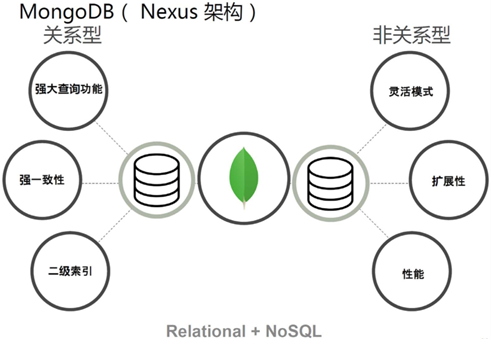
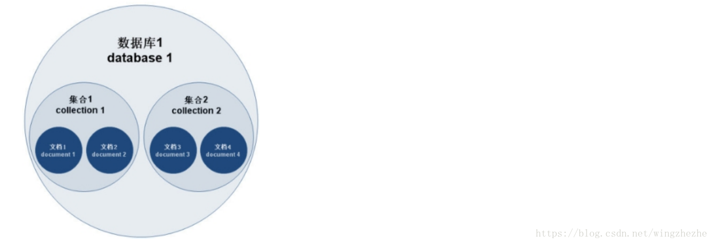

# 简介

MongoDB 是一个跨平台的，面向文档的数据库，是当前 NoSQL 数据库产品中最热门的一种。

它介于关系数据库和非关系数据库之间，是非关系数据库当中功能最丰富，最像关系数据库的产品。

它支持的数据结构非常松散，是类似 JSON 的 BSON 格式，因此可以存储比较复杂的数据类型。


# 特点

 MongoDB 最大的特点是他支持的查询语言非常强大，其语法有点类似于面向对象的查询语言，几乎可以实现类似关系数据库单表查询的绝大部分功能，而且还支持对数据建立索引。它是一个面向集合的，模式自由的文档型数据库。

1. 面向集合存储，易于存储对象类型的数据

2. 模式自由

3. 支持动态查询

4. 支持完全索引，包含内部对象

5. 支持复制和故障恢复

6. 使用高效的二进制数据存储，包括大型对象（如视频等）

7. 自动处理碎片，以支持云计算层次的扩展性

8. 支持 Python，PHP，Ruby，Java，C，C#，Javascript，Perl 及 C++语言的驱动程序，社区中也提供了对 Erlang 及.NET 等平台的驱动程序

9. 文件存储格式为 BSON（一种 JSON 的扩展）

   > **JSON**
   >
   > MongoDB使用JSON(JavaScript ObjectNotation)文档存储记录
   >
   > JSON数据库语句可以容易被解析
   >
   > 
   >
   > **BSON**
   >
   > 二进制的JSON，JSON文档的二进制编码存储格式
   >
   > BSON有JSON没有的Date和BinData
   >
   > MongoDB中document以BSON形式存放





# 体系结构

主要由：文档(document)、集合(collection)、数据库(database) 这三部分组成的。

> （1）文档（document），相当于关系数据库中的一行记录。
>
> （2）多个文档组成一个集合（collection），相当于关系数据库的表。
>
> （3）多个集合（collection），逻辑上组织在一起，就是数据库（database）。
>
> （4）一个 MongoDB 实例支持多个数据库（database）。
>


文档(document)、集合(collection)、数据库(database)的层次结构如下




MongoDB与MySQL数据库逻辑结构概念对比如下


# 权限介绍

```shell
$ use admin
$ db.createUser(
{
    user:'user',
    pwd :'123',
    customData:{"desc":"This user is for administrators"}，
    roles:[
    {
    	role:'userAdminAnyDatabase',db:'admin'
    }]
    }
)

# user ：用户名  --必须项
# pwd：密码	  --必须项
# customData	：用于描述账户信息  --非必须项
# roles：指定用户的角色，可以用一个空数组给新用户设定空角色；在roles字段,可以指定内置角色和用户定义的角# 色。--必须项（可以为空集合）
			
# role里的角色可以选：
#
```

```properties
内建的角色

数据库用户角色：read、readWrite;

数据库管理角色：dbAdmin、dbOwner、userAdmin；

集群管理角色：clusterAdmin、clusterManager、clusterMonitor、hostManager；

备份恢复角色：backup、restore；

所有数据库角色：readAnyDatabase、readWriteAnyDatabase、userAdminAnyDatabase、dbAdminAnyDatabase

超级用户角色：root // 这里还有几个角色间接或直接提供了系统超级用户的访问（dbOwner 、userAdmin、userAdminAnyDatabase）

内部角色：system
```

角色说明

> Read：允许用户读取指定数据库
>
> readWrite：允许用户读写指定数据库
>
> dbAdmin：允许用户在指定数据库中执行管理函数，如索引创建、删除，查看统计或访问system.profile
>
> userAdmin：允许用户向system.users集合写入，可以找指定数据库里创建、删除和管理用户
>
> clusterAdmin：只在admin数据库中可用，赋予用户所有分片和复制集相关函数的管理权限。
>
> readAnyDatabase：只在admin数据库中可用，赋予用户所有数据库的读权限
>
> readWriteAnyDatabase：只在admin数据库中可用，赋予用户所有数据库的读写权限
>
> userAdminAnyDatabase：只在admin数据库中可用，赋予用户所有数据库的userAdmin权限
>
> dbAdminAnyDatabase：只在admin数据库中可用，赋予用户所有数据库的dbAdmin权限。
>
> root：只在admin数据库中可用。超级账号，超级权限


<font color=#00dd00>用户在哪个库新建授权，则需要在哪个库进行auth验证</font>

```shell
$ db.auth('test1','test1')
```


开启权限验证

```properties
vim  /opt/mongodb-linux-x86_64-4.0.13/bin/mongodb.conf

auth=true
```


# 数据类型

null：

​	用于表示空值或者不存在的字段，{“x”:null}

布尔型：

​	布尔类型有两个值true和false，{“x”:true}

数值：

​	shell默认使用64为浮点型数值。{“x”：3.14}或{“x”：3}。对于整型值，可以使用NumberInt（4字节符号整数）或NumberLong（8字节符号整数），{“x”:NumberInt(“3”)}{“x”:NumberLong(“3”)}

字符串：

​	UTF-8字符串都可以表示为字符串类型的数据，{“x”：“呵呵”}

日期：

​	日期被存储为自新纪元依赖经过的毫秒数，不存储时区，{“x”:new Date()}

正则表达式：

​	查询时，使用正则表达式作为限定条件，语法与JavaScript的正则表达式相同，{“x”:/[abc]/}

数组：

​	数据列表或数据集可以表示为数组，{“x”： [“a“，“b”,”c”]}

内嵌文档：

​	文档可以嵌套其他文档，被嵌套的文档作为值来处理，{“x”:{“y”:3 }}

对象Id：

​	对象id是一个12字节的字符串，是文档的唯一标识，{“x”: objectId() }

二进制数据：

​	二进制数据是一个任意字节的字符串。它不能直接在shell中使用。如果要将非utf-字符保存到数据库中，二进制数据是唯一的方式。

代码：

​	查询和文档中可以包括任何JavaScript代码，{“x”:function(){/…/}}


# shell 增删改查

```shell
# mongodb.conf
dbpath=/home/data/mongodb/db
logpath=/home/data/mongodb/logs/mongodb.log
port=27017
fork=true #以守护程序的方式启用，即在后台运行
#auth=true #需要认证。如果放开注释，就必须创建MongoDB的账号，使用账号与密码才可远程访问，第一次安装建议注释
bind_ip=0.0.0.0 #允许远程访问，或者直接注释，127.0.0.1是只允许本地访问

# 启动mongodb
$ mongod [--dbpath] -f /opt/mongodb-linux-x86_64-4.0.13/bin/mongodb.conf

# mongodb shell client 连接
$ mongo -h
$ mongo [options] [db address] [file names (ending in .js)]

db address can be:
  foo                   foo database on local machine
  192.168.0.5/foo       foo database on 192.168.0.5 machine
  192.168.0.5:9999/foo  foo database on 192.168.0.5 machine on port 9999
```


## 增删

```shell
# 1. 数据库 增删改查

use db1 ：#有则切换，无则新 增
    
show dbs #查看所有数据库
db #查看当前库

db.dropDatabase()


# 2. 集合（表）的增删改

db.testCollection.info  #testCollection.info表
db.testCollection #testCollection
# 当第一个文档插入时，集合就会被创建
db.table1.insert({'a':1})

show collections
show tables  #这两个是一样的

db.testCollection.info.drop()

# 3. 文档（记录）的增删改
# 没有指定_id则默认ObjectId,_id不能重复，且在插入后不可变
# 插入单条
user0={
    "name":"egon",
    "age":10,
    'hobbies':['music','read','dancing'],
    'addr':{
        'country':'China',
        'city':'BJ'
    }
}
db.testCollection.insert(user0)
db.testCollection.find()
# 插入多条
user1={
    "_id":1,
    "name":"alex",
    "age":10,
    'hobbies':['music','read','dancing'],
    'addr':{
        'country':'China',
        'city':'weifang'
    }
}
user2={
    "_id":2,
    "name":"wupeiqi",
    "age":20,
    'hobbies':['music','read','run'],
    'addr':{
        'country':'China',
        'city':'hebei'
    }
}
user3={
    "_id":3,
    "name":"yuanhao",
    "age":30,
    'hobbies':['music','drink'],
    'addr':{
        'country':'China',
        'city':'heibei'
    }
}
user4={
    "_id":4,
    "name":"jingliyang",
    "age":40,
    'hobbies':['music','read','dancing','tea'],
    'addr':{
        'country':'China',
        'city':'BJ'
    }
}
user5={
    "_id":5,
    "name":"jinxin",
    "age":50,
    'hobbies':['music','read',],
    'addr':{
        'country':'China',
        'city':'henan'
    }
}
# 如果用insert会告诉你有重复的key了,但是用save就不一样了，会把原来的值直接给覆盖
db.testCollection.insertMany([user1,user2,user3,user4,user5])

db.testCollection.insert({"_id":1,"a":1,"b":2,"c":3})

# 有相同的id则覆盖，无相同的id则新增，可以指定_id,也可以不指定id，默认是Obiectid()
db.testCollection.save({"_id":1,"z":6})  #有了就把原来的覆盖了
db.testCollection.save({"_id":2,"z":6})  #如果没有id，就会新增一个
```


## 查询

```shell
# 4. 查询 
# 比较运算
# SQL：=,!=,>,<,>=,<=
# MongoDB：{key:value}代表什么等于什么,"$ne","$gt","$lt","gte","lte",其中"$ne"能用于所有数据类型
#select * from db1.usesr where id=3
db.testCollection.find({"_id":3})
#select * from db1.usesr where id!=3
db.testCollection.find({"_id":{"$ne":3}})
#select * from db1.usesr where id<3
db.testCollection.find({"_id":{"$lt":3}})
#select * from db1.usesr where id>3
db.testCollection.find({"_id":{"$gt":3}})
#select * from db1.usesr where id>=3
db.testCollection.find({"_id":{"$gte":3}})
#select * from db1.usesr where id<=3
db.testCollection.find({"_id":{"$lte":3}})


# 逻辑运算:$and,$or,$not
#1 select * from db1.user where id >=3 and id <=4;
db.user.find({"_id":{"$gte":3,"$lte":4}})
#2 select * from db1.user where id >=3 and id <=4 and age >=40;
db.user.find({
    "_id":{"$gte":3,"$lte":4},
    "age":{"$gte":40}  #结束就不要加逗号了
})
或者
db.user.find({"$and":[
    {"_id":{"$gte":3,"$lte":4}},  #一个字典就是一个条件
    {"age":{"$gte":40}}
]})
#3 select * from db1.user where id >=0 and id <=1 or id >=4 or name = "yuanhao";
db.user.find({"$or":[
{"_id":{"$lte":1,"$gte":0}},
{"_id":{"$gte":4}},
{"name":"yuanhao"}
]})
#4 select * from db1.user where id % 2 = 1;  #奇数
db.user.find({"_id":{"$mod":[2,1]}})  #取模运算，id对2取模
#取反，偶数
db.user.find({
    "_id":{"$not":{"$mod":[2,1]}}
})


# 成员运算
# SQL：in，not in
# MongoDB："$in","$nin"

#1、select * from db1.user where age in (20,30,31);
db.user.find({"age":{"$in":[20,30,31]}})
#2、select * from db1.user where name not in ('huahua','xxx');
db.user.find({"name":{"$nin":['hauhua','xxx']}})


# 正则匹配
#jin开头匹配到g或者n结尾
select * from db1.user where name regexp "^jin.*?(g|n)$"; 
db.user.find({
    "name":/^jin.*?(g|n)$/i
})


#查看指定字段
select name,age from db1.user where name regexp "^jin.*?(g|n)$";  #jin开头匹配到g或者n结尾的
db.user.find({
    "name":/^jin.*?(g|n)$/i   #//i,i代表忽略大小写
},
{  #显示匹配成功的字段
    "_id":0,  #不要
    "name":1, #要
    "age":1  #要
}
)


# 排序


# 分页


#  获取数量
```


## 修改

```shell
# 修改
# update() 方法用于更新已存在的文档
db.collection.update(
   <query>,
   <update>,
   {
     upsert: <boolean>,
     multi: <boolean>,
     writeConcern: <document>
   }
)
参数说明：
	对比update db1.t1 set name='EGON',sex='Male' where name='egon' and age=18;

    query : 相当于where条件。
    update : update的对象和一些更新的操作符（如$,$inc...等，相当于set后面的
    upsert : 可选，默认为false，代表如果不存在update的记录不更新也不插入，设置为true代表插入。
    multi : 可选，默认为false，代表只更新找到的第一条记录，设为true,代表更新找到的全部记录。
    writeConcern :可选，抛出异常的级别。

更新操作是不可分割的：若两个更新同时发送，先到达服务器的先执行，然后执行另外一个，不会破坏文档。
```


# 聚合 Aggregation

聚合操作处理数据记录并返回计算结果. 聚合操作将来自多个文档的值组合在一起，并且可以对分组的数据执行各种操作以返回单个结果. 

MongoDB提供了三种执行聚合的方式


## 1、聚合框架/管道

聚合框架可以使用多个构件创建一个管道，上一个构件的结果传给下一个构件。
这些构件包括（括号内为构件对应的操作符）：

```properties
筛选($match)
投射/重命名($project)
数组每个值拆分成独立文档 ($ unwind)
分组($group)
排序($sort)
限制($limit)
跳过($skip)
数学运算("$add", "$subtract"...)
日期("$year"...)
字符串("$substr"...),
逻辑布尔("$eq", "$and"...)
```

不同的管道操作符可以任意组合，重复使用


```shell
$ db.orders.aggregate([
   { $match: { status: "A" } },
   { $group: { _id: "$cust_id", total: { $sum: "$amount" } } }
])

# 第一阶段 ： $match阶段按status字段过滤文档，然后将status等于"A"那些文档传递到下一阶段.

# 第二阶段 ： $group阶段按cust_id字段对文档进行分组，以计算每个唯一cust_id的金额之和.

最基本的管道阶段提供过滤器 ，其操作类似于查询和修改输出文档格式的文档转换 .
```


## 2、MapReduce


## 3、单一目的聚合命令

`db.collection.count`、`db.collection.distinct`、`db.collection.estimatedDocumentCount`


Criteria可以接的一些方法和对应的mongodb方法

| Criteria                                  | Mongodb | 说明     | 备注           |
| ----------------------------------------- | ------- | -------- | -------------- |
| Criteria and (String key)                 | $and    | 并且     |                |
| Criteria andOperator (Criteria… criteria) | $and    | 并且     |                |
| Criteria orOperator (Criteria… criteria)  | $or     | 或者     |                |
| Criteria gt (Object o)                    | $gt     | 大于     |                |
| Criteria gte (Object o)                   | $gte    | 大于等于 |                |
| Criteria in (Object… o)                   | $in     | 包含     | 可以是一个数组 |
| Criteria is (Object o)                    | $is     | 等于     |                |
| Criteria lt (Object o)                    | $lt     | 小于     |                |
| Criteria lte (Object o)                   | $lte    | 小等于   |                |
| Criteria nin (Object… o)                  | $nin    | 不包含   | 可以是一个数组 |


# 索引

## 单字段索引 （Single Field Index）

```shell
$ db.employee.createIndex({'id': 1})
```


## 复合索引 (Compound Index)

### 索引field的先后顺序很关键

- MongoDB在复合索引中是根据prefix排序查询，就是说排在前面的可以单独使用。

```shell
$ db.collection.createIndex({'id': 1, 'city': 1, 'score': 1})
```

我们如下的查询可以利用索引

```shell
$ db.collection.find({'id': xxx})
$ db.collection.find({'id': xxx, 'city': xxx})
$ db.collection.find({'id': xxx, 'city':xxx, 'score': xxxx})
```

- 过滤出的document越少的field越应该放在前面，比如此例中id如果是唯一的，那么就应该放在最前面，因为这样通过id就可以锁定唯一一个文档。而如果通过city或者score过滤完成后还是会有大量文档，这就会影响最终的性能。

### 索引的排序顺序不同

复合索引最末尾的field，其排序顺序不同对于MongoDB的查询排序操作是有影响的。 

比如：

```shell
$ db.events.createIndex( { username: 1, date: -1 } )
```

这种情况下， 如下的query可以利用索引：

```shell
$ db.events.find().sort( { username: 1, date: -1 } )
```

但是如下query则无法利用index进行排序

```shell
$ db.events.find().sort( { username: 1, date: 1 } )
```


## 多key索引 （Multikey Index）

这个主要是针对数据类型为数组的类型

```shell
{"name" : "jack", "age" : 19, habbit: ["football, runnning"]}

$ db.person.createIndex( {habbit: 1} )  # 自动创建多key索引
$ db.person.find( {habbit: "football"} )
```


## 其它类型索引

### 哈希索引

这些索引在其范围内具有更随机的值分布，但*仅*支持相等匹配，而不能支持基于范围的查询.

### 地理位置索引


### 文本索引

`MongoDB`提供了一种`text`索引类型，该类型支持在集合中搜索字符串内容. 这些文本索引不存储特定于语言的*停用*词（例如" the"，" a"，" or"），并且在集合中*词干*仅存储根词.


# 索引属性

- unique

  唯一索引。这个非常常用，用于限制索引的field是否具有唯一性属性，即保证该field的值唯一

- partial

  局部索引。很有用，在索引的时候只针对符合特定条件的文档来建立索引，如下

```shell
$ db.restaurants.createIndex(
   { cuisine: 1, name: 1 },
   { partialFilterExpression: { rating: { $gt: 5 } } } # 只有当rating大于5时才会建立索引
)
```

​	这样做的好处是，我们可以只为部分数据建立索引，从而可以减少索引数据的量，除节省空间外，其检索性能也会因为较少的数据量而得到提升。

- sparse

  稀疏索引。可以认为是partial索引的一种特殊情况，由于MongoDB3.2之后已经支持partial属性，所以建议直接使用partial属性。

  索引的稀疏属性可确保索引仅包含具有索引字段的文档的条目. 索引会跳过*没有*索引字段的文档.

  可以将稀疏索引选项与唯一索引选项结合使用，以防止插入索引字段具有重复值的文档，而跳过缺少索引字段的索引文档.

- TTL

  可以用于设定文档有效期，有效期到自动删除对应的文档。


# API

```xml
<dependency>
    <groupId>org.mongodb</groupId>
    <artifactId>mongo-java-driver</artifactId>
    <version>3.11.0</version>
</dependency>
```


```java
import com.mongodb.client.*;
import com.mongodb.client.internal.MongoClientImpl;
import com.mongodb.client.model.Filters;
import org.bson.Document;
import org.junit.Test;
import org.junit.runner.RunWith;
import org.springframework.boot.test.context.SpringBootTest;
import org.springframework.data.mongodb.core.MongoTemplate;
import org.springframework.test.context.junit4.SpringRunner;

import javax.annotation.Resource;
import java.util.ArrayList;
import java.util.List;

@RunWith(SpringRunner.class)
@SpringBootTest
public class ColumnStoreOrmDemoApplicationTests {

    @Test
    public void contextLoads() {
    }

    @Test
    public void mongodbApiTest() {
        System.out.println("start mongo operate");
        // 连接到 mongodb 服务
        //com.mongodb.MongoClient mongoClient = new com.mongodb.MongoClient("host-application", 27017);
        MongoClient mongoClient = MongoClients.create("mongodb://host-application:27017");
        System.out.println("连接到 mongodb 服务");
        //连接到指定数据库
        MongoDatabase database = mongoClient.getDatabase("testMongoDB");
        System.out.println("连接到 testMongoDB 数据库");
        //创建集合
        database.createCollection("testCollection");
        System.out.println("集合创建 testCollection 成功");
        //获取集合
        MongoCollection<Document> collection = database.getCollection("testCollection");
        //插入文档
        /**
         * * 1. 创建文档 org.bson.Document 参数为key-value的格式
         * * 2. 创建文档集合List<Document>
         * * 3. 将文档集合插入数据库集合中 mongoCollection.insertMany(List<Document>)
         *      插入单个文档可以用 mongoCollection.insertOne(Document)
         * * */
        Document document = new Document("title", "MongoDB").
                append("description", "database").
                append("likes", 100).
                append("by", "Fly");
        List<Document> documents = new ArrayList<>();
        documents.add(document);
        collection.insertMany(documents);
        System.out.println("文档插入成功");
        //检索所有文档
        /**
         * 使用 com.mongodb.client.MongoCollection 类中的 find() 方法来获取集合中的所有文档。
         * 此方法返回一个游标，所以你需要遍历这个游标。
         *
         * * 1. 获取迭代器FindIterable<Document>
         * * 2. 获取游标MongoCursor<Document>
         * * 3. 通过游标遍历检索出的文档集合
         * * */
        FindIterable<Document> findIterable = collection.find();
        MongoCursor<Document> mongoCursor = findIterable.iterator();
        while (mongoCursor.hasNext()) {
            System.out.println(mongoCursor.next());
        }
        //更新文档
        //将文档中likes=100的文档修改为likes=200
        collection.updateMany(Filters.eq("likes", 100),
                new Document("$set", new Document("likes", 200)));
        //检索查看结果
        FindIterable<Document> findIterable1 = collection.find();
        MongoCursor<Document> mongoCursor1 = findIterable1.iterator();
        while (mongoCursor1.hasNext()) {
            System.out.println(mongoCursor1.next());
        }
        //删除第一个文档
        //删除符合条件的第一个文档
        collection.deleteMany(Filters.eq("likes", 200));
        //检索查看结果
        FindIterable<Document> findIterable2 = collection.find();
        MongoCursor<Document> mongoCursor2 = findIterable2.iterator();
        while (mongoCursor2.hasNext()) {
            System.out.println(mongoCursor2.next());
        }
    }
}
```


