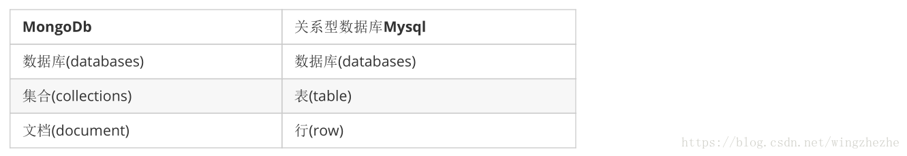

# 简介

MongoDB 是一个跨平台的，面向文档的数据库，是当前 NoSQL 数据库产品中最热门的一种。

它介于关系数据库和非关系数据库之间，是非关系数据库当中功能最丰富，最像关系数据库的产品。

它支持的数据结构非常松散，是类似 JSON 的 BSON 格式，因此可以存储比较复杂的数据类型。

# 特点

 MongoDB 最大的特点是他支持的查询语言非常强大，其语法有点类似于面向对象的查询语言，几乎可以实现类似关系数据库单表查询的绝大部分功能，而且还支持对数据建立索引。它是一个面向集合的,模式自由的文档型数据库。

1. 面向集合存储，易于存储对象类型的数据

2. 模式自由

3. 支持动态查询

4. 支持完全索引，包含内部对象

5. 支持复制和故障恢复

6. 使用高效的二进制数据存储，包括大型对象（如视频等）

7. 自动处理碎片，以支持云计算层次的扩展性

8. 支持 Python，PHP，Ruby，Java，C，C#，Javascript，Perl 及 C++语言的驱动程序，社区中也提供了对 Erlang 及.NET 等平台的驱动程序

9. 文件存储格式为 BSON（一种 JSON 的扩展）

   > **JSON**
   >
   > MongoDB使用JSON(JavaScript ObjectNotation)文档存储记录
   >
   > JSON数据库语句可以容易被解析
   >
   > 
   >
   > **BSON**
   >
   > 二进制的JSON，JSON文档的二进制编码存储格式
   >
   > BSON有JSON没有的Date和BinData
   >
   > MongoDB中document以BSON形式存放

# 体系结构

主要由：文档(document)、集合(collection)、数据库(database) 这三部分组成的。

> （1）文档（document），相当于关系数据库中的一行记录。
>
> （2）多个文档组成一个集合（collection），相当于关系数据库的表。
>
> （3）多个集合（collection），逻辑上组织在一起，就是数据库（database）。
>
> （4）一个 MongoDB 实例支持多个数据库（database）。
>

文档(document)、集合(collection)、数据库(database)的层次结构如下

MongoDB与MySQL数据库逻辑结构概念对比如下

# 数据类型

null：

​	用于表示空值或者不存在的字段，{“x”:null}

布尔型：

​	布尔类型有两个值true和false，{“x”:true}

数值：

​	shell默认使用64为浮点型数值。{“x”：3.14}或{“x”：3}。对于整型值，可以使用NumberInt（4字节符号整数）或NumberLong（8字节符号整数），{“x”:NumberInt(“3”)}{“x”:NumberLong(“3”)}

字符串：

​	UTF-8字符串都可以表示为字符串类型的数据，{“x”：“呵呵”}

日期：

​	日期被存储为自新纪元依赖经过的毫秒数，不存储时区，{“x”:new Date()}

正则表达式：

​	查询时，使用正则表达式作为限定条件，语法与JavaScript的正则表达式相同，{“x”:/[abc]/}

数组：

​	数据列表或数据集可以表示为数组，{“x”： [“a“，“b”,”c”]}

内嵌文档：

​	文档可以嵌套其他文档，被嵌套的文档作为值来处理，{“x”:{“y”:3 }}

对象Id：

​	对象id是一个12字节的字符串，是文档的唯一标识，{“x”: objectId() }

二进制数据：

​	二进制数据是一个任意字节的字符串。它不能直接在shell中使用。如果要将非utf-字符保存到数据库中，二进制数据是唯一的方式。

代码：

​	查询和文档中可以包括任何JavaScript代码，{“x”:function(){/…/}}

# 查询操作

Criteria可以接的一些方法和对应的mongodb方法

| Criteria                                  | Mongodb | 说明     | 备注           |
| ----------------------------------------- | ------- | -------- | -------------- |
| Criteria and (String key)                 | $and    | 并且     |                |
| Criteria andOperator (Criteria… criteria) | $and    | 并且     |                |
| Criteria orOperator (Criteria… criteria)  | $or     | 或者     |                |
| Criteria gt (Object o)                    | $gt     | 大于     |                |
| Criteria gte (Object o)                   | $gte    | 大于等于 |                |
| Criteria in (Object… o)                   | $in     | 包含     | 可以是一个数组 |
| Criteria is (Object o)                    | $is     | 等于     |                |
| Criteria lt (Object o)                    | $lt     | 小于     |                |
| Criteria lte (Object o)                   | $lte    | 小等于   |                |
| Criteria nin (Object… o)                  | $nin    | 不包含   | 可以是一个数组 |

