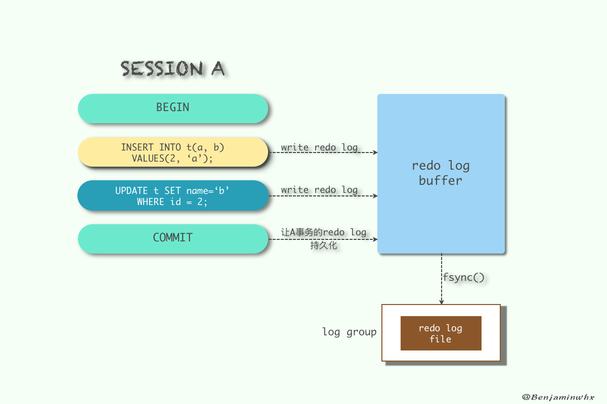

# 事务基本操作

```mysql
# 关闭自动提交
set autocommit = 0;

# 开启事务
start transaction
begin

# 保存点(savepoint 允许在事务中创建一个保存点，一个事务中可以有多个 savepoint)
savepoint identifier

# 删除一个事务的保存点
release savepoint identifier

# 回滚
rollback
rollback work

# 把事务回滚到保存点
rollback to identifier

# 提交事务
commit
```


# mysql事务隔离级别


## 隔离级别

### 读未提交


### 读已提交


### 可重复读

mysql默认隔离级别，InnoDB通过多版本并发控制（MVCC，Multiversion Concurrency Control）机制解决了该隔离级别下的幻读问题。


### 串行化


## 设置事务隔离级别

### 修改配置文件

> my.ini文件中使用 transaction-isolation 选项来设置服务器的缺省事务隔离级别
>
> ​	READ-UNCOMMITTED 
> ​	READ-COMMITTED 
> ​	REPEATABLE-READ 
> ​	SERIALIZABLE  

> 例如: transaction-isolation = READ-COMMITTED


### 命令动态设置隔离级别 

> SET [GLOBAL | SESSION] TRANSACTION ISOLATION LEVEL <isolation-level>
>
> 其中的<isolation-level>可以是：  
> 	READ UNCOMMITTED 
> 	READ COMMITTED 
> 	REPEATABLE READ 
> 	SERIALIZABLE  
>
> 例如： SET TRANSACTION ISOLATION LEVEL REPEATABLE READ;


## 查看事务隔离级别

查看系统隔离级别：
	`select @@global.tx_isolation;`
查看当前会话隔离级别
	`select @@tx_isolation;`


# 事务并发存在的问题


## 脏读

- 一个事务读取了另外一个事务未提交的数据
- 示例

| 时间 | 转账事务A                       | 取款事务B                |
| ---- | ------------------------------- | ------------------------ |
| t1   |                                 | 开始事务                 |
| t2   | 开始事务                        |                          |
| t3   |                                 | 查询账户余额为1000元     |
| t4   |                                 | 取出500元把余额改为500元 |
| t5   | 查询账户余额为500元（**脏读**） |                          |
| t6   |                                 | 撤销事务余额恢复为1000元 |
| t7   | 汇入100元把余额改为600元        |                          |
| t8   | 提交事务                        |                          |


## 不可重复读:

- 在一个事务内读取表中的数据，多次读取结果不同。（一个事务读到了其他事务已经提交的update/delete的数据。（这个不一定是错误，只是某些场合不对））
- 在一个事务内，多次读同一数据。在这个事务还没有结束时，另外一个事务也访问(update/delete)该同一数据。那么，在第一个事务中的两次读数据之间，由于第二个事务的修改，那么第一个事务两次读到的的数据可能是不一样的。这样就发生了在一个事务内两次读到的数据是不一样的，因此称为是不可重复读。
- 示例

| 时间 | 查询事务A                               | 取款事务B                |
| ---- | --------------------------------------- | ------------------------ |
| t1   |                                         | 开始事务                 |
| t2   | 开始事务                                |                          |
| t3   |                                         | 查询账户余额为1000元     |
| t4   | 查询账户余额为1000元                    |                          |
| t5   |                                         | 取出100元把余额改为900元 |
| t6   |                                         | 提交事务                 |
| t7   | 查询账户余额为900元（和T4读取的不一致） |                          |


## 虚读(幻读)

- 在一个事务内读取到了别的事务插入的(insert的)数据，导致前后读取不一致。（一般是行影响，多了一行）
- 当前事务还没有结束，其他事务操作了当前事务操作的数据(insert)，导致当前事务多次读取数据不一致。
- 示例

| 时间 | 统计事务A                               | 转账事务B                     |
| ---- | --------------------------------------- | ----------------------------- |
| t1   |                                         | 开始事务                      |
| t2   | 开始事务                                |                               |
| t3   | 统计总存款数为10000元                   |                               |
| t4   |                                         | 新增一个存款账户，存款为100元 |
| t5   |                                         | 提交事务                      |
| t6   | 再次统计总存款数为10100元（**幻象读**） |                               |


## 丢失更新

- 两个事务对同一数据进行更新，后者会覆盖先者的更新。
- 示例

| 时间 | 取款事务A                        | 转账事务B                 |
| ---- | -------------------------------- | ------------------------- |
| t1   | 开始事务                         |                           |
| t2   |                                  | 开始事务                  |
| t3   | 查询账户余额为1000元             |                           |
| t4   |                                  | 查询账户余额为1000元      |
| t5   |                                  | 汇入100元把余额改为1100元 |
| t6   |                                  | 提交事务                  |
| t7   | 取出100元将余额改为900元         |                           |
| t8   | 撤销事务                         |                           |
| t9   | 余额恢复为1000元（**丢失更新**） |                           |


# mysql的ACID

一般来说，事务是必须满足4个条件（ACID）：：原子性（Atomicity）、一致性（Consistency）、隔离性（Isolation，又称独立性）、持久性（Durability）。


**原子性**：一个事务（transaction）中的所有操作，要么全部完成，要么全部不完成，不会结束在中间某个环节。事务在执行过程中发生错误，会被回滚（Rollback）到事务开始前的状态，就像这个事务从来没有执行过一样。  

**一致性**：一致性表示事务完成后，符合逻辑运算。在事务开始之前和事务结束以后，数据库的完整性没有被破坏。这表示写入的资料必须完全符合所有的预设规则，这包含资料的精确度、串联性以及后续数据库可以自发性地完成预定的工作。

**隔离性**：数据库允许多个并发事务同时对其数据进行读写和修改的能力，隔离性可以防止多个事务并发执行时由于交叉执行而导致数据的不一致。事务隔离分为不同级别，包括读未提交（Read uncommitted）、读提交（read committed）、可重复读（repeatable read）和串行化（Serializable）。

**持久性**：事务处理结束后，对数据的修改就是永久的，即便系统故障也不会丢失。


**READ UNCOMMITTED**

​	事物A和事物B，事物A未提交的数据，事物B可以读取到，这里读取到的数据叫做“脏数据”。

**READ COMMITTED**

​	事物A和事物B，事物A提交的数据，事物B才能读取到  

**REPEATABLE READ** 

​	事务A和事务B，事务A提交之后的数据，事务B读取不到，事务B是可重复读取数据的。  

**SERIALIZABLE**

​	事务A和事务B，事务A在操作数据库时，事务B只能排队等待 。


## mysql如何保证原子性

- undo log

share tablespace或.ibd文件

实现原子性的关键，是当事务回滚时能够撤销所有已经成功执行的`sql`语句。

InnoDB实现回滚，靠的是`undo log`：当事务对数据库进行修改时，`InnoDB`会生成对应的`undo log`；如果事务执行失败或调用了`rollback`，导致事务需要回滚，便可以利用`undo log`中的信息将数据回滚到修改之前的样子。

`undo log`属于逻辑日志，它记录的是`sql`执行相关的信息：当发生回滚时，`InnoDB`会根据`undo log`的内容做与之前相反的工作：对于每个insert，回滚时会执行`delete`；对于每个delete，回滚时会执行`insert`；对于每个`update`，回滚时会执行一个相反的`update`，把数据改回去。

以`update`操作为例：当事务执行`update`时，其生成的`undo log`中会包含被修改行的主键(以便知道修改了哪些行)、修改了哪些列、这些列在修改前后的值等信息，回滚时便可以使用这些信息将数据还原到`update`之前的状态。


## mysql如何保证持久性

- redo log


ib_logfileN

InnoDB作为MySQL的存储引擎，数据是存放在磁盘中的，但如果每次读写数据都需要磁盘IO，效率会很低。为此，InnoDB提供了缓存(Buffer Pool)，Buffer Pool中包含了磁盘中部分数据页的映射，作为访问数据库的缓冲：当从数据库读取数据时，会首先从Buffer Pool中读取，如果Buffer Pool中没有，则从磁盘读取后放入Buffer Pool；当向数据库写入数据时，会首先写入Buffer Pool，Buffer Pool中修改的数据会定期刷新到磁盘中（这一过程称为刷脏）。

Buffer Pool的使用大大提高了读写数据的效率，但是也带了新的问题：如果MySQL宕机，而此时Buffer Pool中修改的数据还没有刷新到磁盘，就会导致数据的丢失，事务的持久性无法保证。

于是，redo log被引入来解决这个问题：当数据修改时，除了修改Buffer Pool中的数据，还会在redo log记录这次操作；当事务提交时，会调用fsync接口对redo log进行刷盘。如果MySQL宕机，重启时可以读取redo log中的数据，对数据库进行恢复。redo log采用的是WAL（Write-ahead logging，预写式日志），所有修改先写入日志，再更新到Buffer Pool，保证了数据不会因MySQL宕机而丢失，从而满足了持久性要求。

既然redo log也需要在事务提交时将日志写入磁盘，为什么它比直接将Buffer Pool中修改的数据写入磁盘(即刷脏)要快呢？主要有以下两方面的原因：

（1）刷脏是随机IO，因为每次修改的数据位置随机，但写redo log是追加操作，属于顺序IO。

（2）刷脏是以数据页（Page）为单位的，MySQL默认页大小是16KB，一个Page上一个小修改都要整页写入；而redo log中只包含真正需要写入的部分，无效IO大大减少。


请记住 3 点：

​		重做日志是在 InnoDB 层产生的。

​		重做日志是物理格式日志，记录的是对每个页的修改。

​		重做日志在事务进行中不断被写入。





由于重做日志文件打开没有使用O_DIRECT选项（open日志文件的时候，open没有使用O_DIRECT标志位），因此重做日志缓冲先写入文件系统缓存。为了确保重做日志写入磁盘，必须进行一次fsync操作。由于fsync的效率取决于磁盘的性能，因此磁盘的性能决定了事务提交的性能，也就是数据库的性能。由此我们可以得出在进行批量操作的时候，不要for循环里面嵌套事务。

参数 `innodb_flush_log_at_trx_commit` 用来控制重做日志刷新到磁盘的策略，该参数有3个值：0、1和2。

- 0：表示事务提交时不进行写redo log file的操作，这个操作仅在master thread中完成（master thread每隔1秒进行一次fsync操作）。
- 1：默认值，表示每次事务提交时进行写redo log file的操作。
- 2：表示事务提交时将redo log写入文件，不过仅写入文件系统的缓存中，不进行fsync操作。

我们可以看到0和2的设置都比1的效率要高，但是破坏了数据库的ACID特性，不建议使用！


- redo log block

在InnoDB引擎中，redo log都是以512字节进行存储的（和磁盘扇区的大小一样，因此redo log写入可以保证原子性，不需要double write），也就是重做日志缓存和文件都是以块的方式进行保存的，称为redo log block，每个block占512字节。


- crash recovery

事务提交成功后，事务内的所有修改都会保存到数据库，哪怕这时候数据库crash了，也要有办法来进行恢复。也就是Crash Recovery。

说到恢复，我们先来了解一个概念：什么是**LSN**？

LSN(log sequence number) 用于记录日志序号，它是一个不断递增的 unsigned long long 类型整数，占用8字节。它代表的含义有：

- redo log写入的总量。
- checkpoint的位置。
- 页的版本，用来判断是否需要进行恢复操作。

> checkpoint：它是redo log中的一个检查点，这个点之前的所有数据都已经刷新回磁盘，当DB crash后，通过对checkpoint之后的redo log进行恢复就可以了。

我们可以通过命令**show engine innodb status**来观察LSN的情况：


Log sequence number表示当前的LSN，Log flushed up to表示刷新到redo log文件的LSN，Last checkpoint at表示刷新到磁盘的LSN。如果把它们三个简写为 `A、B、C` 的话，它们的值的大小肯定为 `A>=B>=C`。

InnoDB引擎在启动时不管上次数据库运行时是否正常关闭，都会进行恢复操作。因为重做日志记录的是物理日志，因此恢复的速度比逻辑日志，如二进制日志要快很多。恢复的时候只需要找到redo log的checkpoint进行恢复即可。


## mysql如何保证隔离性

- (一个事务)写操作对(另一个事务)写操作的影响：锁机制保证隔离性
- (一个事务)写操作对(另一个事务)读操作的影响：MVCC保证隔离性


## mysql如何保证一致性

- 原子性，持久性，隔离性最终保证一致性


# InnoDB之MVCC

- 多版本并发控制(`Multi-Version Concurrency Control`, `MVCC`)是`MySQL`中基于**乐观锁**理论实现隔离级别的方式，用于实现**读已提交**和**可重复读取**隔离级别的实现。
- MVCC只在 `READ COMMITTED` 和 `REPEATABLE READ` 两个隔离级别下工作。其他两个隔离级别不能和MVCC兼容, 因为 `READ UNCOMMITTED` 总是读取最新的数据行, 而不是符合当前事务版本的数据行。而 `SERIALIZABLE` 则会对所有读取的行都加锁。
- MVCC是被Mysql中 `事务型存储引擎InnoDB` 所支持的;


## 相关概念

系统版本号：一个递增的数字，每开始一个新的事务，系统版本号就会自动递增。

事务版本号：事务开始时的系统版本号。


InnoDB下每行数据的**隐藏列**：

​	创建版本号(6-byte `DB_TRX_ID`)：创建一行数据时，将当前系统版本号作为创建版本号赋值

​	删除版本号(7-byte `DB_ROLL_PT`))：删除一行数据时，将当前系统版本号作为删除版本号赋值

​	行ID(6-byte `DB_ROW_ID` )：这个行ID随着插入新行而单调增加。如果InnoDB自动生成一个聚集索引，那么该索引将包含行ID值。否则，DB_ROW_ID列不会出现在任何索引中。


```mysql
SELECT * FROM INFORMATION_SCHEMA.INNODB_TRX;
```


- SELECT

select时读取数据的规则为：创建版本号 `<=` 当前事务版本号 `&&` 删除版本号为空或 `>` 当前事务版本号。只有符合这两个条件的记录，才能返回作为查询结果

> 创建版本号 `<=` 当前事务版本号：
>
> ​		保证取出的数据不会有后启动的事物中创建的数据。
>
> 删除版本号为空或 `>` 当前事务版本号：
>
> ​		保证了至少在该事物开启之前数据没有被删除，是应该被查出来的数据。


- INSERT

> `insert`时将当前的系统版本号赋值给创建版本号字段。


- UPDATE

> 插入一条新纪录，保存当前事务版本号为行创建版本号，同时保存当前事务版本号到原来删除的行，实际上这里的更新是通过`delete`和`insert`实现的。


- DELETE

> 删除时将当前的系统版本号赋值给删除版本号字段，标识该行数据在那一个事物中会被删除，即使实际上在未commit前该数据没有被删除。根据`select`的规则后开启的事务也不会查询到该数据。


- 快照读和当前读

  - 快照读

    当执行select操作时，innodb默认会执行快照读，会记录下这次select后的结果，之后select 的时候就会返回这次快照的数据，即使其他事务提交了不会影响当前select的数据，这就实现了可重复读了。

  - 当前读

    对于会对数据修改的操作(update、insert、delete)都是采用当前读的模式。在执行这几个操作时会读取最新的记录，即使是别的事务提交的数据也可以查询到。

    select的当前读需要手动的加锁：

    ```mysql
    select * from table where ? lock in share mode;
    select * from table where ? for update;
    ```


## MVCC保证读一致性


**示例**

```mysql
create table mvcctest( 
id int primary key not null auto_increment, 
name varchar(20));

insert into mvcctest values(NULL,'mi');
insert into mvcctest values(NULL,'kong');
```


假设系统初始事务ID为1；

| ID   | NAME | 创建时间 | 过期时间  |
| ---- | ---- | -------- | --------- |
| 1    | mi   | 1        | undefined |
| 2    | kong | 1        | undefined |


`transaction1`：

```mysql
start transaction;
select * from mvcctest;  //(1)
select * from mvcctest;  //(2)
commit
```


- 假设当执行事务1的过程中，准备执行语句(2)时，开始执行事务2：

### SELECT

`transaction2`：

```mysql
start transaction;
insert into mvcctest values(NULL,'qu');
commit;
```


| ID   | NAME | 创建时间 | 过期时间  |
| ---- | ---- | -------- | --------- |
| 1    | mi   | 1        | undefined |
| 2    | kong | 1        | undefined |
| 3    | qu   | 3        | undefined |

事务2执行完毕，开始执行事务1 语句(2)，由于事务1只能查询创建时间小于等于2的，所以事务2新增的记录在事务1中是查不出来的，这就**通过乐观锁的方式避免了幻读的产生**


### UPDATE

- 假设当执行事务1的过程中，准备执行语句(2)时，开始执行事务2：

`transaction3`：

```mysql
start transaction;
update mvcctest set name = 'fan' where id = 2;
commit;
```

InnoDB执行UPDATE，实际上是新插入了一行记录，并保存其创建时间为当前事务的ID，同时保存当前事务ID到要UPDATE的行的删除时间


| ID   | NAME | 创建时间 | 过期时间  |
| ---- | ---- | -------- | --------- |
| 1    | mi   | 1        | undefined |
| 2    | kong | 1        | 4         |
| 2    | fan  | 4        | undefined |

事务3执行完毕，开始执行事务1 语句(2)，由于事务1只能查询创建时间小于等于2的，所以事务修改的记录在事务1中是查不出来的，这样就保证了事务在两次读取时读取到的数据的状态是一致的


### DELETE

- 假设当执行事务1的过程中，准备执行语句(2)时，开始执行事务4：

`transaction4`：

```mysql
start transaction;
delete from mvcctest where id = 2;
commit;
```


| ID   | NAME | 创建时间 | 过期时间  |
| ---- | ---- | -------- | --------- |
| 1    | mi   | 1        | undefined |
| 2    | kong | 1        | 5         |

事务4执行完毕，开始执行事务1 语句(2)，由于事务1只能查询创建时间小于等于2、并且过期时间大于等于2，所以id=2的记录在事务1的 语句2中，也是可以查出来的，这样就保证了事务在两次读取时读取到的数据的状态是一致的


# InnoDB之LBCC

- Lock-Based Concurrency Control，基于锁的并发控制