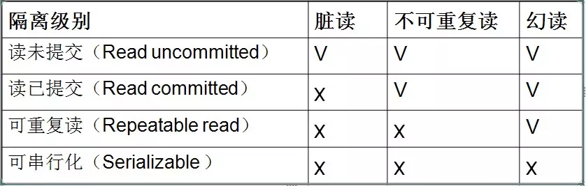

# 事务基本操作

```mysql
# 关闭自动提交
set autocommit = 0;

# 开启事务
start transaction
begin

# 保存点(savepoint 允许在事务中创建一个保存点，一个事务中可以有多个 savepoint)
savepoint identifier

# 删除一个事务的保存点
release savepoint identifier

# 回滚
rollback
rollback work

# 把事务回滚到保存点
rollback to identifier

# 提交事务
commit
```


# mysql事务隔离级别





## 隔离级别

### 读未提交

存在问题：脏读

### 读已提交

存在问题：不可重复读

### 可重复读

存在问题：虚读/幻读


mysql默认隔离级别，InnoDB通过多版本并发控制（MVCC，Multiversion Concurrency Control）机制解决了该隔离级别下的幻读问题。

### 串行化

存在问题：无


## 设置事务隔离级别

### 修改配置文件

> my.ini文件中使用 transaction-isolation 选项来设置服务器的缺省事务隔离级别
>
> ​	READ-UNCOMMITTED 
> ​	READ-COMMITTED 
> ​	REPEATABLE-READ 
> ​	SERIALIZABLE  

> 例如: transaction-isolation = READ-COMMITTED


### 命令动态设置隔离级别 

> SET [GLOBAL | SESSION] TRANSACTION ISOLATION LEVEL <isolation-level>
>
> 其中的<isolation-level>可以是：  
> 	READ UNCOMMITTED 
> 	READ COMMITTED 
> 	REPEATABLE READ 
> 	SERIALIZABLE  
>
> 例如： SET TRANSACTION ISOLATION LEVEL REPEATABLE READ;


## 查看事务隔离级别

查看系统隔离级别：
	`select @@global.tx_isolation;`
查看当前会话隔离级别
	`select @@tx_isolation;`


# 事务并发存在的问题


## 脏读

- 一个事务读取了另外一个事务未提交的数据
- 示例

| 时间 | 转账事务A                       | 取款事务B                |
| ---- | ------------------------------- | ------------------------ |
| t1   |                                 | 开始事务                 |
| t2   | 开始事务                        |                          |
| t3   |                                 | 查询账户余额为1000元     |
| t4   |                                 | 取出500元把余额改为500元 |
| t5   | 查询账户余额为500元（**脏读**） |                          |
| t6   |                                 | 撤销事务余额恢复为1000元 |
| t7   | 汇入100元把余额改为600元        |                          |
| t8   | 提交事务                        |                          |


## 不可重复读:

- 在一个事务内读取表中的数据，多次读取结果不同。（一个事务读到了其他事务已经提交的update/delete的数据。（这个不一定是错误，只是某些场合不对））
- 在一个事务内，多次读同一数据。在这个事务还没有结束时，另外一个事务也访问(update/delete)该同一数据。那么，在第一个事务中的两次读数据之间，由于第二个事务的修改，那么第一个事务两次读到的的数据可能是不一样的。这样就发生了在一个事务内两次读到的数据是不一样的，因此称为是不可重复读。
- 示例

| 时间 | 查询事务A                               | 取款事务B                |
| ---- | --------------------------------------- | ------------------------ |
| t1   |                                         | 开始事务                 |
| t2   | 开始事务                                |                          |
| t3   |                                         | 查询账户余额为1000元     |
| t4   | 查询账户余额为1000元                    |                          |
| t5   |                                         | 取出100元把余额改为900元 |
| t6   |                                         | 提交事务                 |
| t7   | 查询账户余额为900元（和T4读取的不一致） |                          |


## 虚读(幻读)

- 在一个事务内读取到了别的事务插入的(insert的)数据，导致前后读取不一致。（一般是行影响，多了一行）
- 当前事务还没有结束，其他事务操作了当前事务操作的数据(insert)，导致当前事务多次读取数据不一致。
- 示例

| 时间 | 统计事务A                               | 转账事务B                     |
| ---- | --------------------------------------- | ----------------------------- |
| t1   |                                         | 开始事务                      |
| t2   | 开始事务                                |                               |
| t3   | 统计总存款数为10000元                   |                               |
| t4   |                                         | 新增一个存款账户，存款为100元 |
| t5   |                                         | 提交事务                      |
| t6   | 再次统计总存款数为10100元（**幻象读**） |                               |


## 丢失更新

- 两个事务对同一数据进行更新，后者会覆盖先者的更新。
- 示例

| 时间 | 取款事务A                        | 转账事务B                 |
| ---- | -------------------------------- | ------------------------- |
| t1   | 开始事务                         |                           |
| t2   |                                  | 开始事务                  |
| t3   | 查询账户余额为1000元             |                           |
| t4   |                                  | 查询账户余额为1000元      |
| t5   |                                  | 汇入100元把余额改为1100元 |
| t6   |                                  | 提交事务                  |
| t7   | 取出100元将余额改为900元         |                           |
| t8   | 撤销事务                         |                           |
| t9   | 余额恢复为1000元（**丢失更新**） |                           |


# mysql的ACID

一般来说，事务是必须满足4个条件（ACID）：：原子性（Atomicity）、一致性（Consistency）、隔离性（Isolation，又称独立性）、持久性（Durability）。


**原子性**：一个事务（transaction）中的所有操作，要么全部完成，要么全部不完成，不会结束在中间某个环节。事务在执行过程中发生错误，会被回滚（Rollback）到事务开始前的状态，就像这个事务从来没有执行过一样。  

**一致性**：一致性表示事务完成后，符合逻辑运算。在事务开始之前和事务结束以后，**数据库的完整性没有被破坏**。数据库的完整性约束包括但不限于：实体完整性（如行的主键存在且唯一）、列完整性（如字段的类型、大小、长度要符合要求）、外键约束、用户自定义完整性（如转账前后，两个账户余额的和应该不变）。

**隔离性**：数据库允许多个并发事务同时对其数据进行读写和修改的能力，隔离性可以防止多个事务并发执行时由于交叉执行而导致数据的不一致。事务隔离分为不同级别，包括读未提交（Read uncommitted）、读提交（read committed）、可重复读（repeatable read）和串行化（Serializable）。

**持久性**：事务处理结束后，对数据的修改就是永久的，即便系统故障也不会丢失。


**READ UNCOMMITTED**

​	事物A和事物B，事物A未提交的数据，事物B可以读取到，这里读取到的数据叫做“脏数据”。

**READ COMMITTED**

​	事物A和事物B，事物A提交的数据，事物B才能读取到  

**REPEATABLE READ** 

​	事务A和事务B，事务A提交之后的数据，事务B读取不到，事务B是可重复读取数据的。  

**SERIALIZABLE**

​	事务A和事务B，事务A在操作数据库时，事务B只能排队等待 。


## mysql如何保证原子性

- undo log

share tablespace或.ibd文件

实现原子性的关键，是当事务回滚时能够撤销所有已经成功执行的`sql`语句。

InnoDB实现回滚，靠的是`undo log`：当事务对数据库进行修改时，`InnoDB`会生成对应的`undo log`；如果事务执行失败或调用了`rollback`，导致事务需要回滚，便可以利用`undo log`中的信息将数据回滚到修改之前的样子。

`undo log`属于逻辑日志，它记录的是`sql`执行相关的信息：当发生回滚时，`InnoDB`会根据`undo log`的内容做与之前相反的工作：对于每个insert，回滚时会执行`delete`；对于每个delete，回滚时会执行`insert`；对于每个`update`，回滚时会执行一个相反的`update`，把数据改回去。

以`update`操作为例：当事务执行`update`时，其生成的`undo log`中会包含被修改行的主键(以便知道修改了哪些行)、修改了哪些列、这些列在修改前后的值等信息，回滚时便可以使用这些信息将数据还原到`update`之前的状态。


## mysql如何保证持久性

- redo log


ib_logfileN

InnoDB作为MySQL的存储引擎，数据是存放在磁盘中的，但如果每次读写数据都需要磁盘IO，效率会很低。为此，InnoDB提供了缓存(Buffer Pool)，Buffer Pool中包含了磁盘中部分数据页的映射，作为访问数据库的缓冲：当从数据库读取数据时，会首先从Buffer Pool中读取，如果Buffer Pool中没有，则从磁盘读取后放入Buffer Pool；当向数据库写入数据时，会首先写入Buffer Pool，Buffer Pool中修改的数据会定期刷新到磁盘中（这一过程称为刷脏）。

Buffer Pool的使用大大提高了读写数据的效率，但是也带了新的问题：如果MySQL宕机，而此时Buffer Pool中修改的数据还没有刷新到磁盘，就会导致数据的丢失，事务的持久性无法保证。

于是，redo log被引入来解决这个问题：当数据修改时，除了修改Buffer Pool中的数据，还会在redo log记录这次操作；当事务提交时，会调用fsync接口对redo log进行刷盘。如果MySQL宕机，重启时可以读取redo log中的数据，对数据库进行恢复。redo log采用的是WAL（Write-ahead logging，预写式日志），所有修改先写入日志，再更新到Buffer Pool，保证了数据不会因MySQL宕机而丢失，从而满足了持久性要求。

既然redo log也需要在事务提交时将日志写入磁盘，为什么它比直接将Buffer Pool中修改的数据写入磁盘(即刷脏)要快呢？主要有以下两方面的原因：

（1）刷脏是随机IO，因为每次修改的数据位置随机，但写redo log是追加操作，属于顺序IO。

（2）刷脏是以数据页（Page）为单位的，MySQL默认页大小是16KB，一个Page上一个小修改都要整页写入；而redo log中只包含真正需要写入的部分，无效IO大大减少。


请记住 3 点：

​		重做日志是在 InnoDB 层产生的。

​		重做日志是物理格式日志，记录的是对每个页的修改。

​		重做日志在事务进行中不断被写入。


由于重做日志文件打开没有使用O_DIRECT选项（open日志文件的时候，open没有使用O_DIRECT标志位），因此重做日志缓冲先写入文件系统缓存。为了确保重做日志写入磁盘，必须进行一次fsync操作。由于fsync的效率取决于磁盘的性能，因此磁盘的性能决定了事务提交的性能，也就是数据库的性能。由此我们可以得出在进行批量操作的时候，不要for循环里面嵌套事务。

参数 `innodb_flush_log_at_trx_commit` 用来控制重做日志刷新到磁盘的策略，该参数有3个值：0、1和2。

- 0：表示事务提交时不进行写redo log file的操作，这个操作仅在master thread中完成（master thread每隔1秒进行一次fsync操作）。
- 1：默认值，表示每次事务提交时进行写redo log file的操作。
- 2：表示事务提交时将redo log写入文件，不过仅写入文件系统的缓存中，不进行fsync操作。

我们可以看到0和2的设置都比1的效率要高，但是破坏了数据库的ACID特性，不建议使用！


- redo log block

在InnoDB引擎中，redo log都是以512字节进行存储的（和磁盘扇区的大小一样，因此redo log写入可以保证原子性，不需要double write），也就是重做日志缓存和文件都是以块的方式进行保存的，称为redo log block，每个block占512字节。


- crash recovery

事务提交成功后，事务内的所有修改都会保存到数据库，哪怕这时候数据库crash了，也要有办法来进行恢复。也就是Crash Recovery。

说到恢复，我们先来了解一个概念：什么是**LSN**？

LSN(log sequence number) 用于记录日志序号，它是一个不断递增的 unsigned long long 类型整数，占用8字节。它代表的含义有：

- redo log写入的总量。
- checkpoint的位置。
- 页的版本，用来判断是否需要进行恢复操作。

> checkpoint：它是redo log中的一个检查点，这个点之前的所有数据都已经刷新回磁盘，当DB crash后，通过对checkpoint之后的redo log进行恢复就可以了。

我们可以通过命令**show engine innodb status**来观察LSN的情况：


Log sequence number表示当前的LSN，Log flushed up to表示刷新到redo log文件的LSN，Last checkpoint at表示刷新到磁盘的LSN。如果把它们三个简写为 `A、B、C` 的话，它们的值的大小肯定为 `A>=B>=C`。

InnoDB引擎在启动时不管上次数据库运行时是否正常关闭，都会进行恢复操作。因为重做日志记录的是物理日志，因此恢复的速度比逻辑日志，如二进制日志要快很多。恢复的时候只需要找到redo log的checkpoint进行恢复即可。


## mysql如何保证隔离性

- (一个事务)写操作对(另一个事务)写操作的影响：锁机制保证隔离性
- (一个事务)写操作对(另一个事务)读操作的影响：MVCC保证隔离性


## mysql如何保证一致性

- 原子性，持久性，隔离性最终保证一致性


# InnoDB之MVCC

- 多版本并发控制(`Multi-Version Concurrency Control`, `MVCC`)是`MySQL`中基于**乐观锁**理论实现隔离级别的方式，用于实现**读已提交**和**可重复读取**隔离级别的实现。
- MVCC只在 `READ COMMITTED` 和 `REPEATABLE READ` 两个隔离级别下工作。其他两个隔离级别不能和MVCC兼容, 因为 `READ UNCOMMITTED` 总是读取最新的数据行, 而不是符合当前事务版本的数据行。而 `SERIALIZABLE` 则会对所有读取的行都加锁。
- MVCC是被Mysql中 `事务型存储引擎InnoDB` 所支持的;


## 相关概念

系统版本号：一个递增的数字，每开始一个新的事务，系统版本号就会自动递增。

事务版本号：事务开始时的系统版本号。


InnoDB下每行数据的**隐藏列**：

​	创建版本号(6-byte `DB_TRX_ID`)：创建一行数据时，将当前系统版本号作为创建版本号赋值

​	删除版本号(7-byte `DB_ROLL_PT`))：删除一行数据时，将当前系统版本号作为删除版本号赋值

​	行ID(6-byte `DB_ROW_ID` )：这个行ID随着插入新行而单调增加。如果InnoDB自动生成一个聚集索引，那么该索引将包含行ID值。否则，DB_ROW_ID列不会出现在任何索引中。


```mysql
SELECT * FROM INFORMATION_SCHEMA.INNODB_TRX;
```


- SELECT

select时读取数据的规则为：创建版本号 `<=` 当前事务版本号 `&&` 删除版本号为空或 `>` 当前事务版本号。只有符合这两个条件的记录，才能返回作为查询结果

> 创建版本号 `<=` 当前事务版本号：
>
> ​		保证取出的数据不会有后启动的事物中创建的数据。
>
> 删除版本号为空或 `>` 当前事务版本号：
>
> ​		保证了至少在该事物开启之前数据没有被删除，是应该被查出来的数据。


- INSERT

> `insert`时将当前的系统版本号赋值给创建版本号字段。


- UPDATE

> 插入一条新纪录，保存当前事务版本号为行创建版本号，同时保存当前事务版本号到原来删除的行，实际上这里的更新是通过`delete`和`insert`实现的。


- DELETE

> 删除时将当前的系统版本号赋值给删除版本号字段，标识该行数据在那一个事物中会被删除，即使实际上在未commit前该数据没有被删除。根据`select`的规则后开启的事务也不会查询到该数据。


- 快照读和当前读

  - 快照读

    当执行select操作时，innodb默认会执行快照读，会记录下这次select后的结果，之后select 的时候就会返回这次快照的数据，即使其他事务提交了不会影响当前select的数据，这就实现了可重复读了。

  - 当前读

    对于会对数据修改的操作(update、insert、delete)都是采用当前读的模式。在执行这几个操作时会读取最新的记录，即使是别的事务提交的数据也可以查询到。

    select的当前读需要手动的加锁：

    ```mysql
    select * from table where ? lock in share mode;
    select * from table where ? for update;
    ```


## MVCC保证读一致性


**示例**

```mysql
create table mvcctest( 
id int primary key not null auto_increment, 
name varchar(20));

insert into mvcctest values(NULL,'mi');
insert into mvcctest values(NULL,'kong');
```


假设系统初始事务ID为1；

| ID   | NAME | 创建时间 | 过期时间  |
| ---- | ---- | -------- | --------- |
| 1    | mi   | 1        | undefined |
| 2    | kong | 1        | undefined |


`transaction1`：

```mysql
start transaction;
select * from mvcctest;  //(1)
select * from mvcctest;  //(2)
commit
```


- 假设当执行事务1的过程中，准备执行语句(2)时，开始执行事务2：

### SELECT

`transaction2`：

```mysql
start transaction;
insert into mvcctest values(NULL,'qu');
commit;
```


| ID   | NAME | 创建时间 | 过期时间  |
| ---- | ---- | -------- | --------- |
| 1    | mi   | 1        | undefined |
| 2    | kong | 1        | undefined |
| 3    | qu   | 3        | undefined |

事务2执行完毕，开始执行事务1 语句(2)，由于事务1只能查询创建时间小于等于2的，所以事务2新增的记录在事务1中是查不出来的，这就**通过乐观锁的方式避免了幻读的产生**


### UPDATE

- 假设当执行事务1的过程中，准备执行语句(2)时，开始执行事务2：

`transaction3`：

```mysql
start transaction;
update mvcctest set name = 'fan' where id = 2;
commit;
```

InnoDB执行UPDATE，实际上是新插入了一行记录，并保存其创建时间为当前事务的ID，同时保存当前事务ID到要UPDATE的行的删除时间


| ID   | NAME | 创建时间 | 过期时间  |
| ---- | ---- | -------- | --------- |
| 1    | mi   | 1        | undefined |
| 2    | kong | 1        | 4         |
| 2    | fan  | 4        | undefined |

事务3执行完毕，开始执行事务1 语句(2)，由于事务1只能查询创建时间小于等于2的，所以事务修改的记录在事务1中是查不出来的，这样就保证了事务在两次读取时读取到的数据的状态是一致的


### DELETE

- 假设当执行事务1的过程中，准备执行语句(2)时，开始执行事务4：

`transaction4`：

```mysql
start transaction;
delete from mvcctest where id = 2;
commit;
```


| ID   | NAME | 创建时间 | 过期时间  |
| ---- | ---- | -------- | --------- |
| 1    | mi   | 1        | undefined |
| 2    | kong | 1        | 5         |

事务4执行完毕，开始执行事务1 语句(2)，由于事务1只能查询创建时间小于等于2、并且过期时间大于等于2，所以id=2的记录在事务1的 语句2中，也是可以查出来的，这样就保证了事务在两次读取时读取到的数据的状态是一致的


# innodb purge

## 为什么MySQL InnoDB需要Purge操作

InnoDB中delete所做删除只是标记为删除的状态，实际上并没有删除掉，因为MVCC机制的存在，要保留之前的版本为并发所使用。最终的删除由purge线程来决定的什么时候来真正删除文件的。


## 参数

```properties
# 用来设置每次purge操作需要清理的undo log page的数量。【默认300，表示每次清理300个page，支持动态修改】

# 设置的越大，表示每次回收的页也就越多，可供重用的undo page也就越多，就能减少磁盘存储空间与分配的开销。不过该参数设置得太大，则每次需要purge处理更多的undo page，从而导致CPU和磁盘IO过于集中于对undo log的处理，使性能下降。普通用户不建议调整这个参数。
innodb_purge_batch_size


# 当有很多的表进行DML操作时候， 增大 innodb_purge_threads 能提高purge的效率(清理掉MVCC机制导致的老旧数据)。

# 现在的MySQL版本中。purge线程已经从master线程中独立出来,使用单独的线程提高了可伸缩性。

# 从MySQL5.7.8开始，这个参数默认是4，最大可以设置为32.【老版本里面这个值默认是1】
innodb_purge_threads


# 当InnoDB存储引擎的压力非常大时，并不能高效地进行purge操作。那么history list(undo log page数量)的长度会变得越来越长。
# innodb_max_purge_lag 就是控制history list的长度，若长度大于该值，就会延缓DML的操作。该值默认为0，表示不做任何限制。
#【不建议修改这个参数值!! 】
innodb_max_purge_lag 


#  表示当上面innodb_max_purge_lag的delay超时时间太大，超过这个参数时，将delay设置为该参数值，防止purge线程操作缓慢导致其他SQL线程长期处于等待状态。默认为0，一般不用修改。
innodb_max_purge_lag_delay
```


## 示例

会话1：

```shell
$ use test;

$ CREATE TABLE `t1` (`a` int(11) NOT NULL AUTO_INCREMENT, `b` int(11) DEFAULT '100', `c` varchar(10) NOT NULL DEFAULT 'cccc', PRIMARY KEY (`a`)) ;


$ insert into t1 (b,c) select 111,'cccccc';
```

会话2：

```shell
cd /data/mysql/test/

watch -n 1 'ls -lh t1.ibd'
```

然后再到会话1去多次执行插入数据的操作 `insert into t1 (b,c) select b,c from t1 ;`  重复执行多次，可以看到会话2的`t1.ibd`在不断在的增大。

假设等到`t1.ibd`增大到112MB时候，我们到会话1去一个全量的删除操作`delete from t1 where 1=1;` 然后少等片刻(等purge线程自动清理数据、master线程将数据落盘)。

这时候去观察到会话2窗口，可以看到的`t1.ibd`文件体积一点也没有减少。

再次到t会话1窗口去执行少量的插入操作，并观察会话2的`t1.ibd`文件体积。

可以看到`t1.ibd`文件的体积没有再次增长，(原因：purge线程将上述实验中被删除数据部分对应的磁盘空间标记为可用，可以被后续写入操作使用，这样就不用再次分配磁盘空间了)。


# InnoDB之LBCC

- Lock-Based Concurrency Control，基于锁的并发控制


# 分布式事务

## 2PC提交

- 二阶段提交协议是将事务的提交过程分成提交事务请求和执行事务提交两个阶段进行处理。

阶段1：提交事务请求

- 事务询问：协调者向所有的参与者发送事务内容，询问是否可以执行事务提交操作，并开始等待各参与者的响应
- 执行事务：各参与者节点执行事务操作，并将Undo和Redo信息记入事务日志中
- 如果参与者成功执事务操作，就反馈给协调者Yes响应，表示事物可以执行，如果没有成功执行事务，就反馈给协调者No响应，表示事务不可以执行
- 二阶段提交一些的阶段一夜被称为投票阶段，即各参与者投票票表明是否可以继续执行接下去的事务提交操作

阶段二：执行事务提交

1. 假如协调者从所有的参与者或得反馈都是Yes响应，那么就会执行事务提交。
2. 发送提交请求：协调者向所有参与者节点发出Commit请求
3. 事务提交：参与者接受到Commit请求后，会正式执行事务提交操作，并在完成提交之后放弃整个事务执行期间占用的事务资源
4. 反馈事务提交结果:参与者在完成事物提交之后，向协调者发送ACK消息
5. 完成事务：协调者接收到所有参与者反馈的ACK消息后，完成事务


## Mysql XA事务

XA的意思为“eXtended Architecture”，是The Open Group组织为分布式事务处理创建的标准。虽然MySQL 5.0是第一个支持XA的版本，但MySQL 5.7提升了XA支持的可靠性，修复了许多错误，并增加了整体测试用例覆盖率。


 MySQL 从5.0.3开始支持XA分布式事务，且只有InnoDB存储引擎支持。MySQL Connector/J 从5.0.0版本之后开始直接提供对XA的支持。


### XA 事务SQL语法

```sql
//开启XA事务，如果使用的是XA START而不是XA BEGIN，那么不支持[JOIN|RESUME]，xid是一个唯一值，表示事务分支标识符
XA {START|BEGIN} xid [JOIN|RESUME]

//结束一个XA事务，不支持[SUSPEND [FOR MIGRATE]]
XA END xid [SUSPEND [FOR MIGRATE]]

// 准备提交
XA PREPARE xid 

//提交，如果使用了ONE PHASE，则表示使用一阶段提交。两阶段提交协议中，如果只有一个RM参与，那么可以优化为一阶段提交
XA COMMIT xid [ONE PHASE]

//回滚
XA ROLLBACK xid

//列出所有处于PREPARE阶段的XA事务
XA RECOVER [CONVERT XID]
```


### XA事务状态

XA事务的状态，按照如下步骤进行展开

1. 使用XA START来启动一个XA事务，并把它置于`ACTIVE`状态。

2. 对于一个ACTIVE状态的 XA事务，我们可以执行构成事务的SQL语句，然后发布一个XA END语句。XA END把事务放入`IDLE`状态。

3. 对于一个IDLE 状态XA事务，可以执行一个XA PREPARE语句或一个XA COMMIT…ONE PHASE语句：

- XA PREPARE把事务放入`PREPARED`状态。在此点上的XA RECOVER语句将在其输出中包括事务的xid值，因为XA RECOVER会列出处于PREPARED状态的所有XA事务。
- XA COMMIT…ONE PHASE用于预备和提交事务。xid值将不会被XA RECOVER列出，因为事务终止。

4. 对于一个PREPARED状态的 XA事务，您可以发布一个XA COMMIT语句来提交和终止事务，或者发布XA ROLLBACK来回滚并终止事务。


针对一个给定的客户端连接而言，XA事务和非XA事务(即本地事务)是互斥的。

例如，已经执行了”XA START”命令来开启一个XA事务，则本地事务不会被启动，直到XA事务已经被提交或被 回滚为止。

相反的，如果已经使用START TRANSACTION启动一个本地事务，则XA语句不能被使用，直到该事务被提交或被 回滚为止。


### 通过jdbc操作mysql xa事务

注意：

业务开发人员在编写代码时，不应该直接操作这些XA事务操作的接口。因为在DTP模型中，RM上的事务分支的开启、结束、准备、提交、回滚等操作，都应该是由事务管理器TM来统一管理。

由于目前我们还没有接触到TM，那么我们不妨做一回"人肉事务管理器"，用你智慧的大脑，来控制多个mysql实例上xa事务分支的执行，提交/回滚。通过直接操作这些接口，你将对xa事务有更深刻的认识。

```java
import com.mysql.jdbc.jdbc2.optional.MysqlXAConnection;
import com.mysql.jdbc.jdbc2.optional.MysqlXid;
import javax.sql.XAConnection;
import javax.transaction.xa.XAException;
import javax.transaction.xa.XAResource;
import javax.transaction.xa.Xid;
import java.sql.Connection;
import java.sql.DriverManager;
import java.sql.PreparedStatement;
import java.sql.SQLException;
public class MysqlXAConnectionTest {
   public static void main(String[] args) throws SQLException {
      //true表示打印XA语句,，用于调试
      boolean logXaCommands = true;
      // 获得资源管理器操作接口实例 RM1
      Connection conn1 = DriverManager.getConnection("jdbc:mysql://localhost:3306/test", "root", "shxx12151022");
      XAConnection xaConn1 = new MysqlXAConnection((com.mysql.jdbc.Connection) conn1, logXaCommands);
      XAResource rm1 = xaConn1.getXAResource();
      // 获得资源管理器操作接口实例 RM2
      Connection conn2 = DriverManager.getConnection("jdbc:mysql://localhost:3306/test", "root",
            "shxx12151022");
      XAConnection xaConn2 = new MysqlXAConnection((com.mysql.jdbc.Connection) conn2, logXaCommands);
      XAResource rm2 = xaConn2.getXAResource();
      // AP请求TM执行一个分布式事务，TM生成全局事务id
      byte[] gtrid = "g12345".getBytes();
      int formatId = 1;
      try {
         // ==============分别执行RM1和RM2上的事务分支====================
         // TM生成rm1上的事务分支id
         byte[] bqual1 = "b00001".getBytes();
         Xid xid1 = new MysqlXid(gtrid, bqual1, formatId);
         // 执行rm1上的事务分支
         rm1.start(xid1, XAResource.TMNOFLAGS);//One of TMNOFLAGS, TMJOIN, or TMRESUME.
         PreparedStatement ps1 = conn1.prepareStatement("INSERT into user(name) VALUES ('tianshouzhi')");
         ps1.execute();
         rm1.end(xid1, XAResource.TMSUCCESS);
         // TM生成rm2上的事务分支id
         byte[] bqual2 = "b00002".getBytes();
         Xid xid2 = new MysqlXid(gtrid, bqual2, formatId);
         // 执行rm2上的事务分支
         rm2.start(xid2, XAResource.TMNOFLAGS);
         PreparedStatement ps2 = conn2.prepareStatement("INSERT into user(name) VALUES ('wangxiaoxiao')");
         ps2.execute();
         rm2.end(xid2, XAResource.TMSUCCESS);
         // ===================两阶段提交================================
         // phase1：询问所有的RM 准备提交事务分支
         int rm1_prepare = rm1.prepare(xid1);
         int rm2_prepare = rm2.prepare(xid2);
         // phase2：提交所有事务分支
         boolean onePhase = false; //TM判断有2个事务分支，所以不能优化为一阶段提交
         if (rm1_prepare == XAResource.XA_OK
               && rm2_prepare == XAResource.XA_OK
               ) {//所有事务分支都prepare成功，提交所有事务分支
            rm1.commit(xid1, onePhase);
            rm2.commit(xid2, onePhase);
         } else {//如果有事务分支没有成功，则回滚
            rm1.rollback(xid1);
            rm1.rollback(xid2);
         }
      } catch (XAException e) {
         // 如果出现异常，也要进行回滚
         e.printStackTrace();
      }
   }
}
```


### mysql5.7.7堆XA的改进

在5.7.7之前，如果客户端连接已终止或服务器正常退出，则回滚PREPARED事务。当客户端被Kill时，所有事务都被回滚。因此，即使XA事务处于PREPARED状态，它也无法在XA RECOVER期间恢复事务。理想情况下，当事务是PREPARED时，应该可以COMMIT或ROLLBACK事务。

```sql
mysql> CREATE TABLE t1(fld1 INT);
Query OK, 0 rows affected (0.01 sec)

mysql> COMMIT;
Query OK, 0 rows affected (0.00 sec)

mysql> XA START 'test';
Query OK, 0 rows affected (0.00 sec)

mysql> INSERT INTO t1 VALUES (1);
Query OK, 1 row affected (0.00 sec)

mysql> XA END 'test';
Query OK, 0 rows affected (0.00 sec)

mysql> XA PREPARE 'test';
Query OK, 0 rows affected (0.00 sec)

mysql> Killed

Now start another client session. 

mysql> XA COMMIT 'test';
ERROR 1397 (XAE04): XAER_NOTA: Unknown XID

mysql> XA RECOVER;
Empty set (0.00 sec)
```


在5.7.7之前，如果XA事务处于PREPARED状态并且服务器异常退出，则可以在重新启动服务器后恢复事务 - 但是它没有被复制。 服务器重启后，XA事务仍然存在于PREPARED状态，但内容无法记录在二进制日志中。因此，二进制日志不同步导致数据漂移。因此，XA无法安全地用于复制。

```sql
sql> CREATE TABLE t1(fld1 INT);
Query OK, 0 rows affected (0.01 sec)

mysql> COMMIT;
Query OK, 0 rows affected (0.00 sec)

mysql> XA START 'test';
Query OK, 0 rows affected (0.00 sec)

mysql> INSERT INTO t1 VALUES (1);
Query OK, 1 row affected (0.00 sec)

mysql> XA END 'test';
Query OK, 0 rows affected (0.00 sec)

mysql> XA PREPARE 'test';
Query OK, 0 rows affected (0.00 sec)

Now kill the server.

mysql> XA RECOVER;

ERROR 2006 (HY000): MySQL server has gone away
No connection. Trying to reconnect...
Connection id: 1
Current database: test

+----------+--------------+--------------+------+
| formatID | gtrid_length | bqual_length | data |
+----------+--------------+--------------+------+
| 1        | 4            | 0            | test |
+----------+--------------+--------------+------+
1 row in set (0.02 sec)

mysql> XA COMMIT 'test';
Query OK, 0 rows affected (0.02 sec)

mysql> SHOW BINLOG EVENS\G;
*************************** 1. row ***************************
 Log_name: nisha-PORTEGE-Z30-A-bin.000001
 Pos: 4
 Event_type: Format_desc
 Server_id: 1
 End_log_pos: 120
 Info: Server ver: 5.6.29-debug-log, Binlog ver: 4
1 row in set (0.00 sec)

mysql> SELECT * FROM t1;
+------+
| fld1 |
+------+
| 1 |
+------+
1 row in set (0.00 sec)
```


克服上述限制需要更改XA事务恢复机制和二进制日志记录机制。在5.7.7中进行了这种改进。

XA恢复机制已经扩展，当连接终止时，PREPARED XA事务将保留在事务高速缓存中，并在InnoDB中进行特殊标记。这允许客户端恢复PREPARED XA事务，然后是COMMIT / ROLLBACK。
XA事务现在使用两个不同的GTID分两个阶段进行二进制记录，这两个GTID允许事务交错。在第一阶段，当发布XA PREPARE时，直到该点的事务被记录在二进制日志中并且可以通过XA_prepare_log_event. 在第二阶段识别在发出XA COMMIT / ROLLBACK时，事务的第二部分被写入二进制日志。由于XA PREPARE是持久的，因此XA事务不会回滚，并且在服务器重新启动或客户端断开连接后仍然存在。客户端可以执行XA COMMIT / ROLLBACK，二进制日志保持最新。当GTID为ON且二进制日志关闭时，XA事务也可以正常工作。
