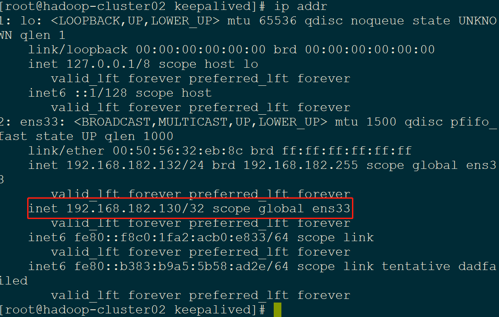

# MHA环境搭建

- 使用KeepAlived实现高可用的MYSQL_HA集群环境中，MYSQL为(Master/Master)主/主同步复制关系，保证MYSQL服务器数据的一致性，用KeepAlived提供虚拟IP，通过KeepAlived来进行故障监控，实现Mysql故障时自动切换。

## 1.安装、配置MySQL5.7

- mysql官网rpm包：`http://repo.mysql.com`

### 1.1centos7安装mysql5.7

```shell
wget http://repo.mysql.com/mysql57-community-release-el6.rpm 

rpm -ivh mysql57-community-release-el6.rpm
```

- 如果发现系统上有很多个版本的源，可以通过这个命令关掉其它的源`yum-config-manager --disable mysql57-community`，进入/etc/yum.repos.d/直接删除相关的repo文件，或者进去文件进行修改。
- 查询源：`yum repolist all | grep mysql`
- `vim /etc/yum.repos.d/mysql-community.repo`

```properties

[mysql-connectors-community]  
name=MySQL Connectors Community  
baseurl=http://repo.mysql.com/yum/mysql-connectors-community/el/6/$basearch/  
enabled=0  
gpgcheck=1  
gpgkey=file:///etc/pki/rpm-gpg/RPM-GPG-KEY-mysql  
  
[mysql-tools-community]  
name=MySQL Tools Community  
baseurl=http://repo.mysql.com/yum/mysql-tools-community/el/6/$basearch/  
enabled=0  
gpgcheck=1  
gpgkey=file:///etc/pki/rpm-gpg/RPM-GPG-KEY-mysql  
  
# Enable to use MySQL 5.5  
[mysql55-community]  
name=MySQL 5.5 Community Server  
baseurl=http://repo.mysql.com/yum/mysql-5.5-community/el/6/$basearch/  
enabled=0  
gpgcheck=1  
gpgkey=file:///etc/pki/rpm-gpg/RPM-GPG-KEY-mysql  
  
# Enable to use MySQL 5.6  
[mysql56-community]  
name=MySQL 5.6 Community Server  
baseurl=http://repo.mysql.com/yum/mysql-5.6-community/el/6/$basearch/  
enabled=1 
gpgcheck=1  
gpgkey=file:///etc/pki/rpm-gpg/RPM-GPG-KEY-mysql  
  
[mysql57-community]  
name=MySQL 5.7 Community Server  
baseurl=http://repo.mysql.com/yum/mysql-5.7-community/el/6/$basearch/  
enabled=0  
gpgcheck=1  
gpgkey=file:///etc/pki/rpm-gpg/RPM-GPG-KEY-mysql  
  
[mysql80-community]  
name=MySQL 8.0 Community Server  
baseurl=http://repo.mysql.com/yum/mysql-8.0-community/el/6/$basearch/  
enabled=0  
gpgcheck=1  
gpgkey=file:///etc/pki/rpm-gpg/RPM-GPG-KEY-mysql  
  
[mysql-tools-preview]  
name=MySQL Tools Preview  
baseurl=http://repo.mysql.com/yum/mysql-tools-preview/el/6/$basearch/  
enabled=0  
gpgcheck=1  
gpgkey=file:/etc/pki/rpm-gpg/RPM-GPG-KEY-mysql  
  
[mysql-cluster-7.5-community]  
name=MySQL Cluster 7.5 Community  
baseurl=http://repo.mysql.com/yum/mysql-cluster-7.5-community/el/6/$basearch/  
enabled=0  
gpgcheck=1  
gpgkey=file:///etc/pki/rpm-gpg/RPM-GPG-KEY-mysql  
  
[mysql-cluster-7.6-community]  
name=MySQL Cluster 7.6 Community  
baseurl=http://repo.mysql.com/yum/mysql-cluster-7.6-community/el/6/$basearch/  
enabled=0  
gpgcheck=1  
gpgkey=file:///etc/pki/rpm-gpg/RPM-GPG-KEY-mysql 
--------------------- 

保存退出。
```

- 做完这一步之后，再次进行上述的验证，如果配置正确，就能看到只有57的选项为 enabled。

```shell
[root@cdh1 files]# yum repolist all | grep mysql
mysql-cluster-7.5-community      MySQL Cluster 7.5 Community      disabled
mysql-cluster-7.6-community      MySQL Cluster 7.6 Community      disabled
mysql-connectors-community       MySQL Connectors Community       disabled
mysql-tools-community            MySQL Tools Community            disabled
mysql-tools-preview              MySQL Tools Preview              disabled
mysql55-community                MySQL 5.5 Community Server       disabled
mysql56-community                MySQL 5.6 Community Server       enabled:   396
mysql57-community                MySQL 5.7 Community Server       disabled
mysql80-community                MySQL 8.0 Community Server       disabled
```

- 安装

```shell
yum install -y mysql-community-server
```

### 1.2mysql初始化配置

#### 1.2.1mysql启动

`systemctl start mysqld.service`

#### 1.2.2修改root用户密码

- 默认密码位置：`vim /var/log/mysqld.log`

```shell
[Note] A temporary password is generated for root@localhost: 7&I(s_/CN2c&
```

- 登陆mysql，修改密码

  - 关闭`validate_password`

    `vim /etc/my.cnf`：`validate_password = off`

  - 登陆，修改密码

```shell
mysql -uroot -p + 上边的默认密码

use mysql;

=> 如下：提示需要重置密码

ERROR 1820 (HY000): You must reset your password using ALTER USER statement before executing this statement.

alter user user() identified by "liujiegbiap";

=> 如下：提示密码不符合，因为mysql5.7默认安装了validate_password插件
# SHOW VARIABLES LIKE 'validate_password%'; 查看是否安装插件

ERROR 1819 (HY000): Your password does not satisfy the current policy requirements

=> 修改mysql两个参数：

set global validate_password_policy=0;
set global validate_password_length=1;
flush privileges;

重新登陆
```

#### 1.2.3远程登陆配置

- 开启root远程登陆权限

  - 修改user表

  ```shell
  update user set host = '%' where user = 'root';
  ```

  - 给root用户授权

  ```shell
  grant all privileges  on *.* to root@'%' identified by "password";
  
  flush privileges;
  ```

### 1.3MHA配置

- 关闭防火墙，禁用selinux

#### 1.3.1节点1配置

##### 1.3.1.1添加数据同步配置

- `vim /etc/my.cnf`

```properties
# 服务器的ID,必须唯一，一般设置自己的IP
server_id=1
# 开启二进制日志功能，名字可以随便取，最好有含义（比如项目名）
log-bin=mysql-bin
# 为每个 session 分配的内存,在事务过程中用来存储二进制日志的缓存
binlog_cache_size=1M
# 主从复制的格式(mixed,statement,row,默认格式是 statement)
binlog_format=mixed
# 二进制日志自动删除/过期的天数。默认值为 0,表示不自动删除。
expire_logs_days=7
## 跳过主从复制中遇到的所有错误或指定类型的错误,避免 slave 端复制中断。 
## 如:1062 错误是指一些主键重复,1032 错误是因为主从数据库数据不一致
slave_skip_errors=1062
# 作为从服务器时的中继日志
relay_log=edu-mysql-relay-bin
# log_slave_updates 表示 slave 将复制事件写进自己的二进制日志
log_slave_updates=1
# 主键自增规则，避免主从同步ID重复的问题
auto_increment_increment=2  # 自增因子（每次加2）
auto_increment_offset=1     # 自增偏移（从1开始），单数
# 要同步的库名
binlog-do-db = test
binlog-do-db = GBIAP
# 进行镜像处理的数据库
replicate-do-db = test
replicate-do-db = GBIAP
# 复制过滤：不需要备份的数据库（MySQL库一般不同步）
replicate-ignore-db = mysql
```

##### 1.3.1.2Master配置

- 重启mysql服务

- 创建数据库同步用户，并授予相应的权限

```mysql
mysql> grant replication slave, replication client on *.* to 'hadoop'@'%' identified by 'hadoop';

mysql> flush privileges;
```

- 查看binlog文件的position（偏移）和File（日志文件）的值（从机上需要用到）

```mysql
mysql> show master status;
+------------------+----------+--------------+------------------+-------------------+
| File             | Position | Binlog_Do_DB | Binlog_Ignore_DB | Executed_Gtid_Set |
+------------------+----------+--------------+------------------+-------------------+
| mysql-bin.000001 |      154 | test,GBIAP   |                  |                   |
+------------------+----------+--------------+------------------+-------------------+
1 row in set (0.00 sec)
```

##### 1.3.1.3Slave配置

```mysql
# master_user和master_password：在hadoop-slave02上执行grant replication slave...创建的用户和密码
# master_log_file和master_log_pos：在hadoop-slave02上运行show master status;命令执行结果对应File和Position字段的值
mysql> change master to master_host='192.168.182.133',master_user='hadoop', master_password='hadoop', master_port=3306, master_log_file='mysql-bin.000001', master_log_pos=154, master_connect_retry=30;
```

```mysql
# 查看作为从节点的状态信息
mysql> show slave status \G;
*************************** 1. row ***************************
               Slave_IO_State:
                  Master_Host: hadoop-slave03
                  Master_User: hadoop
                  Master_Port: 3306
                Connect_Retry: 30
              Master_Log_File: mysql-bin.000001
          Read_Master_Log_Pos: 154
               Relay_Log_File: edu-mysql-relay-bin.000001
                Relay_Log_Pos: 4
        Relay_Master_Log_File: mysql-bin.000001
             Slave_IO_Running: No
            Slave_SQL_Running: No
              Replicate_Do_DB: test,GBIAP
          Replicate_Ignore_DB: mysql
           Replicate_Do_Table:
       Replicate_Ignore_Table:
      Replicate_Wild_Do_Table:
  Replicate_Wild_Ignore_Table:
                   Last_Errno: 0
                   Last_Error:
                 Skip_Counter: 0
          Exec_Master_Log_Pos: 154
              Relay_Log_Space: 154
              Until_Condition: None
               Until_Log_File:
                Until_Log_Pos: 0
           Master_SSL_Allowed: No
           Master_SSL_CA_File:
           Master_SSL_CA_Path:
              Master_SSL_Cert:
            Master_SSL_Cipher:
               Master_SSL_Key:
        Seconds_Behind_Master: NULL
Master_SSL_Verify_Server_Cert: No
                Last_IO_Errno: 0
                Last_IO_Error:
               Last_SQL_Errno: 0
               Last_SQL_Error:
  Replicate_Ignore_Server_Ids:
             Master_Server_Id: 0
                  Master_UUID:
             Master_Info_File: /var/lib/mysql/master.info
                    SQL_Delay: 0
          SQL_Remaining_Delay: NULL
      Slave_SQL_Running_State:
           Master_Retry_Count: 86400
                  Master_Bind:
      Last_IO_Error_Timestamp:
     Last_SQL_Error_Timestamp:
               Master_SSL_Crl:
           Master_SSL_Crlpath:
           Retrieved_Gtid_Set:
            Executed_Gtid_Set:
                Auto_Position: 0
         Replicate_Rewrite_DB:
                 Channel_Name:
           Master_TLS_Version:
1 row in set (0.00 sec)

# 说明：由于此时从节点还没有启动，Slave_IO_State的值为空，Slave_IO_Running和Slave_SQL_Running线程为No表示也没有运行。
```


##### 1.3.1.4启动Slave

- **注意**：要在节点2上创建同步帐户后再启动，否则会报连不上master错误

```mysql
# 启动从节点，开始工作接收主节点发送事件（数据库数据变更的所有事件）

mysql> start slave;# 此时再查看slave节点的状态

mysql> show slave status\G;
*************************** 1. row ***************************
               Slave_IO_State: Waiting for master to send event
                  Master_Host: 172.16.1.134
                  Master_User: gbiap
                  Master_Port: 3306
                Connect_Retry: 30
              Master_Log_File: mysql-bin.000001
          Read_Master_Log_Pos: 311
               Relay_Log_File: edu-mysql-relay-bin.000002
                Relay_Log_Pos: 477
        Relay_Master_Log_File: mysql-bin.000001
             Slave_IO_Running: Yes
            Slave_SQL_Running: Yes
              Replicate_Do_DB: GBIAP_common_config,GBIAP
          Replicate_Ignore_DB: mysql
           Replicate_Do_Table:
       Replicate_Ignore_Table:
      Replicate_Wild_Do_Table:
  Replicate_Wild_Ignore_Table:
                   Last_Errno: 0
                   Last_Error:
                 Skip_Counter: 0
          Exec_Master_Log_Pos: 311
              Relay_Log_Space: 688
              Until_Condition: None
               Until_Log_File:
                Until_Log_Pos: 0
           Master_SSL_Allowed: No
           Master_SSL_CA_File:
           Master_SSL_CA_Path:
              Master_SSL_Cert:
            Master_SSL_Cipher:
               Master_SSL_Key:
        Seconds_Behind_Master: 0
Master_SSL_Verify_Server_Cert: No
                Last_IO_Errno: 0
                Last_IO_Error:
               Last_SQL_Errno: 0
               Last_SQL_Error:
  Replicate_Ignore_Server_Ids:
             Master_Server_Id: 2
                  Master_UUID: 172dfd2f-c4bb-11e9-b116-20f17c524b5a
             Master_Info_File: /var/lib/mysql/master.info
                    SQL_Delay: 0
          SQL_Remaining_Delay: NULL
      Slave_SQL_Running_State: Slave has read all relay log; waiting for more updates
           Master_Retry_Count: 86400
                  Master_Bind:
      Last_IO_Error_Timestamp:
     Last_SQL_Error_Timestamp:
               Master_SSL_Crl:
           Master_SSL_Crlpath:
           Retrieved_Gtid_Set:
            Executed_Gtid_Set:
                Auto_Position: 0
         Replicate_Rewrite_DB:
                 Channel_Name:
           Master_TLS_Version:
1 row in set (0.00 sec)
```

#### 1.3.2节点2配置

##### 1.3.2.1添加数据同步配置

- `vim /etc/my.cnf`

```properties
server_id=2
binlog-ignore-db=mysqllog-bin=edu-mysql-bin
binlog_cache_size=1M
binlog_format=mixed
expire_logs_days=7
slave_skip_errors=1062
relay_log=mysql-relay-bin
log_slave_updates=1
#ID自增从2开始，双数
auto_increment_increment=2
auto_increment_offset=2
```

##### 1.3.2.2Master配置

- 重启mysql

- 创建数据库同步用户，并授予相应的权限（只允许hadoop用户从1hadoop-slave02上登录）

```mysql
mysql> grant replication slave, replication client on *.* to 'hadoop'@'%' identified by 'hadoop';

mysql> flush privileges;
```

- 查看binlog文件的position（偏移）和File（日志文件）的值（从机上需要用到）

```mysql
mysql> show master status;
+----------------------+----------+--------------+------------------+-------------------+| File                 | Position | Binlog_Do_DB | Binlog_Ignore_DB | Executed_Gtid_Set |
+----------------------+----------+--------------+------------------+-------------------+| edu-mysql-bin.000001 |      783 |              | mysql            |                   |
+----------------------+----------+--------------+------------------+-------------------+
1 row in set (0.00 sec)
```

- **这时可以启动节点1(205)的slave服务**

##### 1.3.2.3Slave配置

```mysql
mysql> change master to master_host='192.168.182.132',master_user='hadoop', master_password='hadoop', master_port=3306, master_log_file='mysql-bin.000001', master_log_pos=783, master_connect_retry=30;
Query OK, 0 rows affected, 2 warnings (0.11 sec)

mysql> flush privileges;

# master_log_file和master_log_pos：205节点上执行show master status;对应File和position的值
```

- 查看配置

```mysql
mysql> show slave status\G;
*************************** 1. row ***************************
               Slave_IO_State: Waiting for master to send event
                  Master_Host: 172.16.1.134
                  Master_User: gbiap
                  Master_Port: 3306
                Connect_Retry: 30
              Master_Log_File: mysql-bin.000001
          Read_Master_Log_Pos: 311
               Relay_Log_File: edu-mysql-relay-bin.000002
                Relay_Log_Pos: 477
        Relay_Master_Log_File: mysql-bin.000001
             Slave_IO_Running: Yes
            Slave_SQL_Running: Yes
              Replicate_Do_DB: GBIAP_common_config,GBIAP
          Replicate_Ignore_DB: mysql
           Replicate_Do_Table:
       Replicate_Ignore_Table:
      Replicate_Wild_Do_Table:
  Replicate_Wild_Ignore_Table:
                   Last_Errno: 0
                   Last_Error:
                 Skip_Counter: 0
          Exec_Master_Log_Pos: 311
              Relay_Log_Space: 688
              Until_Condition: None
               Until_Log_File:
                Until_Log_Pos: 0
           Master_SSL_Allowed: No
           Master_SSL_CA_File:
           Master_SSL_CA_Path:
              Master_SSL_Cert:
            Master_SSL_Cipher:
               Master_SSL_Key:
        Seconds_Behind_Master: 0
Master_SSL_Verify_Server_Cert: No
                Last_IO_Errno: 0
                Last_IO_Error:
               Last_SQL_Errno: 0
               Last_SQL_Error:
  Replicate_Ignore_Server_Ids:
             Master_Server_Id: 2
                  Master_UUID: 172dfd2f-c4bb-11e9-b116-20f17c524b5a
             Master_Info_File: /var/lib/mysql/master.info
                    SQL_Delay: 0
          SQL_Remaining_Delay: NULL
      Slave_SQL_Running_State: Slave has read all relay log; waiting for more updates
           Master_Retry_Count: 86400
                  Master_Bind:
      Last_IO_Error_Timestamp:
     Last_SQL_Error_Timestamp:
               Master_SSL_Crl:
           Master_SSL_Crlpath:
           Retrieved_Gtid_Set:
            Executed_Gtid_Set:
                Auto_Position: 0
         Replicate_Rewrite_DB:
                 Channel_Name:
           Master_TLS_Version:
1 row in set (0.00 sec)
```

##### 1.3.2.4启动Slave

```mysql
mysql> start slave;# 此时再查看slave节点的状态

mysql> show slave status\G;
*************************** 1. row ***************************
               Slave_IO_State: Waiting for master to send event
                  Master_Host: 172.16.1.134
                  Master_User: gbiap
                  Master_Port: 3306
                Connect_Retry: 30
              Master_Log_File: mysql-bin.000001
          Read_Master_Log_Pos: 311
               Relay_Log_File: edu-mysql-relay-bin.000002
                Relay_Log_Pos: 477
        Relay_Master_Log_File: mysql-bin.000001
             Slave_IO_Running: Yes
            Slave_SQL_Running: Yes
              Replicate_Do_DB: GBIAP_common_config,GBIAP
          Replicate_Ignore_DB: mysql
           Replicate_Do_Table:
       Replicate_Ignore_Table:
      Replicate_Wild_Do_Table:
  Replicate_Wild_Ignore_Table:
                   Last_Errno: 0
                   Last_Error:
                 Skip_Counter: 0
          Exec_Master_Log_Pos: 311
              Relay_Log_Space: 688
              Until_Condition: None
               Until_Log_File:
                Until_Log_Pos: 0
           Master_SSL_Allowed: No
           Master_SSL_CA_File:
           Master_SSL_CA_Path:
              Master_SSL_Cert:
            Master_SSL_Cipher:
               Master_SSL_Key:
        Seconds_Behind_Master: 0
Master_SSL_Verify_Server_Cert: No
                Last_IO_Errno: 0
                Last_IO_Error:
               Last_SQL_Errno: 0
               Last_SQL_Error:
  Replicate_Ignore_Server_Ids:
             Master_Server_Id: 2
                  Master_UUID: 172dfd2f-c4bb-11e9-b116-20f17c524b5a
             Master_Info_File: /var/lib/mysql/master.info
                    SQL_Delay: 0
          SQL_Remaining_Delay: NULL
      Slave_SQL_Running_State: Slave has read all relay log; waiting for more updates
           Master_Retry_Count: 86400
                  Master_Bind:
      Last_IO_Error_Timestamp:
     Last_SQL_Error_Timestamp:
               Master_SSL_Crl:
           Master_SSL_Crlpath:
           Retrieved_Gtid_Set:
            Executed_Gtid_Set:
                Auto_Position: 0
         Replicate_Rewrite_DB:
                 Channel_Name:
           Master_TLS_Version:
1 row in set (0.00 sec)
```

#### 1.3.3验证

- 在其中一台数据库的test数据库中新建表，插入数据，查看另一台数据库的test中是否同步。

### 1.4mysql重新初始化

- 当服务器重新分区，尤其是mysql数据路径修改后，需要重新初始化mysql

```shell
mysqld --defaults-file=/etc/my.cnf --initialize --user=mysql

#注意：
#	1.原路径(/var/lib/mysql)需要删除
#	2.配置文件中定义的datadir目录中mysql不能存在，否则初始化失败
```

- 若启动mysql成功，连接时报错`ERROR 2002 (HY000): Can't connect to local MySQL server through socket '/var/lib/mysql/mysql.sock' (2)`，需要在配置文件中指定客户点的连接socket路径：

  ```pro
  [client]
  default-character-set=utf8
  socket=/home/data/mysql/mysql.sock
  ```

## 2.keepalived安装配置

- keepalived提供虚拟ip

### 2.1安装keepalived

```shell
yum install keepalived

keepalived -v
```

### 2.2修改配置文件

- `vim /etc/keepalived/keepalived.conf`

#### 2.2.1机器1

```bash
! Configuration File for keepalived

global_defs {
    router_id HA_MySQL #标识，双主相同
}
vrrp_instance VI_1 {
     state BACKUP #注意，主从两端都配置成了backup，因为使用了nopreempt，即非抢占模式
     interface ens33 (enp1s0  ifconfig看IP标识是什么就写什么 )
     virtual_router_id 51 #分组，主备相同 （51端口号被占用可更换0-255）
     priority 100 #优先级，这个高一点则先把它作为master
     advert_int 1
     nopreempt #不主动抢占资源，设置非抢占模式
     authentication {
         auth_type PASS
         auth_pass 1111
     }
     virtual_ipaddress {
         192.168.182.130
     }
}
virtual_server 192.168.182.130 3306 {
     delay_loop 2
     lb_algo wrr #带有权重的轮询
     lb_kind DR
     persistence_timeout 60 #同一IP的连接60秒内被分配到同一台真实服务器 
     protocol TCP
     real_server 192.168.182.132 3306 {
         weight 3 #权重为3
         notify_down /opt/keepalived/keepalived_shutdown.sh #当mysq服down时，执行此脚本，杀死keepalived实现切换, 自杀脚本.
         TCP_CHECK {
             connect_timeout 10
             nb_get_retry 3
             delay_before_retry 3
             connect_port 3306
         }
     }
}
```

#### 2.2.2机器2

```bash
global_defs {
     router_id HA_MySQL
}
vrrp_instance VI_1 {
     state BACKUP
     interface  ens33
     virtual_router_id 51
     priority 90 #优先级，这个低一点
     advert_int 1
     nopreempt
     authentication {
         auth_type PASS
         auth_pass 1111
     }
     virtual_ipaddress { #虚拟IP (VIP)
        192.168.182.130
     }
}
virtual_server 192.168.182.130 3306 {
     delay_loop 2 #每2秒检查一次real_server存活
     lb_algo wrr
     lb_kind DR
     persistence_timeout 60
     protocol TCP
     real_server 192.168.182.133 3306 {
         weight 3
         notify_down /opt/keepalived/keepalived_shutdown.sh
         TCP_CHECK {
             connect_timeout 10 #连接超时时间
             nb_get_retry 3 #重连次数
             delay_before_retry 3 #重连间隔时间
             connect_port 3306 #健康检查端口，配置自己mysql服务端口
         }
     }
}
```

- 自杀脚本`/opt/keepalived/keepalived_shutdown.sh`

```bash
#!/bin/bash
pkill keepalived
```

- 说明

> 主从两端的state，都配置成了backup，因为使用了nopreempt，即非抢占模式。 
> 举个例子，当主端先启动mysql实例和keepalived后，如果此时从端也启动了mysql实例和keepalived，那么vip不会跳到从端上去，即使它的优先级为100，要大于主端的90 
>
> 而如果不设置nopreempt，那么这个时候，又分2种情况： 
> 	1.state相同，即都是master或都是backup， 优先级高的，会占有vip，和角色无关 
> 	2.state不同，即master->backup或backup->master ，优先级高的，会占有vip，和角色无关 
>
> 前提不同，结果都是一样的，即优先级是主导，谁的优先级高，vip就漂到谁那里

### 2.3测试

- 查看虚拟ip是否生效

#### 2.3.1 ip  addr



- 主机能看到虚拟ip

#### 2.3.2连接数据库查看(虚拟ip)

- `mysql -uroot -p123456 -h192.168.182.130`

```mysql
mysql> show variables like 'server_id';
+---------------+-------+| Variable_name | Value |
+---------------+-------+| server_id     | 1     |
+---------------+-------+
server_id=1是A机器。此时两台机器上的数据都是
```

#### 2.3.3制造down机 

- 停止A机器的mysql服务，查看A机器上的keepalived服务是否自动停止（自杀脚本杀死），且浮动ip飘到了B机器上