# MySQL查询执行路径

1. 客户端发送一条查询给服务器；

2. 服务器先会检查查询缓存，如果命中了缓存，则立即返回存储在缓存中的结果。否则进入下一阶段；

3. 服务器端进行SQL解析、预处理，再由优化器生成对应的执行计划；

4. MySQL根据优化器生成的执行计划，调用存储引擎的API来执行查询；

5. 将结果返回给客户端。


## 查询缓存（query cache）

在解析一个查询语句之前，如果查询缓存是打开的，那么`MySQL`会优先检查这个查询是否命中查询缓存中的数据。  
这个检查是通过一个对大小写敏感的哈希查找实现的。查询和缓存中的查询即使只有一个字节不同，那也不会匹配缓存结果，  
这种情况查询会进入下一个阶段的处理。  

如果当前的查询恰好命中了查询缓存，那么在返回查询结果之前MySQL会检查一次用户权限。  
这仍然是无须解析查询SQL语句的，因为在查询缓存中已经存放了当前查询需要访问的表信息。如果权限没有问题，  
`MySQL`会跳过所有其他阶段，直接从缓存中拿到结果并返回给客户端。  
这种情况下，查询不会被解析，不用生成执行计划，不会被执行。  

缓存配置参数：

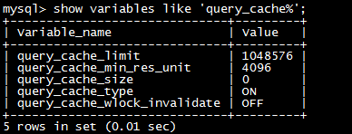

`query_cache_limit`: `MySQL`能够缓存的最大结果,如果超出,则增加 `Qcache_not_cached`的值,并删除查询结果

`query_cache_min_res_unit`: 分配内存块时的最小单位大小

`query_cache_size`: 缓存使用的总内存空间大小,单位是字节,这个值必须是1024的整数倍,否则`MySQL`实际分配可能跟这个数值不同(感觉这个应该跟文件系统的`blcok`大小有关)

`query_cache_type`: 是否打开缓存 `OFF`: 关闭 `ON`: 总是打开

`query_cache_wlock_invalidate`: 如果某个数据表被锁住,是否仍然从缓存中返回数据,默认是`OFF`,表示仍然可以返回

对查询缓存的优化是数据库性能优化的重要一环。判断流程大致如下图所示。

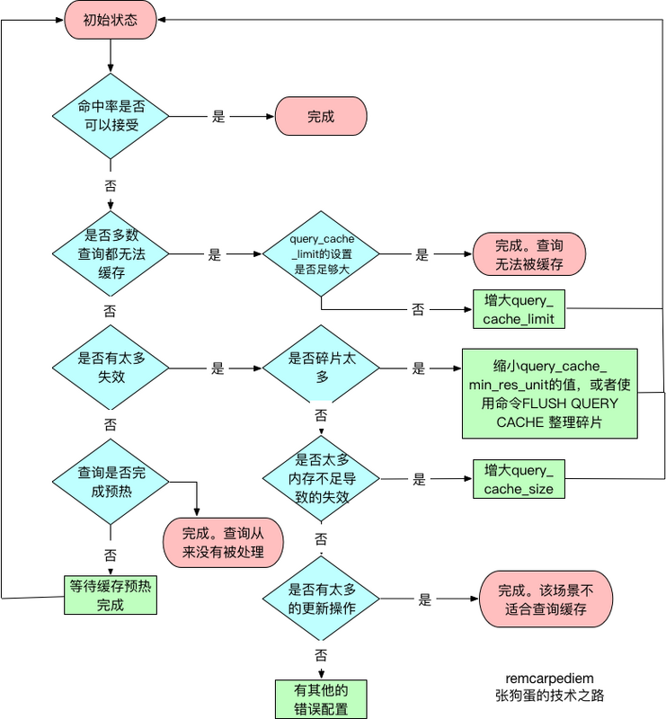

## 语法解析器和预处理器

首先，`MySQL`通过关键字将`SQL`语句进行解析，并生成一棵对应的“解析树”。`MySQL`解析器将使用`MySQL`语法规则验证和解析查询。例如，它将验证是否使用错误的关键字，或者使用关键字的顺序是否正确等，再或者它还会验证引号是否能前后正确的匹配。

预处理器则根据一些`MySQL`规则进一步检查解析树是否合法，例如，这里将检查数据表和数据列是否存在，还会解析名字和别名，看看它们是否有歧义。

下一步预处理器会验证权限，这通常很快，除非服务器上有非常多的权限设置。

## 查询优化器

现在语法树被认为合法的了，并且由优化器将其转化为执行计划。一条查询可以由很多种执行方式，最后都返回相同的结果。优化器的作用就是找到这其中最好的执行计划。

MySQL使用基于成本的优化器，它将尝试预测一个查询使用某种执行计划的成本，并选择其中成本最小的一个。最初，成本的最小单位是随机读取一个4K数据页的成本，后来成本计算公式变得更加复杂，并且引入了一些“因子”来估算某些操作的代价，如当执行一次where条件比较的成本。可以通过查询当前会话的last_query_cost的值来得知MySQL计算的当前查询的成本。

有很多种原因会导致MySQL优化器选择错误的执行计划，比如：

	1. 统计信息不准确。
	
	2. 执行计划中的成本估算不等同于实际的执行计划的成本。
	
	3. MySQL的最优可能与你想的最优不一样。
	
	4. MySQL从不考虑其他并发的查询，这可能会影响当前查询的速度。
	
	5. MySQL也不是任何时候都是基于成本的优化，有时候也会基于一些固定的规则。
	
	6. MySQL不会考虑不受其控制的成本，例如执行存储过程或者用户自定义的函数的成本。
	
	MySQL的查询优化使用了很多优化策略来生成一个最优的执行的计划。优化策略可以分为两种，静态优化和动态优化。静态优化可以直接对解析树进行分析，并完成优化。例如优化器可以通过一些简单的代数变换将where条件转换成另一种等价形式。静态优化不依赖于特别的数值，如where条件中带入的一些常数等。静态优化在第一次完成后就一直有效，即使使用不同的参数重复查询也不会变化，可以认为是一种“编译时优化”。
	
	相反，动态优化则和查询的上下文有关。也可能和很多其他因素有关，例如where条件中的取值、索引中条目对应的数据行数等，这些需要每次查询的时候重新评估，可以认为是“运行时优化”。
	
	下面是一些MySQL能够处理的优化类型：
	
	1. 重新定义关联表的顺序
	
	数据表的关联并不总是按照在查询中指定的顺序进行，决定关联的顺序是优化器很重要的一部分功能。
	
	2. 将外连接转化成内连接
	
	并不是所有的outer join语句都必须以外连接的方式执行。诸多因素，例如where条件、库表结构都可能会让外连接等价于一个内连接。MySQL能够识别这点并重写查询，让其可以调整关联顺序。
	
	3. 使用等价变换规则
	
	MySQL可以使用一些等价变换来简化并规范表达式。它可以合并和减少一些比较，还可以移除一些恒成立和一些恒不成立的判断。例如：（5=5 and a>5）将被改写为a>5。类似的，如果有（a<b and b=c）and a=5，则会被改写为 b>5 and b=c and a=5。
	
	4. 优化count()、min()和max()
	
	索引和列是否为空通常可以帮助MySQL优化这类表达式。例如，要找到一列的最小值，只需要查询对应B-tree索引最左端的记录，MySQL可以直接获取索引的第一行记录。在优化器生成执行计划的时候就可以利用这一点，在B-tree索引中，优化器会讲这个表达式最为一个常数对待。类似的，如果要查找一个最大值，也只需要读取B-tree索引的最后一个记录。如果MySQL使用了这种类型的优化，那么在explain中就可以看到“select tables optimized away”。从字面意思可以看出，它表示优化器已经从执行计划中移除了该表，并以一个常数取而代之。
	
	类似的，没有任何where条件的count(*)查询通常也可以使用存储引擎提供的一些优化，例如，MyISAM维护了一个变量来存放数据表的行数。
	
	5. 预估并转化为常数表达式
	
	6. 覆盖索引扫描
	
	当索引中的列包含所有查询中需要使用的列的时候，MySQL就可以使用索引返回需要的数据，而无需查询对应的数据行。
	
	7. 子查询优化
	
	MySQL在某些情况下可以将子查询转换成一种效率更高的形式，从而减少多个查询多次对数据进行访问。
	
	8. 提前终止查询
	
	在发现已经满足查询需求的时候，MySQL总是能够立即终止查询。一个典型的例子就是当使用了limit子句的时候。除此之外，MySQL还有几种情况也会提前终止查询，例如发现了一个不成立的条件，这时MySQL可以立即返回一个空结果。

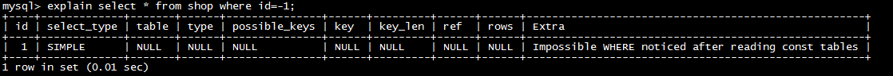

	上面的例子可以看出，查询在优化阶段就已经终止。
	
	9. 等值传播
	
	10. 列表in()的比较
	
	在很多数据库系统中，in()完全等同于多个or条件的字句，因为这两者是完全等价的。在MySQL中这点是不成立的，MySQL将in()列表中的数据先进行排序，然后通过二分查找的方式来确定列表中的值是否满足条件，这是一个o(log n)复杂度的操作，等价转换成or的查询的复杂度为o(n)，对于in()列表中有大量取值的时候，MySQL的处理速度会更快。

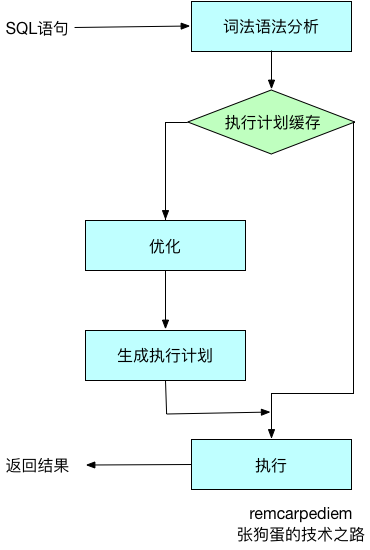

## 查询执行引擎

在解析和优化阶段，MySQL将生成查询对应的执行计划，MySQL的查询执行引擎则根据这个执行计划来完成整个查询。这里执行计划是一个数据结构，而不是和很多其他的关系型数据库那样会生成对应的字节码。

相对于查询优化阶段，查询执行阶段不是那么复杂：MySQL只是简单的根据执行计划给出的指令逐步执行。在根据执行计划逐步执行的过程中，有大量的操作需要通过调用存储引擎实现的接口来完成，这些接口就是我们称为“handler API”的接口。实际上，MySQL在优化阶段就为每个表创建了一个handler实例，优化器根据这些实例的接口可以获取表的相关信息，包括表的所有列名、索引统计信息等。

 

## 返回结果给客户端

查询执行的最后一个阶段是将结果返回给客户端。即使查询不需要返回结果给客户端，MySQL仍然会返回这个查询的一些信息，如查询影响到的行数。

如果查询可以被缓存，那么MySQL在这个阶段，会将结果存放到查询缓存中。

MySQL将结果返回客户端是一个增量、逐步返回的过程。例如，在关联表操作时，一旦服务器处理完最后一个关联表，开始生成第一条结果时，MySQL就可以开始向客户端逐步返回结果集了。

这样处理有两个好处：服务器无需存储太多的结果，也就不会因为要返回太多的结果而消耗太多的内存。另外，这样的处理也让MySQL客户端第一时间获得返回的结果。

结果集中的每一行都会以一个满足MySQL客户端/服务器通信协议的封包发送，再通过TCP协议进行传输，在TCP传输过程中，可能对MySQL的封包进行缓存然后批量传输。


# explain详解

- EXPLAIN 显示了 `MySQL` 如何使用索引来处理 `SELECT` 语句以及连接表。可以帮助选择更好的索引和写出更优化的查询语句。


```mysql
mysql> explain select * from actor;

# 会在 explain  的基础上额外提供一些查询优化的信息。
# 紧随其后通过 show warnings 命令可以 得到优化后的查询语句，从而看出优化器优化了什么。
# 额外还有 filtered 列，是一个半分比的值，rows * filtered/100 可以估算出将要和 explain 中前一个表进行连接的行数（前一个表指 explain 中的id值比当前表id值小的表）。
mysql> explain extended select * from film where id = 1;
mysql> show warnings;

mysql> explain partitions select * from film where id = 1;
```


| 列              | 描述                                                         |
| :-------------- | :----------------------------------------------------------- |
| `id`            | `select` 的序列号，有几个 select 就有几个id，并且id的顺序是按 select 出现的顺序增长的。 |
| `select_type`   | 每个`select`子句的类型                                       |
| `table`         | 显示这一行的数据是关于哪张表的。                             |
| `type`          | 这是重要的列，显示连接使用了何种类型。从最好到最差的连接类型为 `const`、`eq_ref`、`ref`、`range`、`index`和`ALL`。 |
| `possible_keys` | 显示可能应用在这张表中的索引。如果为空，没有可能的索引。可以为相关的域从`WHERE`语句中选择一个合适的语句。 |
| `key`           | 实际使用的索引。如果为`NULL`，则没有使用索引。很少的情况下，MySQL会选择优化不足的索引。这种情况下，可以在`SELECT`语句中使用`USE INDEX（indexname）` 来强制使用一个索引或者用`IGNORE INDEX（indexname）`来强制MySQL忽略索引。 |
| `key_len`       | 使用的索引的长度。在不损失精确性的情况下，长度越短越好。     |
| `ref`           | 显示索引的哪一列被使用了，如果可能的话，是一个常数。         |
| `rows`          | MySQL认为必须检查的用来返回请求数据的行数。注意这是一个预估值。 |
| `Extra`         | 关于MySQL如何解析查询的额外信息。这里可以看到的坏的例子是`Using temporary`和`Using filesort`，意思MySQL根本不能使用索引，结果是检索会很慢。 |


## select_type 

- `SIMPLE`(简单SELECT,不使用UNION或子查询等)


```mysql
explain select * from user_info where id = 2;
```


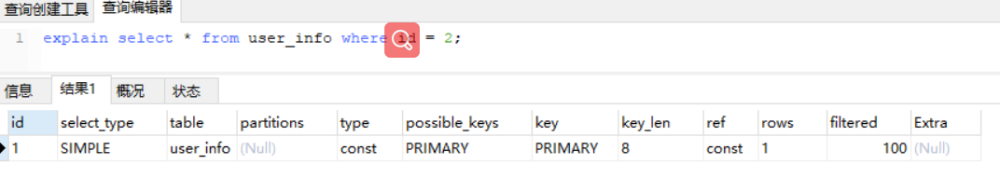


- `PRIMARY`(查询中若包含任何复杂的子部分,最外层的select被标记为PRIMARY)

- `UNION`(UNION中的第二个或后面的SELECT语句)

- `DEPENDENT UNION`(UNION中的第二个或后面的SELECT语句，取决于外面的查询)

- `UNION RESULT`(UNION的结果)


```mysql
EXPLAIN (SELECT * FROM user_info  WHERE id IN (1, 2, 3)) UNION (SELECT * FROM user_info WHERE id IN (3, 4, 5));
```


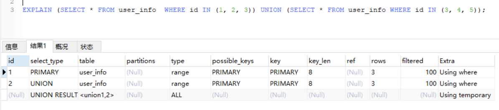


`SUBQUERY`(子查询中的第一个SELECT，**不在 from 子句中**)

`DEPENDENT SUBQUERY`(子查询中的第一个SELECT，取决于外面的查询)

`DERIVED`(包含在 **from 子句中**的子查询。MySQL会将结果存放在一个临时表中，也称为派生表)

`UNCACHEABLE SUBQUERY`(一个子查询的结果不能被缓存，必须重新评估外链接的第一行)


## type

常用的访问类型有： `ALL, index,  range, ref, eq_ref, const, system, NULL`（从左到右，性能从差到好）

从最优到最差分别为：`system > const > eq_ref > ref > fulltext > ref_or_null > index_merge > unique_subquery > index_subquery > range > index > ALL`

| 类型              | 描述                                                         |
| :---------------- | ------------------------------------------------------------ |
| `ALL`             | `Full Table Scan`， `MySQL`将遍历全表以找到匹配的行          |
| `index`           | `Full Index Scan`，`index`与`ALL`区别为`index`类型只遍历索引树。主要优点就是避免了排序, 但是开销仍然非常大。如在`Extra`列看到`Using index`，说明正在使用覆盖索引，只扫描索引的数据，它比按索引次序全表扫描的开销要小很多 |
| `range`           | 只检索给定范围的行，使用一个索引来选择行。此时key 列显示使用了哪个索引。当使用=、 <>(不等于)、>、>=、<、<=、IS NULL、<=>(相等，也可用于判断NULL)、BETWEEN 或者 IN 操作符，用常量比较关键字列时，可以使用 range |
| `index_subquery`  | 这个连接类型类似于`unique_subquery`。它代替了子查询，但它在以下形式的子查询中的非唯一索引：`value  IN (SELECT key_column FROM single_table WHERE some_expr)` |
| `unique_subquery` | 该类型替换了下面形式的IN子查询的`ref` ，`value IN (SELECT primary_key FROM single_table WHERE some_expr) ;` `unique_subquery`是一个索引查找函数，可以完全替换子查询，效率更高。 |
| `index_merge`     | 表示使用了索引合并的优化方法。                               |
| `ref_or_null`     | 类似`ref`，但是可以搜索值为NULL的行。                        |
| `fulltext`        | 全文索引                                                     |
| `ref`             | 相比 `eq_ref`，不使用唯一索引，而是使用普通索引或者唯一性索引的部分前缀，索引要和某个值相比较，可能会找到**多个**符合条件的行。`ref`可以用于使用=或<=>操作符的带索引的列。 |
| `eq_ref`          | 类似`ref`，区别就在于使用的索引是唯一索引，对于每个索引键值，表中只有**一条**记录匹配，简单来说，就是多表连接中使用`primary key`或者 `unique key`作为关联条件（高效） |
| `const`           | 当确定最多只会有一行匹配的时候，MySQL优化器会在查询前读取它而且只读取一次，因此非常快。当主键放入where子句时，mysql把这个查询转为一个常量（高效） |
| `system`          | 这是const连接类型的一种特例，表仅有一行满足条件。（高效）    |
| `NULL`            | 意味说mysql能在优化阶段分解查询语句，在执行阶段甚至用不到访问表或索引。例如从一个索引列里选取最小值可以通过单独索引查找完成。（高效） |


### ALL

- 全表扫描

```mysql
explain select * from user_info;
```


### index

- 扫描索引


```mysql
explain select name from user_info;
```


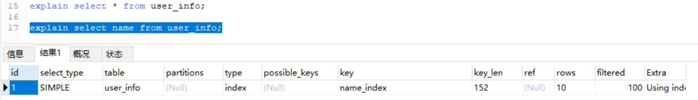


### range

- 根据索引检索给定范围的行，使用一个索引来选择行。此时key 列显示使用了哪个索引。

```mysql
explain select name from user_info where id > 3;
explain select name from user_info where id >= 3;
explain select name from user_info where id BETWEEN 3 AND 6;
explain select * from user_info where id in (2, 3, 4);
```


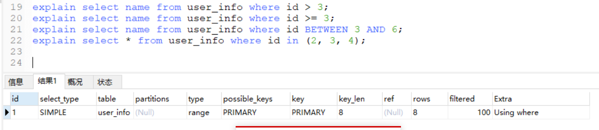


- **注意**：只有根据主键索引进行范围查询时`type`类型才会是`range`，根据唯一索引和普通索引进行范围查询的`type`类型不是`range`（是`ALL`？）。

```mysql
explain select name from user_info where vipId BETWEEN 3 AND 6;

explain select age from user_info where age between 16 and 25;
```


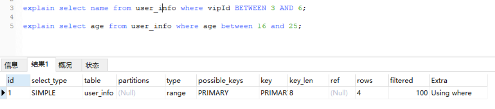


### index_subquery

- 这个连接类型类似于unique_subquery。它代替了子查询，但它在以下形式的子查询中的非唯一索引:

```mysql
value IN (SELECT key_column FROM single_table WHERE some_expr)
```


### unique_subquery

- 这种类型代替了eq_ref的一些子查询的形式

```mysql
value IN (SELECT primary_key FROM single_table WHERE some_expr)
```


### index_merge

索引合并。 例如下表：id是主键，vipId是唯一索引，name是普通索引。or 的时候没有用 primary key，而是使用了 primary key(id) 和 name索引


```mysql
explain select * from user_info where id = 3 or name = 'c';

explain select * from user_info where vipId = 3 or name = 'c';
```


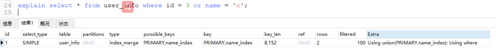


### ref_or_null

- 这个连接类型类似于ref，但是MySQL会额外搜索包含空值的行。这种连接类型优化最常用于解决子查询。

```mysql
SELECT * FROM ref_table WHERE key_column=expr OR key_column IS NULL;
```


- 使用非唯一索引做简单查询（包含NULL判断）

```mysql
explain select * from user_info where name = 'c' or name is null;
```


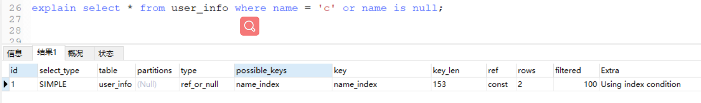


### ref

- 如果连接查询只使用键的最左端前缀，或者键不是主键或惟一索引(换句话说，如果连接不能根据键值选择单个行)，则使用ref。如果使用的键只匹配几行，这是一个很好的连接类型。

```mysql
SELECT * FROM ref_table WHERE key_column=expr;

SELECT * FROM ref_table,other_table WHERE ref_table.key_column=other_table.column;

SELECT * FROM ref_table,other_table WHERE ref_table.key_column_part1=other_table.column AND ref_table.key_column_part2=1;
```


- 使用非唯一索引做简单查询

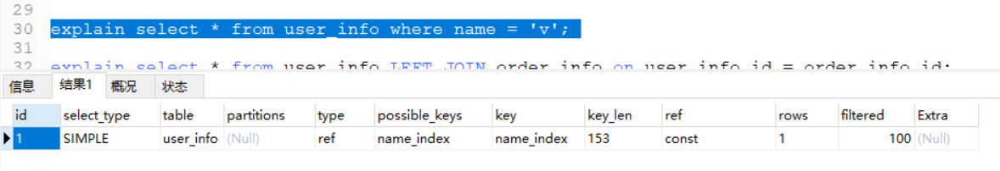


- 使用非唯一索引做关联表查询

如下所示的`eq_ref`中，如果不用id这种主键（或者唯一索引）去做关联查询数据，而是使用非唯一索引做关联查询数据，则type类型为ref


```mysql
# 关联表查询，idx_film_actor_id是film_id和actor_id的联合索引，这里使用到了film_actor的左边前缀film_id部分。

mysql> explain select * from film left join film_actor on film.id = film_actor.film_id;
+----+-------------+------------+-------+-------------------+-------------------+---------+--------------+------+-------------+
| id | select_type | table      | type  | possible_keys     | key               | key_len | ref          | rows | Extra       |
+----+-------------+------------+-------+-------------------+-------------------+---------+--------------+------+-------------+
|  1 | SIMPLE      | film       | index | NULL              | idx_name          | 33      | NULL         |    3 | Using index |
|  1 | SIMPLE      | film_actor | ref   | idx_film_actor_id | idx_film_actor_id | 4       | test.film.id |    1 | Using index |
+----+-------------+------------+-------+-------------------+-------------------+---------+--------------+------+-------------+
```


### eq_ref

- 当联接查询使用索引的所有部分并且索引是主键或惟一非空索引时，将使用此索引。

```mysql
SELECT * FROM ref_table,other_table WHERE ref_table.key_column=other_table.column;

SELECT * FROM ref_table,other_table WHERE ref_table.key_column_part1=other_table.column AND ref_table.key_column_part2=1;
```


- 示例

```mysql
explain select * from user_info LEFT JOIN order_info on user_info.id = order_info.id;
```


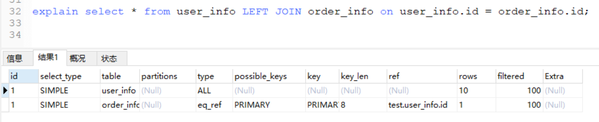


### const 

- 针对**主键**或**唯一索引**的**等值查询**扫描, 最多只返回一行数据. `const` 查询速度非常快, 因为它仅仅读取一次即可.


```mysql
SELECT * FROM tbl_name WHERE primary_key=1;

SELECT * FROM tbl_name WHERE primary_key_part1=1 AND primary_key_part2=2;
```


- 示例

```mysql
explain select * from user_info WHERE id = 3;
```


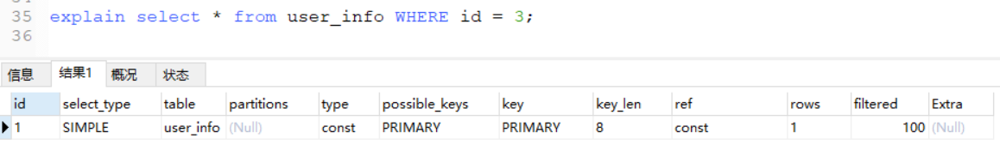


### system

表中只有一条数据. 这个类型是特殊的 `const` 类型.


## possible_keys

- 指出MySQL能使用哪个索引在表中找到记录，查询涉及到的字段上若存在索引，则该索引将被列出，但不一定被查询使用

> 如果该列是NULL，则没有相关的索引。在这种情况下，可以通过检查WHERE子句看是否它引用某些列或适合索引的列来提高你的查询性能。如果是这样，创造一个适当的索引并且再次用EXPLAIN检查查询


## Key

- 显示MySQL实际决定使用的键（索引）


如果没有选择索引，键是NULL。很少的情况下，MySQL会选择优化不足的索引。这种情况下，可以在`SELECT`语句中使用`USE INDEX（indexname）` 来强制使用一个索引或者用`IGNORE INDEX（indexname）`来强制MySQL忽略索引。


## key_len

- **表示索引中使用的字节数，可通过该列计算查询中使用的索引的长度（key_len显示的值为索引字段的最大可能长度，并非实际使用长度，即key_len是根据表定义计算而得，不是通过表内检索出的）**

  不损失精确性的情况下，长度越短越好 


举例来说，film_actor的联合索引 idx_film_actor_id 由 film_id 和 actor_id 两个int列组成，并且每个int是4字节。通过结果中的key_len=4可推断出查询使用了第一个列：film_id列来执行索引查找。

```mysql
mysql> explain select * from film_actor where film_id = 2;
+----+-------------+------------+------+-------------------+-------------------+---------+-------+------+-------------+
| id | select_type | table      | type | possible_keys     | key               | key_len | ref   | rows | Extra       |
+----+-------------+------------+------+-------------------+-------------------+---------+-------+------+-------------+
|  1 | SIMPLE      | film_actor | ref  | idx_film_actor_id | idx_film_actor_id | 4       | const |    1 | Using index |
+----+-------------+------------+------+-------------------+-------------------+---------+-------+------+-------------+
```


key_len计算规则如下：

- 字符串 
  - char(n)：n字节长度
  - varchar(n)：2字节存储字符串长度，如果是utf-8，则长度 3n + 2*; 如果是 utf8mb4 编码, 则是 4* n + 2 字节
- 数值类型 
  - tinyint：1字节
  - smallint：2字节
  - int：4字节
  - bigint：8字节　　
- 时间类型　 
  - date：3字节
  - timestamp：4字节
  - datetime：8字节
- 字段属性: NULL 属性 占用一个字节. 如果一个字段是 NOT NULL 的, 则没有此属性.

索引最大长度是768字节，当字符串过长时，mysql会做一个类似左前缀索引的处理，将前半部分的字符提取出来做索引。


## extra

- Extra是EXPLAIN输出中另外一个很重要的列，该列显示MySQL在查询过程中的一些详细信息，MySQL查询优化器执行查询的过程中对查询计划的重要补充信息。

| 值                | 意义                                                         |
| :---------------- | :----------------------------------------------------------- |
| `Distinct`        | 优化distinct操作，一旦MySQL找到了与行相联合匹配的行，就不再搜索了。 |
| `Not exists`      | MySQL优化了`LEFT JOIN`，一旦它找到了匹配`LEFT JOIN`标准的行，就不再搜索了。 |
| `Using filesort`  | 看到这个的时候，查询就需要优化了。首先是想到用索引来优化。mysql 会对结果使用一个外部索引排序，而不是按索引次序从表里读取行。此时mysql会根据联接类型浏览所有符合条件的记录，并保存排序关键字和行指针，然后排序关键字并按顺序检索行信息。 |
| `Using index`     | 这发生在对表的全部的请求列都是同一个索引的部分的时候。返回的列数据只使用了索引中的信息，而没有再去访问表中的行记录。是性能高的表现。 |
| `Using temporary` | 看到这个的时候，查询需要优化了，首先是想到用索引来优化。这里，MySQL需要创建一个临时表来存储结果，这通常发生在对不同的列集进行`ORDER BY`上，而不是`GROUP BY`上。 |
| `Using where`     | mysql服务器将在存储引擎检索行后再进行过滤。就是先读取整行数据，再按 where 条件进行检查，符合就留下，不符合就丢弃。 |


### Using filesort

- MySQL必须执行一个额外的遍历来找出如何以排序的顺序检索行。排序是通过根据连接类型遍历所有行并存储sort键和指向与WHERE子句匹配的所有行的指针来完成的。然后对键进行排序，并按排序的顺序检索行。
- 这种情况下一般是要考虑使用索引来优化的。


```mysql
explain select * from user_info order by name; # name是普通索引/唯一索引
```


### Using temporary

- 要解决查询，MySQL需要创建一个临时表来保存结果。如果查询包含以不同方式列出列的GROUP BY和ORDER BY子句，通常会发生这种情况。
- 出现这种情况一般是要进行优化的，首先是想到用索引来优化。


```mysql
explain select distinct age from user_info;# age没有索引，此时创建了张临时表来distinct
```


### Using where

- mysql服务器将在存储引擎检索行后再进行过滤。就是先读取整行数据，再按 where 条件进行检查，符合就留下，不符合就丢弃。


```mysql
explain select * from user_info where id > 3;
```


### Using index

- 仅使用索引树中的信息从表中检索列信息，而不必执行额外的查找来读取实际行。当查询仅使用单个索引中的列时，可以使用此策略。


```mysql
explain select id from user_info order by id;# id为主键
```


# 总结


## 根据主键查询

- 根据主键做等值连接查询 -> const
- 根据主键做范围查询 -> range


## 根据唯一索引查询

- 根据唯一索引做等值连接查询 -> const
- 根据唯一索引做范围查询 
  - 查询的是该唯一索引 -> range
  - 查询的是其余 -> ALL


## 根据普通索引查询

- 根据普通索引做等值连接查询 -> ref
- 根据普通索引做范围查询 -> ALL


## 连接查询


## 子查询


# 联合索引

在mysql建立联合索引时会遵循最左前缀匹配的原则，即最左优先，在检索数据时从联合索引的最左边开始匹配，


示例：对列col1、列col2和列col3建一个联合索引

```mysql
KEY test_col1_col2_col3 on test(col1,col2,col3);
```

联合索引 test_col1_col2_col3 实际建立了(col1)、(col1,col2)、(col,col2,col3)三个索引。


## 优点：

```tex
1.减少开销：
	建一个联合索引(col1,col2,col3)，实际相当于建了(col1),(col1,col2),(col1,col2,col3)三个索引。

2.覆盖索引：
	如果有如下的sql: select col1,col2,col3 from test where col1=1 and col2=2。
	那么MySQL可以直接通过遍历索引取得数据，而无需回表，这减少了很多的随机io操作。
	
3.效率高：
	索引列越多，通过索引筛选出的数据越少。有1000W条数据的表，有如下sql:select from table where col1=1 and col2=2 and col3=3,假设假设每个条件可以筛选出10%的数据，如果只有单值索引，那么通过该索引能筛选出1000W10%=100w条数据，然后再回表从100w条数据中找到符合col2=2 and col3= 3的数据，然后再排序，再分页；如果是联合索引，通过索引筛选出1000w10% 10% *10%=1w，效率提升可想而知！
```


## 使用

### 1.多列索引AND查询

```mysql
select * from test where a=? and b=? and c=?；查询效率最高，索引全覆盖。

select * from test where a=? and b=?；索引覆盖a和b。

select * from test where b=? and a=?；经过mysql的查询分析器的优化，索引覆盖a和b。

select * from test where a=?；索引覆盖a。

select * from test where b=? and c=?；没有a列，不走索引，索引失效。

select * from test where c=?；没有a列，不走索引，索引失效。
```


### 2.多列索引范围查询

```mysql
select * from test where a=? and b between ? and ? and c=?；索引覆盖a和b，因b列是范围查询，因此c列不能走索引。

select * from test where a between ? and ? and b=?；a列走索引，因a列是范围查询，因此b列是无法使用索引。

select * from test where a between ? and ? and b between ? and ? and c=?；a列走索引，因a列是范围查询，b列是范围查询也不能使用索引。
```


### 3.多列索引在排序中的应用

```mysql
select * from test where a=? and b=? order by c；a、b、c三列全覆盖索引，查询效率最高。

select * from test where a=? and b between ? and ? order by c；a、b列使用索引查找，因b列是范围查询，因此c列不能使用索引，会出现file sort。
```


## 总结

1.联合索引的使用在写where条件的顺序无关，mysql查询分析会进行优化而使用索引。但是减轻查询分析器的压力，最好和索引的从左到右的顺序一致。


2.使用等值查询，多列同时查询，索引会一直传递并生效。因此等值查询效率最好。


3.索引查找遵循最左侧原则。但是遇到**范围查询列之后的列索引失效**。


4.排序也能使用索引，合理使用索引排序，避免出现file sort。