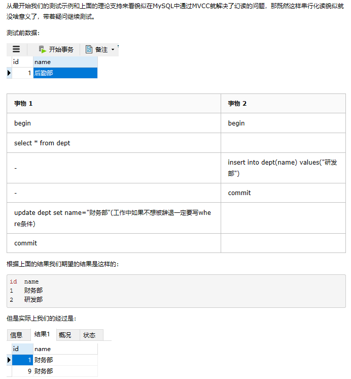

# MySQL 事务
---
## 1.概念

- MySQL 事务主要用于处理操作量大，复杂度高的数据。比如说，在人员管理系统中，你删除一个人员，你即需要删除人员的基本资料，也要删除和该人员相关的信息，如信箱，文章等等，这样，这些数据库操作语句就构成一个事务！

- 在 MySQL 中只有使用了 Innodb 数据库引擎的数据库或表才支持事务

- 事务处理可以用来维护数据库的完整性，保证成批的 SQL 语句要么全部执行，要么全部不执行

- 事务用来管理 insert,update,delete 语句

## 2.ACID

- 一般来说，事务是必须满足4个条件（ACID）：：原子性（Atomicity，或称不可分割性）、一致性（Consistency）、隔离性（Isolation，又称独立性）、持久性（Durability）。

> **原子性**：一个事务（transaction）中的所有操作，要么全部完成，要么全部不完成，不会结束在中间某个环节。事务在执行过程中发生错误，会被回滚（Rollback）到事务开始前的状态，就像这个事务从来没有执行过一样。  

> **一致性**：一致性表示事务完成后，符合逻辑运算。在事务开始之前和事务结束以后，数据库的完整性没有被破坏。这表示写入的资料必须完全符合所有的预设规则，这包含资料的精确度、串联性以及后续数据库可以自发性地完成预定的工作。

> **隔离性**：数据库允许多个并发事务同时对其数据进行读写和修改的能力，隔离性可以防止多个事务并发执行时由于交叉执行而导致数据的不一致。事务隔离分为不同级别，包括读未提交（Read uncommitted）、读提交（read committed）、可重复读（repeatable read）和串行化（Serializable）。

> **持久性**：事务处理结束后，对数据的修改就是永久的，即便系统故障也不会丢失。

## 3.事务操作

### 3.1开启事务

- MySQL 命令行的默认设置下，事务都是自动提交的，即执行 SQL 语句后就会马上执行 COMMIT 操作。因此要显式地开启一个事务务须使用命令 BEGIN 或 START TRANSACTION，或者执行命令 SET AUTOCOMMIT=0，用来禁止使用当前会话的自动提交。

### 3.2 事务控制语句

	1.显式地开启一个事务
		
	BEGIN 或 START TRANSACTION
	
	2.提交事务(使已对数据库进行的所有修改成为永久性的)
	
	COMMIT 或者 COMMIT WORK 
	
	3.回滚(结束用户的事务，并撤销正在进行的所有未提交的修改)
	
	ROLLBACK 也可以使用 ROLLBACK WORK
	
	4.保存点(SAVEPOINT 允许在事务中创建一个保存点，一个事务中可以有多个 SAVEPOINT)
	
	SAVEPOINT identifier
	
	5.删除一个事务的保存点(当没有指定的保存点时，执行该语句会抛出一个异常)
	
	RELEASE SAVEPOINT identifier
	
	6.把事务回滚到标记点
	
	ROLLBACK TO identifier
	
	7.设置事务的隔离级别
	
	SET TRANSACTION

## 相关概念

- 1.脏读：一个事务读取了另外一个事务未提交的数据
- 2.不可重复读: 在一个事务内读取表中的数据，多次读取结果不同。（一个事务读到了其他事务已经提交的update/delete的数据。（这个不一定是错误，只是某些场合不对））
- 3.虚读(幻读): 在一个事务内读取到了别的事务插入的(insert的)数据，导致前后读取不一致。（一般是行影响，多了一行）

## 4 InnoDB 存储引擎提供事务的隔离级别
- READ UNCOMMITTED	读未提交

	事物A和事物B，事物A未提交的数据，事物B可以读取到，这里读取到的数据叫做“脏数据”。  
	这种隔离级别最低，这种级别一般是在理论上存在，数据库隔离级别一般都高于该级别

- READ COMMITTED	读已提交

	事物A和事物B，事物A提交的数据，事物B才能读取到  
	这种隔离级别高于读未提交  
	换句话说，对方事物提交之后的数据，我当前事物才能读取到  
	这种级别可以避免“脏数据”  
	这种隔离级别会导致“不可重复读取”  
	Oracle默认隔离级别

- REPEATABLE READ 	可重复读

	事务A和事务B，事务A提交之后的数据，事务B读取不到  
	事务B是可重复读取数据  
	这种隔离级别高于读已提交  
	换句话说，对方提交之后的数据，我还是读取不到  
	这种隔离级别可以避免“不可重复读取”，达到可重复读取  
	比如1点和2点读到数据是同一个  
	MySQL默认级别  
	虽然可以达到可重复读取，但是会导致“幻像读”  

- SERIALIZABLE		串行化

	事务A和事务B，事务A在操作数据库时，事务B只能排队等待  
	这种隔离级别很少使用，吞吐量太低，用户体验差  
	这种级别可以避免“幻像读”，每一次读取的都是数据库中真实存在数据，事务A与事务B串行，而不并发

## 4.1设置事务隔离级别

### 4.4.1 修改配置文件  

> my.ini文件中使用transaction-isolation选项来设置服务器的缺省事务隔离级别
> READ-UNCOMMITTED  
> READ-COMMITTED  
> REPEATABLE-READ  
> SERIALIZABLE  

>例如: transaction-isolation = READ-COMMITTED

### 4.4.2 命令动态设置隔离级别 

> SET [GLOBAL | SESSION] TRANSACTION ISOLATION LEVEL <isolation-level>
> 其中的<isolation-level>可以是：  
> READ UNCOMMITTED  
> READ COMMITTED  
> REPEATABLE READ  
> SERIALIZABLE  
> 例如： SET TRANSACTION ISOLATION LEVEL REPEATABLE READ;

## 4.2 隔离级别的作用范围

>事务隔离级别的作用范围分为两种:  
全局级：对所有的会话有效  
会话级：只对当前的会话有效   

>例如，设置会话级隔离级别为READ COMMITTED ：  
mysql> SET TRANSACTION ISOLATION LEVEL READ COMMITTED；  
或：  
mysql> SET SESSION TRANSACTION ISOLATION LEVEL READ COMMITTED；  

>设置全局级隔离级别为READ COMMITTED ：   
mysql> SET GLOBAL TRANSACTION ISOLATION LEVEL READ COMMITTED

## 5.MySQL中的隔离级别的实现

- MVCC

> 多版本并发控制(Multi-Version Concurrency Control, MVCC)是MySQL中基于**乐观锁**理论实现隔离级别的方式，用于实现**读已提交**和**可重复读取**隔离级别的实现。

- 可重复读中的实现

1.在说到如何实现前先引入两个概念：

	系统版本号：一个递增的数字，每开始一个新的事务，系统版本号就会自动递增。
	
	事务版本号：事务开始时的系统版本号。

2.在MySQL中，会在表中每一条数据后面添加两个字段：

	创建版本号：创建一行数据时，将当前系统版本号作为创建版本号赋值
	
	删除版本号：删除一行数据时，将当前系统版本号作为删除版本号赋值

SELECT

> select时读取数据的规则为：创建版本号<=当前事务版本号 && 删除版本号为空或>当前事务版本号。

> 创建版本号<=当前事务版本号保证取出的数据不会有后启动的事物中创建的数据。这也是为什么在开始的示例中我们不会查出后来添加的数据的原因

> 删除版本号为空或>当前事务版本号保证了至少在该事物开启之前数据没有被删除，是应该被查出来的数据。

INSERT

> insert时将当前的系统版本号赋值给创建版本号字段。

UPDATE

> 插入一条新纪录，保存当前事务版本号为行创建版本号，同时保存当前事务版本号到原来删除的行，实际上这里的更新是通过delete和insert实现的。

DELETE

> 删除时将当前的系统版本号赋值给删除版本号字段，标识该行数据在那一个事物中会被删除，即使实际上在位commit时该数据没有被删除。根据select的规则后开启懂数据也不会查询到该数据。

- MVCC真的解决了幻读吗



本来我们希望得到的结果只是第一条数据的部门改为财务，但是结果确实两条数据都被修改了。  
这种结果告诉我们其实在MySQL**可重复读**的隔离级别中并不是完全解决了幻读的问题，而是**解决了读数据情况下的幻读问题**。  
而**对于修改的操作依旧存在幻读问题**，就是说MVCC对于幻读的解决时不彻底的。

- 快照读和当前读

```

	出现了上面的情况我们需要知道为什么会出现这种情况。在查阅了一些资料后发现在RR级别中，通过MVCC机制，

	虽然让数据变得可重复读，但我们读到的数据可能是历史数据，不是数据库最新的数据。这种读取历史数据的方式，

	我们叫它快照读 (snapshot read)，而读取数据库最新版本数据的方式，叫当前读 (current read)。
```

1.select 快照读

```

	当执行select操作是innodb默认会执行快照读，会记录下这次select后的结果，之后select 的时候就会返回这次快照的数据，

	即使其他事务提交了不会影响当前select的数据，这就实现了可重复读了。快照的生成当在第一次执行select的时候，

	也就是说假设当A开启了事务，然后没有执行任何操作，这时候B insert了一条数据然后commit,这时候A执行 select，

	那么返回的数据中就会有B添加的那条数据。之后无论再有其他事务commit都没有关系，因为快照已经生成了，
	后面的select都是根据快照来的。
```

2.当前读

```

	对于会对数据修改的操作(update、insert、delete)都是采用当前读的模式。在执行这几个操作时会读取最新的记录，

	即使是别的事务提交的数据也可以查询到。假设要update一条记录，但是在另一个事务中已经delete掉这条数据并且

	commit了，如果update就会产生冲突，所以在update的时候需要知道最新的数据。也正是因为这样所以才导致上面我

	们测试的那种情况。
```

select的当前读需要手动的加锁：

	select * from table where ? lock in share mode;
	select * from table where ? for update;

- 如何解决幻读

很明显可重复读的隔离级别没有办法彻底的解决幻读的问题，如果我们的项目中需要解决幻读的话也有两个办法：

```

	1.使用串行化读的隔离级别
	2.MVCC+next-key locks：next-key locks由record locks(索引加锁) 
	  和 gap locks(间隙锁，每次锁住的不光是需要使用的数据，还会锁住这些数据附近的数据)
```
