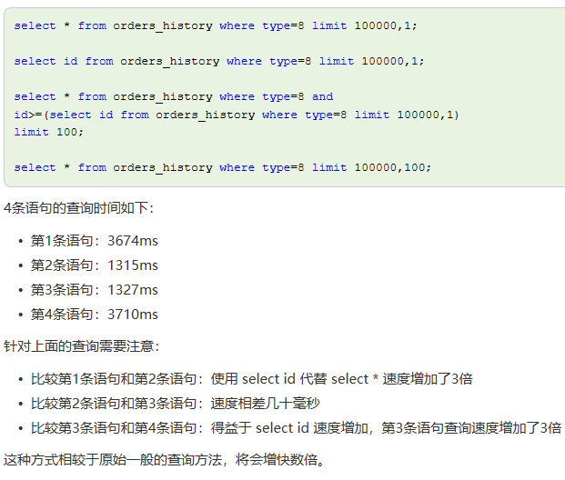
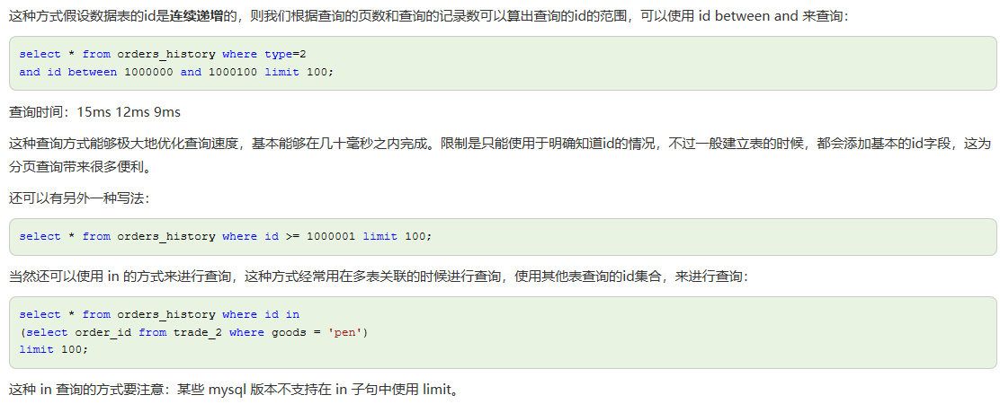

# MySQL分页查询优化 

---

[本文链接](https://www.cnblogs.com/youyoui/p/7851007.html)

- 当需要从数据库查询的表有**上万条**记录的时候，一次性查询所有结果会变得很慢，特别是随着数据量的增加特别明显，这时需要使用分页查询。
- 对于数据库分页查询，也有很多种方法和优化的点。

## 一般分页查询

- 一般的分页查询使用简单的 limit 子句就可以实现。limit 子句声明如下：

		SELECT * FROM table LIMIT [offset,] rows | rows OFFSET offset

			第一个参数指定第一个返回记录行的偏移量  
		
			第二个参数指定返回记录行的最大数目  
		
			如果只给定一个参数：它表示返回最大的记录行数目  
		
			第二个参数为 -1 表示检索从某一个偏移量到记录集的结束所有的记录行  
		
			初始记录行的偏移量是 0(而不是 1)  

- 存在的问题

	随着查询偏移的增大，尤其查询偏移大于**10万**以后，查询时间急剧增加。

	这种分页查询方式会从数据库第一条记录开始扫描，所以越往后，查询速度越慢，而且查询的数据越多，也会拖慢总查询速度。

## 使用子查询优化

- 这种方式先定位偏移位置的 id，然后往后查询，这种方式适用于 id 递增的情况。

```sql

	select * from orders_history where type=8 limit 100000,1;
	
	select id from orders_history where type=8 limit 100000,1;
	
	select * from orders_history where type=8 and 
	id>=(select id from orders_history where type=8 limit 100000,1) 
	limit 100;
	
	select * from orders_history where type=8 limit 100000,100;
```



## 使用 id 限定优化

- 这种方式假设数据表的id是**连续递增**的，则我们根据查询的页数和查询的记录数可以算出查询的id的范围，可以使用 id between and 来查询：

