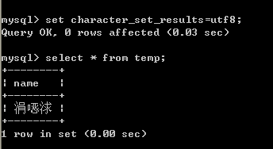
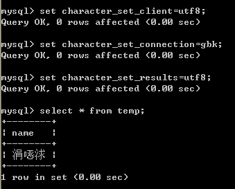
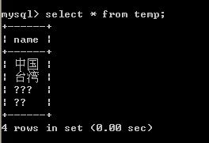

# mysql字符集与校对集

## 字符集

### 1.mysql的字符集设置非常灵活

可以设置服务器默认字符集；

数据库默认字符集；

表默认字符集；

列字符集；

如果某一级别没有指定字符集，则继承上一级。

查看所有字符集语句：`show character set`;

### 2.以表声明为utf-8为例，最终存储在表中的数据为utf-8


①我们要告诉服务器，我给你发送的数据是什么编码？`character_set_client`

  ②告诉字符集转换器，转换成什么编码？`character_set_connection`

  ③查询的结果用什么编码？`character_set_results`

  如果以上三者都为字符集N,可简写为`set names N`;

###  3.什么情况下会出现乱码呢？

我们首先创建一个测试表指定表的字符集为utf8

create table temp(

  name varchar(10)

) charset utf8;   //charset utf8;决定了服务器的编码

然后执行这三条命令：

set character_set_client=gbk;

set character_set_connection=gbk;

set_character_set_results=gbk; 这三句可以简写为set names gbk;

最后往表里插入一条数据：

insert into temp values('中国');

select * from temp;这时候显示的结果是正常的。

当我们再执行这句命令时：set character_results=utf8;

出现乱码了，如图：



由此可得出：**当返回的结果result的字符集与客户端的字符集不符的时候会出现乱码。**

还有一种情况也会出现乱码：**client声明与事实不符时，你客户端明明是utf8,你却非要叫我转成gbk**的，如下图：



可能还有很多种情况，这里没有一一列举。

### 4.什么情况下会造成数据的丢失呢？

执行这三条语句：

set character_set_client=gbk;

set character_set_connection=latin1;

set character_set_results=gbk;

再往表里插入一条数据：insert into temp values('美国');

最后查询的时候结果如下图：



数据丢失了。

由此可得出**当connection和服务器的字符集比client小时，会造成数据的丢失**,可能用语不是很准确，但是能理解即可以了。个人理解，就跟java里面不同数据类型相互转换时一样，比如把double类型强制转换成int类型，就会造成精度的丢失一样。


## 校对集

- 校对集：指字符集的排序规则。

查看所有校对集语句：`show collation`;

一种字符集可以有一个或多个排序规则。

`show collation like 'utf8%';`将显示所有关于`utf8`的校对集

以`utf8`为例，默认是使用`utf8_general_ci`校对集，也可以按二进制来排，`utf8_bin`

- 校对集的作用

```properties
所谓utf8_unicode_ci，其实是用来排序的规则。

对于mysql中那些字符类型的列，如VARCHAR，CHAR，TEXT类型的列，都需要有一个COLLATE类型来告知mysql如何对该列进行排序和比较。

简而言之，COLLATE会影响到 ORDER BY 语句的顺序，会影响到 WHERE 条件中大于小于号筛选出来的结果，会影响DISTINCT、GROUP BY、HAVING 语句的查询结果。

另外，mysql建索引的时候，如果索引列是字符类型，也会影响索引创建，只不过这种影响我们感知不到。

总之，凡是涉及到字符类型比较或排序的地方，都会和COLLATE有关。
```

- 声明校对集

```sql
create table tableName(

　　...

)charset utf8 collate utf8_general_ci;
```

注意：声明的校对集必须是字符集合法的校对集。比如你字符集是utf8,你不能声明gbk的校对集。

- 设置方式

```properties
1.系统设置：mysql配置文件，启动指令中的 collation_connection 系统变量
2.库级别：
 CREATE DATABASE <db_name> DEFAULT CHARACTER SET utf8mb4 COLLATEutf8mb4_unicode_ci;
3.表级别：
    CREATE TABLE (
    ……
    ) ENGINE=InnoDB DEFAULT CHARSET=utf8mb4 COLLATE=utf8mb4_unicode_ci;
4.列级别
     CREATE TABLE (

    `field1` VARCHAR（64） CHARACTER SET utf8mb4 COLLATE utf8mb4_general_ci NOT NULL DEFAULT '',

    ……

    ) ……
```

