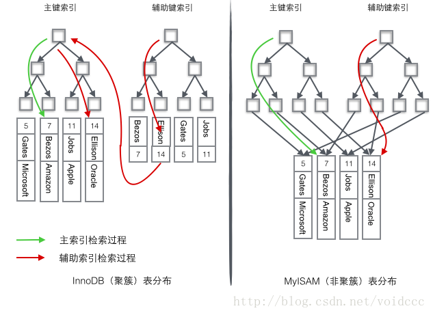

# mysql中的键

mysql建表时的**4种KEY**


## 主键(primary key)

- 能够**唯一标识**表中某一行的属性或属性组，**不能有重复**的，**不允许为空**，用来保证数据完整性。

- 一个表只能有一个主键（**PRIMARY KEY**），但可以有多个唯一键（**UNIQUE KEY**）。

- 主键常常与外键构成参照完整性约束，防止出现数据不一致。

- 主键也是一个特殊的索引(唯一性索引)。

```mysql
CREATETABLE tablename ( [...], PRIMARY KEY (列的列表) )

ALTER TABLE tablename ADD PRIMARY KEY(列的列表)
```

## 唯一键(unique key)

- 一张表往往有很多字段需要唯一性，数据**不能重复**；但是一张表只能有一个字段为主键，那么唯一键(unique key)，就可以解决表中有**多个字段**需要唯一性约束的问题。

- 唯一键**默认值允许自动为空**，而且可以多个不同字段为空（空字段不参与唯一性比较）。

- 增加唯一键
	
```mysql
1.创建表时

    --第一种，字段增加
    create table my_unique(
    name varchar(4) unique key,
    number varchar(20) unique key
    )charset utf8;

--第二种，字段末尾增加
    create table my_unique(
    name varchar(4) ,
    number varchar(20) ,
    unique key name(name),--指定唯一约束名字
    unique key(number)--使用默认名字

    )charset utf8;

2.创建表后

-- 创建表，不带唯一约束
    create table my_unique(
    name varchar(4) ,
    number varchar(20) 
    )charset utf8;

--第一种，modify column
	alter table my_unique modify column name varchar(5) UNIQUE KEY;

--第二种 add constraint unique key

	alter TABLE my_unique add CONSTRAINT num_uk UNIQUE KEY(number);

--指定唯一约束名字为num_uk
```

## 外键（foreign key）

- 是另一表的主键, 外键**可以有重复**的, **可以是空值**，用来**和其他表建立联系**用的。所以说，如果谈到了外键一定是至少涉及到两张表


```mysql
[CONSTRAINT symbol] FOREIGN KEY [id] (从表的字段1) REFERENCES tbl_name (主表的字段2) 
[ON DELETE 
	{RESTRICT | CASCADE | SET NULL | NO ACTION}] 
[ON UPDATE 
	{RESTRICT | CASCADE | SET NULL | NO ACTION} 
```
中括号里的内容是可选项

- 解释如下

```
CONSTRAINT symbol：可以给这个外键约束起一个名字，有了名字，以后找到它就很方便了。如果不加此参数的话，系统会自动分配一个名字。

FOREIGN KEY：将从表中的字段1作为外键的字段。

REFERENCES：映射到主表的字段2。

ON DELETE后面的四个参数：代表的是当删除主表的记录时，所做的约定。

RESTRICT(限制)：如果你想删除的那个主表，它的下面有对应从表的记录，此主表将无法删除。

CASCADE（级联）：如果主表的记录删掉，则从表中相关联的记录都将被删掉。

SET NULL：将外键设置为空。

NO ACTION：什么都不做。
```
注：一般是**RESTRICT**和**CASCADE**用的最多。

### 建立外键一（建表）

```sql
	CREATE TABLE `dage` (
        `id` int(11) NOT NULL auto_increment,
        `name` varchar(32) default '',
        PRIMARY KEY  (`id`)
    )ENGINE=InnoDB DEFAULT CHARSET=latin1；

	CREATE TABLE `xiaodi` (
        `id` int(11) NOT NULL auto_increment,
        `dage_id` int(11) default NULL,
        `name` varchar(32) default '',
        PRIMARY KEY  (`id`),
        KEY `dage_id` (`dage_id`),
        CONSTRAINT `xiaodi_ibfk_1` FOREIGN KEY (`dage_id`) REFERENCES `dage` (`id`)
    ) ENGINE=InnoDB DEFAULT CHARSET=latin1；
```

### 建立外键一（修改表）

```sql
	mysql> show create table xiaodi;
	CONSTRAINT `xiaodi_ibfk_1` FOREIGN KEY (`dage_id`) REFERENCES `dage` (`id`)

	mysql> alter table xiaodi drop foreign key xiaodi_ibfk_1; 
	Query OK, 1 row affected (0.04 sec)
	Records: 1  Duplicates: 0  Warnings: 

	mysql> alter table xiaodi add foreign key(dage_id) references dage(id) on delete cascade on update cascade;
	Query OK, 1 row affected (0.04 sec)
	Records: 1  Duplicates: 0  Warnings: 0
```

## 普通键（KEY）

- 建立索引

```sql
CREATE TABLE `C3TimeOut_AlarmInfo` (
    `AffairID` bigint(20) NOT NULL AUTO_INCREMENT,
    `LineID` int(11) DEFAULT NULL,
    `EngineID` int(11) NOT NULL,
    `TrainNum` varchar(255) COLLATE utf8_bin DEFAULT NULL,
    `EngineBureauID` int(11) DEFAULT NULL,
    `MsIsdn` bigint(20) NOT NULL,
    `CTCS_ID` int(11) NOT NULL,
    `CalledNum` bigint(20) DEFAULT NULL,
    `StartTime` varchar(255) COLLATE utf8_bin NOT NULL,
    `StopTime` varchar(255) COLLATE utf8_bin DEFAULT NULL,
    `DiscBtsName` varchar(255) COLLATE utf8_bin DEFAULT NULL,
    `FindType` smallint(6) NOT NULL,
    `Fcod` varchar(255) COLLATE utf8_bin DEFAULT NULL,
    `CauseCategory` varchar(255) COLLATE utf8_bin DEFAULT NULL,
    `PriData` varchar(1024) COLLATE utf8_bin DEFAULT NULL,
    `AData` varchar(512) COLLATE utf8_bin DEFAULT NULL,
    `AbisData` varchar(2048) COLLATE utf8_bin DEFAULT NULL,
    `AnalyseSynth` varchar(512) COLLATE utf8_bin DEFAULT NULL,
    `TimeoutAck` smallint(6) DEFAULT NULL,
    `IsGuessValue` smallint(6) DEFAULT NULL,
    PRIMARY KEY (`AffairID`),
    KEY `MsIsdn` (`MsIsdn`),
    KEY `Fcod` (`Fcod`),
    KEY `StartTime` (`StartTime`,`StopTime`),
    KEY `EngineBureauID` (`EngineBureauID`),
    KEY `LineID` (`LineID`),
    CONSTRAINT `EngineBureauID` FOREIGN KEY (`EngineBureauID`) REFERENCES `GBIAP_common_config`.`BureauInfoTable` (`BureauNum`) ON UPDATE CASCADE,
    CONSTRAINT `Fcod` FOREIGN KEY (`Fcod`) REFERENCES `GBIAP_common_config`.`FcodInfo` (`Fcod`) ON UPDATE CASCADE,
    CONSTRAINT `LineID` FOREIGN KEY (`LineID`) REFERENCES `GBIAP_common_config`.`LineInfoTable` (`LineID`) ON UPDATE CASCADE
) ENGINE=InnoDB AUTO_INCREMENT=51 DEFAULT CHARSET=utf8 COLLATE=utf8_bin ROW_FORMAT=DYNAMIC;
```

# mysql 的索引

## 索引类型

PRIMARY 主键。 就是 唯一 且 不能为空。

INDEX 索引，普通的

UNIQUE 唯一索引。 不允许有重复。

	（PRIMARY, INDEX, UNIQUE 这3种是一类）

FULLTEXT 是全文索引，用于在一篇文章中，检索文本信息的。

## 索引(index) 

- 用来快速地寻找那些具有特定值的记录。主要是为了检索的方便，是为了加快访问速度， 按一定的规则创建的，一般起到排序作用。

```mysql
CREATE INDEX <索引的名字> ON tablename (列的列表); 

ALTER TABLE tablename ADD INDEX [索引的名字] (列的列表); 

CREATE TABLE tablename ( [...], INDEX [索引的名字] (列的列表) )
```
## 唯一性索引

- 这种索引和前面的“普通索引”基本相同，但有一个区别：索引列的所有值都只能出现一次，即必须唯一。

```sql
CREATE UNIQUE INDEX <索引的名字> ON tablename (列的列表)

ALTER TABLE tablename ADD UNIQUE [索引的名字] (列的列表)

CREATE TABLE tablename ( [...], UNIQUE [索引的名字] (列的列表) )
```

## 全文索引

- MySQL从3.23.23版开始支持全文索引和全文检索。

- 在MySQL中，全文索引的索引类型为FULLTEXT。全文索引可以在VARCHAR或者TEXT类型的列上创建。  
	
	它可以通过CREATE TABLE命令创建，也可以通过ALTER TABLE或CREATE INDEX命令创建。

## 联合索引

### 建立联合索引

- alert table test add INDEX `sindex` (`aaa`,`bbb`,`ccc`) 

- 建表语句建立

```sql
CREATE TABLE index5(
    id INT,
    name VARCHAR(20),
    sex CHAR(4),
    INDEX index5_ns(name,sex)
);
```

### 最左前缀匹配原则

- 最左优先，在检索数据时从联合索引的最左边开始匹配

- 示例讲解：

	
	
	对列col1、列col2和列col3建一个联合索引
	
	> KEY test_col1_col2_col3 on test(col1,col2,col3);
	
	
	
	联合索引 test_col1_col2_col3 实际建立了(col1)、(col1,col2)、(col,col2,col3)三个索引。
	
	> SELECT * FROM test WHERE col1=“1” AND clo2=“2” AND clo4=“4”
	
	
	
	上面这个查询语句执行时会依照最左前缀匹配原则，检索时会使用索引(col1,col2)进行数据匹配。
	
	> SELECT * FROM test WHERE col1=“1” AND clo2>“2” AND clo3=“3”
	
	上面这个查询语句执行时会使用col1和col2作为索引进行查询


注意：索引的字段可以是任意顺序的，如：

```sql
SELECT * FROM test WHERE col1=“1” AND clo2=“2”

SELECT * FROM test WHERE col2=“2” AND clo1=“1”
```


最后附上索引情况


## 索引失效

### where语句中包含or时，可能会导致索引失效

使用`or`并不是一定会使索引失效，你需要看`or`左右两边的查询列是否命中相同的索引。

假设`USER`表中的`user_id`列有索引，`age`列没有索引。

下面这条语句是命中索引的

```sql
select * from `user` where user_id = 1 or user_id = 2;
```

但是这条语句是无法命中索引的。

```sql
select * from `user` where user_id = 1 or age = 20;
```

假设`age`列也有索引的话，依然是无法命中索引的。

```sql
select * from `user` where user_id = 1 or age = 20;
```

因此才有建议说，尽量避免使用`or`语句，可以根据情况尽量使用`union all`或者`in`来代替，这两个语句的执行效率也比`or`好些。


### where语句中索引列使用了负向查询，可能会导致索引失效

负向查询包括：`NOT、!=、<>、!<、!>、NOT IN、NOT LIKE`等。

需要注意的是，负向查询并不绝对会索引失效，这要看MySQL优化器的判断，全表扫描或者走索引哪个成本低了。


### 在索引列上使用内置函数，一定会导致索引失效

```sql
索引列login_time上使用了函数，会索引失效：

select * from `user` where DATE_ADD(login_time, INTERVAL 1 DAY) = 7;
```

优化建议：尽量在应用程序中进行计算和转换。


还有两种索引失效场景，应该都归于索引列使用了函数。

####  隐式类型转换导致的索引失效

比如下面语句中索引列user_id为varchar类型，不会命中索引：

```sql
select * from `user` where user_id = 12;
```

这是因为MySQL做了隐式类型转换，调用函数将user_id做了转换。

```sql
select * from `user` where CAST(user_id AS signed int) = 12;
```

####  隐式字符编码转换导致的索引失效

当两个表之间做关联查询时，如果两个表中关联的字段字符编码不一致的话，`MySQL`可能会调用`CONVERT`函数，将不同的字符编码进行隐式转换从而达到统一。作用到关联的字段时，就会导致索引失效。

比如下面这个语句，其中`d.tradeid`字符编码为`utf8`，而`l.tradeid`的字符编码为`utf8mb4`。因为`utf8mb4`是`utf8`的超集，所以`MySQL`在做转换时会用`CONVERT`将`utf8`转为`utf8mb4`。简单来看就是`CONVERT`作用到了`d.tradeid`上，因此索引失效。

```sql
select l.operator from tradelog l , trade_detail d where d.tradeid=l.tradeid and d.id=4;
```

这种情况一般有两种解决方案。

方案1: 将关联字段的字符编码统一。

方案2: 实在无法统一字符编码时，手动将`CONVERT`函数作用到关联时=的右侧，起到字符编码统一的目的，这里是强制将`utf8mb4`转为`utf8`，当然从超集向子集转换是有数据截断风险的。如下：

```sql
select d.* from tradelog l , trade_detail d where d.tradeid=CONVERT(l.tradeid USING utf8) and l.id=2;
```


### 对索引列进行运算，一定会导致索引失效

运算如+，-，*，/等，如下：

```sql
select * from `user` where age - 1 = 10;
```

优化的话，要把运算放在值上，或者在应用程序中直接算好，比如：

```sql
select * from `user` where age = 10 - 1;
```


###  like通配符可能会导致索引失效

like查询以%开头时，会导致索引失效。解决办法有两种：

将%移到后面，如：

```sql
select * from `user` where `name` like '李%';
```

利用覆盖索引来命中索引。

```sql
select name from `user` where `name` like '%李%';
```


### 联合索引中，where中索引列违背最左匹配原则，一定会导致索引失效


### MySQL优化器的最终选择，不走索引


# 主键与索引对比

- 主键一定是唯一性索引，唯一性索引并不一定就是主键。

- 一个表中可以有多个唯一性索引，但只能有一个主键。

- 主键列不允许空值，而唯一性索引列允许空值。

- 主键可以被其他字段作外键引用，而索引不能作为外键引用。

## 主键与外键的使用条件

- 1.两张表必须都是InnoDB表，并且它们没有临时表。  
	注：InnoDB是数据库的引擎。MySQL常见引擎有两种：InnoDB和MyISAM，后者不支持外键。

- 2.建立外键关系的对应列必须具有相似的InnoDB内部数据类型。

- 3.建立外键关系的对应列必须建立了索引。

- 4.假如显式的给出了CONSTRAINT symbol，那symbol在数据库中必须是唯一的。假如没有显式的给出，InnoDB会自动的创建。

## 主键、外键和索引的区别

| 主键        | 外键           |	索引  |
| ------------- |:-------------:| -----:|
| 唯一标识一条记录，不能有重复的，不允许为空     | 表的外键是另一表的主键, 外键可以有重复的, 可以是空值 | 该字段没有重复值，但可以有一个空值 |
| 用来保证数据完整性      | 用来和其他表建立联系用的      |  是提高查询排序的速度 |
| 主键只能有一个 | 一个表可以有多个外键      |    一个表可以有多个惟一索引 |


# 存储引擎中索引的类型

## 非聚簇索引

- 索引指向数据所在行（磁盘）的位置

```
以myisam为例，一个数据表table中，它是有table.frm、table.myd以及table.myi组成。

table.myd记录了数据，table.myi记录了索引的数据。在用到索引时，先到table.myi（索引树）中进行查找，

取到数据所在table.myd的行位置，拿到数据。所以myisam引擎的索引文件和数据文件是独立分开的，则称之为非聚簇索引。
```


## 聚簇索引

- 索引指向主键对数据的引用（既存储主键索引值，又存储行数据）

```
以innodb为例，在一个数据table中，它的数据文件和索引文件是同一个文件。

即在查询过程中，找到了索引，便找到了数据文件。在innodb中，既存储主键索引值，又存储行数据，称之为聚簇索引。
```

- 图示



## 覆盖索引

覆盖索引（covering index ，或称为索引覆盖）指一个查询语句的执行只用从索引中就能够取得，不必从数据表中读取。也可以称之为实现了索引覆盖。

**如果一个索引包含了（或覆盖了）满足查询语句中字段与条件的数据就叫做覆盖索引。**

> 当发起一个索引覆盖查询时，在explain的extra列可以看到using index的信息，此时可以确定数据库使用了覆盖索引。


# 自增主键作为id

表的主键一般都要使用自增 id，不建议使用业务 id ，是因为使用自增 id 可以避免页分裂。

> mysql 在底层又是以数据页为单位来存储数据的，一个数据页大小默认为 16k（当然你也可以自定义大小），也就是说如果一个数据页存满了，mysql 就会去申请一个新的数据页来存储数据。


如果主键为自增 id 的话，mysql 在写满一个数据页的时候，直接申请另一个新数据页接着写就可以了。

如果主键是非自增 id，为了确保索引有序，mysql 就需要将每次插入的数据都放到合适的位置上。当往一个快满或已满的数据页中插入数据时，新插入的数据会将数据页写满，mysql 就需要申请新的数据页，并且把上个数据页中的部分数据挪到新的数据页上。这就造成了页分裂，这个大量移动数据的过程是会严重影响插入效率的。

采用乱序插入，那么大量的表分裂会造成许多磁盘碎片，加大磁盘开销。而表分裂同时也会多次查询相邻页，从而造成磁盘io。而如果采用自增主键，那么每次插入都是尾部追加，则会使记录尽可能紧密排列，且减少磁盘IO。