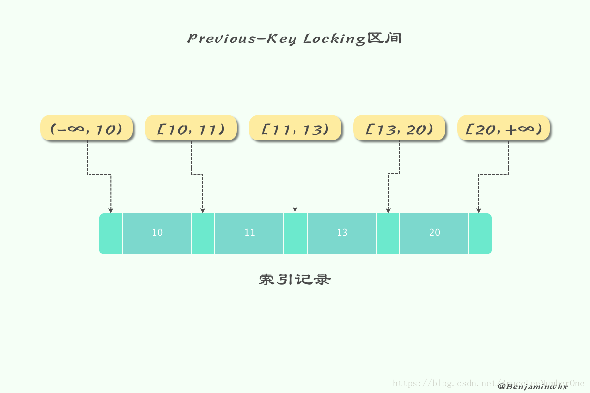

# MySQL中的锁

[链接](https://blog.csdn.net/bruceleenumberone/article/details/81865045)

- MySQL中有着Lock和Latch的概念，在数据库中，这两者都可以被称为“锁”，但是两者有着截然不同的含义。


- Latch一般称为闩锁（轻量级的锁），因为其要求锁定的时间必须非常短。若持续的时间长，则应用的性能会非常差。在InnoDB引擎中，Latch又可以分为mutex（互斥量）和rwlock（读写锁）。其目的是用来保证并发线程操作临界资源的正确性，并且通常没有死锁检测的机制。

- Lock的对象是事务，用来锁定的是数据库中的对象，如表、页、行。并且一般lock的对象仅在事务commit或rollback后进行释放（不同事务隔离级别释放的时间可能不同）。

## 锁的类型

- 对数据的操作其实只有两种，也就是读和写，而数据库在实现锁时，也会对这两种操作使用不同的锁；
- **InnoDB 实现了标准的行级锁**，也就是共享锁（Shared Lock）和互斥锁（Exclusive Lock）。

	**共享锁（读锁），允许事务读一行数据。**  
	**排他锁（写锁），允许事务删除或更新一行数据。**

- **表级锁**

	**意向共享锁（IS）**：事务想要在获得表中某些记录的共享锁，需要在表上先加意向共享锁。  
	**意向互斥锁（IX）**：事务想要在获得表中某些记录的互斥锁，需要在表上先加意向互斥锁。

- 而它们的名字也暗示着各自的另外一个特性，共享锁之间是兼容的，而互斥锁与其他任意锁都不兼容：


- 稍微对它们的使用进行思考就能想明白它们为什么要这么设计，因为**共享锁代表了读操作、互斥锁代表了写操作**，所以我们可以在数据库中**并行读**，但是只能**串行写**，只有这样才能保证不会发生线程竞争，实现线程安全。

## 锁的粒度

- Lock锁根据粒度主要分为**表锁、页锁和行锁**。**不同的存储引擎拥有的锁粒度都不同**。


### 表锁

- 表级别的锁定是MySQL各存储引擎中最大颗粒度的锁定机制。该锁定机制最大的特点是实现逻辑非常简单，带来的系统负面影响最小。所以获取锁和释放锁的速度很快。由于表级锁一次会将整个表锁定，所以可以很好的避免困扰我们的死锁问题。

- 当然，锁定颗粒度大所带来最大的负面影响就是出现锁定资源争用的概率也会最高，致使并发度大打折扣。  
**使用表级锁定的主要是MyISAM，MEMORY，CSV等一些非事务性存储引擎。**

- 表锁的语法很简单：

```mysql
# 获取表锁
LOCK TABLES
tbl_name [[AS] alias] lock_type
[, tbl_name [[AS] alias] lock_type] ...

lock_type:
READ [LOCAL]
| [LOW_PRIORITY] WRITE

# 释放表锁
UNLOCK TABLES
```

### 页锁

- 页级锁定是MySQL中比较独特的一种锁定级别，在其他数据库管理软件中也并不是太常见。页级锁定的特点是锁定颗粒度介于行级锁定与表级锁之间，所以获取锁定所需要的资源开销，以及所能提供的并发处理能力也同样是介于上面二者之间。另外，页级锁定和行级锁定一样，会发生死锁。

- 在数据库实现资源锁定的过程中，随着锁定资源颗粒度的减小，锁定相同数据量的数据所需要消耗的内存数量是越来越多的，实现算法也会越来越复杂。不过，随着锁定资源颗粒度的减小，应用程序的访问请求遇到锁等待的可能性也会随之降低，系统整体并发度也随之提升。

- **使用页级锁定的主要是BerkeleyDB存储引擎。**

### 行锁

- 行级锁定最大的特点就是锁定对象的粒度很小，也是目前各大数据库管理软件所实现的锁定颗粒度最小的。由于锁定颗粒度很小，所以发生锁定资源争用的概率也最小，能够给予应用程序尽可能大的并发处理能力而提高一些需要高并发应用系统的整体性能。

- 虽然能够在并发处理能力上面有较大的优势，但是行级锁定也因此带来了不少弊端。由于锁定资源的颗粒度很小，所以每次获取锁和释放锁需要做的事情也更多，带来的消耗自然也就更大了。此外，行级锁定也最容易发生死锁。

- **使用行级锁定的主要是InnoDB存储引擎。**

```mysql
# 共享锁（Ｓ）：
SELECT * FROM table_name WHERE ... LOCK IN SHARE MODE  
	
# 排他锁（X）：
SELECT * FROM table_name WHERE ... FOR UPDATE
```

### 总结

	表级锁：开销小，加锁快；不会出现死锁；锁定粒度大，发生锁冲突的概率最高，并发度最低。
	
	行级锁：开销大，加锁慢；会出现死锁；锁定粒度最小，发生锁冲突的概率最低，并发度也最高。
	
	页面锁：开销和加锁时间界于表锁和行锁之间；会出现死锁；锁定粒度界于表锁和行锁之间，并发度一般。

- 从锁的角度来说，**表级锁**更适合于以**查询为主，只有少量按索引条件更新数据的应用**，如Web应用；
- 而**行级锁**则更适合于**有大量 按索引条件 并发更新少量不同数据，同时又有并发查询的应用**，如一些在线事务处理（OLTP）系统。

## InnoDB中的锁

### 意向锁

- 上节提到InnoDB 支持多种粒度的锁，也就是行锁和表锁。为了支持多粒度锁定，InnoDB 存储引擎引入了意向锁（Intention Lock）。

- 意向锁:

	如果没有意向锁，当已经有人使用行锁对表中的某一行进行修改时，如果另外一个请求要对全表进行修改，那么就需要对所有的行是否被锁定进行扫描，在这种情况下，效率是非常低的； 
	不过，在引入意向锁之后，当有人使用行锁对表中的某一行进行修改之前，会先为表添加意向互斥锁（IX），再为行记录添加互斥锁（X），在这时如果有人尝试对全表进行修改就不需要判断表中的每一行数据是否被加锁了，只需要通过等待意向互斥锁被释放就可以了。

- 与上一节中提到的两种锁的种类相似的是，意向锁也分为两种：
	
	**意向共享锁（IS）**：事务想要在获得表中某些记录的共享锁，需要在表上先加意向共享锁。 
	**意向互斥锁（IX）**：事务想要在获得表中某些记录的互斥锁，需要在表上先加意向互斥锁。

- 随着意向锁的加入，锁类型之间的兼容矩阵也变得愈加复杂：


- **意向锁其实不会阻塞全表扫描之外的任何请求，它们的主要目的是为了表示是否有人请求锁定表中的某一行数据。**

### 行锁的算法

InnoDB存储引擎有3种行锁的算法，其分别是：

	Record Lock：记录锁，单个行记录上的锁。
	
	Gap Lock：间隙锁，锁定一个范围，但不包含记录本身。（只在RR[Repeatable Read]隔离级别下存在）
	
	Next-Key Lock：范维锁，Gap Lock + Record Lock，锁定一个范围，并且锁定记录本身。（InnoDB默认的行锁算法）

- Record Lock总是会去<font color=#dd0000>锁住索引</font>记录，如果InnoDB存储引擎表在建立的时候没有设置任何一个索引，那么这时InnoDB存储引擎会使用隐式的主键来进行锁定。

- Next-Key Lock是结合了Gap Lock和Record Lock的一种锁定算法，在Next-Key Lock算法下，InnoDB对于行的查询都是采用这种锁定算法。例如有一个索引有10，11，13和20这4个值，那么该索引可能被Next-Key Locking的区间为：


- 除了Next-Key Locking，还有Previous-Key Locking技术。同样上述的值，使用Previous-Key Locking技术，那么可锁定的区间为：



- 但是不是所有索引都会加上Next-key Lock的，**在查询的列是唯一性索引（包含主键索引）的情况下，Next-key Lock会降级为Record Lock。**

- 接下来，我们来通过一个例子解释一下。

```mysql
CREATE TABLE z (
    a INT,
    b INT,
    PRIMARY KEY(a),    	// a是主键索引
    KEY(b)    			// b是普通索引
);
INSERT INTO z select 1, 1;
INSERT INTO z select 3, 1;
INSERT INTO z select 5, 3;
INSERT INTO z select 7, 6;
INSERT INTO z select 10, 8;
```

- 这时候在会话A中执行 `SELECT * FROM z WHERE b = 3 FOR UPDATE` ，索引锁定如下：


- 这时候会话B执行的语句落在锁定范围内的都会进行waiting

```mysql
SELECT * FROM z WHERE a = 5 LOCK IN SHARE MODE;
INSERT INTO z SELECT 4, 2;
INSERT INTO z SELECT 6, 5;
```

- 用户可以通过以下两种方式来显示的关闭Gap Lock：

```
将事务的隔离级别设为 READ COMMITED。

将参数innodb_locks_unsafe_for_binlog设置为1。
```

- 从上面的例子可以看出来，**Gap Lock的作用是为了阻止多个事务将记录插入到同一个范围内，设计它的目的是用来解决Phontom Problem（幻读问题）。在MySQL默认的隔离级别（Repeatable Read）下，InnoDB就是使用它来解决幻读问题。**


### 一致性非锁定读

一致性非锁定读（consistent nonlocking read）:

​	是指InnoDB存储引擎通过多版本控制（MVCC）的方式来读取当前执行时间数据库中行的数据。  
​	如果读取的这行正在执行DELETE或UPDATE操作，这时读取操作不会向XS锁一样去等待锁释放，而是会去读一个快照数据。  


- 在事务隔离级别RC和RR下，InnoDB存储引擎使用非锁定的一致性读。然而对于快照数据的定义却不同，在RC级别下，对于快照数据，非一致性读总是读取被锁定行的最新一份快照数据。而在RR级别下，对于快照数据，非一致性读总是读取事务开始时的行数据版本。

- 下面我们通过一个例子来看看大家是否对MVCC理解了。


- 可以看到，第1步和第2步是非常容易理解的，而在第3步事务B插入一条新的数据后，在第4步事务A还是查不到，也就是利用了MVCC的特性来实现。当事务B提交后，第5步的查询在RC和RR隔离级别下的输出是不同的，这个的原因在另一篇博客中也说到了，是因为他们创建ReadView的时机不同。

- 但是很诡异的是在第6步的时候，事务A更新了一条它看不见的记录，然后查询就能够查询出来了。这里很多人容易迷惑，不可见不代表记录不存在，它只是利用了可见性判断忽略了而已。更新成功之后，事务A顺其自然的记录了这条记录的Undo log，在随后的查询中，因为它能够看见自己的改动这一个可见性的判断，自然就能够查询出来了。这里很多名词需要去深入读一下此文：[谈谈MySQL InnoDB存储引擎事务的ACID特性](http://benjaminwhx.com/2018/04/25/%E8%B0%88%E8%B0%88MySQL-InnoDB%E5%AD%98%E5%82%A8%E5%BC%95%E6%93%8E%E4%BA%8B%E5%8A%A1%E7%9A%84ACID%E7%89%B9%E6%80%A7/)

### 一致性锁定读

- 前面说到，在默认隔离级别RR下，InnoDB存储引擎的SELECT操作使用一致性非锁定读。但是在某些情况下，用户需要显式地对数据库读取操作进行加锁以保证数据逻辑的一致性。InnoDB存储引擎对于SELECT语句支持两种一致性的锁定读（locking read）操作。

```mysql
SELECT … FOR UPDATE （X锁）

SELECT … LOCK IN SHARE MODE （S锁）
```

## 锁带来的问题

- 通过锁定机制可以实现事务隔离性要求，使得事务可以并发的工作。锁提高了并发，但是却会带来潜在的问题。不过好在有事务隔离性的要求，不同的隔离级别解决的锁的问题也不同，这里只进行简单的介绍，不进行举例分析了。


- InnoDB存储引擎在RR级别就已经解决了所有问题，但是它和Serializable的区别在哪里呢？区别就在于**RR级别**还存在一个**丢失更新**问题，而SERIALIZABLE无论对于查询还是更新都会进行锁定操作。


- 丢失更新问题


- 如图所示，用户原始金额为100，如果程序中对于转账和存款的判断是先查询再更新的话就会出现丢失更新的问题，也就是后面的更新覆盖了前面的更新。

- 如果想避免这种问题，只能每次更新的时候金额基于表里最新的值来做。如果必须要先查询再更新，可以在更新的条件里判断金额（乐观锁），也可以通过mysql提供的锁机制来预防（悲观锁），也可以使用隔离级别最高的SERIALIZABLE。

```
乐观锁：

    乐观锁中,我们会引入一个类似版本号的概念.比如给每一行加入一个version.

    假定.我们查出的数据version为1
    那我们这么update：update product set version = version + 1 where version = 1
    如果更新成功.说明中间数据没有被修改.这次更新是成功的.如果失败.说明数据被修改过.我们需要重新读取数据.进行操作.

    那在我们这个扣减库存的场景中.

    我们可以不用引入版本号.而使用库存做版本号.
    再进一步.我们实际上并不需要严格按照版本号来做.可以使用inventory - #{toOrder} > 0.我们只要判断,扣减之后是否库存大于0.业务上就可以满足需求.如果失败.就下单失败.

总结：乐观锁不是真的锁.而是使用一种机制来保证读后写的正确性.这种方式可能会大量重试.需要根据业务场景合理使用.
```


	悲观锁：
	
		悲观锁,则类似于我们之前的处理办法.不过我们是使用Mysql的锁来实现.
		Mysql的Innodb存储引擎支持行级锁.并且有两种,读共享锁和写独占锁.
		读共享锁在这个场景下并没有用.所以直接看写独占锁.
		写独占锁使用也很简单.只需要在select 的语句后加上for update即可.
		那我们的查询sql就修改为
		
		select * from product where id = 123 for update;
		
		然后我们进行更新.提交事务就可以安全的完成这个工作了.
		需要注意的是.整个操作要加事务.
		
	总结：悲观锁是由数据库的锁来保证读后写的正确性


## 死锁

- 死锁是指两个或两个以上的事务在执行过程中，因争夺锁资源而造成的一种互相等待的现象，这里直接放上之前项目中遇到的一个死锁问题以及深入的分析：


[由一次线上问题带来的MySQL死锁问题分析](http://benjaminwhx.com/2018/02/28/%E7%94%B1%E4%B8%80%E6%AC%A1%E7%BA%BF%E4%B8%8A%E9%97%AE%E9%A2%98%E5%B8%A6%E6%9D%A5%E7%9A%84MySQL%E6%AD%BB%E9%94%81%E9%97%AE%E9%A2%98%E5%88%86%E6%9E%90/)

### 死锁发生条件

- 当会话1获取了A表的X锁，会话2获取了B表的X锁，而会话1又在尝试获取B表的X锁，会话2在尝试获取A表的X锁，这个时候就发生死锁了。

- 但是一般这种情况不会存在的，因为MyISAM不支持事务，相当于每一条SQL就是一个事务，当某个会话执行完一条语句之后会立马把锁给释放，并不会把锁保留，也就是说不存在同时需要占用两个锁的情况。

- 手动加锁模拟这个场景


## MyISAM中的锁

### 两种锁

- MySQL表级锁有两种模式：表共享锁（Table Read Lock）和表独占写锁（Table Write Lock）。

```
对MyISAM的读操作，不会阻塞其他用户对同一表读请求，但会阻塞对同一表的写请求；

对MyISAM的写操作，则会阻塞其他用户对同一表的读和写操作；

MyISAM表的读操作和写操作之间，以及写操作之间是串行的。

当一个线程获得对一个表的写锁后，只有持有锁线程可以对表进行更新操作。其他线程的读、写操作都会等待，直到锁被释放为止。
```

### 加表锁

- MyISAM在执行查询前，会自动执行表的加锁、解锁操作，一般情况下不需要用户手动加、解锁，但是有的时候也需要显示加锁。比如：检索某一个时刻t1，t2表中数据数量。

```mysql
LOCK TABLE t1 read [local], t2 read [local];
select count(t1.id1) as 'sum' from t1;
select count(t2.id1) as 'sum' from t2;
UNLOCK TABLES;
```

- 上面的例子在LOCK TABLES时加了‘local’选项，其作用就是允许其他用户在表尾插入记录。

- 在用LOCK TABLES给表显式加表锁是时，必须同时取得所有涉及表的锁，并且MySQL支持锁升级。也就是说，在执行LOCK TABLES后，
只能访问显式加锁的这些表，不能访问未加锁的表；同时，如果加的是读锁，那么只能执行查询操作，而不能执行更新操作。

- 其实，在自动加锁的情况下也基本如此，MySQL一次获得SQL语句所需要的全部锁。这也正是MyISAM表不会出现死锁（Deadlock Free）的原因

- 一个session使用LOCK TABLE 命令给表film_text加了读锁，这个session可以查询锁定表中的记录，但更新或访问其他表都会提示错误；
同时，另外一个session可以查询表中的记录，但更新就会出现锁等待。

### 并发锁

- 在一定条件下，MyISAM也支持查询和操作的并发进行。

```
MyISAM存储引擎有一个系统变量concurrent_insert，专门用以控制其并发插入的行为，其值分别可以为0、1或2。

	当concurrent_insert设置为(NEVER)0时，不允许并发插入。

	当concurrent_insert设置为(AUTO)1时，如果MyISAM允许在一个读表的同时，另一个进程从表尾插入记录。这也是MySQL的默认设置。

	当concurrent_insert设置为(ALWAYS)2时，无论MyISAM表中有没有空洞，都允许在表尾插入记录，都允许在表尾并发插入记录。
```

- 可以利用MyISAM存储引擎的并发插入特性，来解决应用中对同一表查询和插入锁争用。例如，将concurrent_insert系统变量为2，总是允许并发插入；同时，通过定期在系统空闲时段执行OPTIONMIZE TABLE语句来整理空间碎片，收到因删除记录而产生的中间空洞。

### 锁调度

- ＭyISAM默认的锁调度机制是**写优先**。

```
一个进程请求某个MyISAM表的读锁，同时另一个进程也请求同一表的写锁，MySQL如何处理呢？答案是写进程先获得锁。
不仅如此，即使读进程先请求先到锁等待队列，写请求后到，写锁也会插到读请求之前！这是因为MySQL认为写请求一般比读请求重要。
这也正是MyISAM表不太适合于有大量更新操作和查询操作应用的原因，因为，大量的更新操作会造成查询操作很难获得读锁，
从而可能永远阻塞。这种情况有时可能会变得非常糟糕！

幸好我们可以通过一些设置来调节MyISAM的调度行为：

通过指定启动参数LOW_PRIORITY_UPDATES，使MyISAM引擎默认给予读请求以优先的权利。

通过执行命令SET LOW_PRIORITY_UPDATES=1，使该连接发出的更新请求优先级降低。

通过指定INSERT、UPDATE、DELETE语句的LOW_PRIORITY属性，降低该语句的优先级。

另外，MySQL也提供了一种折中的办法来调节读写冲突，即给系统参数max_write_lock_count
设置一个合适的值，当一个表的写锁达到这个值后，MySQL便暂时将写请求的优先级降低，给读进程一定获得锁的机会。
```


- 这并不一定适合所有应用，用户可以通过设置LOW_PRIPORITY_UPDATES参数，或在INSERT、UPDATE、DELETE语句中指定LOW_PRIORITY选项来调节读写锁的争用。

- 由于表锁的锁定粒度大，读写之间又是串行的，因此，如果更新操作较多，ＭyISAM表可能会出现严重的锁等待，可以考虑采用InnoDB表来减少锁冲突。

## 悲观锁与乐观锁

### 悲观锁

	正如其名，它指的是对数据被外界（包括本系统当前的其他事务，以及来自外部系统的事务处理）修改持保守态度，
	
	因此，在整个数据处理过程中，将数据处 于锁定状态。悲观锁的实现，往往依靠数据库提供的锁机制（也只有
	
	数据库层提供的锁机制才能真正保证数据访问的排他性，否则，即使在本系统中实现了加锁机 制，也无法保证外部系统不会修改数据）。
	
	在悲观锁的情况下，为了保证事务的隔离性，就需要一致性锁定读。读取数据时给加锁，其它事务无法修改这些数据。
	
	修改删除数据时也要加锁，其它事务无法读取这些数据。

### 乐观锁

	相对悲观锁而言，乐观锁机制采取了更加宽松的加锁机制。悲观锁大多数情况下依靠数据库的锁机制实现，
	
	以保证操作最大程度的独占性。但随之而来的就是数据库性能的大量开销，特别是对长事务而言，这样的开销往往无法承受。
	
	而乐观锁机制在一定程度上解决了这个问题。乐观锁，大多是基于数据版本（ Version ）记录机制实现。何谓数据版本？
	
	即为数据增加一个版本标识，在基于数据库表的版本解决方案中，一般是通过为数据库表增加一个 “version” 字段来实现。
	
	读取出数据时，将此版本号一同读出，之后更新时，对此版本号加一。此时，将提交数据的版本数据与数据库表对应记录的
	
	当前版本信息进行比对，如 果提交的数据版本号大于数据库表当前版本号，则予以更新，否则认为是过期数据。