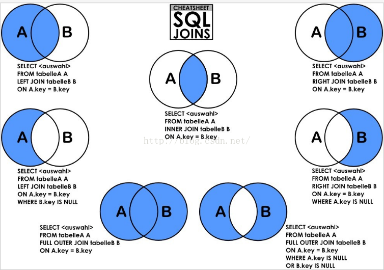
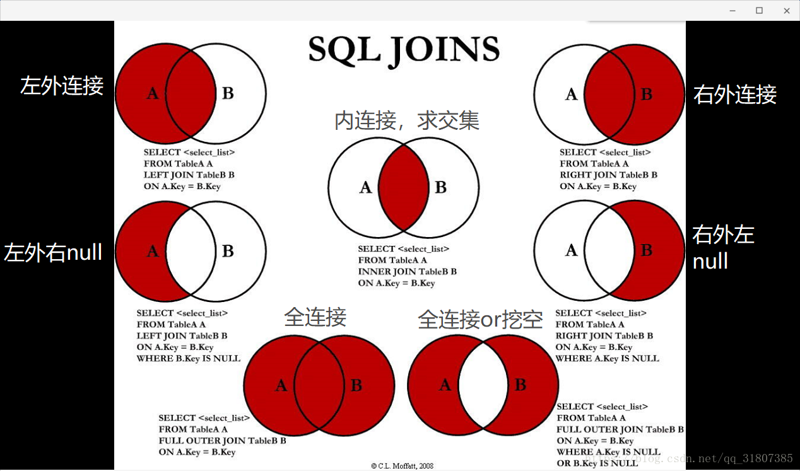

### 数据定义语言DDL

- CREATE TABLE/VIEW/INDEX/SYN/CLUSTER

- 表 视图 索引 同义词 簇

- DDL操作是隐性提交的！不能rollback 

### 数据操纵语言DML

- 1) 插入：INSERT

- 2) 更新：UPDATE

- 3) 删除：DELETE

### 事务控制语句

- 1) commit

- 2) rollback

- 3) savepoint

### 数据查询语言DQL

- SELECT <字段名表> FROM <表或视图名> WHERE <查询条件>

### 数据控制语言DCL

- 用来授予或回收访问数据库的某种特权，并控制数据库操纵事务发生的时间及效果，对数据库实行监视等。

#### 1) GRANT：授权

#### 2) ROLLBACK [WORK] TO [SAVEPOINT]：回退到某一点。
回滚---ROLLBACK
回滚命令使数据库状态回到上次最后提交的状态。其格式为：
SQL>ROLLBACK;

#### 3) COMMIT [WORK]：提交。
在数据库的插入、删除和修改操作时，只有当事务在提交到数据库时才算完成。在事务提交前，只有操作数据库的这个人才能有权看到所做的事情，别人只有在最后提交完成后才可以看到。
提交数据有三种类型：显式提交、隐式提交及自动提交。

	(1) 显式提交
	用COMMIT命令直接完成的提交为显式提交。其格式为：
	SQL>COMMIT；
	
	(2) 隐式提交
	用SQL命令间接完成的提交为隐式提交。这些命令是：
	ALTER，AUDIT，COMMENT，CONNECT，CREATE，DISCONNECT，DROP，EXIT，GRANT，NOAUDIT，QUIT，REVOKE，RENAME。
	
	(3) 自动提交
	若把AUTOCOMMIT设置为ON，则在插入、修改、删除语句执行后，
	系统将自动进行提交，这就是自动提交。其格式为：
	SQL>SET AUTOCOMMIT ON；

---

## sql语法

### from子句

#### 1.给字段或者表达式起别名 

select salary*12 sal,salary*16 "year Sal" from  s_emp;


#### 2.sql 中的字符串表达

#### 3.NULL 值处理

- nvl(par1,par2)  --> oracle中

	当par1的值为NULL时 就返回par2的值 如果par1不为NULL就返回par1本身的值。

- IFNULL(expr1,expr2)  --> mysql中

	如果expr1不是NULL，IFNULL()返回expr1，否则它返回expr2。IFNULL()返回一个数字或字符串值，取决于它被使用的上下文环境。

```sql

	mysql> select IFNULL(1,0);
	-> 1
	mysql> select IFNULL(0,10);
	-> 0
	mysql> select IFNULL(1/0,10);
	-> 10
	mysql> select IFNULL(1/0,'yes');
	-> 'yes'
```

- IF(expr1,expr2,expr3)

	如果expr1是TRUE(expr1<>0且expr1<>NULL)，那么IF()返回expr2，否则它返回expr3。IF()返回一个数字或字符串值，取决于它被使用的上下文。

```sql

	mysql> select IF(1>2,2,3);
	-> 3
	mysql> select IF(1<2,'yes','no');
	-> 'yes'
	mysql> select IF(strcmp('test','test1'),'yes','no');
	-> 'no'
	expr1作为整数值被计算，它意味着如果你正在测试浮点或字符串值，你应该使用一个比较操作来做。
	mysql> select IF(0.1,1,0);
	-> 0
	mysql> select IF(0.1<>0,1,0);
	-> 1
```

#### 4.case when

	简单函数: 枚举这个字段所有可能的值
	
		CASE [col_name] WHEN [value1] THEN [result1]…ELSE [default] END
	
	搜索函数: 搜索函数可以写判断，并且搜索函数只会返回第一个符合条件的值，其他case被忽略
	
		CASE WHEN [expr] THEN [result1]…ELSE [default] END

### where子句

#### 1.常见的比较运算符

=，!=，  >，  <， >=， <= 

#### 2.SQL 提供的比较运算符

- 表达一个闭区间 [a,b] -> between  a and b;

- 表达一个字段的取值有如下的几个值 -> where 字段 in (值1,值2,值3);

- NULL值的判断 -> where 字段 is NULL(is not null);

- 模糊查询运算符 like -> where 字段 like '统配串'

```

	通配符:
            %   0-n个任意字符
            _   一个任意字符
```

注：转义字符 -> '\'

	找出所有的以S__开头的表?
	    create table S__1412(id number);
	    select  table_name 
	        from  user_tables
	            where table_name 
	            like 'S\_\_%' escape '\';  

#### 3.逻辑条件连接符

```

	and
	
	or

	not

		between a and b	<-> not between a and b

		in     			<->	not in(注意NULL值)

		like   			<->	not like 
       
		is null  		<->	is not null 
```

### 单行函数

#### 处理字符串

- upper, lower, initcap, length, concat, substr, nvl(可以处理任何类型但par1,par2的类型要保持一致),replace,

#### 处理数字

- round(par1,par2) 四舍五入函数
- trunc(par1,par2) 截取函数 

#### 格式转换函数

- to_char(par1) 把par1变成字符串类型 
- to_number(par1) 把par1对应的数字字,符串变成number

#### 格式显示函数

- to_char(par1,par2)

```

	par1是要处理的数字
         par2是显示的格式 格式字符串以
           fm开头
           9   用在小数点前代表0-9的任意数字
               用在小数点后代表1-9的任意数字
           0   用在小数点前代表强制显示前导零
               12345  012,345
               8899   008,899
               小数点后 代表0-9的任意数字
           $   美元符号
           ,   千位分割符号
           .   小数点
```

```

	select to_char(salary, 'fm099,999.99') from s_emp;
	
	select to_char(salary,'fm$099,999.00') from s_emp;
```

### 组函数

	count(par1)  统计一组数据的个数
	max(par1)    统计一组数据的最大值
	min(par1)    统计一组数据的最小值
	avg(par1)    统计一组数据的平均值
	sum(par1)    统计一组数据的和

### 多表查询

- select  字段1,字段2 from 表1,表2 where 表的连接条件;





#### 表连接:

		等值连接
	    非等值连接
	    自连接

#### 外连接

- 外连接的结果集 等于内连接的结果集加上匹配不上的记录。(一个也不能少)

#### SQL99 中的内外连接

##### SQL99中的内连接

	from a表 join b表 on 表的连接条件 where 过滤条件;
	
	from a表 inner join b表 on 表的连接条件 where 过滤条件; 

##### SQL99外连接

	from a表 left outer join b表 on 连接条件 where 过滤条件;
	
	from a表 right outer join b表 on 连接条件 where 过滤条件; 
	 
	from a表 full outer join b表 on 连接条件 where 过滤条件;

- a表 left outer join b表 就代表a表发起连接,就代表把a表中的数据全部匹配出来 同样的使用NULL匹配出来的

### 分组

- 按照一定的标准 把数据分成若干部分

```

	from 表名
	       where 条件
	           group by 分组标准
	               having  组数据过滤条件
	                   order by 排序标准。
```

### 子查询

- 把一个查询的结果 作为另一个查询的基础

- 子查询出现的位置

```

	where 之后
    having 之后
    from   之后
```

### 日期类型的相关操作

- DATE_FORMAT(date，format)
