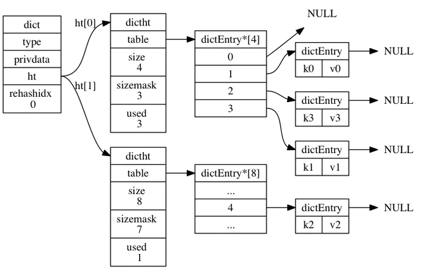
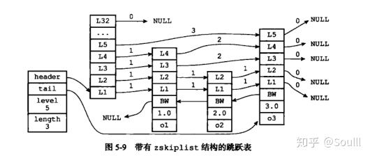

# 源码概览

第一阶段 阅读Redis的数据结构部分

- 内存分配 zmalloc.c和zmalloc.h
- 动态字符串 sds.h和sds.c
- 双端链表 adlist.c和adlist.h
- 字典 dict.h和dict.c
- 跳跃表 server.h文件里面关于zskiplist结构和zskiplistNode结构，以及t_zset.c中所有zsl开头的函数，比如 zslCreate、zslInsert、zslDeleteNode等等。
- 基数统计 hyperloglog.c 中的 hllhdr 结构， 以及所有以 hll 开头的函数


第二阶段 熟悉Redis的内存编码结构

- 整数集合数据结构 intset.h和intset.c
- 压缩列表数据结构 ziplist.h和ziplist.c


第三阶段 熟悉Redis数据类型的实现

- 对象系统 object.c
- 字符串键 t_string.c
- 列表建 t_list.c
- 散列键 t_hash.c
- 集合键 t_set.c
- 有序集合键 t_zset.c中除 zsl 开头的函数之外的所有函数
- HyperLogLog键 hyperloglog.c中所有以pf开头的函数


第四阶段 熟悉Redis数据库的实现

- 数据库实现 redis.h文件中的redisDb结构，以及db.c文件
- 通知功能 notify.c
- RDB持久化 rdb.c
- AOF持久化 aof.c

以及一些独立功能模块的实现

- 发布和订阅 redis.h文件的pubsubPattern结构，以及pubsub.c文件
- 事务 redis.h文件的multiState结构以及multiCmd结构，multi.c文件


第五阶段 熟悉客户端和服务器端的代码实现

- 事件处理模块 ae.c/ae_epoll.c/ae_evport.c/ae_kqueue.c/ae_select.c
- 网路链接库 anet.c和networking.c
- 服务器端 redis.c
- 客户端 redis-cli.c
- 这个时候可以阅读下面的独立功能模块的代码实现
- lua脚本 scripting.c
- 慢查询 slowlog.c
- 监视 monitor.c


第六阶段 这一阶段主要是熟悉Redis部分的代码实现

- 复制功能 replication.c
- Redis Sentinel sentinel.c
- 集群 cluster.c


关于测试方面的文件有：

- memtest.c 内存检测
- redis_benchmark.c 用于redis性能测试的实现。
- redis_check_aof.c 用于更新日志检查的实现。
- redis_check_dump.c 用于本地数据库检查的实现。
- testhelp.c 一个C风格的小型测试框架。


一些工具类的文件如下：

- bitops.c GETBIT、SETBIT 等二进制位操作命令的实现
- debug.c 用于调试时使用
- endianconv.c 高低位转换，不同系统，高低位顺序不同
- help.h 辅助于命令的提示信息
- lzf_c.c 压缩算法系列
- lzf_d.c 压缩算法系列
- rand.c 用于产生随机数
- release.c 用于发布时使用
- sha1.c sha加密算法的实现
- util.c 通用工具方法
- crc64.c 循环冗余校验
- sort.c SORT命令的实现
- 一些封装类的代码实现：
- bio.c background I/O的意思，开启后台线程用的
- latency.c 延迟类
- migrate.c 命令迁移类，包括命令的还原迁移等
- pqsort.c 排序算法类
- rio.c redis定义的一个I/O类
- syncio.c 用于同步Socket和文件I/O操作


# 源码详解


## 动态字符SDS

sds （Simple Dynamic String，简单动态字符串）是 Redis 底层所使用的字符串表示， 几乎所有的 Redis 模块中都用了 sds。


### SDS 与 C字符串区别


#### 常数时间获取字符串长度

C字符串需要遍历, 时间复杂度为O(n).

SDS直接获取,  时间复杂度为O(1).


####  防止缓冲区溢出

C语言不记录自身长度, 容易造成缓冲区溢出

```c
strcat(s1, s3)
```

SDS的空间分配策略完全杜绝了这种可能性.  当API需要对SDS进行修改时,  API会首先会检查SDS的空间是否满足条件, 如果不满足, API会自动对它动态扩展,   然后再进行修改, 这个过程是完全透明的.


#### 减少修改字符串带来的内存重分配次数

C语言对字符串修改后都需要手动重新分配内存; 当增加长度时需要扩展内存, 否则会产生缓冲区溢出;  当缩小长度时需要释放内存, 否则会产生内存泄露.

由于Redis频繁操作数据, 内存分配和释放耗时可能对性能造成影响, SSD避免了这种缺陷, 实现<font color=#00dd00>空间预分配和惰性空间释放两种优化策略</font>

##### 空间预分配

- 若修改之后sds长度小于1MB,则多分配现有len长度的空间
- 若修改之后sds长度大于等于1MB，则扩充除了满足修改之后的长度外，额外多1MB空间


如果修改后len长度将小于 1 M, 这时分配给free的大小和len一样, 例如修改过后为13字节,  那么给free也是13字节 .    buf实际长度变成了  13 byte+ 13byte + 1byte = 27byte

如果修改后len长度将大于等于1 M, 这时分配给free的长度为 1 M,     例如修改过后为30M,  那么给free是1M .    buf实际长度变成了  30M + 1M + 1 byte

在修改时, 首先检查空间是不是够, 如果足够, 直接使用, 否则执行内存重分配.


##### 惰性空间释放

当缩短SDS长度时, 不进行内存释放, 而是记录到free字段中, 等待下次使用.  

与此同时, 也提供相应的API, 可以手动释放内存.


#### 二进制安全

C字符串只有末尾能保存空格， 中间如果有空格会被截取, 认作结束标识. 这样就不能保存图片, 音频视频等二进制数据了.

所有的SDS API会以二进制的方式处理SDS buf数组里面的数据, 程序不会对其中数据做任何限制, 过滤,修改和假设,  数据写入是什么样子, 读取出来就是什么样子.

> 例如 :  保留的数据中间出现'',  这是没有任何问题的. ,  因为它使用len而不是空字符判断结束.


### SDS实现


#### 结构定义

```c
/* Note: sdshdr5 is never used, we just access the flags byte directly.
 * However is here to document the layout of type 5 SDS strings. */
//小于一字节
struct __attribute__ ((__packed__)) sdshdr5 {
    unsigned char flags; /* 3 lsb of type, and 5 msb of string length */
    char buf[];
};
//一字节
struct __attribute__ ((__packed__)) sdshdr8 {
    uint8_t len; /* used 当前sds的长度*/
    uint8_t alloc; /* excluding the header and null terminator 为sds分配的内存大小*/
    unsigned char flags; /* 3 lsb of type, 5 unused bits 当前sds的类型*/
    char buf[];
};
/*
    1、节约内存：如SDS32可以节省3个字节
    2、buf指针引用：SDS返回给上层的，不是结构体首地址，而是 buf 指针地址，这样可以通过 buf[-1] 直接获得 flags ，来识别当前 sds 结构体的类型，从而获取整个结构体的任意一个部分
*/

//2字节
struct __attribute__ ((__packed__)) sdshdr16 {
    uint16_t len; /* used */
    uint16_t alloc; /* excluding the header and null terminator */
    unsigned char flags; /* 3 lsb of type, 5 unused bits */
    char buf[];
};

/*
	alloc字段:  空间预分配和惰性空间释放的设计思想
		
		空间预分配: 
			sdsavail()方法中，在获取字符串剩余可用空间的时候，就会使用到alloc字段。
			它记录了分配的总空间大小，方便我们在进行字符串追加操作的时候，判断是否需要额外分配空间。
			当前剩余的可用空间大小为alloc - len，即已分配总空间大小alloc - 当前使用的空间大小len
		
		惰性空间释放: 
			用于优化 SDS 的字符串截取或缩短操作。
			当 SDS 的 API 需要缩短 SDS 保存的字符串时，程序并不立即回收缩短后多出来的字节。
			这样一来，如果将来要对 SDS 进行增长操作的话，这些未使用空间就可能会派上用场。
*/

//4字节
struct __attribute__ ((__packed__)) sdshdr32 {
    uint32_t len; /* used */
    uint32_t alloc; /* excluding the header and null terminator */
    unsigned char flags; /* 3 lsb of type, 5 unused bits */
    char buf[];
};
//8字节
struct __attribute__ ((__packed__)) sdshdr64 {
    uint64_t len; /* used */
    uint64_t alloc; /* excluding the header and null terminator */
    unsigned char flags; /* 3 lsb of type, 5 unused bits */
    char buf[];
};

#define SDS_TYPE_5  0
#define SDS_TYPE_8  1
#define SDS_TYPE_16 2
#define SDS_TYPE_32 3
#define SDS_TYPE_64 4
#define SDS_TYPE_MASK 7
#define SDS_TYPE_BITS 3
#define SDS_HDR_VAR(T,s) struct sdshdr##T *sh = (void*)((s)-(sizeof(struct sdshdr##T)));
#define SDS_HDR(T,s) ((struct sdshdr##T *)((s)-(sizeof(struct sdshdr##T))))
#define SDS_TYPE_5_LEN(f) ((f)>>SDS_TYPE_BITS)
```


```c
// 结构体会按照其所有变量结构体做最小公倍数字节对齐。当使用 packed 修饰后，结构体会按照 1字节对齐。
_attribute__ ((__packed__)) 
```

1、节约内存：如SDS32可以节省3个字节
2、buf指针引用：SDS返回给上层的，不是结构体首地址，而是 buf 指针地址，这样可以通过 buf[-1] 直接获得 flags ，来识别当前 sds 结构体的类型，从而获取整个结构体的任意一个部分


> 以 SDS32 为例 ，修饰前按照 12（4x3）字节对齐，修饰后按照1字节对齐。


#### API

```c
//（1）创建一个包含给定c字符串的sds
sds sdsnew(const char *init);

//（2）为sds(也就是buf数组)分配指定空间
/* 创建一个sds字符串的核心函数 */
/* 会根据字符串长度来选择合适的SDS 类型，待数据填入完成后，会返回 SDS buf 的指针作为 SDS 的指针 */
sds sdsnewlen(const void *init, size_t initlen);

/* 扩容的核心函数 */
sds sdsMakeRoomFor(sds s, size_t addlen);

//（3）创建一个不包含任何内容的空字符串
sds sdsempty(void);

//（4）释放给定的sds
void sdsfree(sds);

//（5）创建一个给定sds的副本
sds sdsdup(sds);

//（6）清空sds保存的字符串内容
sds sdsclear(sds);

//（7）将给定c字符串拼接到另一个sds字符串的末尾
sds sdscat(sds,char *);

//（8）将给定sds字符串拼接到另一个sds字符串的末尾
sds sdscatsds(sds,sds);

//（9）将给定的c字符串复制到sds里面，覆盖原有的字符串
sds sdscpy(sds,char *);

//（10）保留sds给定区间内的数据
sds sdsrange(sds,int,int);

// 对给定字符或字符串进行分割
sds *sdssplitlen(const char *s, ssize_t len, const char *sep, int seplen, int *count)

//（11）从sds中移除所有在c字符串中出现过的字符
sds sdstrim(sds,const char *);

//（12）对比两个sds字符串是否相同
bool sdscmp(sds,sds);

// 获取sds可用的字节数   
/* sdsalloc() = sdsavail() + sdslen() */
size_t sdsavail(const sds s);

size_t sdslen(const sds s);
```


## 双向链表adlist


## 字典dict

hash

### 结构定义

Redis的字典实现主要依赖的数据结构包括三部分：dict，dictht，dictEntry节点。

dict中嵌入了2个dictht表，dictht表中的table字典存放着dictEntry


结构体的各个字段作用：

```properties
dict结构
    type：是用户自定义的函数列表，主要用于插入数据到字典时进行的一些操作，比如计算key哈希值的
 hashFunction 函数句柄。
    privdata：创建字典时指定的私有数据，一般提供给 type 字段中的函数句柄使用。
    ht[2]：类型为 dictht 结构的数组，这个数组有两个元素，而 dictht 结构主要用于保存数据，一
 般情况下只用ht[0],只有当字典扩容，缩容需要进行rehash时才会用到ht[1].
    rehashidx：rehash操作过程中最后一次处理的桶索引。
    iterators：用于迭代字典中的数据。

dictht结构
    table：类型为 dictEntry 结构指针的数组，用于保存数据，每个 key-value 的数据对通过类型为
 dictEntry 的结构来存储。
    size：table数组的大小。
    sizemark：用于取模，得到一个 0 ～ size 的索引值。恒等于size-1
    used：表示字典中有多少个元素。包含next单链表数据

dictEntry结构
    key：数据的键，主要用于查找数据。
    v：数据的值，数据主要通过这个字段来存储。
    next：用于解决Hash冲突，把冲突的key连接起来（拉链法）。
```


### 字典初始化

在redis-server启动中，整个数据库会先初始化一个空的字典用于存储整个数据库的键值对，初始化一个空字典，主要调用的是dict.h文件中的dictCreate函数

```c
/* Reset a hash table already initialized with ht_init().
 * NOTE: This function should only be called by ht_destroy(). */
static void _dictReset(dictht *ht)
{
    ht->table = NULL;
    ht->size = 0;
    ht->sizemask = 0;
    ht->used = 0;
}

/* 创建一个新的hash表 */
dict *dictCreate(dictType *type, void *privDataPtr)
{
    dict *d = zmalloc(sizeof(*d));  //96字节
    _dictInit(d,type,privDataPtr);  //结构体初始化值
    return d;
}

/* 初始化hash表 */
int _dictInit(dict *d, dictType *type, void *privDataPtr)
{
    _dictReset(&d->ht[0]);
    _dictReset(&d->ht[1]);
    d->type = type;
    d->privdata = privDataPtr;
    d->rehashidx = -1;
    d->iterators = 0;
    return DICT_OK;
}
```


dictCreate函数初始化一个空字典的主要步骤为：申请空间，调用_dictInit函数，给字典的各个字段赋予初始值。初始化后，一个字典内存占用情况如下图所示：


Redis中怎么创建一个字典的

```c
/* ------server.c------ */
/* Command table. sds string -> command struct pointer. */
dictType commandTableDictType = {
    dictSdsCaseHash,            /* hash function */
    NULL,                       /* key dup */
    NULL,                       /* val dup */
    dictSdsKeyCaseCompare,      /* key compare */
    dictSdsDestructor,          /* key destructor */
    NULL                        /* val destructor */
};

/*初始化服务端配置*/
void initServerConfig(void) {
    ........
    server.commands = dictCreate(&commandTableDictType,NULL);
    server.orig_commands = dictCreate(&commandTableDictType,NULL);
    ........
}
```

创建字典时，需要提供 dictType 参数，而这个参数主要定义了插入数据到字典时进行的一些操作，比如插入数据时key是否要进行复制的keyDup函数，那么我们来看看 dictType 的定义：

```c
typedef struct dictType {
    uint64_t (*hashFunction)(const void *key);  /*用于计算键的哈希值*/
    void *(*keyDup)(void *privdata, const void *key);  /*用于复制数据的键*/
    void *(*valDup)(void *privdata, const void *obj);  /*用于复制数据的值*/
    /*用于比较键是否相等*/
    int (*keyCompare)(void *privdata, const void *key1, const void *key2);
    void (*keyDestructor)(void *privdata, void *key);  /*用于释放复制出来的键的内存*/
    void (*valDestructor)(void *privdata, void *obj);  /*用于释放复制出来的值的内存*/
} dictType;
```


### 疑问

① 如何计算 key 的 hash 值，如何计算该key 在 hash table 中的 index？-> 泊松分布

② Redis 是如何解决 key 冲突问题？-> 拉链法，头插解决

③ 每次扩容的大小是多少？扩容的时候有新的命令请求到底去哪个 ht中找数据？

④ 扩容的时如何将 ht[0] 中的数据转移到 ht[1] 中？ht[1] 又是怎么替换 ht[0] 的？


#### 计算 key 的hash 值

```c
/*
  * 计算 key 的hash 值
  * 我们可以看到实际上还是调用字典本身 type 指向的 hash 函数
  */
#define dictHashKey(d, key) (d)->type->hashFunction(key)

/* 缺省哈希函数 */
uint64_t siphash(const uint8_t *in, const size_t inlen, const uint8_t *k) {
#ifndef UNALIGNED_LE_CPU
    uint64_t hash;
    uint8_t *out = (uint8_t*) &hash;
#endif
    uint64_t v0 = 0x736f6d6570736575ULL;
    uint64_t v1 = 0x646f72616e646f6dULL;
    uint64_t v2 = 0x6c7967656e657261ULL;
    uint64_t v3 = 0x7465646279746573ULL;
    uint64_t k0 = U8TO64_LE(k);
    uint64_t k1 = U8TO64_LE(k + 8);
    uint64_t m;
    const uint8_t *end = in + inlen - (inlen % sizeof(uint64_t));
    const int left = inlen & 7;
    uint64_t b = ((uint64_t)inlen) << 56;
    v3 ^= k1;
    v2 ^= k0;
    v1 ^= k1;
    v0 ^= k0;

    for (; in != end; in += 8) {
        m = U8TO64_LE(in);
        v3 ^= m;

        SIPROUND;

        v0 ^= m;
    }

    switch (left) {
    case 7: b |= ((uint64_t)in[6]) << 48; /* fall-thru */
    case 6: b |= ((uint64_t)in[5]) << 40; /* fall-thru */
    case 5: b |= ((uint64_t)in[4]) << 32; /* fall-thru */
    case 4: b |= ((uint64_t)in[3]) << 24; /* fall-thru */
    case 3: b |= ((uint64_t)in[2]) << 16; /* fall-thru */
    case 2: b |= ((uint64_t)in[1]) << 8; /* fall-thru */
    case 1: b |= ((uint64_t)in[0]); break;
    case 0: break;
    }

    v3 ^= b;

    SIPROUND;

    v0 ^= b;
    v2 ^= 0xff;

    SIPROUND;
    SIPROUND;

    b = v0 ^ v1 ^ v2 ^ v3;
#ifndef UNALIGNED_LE_CPU
    U64TO8_LE(out, b);
    return hash;
#else
    return b;
#endif
}

/*
	如果hash 函数设计的好的话，冲突节点是很少的，redis 里面使用了泊松分布来设计hash 函数的。
*/
```


#### 计算key 在hash表中的下标 index

```c
static long _dictKeyIndex(dict *d, const void *key, uint64_t hash, dictEntry **existing) {
    unsigned long idx, table;
    dictEntry *he;
    if (existing) *existing = NULL;

    /* Expand the hash table if needed */
    if (_dictExpandIfNeeded(d) == DICT_ERR)
        return -1;
    for (table = 0; table <= 1; table++) {
        // 计算下标
        idx = hash & d->ht[table].sizemask;
        /* Search if this slot does not already contain the given key */
        he = d->ht[table].table[idx];
        // 如果当前位置已经存在元素
        while (he) {
            // 1. 比较两个元素是否一样
            if (key == he->key || dictCompareKeys(d, key, he->key)) {
                if (existing) *existing = he;
                return -1;
            }
            // 2. 两个元素不一样，采用头插法解决冲突问题
            he = he->next;
        }
        // 如果当前没有进行 rehash，则不需要查找 ht[1],直接退出即可
        if (!dictIsRehashing(d)) break;
    }
    // 返回 idx
    return idx;
}
```


#### 扩容的大小

```c
/* 如果需要扩展hash表 */
static int _dictExpandIfNeeded(dict *d) {
    /* Incremental rehashing already in progress. Return. */
    if (dictIsRehashing(d)) return DICT_OK;

    /* If the hash table is empty expand it to the initial size. */
    if (d->ht[0].size == 0) return dictExpand(d, DICT_HT_INITIAL_SIZE);

    /* 
     * 实际扩容触发机制：
     * 如果哈希表的已用节点数 >= 哈希表的大小，并且以下条件任一个为真：
     * 1) dict_can_resize 为真 
     * 2) 已用节点数除以哈希表大小之比大于 dict_force_resize_ratio=5
     * 那么调用 dictExpand 对哈希表进行扩展,扩展的体积至少为已使用节点数的两倍 
     */  
    if (d->ht[0].used >= d->ht[0].size &&
        (dict_can_resize ||
         d->ht[0].used / d->ht[0].size > dict_force_resize_ratio)) {
        return dictExpand(d, d->ht[0].used * 2);
    }
    return DICT_OK;
}

/* 上面 size * 2 并不是将哈希表扩容成 size 的两倍，继续深入到 dictExpand() 里面 */

/*
    @param d    	原字典
    @param size     扩容的 size，大于 size 的最小2次幂
 */
int dictExpand(dict *d, unsigned long size) {
    /*
     * 如果正在进行扩容或者元素个数比扩容到指定大小还要大，
     * 则说明这次扩容是不成功的
     */
    if (dictIsRehashing(d) || d->ht[0].used > size)
        return DICT_ERR;
    // 一个新的 hash table
    dictht n;
    // 重新计算新的 hashtable 的容量
    unsigned long realsize = _dictNextPower(size); 

    /* 扩容之后的大小和原来的大小一样的话则说明这次扩容是不成功的 */
    if (realsize == d->ht[0].size) return DICT_ERR;

    /* 给新 hashtable 初始化 */
    n.size = realsize;
    n.sizemask = realsize - 1;
    n.table = zcalloc(realsize * sizeof(dictEntry *));
    n.used = 0;

    //如果这是第一次初始化，那么直接就设置成指定大小
    if (d->ht[0].table == NULL) {
        d->ht[0] = n;
        return DICT_OK;
    }

    /* 准备对第二个进行增量重组 */
    d->ht[1] = n;
    // rehashidx = 0 表示将要准备扩容了
    d->rehashidx = 0;
    return DICT_OK;
}

/* 真正的扩容算法其实是 _dictNextPower(size) */

/* hash 表的容量一定是 2 的幂次方 重新计算hashtable 的容量 */
static unsigned long _dictNextPower(unsigned long size) {
    // DICT_HT_INITIAL_SIZE = 4
    unsigned long i = DICT_HT_INITIAL_SIZE;
    // 扩容算法
    // 如果元素比 long 最大值还要大，那么每次扩容 1 个元素
    // 注意了：这里的 size = used * 2 所以这里至少是扩容2倍
    if (size >= LONG_MAX) return LONG_MAX + 1LU;
    while (1) {
        // 这里并不是 d->ht[0].used*2 的两倍，而是大于 d->ht[0].used*2 的最小2次幂
        // _dictExpandIfNeeded() 该方法可以看出 dictExpand(d, d->ht[0].used*2)
        if (i >= size)
            return i;
        i *= 2;
    }
}

/*
DICT_HT_INITIAL_SIZE初始化值为4，通过上述表达式，取当42^n >= ht[0].used2的值作为字典扩展的size大小。即为：ht[1].size 的值等于第一个大于等于ht[0].used*2的2^n的数值。
*/
```


##### 为什么一定要是2的n次方

1.减小哈希冲突概率

> 假如当前table数组长度为len，插入节点时，需要对key的hashcode进行哈希，然后跟len-1相与(得到的值一定小于len，避免数组越界) 如果len是2的N次方，那么len-1的后N位二进制一定是全1。假设有两个key，他们的hashcode不同，分别为hashcode1和hashcode2 ，hashcode1和hashcode2 分别与一个后N位全1的二进制相与，结果一定也不同 但是，如果hashcode1和hashcode2 分别与一个后N位非全1的二进制相与，结果有可能相同。也就是说，如果len是2^N，不同hashcode的key计算出来的数组下标一定不同； 否则，不同hashcode的key计算出来的数组下标一定相同。所以Redis 长度为全1，可以减小哈希冲突概率。


2.提高计算下标的效率

   如果len的二进制后n位非全1，与len-1相与时，0与1相与需要取反。如果len的二进制后n位全1，完全不需要取反。
 如果len为2N，那么与len-1相与，跟取余len等价，而与运算效率高于取余。如果len不是2N，与len-1相与，跟取余len不等价。


#### 扩容的时如何将 ht[0] 中的数据转移到 ht[1] 中

Redis 中并不是只存了几个KV，有可能存了上千万的KV或者上亿的KV，如果一下子就转移过去，这样肯定会阻塞 Redis 服务器的。

```c
/* 
 * 执行增量重新哈希的N个步骤。 如果仍有，则返回1
 * 键从旧的哈希表移到新的哈希表，否则返回0。
 *
 * 请注意，重新调整步骤包括移动一个存储桶（可能有更多存储空间）
 * 然而，从旧的哈希表到新的哈希表中，我们使用链接时只有一个键）
 * 因为散列表的一部分可能由空白组成，所以它不是保证这个函数会重新扫描一个桶，
*  因为它将会在最多N * 10个空桶中进行访问，否则将会访问
 * 它所做的工作将会被解除，并且该功能可能会阻塞很长一段时间。
 * @param  n [就是步长，每次迁移的步长，固定 100]
 */
int dictRehash(dict *d, int n) {
    // 最大访问空桶数量，进一步减小可能引起阻塞的时间。
    int empty_visits = n * 10; /* Max number of empty buckets to visit. */
    if (!dictIsRehashing(d)) return 0;

    /*
     * 扩容时，每次只移动 n 个元素，防止 redis 阻塞
     */
    while (n-- && d->ht[0].used != 0) {
        dictEntry *de, *nextde;
        assert(d->ht[0].size > (unsigned long) d->rehashidx);
        // 一旦超出最大空桶的范围则直接退出
        while (d->ht[0].table[d->rehashidx] == NULL) {
            d->rehashidx++;
            // empty_visits 最大空桶数量
            if (--empty_visits == 0) return 1;
        }
        de = d->ht[0].table[d->rehashidx];
        /* 将key 转移到新的 ht中去 */
        while (de) {
            uint64_t h;
            nextde = de->next;
            // 将 ht[0] 中的元素迁移到 ht[1] 中去
            h = dictHashKey(d, de->key) & d->ht[1].sizemask;
            de->next = d->ht[1].table[h];
            d->ht[1].table[h] = de;
            d->ht[0].used--;
            d->ht[1].used++;
            de = nextde;
        }
        d->ht[0].table[d->rehashidx] = NULL;
        // 通过 rehashidx 参数记录当前转移数据的位置，方便下次转移
        d->rehashidx++;
    }
    /* 检查是否已经 rehash 完毕了 */
    if (d->ht[0].used == 0) {
        // 释放 ht[0]
        zfree(d->ht[0].table);
        // 将 ht[1] 赋值给 ht[0]
        d->ht[0] = d->ht[1];
        // 重置 ht[1]，等待下一次扩容
        _dictReset(&d->ht[1]);
        d->rehashidx = -1;
        return 0;
    }
    /* More to rehash... */
    return 1;
}
```

这里只有转移的操作，并没有指明数据是什么时候转移的，触发机制是在哪里。带着这个疑问，我们继续。

```c
// dict.c:

int dictRehashMilliseconds(dict *d, int ms) {
    long long start = timeInMilliseconds();
    int rehashes = 0;
    // 每次扩容步长为 100，超过了指定时间就退出
    // 源码里面就是直接写死的 100
    while (dictRehash(d, 100)) {
        rehashes += 100;
        if (timeInMilliseconds() - start > ms) break;
    }
    return rehashes;
}

// server.c:
int incrementallyRehash(int dbid) {
    /* Keys dictionary */
    if (dictIsRehashing(server.db[dbid].dict)) {
        dictRehashMilliseconds(server.db[dbid].dict,1);
        return 1; /* already used our millisecond for this loop... */
    }
    /* 过期字典表 */
    if (dictIsRehashing(server.db[dbid].expires)) {
        dictRehashMilliseconds(server.db[dbid].expires,1);
        return 1; /* already used our millisecond for this loop... */
    }
    return 0;
}

server.c:
/*
 * 此函数处理我们需要执行的“后台”操作在Redis数据库中递增，例如 key 到期，rehashing
 */
void databasesCron(void) {
        ···

        /* Rehash */
        if (server.activerehashing) {
            for (j = 0; j < dbs_per_call; j++) {
                int work_done = incrementallyRehash(rehash_db);
                if (work_done) {
                    /* If the function did some work, stop here, we'll do
                     * more at the next cron loop. */
                    break;
                } else {
                    /* 如果当前 db 不需要 rehash，那么将尝试下一个db */
                    rehash_db++;
                    rehash_db %= server.dbnum;
                }
            }
        }
    }
}
```

 通过上面的代码我们会发现，Redis 是通过执行 databaseCron 任务来执行渐进式的 rehashing的。而不是一蹴而就的。每次转移的步长是 100。

具体步骤：

```properties
1.为 ht[1] 分配空间，让字典同时持有 ht[0] 和 ht[1] 两个哈希表。

2.在字典中维持一个索引计数器变量 rehashidx，将它的值设置为0，表示 rehash 工作正式开始。

3.在 rehash 进行期间，每次对字典执行添加、删除、查找或者更新操作时，程序除了执行指定的操作以外，还会顺带将ht[0] 哈希表在 rehashidx 索引上的所有键值对 rehash 到 ht[1]，当 rehash 工作完成之后，程序将 rehashidx 属性的值增一。

4.随着字典操作不断执行，最终在某个时间点上，ht[0] 的所有键值对都会被 rehash 至 ht[1]，这时 rehashidx 的值会被设置为-1，表示rehash 已经完成。
```


<font color=#00dd00>渐进式 rehash 的好处在于它采取分而治之的方式，将 rehash 键值对所需的计算工作均匀摊到对字典的每个添加、删除、查找和更新操作上，避免了集中式 rehash 而带来的庞大计算量。</font>


《Redis设计与实现》中的图解:

准备开始 rehash：


rehash 索引 0 上的键值对：




rehash 索引1上的键值对：


rehash 索引 2 上的键值对：


rehash 索引 3 上的键值对：


rehash 执行完毕：


### dictScan

dictScan函数可以在rehash的过程中遍历字典

```c
unsigned long dictScan(dict *d,
                       unsigned long v,
                       dictScanFunction *fn,
                       dictScanBucketFunction* bucketfn,
                       void *privdata)
{
    dictht *t0, *t1;
    const dictEntry *de, *next;
    unsigned long m0, m1;

    if (dictSize(d) == 0) return 0;

	//没有rehash时直接遍历
    if (!dictIsRehashing(d)) {
        t0 = &(d->ht[0]);
        m0 = t0->sizemask;

        /* Emit entries at cursor */
        if (bucketfn) bucketfn(privdata, &t0->table[v & m0]);
        
        //将hash表中cursor索引（table[cursor]）指向的链表（dictEntry）都遍历一遍
        de = t0->table[v & m0];
        while (de) {
            next = de->next;
			
			//调用用户提供的fn函数，需要对键值对进行的操作
            fn(privdata, de);
            de = next;
        }

        /* Set unmasked bits so incrementing the reversed cursor
         * operates on the masked bits */
        v |= ~m0;

        /* Increment the reverse cursor */
        v = rev(v);
        v++;
        v = rev(v);
		//将cursor索引赋值为hash表中下一个要遍历的bucket索引,即table[cursor]指向的下一个要遍历的链表
    } else {
    	//正在进行rehash
       
        t0 = &d->ht[0];
        t1 = &d->ht[1];

        /* Make sure t0 is the smaller and t1 is the bigger table */
        if (t0->size > t1->size) {
            t0 = &d->ht[1];
            t1 = &d->ht[0];
        }
		//t0小表， t1大表
		
        m0 = t0->sizemask;
        m1 = t1->sizemask;

        /* Emit entries at cursor */
        if (bucketfn) bucketfn(privdata, &t0->table[v & m0]);

		//将小表中cursor索引（table[cursor]）指向的链表都遍历一遍
        de = t0->table[v & m0];
        while (de) {
            next = de->next;
            fn(privdata, de);
            de = next;
        }

        /* Iterate over indices in larger table that are the expansion
         * of the index pointed to by the cursor in the smaller table */

		//再遍历大表t1中相应的索引指向的链表，这里相应的索引见最后的【注】
        do {
            /* Emit entries at cursor */
            if (bucketfn) bucketfn(privdata, &t1->table[v & m1]);
            de = t1->table[v & m1];
            while (de) {
                next = de->next;
                fn(privdata, de);
                de = next;
            }

            /* Increment the reverse cursor not covered by the smaller mask.*/
            v |= ~m1;
            v = rev(v);
            v++;
            v = rev(v);

            /* Continue while bits covered by mask difference is non-zero */
        } while (v & (m0 ^ m1));
    }

    return v;
}
```


### 插入元素

redis-server启动后，再启动redis-client连上server，执行命令

```shell
$ 127.0.0.1:6379> set  hello  world
```


Server端收到命令后，会执行`void setKey(redisDb *db, robj *key, robj *val);`

根据之前介绍字典的特性，每个键必须是唯一的，主要流程如下:

```properties
1). 调用dictFind函数，查找键是否存在，则调用dbOverwrite函数修改键值对，否则调用dictAdd函数
添加元素
2). dbAdd会调用dict.h中的dictAdd函数插入键值对.
```

dictAdd函数

```c
/* 调用之前会查找key是否存在，不存在则调用dictAdd函数 */
int dictAdd(dict *d, void *key, void *val)
{
    /*添加键，字典中键已存在则返回NULL,否则添加键到新节点中，返回新节点*/
    dictEntry *entry = dictAddRaw(d,key,NULL); 
    if (!entry) return DICT_ERR;   /*键存在则返回错误*/
    dictSetVal(d, entry, val);  /*设置新值*/
    return DICT_OK;
}
```

而dictAdd() 函数主要还是通过调用 dictAddRaw() 函数来完成插入操作，dictAddRaw() 函数的代码如下：

```c
 /*入参字典，键，Hash表节点地址*/
dictEntry *dictAddRaw(dict *d, void *key, dictEntry **existing) 
{
    long index;
    dictEntry *entry;
    dictht *ht;
    /*该字典是否在进行rehash操作，如果是则执行一次rehash*/
    if (dictIsRehashing(d)) _dictRehashStep(d);
    /*查找键，找到则直接返回-1，并把老节点存入existing字段，否则把新节点的索引值返回，
    如果遇到Hash表容量不足，则进行扩容*/
    if ((index = _dictKeyIndex(d, key, dictHashKey(d,key), existing)) == -1)
        return NULL;
    /*是否进行rehash操作中，如果是则插入到散列表ht[1]中，否则插入到散列表ht[0]*/
    ht = dictIsRehashing(d) ? &d->ht[1] : &d->ht[0];
    /*申请新节点内存，插入散列表中，给新节点存入键信息*/
    entry = zmalloc(sizeof(*entry));
    // 头插法
    entry->next = ht->table[index];
    ht->table[index] = entry;
    ht->used++;

    /* Set the hash entry fields. */
    dictSetKey(d, entry, key);
    return entry;
}
```


dictAddRaw() 函数主要完成以下几个工作：

```properties
1). 判断是否正在进行rehash操作（dictIsRehashing() 判断为真），如果是就调用 
_dictRehashStep() 函数进行rehash。

2). 通过调用 _dictKeyIndex() 函数计算key对应所在哈希表的位置（索引）index。

3).如果正在进行rehash，那么就使用ht数组的第二个哈希表，否则就用第一个

4).创建一个 dictEntry 结构用于保存数据的键和值。
```

dictAddRaw() 函数会返回一个类型为 dictEntry 结构的值，然后 dictAdd() 函数通过调用 dictSetVal() 函数设置其值。
插入元素，字典对应的内存占用结构如下图:


### 字典扩容

当哈希表中的数据个数超过一定数量时，哈希冲突的链表过长，从而导致查询效率降低，这个时候就需要Rehash操作。Rehash操作是将哈希表的数组扩大，从而减少哈希冲突的比率。当然扩大哈希表的数组会导致之前的映射关系无效，所以需要把旧数据重新迁移到新的哈希表数组中。

Redis在插入数据到字典时，会通过 _dictExpandIfNeeded() 函数来判断是否需要进行Rehash操作

```c
static int _dictExpandIfNeeded(dict *d)
{
    if (dictIsRehashing(d)) return DICT_OK;

    if (d->ht[0].size == 0) return dictExpand(d, DICT_HT_INITIAL_SIZE);

    if (d->ht[0].used >= d->ht[0].size &&
        (dict_can_resize ||
         d->ht[0].used/d->ht[0].size > dict_force_resize_ratio))
    {
        return dictExpand(d, d->ht[0].used*2);
    }
    return DICT_OK;
}
/*

_dictExpandIfNeeded() 函数主要完成3个工作：

    1). 通过 dictIsRehashing() 来判断字典是否正在Rehash操作，如果是就直接返回OK，不需要再进行
    Rehash。
    2). 如果字典的第一个哈希表的大小为0，表示需要对第一个哈希表进行初始化。
    3). 如果第一个哈希表的元素个数大于等于哈希表的大小，那么就对第一个哈希表进行Rehash操作（把
    哈希表的大小扩大为原来的2倍）。
*/
```

进行Rehash操作通过调用 dictExpand() 函数来完成

```c
/*传入size = d->ht[0].used * 2 */
int dictExpand(dict *d, unsigned long size)
{
    /* the size is invalid if it is smaller than the number of
     * elements already inside the hash table */
    if (dictIsRehashing(d) || d->ht[0].used > size) 
        return DICT_ERR;

    dictht n; /* the new hash table */
    /*重新计算扩容后的值，必须为2的N次方幂*/
    unsigned long realsize = _dictNextPower(size);

    /* Rehashing to the same table size is not useful. */
    if (realsize == d->ht[0].size) return DICT_ERR;

    /* Allocate the new hash table and initialize all pointers to NULL */
    n.size = realsize;
    n.sizemask = realsize-1;
    n.table = zcalloc(realsize*sizeof(dictEntry*));
    n.used = 0;

    /* Is this the first initialization? If so it's not really a rehashing
     * we just set the first hash table so that it can accept keys. */
    if (d->ht[0].table == NULL) {
        d->ht[0] = n;
        return DICT_OK;
    }

    /* Prepare a second hash table for incremental rehashing */
    d->ht[1] = n;  /*扩容后的新内存放入ht[1]中*/
    d->rehashidx = 0; /*非-1，表示需要进行rehash*/
    return DICT_OK;
}
```

dictExpand() 函数比较简单，就是申请一个更大的哈希数组，如果第一个哈希表的哈希数组为空，那么就把第一个哈希表的哈希数组设置为新的哈希数组。否则将第二个哈希表的哈希数组设置为新的哈希数组。


扩容的主要流程如下:

```properties
1). 申请一块新内存后，初次申请是默认大小为4个dictEntry；非初次申请时，申请内存的大小为当前
Hash表容量的一倍。

2）把新申请的内存地址赋值给ht[1],并把字典的rehashidx标识从-1改为0，表示只有需要进行rehash
操作，此时字典的内存结构如下
```


### 哈希表的扩展与收缩

当以下条件中的任意一个被满足时， 程序会自动开始对哈希表执行扩展操作：

- 服务器目前没有在执行 BGSAVE 命令或者 BGREWRITEAOF 命令， 并且哈希表的负载因子大于等于 1 ；
- 服务器目前正在执行 BGSAVE 命令或者 BGREWRITEAOF 命令， 并且哈希表的负载因子大于等于 5 ；


哈希表的负载因子可以通过公式：

```properties
# 负载因子 = 哈希表已保存节点数量 / 哈希表大小
load_factor = ht[0].used / ht[0].size
```


根据 BGSAVE 命令或 BGREWRITEAOF 命令是否正在执行， 服务器执行扩展操作所需的负载因子并不相同。

这是因为在执行 BGSAVE 命令或 BGREWRITEAOF 命令的过程中， Redis 需要创建当前服务器进程的子进程，

 而大多数操作系统都采用写时复制（copy-on-write）技术来优化子进程的使用效率， 所以在子进程存在期间，

服务器会提高执行扩展操作所需的负载因子， 从而尽可能地避免在子进程存在期间进行哈希表扩展操作， 

这可以避免不必要的内存写入操作， 最大限度地节约内存


还有， 当哈希表的负载因子小于 0.1 时， 程序自动开始对哈希表执行收缩操作


### 渐进式Rehash操作

扩展或收缩哈希表需要将 ht[0] 里面的所有键值对 rehash 到 ht[1] 里面， 但是， 这个 rehash 动作并不是一次性、集中式地完成的， 而是分多次、渐进式地完成的

> 如果 ht[0] 里只保存着四个键值对， 那么服务器可以在瞬间就将这些键值对全部 rehash 到 ht[1] ； 
>
> 但是， 如果哈希表里保存的键值对数量不是四个， 而是四百万、四千万甚至四亿个键值对， 那么要一次性将这些键值对全部 rehash 到 ht[1] 的话， 庞大的计算量可能会导致服务器在一段时间内停止服务


哈希表渐进式 rehash 的详细步骤：

```properties
1.为 ht[1] 分配空间， 让字典同时持有 ht[0] 和 ht[1] 两个哈希表。

2.在字典中维持一个索引计数器变量 rehashidx ， 并将它的值设置为 0 ， 表示 rehash 工作正式开始。

3.在 rehash 进行期间， 每次对字典执行添加、删除、查找或者更新操作时， 程序除了执行指定的操作以外， 还会顺带将 ht[0] 哈希表在 rehashidx 索引上的所有键值对 rehash 到 ht[1] ， 当 rehash 工作完成之后， 程序将 rehashidx 属性的值增一。

4.随着字典操作的不断执行， 最终在某个时间点上， ht[0] 的所有键值对都会被 rehash 至 ht[1] ， 这时程序将 rehashidx 属性的值设为 -1 ， 表示 rehash 操作已完成。
```

注意：`rehashidx` 即为`table`（hash表）的下标


因为在进行渐进式 rehash 的过程中， 字典会同时使用 ht[0] 和 ht[1] 两个哈希表， 所以在渐进式 rehash 进行期

间， 字典的删除（delete）、查找（find）、更新（update）等操作会在两个哈希表上进行： 

比如说， 要在字典里面查找一个键的话， 程序会先在 ht[0] 里面进行查找， 如果没找到的话， 就会继续到 ht[1] 

里面进行查找在渐进式 rehash 执行期间， 新添加到字典的键值对一律会被保存到 ht[1] 里面， 而 ht[0] 则不再进

行任何添加操作： 这一措施保证了 ht[0] 包含的键值对数量会只减不增， 并随着 rehash 操作的执行而最终变成空表


```c
/* Performs N steps of incremental rehashing. Returns 1 if there are still
 * keys to move from the old to the new hash table, otherwise 0 is returned.
 *
 * Note that a rehashing step consists in moving a bucket (that may have more
 * than one key as we use chaining) from the old to the new hash table, however
 * since part of the hash table may be composed of empty spaces, it is not
 * guaranteed that this function will rehash even a single bucket, since it
 * will visit at max N*10 empty buckets in total, otherwise the amount of
 * work it does would be unbound and the function may block for a long time. */
int dictRehash(dict *d, int n) {
    int empty_visits = n*10; /* Max number of empty buckets to visit. */
    if (!dictIsRehashing(d)) return 0;

    while(n-- && d->ht[0].used != 0) {
        dictEntry *de, *nextde;

        /* Note that rehashidx can't overflow as we are sure there are more
         * elements because ht[0].used != 0 */
        assert(d->ht[0].size > (unsigned long)d->rehashidx);
        while(d->ht[0].table[d->rehashidx] == NULL) {
            d->rehashidx++;
            if (--empty_visits == 0) return 1;
        }
        de = d->ht[0].table[d->rehashidx];
        /* Move all the keys in this bucket from the old to the new hash HT */
        while(de) {
            uint64_t h;

            nextde = de->next;
            /* Get the index in the new hash table */
            h = dictHashKey(d, de->key) & d->ht[1].sizemask;
            de->next = d->ht[1].table[h];
            d->ht[1].table[h] = de;
            d->ht[0].used--;
            d->ht[1].used++;
            de = nextde;
        }
        d->ht[0].table[d->rehashidx] = NULL;
        d->rehashidx++;
    }

    /* Check if we already rehashed the whole table... */
    if (d->ht[0].used == 0) {
        zfree(d->ht[0].table);
        d->ht[0] = d->ht[1];
        _dictReset(&d->ht[1]);
        d->rehashidx = -1;
        return 0;
    }

    /* More to rehash... */
    return 1;
}
```

dictRehash() 函数的第二个参数是指定了每次要对多少个槽进行Rehash（也就是冲突链表），Rehash操作就是遍历第一个哈希表的所有数据，然后重新计算key的哈希值，保存到第二个哈希表中，并且从第一个哈希表中删除。当第一个哈希表的元素个数为0时，就将第一个哈希表替换成第二个哈希表，并且完成Rehash操作。


### 查找元素

Server端收到get命令后，最终要在字典中查找某个key键值对会执行dict.h中的dictFind()函数

```c
dictEntry *dictFind(dict *d, const void *key)
{
    dictEntry *he;
    uint64_t h, idx, table;

    if (d->ht[0].used + d->ht[1].used == 0) return NULL; /* dict is empty */
    if (dictIsRehashing(d)) _dictRehashStep(d);
    h = dictHashKey(d, key);    /*得到键的Hash值*/
    for (table = 0; table <= 1; table++) {  /*遍历查找Hash表  ht[0]与ht[1]*/
        idx = h & d->ht[table].sizemask;  /*根据Hash值获取到对应的索引值*/
        he = d->ht[table].table[idx];  /*获取值*/
        while(he) {   /*如果存在值则遍历该值中的单链表*/
            if (key==he->key || dictCompareKeys(d, key, he->key))
                return he;     /*找到与键相等的值，返回该元素*/
            he = he->next;
        }
        if (!dictIsRehashing(d)) return NULL;  /*如果未进行rehash操作，则只读取ht[0]*/
    }
    return NULL;
}
```

通过上面的介绍说明，dictFind() 函数的实现也比较容易理解，主要进行了如下操作:

```properties
1). 如果字典中第一个和第二个哈希表都为空，那么就返回NULL。
2). 如果判断正在进行Rehash操作，调用 _dictRehashStep() 对数据进行分步Rehash。
3). 根据键调用Hash函数取得其Hash值
4). 遍历字典的2个Hash表，读取索引对应的元素
5). 根据Hash值取到索引值
6). 根据索引在hash表中找到元素值，并先在第一个哈希表中查找是否存在，如果存在就返回key对应的
值。如果key不在第一个哈希表中，那么就要判断当前是否正在Rehash操作，如果是就在第二个哈希表中查
找key是否存在。因为在Rehash的过程中，key有可能被移动到第二个哈希表中。
7). 找不到则返回NULL
```

### 修改元素

```shell
$  set hello world2
```

Server端收到set命令后，会查询键是否已经在数据库中存在，存在则执行db.c文件中的dbOverwrite函数

```c
/* Overwrite an existing key with a new value. Incrementing the reference
 * count of the new value is up to the caller.
 * This function does not modify the expire time of the existing key.
 * The program is aborted if the key was not already present. */
void dbOverwrite(redisDb *db, robj *key, robj *val) {
    dictEntry *de = dictFind(db->dict,key->ptr);  /*查找键是否存在，返回存在的节点*/
    serverAssertWithInfo(NULL,key,de != NULL); /*不存在则中断执行*/
    dictEntry auxentry = *de;
    robj *old = dictGetVal(de);   /*获取老节点val字段值*/
    if (server.maxmemory_policy & MAXMEMORY_FLAG_LFU) {
        val->lru = old->lru;
    }
    dictSetVal(db->dict, de, val);   /*给节点设置新的值*/
    if (server.lazyfree_lazy_server_del) {
        freeObjAsync(old);
        dictSetVal(db->dict, &auxentry, NULL);
    }
    dictFreeVal(db->dict, &auxentry);   /*释放节点中旧val内存*/
}
```

### 删除元素

```shell
$ del hello
```

Server收到del命令后，删除键值对会执行dict.h文件中的dictDelete函数

```c
/* 查找并删除元素 */
static int dictDelete(dict *ht, const void *key) {
    unsigned int h;
    dictEntry *de, *prevde;

    if (ht->size == 0)
        return DICT_ERR;
    h = dictHashKey(ht, key) & ht->sizemask;
    de = ht->table[h];

    prevde = NULL;
    while(de) {
        if (dictCompareHashKeys(ht,key,de->key)) {  /*比对hash值*/
            /* Unlink the element from the list */
            if (prevde)
                prevde->next = de->next;
            else
                ht->table[h] = de->next;

            dictFreeEntryKey(ht,de);  /*释放该节点对应的键占用的内存*/
            dictFreeEntryVal(ht,de);  /*释放该节点对应的值占用的内存*/
            free(de);   /*释放本身占用内存*/
            ht->used--;  /*used -1*/
            return DICT_OK;
        }
        prevde = de;
        de = de->next;
    }
    return DICT_ERR; /* not found */
}
```

删除函数主要进行以下操作

```properties
1). 查找该键释放存在该字典中。
2). 存在则把该节点从单链表中删除。
3). 释放该节点对应键占用的内存，值占用的内存，以及本身占用的内存。
4). 给对应的Hash表的used字典减1操作
```


### API

```c
/* API */
dict *dictCreate(dictType *type, void *privDataPtr); /*初始化字典*/
int dictExpand(dict *d, unsigned long size);  /*字典扩容*/
int dictAdd(dict *d, void *key, void *val); /*添加键值对，已存在则不加*/
 /*添加key，并返回新添加的key对应的节点。若已存在，则存入existing字段中，并返回-1*/
dictEntry *dictAddRaw(dict *d, void *key, dictEntry **existing);
dictEntry *dictAddOrFind(dict *d, void *key); /*添加或者查找key*/
int dictReplace(dict *d, void *key, void *val);  /*添加键值对，若存在则修改，否则添加*/
int dictDelete(dict *d, const void *key);  /*删除元素*/
dictEntry *dictUnlink(dict *ht, const void *key);  /*删除key，但不释放内存*/
void dictFreeUnlinkedEntry(dict *d, dictEntry *he); /*释放dictUnlink函数删除key的内存*/
void dictRelease(dict *d);   /*释放字典*/
dictEntry * dictFind(dict *d, const void *key);  /*根据键查找元素*/
void *dictFetchValue(dict *d, const void *key);  /*根据键查找出值*/
int dictResize(dict *d);   /*扩缩容字典*/
dictIterator *dictGetIterator(dict *d); /*初始化普通迭代器*/
dictIterator *dictGetSafeIterator(dict *d);   /*初始化安全迭代器*/
dictEntry *dictNext(dictIterator *iter);  /*通过迭代器获取下一个节点*/
void dictReleaseIterator(dictIterator *iter);  /*释放迭代器*/
dictEntry *dictGetRandomKey(dict *d);  /*随机得到一个键*/
dictEntry *dictGetFairRandomKey(dict *d); 
/*随机得到一些键*/
unsigned int dictGetSomeKeys(dict *d, dictEntry **des, unsigned int count);
void dictGetStats(char *buf, size_t bufsize, dict *d);  /*读取字典的状态，使用情况等*/
uint64_t dictGenHashFunction(const void *key, int len); /*hash函数 字母大小写敏感*/
/*hash函数 字母大小写不敏感*/
uint64_t dictGenCaseHashFunction(const unsigned char *buf, int len);
void dictEmpty(dict *d, void(callback)(void*));  /*清空一个字典*/
void dictEnableResize(void); /*开启Resize*/
void dictDisableResize(void); /*关闭Resize*/
int dictRehash(dict *d, int n);  /*渐进式rehash, n为进行几步*/
int dictRehashMilliseconds(dict *d, int ms);   /*持续性rehash， ms为持续多久*/
void dictSetHashFunctionSeed(uint8_t *seed);  /*设置新的散列种子*/
uint8_t *dictGetHashFunctionSeed(void);  /*获取当前散列种子值*/
unsigned long dictScan(dict *d, unsigned long v, dictScanFunction *fn, 
dictScanBucketFunction *bucketfn, void *privdata);  /*间断性的迭代字段数据*/
uint64_t dictGetHash(dict *d, const void *key);  /*得到键的hash值*/
 /*使用指针+hash值去查找元素*/
dictEntry **dictFindEntryRefByPtrAndHash(dict *d, const void *oldptr, uint64_t hash); 
```


## set

set底层存储使用了`intset`和`hashtable`两种数据结构。

`intset`我们可以理解为数组，`hashtable`就是普通的哈希表。

`set`的底层存储`intset`和`hashtable`是存在编码转换的，使用**intset**存储必须满足下面两个条件，否则使用`hashtable`，条件如下：

- 结合对象保存的所有元素都是整数值
- 集合对象保存的元素数量不超过512个


### intset

整数集合是集合间的底层实现之一，当一个集合中只包含整数，且这个集合中的元素数量不多时，redis就会使用整数集合intset作为集合的底层实现


#### 结构


```c
typedef struct intset{
    //编码方式
    uint32_t enconding;
   // 集合包含的元素数量
    uint32_t length;
    //保存元素的数组    
    int8_t contents[];

}
/*
1、encoding：用于定义整数集合的编码方式
2、length：用于记录整数集合中变量的数量
3、contents：用于保存元素的数组，虽然我们在数据结构图中看到，intset将数组定义为int8_t，
但实际上数组保存的元素类型取决于encoding
*/
```


#### 整数集合的升级

> intset 在默认情况下会帮我们设定整数集合中的编码方式，但是当我们存入的整数不符合整数集合中的编码格式时，就需要使用到Redis 中的升级策略来解决


Intset 中升级整数集合并添加新元素共分为三步进行：

- 根据新元素的类型，扩展整数集合底层数组的空间大小，并为新元素分配空间

- 将底层数组现有的所有元素都转换成新的编码格式，重新分配空间

- 将新元素加入到底层数组中

  


## skiplist

redis中把跳表抽象成如下


- header: 跳表表头
- tail:跳表表尾
- level:层数最大的那个节点的层数
- length：跳表的长度

实现部分有以下几点说明：

- 表头：是链表的哨兵节点，不记录主体数据。
- 是个双向链表
- 分值是有顺序的
- o1、o2、o3是节点所保存的成员，是一个指针，可以指向一个SDS值。
- 层级高度最高是32。没每次创建一个新的节点的时候，程序都会随机生成一个介于1和32之间的值作为level数组的大小，这个大小就是“高度”


```c
#define ZSKIPLIST_MAXLEVEL 32
#define ZSKIPLIST_P 0.25

typedef struct zskiplistNode {
    // 成员对象
    robj *obj;
    // 分数
    double score;
    // 后退指针
    struct zskiplistNode *backward;
    struct zskiplistLevel {
        // 前进指针
        struct zskiplistNode *forward;
        // 跨度
        unsigned int span;
    } level[];
} zskiplistNode;

/*
层：level 数组可以包含多个元素，每个元素都包含一个指向其他节点的指针。

前进指针：用于指向表尾方向的前进指针

跨度：用于记录两个节点之间的距离

后退指针：用于从表尾向表头方向访问节点

分值和成员：跳跃表中的所有节点都按分值从小到大排序。成员对象指向一个字符串，这个字符串对象保存着一个SDS值
*/


typedef struct zskiplist {
    //表头节点和表尾节点
    struct zskiplistNode *header, *tail;
    //表中节点数量
    unsigned long length;
    //表中层数最大的节点的层数
    int level;
} zskiplist;
```





计算随机层数的伪码

```c
randomLevel()
    level := 1
    // random()返回一个[0...1)的随机数
    while random() < p and level < MaxLevel do
        level := level + 1
    return level
    
// randomLevel()的伪码中包含两个参数，一个是p，一个是MaxLevel。
// 在Redis的skiplist实现中, p = 1/4, MaxLevel = 32
```


```c
//将链表中的元素打印出来

void printZslList(zskiplist *zsl) {
    zskiplistNode  *x;
    x = zsl->header;
    for (int i = zsl->level-1; i >= 0; i--) {
        zskiplistNode *p = x->level[i].forward;
        while (p) {
            printf(" %d|%d ",p->key,p->value);
            p = p->level[i].forward;
        }
        printf("\n");
    }
}
int main() {
    zskiplist *list = zslCreate();
    zslInsert(list,1,2);
    zslInsert(list,4,5);
    zslInsert(list,2,2);
    zslInsert(list,7,2);
    zslInsert(list,7,3);
    zslInsert(list,7,3);
    printZslList(list);
    //zslDelete(list,7,2);
    printZslList(list);
}
```


## ziplist

> 压缩列表（ziplist）是列表键和哈希键的底层实现之一。当一个列表键只包含少量列表项，并且每个列表项要么就是小整数值， 要么就是长度比较短的字符串，那么Redis就会使用压缩列表来做列表键的底层实现。


`entry`的结构


```properties
# redis.conf

hash-max-ziplist-entries 512
hash-max-ziplist-value 64
```


ziplist是一个经过特殊编码的双向链表，它的设计目标就是为了提高存储效率。

ziplist可以用于存储字符串或整数，其中整数是按真正的二进制表示进行编码的，而不是编码成字符串序列。

它能以O(1)的时间复杂度在表的两端提供`push`和`pop`操作。


ziplist充分体现了Redis对于存储效率的追求。一个普通的双向链表，链表中每一项都占用独立的一块内存，各项之间用地址指针（或引用）连接起来。这种方式会带来大量的内存碎片，而且地址指针也会占用额外的内存。而ziplist却是将表中每一项存放在前后连续的地址空间内，一个ziplist整体占用一大块内存。它是一个表（list），但其实不是一个链表（linked list）。

另外，ziplist为了在细节上节省内存，对于值的存储采用了变长的编码方式，大概意思是说，对于大的整数，就多用一些字节来存储，而对于小的整数，就少用一些字节来存储。


### 元素的遍历

先找到列表尾部元素：


然后再根据ziplist节点元素中的`previous_entry_length`属性，来逐个遍历:


### 连锁更新

再次看看`entry`元素的结构，有一个`previous_entry_length`字段，他的长度要么都是1个字节，要么都是5个字节：

- 前一节点的长度小于254字节，则`previous_entry_length`长度为1字节
- 前一节点的长度大于254字节，则`previous_entry_length`长度为5字节

假设现在存在一组压缩列表，长度都在250字节至253字节之间，突然新增一新节点`new`， 长度大于等于254字节，会出现：


程序需要不断的对压缩列表进行空间重分配工作，直到结束。

除了增加操作，删除操作也有可能带来“连锁更新”。 请看下图，ziplist中所有entry节点的长度都在250字节至253字节之间，big节点长度大于254字节，small节点小于254字节。


## zset

```c
/* 有序集 */
typedef struct zset {
    // 字典
    dict *dict;
    // 跳跃表
    zskiplist *zsl;
} zset;
/*
dict用来查询数据到分数的对应关系，skiplist用来根据分数查询数据（可能是范围查找）。
*/
```


有序集合对象的编码可以是`ziplist`或者`skiplist`。同时满足以下条件时使用ziplist编码：

- 元素数量小于128个
- 所有member的长度都小于64字节

以上两个条件的上限值可通过`zset-max-ziplist-entries`和`zset-max-ziplist-value`来修改。


`ziplist`编码的有序集合使用紧挨在一起的压缩列表节点来保存，第一个节点保存`member`，第二个保存`score`。`ziplist`内的集合元素按`score`从小到大排序，`score`较小的排在表头位置。

`skiplist`编码的有序集合底层是一个命名为`zset`的结构体，而一个`zset`结构同时包含一个字典和一个跳跃表。跳跃表按`score`从小到大保存所有集合元素。而字典则保存着从`member`到`score`的映射，这样就可以用O(1)的复杂度来查找`member`对应的`score`值。虽然同时使用两种结构，但它们会通过指针来共享相同元素的member和`score`，因此不会浪费额外的内存。


# Redis的内存编码

Redis目前使用的编码方式

```c
// 简单动态字符串
#define OBJ_ENCODING_RAW 0     /* Raw representation */
// 整数
#define OBJ_ENCODING_INT 1     /* Encoded as integer */
// 字典
#define OBJ_ENCODING_HT 2      /* Encoded as hash table */
#define OBJ_ENCODING_ZIPMAP 3  /* Encoded as zipmap */
#define OBJ_ENCODING_LINKEDLIST 4 /* No longer used: old list encoding. */
// 压缩列表
#define OBJ_ENCODING_ZIPLIST 5 /* Encoded as ziplist */
// 整数集合
#define OBJ_ENCODING_INTSET 6  /* Encoded as intset */
// 跳跃表
#define OBJ_ENCODING_SKIPLIST 7  /* Encoded as skiplist */
// embstr编码的简单动态字符串
#define OBJ_ENCODING_EMBSTR 8  /* Embedded sds string encoding */
#define OBJ_ENCODING_QUICKLIST 9 /* Encoded as linked list of ziplists */
#define OBJ_ENCODING_STREAM 10 /* Encoded as a radix tree of listpacks */
```

本质上，Redis就是基于这些数据结构而构造出一个对象存储系统。

redisObject结构体有个ptr指针，指向对象的底层实现数据结构，encoding属性记录对象所使用的编码，即该对象使用什么数据结构作为底层实现。


## redis对象

```c
typedef struct redisObject {
    unsigned type:4;            // 对象的类型，包括 /* Object types */
    unsigned encoding:4;        // 底部为了节省空间，一种type的数据，可以采用不同的存储方式
    unsigned lru:REDIS_LRU_BITS; /* lru time (relative to server.lruclock) */
    int refcount;         // 引用计数
    void *ptr;
} robj;
```

- Redis中的每个键值对的键和值都是一个redisObject。
- 共有五种类型的对象：字符串（String）、列表（List）、哈希（Hash）、集合（Set）、有序集合（SortedSet），源码`server.h`如下定义：

```c
/* The actual Redis Object */
#define OBJ_STRING 0
#define OBJ_LIST 1 
#define OBJ_SET 2
#define OBJ_ZSET 3
#define OBJ_HASH 4
```

每种类型的对象至少都有两种或以上的编码方式；可以在不同的使用场景上优化对象的使用场景。用`TYPE`命令可查看某个键值对的类型