[Toc]


# 通用命令

## 服务相关

```shell
$ BGREWRITEAOF # 异步执行一个 AOF（AppendOnly File） 文件重写操作
$ BGSAVE # 在后台异步保存当前数据库的数据到磁盘 rdb
$ SAVE #同步保存数据到硬盘 rdb

$ CLIENT KILL [ip:port] [ID client-id] #关闭客户端连接
$ CLIENT LIST #获取连接到服务器的客户端连接列表
$ CLIENT GETNAME #获取连接的名称
$ CLIENT PAUSE timeout #在指定时间内终止运行来自客户端的命令
$ CLIENT SETNAME connection-name #设置当前连接的名称

$ CLUSTER SLOTS #获取集群节点的映射数组
$ ROLE #返回主从实例所属的角色
$ SLAVEOF host port #将当前服务器转变为指定服务器的从属服务器(slave server)

$ maxmemory 100mb

$ COMMAND #获取 Redis 命令详情数组
$ COMMAND COUNT #获取 Redis 命令总数

$ COMMAND INFO command-name [command-name ...] #获取指定 Redis 命令描述的数组

$ config get *
$ CONFIG SET parameter value #获取/修改 redis 配置参数，无需重启

$ DBSIZE #返回当前数据库的 key 的数量

$ DEBUG OBJECT key #获取 key 的调试信息

$ debug segfault #让 Redis 服务崩溃

$ FLUSHALL #删除所有数据库的所有key
$ FLUSHDB #删除当前数据库的所有key

$ INFO [section] #取 Redis 服务器的各种信息和统计数值 eg: info memory

$ lastsave #最近一次 Redis 成功将数据保存到磁盘上的时间，以 UNIX 时间戳格式表示

$ MONITOR # 有高手的文章说这个会急剧降低redis性能，只能在测试环境使用。
#实时打印出 Redis 服务器接收到的命令，调试用

$ SHUTDOWN [NOSAVE] [SAVE] #异步保存数据到硬盘，并关闭服务器

$ SLOWLOG subcommand [argument] #管理 redis 的慢日志

$ SYNC #用于复制功能(replication)的内部命令
```


# 数据类型

`Redis key`值是二进制安全的，这意味着可以用任何二进制序列作为`key`值，从形如”`foo`”的简单字符串到一个`JPEG`文件的内容都可以。空字符串也是有效`key`值。


```shell
$ EXISTS

$ DEL

# 返回key对应的值的存储类型
$ TYPE

$ EXPIRE #设置超时时间
$ PERSIST#去除超时时间
$ TTL # 查看key对应的值剩余存活时间

$ rename oldkey newkey
# 向key的字符串追加拼接
$ append key value
```


## string

```shell
# 值可以是任何种类的字符串（包括二进制数据），例如你可以在一个键下保存一副jpeg图片。值的长度不能超过512 MB。
$ set mykey someValue
$ get mykey

$ mget
$ mset

# 若存在则不操作
$ setnx key value
# 如果其中一个key已经存在了，则都不设置。这些操作都是原子的
$ msetnx key1 value1 key2 value2 ... keyN valueN

# 设置key的值为value，并在timeout秒后失效，key将被删除
$ setex keyName timeout timeValue
$ setpx	# 单位：毫秒

->
$ set file:9527 ${random_value} NX EX ${timeout}
```

`SET` 命令有些有趣的操作，例如，当`key`存在时`SET`会失败，或相反的，当`key`不存在时它只会成功。


```shell
# String当作整数递增/递减
$ INCR/INCRBY
$ DECR/DECRBY
```

**注意**：该操作是原子操作，就是说即使多个客户端对同一个key发出[INCR](http://www.redis.cn/commands/incr.html)命令，也决不会导致竞争的情况。


```shell
# 为key设置新值并且返回原值
$ GETSET
```


## list

`Redis lists`基于`Linked Lists`实现。


```shell
$ lpush mylist  1,2,3,......
$ rpush 1,2,3,......
$ lrange 0, -1
# LRANGE 带有两个索引，一定范围的第一个和最后一个元素。这两个索引都可以为负来告知Redis从尾部开始计数，因此-1表示最后一个元素，-2表示list中的倒数第二个元素，以此类推。

# 从list中删除元素并同时返回删除的值
$ lpop
$ rpop

# 获取keyList的长度大小
$ llen keyList

# 获取该索引下的元素
$ index key index

# 删除count个value。（count为正数,从头开始，删除count个value元素；count为负，则从尾部向头删除|count|个value元素；count为0，则所有的元素为value的都删除）
$ lrem key count value

# 截取指定长度
$ ltrim mylist 0 2
$ rtrim mylist 0 2

# 源队列srckey，目标队列dstkey，将srckey的最后一个移除，并放到dstkey的第一个。
$ rpoplpush srckey dstkey
```


### 适用场景：

- list可被用来实现聊天系统。还可以作为不同进程间传递消息的队列。（关键是，你可以每次都以原先添加的顺序访问数据。）


### List上的阻塞操作

可以使用Redis来实现生产者和消费者模型，如使用LPUSH和RPOP来实现该功能。但会遇到这种情景：list是空，这时候消费者就需要轮询来获取数据，这样就会增加redis的访问压力、增加消费端的cpu时间，而很多访问都是无用的。为此redis提供了阻塞式访问 [BRPOP](http://www.redis.cn/commands/brpop.html) 和 [BLPOP](http://www.redis.cn/commands/blpop.html) 命令。 消费者可以在获取数据时指定如果数据不存在阻塞的时间，如果在时限内获得数据则立即返回，如果超时还没有数据则返回null, 0表示一直阻塞。

同时redis还会为所有阻塞的消费者以先后顺序排队。

如需了解详细信息请查看 [RPOPLPUSH](http://www.redis.cn/commands/rpoplpush.html) 和 [BRPOPLPUSH](http://www.redis.cn/commands/brpoplpush.html)。


#### BLPOP/BRPOP

```shell
$ BLPOP key [key ...] timeout
```

阻塞式列表的弹出原语。 它是命令 `LPOP`的阻塞版本，这是因为当给定列表内没有任何元素可供弹出的时候， 连接将被 `BLPOP`命令阻塞。 当给定多个 key 参数时，按参数 `key` 的先后顺序依次检查各个列表，弹出第一个非空列表的头元素。

`BLPOP`命令引起客户端阻塞并且设置了一个非零的超时参数 `timeout` 的时候， 若经过了指定的 `timeout` 仍没有出现一个针对某一特定 `key` 的 `push` 操作，则客户端会解除阻塞状态并且返回一个 `nil` 的多组合值`(multi-bulk value`)。

**`timeout` 参数表示的是一个指定阻塞的最大秒数的整型值。**当 `timeout` 为 0 是表示阻塞时间无限制。


#### RPOPLPUSH/BRPOPLPUSH

原子性地返回并移除存储在 source 的列表的最后一个元素（列表尾部元素）， 并把该元素放入存储在 destination 的列表的第一个元素位置（列表头部）。

例如：假设 source 存储着列表 a,b,c， destination存储着列表 x,y,z。 执行 RPOPLPUSH 得到的结果是 source 保存着列表 a,b ，而 destination 保存着列表 c,x,y,z。

如果 source 不存在，那么会返回 nil 值，并且不会执行任何操作。 如果 source 和 destination 是同样的，那么这个操作等同于移除列表最后一个元素并且把该元素放在列表头部， 所以这个命令也可以当作是一个旋转列表的命令。


**示例**：

```shell
redis> RPUSH mylist "one"
(integer) 1
redis> RPUSH mylist "two"
(integer) 2
redis> RPUSH mylist "three"
(integer) 3
redis> RPOPLPUSH mylist myotherlist
"three"
redis> LRANGE mylist 0 -1
1) "one"
2) "two"
redis> LRANGE myotherlist 0 -1
1) "three"
redis> 
```


**模式：安全的队列**

Redis通常都被用做一个处理各种后台工作或消息任务的消息服务器。 一个简单的队列模式就是：生产者把消息放入一个列表中，等待消息的消费者用 [RPOP](http://www.redis.cn/commands/rpop.html) 命令（用轮询方式）， 或者用 BRPOP 命令（如果客户端使用阻塞操作会更好）来得到这个消息。

然而，因为消息有可能会丢失，所以这种队列并是不安全的。例如，当接收到消息后，出现了网络问题或者消费者端崩溃了， 那么这个消息就丢失了。

RPOPLPUSH (或者其阻塞版本的 [BRPOPLPUSH](http://www.redis.cn/commands/brpoplpush.html)） 提供了一种方法来避免这个问题：消费者端取到消息的同时把该消息放入一个正在处理中的列表。 当消息被处理了之后，该命令会使用 LREM 命令来移除正在处理中列表中的对应消息。

另外，可以添加一个客户端来监控这个正在处理中列表，如果有某些消息已经在这个列表中存在很长时间了（即超过一定的处理时限）， 那么这个客户端会把这些超时消息重新加入到队列中。


### key 的自动创建和删除

在我们的例子中，我们没有在推入元素之前创建空的 list，或者在 list 没有元素时删除它。在 list 为空时删除 key，并在用户试图添加元素（比如通过 `LPUSH`）而键不存在时创建空 list，是 Redis 的职责。

这不光适用于 lists，还适用于所有包括多个元素的 Redis 数据类型 – Sets, Sorted Sets 和 Hashes。

基本上，我们可以用三条规则来概括它的行为：

1. 当我们向一个聚合数据类型中添加元素时，如果目标键不存在，就在添加元素前创建空的聚合数据类型。

   ```shell
   > del mylist
   (integer) 1
   > lpush mylist 1 2 3
   (integer) 3
   ```

2. 当我们从聚合数据类型中移除元素时，如果值仍然是空的，键自动被销毁。

   ```shell
   > lpush mylist 1 2 3
   (integer) 3
   > exists mylist
   (integer) 1
   > lpop mylist
   "3"
   > lpop mylist
   "2"
   > lpop mylist
   "1"
   > exists mylist
   (integer) 0
   ```

   所有的元素被弹出之后， key 不复存在。

3. 对一个空的 key 调用一个只读的命令，比如 `LLEN` （返回 list 的长度），或者一个删除元素的命令，将总是产生同样的结果。该结果和对一个空的聚合类型做同个操作的结果是一样的。

   ```shell
   > del mylist
   (integer) 0
   > llen mylist
   (integer) 0
   > lpop mylist
   (nil)
   ```

   

## set

- 无序且唯一集合


增删改查：

```shell
$ sadd key value : 向set添加元素
	
$ srem key value ：从set中移除元素
$ spop 删除一个随机元素，把它返回给客户端

$ smembers key : 取出所有set元素

$ scard key : 获取set中元素的个数

$ srandmember key: 随机取出一个

$ sismember key value: 查看value是否存在set中

$ smove srckey dstkey member：将元素member从srckey中转移到dstkey中，这个操作是原子的。
```


取交集并集：

```shell
$ sinter key1 key2 ... keyN:取出这些set的交集
$ sintersotre dstkey key1 key2 ... keyN：取出这些key的交集并存储到dstkey

$ sunion key1 key2 ... keyN:将所有key合并后取出来，相同的值只取一次
$ sunionstore destKey key1 key2 ...keyN # 通常用于对多个集合取并集，并把结果存入另一个 set 中
```


```shell
$ sdiff key1 key2 ... keyN：获取第一set中不存在后面几个set里的元素。
$ sdiffstore dstkey key1 key2 ... keyN：和sdiff相同，获取key1中不存在其他key里的元素，但要存储到dstkey中。
```


## hash


```shell
$ HSET key field value:key是对象名，field是属性，value是值；
	
$ HMSET key field value [field value ...]:同时设置多个属性

$ HGET key field：获取该对象的该属性

$ HMGET key field value [field value ...]：获取多个属性值

$ HGETALL key:获取对象的所有信息

$ HKEYS key：获取对象的所有属性

$ HVALS key：获取对象的所有属性值

$ HDEL key field：删除对象的该属性

$ HEXISTS key field:查看对象是否存在该属性

$ HINCRBY key field value:原子自增操作，只能是integer的属性值可以使用；

$ HLEN key: 获取属性的个数。
```


## sorted set

- 有序且唯一集合


```shell
$ zadd key score member：向有序set中添加元素member，其中score为分数，默认升序；

$ zrange key start end [WITHSCORES]:获取按score从低到高索引范围内的元素，索引可以是负数，
-1表示最后一个，-2表示倒数第二个，即从后往前。withscores可选，表示获取包括分数。

$ zrecrange key start end [WITHSCORES]：同上，但score从高到低排序。

$ zcount key min max：获取score在min和max范围内的元素的个数

$ zcard key:获取集合中元素的个数。

$ zincrby key increment member:根据元素，score原子增加increment.

$ zremrangebyscore key min max:清空集合内的score位于min和max之间的元素。

$ zrank key member:获取元素的索引（照score从低到高排列）。

$ zrem key member:移除集合中的该元素

$ zsocre key member:获取该元素的score
```


# transactions

`Redis` 事务可以一次执行多个命令， 并且带有以下两个重要的保证：

- 批量操作在发送 EXEC 命令前被放入**队列**缓存。 
- 收到 EXEC 命令后进入事务执行，事务中任意命令执行失败，其余的命令依然被执行。
- 在事务执行过程，其他客户端提交的命令请求不会插入到事务执行命令序列中。


一个事务从开始到执行会经历以下三个阶段： 
- 开始事务。
- 命令入队。
- 执行事务。


```shell
$ redis 127.0.0.1:6379> MULTI
OK

$ redis 127.0.0.1:6379> SET book-name "Mastering C++ in 21 days"
QUEUED

$ redis 127.0.0.1:6379> GET book-name
QUEUED

$ redis 127.0.0.1:6379> SADD tag "C++" "Programming" "Mastering Series"
QUEUED

$ redis 127.0.0.1:6379> SMEMBERS tag
QUEUED

$ redis 127.0.0.1:6379> EXEC
1) OK
2) "Mastering C++ in 21 days"
3) (integer) 3
4) 1) "Mastering Series"
2) "C++"
3) "Programming"
```


单个 Redis 命令的执行是原子性的，但 Redis 没有在事务上增加任何维持原子性的机制，所以 Redis 事务的执行并不是原子性的。


事务可以理解为一个打包的批量执行脚本，但批量指令并非原子化的操作，中间某条指令的失败不会导致前面已做指令的回滚，也不会造成后续的指令不做。


事务相关命令

```shell
$ DISCARD 	#取消事务，放弃执行事务块内的所有命令
		
$ EXEC 		#执行所有事务块内的命令

$ MULTI 	#标记一个事务块的开始

$ UNWATCH 	#取消 WATCH 命令对所有 key 的监视

$ WATCH key [key ...] 	#监视一个(或多个) key ，如果在事务执行之前这个(或这些) key 被其他命令所改动，那么事务将被打断
```


# persistence

- 相关命令

```shell
# 异步执行一个 AOF（AppendOnly File） 文件重写操作(可以对 AOF 文件进行重建，将生成一个新的 AOF 文件， 这个文件包含重建当前数据集所需的最少命令。)
$ BGREWRITEAOF

#在后台异步保存当前数据库的数据到磁盘 rdb
$ BGSAVE
$ SAVE
```


## RDB

在默认情况下， `Redis` 将数据库快照保存在名字为 `dump.rdb`的二进制文件中。你可以对 `Redis` 进行设置， 让它在“ N 秒内数据集至少有 M 个改动”这一条件被满足时， 自动保存一次数据集。你也可以通过调用 `SAVE`或者 `BGSAVE` ， 手动让 `Redis` 进行数据集保存操作。

比如说， 以下设置会让 `Redis` 在满足“ 60 秒内有至少有 1000 个键被改动”这一条件时， 自动保存一次数据集:

```shell
save 60 1000 # 在满足“ 60 秒内有至少有 1000 个键被改动”这一条件时， 自动保存一次数据集
save 900 1
save 300 10
save 60 10000
# 几个条件之间是 "或" 的关系
```

这种持久化方式被称为快照 `snapshotting`.


### 工作方式

当 `Redis` 需要保存 `dump.rdb` 文件时， 服务器执行以下操作:

- `Redis` 调用`fork`. 同时拥有父进程和子进程。
- 子进程将数据集写入到一个临时 `RDB` 文件中。
- 当子进程完成对新 `RDB` 文件的写入时，`Redis` 用新 `RDB` 文件替换原来的 `RDB` 文件，并删除旧的 `RDB` 文件。

这种工作方式使得 `Redis` 可以从写时复制（copy-on-write）机制中获益。


## AOF

快照功能并不是非常耐久（`durable`）： 如果 `Redis` 因为某些原因而造成故障停机， 那么服务器将丢失最近写入、且仍未保存到快照中的那些数据。 从 1.1 版本开始， `Redis` 增加了一种完全耐久的持久化方式： `AOF` 持久化。

你可以在配置文件中打开`AOF`方式:

```shell
appendonly yes # 打开aof配置
appendfilename "appendonly.aof"

# The fsync() call tells the Operating System to actually write data on disk
# instead of waiting for more data in the output buffer. Some OS will really flush
# data on disk, some other OS will just try to do it ASAP.
#
# Redis supports three different modes:
#
# no: don't fsync, just let the OS flush the data when it wants. Faster.
# always: fsync after every write to the append only log. Slow, Safest.
# everysec: fsync only one time every second. Compromise.
appendfsync everysec/always/no

# Automatic rewrite of the append only file.
# Redis is able to automatically rewrite the log file implicitly calling
# BGREWRITEAOF when the AOF log size grows by the specified percentage.
#
# This is how it works: Redis remembers the size of the AOF file after the
# latest rewrite (if no rewrite has happened since the restart, the size of
# the AOF at startup is used).
#
# This base size is compared to the current size. If the current size is
# bigger than the specified percentage, the rewrite is triggered. Also
# you need to specify a minimal size for the AOF file to be rewritten, this
# is useful to avoid rewriting the AOF file even if the percentage increase
# is reached but it is still pretty small.
#
# Specify a percentage of zero in order to disable the automatic AOF
# rewrite feature.
auto-aof-rewrite-percentage 100 #文件大小百分比
auto-aof-rewrite-min-size 64mb	#文件大小

# 如果将AOF -load-truncated设置为yes，则加载截断的AOF文件并Redis服务器开始发出日志通知用户事件。
# 否则，如果该选项设置为no，服务器将中止，并出现错误拒绝开始。
# 当该选项设置为no时，用户需要在重新启动之前使用“redis-check-aof”工具修复AOF文件
aof-load-truncated yes
```

从现在开始， 每当 `Redis` 执行一个改变数据集的命令时（比如 `SET`）， 这个命令就会被追加到 `AOF` 文件的末尾。这样的话， 当 `Redis` 重新启时， 程序就可以通过重新执行 `AOF` 文件中的命令来达到重建数据集的目的。


### 日志重写

因为 `AOF` 的运作方式是不断地将命令追加到文件的末尾， 所以随着写入命令的不断增加， `AOF` 文件的体积也会变得越来越大。举个例子， 如果你对一个计数器调用了 100 次 `INCR` ， 那么仅仅是为了保存这个计数器的当前值， `AOF` 文件就需要使用 100 条记录（entry）。然而在实际上， 只使用一条 `SET` 命令已经足以保存计数器的当前值了， 其余 99 条记录实际上都是多余的。

为了处理这种情况， `Redis` 支持一种有趣的特性： 可以在不打断服务客户端的情况下， **对 `AOF` 文件进行重建（rebuild）**。执行 `BGREWRITEAOF` 命令， `Redis` 将生成一个新的 `AOF` 文件， 这个文件包含重建当前数据集所需的最少命令。`Redis` 2.2 需要自己手动执行 `BGREWRITEAOF` 命令； `Redis` 2.4 则可以自动触发 `AOF` 重写， 具体信息请查看 2.4 的示例配置文件。


### 刷盘配置

你可以配置 `Redis` 多久才将数据 `fsync` 到磁盘一次。有三种方式：

- 每次有新命令追加到 `AOF` 文件时就执行一次 `fsync` ：非常慢，也非常安全
- 每秒 `fsync` 一次：足够快（和使用 `RDB` 持久化差不多），并且在故障时只会丢失 1 秒钟的数据。
- 从不 `fsync` ：将数据交给操作系统来处理。更快，也更不安全的选择。

推荐（并且也是默认）的措施为每秒 `fsync` 一次， 这种 `fsync` 策略可以兼顾速度和安全性。


```shell
# 三种配置
appendfsync no # don't fsync, just let the OS flush the data when it wants. Faster.
appendfsync always # fsync after every write to the append only log. Slow, Safest.
appendfsync everysec # fsync only one time every second. Compromise.
```


### AOF文件损坏了怎么办

服务器可能在程序正在对 `AOF` 文件进行写入时停机， 如果停机造成了 `AOF` 文件出错（corrupt）， 那么 `Redis` 在重启时会拒绝载入这个 `AOF` 文件， 从而确保数据的一致性不会被破坏。当发生这种情况时， 可以用以下方法来修复出错的 `AOF` 文件：

- 为现有的 `AOF` 文件创建一个备份。

- 使用 `Redis` 附带的 `redis-check-aof` 程序，对原来的 `AOF` 文件进行修复:

  ```shell
  $ redis-check-aof –fix
  ```

- （可选）使用 `diff -u` 对比修复后的 `AOF` 文件和原始 `AOF` 文件的备份，查看两个文件之间的不同之处。

- 重启 `Redis` 服务器，等待服务器载入修复后的 `AOF` 文件，并进行数据恢复。


### 工作方式

`AOF` 重写和 `RDB` 创建快照一样，都巧妙地利用了写时复制机制:

- `Redis` 执行 `fork`() ，现在同时拥有父进程和子进程。
- 子进程开始将新 `AOF` 文件的内容写入到临时文件。
- 对于所有新执行的写入命令，父进程一边将它们累积到一个<font color=#dd0000>内存缓存</font>中，一边将这些改动追加到现有 `AOF` 文件的末尾，这样样即使在重写的中途发生停机，现有的 `AOF` 文件也还是安全的。
- 当子进程完成重写工作时，它给父进程发送一个信号，父进程在接收到信号之后，将内存缓存中的所有数据追加到新 `AOF` 文件的末尾。
- 搞定！现在 `Redis` 原子地用新文件替换旧文件，之后所有命令都会直接追加到新 `AOF` 文件的末尾。


## RDB方式切换为AOF方式

在 `Redis` 2.2 或以上版本，可以在不重启的情况下，从 `RDB` 切换到 `AOF` ：

- 为最新的 `dump.rdb` 文件创建一个备份。
- 将备份放到一个安全的地方。
- 执行以下两条命令:
- `$ redis-cli config set appendonly yes`
- `$ redis-cli config set save “”`
- 确保写命令会被正确地追加到 `AOF` 文件的末尾。


执行的第一条命令开启了 `AOF` 功能： `Redis` **会阻塞**直到初始 `AOF` 文件创建完成为止， 之后 `Redis` 会继续处理命令请求， 并开始将写入命令追加到 `AOF` 文件末尾。

执行的第二条命令用于关闭 `RDB` 功能。 这一步是可选的， 如果你愿意的话， 也可以同时使用 `RDB` 和 `AOF` 这两种持久化功能。

**重要**:别忘了在 `redis.conf` 中打开 `AOF` 功能！ 否则的话， 服务器重启之后， 之前通过 `CONFIG SET` 设置的配置就会被遗忘， 程序会按原来的配置来启动服务器。


## AOF和RDB之间的相互作用

在版本号大于等于 2.4 的 `Redis` 中， `BGSAVE` 执行的过程中， 不可以执行 `BGREWRITEAOF` 。 反过来说， 在 `BGREWRITEAOF` 执行的过程中， 也不可以执行 `BGSAVE`。这可以<font color=#dd0000>防止两个 `Redis` 后台进程同时对磁盘进行大量的 I/O 操作。</font>

如果 `BGSAVE` 正在执行， 并且用户显示地调用 `BGREWRITEAOF` 命令， 那么服务器将向用户回复一个 `OK` 状态， 并告知用户， `BGREWRITEAOF` 已经被预定执行： 一旦 `BGSAVE` 执行完毕， `BGREWRITEAOF` 就会正式开始。 当 `Redis` 启动时， 如果 `RDB` 持久化和 `AOF` 持久化都被打开了， 那么程序会优先使用 `AOF` 文件来恢复数据集， 因为 `AOF` 文件所保存的数据通常是最完整的。


## 备份redis数据

`Redis` 对于数据备份是非常友好的， 因为你可以在服务器运行的时候对 `RDB` 文件进行复制： `RDB` 文件一旦被创建， 就不会进行任何修改。 当服务器要创建一个新的 `RDB` 文件时， 它先将文件的内容保存在一个临时文件里面， 当临时文件写入完毕时， 程序才使用 `rename`(2) **原子地**用临时文件替换原来的 `RDB` 文件。

这也就是说， 无论何时， 复制 `RDB` 文件都是绝对安全的。

- 创建一个定期任务（`cron job`）， 每小时将一个 `RDB` 文件备份到一个文件夹， 并且每天将一个 `RDB` 文件备份到另一个文件夹。
- 确保快照的备份都带有相应的日期和时间信息， 每次执行定期任务脚本时， 使用 `find` 命令来删除过期的快照： 比如说， 你可以保留最近 48 小时内的每小时快照， 还可以保留最近一两个月的每日快照。
- 至少每天一次， 将 `RDB` 备份到你的数据中心之外， 或者至少是备份到你运行 `Redis` 服务器的物理机器之外。


# replication


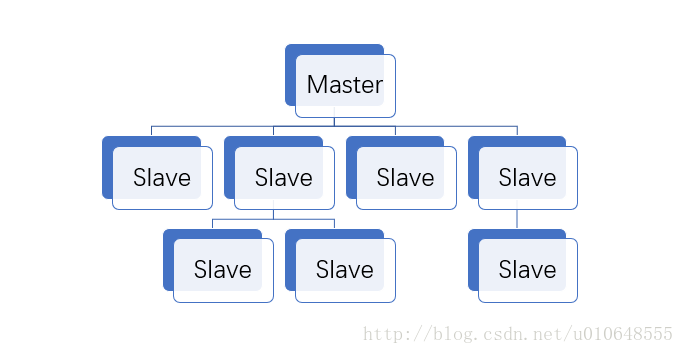


## 主从复制原理

- 从服务器连接主服务器，发送SYNC命令；
- 主服务器接收到SYNC命名后，开始执行`BGSAVE`命令生成`RDB`文件并使用**缓冲区**记录此后执行的所有写命令；
- 主服务器`BGSAVE`执行完后，向所有从服务器**发送快照文件**，并在发送期间继续记录被执行的写命令；
- 从服务器收到快照文件后丢弃所有旧数据，载入收到的快照；
- 主服务器快照发送完毕后开始向从服务器**发送缓冲区中的写命令**；
- 从服务器完成对快照的载入，开始接收命令请求，并执行来自主服务器缓冲区的写命令；（从服务器初始化完成）
- 主服务器每执行一个写命令就会向从服务器发送相同的写命令，从服务器接收并执行收到的写命令（从服务器初始化完成后的操作）
- 一个master可以拥有多个slave，但是一个slave只能对应一个master

## 优点

- 支持主从复制，主机会自动将数据同步到从机，可以进行读写分离
- 为了分载Master的读操作压力，Slave服务器可以为客户端提供只读操作的服务，写服务仍然必须由Master来完成
- Slave同样可以接受其它Slaves的连接和同步请求，这样可以有效的分载Master的同步压力。
- Master Server是以非阻塞的方式为Slaves提供服务。所以在Master-Slave同步期间，客户端仍然可以提交查询或修改请求。
- Slave Server同样是以非阻塞的方式完成数据同步。在同步期间，如果有客户端提交查询请求，Redis则返回同步之前的数据

## 缺点

- Redis不具备自动容错和恢复功能，主机从机的宕机都会导致前端部分读写请求失败，需要等待机器重启或者手动切换前端的IP才能恢复。
- 主机宕机，宕机前有部分数据未能及时同步到从机，切换IP后还会引入数据不一致的问题，降低了系统的可用性。
- Redis较难支持在线扩容，在集群容量达到上限时在线扩容会变得很复杂。


# sentinel

## 作用

 `Sentinel` 是一个管理多个 `Redis` 实例的工具，它可以实现对 `Redis` 的 <font color=#dd0000>监控、通知、自动故障转移和配置中心。 </font>

- **（1）集群监控**：负责监控Redis master和slave进程是否正常工作

- **（2）消息通知**：如果某个Redis实例有故障，Sentinel可以通过API通知系统管理员或其他计算机程序

- **（3）自动故障转移**：如果master node挂掉了，会自动转移到slave node上

  > 如果主服务器未按预期工作，则Sentinel可以启动故障转移过程，在该过程中将副本升级为主服务器，将其他附加副本重新配置为使用新的主服务器，并通知使用Redis服务器的应用程序要使用的新地址。

- **（4）配置中心**：如果故障转移发生了，通知client客户端新的master地址


```shell
$ PING ：# 返回 PONG 。

# 列出所有被监视的主服务器，以及这些主服务器的当前状态。
$ sentinel masters <master name>

# 列出给定主服务器的所有从服务器，以及这些从服务器的当前状态。
$ sentinel slaves <master name>

# 展示指定<master name>的Sentinel节点集合（不包含当前Sentinel节点）
$ sentinel sentinels<master name>

# 返回给定名字的主服务器的 IP 地址和端口号。 如果这个主服务器正在执行故障转移操作， 
# 或者针对这个主服务器的故障转移操作已经完成， 那么这个命令返回新的主服务器的 IP 地址和端口号。
$ sentinel get-master-addr-by-name <master name>

# 重置所有名字和给定模式 pattern 相匹配的主服务器。 pattern 参数是一个 Glob 风格的模式。 
# 重置操作清楚主服务器目前的所有状态， 包括正在执行中的故障转移， 并移除目前已经发现和关联的， 
# 主服务器的所有从服务器和 Sentinel 
$ sentinel reset <pattern>

# 当主服务器失效时， 在不询问其他 Sentinel 意见的情况下， 强制开始一次
# 自动故障迁移 （不过发起故障转移的 Sentinel 会向其他 Sentinel 发送一个新的配置，
# 其他 Sentinel 会根据这个配置进行相应的更新）。
$ sentinel failover <master name>

# 检测当前可达的Sentinel节点总数是否达到<quorum>的个数。
# 例如quorum=3， 而当前可达的Sentinel节点个数为2个，那么将无法进行故障转移，Redis Sentinel的高可用特性也将失去。
$ sentinel ckquorum<master name>

# 将Sentinel节点的配置强制刷到磁盘上，这个命令Sentinel节点自身用得比较多，
# 对于开发和运维人员只有当外部原因（例如磁盘损坏）造成配置文件损坏或者丢失时，这个命令是很有用的。
$ sentinel flushconfig

# 取消当前Sentinel节点对于指定<master name>主节点的监控。
$ sentinel remove<master name>

# 这个命令和配置文件中的含义是完全一样的， 只不过是通过命令的形式来完成Sentinel节点对主节点的监控。
$ sentinel monitor<master name><ip><port><quorum>

$ sentinel set<master name> # 动态修改Sentinel节点配置选项
```


**1.主观下线：**一个哨兵节点判定主节点down掉是主观下线。

**2.客观下线：**只有半数哨兵节点都主观判定主节点down掉，此时多个哨兵节点交换主观判定结果，才会判定主节点客观下线。

**3.原理：**基本上哪个哨兵节点最先判断出这个主节点客观下线，就会在各个哨兵节点中发起投票机制Raft算法（选举算法），最终被投为领导者的哨兵节点完成主从自动化切换的过程。


## 工作方式

- 每个Sentinel（哨兵）进程以每秒钟一次的频率向整个集群中的Master主服务器，Slave从服务器以及其他Sentinel（哨兵）进程发送一个 `PING` 命令。
- 如果一个实例（instance）距离最后一次有效回复 PING 命令的时间超过 `down-after-milliseconds` 选项所指定的值， 则这个实例会被 Sentinel（哨兵）进程标记为主观下线（`SDOWN`）
- 如果一个Master主服务器被标记为主观下线（`SDOWN`），则正在监视这个Master主服务器的所有 `Sentinel`（哨兵）进程要以每秒一次的频率确认`Master`主服务器的确进入了主观下线状态
- 当有足够数量的 Sentinel（哨兵）进程（大于等于配置文件指定的值）在指定的时间范围内确认Master主服务器进入了主观下线状态（`SDOWN`）， 则Master主服务器会被标记为客观下线（`ODOWN`）
- 在一般情况下， 每个 Sentinel（哨兵）进程会以每 10 秒一次的频率向集群中的所有Master主服务器、Slave从服务器发送 INFO 命令。
- 当Master主服务器被 Sentinel（哨兵）进程标记为客观下线（ODOWN）时，Sentinel（哨兵）进程向下线的 Master主服务器的所有 Slave从服务器发送 INFO 命令的频率会从 10 秒一次改为每秒一次。
- 若没有足够数量的 Sentinel（哨兵）进程同意 Master主服务器下线， Master主服务器的客观下线状态就会被移除。若 Master主服务器重新向 Sentinel（哨兵）进程发送 PING 命令返回有效回复，Master主服务器的主观下线状态就会被移除。

优点：

- 哨兵模式是基于主从模式的，所有主从的优点，哨兵模式都具有。
- 主从可以自动切换，系统更健壮，可用性更高。

缺点：

- Redis较难支持在线扩容，在集群容量达到上限时在线扩容会变得很复杂。


## 哨兵集群的自动发现机制

哨兵互相之间的发现，是通过 redis 的 `pub/sub` 系统实现的，每个哨兵都会往 `__sentinel__:hello` 这个 channel 里发送一个消息，这时候所有其他哨兵都可以消费到这个消息，并感知到其他的哨兵的存在。

每隔两秒钟，每个哨兵都会往自己监控的某个 master+slaves 对应的 `__sentinel__:hello` channel 里**发送一个消息**，内容是自己的 host、ip 和 runid 还有对这个 master 的监控配置。

每个哨兵也会去**监听**自己监控的每个 master+slaves 对应的 `__sentinel__:hello` channel，然后去感知到同样在监听这个 master+slaves 的其他哨兵的存在。

每个哨兵还会跟其他哨兵交换对 `master` 的监控配置，互相进行监控配置的同步。


## quorum 和 majority

每次一个哨兵要做主备切换，首先需要 quorum 数量的哨兵认为 odown，然后选举出一个哨兵来做切换，这个哨兵还需要得到 majority 哨兵的授权，才能正式执行切换。

如果 quorum < majority，比如 5 个哨兵，majority 就是 3，quorum 设置为 2，那么就 3 个哨兵授权就可以执行切换。

但是如果 quorum >= majority，那么必须 quorum 数量的哨兵都授权，比如 5 个哨兵，quorum 是 5，那么必须 5 个哨兵都同意授权，才能执行切换。


## 配置

```properties
port 26379
daemonize yes
bind 0.0.0.0
protected-mode no
pidfile /var/run/sentinel-26379.pid
logfile "/data/redis/sentinel-26379.log"
dir /data/redis
sentinel monitor mymaster 192.168.199.171 7001 2
sentinel down-after-milliseconds mymaster 30000
sentinel parallel-syncs mymaster 1
sentinel failover-timeoutmymaster 180000
```

`down-after-milliseconds`
	定了Sentinel认为被监控的Redis服务已经断线的总毫秒数。如果在指定的毫秒数之内，被监控的Redis服务没有向Sentinel回复PING信息或者回复了Error信息，那么Sentinel会开始认为被监控的Redis服务下线（其实这里是主观下线（subjectively down，简称SDOWN）。

`parallel-syncs`
	指定了在执行故障转移时，最多可以有多少Slave实例同时对新的Master实例进行同步，这个数字越小，完成故障转移所需的时间就越长。这里建议参考样板配置中的值，设置为1。

`failover-timeout`
	故障转移超时时间，单位为毫秒。


# cluster

Redis 集群是一个提供在**多个Redis间节点间共享数据**的程序集。

Redis 集群通过分区来提供**一定程度的可用性**,在实际环境中当某个节点宕机或者不可达的情况下继续处理命令. Redis 集群的优势:

- 自动分割数据到不同的节点上。
- 整个集群的部分节点失败或者不可达的情况下能够继续处理命令。


##  Redis集群的数据分片

Redis 集群有16384个哈希槽,每个key通过CRC16校验后对16384取模来决定放置哪个槽.集群的每个节点负责一部分hash槽,举个例子,比如当前集群有3个节点,那么:

- 节点 A 包含 0 到 5500号哈希槽.
- 节点 B 包含5501 到 11000 号哈希槽.
- 节点 C 包含11001 到 16384号哈希槽.

> 这种结构很容易添加或者删除节点. 比如如果我想新添加个节点D, 我需要从节点 A, B, C中得部分槽到D上. 如果我想移除节点A,需要将A中的槽移到B和C节点上,然后将没有任何槽的A节点从集群中移除即可. 由于从一个节点将哈希槽移动到另一个节点并不会停止服务,所以无论添加删除或者改变某个节点的哈希槽的数量都不会造成集群不可用的状态.


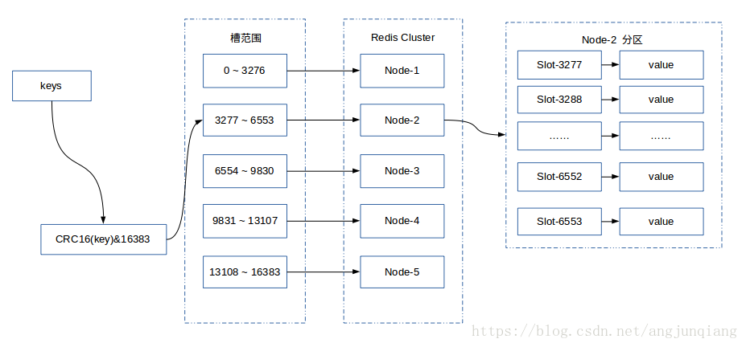


## Redis集群的主从复制模型

为了使在部分节点失败或者大部分节点无法通信的情况下集群仍然可用，所以集群使用了主从复制模型,每个节点都会有N-1个复制品.

在我们例子中具有A，B，C三个节点的集群,在没有复制模型的情况下,如果节点B失败了，那么整个集群就会以为缺少5501-11000这个范围的槽而不可用.

然而如果在集群创建的时候（或者过一段时间）我们为每个节点添加一个从节点A1，B1，C1,那么整个集群便有三个master节点和三个slave节点组成，这样在节点B失败后，集群便会选举B1为新的主节点继续服务，整个集群便不会因为槽找不到而不可用了

不过当B和B1 都失败后，集群是不可用的.


## Redis一致性保证

Redis 并不能保证数据的**强一致性**. 这意味这在实际中集群在特定的条件下可能会丢失写操作.

第一个原因是因为集群使用**异步复制**. 写操作过程:

- 客户端向主节点B写入一条命令.
- 主节点B向客户端回复命令状态.
- 主节点将写操作复制给他得从节点 B1, B2 和 B3.

主节点对命令的复制工作发生在返回命令回复之后， 因为如果每次处理命令请求都需要等待复制操作完成的话， 那么主节点处理命令请求的速度将极大地降低 —— 我们必须在性能和一致性之间做出权衡。 注意：Redis 集群可能会在将来提供同步写的方法。 Redis 集群另外一种可能会丢失命令的情况是集群出现了网络分区， 并且一个客户端与至少包括一个主节点在内的少数实例被孤立。

举个例子 假设集群包含 A 、 B 、 C 、 A1 、 B1 、 C1 六个节点， 其中 A 、B 、C 为主节点， A1 、B1 、C1 为A，B，C的从节点， 还有一个客户端 Z1 假设集群中发生网络分区，那么集群可能会分为两方，大部分的一方包含节点 A 、C 、A1 、B1 和 C1 ，小部分的一方则包含节点 B 和客户端 Z1 .

Z1仍然能够向主节点B中写入, 如果网络分区发生时间较短,那么集群将会继续正常运作,如果分区的时间足够让大部分的一方将B1选举为新的master，那么Z1写入B中得数据便丢失了.

注意， 在网络分裂出现期间， 客户端 Z1 可以向主节点 B 发送写命令的最大时间是有限制的， 这一时间限制称为**节点超时时间（node timeout）**， 是 Redis 集群的一个重要的配置选项：


## Redis集群搭建

详见**`hadoop`集群环境搭建**


## 集群重新分片

 重新分片并不会对正在运行的集群程序产生任何影响 。 重新分片操作基本上就是将某些节点上的哈希槽移动到另外一些节点上面 


```shell
$ /opt/redis-5.0.4/src/redis-cli --cluster reshard 172.16.0.202:7003

>>> Performing Cluster Check (using node 172.16.0.202:7003)
M: c2dd9d90c50a332d1f54a6711a950b9df99ce114 172.16.0.202:7003
   slots:[11423-16383] (4961 slots) master
M: 7e08c6d5061b40e6c5b42b53fcc2c429b7d6a5de 172.16.0.201:7002
   slots:[0-499],[5461-11422] (6462 slots) master
M: 2f0c36bbe4dd57d4c005017b632ca94f2ef05562 172.16.0.200:7001
   slots:[500-5460] (4961 slots) master
[OK] All nodes agree about slots configuration.
>>> Check for open slots...
>>> Check slots coverage...
[OK] All 16384 slots covered.
How many slots do you want to move (from 1 to 16384)? 1000

all
```


```shell
$ 172.16.0.200:7001> cluster slots
1) 1) (integer) 0
   2) (integer) 499
   3) 1) "172.16.0.201"
      2) (integer) 7002
      3) "7e08c6d5061b40e6c5b42b53fcc2c429b7d6a5de"
2) 1) (integer) 5461
   2) (integer) 11422
   3) 1) "172.16.0.201"
      2) (integer) 7002
      3) "7e08c6d5061b40e6c5b42b53fcc2c429b7d6a5de"
3) 1) (integer) 500
   2) (integer) 5460
   3) 1) "172.16.0.200"
      2) (integer) 7001
      3) "2f0c36bbe4dd57d4c005017b632ca94f2ef05562"
4) 1) (integer) 11423
   2) (integer) 16383
   3) 1) "172.16.0.202"
      2) (integer) 7003
      3) "c2dd9d90c50a332d1f54a6711a950b9df99ce114"
```


## 测试故障转移

 要触发一次故障转移， 最简单的办法就是令集群中的某个主节点进入下线状态。 

```shell
172.16.0.200:7001> cluster nodes

7e08c6d5061b40e6c5b42b53fcc2c429b7d6a5de 172.16.0.201:7002@17002 master - 0 1571786666162 4 connected 0-499 5461-11422
2f0c36bbe4dd57d4c005017b632ca94f2ef05562 172.16.0.200:7001@17001 myself,master - 0 1571786662000 1 connected 500-5460
c2dd9d90c50a332d1f54a6711a950b9df99ce114 172.16.0.202:7003@17003 master - 0 1571786666000 3 connected 11423-16383
```


 后我们可以通过向端口号为7002 的主节点发送 **DEBUG SEGFAULT** 命令， 让这个主节点崩溃： 

```shell
$ redis-cli -p 7002 debug segfault
Error: Server closed the connection
```


 从 consistency-test 的这段输出可以看到， 集群在执行故障转移期间， 总共丢失了 578 个读命令和 577 个写命令， 但是并没有产生任何数据不一致。

这听上去可能有点奇怪， 因为在教程的开头我们提到过， Redis 使用的是异步复制， 在执行故障转移期间， 集群可能会丢失写命令。但是在实际上， 丢失命令的情况并不常见， 因为 Redis **几乎是同时**执行将命令回复发送给客户端， 以及将命令复制给从节点这两个操作， 所以实际上造成命令丢失的时间窗口是非常小的。不过， 尽管出现的几率不高， 但丢失命令的情况还是有可能会出现的， 所以我们对 <font color=#dd0000>Redis 集群不能提供强一致性</font>的这一描述仍然是正确的。现在， 让我们使用 cluster nodes 命令,查看集群在执行故障转移操作之后， 主从节点的布局情况： 


## 手动故障转移

>  有的时候在主节点没有任何问题的情况下强制手动故障转移也是很有必要的，比如想要升级主节点的Redis进程，我们可以通过故障转移将其转为slave再进行升级操作来避免对集群的可用性造成很大的影响。 


Redis集群使用 `CLUSTER FAILOVER`命令来进行故障转移，不过要**在被转移的主节点的从节点上执行该命令** 手动故障转移比主节点失败自动故障转移更加**安全**，因为手动故障转移时客户端的切换是在确保新的主节点完全复制了失败的旧的主节点数据的前提下下发生的，所以避免了数据的丢失。

执行手动故障转移时从节点日志如下:

```shell
$ redis-cli -p 7002 cluster failover

# Manual failover user request accepted.
# Received replication offset for paused master manual failover: 347540
# All master replication stream processed, manual failover can start.
# Start of election delayed for 0 milliseconds (rank #0, offset 347540).
# Starting a failover election for epoch 7545.
# Failover election won: I'm the new master.
```

 其基本过程如下：客户端不再链接我们淘汰的主节点，同时主节点向从节点发送复制偏移量,从节点得到复制偏移量后故障转移开始,接着通知主节点进行配置切换,当客户端在旧的master上解锁后重新连接到新的主节点上。 


## 添加一个新节点

添加新的节点的基本过程就是添加一个空的节点然后移动一些数据给它。

有两种情况：添加一个主节点和添加一个从节点（添加从节点时需要将这个新的节点设置为集群中某个节点的复制） 


 两种情况第一步都是要添加 一个空的节点。（新建节点，开启redis服务，比如：7006）


### 添加主节点


```shell
# 第一个参数是新节点的地址，第二个参数是任意一个已经存在的节点的IP和端口
$ /opt/redis-5.0.4/src/redis-cli  --cluster add-node 127.0.0.1:7006 127.0.0.1:7000

$ redis 127.0.0.1:7006> cluster nodes
```


新节点现在已经连接上了集群， 成为集群的一份子， 并且可以对客户端的命令请求进行转向了， 但是和其他主节点相比， 新节点还有两点区别：

- 新节点没有包含任何数据， 因为它没有包含任何哈希槽.
- 尽管新节点没有包含任何哈希槽， 但它仍然是一个主节点， 所以在集群需要将某个从节点升级为新的主节点时， 这个新节点不会被选中。

接下来， 只要使用 redis-trib 程序， 将集群中的某些哈希桶移动到新节点里面， 新节点就会成为真正的主节点了。


### 添加从节点

 有两种方法添加从节点，可以像添加主节点一样使用redis-cli命令，也可以像下面的例子一样使用 –slave选项: 

```shell
$ /opt/redis-5.0.4/src/redis-cli  --cluster add-node --slave 127.0.0.1:7006 127.0.0.1:7000
```

此处的命令和添加一个主节点命令类似，此处并没有指定添加的这个从节点的主节点，这种情况下系统会在其他的复制集中的主节点中随机选取一个作为这个从节点的主节点。


你可以通过下面的命令指定主节点:

```shell
$ /opt/redis-5.0.4/src/redis-cli  --cluster add-node --slave --master-id 3c3a0c74aae0b56170ccb03a76b60cfe7dc1912e 127.0.0.1:7006 127.0.0.1:7000
```


 也可以使用`cluster replicate`命令添加 。（ 这个命令也可以改变一个从节点的主节点。 ）

 例如，要给主节点 127.0.0.1:7005添加一个从节点，该节点哈希槽的范围1423-16383, 节点 ID 3c3a0c74aae0b56170ccb03a76b60cfe7dc1912e,我们需要链接新的节点（已经是空的主节点）并执行命令: 

```shell
$ redis 127.0.0.1:7006> cluster replicate 3c3a0c74aae0b56170ccb03a76b60cfe7dc1912e
```


## 移除一个节点

```shell
# 第一个参数是任意一个节点的地址,第二个节点是你想要移除的节点地址。
$ /opt/redis-5.0.4/src/redis-cli  del-node 127.0.0.1:7000 `<node-id>`
```


 主从节点都用这种方式移除。但是移除主节点前，需要**确保这个主节点是空的**. 如果不是空的,需要将这个节点的数据重新分片到其他主节点上. 


## 从节点的迁移

 在Redis集群中会存在改变一个从节点的主节点的情况，需要执行如下命令 : 

```shell
$ redis 127.0.0.1:7006> CLUSTER REPLICATE <master-node-id>
```


简短的概况一下从节点迁移

- 集群会在有从节点数量最多的主节点上进行从节点的迁移.
- 要在一个主节点上添加多个从节点.
- 参数来控制从节点迁移 replica-migration-barrier:你可以仔细阅读redis.conf 。


## 主节点修复

当redis集群中一台master节点down机后（无slave情况下），再次启动连接现有集群会出现问题，需要修复slot


```shell
$ /opt/redis-5.0.4/src/redis-cli  --cluster fix 172.16.0.200:7001
```


# redis 4种模式

## 单点(Standalone)

最简单的方式，同时也是风险最高的方式，相比其他几种方式做不到HA、Failover、，也不能读写分离，也不能对应高吞吐量。

## 主从复制(Master Slave)

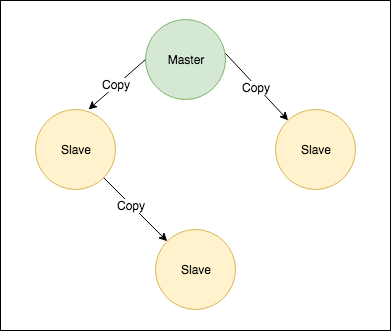

主从模式同样不具备HA、Failover、等，但可用于读写分离的场景，备份数据、负载均衡。写操作走Master节点，读操作走Slave节点，能在一定程度提高读写的吞吐量。

```shell
vim redis.conf
# 以守护进程的方式运行
daemonize yes
port 6379
# 绑定的主机地址
bind 0.0.0.0
# 指定当本机为slave服务时，设置master服务的IP地址及端口，在redis启动的时候他会自动跟master进行数据同步
slaveof <masterip> <masterport>
# 当master设置了密码保护时，slave服务连接master的密码
masterauth <master-password>
# 设置redis连接密码，如果配置了连接密码，客户端在连接redis是需要通过AUTH<password>命令提供密码，默认关闭
requirepass footbared
```


## 哨兵模式(Sentinel)

- 哨兵模式集成了主从模式的有点，同时有了哨兵监控节点还<font color=#dd0000>能保证HA</font>，当 `Master` 节点离线后，哨兵监控节点会把 `Slave` 节点切换为 `Master` 节点，保证服务可用
- 哨兵模式是在主从模式的基础上增加了哨兵监控节点，最简单的哨兵模式需要一个 `Master`、一个 `Slave` 、三个哨兵监控节点。

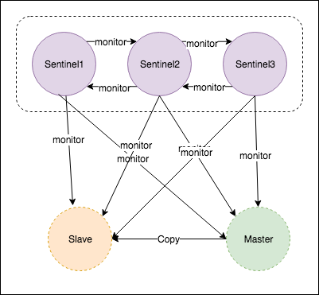


```shell
vim sentinel-26379.conf
pidfile /home/xxx/Documents/company/redis-sentinel/26379/redis-sentinel.pid
logfile /home/xxx/Documents/company/redis-sentinel/26379/redis-sentinel.log
bind 0.0.0.0
port 26379
# 哨兵 sentinel 监控的 redis 主节点的 
# sentinel monitor <master-name> <ip> <redis-port> <quorum>
# 这个2代表，当集群中有2个sentinel认为master死了时，才能真正认为该master已经不可用了。
sentinel monitor mymaster 10.201.12.66 6380 2
# 当在Redis实例中开启了requirepass <foobared>，所有连接Redis实例的客户端都要提供密码。
sentinel auth-pass mymaster test@123456
# 指定主节点应答哨兵sentinel的最大时间间隔，超过这个时间，哨兵主观上认为主节点下线，默认30秒 
# Default is 30 seconds.
sentinel down-after-milliseconds mymaster 30000
# 指定了在发生failover主备切换时，最多可以有多少个slave同时对新的master进行同步。这个数字越小，完成failover所需的时间就越长；反之，但是如果这个数字越大，就意味着越多的slave因为replication而不可用。可以通过将这个值设为1，来保证每次只有一个slave，处于不能处理命令请求的状态。
# sentinel parallel-syncs <master-name> <numslaves>
sentinel parallel-syncs mymaster 1
# 故障转移的超时时间failover-timeout，默认三分钟，可以用在以下这些方面：
## 1. 同一个sentinel对同一个master两次failover之间的间隔时间。  
## 2. 当一个slave从一个错误的master那里同步数据时开始，直到slave被纠正为从正确的master那里同步数据时结束。  
## 3. 当想要取消一个正在进行的failover时所需要的时间。
## 4.当进行failover时，配置所有slaves指向新的master所需的最大时间。不过，即使过了这个超时，slaves依然会被正确配置为指向master，但是就不按parallel-syncs所配置的规则来同步数据了
# sentinel failover-timeout <master-name> <milliseconds>  
sentinel failover-timeout mymaster 180000
```


- 优点：实现了数据备份，读负载均衡，自动化故障恢复，高可用。
- 缺点：没有伸缩性，数据存储的限制受到单机内存大小的限制，没发通过增加主机来增加存储空间。


## Cluster Mode

cluster是为了解决单机Redis容量有限的问题，将数据按一定的规则分配到多台机器。


集群模式有多种实现方法，比如：

- 客户端分区方案
- 代理分区方案
- Twemproxy
- Codis
- 查询路由方案


```shell
vim redis-01.conf
# 更改以下配置
bind 0.0.0.0
port 16001
daemonize yes
cluster-enabled yes
cluster-config-file  nodes-16001.conf
cluster-node-timeout 15000
appendonly yes
logfile /home/aozhang/Documents/company/redis-cluster/16001/redis-server-01.log

# 类似的配置配置其他两个节点，更改对应的 port、logfile、cluster-config-file
```


## 总结

1.主从复制
缺点
不能自动故障恢复

2.哨兵机制
优点
解决自动故障恢复的问题。

缺点
不能解决负载均衡的问题。

3.cluster
优点
解决负载均衡的问题。具体解决方案是分片/虚拟槽slot。


# redis-api

- jedis
- redisson
- lecotter


Jedis是Redis的Java实现的客户端，其API提供了比较全面的Redis命令的支持。Redission也是Redis的客户端，相比于Jedis功能简单。Jedis简单使用阻塞的I/O和redis交互，Redission通过Netty支持非阻塞I/O。Jedis最新版本2.9.0是2016年的快3年了没有更新，而Redission最新版本是2018.10月更新。

Redission封装了锁的实现，其继承了java.util.concurrent.locks.Lock的接口，让我们像操作我们的本地Lock一样去操作Redission的Lock


# 发布订阅

Redis 发布订阅(pub/sub)是一种消息通信模式：发送者(pub)发送消息，订阅者(sub)接收消息。

Redis 客户端可以订阅任意数量的频道。

下图展示了频道 channel1 ， 以及订阅这个频道的三个客户端 —— client2 、 client5 和 client1 之间的关系：


 当有新消息通过 PUBLISH 命令发送给频道 channel1 时， 这个消息就会被发送给订阅它的三个客户端： 


## 发布订阅命令

| 命令                                          | 描述                             |
| --------------------------------------------- | -------------------------------- |
| PSUBSCRIBE pattern [pattern......]            | 订阅一个或多个符合给定模式的频道 |
| PUBSUB subcommand [argument [argument ...\]]] | 查看订阅与发布系统状态           |
| PUBLISH channel message                       | 将信息发送到指定的频道           |
| PUNSUBSCRIBE [pattern [pattern ...\]]         | 退订所有给定模式的频道           |
| [SUBSCRIBE channel [channel ...]              | 订阅给定的一个或多个频道的信息   |
| UNSUBSCRIBE [channel [channel ...\]]          | 指退订给定的频道。               |


## 通过频道和模式接收同一条信息

如果客户端订阅的多个模式匹配了同一个频道， 或者客户端同时订阅了某个频道、以及匹配这个频道的某个模式， 那么它可能会多次接收到同一条信息。

举个例子， 如果客户端执行了以下命令：

```shell
> SUBSCRIBE foo
> PSUBSCRIBE f*
```

那么当有信息发送到频道 `foo` 时， 客户端将收到两条信息： 一条来自频道 `foo` ，信息类型为 `message` ； 另一条来自模式 `f*` ，信息类型为 `pmessage` 。


# redis内存淘汰策略

```shell
# 设置maxmemory为0代表没有内存限制。对于64位的系统这是个默认值，对于32位的系统默认内存限制为3GB。
maxmemory 100mb
```

 当指定的内存限制大小达到时，需要选择不同的行为，也就是**策略**。 Redis可以仅仅对命令返回错误，这将使得内存被使用得更多，或者回收一些旧的数据来使得添加数据时可以避免内存限制。 


## 删除过期键对象

由于Redis进程内保存了大量的键，维护每个键的过期时间去删除键会消耗大量的CPU资源，对于单线程的Redis来说成本很高。所以Redis采用**惰性删除 + 定时任务删除**机制来实现过期键的内存回收。

**惰性删除**：当客户端读取键时，如果键带有过期时间并且已经过期，那么会执行删除操作并且查询命令返回空。这种机制是为了节约CPU成本，不需要单独维护一个TTL链表来处理过期的键。但是这种删除机制会导致内存不能及时得到释放，所以将结合下面的定时任务删除机制一起使用。

**定时任务删除**：Redis内部维护一个定时任务，用于随机获取一些带有过期属性的键，并将其中过期的键删除。来删除一些过期的冷数据。

在兼顾CPU和内存的的考虑下，Redis使用惰性删除 + 定时任务删除机制相结合，来删除过期键对象。


## 回收策略

LRU（ Least Recently Used ）

当`maxmemory`限制达到的时候Redis会使用的行为由 Redis的`maxmemory-policy`配置指令来进行配置。

以下的策略是可用的:

```shell
# volatile-lru 
#	->  Evict using approximated LRU among the keys with an expire set. 
#		尝试回收最少使用的键（LRU），但仅限于在过期集合的键

# allkeys-lru 
#	->  Evict any key using approximated LRU. 
#		尝试回收最少使用的键

# volatile-lfu 
#	->  Evict using approximated LFU among the keys with an expire set.
#		从已设置过期时间的数据集挑选使用频率最低的数据淘汰

# allkeys-lfu 
#	->  Evict any key using approximated LFU.
#		从数据集中挑选使用频率最低的数据淘汰

# volatile-random 
#	->  Remove a random key among the ones with an expire set.
#		回收随机的键，但仅限于在过期集合的键

# allkeys-random 
#	->  Remove a random key, any key.
#		回收随机的键

# volatile-ttl 
#	->  Remove the key with the nearest expire time (minor TTL)
#		回收在过期集合的键，并且优先回收存活时间（TTL）较短的键

# noeviction 
#	->  Don't evict anything, just return an error on write operations.
#		返回错误, 默认策略


# LRU means Least Recently Used, 最近最少使用
# LFU means Least Frequently Used, 最不经常使用的
# random
# ttl
#
# Both LRU, LFU and volatile-ttl are implemented using approximated randomized algorithms. LRU、LFU和volatile-ttl都是使用近似随机算法实现的。


# The default is:
#
# maxmemory-policy noeviction


# LRU, LFU and minimal TTL algorithms are not precise algorithms but approximated
# algorithms (in order to save memory), so you can tune it for speed or
# accuracy. For default Redis will check five keys and pick the one that was
# used less recently, you can change the sample size using the following
# configuration directive.
# 默认情况下，Redis会检查五个键并选择其中一个最近使用较少，您可以使用以下方法更改样本大小
#
# The default of 5 produces good enough results. 10 Approximates very closely
# true LRU but costs more CPU. 3 is faster but not very accurate.
#
# maxmemory-samples 5


# Starting from Redis 5, by default a replica will ignore its maxmemory setting
# (unless it is promoted to master after a failover or manually). It means
# that the eviction of keys will be just handled by the master, sending the
# DEL commands to the replica as keys evict in the master side.
#
# This behavior ensures that masters and replicas stay consistent, and is usually
# what you want, however if your replica is writable, or you want the replica to have
# a different memory setting, and you are sure all the writes performed to the
# replica are idempotent, then you may change this default (but be sure to understand
# what you are doing).
#
# Note that since the replica by default does not evict, it may end using more
# memory than the one set via maxmemory (there are certain buffers that may
# be larger on the replica, or data structures may sometimes take more memory and so
# forth). So make sure you monitor your replicas and make sure they have enough
# memory to never hit a real out-of-memory condition before the master hits
# the configured maxmemory setting.
#
# replica-ignore-maxmemory yes
```


一般的经验规则:

- 使用**allkeys-lru**策略：如果我们的应用对缓存的访问符合幂律分布(也就是<font color=#dd0000>存在相对热点数据</font>),或者我们<font color=#dd0000>不太清楚我们应用的缓存访问分布状况</font>,我们可以选择allkeys-lru策略
- 使用**allkeys-random**：如果你是循环访问，所有的键被连续的扫描，或者你希望请求分布正常（所有元素被访问的概率都差不多）。
- 使用**volatile-ttl**：如果你想要通过创建缓存对象时设置TTL值，来决定哪些对象应该被过期。

**allkeys-lru** 和 **volatile-random**策略对于当你想要单一的实例实现缓存及持久化一些键时很有用。不过一般运行两个实例是解决这个问题的更好方法。

为键设置过期时间也是需要消耗内存的，所以使用**allkeys-lru**这种策略更加高效，因为没有必要为键取设置过期时间当内存有压力时。


## **回收进程如何工作**

理解回收进程如何工作是非常重要的:

- 一个客户端运行了新的命令，添加了新的数据。
- Redi检查内存使用情况，如果大于maxmemory的限制, 则根据设定好的策略进行回收。
- 一个新的命令被执行，等等。
- 所以我们不断地穿越内存限制的边界，通过不断达到边界然后不断地回收回到边界以下。

如果一个命令的结果导致大量内存被使用（例如很大的集合的交集保存到一个新的键），不用多久内存限制就会被这个内存使用量超越。


## 近似LRU算法

Redis的LRU算法并非完整的实现。这意味着Redis并没办法选择最佳候选来进行回收，也就是最久未被访问的键。相反它会尝试运行一个近似LRU的算法，通过对少量keys进行取样，然后回收其中一个最好的key（被访问时间较早的）。

不过从Redis 3.0算法已经改进为回收键的候选池子。这改善了算法的性能，使得更加近似真是的LRU算法的行为。

Redis LRU有个很重要的点，你通过调整每次回收时检查的采样数量，以实现**调整算法的精度**。这个参数可以通过以下的配置指令调整:

```
maxmemory-samples 5
```


## 近似LFU算法

LFU算法是Redis4.0里面新加的一种淘汰策略。它的全称是Least Frequently Used，它的核心思想是根据key的最近被访问的频率进行淘汰，很少被访问的优先被淘汰，被访问的多的则被留下来。

LFU算法能更好的表示一个key被访问的热度。假如你使用的是LRU算法，一个key很久没有被访问到，只刚刚是偶尔被访问了一次，那么它就被认为是热点数据，不会被淘汰，而有些key将来是很有可能被访问到的则被淘汰了。如果使用LFU算法则不会出现这种情况，因为使用一次并不会使一个key成为热点数据。


# redis相关问题


## 热点key

### 热点key产生原因

1. 用户消费的数据远大于生产的数据（热卖商品、热点新闻、热点评论、明星直播）。 

2. 请求分片集中，超过单 Server 的性能极限。 


### 热点key发现

- 通过客户端（eg：Jedis）编码时进行统计

- 通过代理统计

   像Twemproxy、Codis这些基于代理的Redis分布式架构，所有客户端的请求都是通过代理端完成的 

  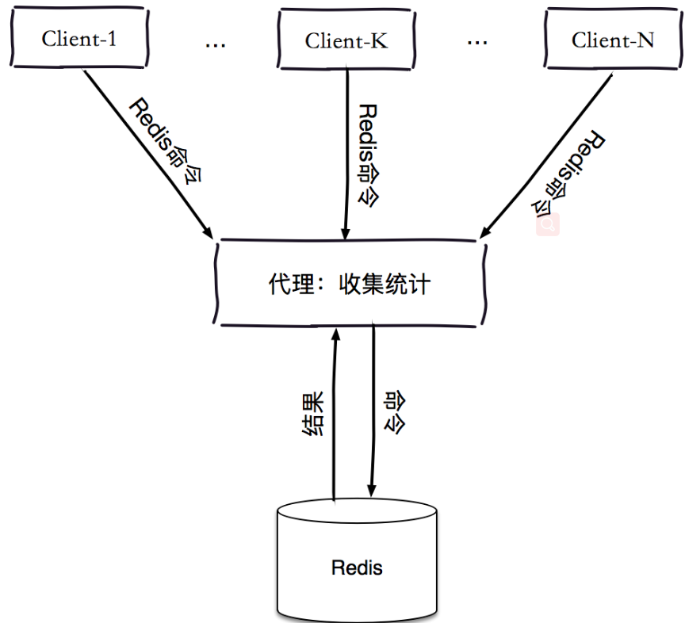

- redis服务端monitor统计


### 热点key的处理

- 本地缓存

   对于数据一致性不是那么高的业务，可以将热点key缓存到业务机器的本地缓存中 。

-  迁移热点key 

   以redis cluster为例，我们可以将热点key所在的slot单独迁移到一个新的redis分片。这样这个热点key即使qps很高，也不会影响到整个集群的其他业务。 


## 大key大value

### 问题

由于Redis主线程为单线程模型，大key也会带来一些问题，如：

​	1、集群模式在slot分片均匀情况下，会出现数据和查询倾斜情况，部分有大key的Redis节点占用内存多，QPS高。

​	2、大key相关的删除或者自动过期时，会出现qps突降或者突升的情况，极端情况下，会造成主从复制异常，Redis服务阻塞无法响应请求。


### 发现

#### Redis 4.0之前

Redis 4.0之前的大key的发现与删除方法

- `redis-rdb-tools`工具。`redis`实例上执行`bgsave`，然后对`dump`出来的`rdb`文件进行分析，找到其中的大KEY。

- `redis-cli --bigkeys`命令。可以找到某个实例5种数据类型(`String、hash、list、set、zset`)的最大key。

  > 原理比较简单,使用scan命令去遍历所有的键，对每个键根据其类型执行"STRLEN","LLEN","SCARD","HLEN","ZCARD"这些命令获取其长度或者元素个数。

- 自定义的扫描脚本，以Python脚本居多，方法与`redis-cli --bigkeys`类似。

- `debug object key`命令。可以查看某个key序列化后的长度，每次只能查找单个key的信息。官方不推荐。

#### Redis 4.0之后 

Redis 4.0引入了 `memory usage` 命令和 `lazyfree` 机制，不管是对大key的发现，还是解决大key删除或者过期造成的阻塞问题都有明显的提升。 


##### memory usage

- 源码 object.c1299⾏

memory usage默认抽样5个field来循环累加计算整个key的内存大小，样本的数量决定了key的内存大小的准确性和计算成本，样本越大，循环次数越多，计算结果更精确，性能消耗也越多。 


##### lazyfree

-  源码bio.h38⾏ 

Lazyfree的原理是在删除的时候只进行逻辑删除，把key释放操作放在bio(Background I/O)单独的子线程处理中，减少删除大key对redis主线程的阻塞，有效地避免因删除大key带来的性能问题。

在此提一下bio线程，很多人把Redis通常理解为单线程内存数据库, 其实不然。Redis将最主要的网络收发和执行命令等操作都放在了主工作线程，然而除此之外还有几个bio后台线程，从源码中可以看到有处理关闭文件和刷盘的后台线程，以及Redis4.0新增加的lazyfree线程。

unlink命令


### 解决办法

**1：单个key存储的value很大** 

i： 该对象需要每次都整存整取 

可以尝试将对象分拆成几个key-value， 使用`multi get`获取值，这样分拆的意义在于分拆单次操作的压力，将操作压力平摊到多个redis实例中，降低对单个redis的IO影响；    

ii： 该对象每次只需要存取部分数据

可以像第一种做法一样，拆分成几个key-value，  也可以将这个存储在一个hash中，每个field代表一个具体的属性，

使用`hget,hmget`来获取部分的value，使用`hset，hmset`来更新部分属性   


**2：value中存储过多的元素**

类似于场景一种的第一个做法，可以将这些元素分拆。 

以hash为例，原先的正常存取流程是  `hget(hashKey, field) ; hset(hashKey, field, value)`

现在，固定一个桶的数量，比如 10000， 每次存取的时候，先在本地计算field的hash值，模除 10000， 确定了该field落在哪个key上。

newHashKey  =  hashKey + ( set, zset, list 也可以类似上述做法但有些不适合的场景，比如，要保证 lpop 的数据的确是最早push到list中去的，这个就需要一些附加的属性，或者是在 key的拼接上做一些工作（比如list按照时间来分拆）。


**3：一个集群存储了上亿的key**  

如果key的个数过多会带来更多的内存空间占用， 

​      i：key本身的占用（每个key 都会有一个Category前缀）

​      ii：集群模式中，服务端需要建立一些`slot-to-key`的映射关系，这其中的指针占用在key多的情况下也是浪费巨大空间

​      这两个方面在key个数上亿的时候消耗内存十分明显（Redis 3.2及以下版本均存在这个问题，4.0有优化）；

所以减少key的个数可以减少内存消耗，可以参考的方案是<font color=#dd0000>转Hash结构存储</font>，即原先是直接使用`String` 的结构存储，现在将多个key存储在一个Hash结构中


## redis实现分布式锁

[https://juejin.im/post/5bbb0d8df265da0abd3533a5](https://juejin.im/post/5bbb0d8df265da0abd3533a5)

在多线程操作中，对于共享数据的访问修改，可以通过java提供的线程同步手段（synchorized，lock等）实现。但是在分布式环境中，访问共享数据的进程运行在不同的jvm上，所以只能通过分布式锁来保证共享数据访问的一致性。


###  分布式锁的几种实现方案 

- 基于数据库实现分布式锁
- 基于redis实现分布式锁
- 基于zookeeper实现分布式锁 


### 分布式锁实现需求/注意事项

- 互斥性。 可以保证在分布式部署的应用集群中， 在任意时刻， 同一个方法在同一时间只能被一台机器上的一个线程执行 -> **setnx保证**

- 不会发送死锁。即使一个客户端持有锁的期间崩溃而没有主动释放锁，也需要保证后续其他客户端能够加锁成功。-> **set时设置锁的过期时间（注意需要和set保证原子操作）**

  ```shell
  # redis2.8之后redis支持nx和ex操作是同一原子操作
  $ set key value ex/px 5 nx
  ```

- 加锁和解锁必须是同一个客户端，客户端自己不能把别人加的锁给释放了。 -> **set的值包含当前客户端的唯一标识（用UUID生成）**

  ```shell
  # 解锁操作需要比较唯一标识是否相等，相等再执行删除操作。这2个操作可以采用Lua脚本方式使2个命令的原子性。
  
  if redis.call("get",KEYS[1]) == ARGV[1] then
      return redis.call("del",KEYS[1])
  else
      return 0
  end
  ```

- 容错性。只要大部分的Redis节点正常运行，客户端就可以进行加锁和解锁操作。 -> 类比Redisson的RedLock思想，同时给集群中的多个master上锁，只有多数上锁成功，才返回上锁成功。

  

### 单机

单机版的redis想要实现分布式锁，需要注意上述分布式锁实现需求/注意事项的前三点。


### 集群

集群版的redis想要实现分布式锁，需要注意上述分布式锁实现需求/注意事项的四点。其中最主要的就是第四点：容错性。


 我们考虑如下场景: 

```properties
1.客户端1从Master获取了锁。

2.Master宕机了，存储锁的key还没有来得及同步到Slave上。

3.Slave升级为Master。

4.客户端2从新的Master获取到了对应同一个资源的锁。

5.客户端1和客户端2同时持有了同一个资源的锁，锁不再具有安全性。
```


 就此问题，Redis作者antirez写了RedLock算法来解决这种问题。 


#### RedLock锁的操作


**RedLock获取锁：**

- 获取当前时间。
- 按顺序依次向N个Redis节点执行获取锁的操作。这个获取操作跟前面基于单Redis节点的获取锁的过程相同，包含随机字符串my_random_value，也包含过期时间(比如PX 30000，即锁的有效时间)。为了保证在某个Redis节点不可用的时候算法能够继续运行，这个获取锁的操作还有一个超时时间(time out)，它要远小于锁的有效时间（几十毫秒量级）。客户端在向某个Redis节点获取锁失败以后，应该立即尝试下一个Redis节点。
- 计算整个获取锁的过程总共消耗了多长时间，计算方法是用当前时间减去第1步记录的时间。如果客户端从大多数Redis节点（>= N/2+1）成功获取到了锁，并且获取锁总共消耗的时间没有超过锁的有效时间(lock validity time)，那么这时客户端才认为最终获取锁成功；否则，认为最终获取锁失败。
- 如果最终获取锁成功了，那么这个锁的有效时间应该重新计算，它等于最初的锁的有效时间减去第3步计算出来的获取锁消耗的时间。
- 如果最终获取锁失败了（可能由于获取到锁的Redis节点个数少于N/2+1，或者整个获取锁的过程消耗的时间超过了锁的最初有效时间），那么客户端应该立即向所有Redis节点发起释放锁的操作（即前面介绍的单机Redis Lua脚本释放锁的方法）。


**RedLock释放锁：**

- 客户端向所有Redis节点发起释放锁的操作，不管这些节点当时在获取锁的时候成功与否。 


#### RedLock存在的问题

- 1、如果有节点发生崩溃重启 

假设一共有5个Redis节点：A, B, C, D, E。设想发生了如下的事件序列：

```properties
客户端1成功锁住了A, B, C，获取锁成功（但D和E没有锁住）。

节点C崩溃重启了，但客户端1在C上加的锁没有持久化下来，丢失了。

节点C重启后，客户端2锁住了C, D, E，获取锁成功。

客户端1和客户端2同时获得了锁。
```

为了应对这一问题，antirez又提出了**延迟重启(delayed restarts)**的概念。也就是说，一个节点崩溃后，先不立即重启它，而是等待一段时间再重启，这段时间应该大于锁的有效时间(lock validity time)。这样的话，这个节点在重启前所参与的锁都会过期，它在重启后就不会对现有的锁造成影响。


- 2、如果客户端长期阻塞导致锁过期 


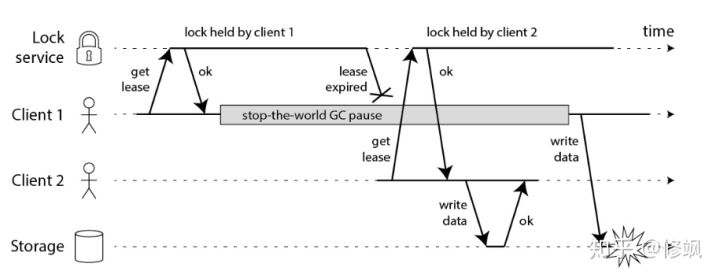

解释一下这个时序图：

​	客户端1在获得锁之后发生了很长时间的GC pause，在此期间，它获得的锁过期了，而客户端2获得了锁。当客户端1从GC pause中恢复过来的时候，它不知道自己持有的锁已经过期了，它依然向共享资源（上图中是一个存储服务）发起了写数据请求，而这时锁实际上被客户端2持有，因此两个客户端的写请求就有可能冲突（锁的互斥作用失效了）。


如何解决这个问题呢?引入了**fencing token**的概念：


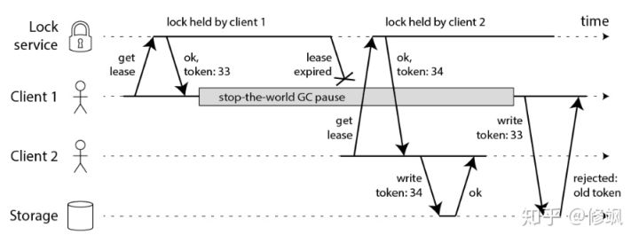

客户端1先获取到的锁，因此有一个较小的fencing token，等于33，而客户端2后获取到的锁，有一个较大的fencing token，等于34。客户端1从GC pause中恢复过来之后，依然是向存储服务发送访问请求，但是带了fencing token = 33。存储服务发现它之前已经处理过34的请求，所以会拒绝掉这次33的请求。这样就避免了冲突。

**但是其实这已经超出了Redis实现分布式锁的范围，单纯用Redis没有命令来实现生成Token。**


3.  时钟跳跃问题 


假设有5个Redis节点A, B, C, D, E。

```properties
客户端1从Redis节点A, B, C成功获取了锁（多数节点）。由于网络问题，与D和E通信失败。

节点C上的时钟发生了向前跳跃，导致它上面维护的锁快速过期。

客户端2从Redis节点C, D, E成功获取了同一个资源的锁（多数节点）。

客户端1和客户端2现在都认为自己持有了锁。

这个问题用Redis实现分布式锁暂时无解。而生产环境这种情况是存在的。
```


### Redisson实现原理

 实现原理：


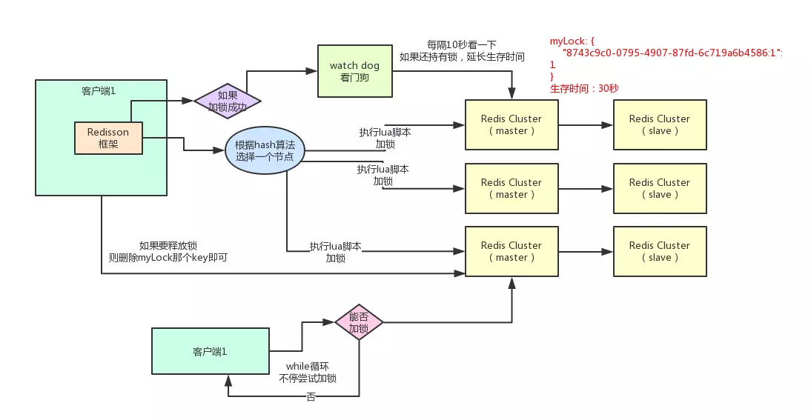

#### 加锁

某个客户端要加锁。如果该客户端面对的是一个redis cluster集群，他首先会根据hash节点选择一台机器。**这里注意**，仅仅只是选择一台机器！这点很关键！紧接着，就会发送一段lua脚本到redis上，那段lua脚本如下所示：

```java
// Redission内部源码
<T> RFuture<T> tryLockInnerAsync(long leaseTime, TimeUnit unit, long threadId, RedisStrictCommand<T> command) {
    internalLockLeaseTime = unit.toMillis(leaseTime);

    return commandExecutor.evalWriteAsync(getName(), LongCodec.INSTANCE, command,
              // 检查key是否已被占用，如果没有则设置超时时间及唯一标识，初始化value=1
              "if (redis.call('exists', KEYS[1]) == 0) then " +
                  "redis.call('hset', KEYS[1], ARGV[2], 1); " +
                  "redis.call('pexpire', KEYS[1], ARGV[1]); " +
                  "return nil; " +
              "end; " +
              // 锁重入的情况，判断锁的key field，一致的话，value加1
              "if (redis.call('hexists', KEYS[1], ARGV[2]) == 1) then " +
                  "redis.call('hincrby', KEYS[1], ARGV[2], 1); " +
                  "redis.call('pexpire', KEYS[1], ARGV[1]); " +
                  "return nil; " +
              "end; " +
              // 返回剩余的过期时间
              "return redis.call('pttl', KEYS[1]);",
                Collections.<Object>singletonList(getName()), internalLockLeaseTime, getLockName(threadId));
}
```

注意，为什么用lua脚本呢？因为通过封装在lua脚本中发送给redis，保证这段复杂业务逻辑执行的**原子性**。

**KEYS[1]**代表的是你加锁的那个key，比如说：`RLock lock = redisson.getLock("myLock");`这里你自己设置了加锁的那个锁key就是“myLock”。

**ARGV[1]**代表的就是锁key的默认生存时间，默认30秒。**ARGV[2]**代表的是加锁的客户端的ID，类似于下面这样：8743c9c0-0795-4907-87fd-6c719a6b4586:1

这里解释一下，第一段if判断语句，就是用“**exists myLock**”命令判断一下，如果你要加锁的那个锁key不存在的话，你就进行加锁。如何加锁呢？很简单，**用下面的命令**：`hset myLock`

`8743c9c0-0795-4907-87fd-6c719a6b4586:1 1`，通过这个命令设置一个hash数据结构，这行命令执行后，会出现一个类似下面的数据结构：

```java
myLock
{
    "8743c9c0-0795-4907-87fd-6c719a6b4586:1": 1
}
```

上述就代表“8743c9c0-0795-4907-87fd-6c719a6b4586:1”这个客户端对“myLock”这个锁key完成了加锁。接着会执行“**pexpire myLock 30000**”命令，设置myLock这个锁key的**生存时间是30秒**。好了，到此为止，ok，加锁完成了。


#### 锁互斥机制

这个时候，如果客户端2来尝试加锁，执行了同样的一段lua脚本，会咋样呢？很简单，第一个if判断会执行“**exists myLock**”，发现myLock这个锁key已经存在了。接着第二个if判断，判断一下，myLock锁key的hash数据结构中，是否包含客户端2的ID，但是明显不是的，因为那里包含的是客户端1的ID。

所以，客户端2会获取到**pttl myLock**返回的一个数字，这个数字代表了myLock这个锁key的**剩余生存时间。**比如还剩15000毫秒的生存时间。此时客户端2会进入一个while循环，不停的尝试加锁。


#### watch dog自动延期机制

客户端1加锁的锁key默认生存时间才30秒，如果超过了30秒，客户端1还想一直持有这把锁，怎么办呢？

简单！只要客户端1一旦加锁成功，就会启动一个watch dog看门狗，**他是一个后台线程，会每隔10秒检查一下**，如果客户端1还持有锁key，那么就会不断的延长锁key的生存时间。


#### 可重入加锁机制

如果客户端1都已经持有了这把锁了，结果可重入的加锁会怎么样呢？比如下面这种代码：

```java
RLock lock = redission.getLock("mylock");

lock.lock()
    
 // ...
 // 业务代码
    
lock.lock()

lock.unlock()
lock.unlock()
```


我们来分析一下上面那段lua脚本。**第一个if判断肯定不成立**，“exists myLock”会显示锁key已经存在了。**第二个if判断会成立**，因为myLock的hash数据结构中包含的那个ID，就是客户端1的那个ID，也就是“8743c9c0-0795-4907-87fd-6c719a6b4586:1”

此时就会执行可重入加锁的逻辑，他会用：

incrby myLock 8743c9c0-0795-4907-87fd-6c71a6b4586:1 1 ，通过这个命令，对客户端1的加锁次数，累加1。此时myLock数据结构变为下面这样：

```java
myLock
{
    "8743c9c0-0795-4907-87fd-6c719a6b4586:1": 2
}
```

看到了吧，那个myLock的hash数据结构中的那个客户端ID，就对应着加锁的次数


#### 释放锁机制

如果执行lock.unlock()，就可以释放分布式锁，此时的业务逻辑也是非常简单的。其实说白了，就是每次都对myLock数据结构中的那个加锁次数减1。如果发现加锁次数是0了，说明这个客户端已经不再持有锁了，此时就会用：**“del myLock”命令**，从redis里删除这个key。然后呢，另外的客户端2就可以尝试完成加锁了。这就是所谓的**分布式锁的开源Redisson框架的实现机制。**


#### 缺点

如果你对某个redis master实例，写入了myLock这种锁key的value，此时会异步复制给对应的master slave实例。但是这个过程中一旦发生redis master宕机，主备切换，redis slave变为了redis master。

接着就会导致，客户端2来尝试加锁的时候，在新的redis master上完成了加锁，而客户端1也以为自己成功加了锁。此时就会导致多个客户端对一个分布式锁完成了加锁。这时系统在业务语义上一定会出现问题，**导致各种脏数据的产生**。

所以这个就是redis cluster，或者是redis master-slave架构的主从异步复制导致的redis分布式锁的最大缺陷：**在redis master实例宕机的时候，可能导致多个客户端同时完成加锁**。


## 为什么Redis是单线程的

 因为Redis是基于内存的操作，CPU不是Redis的瓶颈，Redis的瓶颈最有可能是机器内存的大小或者网络带宽。 

 我们使用单线程的方式是无法发挥多核CPU 性能，不过我们可以通过在单机开多个Redis 实例来完善，比如组成master-master或者master-slave的形式，耗时的读命令可以完全在slave进行。 


## 单线程redis为什么快

1. 完全基于内存，绝大部分请求是纯粹的内存操作 

2. 采用单线程，避免了不必要的上下文切换和竞争条件，也不存在多进程或者多线程导致的切换而消耗 CPU，不用去考虑各种锁的问题，不存在加锁释放锁操作，没有因为可能出现死锁而导致的性能消耗； 

3. 使用非阻塞的I/O多路复用模型。 内部实现采用epoll，采用了epoll+自己实现的简单的事件框架。


### IO多路复用

 	**这里“多路”指的是多个网络连接，“复用”指的是复用同一个线程。**采用多路 I/O 复用技术可以让单个线程高效的处理多个连接请求（尽量减少网络 IO 的时间消耗） 


​	多路I/O复用模型是利用 select、poll、epoll 可以同时监察多个流的 I/O 事件的能力，在空闲的时候，会把当前线程阻塞掉，当有一个或多个流有 I/O 事件时，就从阻塞态中唤醒，于是程序就会轮询一遍所有的流（epoll 是只轮询那些真正发出了事件的流），并且只依次顺序的处理就绪的流，这种做法就避免了大量的无用操作。 


### Redis 事件机制

[http://remcarpediem.net/article/1aa2da89/ ](http://remcarpediem.net/article/1aa2da89/ )

Redis 采用事件驱动机制来处理大量的网络IO。它并没有使用 libevent 或者 libev 这样的成熟开源方案，而是自己实现一个非常简洁的事件驱动库 ae_event。

Redis中的事件驱动库只关注网络IO，以及定时器。该事件库处理下面两类事件：

- 文件事件(file event)：用于处理 Redis 服务器和客户端之间的网络IO。
- 时间事件(time eveat)：Redis 服务器中的一些操作（比如serverCron函数）需要在给定的时间点执行，而时间事件就是处理这类定时操作的。

事件驱动库的代码主要是在src/ae.c中实现的，其示意图如下所示。

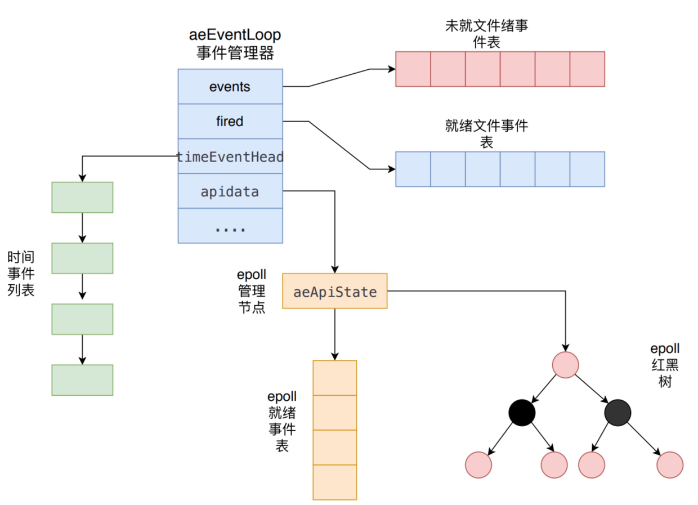

 `aeEventLoop`是整个事件驱动的核心，它管理着文件事件表和时间事件列表，
不断地循环处理着就绪的文件事件和到期的时间事件。下面我们就先分别介绍文件事件和时间事件，然后讲述相关的`aeEventLoop`源码实现。 

#### 文件事件

Redis基于Reactor模式开发了自己的网络事件处理器，也就是文件事件处理器。文件事件处理器使用IO多路复用技术，同时监听多个套接字，并为套接字关联不同的事件处理函数。当套接字的可读或者可写事件触发时，就会调用相应的事件处理函数。

Redis 使用的IO多路复用技术主要有：`select`、`epoll`、`evport`和`kqueue`等。每个IO多路复用函数库在 Redis 源码中都对应一个单独的文件，比如ae_select.c，ae_epoll.c， ae_kqueue.c等。Redis 会根据不同的操作系统，按照不同的优先级选择多路复用技术。事件响应框架一般都采用该架构，比如 netty 和 libevent。

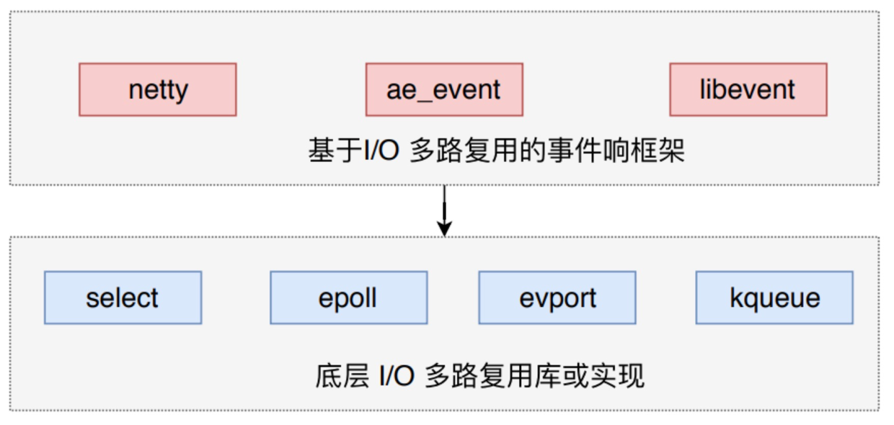

 如下图所示，文件事件处理器有四个组成部分，它们分别是套接字、I/O多路复用程序、文件事件分派器以及事件处理器。 

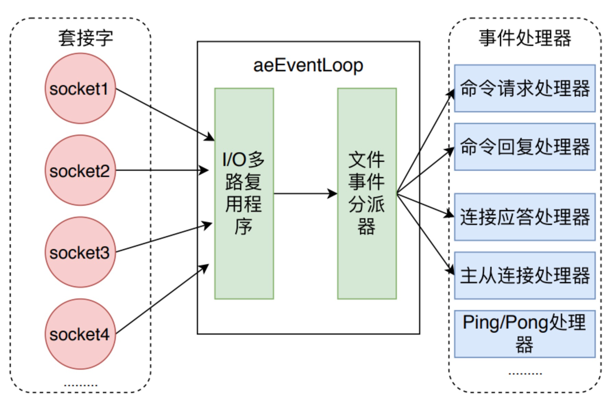

文件事件是对套接字操作的抽象，每当一个套接字准备好执行 accept、read、write和 close 等操作时，就会产生一个文件事件。因为 Redis 通常会连接多个套接字，所以多个文件事件有可能并发的出现。

I/O多路复用程序负责监听多个套接字，并向文件事件派发器传递那些产生了事件的套接字。


尽管多个文件事件可能会并发地出现，但I/O多路复用程序总是会将所有产生的套接字都放到同一个队列(也就是后文中描述的`aeEventLoop`的`fired`就绪事件表)里边，然后文件事件处理器会以有序、同步、单个套接字的方式处理该队列中的套接字，也就是处理就绪的文件事件。

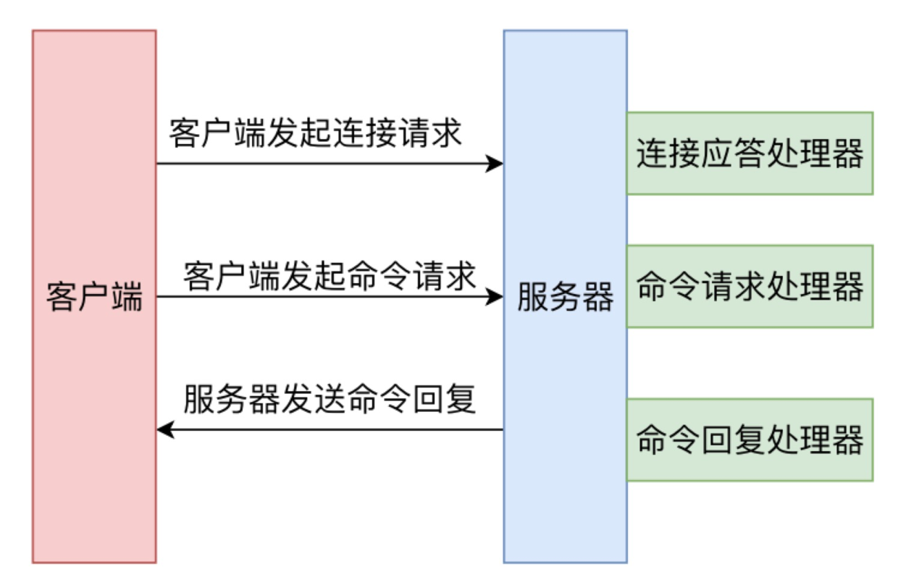

所以，一次 Redis 客户端与服务器进行连接并且发送命令的过程如上图所示。

- 客户端向服务端发起建立 socket 连接的请求，那么监听套接字将产生 AE_READABLE 事件，触发**连接应答处理器**执行。处理器会对客户端的连接请求进行应答，然后创建客户端套接字，以及客户端状态，并将客户端套接字的 AE_READABLE 事件与**命令请求处理器**关联。
- 客户端建立连接后，向服务器发送命令，那么客户端套接字将产生 AE_READABLE 事件，触发**命令请求处理器**执行，处理器读取客户端命令，然后传递给相关程序去执行。
- 执行命令获得相应的命令回复，为了将命令回复传递给客户端，服务器将客户端套接字的 AE_WRITEABLE 事件与**命令回复处理器**关联。当客户端试图读取命令回复时，客户端套接字产生 AE_WRITEABLE 事件，触发命令**回复处理器**将命令回复全部写入到套接字中。

#### 时间事件

Redis 的时间事件分为以下两类：

- 定时事件：让一段程序在指定的时间之后执行一次。
- 周期性事件：让一段程序每隔指定时间就执行一次。

Redis 的时间事件的具体定义结构如下所示。

```c++
typedef struct aeTimeEvent {
    /* 全局唯一ID */
    long long id; /* time event identifier. */
    /* 秒精确的UNIX时间戳，记录时间事件到达的时间*/
    long when_sec; /* seconds */
    /* 毫秒精确的UNIX时间戳，记录时间事件到达的时间*/
    long when_ms; /* milliseconds */
    /* 时间处理器 */
    aeTimeProc *timeProc;
    /* 事件结束回调函数，析构一些资源*/
    aeEventFinalizerProc *finalizerProc;
    /* 私有数据 */
    void *clientData;
    /* 前驱节点 */
    struct aeTimeEvent *prev;
    /* 后继节点 */
    struct aeTimeEvent *next;
} aeTimeEvent;
```

一个时间事件是定时事件还是周期性事件取决于时间处理器的返回值：

- 如果返回值是 AE_NOMORE，那么这个事件是一个定时事件，该事件在达到后删除，之后不会再重复。
- 如果返回值是非 AE_NOMORE 的值，那么这个事件为周期性事件，当一个时间事件到达后，服务器会根据时间处理器的返回值，对时间事件的 `when` 属性进行更新，让这个事件在一段时间后再次达到。

Redis 将所有时间事件都放在一个无序链表中，每次 Redis 会遍历整个链表，查找所有已经到达的时间事件，并且调用相应的事件处理器。

介绍完文件事件和时间事件，我们接下来看一下 `aeEventLoop`的具体实现。


## redis 性能监控和排查


### 1.通过slow log查看

通过SLOWLOG可以读取慢查询日志。

```shell
################################## SLOW LOG ###################################

# The Redis Slow Log is a system to log queries that exceeded a specified
# execution time. The execution time does not include the I/O operations
# like talking with the client, sending the reply and so forth,
# but just the time needed to actually execute the command (this is the only
# stage of command execution where the thread is blocked and can not serve
# other requests in the meantime).
# 
# Redis慢日志是一个记录超过指定查询的系统执行时间。
# 执行时间不包括I/O操作比如与客户交谈，发送回复等等，但只是实际执行命令所需的时间(这是惟一的命令执行的阶段，线程被阻塞，不能执行同时还有其他请求)。
#
# You can configure the slow log with two parameters: one tells Redis
# what is the execution time, in microseconds, to exceed in order for the
# command to get logged, and the other parameter is the length of the
# slow log. When a new command is logged the oldest one is removed from the
# queue of logged commands.
#
#您可以使用两个参数配置慢速日志:一个参数告诉Redis要超出的执行时间(以微秒为单位)是多少的长度，而另一个参数是慢日志中删除最旧的命令日志命令队列。
#
# The following time is expressed in microseconds, so 1000000 is equivalent
# to one second. Note that a negative number disables the slow log, while
# a value of zero forces the logging of every command.
#
#下面的时间用微秒表示，所以1000000是等价的一秒钟。注意，负数禁用慢日志，而0的值强制记录每个命令。
slowlog-log-slower-than 10000

# There is no limit to this length. Just be aware that it will consume memory.
# You can reclaim memory used by the slow log with SLOWLOG RESET.
slowlog-max-len 128
```


```shell
# 获取当前慢日志长度
127.0.0.1:6379> slowlog len
(integer) 28

# 获取所有慢日志
127.0.0.1:6379> slowlog get 
 1) 1) (integer) 27
    2) (integer) 1417531320
    3) (integer) 24623
    4) 1) "info"

# 获取最近N条慢日志
127.0.0.1:6379> SLOWLOG GET N
```


### 2.通过info 查看

### 3.通过benchmark测试下当前服务器的性能 

Redis自带的性能检测工具redis-benchmark, 该工具可以模拟 N 个客户端同时发出 Y 个请求。


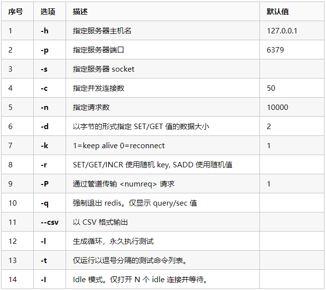


```shell
/opt/redis-5.0.4/src/redis-benchmark -p 7001 -c 10 -n 100000 -q
```


### 4.通过MONITOR测算一次请求对redis操作的次数

调试命令，返回服务器处理的每一个命令，它能帮助我们了解在数据库上发生了什么操作.

由于MONITOR命令返回服务器处理的所有的命令, 所以在性能上会有一些消耗。


### 5.redis延迟时间排查

数据量越来越多，并发写操作很多的情况下，Redis出现响应慢的情况

可以使用 Redis命令来测试一下redis的响应速度

```shell
 /opt/redis-5.0.4/src/redis-cli --latency -h 192.168.199.171 -p 7001 -c
min: 0, max: 3, avg: 0.10 (10836 samples)
```

这条命令会向Redis插入示例数据来检查平均延时。


出现延时的可能

- 一些时间复杂度比较高的命令，如 lrem，sort，sunion等命令会花比较长时间；另外，大量的重复连接也会造成延时，重用连接是一种很好的品质；如果有大量写操作，可以使用 `pipeline` 管道的方式（类似mysql事务），一次性提交，这样数据量也少了，连接次数也少了，不用每次都返回数据，速度自然会快很多；
- Redis持久化需要fork出一个进程来进行持久化操作，这本身就会引发延时，如果数据变化大，RDB配置时间短，那这个代价还是挺大的；再加上，硬盘这东西真有点不靠谱，如果还是虚拟机上的虚拟硬盘，如果还是NFS共享目录，那这延时会让你崩溃