# Tablestore

[入门指南参考连接](https://developer.aliyun.com/article/710709)

https://developer.aliyun.com/article/710400?spm=a2c4g.11186623.2.13.3a015d42EZG6vd

**表格存储（Tablestore）**是阿里云自研的 NoSQL 多模型数据库，提供海量结构化数据存储以及快速的查询和分析服务。表格存储的分布式存储和强大的索引引擎能够提供 PB 级存储、千万 TPS 以及毫秒级延迟的服务能力。

本文将以一个简单的学生成绩查询demo为例，向大家演示如何使用Tablestore提供的Java SDK实现一个**表格数据的导入、查询（主键索引、二级索引和多元索引）和导出**。

demo中表格（table）的存储信息格式如下：

| ID(主键) | 班级(主键) | 姓名(主键) | 语文 | 数学 | 英语 |
| :------- | :--------- | :--------- | :--- | :--- | :--- |
| 0        | 初三1班    | 云知       | 99   | 99   | 99   |

主要实现的功能如下：

- **创建**学生成绩的数据表格；
- **添加**学生成绩信息；
- **查询**学生成绩信息；
- **更新**学生成绩信息；
- **删除**学生成绩信息；
- 查询**特定班级**的学生成绩信息（二级索引）；
- 查询**多科目特定分段**的学生成绩信息（多元索引）；
- **导出**新增学生成绩信息（通道服务）。

# 一、配置开发环境

Tablestore的Java SDK开发环境非常简单，主要包括：

- 了解并开通阿里云表格存储服务

- 创建AccessKey

- 配置Java环境（建议：JDK 6及以上版本）

- 使用Maven项目加入依赖项

```xml
<dependencies>
     <dependency>
         <groupId>com.aliyun.openservices</groupId>
         <artifactId>tablestore</artifactId>
         <version>4.12.1</version>
     </dependency>
</dependencies>
```

# 二、表格的一般操作

## 1、获取实例的控制权限

首先创建实例，实例是表格存储资源管理的基础单元，表格存储对应用程序的访问控制和资源计量都在实例级别完成。

实例创建成功后，可以通过“SyncClient client”获取实例控制权柄，然后通过client实现对实例的各种控制。

```java
/**
   * 以下信息可由阿里云控制台获取，依次为：
   * endPoint(实例访问地址)
   * accessId(AccessKey ID）
   * accessKey(Access Key Secret)
   * instanceName(实例名称，用户创建实例时指定）
   */
private static final String endPoint = "https://xxxx.cn-hangzhou.ots.aliyuncs.com";
private static final String accessId = "LTAIxxxebxxxKIxx";
private static final String accessKey = "5P7xxxMm1xxxhHPxxxXnNxxxXscxxx";
private static final String instanceName = "instance-1";
SyncClient client = new SyncClient(endPoint, accessId, accessKey, instanceName);
```

## 2、创建学生成绩的数据表格

在创建学生成绩的数据表格时需要描述表的结构信息（TableMeta）和配置信息（TableOptions）。

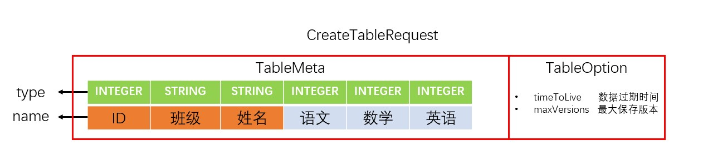

```java
public static void creatTable(){
    System.out.println("开始创建表格。");
    //描述表的结构信息
    TableMeta tableMeta = new TableMeta(tableName);

    //添加主键列
    tableMeta.addPrimaryKeyColumn(new PrimaryKeySchema("ID", PrimaryKeyType.INTEGER));
    tableMeta.addPrimaryKeyColumn(new PrimaryKeySchema("班级", PrimaryKeyType.INTEGER));
    tableMeta.addPrimaryKeyColumn(new PrimaryKeySchema("姓名", PrimaryKeyType.STRING));

    //添加属性列
    tableMeta.addDefinedColumn(new DefinedColumnSchema("语文", DefinedColumnType.INTEGER));
    tableMeta.addDefinedColumn(new DefinedColumnSchema("数学", DefinedColumnType.INTEGER));
    tableMeta.addDefinedColumn(new DefinedColumnSchema("英语", DefinedColumnType.INTEGER));

    int timeToLive = -1; // 数据的过期时间, 单位秒, -1代表永不过期. 假如设置过期时间为一年, 即为 365 * 24 * 3600.
    int maxVersions = 1; // 最大保存版本数, maxVersions大于1时, 无法使用二级索引和多元索引功能.

    //描述表的配置信息
    TableOptions tableOptions = new TableOptions(timeToLive, maxVersions);

    //将表的结构信息和配置信息封装到一个request里
    CreateTableRequest request = new CreateTableRequest(tableMeta, tableOptions);

    //创建表格
    try {
        client.createTable(request);
        System.out.println("创建表格成功。");
    } catch (TableStoreException e) {
        System.err.println("操作失败，详情：" + e.getMessage());
        System.err.println("Request ID:" + e.getRequestId());
    } catch (ClientException e) {
        System.err.println("请求失败，详情：" + e.getMessage());
    }
}
```

## 3、添加学生成绩信息

PutRow 接口用于插入一行数据，如果原来该行已经存在，会覆盖原来的一行。

明确主键信息和属性信息，我们便可以使用PutRow接口将该信息添加入表中。

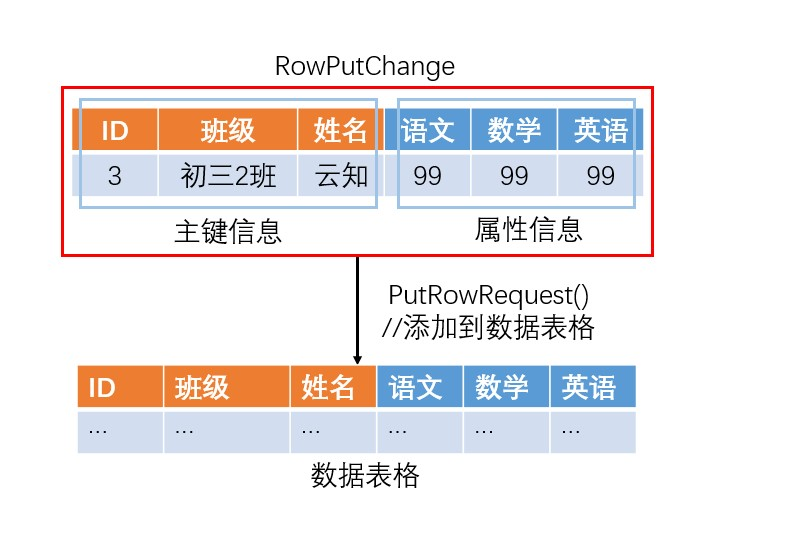

```java
public static void creatRow(){
    //描述主键信息
    PrimaryKeyBuilder primaryKeyBuilder = PrimaryKeyBuilder.createPrimaryKeyBuilder();
    primaryKeyBuilder.addPrimaryKeyColumn("ID", PrimaryKeyValue.fromLong(3));
    primaryKeyBuilder.addPrimaryKeyColumn("班级", PrimaryKeyValue.fromString("初三2班"));
    primaryKeyBuilder.addPrimaryKeyColumn("姓名", PrimaryKeyValue.fromString("云知"));
    PrimaryKey primaryKey = primaryKeyBuilder.build();
    RowPutChange rowPutChange = new RowPutChange(tableName, primaryKey);

    //描述属性信息
    rowPutChange.addColumn(new Column("语文", ColumnValue.fromLong(99)));
    rowPutChange.addColumn(new Column("数学", ColumnValue.fromLong(99)));
    rowPutChange.addColumn(new Column("英语", ColumnValue.fromLong(99)));

    //添加新数据到表格
    try {
        client.putRow(new PutRowRequest(rowPutChange));
        System.out.println("添加数据成功。");
    } catch (TableStoreException e) {
        System.err.println("操作失败，详情：" + e.getMessage());
        System.err.println("Request ID:" + e.getRequestId());
    } catch (ClientException e) {
        System.err.println("请求失败，详情：" + e.getMessage());
    }
}
```

## 4、查询学生成绩信息

### 查询单条学生成绩信息

通过描述主键信息，可以在数据库中唯一的确认一条学生信息。

以此主键为索引，可以使用 GetRow 接口读取一行数据。

在描述主键信息时，必须保证**主键信息的完整性**（即，包含所有主键的对应值），因为只有这样才能保证信息在表内是唯一的。

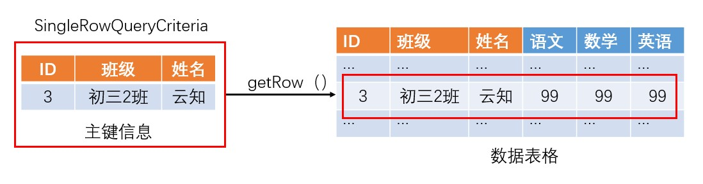

```java
public static void retrieveRow() {
    //构建主键
    PrimaryKeyBuilder primaryKeyBuilder = PrimaryKeyBuilder.createPrimaryKeyBuilder();
    primaryKeyBuilder.addPrimaryKeyColumn("ID", PrimaryKeyValue.fromLong(3));
    primaryKeyBuilder.addPrimaryKeyColumn("班级", PrimaryKeyValue.fromLong("初三2班"));
    primaryKeyBuilder.addPrimaryKeyColumn("姓名", PrimaryKeyValue.fromLong("云知"));
    PrimaryKey primaryKey = primaryKeyBuilder.build();

    //读取一行
    SingleRowQueryCriteria rowQueryCriteria = new SingleRowQueryCriteria(tableName, primaryKey);

    //设置读取最新版本
    rowQueryCriteria.setMaxVersions(1);

    try {
        GetRowResponse getRowResponse = client.getRow(new GetRowRequest(rowQueryCriteria));
        Row row = getRowResponse.getRow();
        System.out.println("查询单条数据成功。");
    } catch (TableStoreException e) {
        System.err.println("操作失败，详情：" + e.getMessage());
        System.err.println("Request ID:" + e.getRequestId());
    } catch (ClientException e) {
        System.err.println("请求失败，详情：" + e.getMessage());
    }
}
```

### 查询多条学生成绩信息

由于主键是有序的，因此可以通过构建Min主键和Max主键，在表内唯一的限定一部分学生信息并将其返回。

下面这个例子，是返回“ID”在50－100之间的学生信息。

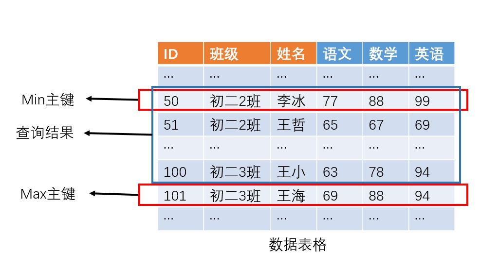

```java
public static void retrieveRangeRow() {
    //构建Min主键
    PrimaryKeyBuilder primaryMinKeyBuilder = PrimaryKeyBuilder.createPrimaryKeyBuilder();
    primaryMinKeyBuilder.addPrimaryKeyColumn("ID", PrimaryKeyValue.fromLong(50));
    primaryMinKeyBuilder.addPrimaryKeyColumn("班级", PrimaryKeyValue.INF_MIN);
    primaryMinKeyBuilder.addPrimaryKeyColumn("姓名", PrimaryKeyValue.INF_MIN);
    PrimaryKey primaryMinKey = primaryMinKeyBuilder.build();

    //构建Max主键
    PrimaryKeyBuilder primaryMaxKeyBuilder = PrimaryKeyBuilder.createPrimaryKeyBuilder();
    primaryMaxKeyBuilder.addPrimaryKeyColumn("ID", PrimaryKeyValue.fromLong(101));
    primaryMaxKeyBuilder.addPrimaryKeyColumn("班级", PrimaryKeyValue.INF_MAX);
    primaryMaxKeyBuilder.addPrimaryKeyColumn("姓名", PrimaryKeyValue.INF_MAX);
    PrimaryKey primaryMaxKey = primaryMaxKeyBuilder.build();

    RangeRowQueryCriteria rangeRowQueryCriteria = new RangeRowQueryCriteria(tableName);
    rangeRowQueryCriteria.setInclusiveStartPrimaryKey(primaryMinKey);
    rangeRowQueryCriteria.setExclusiveEndPrimaryKey(primaryMaxKey);

    rangeRowQueryCriteria.setMaxVersions(1);
    try {
        GetRangeResponse getRangeResponse = client.getRange(new GetRangeRequest(rangeRowQueryCriteria));
        List<Row> rows = getRangeResponse.getRows();
        System.out.println("查询多条数据成功。");
    } catch (TableStoreException e) {
        System.err.println("操作失败，详情：" + e.getMessage());
        System.err.println("Request ID:" + e.getRequestId());
    } catch (ClientException e) {
        System.err.println("请求失败，详情：" + e.getMessage());
    }
}
```

## 5、修改学生成绩信息

准确描述主键信息后，我们可以定位到数据表内的唯一数据信息，并修改它。

UpdateRow 接口用于更新一行数据，如果原行不存在，会新写入一行。

```java
public static void updataRow(){
    //构建主键
    PrimaryKeyBuilder primaryKeyBuilder = PrimaryKeyBuilder.createPrimaryKeyBuilder();
    primaryKeyBuilder.addPrimaryKeyColumn("ID", PrimaryKeyValue.fromLong(3));
    primaryKeyBuilder.addPrimaryKeyColumn("班级", PrimaryKeyValue.fromLong("初三2班"));
    primaryKeyBuilder.addPrimaryKeyColumn("姓名", PrimaryKeyValue.fromLong("云知"));
    PrimaryKey primaryKey = primaryKeyBuilder.build();
    RowPutChange rowPutChange = new RowPutChange(tableName, primaryKey);

    //构建属性列
    rowPutChange.addColumn(new Column("语文", ColumnValue.fromLong(rand.nextInt(100))));
    rowPutChange.addColumn(new Column("数学", ColumnValue.fromLong(rand.nextInt(100))));
    rowPutChange.addColumn(new Column("英语", ColumnValue.fromLong(rand.nextInt(100))));

    //添加新数据到表格
    try {
        client.updateRow(new UpdateRowRequest(rowUpdateChange));
        System.out.println("更新数据成功。");
    } catch (TableStoreException e) {
        System.err.println("操作失败，详情：" + e.getMessage());
        System.err.println("Request ID:" + e.getRequestId());
    } catch (ClientException e) {
        System.err.println("请求失败，详情：" + e.getMessage());
    }
}
```

## 6、删除学生成绩信息

准确描述主键信息后，我们可以定位到数据表内的唯一数据信息，并使用DeleteRow 接口删除它。

```java
private static void deleteRow(SyncClient client, String pkValue) {
    //构建主键
    PrimaryKeyBuilder primaryKeyBuilder = PrimaryKeyBuilder.createPrimaryKeyBuilder();
    primaryKeyBuilder.addPrimaryKeyColumn("ID", PrimaryKeyValue.fromLong(3));
    primaryKeyBuilder.addPrimaryKeyColumn("班级", PrimaryKeyValue.fromLong("初三2班"));
    primaryKeyBuilder.addPrimaryKeyColumn("姓名", PrimaryKeyValue.fromLong("云知"));
    PrimaryKey primaryKey = primaryKeyBuilder.build();

    RowDeleteChange rowDeleteChange = new RowDeleteChange(tableName, primaryKey);

    try {
        GetRangeResponse getRangeResponse = client.getRange(new GetRangeRequest(rangeRowQueryCriteria));
    } catch (TableStoreException e) {
        System.err.println("操作失败，详情：" + e.getMessage());
        System.err.println("Request ID:" + e.getRequestId());
    } catch (ClientException e) {
        System.err.println("请求失败，详情：" + e.getMessage());
    }
    client.deleteRow(new DeleteRowRequest(rowDeleteChange));
}
```

## 7、删除表

```java
public static void deleteTable(){
    DeleteTableRequest request = new DeleteTableRequest(tableName);
    try {
        client.deleteTable(request);
    } catch (TableStoreException e) {
        System.err.println("操作失败，详情：" + e.getMessage());
        System.err.println("Request ID:" + e.getRequestId());
    } catch (ClientException e) {
        System.err.println("请求失败，详情：" + e.getMessage());
    }
}
```

# 三、二级索引

在我们的demo中，我们使用 **“ID+班级+姓名”**这三个主键来唯一的确定一条学生成绩信息。

由于主键是**顺序存储**在数据库中的，所以我们可以使用retrieveRangeRow()函数，通过在其中设置“Min主键”和“Max主键”的方式，对ID进行范围查询。

但是当我们期望获取某个范围的班级的时候，因为“班级”并不是主键存储的第一索引，这个思路便失效了。

Tablestore提供了**二级索引**，以便于解决这个问题。

二级索引可以**提供一份以新的关键字（原表的主键和属性皆可）为第一索引的数据表**，方便用户使用范围查询去查询这个关键字对应的数据信息。

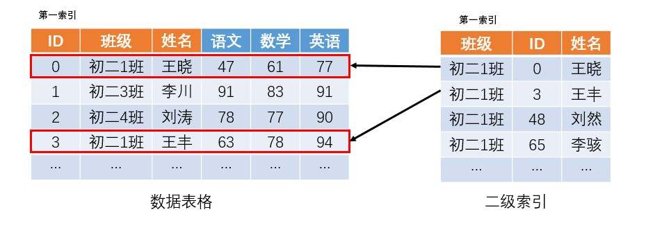

## 1、创建二级索引

创建二级索引主要是声明一个新的主键，下面的例子就是将“班级”声明为新的二级索引的主键，最终形成“班级＋ID＋姓名”的索引表。

```java
public static void createIndex() {
    System.out.println("indexName = "+indexName);
    IndexMeta indexMeta = new IndexMeta(indexName); // 要创建的索引表名称。
    indexMeta.addPrimaryKeyColumn("班级"); // 为索引表添加主键列。
    CreateIndexRequest request = new CreateIndexRequest(tableName, indexMeta, true);

    try {
        client.createIndex(request);
        System.out.println("创建索引成功。");
    } catch (TableStoreException e) {
        System.err.println("操作失败，详情：" + e.getMessage());
        System.err.println("Request ID:" + e.getRequestId());
    } catch (ClientException e) {
        System.err.println("请求失败，详情：" + e.getMessage());
    }

}
```

## 2、查询特定班级的学生成绩信息

以下使用新声明的二级索引查询“班级”为初二1班、初二2班和初二3班的学生成绩信息。

思路同基本的范围查询相同：声明Min，Max主键值，然后在二级索引表中查询到该范围内的所有信息的主键值，再返回到原表查询完整的学生信息即可。

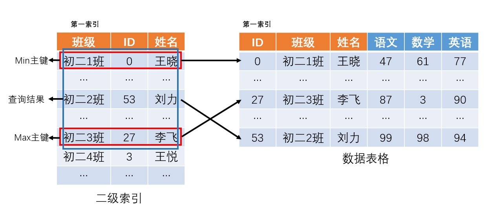

```java
public static void getRangeRow(){
    System.out.println("开始查询数据。");
    //构建Min主键
    PrimaryKeyBuilder primaryLKeyBuilder = PrimaryKeyBuilder.createPrimaryKeyBuilder();
    primaryLKeyBuilder.addPrimaryKeyColumn("班级", PrimaryKeyValue.fromString("初二1班"));
    primaryLKeyBuilder.addPrimaryKeyColumn("ID", PrimaryKeyValue.INF_MIN);
    primaryLKeyBuilder.addPrimaryKeyColumn("姓名", PrimaryKeyValue.INF_MIN);
    PrimaryKey startPrimaryKey = primaryLKeyBuilder.build();

    //构造Max间主键
    PrimaryKeyBuilder primaryRKeyBuilder = PrimaryKeyBuilder.createPrimaryKeyBuilder();
    primaryRKeyBuilder.addPrimaryKeyColumn("班级", PrimaryKeyValue.fromString("初二3班"));
    primaryRKeyBuilder.addPrimaryKeyColumn("ID", PrimaryKeyValue.INF_MAX);
    primaryRKeyBuilder.addPrimaryKeyColumn("姓名", PrimaryKeyValue.INF_MAX);
    PrimaryKey endPrimaryKey = primaryRKeyBuilder.build();

    RangeRowQueryCriteria rangeRowQueryCriteria = new RangeRowQueryCriteria(indexName);
    rangeRowQueryCriteria.setInclusiveStartPrimaryKey(startPrimaryKey);
    rangeRowQueryCriteria.setExclusiveEndPrimaryKey(endPrimaryKey);

    rangeRowQueryCriteria.setMaxVersions(1);
    try {
        GetRangeResponse getRangeResponse = client.getRange(new GetRangeRequest(rangeRowQueryCriteria));
        List<Row> rows = getRangeResponse.getRows();
        System.out.println("查询到的行数"+rows.size());
        for (int i = 0; i < rows.size(); i++) {
            long index = rows.get(i).getPrimaryKey().getPrimaryKeyColumn("ID").getValue().asLong();
            Fmt.PrintRow(rows.get(i));
        }
    } catch (TableStoreException e) {
        System.err.println("操作失败，详情：" + e.getMessage());
        System.err.println("Request ID:" + e.getRequestId());
    } catch (ClientException e) {
        System.err.println("请求失败，详情：" + e.getMessage());
    }
}
```

## 3、删除二级索引

我们可以通过表名字和二级索引名来唯一的确定一个二级索引，然后通过DeleteIndexRequest(String tableName, String indexName)函数，将其删除。

```java
public static void deleteIndex() {
    DeleteIndexRequest request = new DeleteIndexRequest(tableName, indexName); // 要删除的索引表及主表名
    client.deleteIndex(request);
}
```

# 四、多元索引

当我们要对多个字段进行联合查询的时候，就很难通过前边的思路找到一个切实可行的方案。

因此Tablestore提供了多元索引，可以让我们轻松实现多种高效的索引结构解决大数据的复杂查询难题。

下面，我们将使用多元索引去实现对三科成绩同时限定区间的查询（例如，三科成绩都大于60分的人数），更多的实现可以查阅官方[多元索引开发指南](https://help.aliyun.com/document_detail/91974.html?spm=a2c4g.11186623.6.603.42ff28e5a4BcHo)

## 1、创建多元索引

我们可以在一张表上创建多个多元索引，在创建多元索引时可以指定索引名和索引结构。

```java
public static void createSearchIndex(){
    CreateSearchIndexRequest request = new CreateSearchIndexRequest();
    request.setTableName(tableName);
    request.setIndexName(searchIndexName);
    IndexSchema indexSchema = new IndexSchema();
    indexSchema.setFieldSchemas(Arrays.asList(
        new FieldSchema("语文", FieldType.LONG).setIndex(true).setEnableSortAndAgg(true),
        new FieldSchema("数学", FieldType.LONG).setIndex(true).setEnableSortAndAgg(true),
        new FieldSchema("英语", FieldType.LONG).setIndex(true).setEnableSortAndAgg(true)));
    request.setIndexSchema(indexSchema);
    client.createSearchIndex(request);
    System.out.println("创建SearchIndex成功。");
}
```

## 2、查询多科目特定分段的学生成绩信息

我们使用BoolQuery进行多条件组合查询，在其中包含了三个子查询条件：rangeChineseQuery，rangeMathQuery和rangeEnglishQuery。

将他们封装到BoolQuery中形成一个组合查询条件，查询三个成绩均大于60分的学生成绩信息。

```java
public static void boolSearchQuery(){
    RangeQuery rangeChineseQuery = new RangeQuery(); // 设置查询类型为RangeQuery
    rangeChineseQuery.setFieldName("语文");  // 设置针对哪个字段
    rangeChineseQuery.greaterThan(ColumnValue.fromLong(60));  // 设置语文成绩大于60

    RangeQuery rangeMathQuery = new RangeQuery(); // 设置查询类型为RangeQuery
    rangeMathQuery.setFieldName("数学");  // 设置针对哪个字段
    rangeMathQuery.greaterThan(ColumnValue.fromLong(60));  // 设置数学成绩大于60

    RangeQuery rangeEnglishQuery = new RangeQuery(); // 设置查询类型为RangeQuery
    rangeEnglishQuery.setFieldName("英语");  // 设置针对哪个字段
    rangeEnglishQuery.greaterThan(ColumnValue.fromLong(60));  // 设置英语成绩大于60

    SearchQuery searchQuery = new SearchQuery();
    BoolQuery boolQuery = new BoolQuery();
    boolQuery.setMustQueries(Arrays.asList(rangeChineseQuery, rangeMathQuery, rangeEnglishQuery));
    searchQuery.setQuery(boolQuery);
    searchQuery.setGetTotalCount(true);
    SearchRequest searchRequest = new SearchRequest(tableName, searchIndexName, searchQuery);
    SearchResponse resp = client.search(searchRequest);
    System.out.println("Row: " + resp.getRows());
}
```

## 3、删除多元索引

我们可以通过表名字和多元索引名来唯一的确定一个多元索引，然后通过clinet.deleteSearchIndex(DeleteSearchIndexRequest request)函数，将其删除。

```java
public static void deleteSearchIndex() {
    DeleteSearchIndexRequest request = new DeleteSearchIndexRequest();
    request.setTableName(tableName);
    request.setIndexName(searchIndexName);
    client.deleteSearchIndex(request);
    System.out.println("删除SearchIndex成功。");
}
```

# 五、通道服务

## 1、创建通道

通道的类型主要分为三类：全量(BaseData)、增量(Stream)和全量加增量(BaseAndStream)。

我们可以通过设置通道类型，限定通道获取数据的范围。

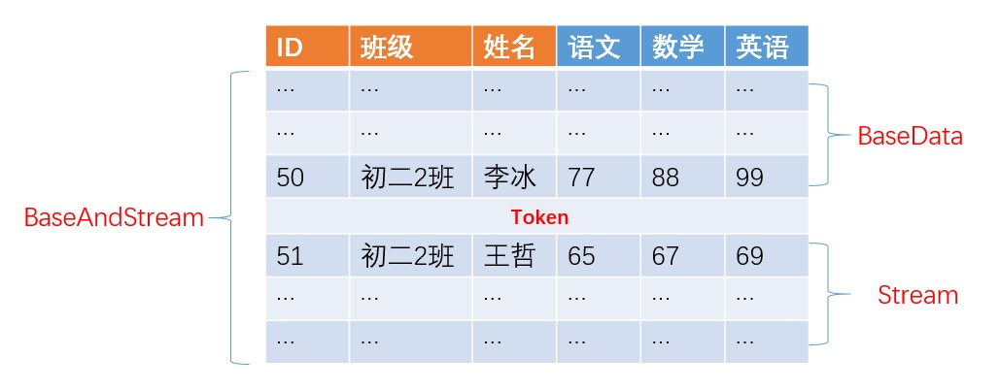

```java
TunnelClient tunnelClient = new TunnelClient(endPoint, accessId, accessKey, instanceName);
public static void createTunnel() {
    CreateTunnelRequest request = new CreateTunnelRequest(tableName, tunnelName, TunnelType.BaseData);
    CreateTunnelResponse resp = tunnelClient.createTunnel(request);
    System.out.println("RequestId: " + resp.getRequestId());
    System.out.println("TunnelId: " + resp.getTunnelId());
}
```

## 2、导出学生信息

用户调用printAllRow()函数可以开启一个通道服务，使得通道自动调用process()函数内的逻辑。

```java
public static class PrintProcessor implements IChannelProcessor {
    @Override
    public void process(ProcessRecordsInput input) {
        System.out.println("Default record processor, would print records：");
        System.out.println(input.getRecords());
        try {
            // Mock Record Process.
            Thread.sleep(1000);
        } catch (InterruptedException e) {
            e.printStackTrace();
        }
    }

    @Override
    public void shutdown() {
        System.out.println("Mock shutdown");
    }
}

public static void printAllRow(){        
    ListTunnelRequest request = new ListTunnelRequest(tableName);
    ListTunnelResponse resp = tunnelClient.listTunnel(request);
    // tunnelId会用于后续TunnelWorker的初始化, 该值同样可以通过ListTunnel或者DescribeTunnel获取。
    String tunnelId = resp.getTunnelInfos().get(0).getTunnelId();
    System.out.println(tunnelId);
    TunnelWorkerConfig config = new TunnelWorkerConfig(new PrintProcessor());
    TunnelWorker worker = new TunnelWorker(tunnelId, client, config);
    try {   
        worker.connectAndWorking();
    } catch (Exception e) {
        e.printStackTrace();
        worker.shutdown();
        client.shutdown();
    }
}
```

## 3、删除通道

```java
public static void deleteTunnel() {
    DeleteTunnelRequest request = new DeleteTunnelRequest(tableName, tunnelName);
    DeleteTunnelResponse resp = tunnelClient.deleteTunnel(request);
    System.out.println("RequestId: " + resp.getRequestId());
}
```


# tablestore与hbase对比

表格存储与 HBase 在数据模型上非常类似，在设计上都极大参考了 Google 的三驾马车之 Bigtable。 两者最直接的区别就是 HBase 是一款开源软件，而表格存储是通过 Restful API 暴露出来的云服务


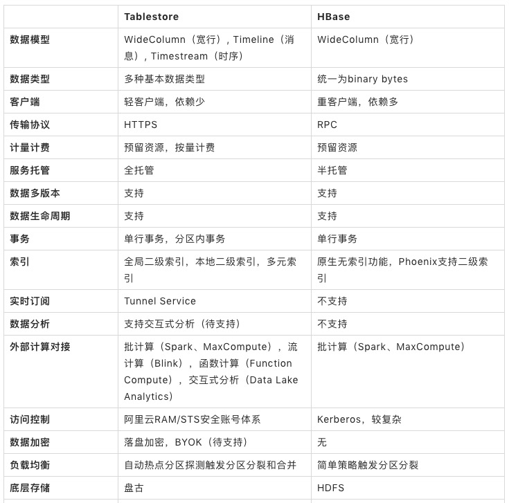


# Tablestore存储和索引引擎详解

Tablestore可以支撑海量的数据规模，也提供了多种索引来支持丰富的查询模式，同时作为一个多模型数据库，提供了多种模型的抽象和特有接口。

## 基本架构

Tablestore是一款云上的Serverless的分布式NoSQL多模型数据库，提供了丰富的功能。


整体架构如下图所示

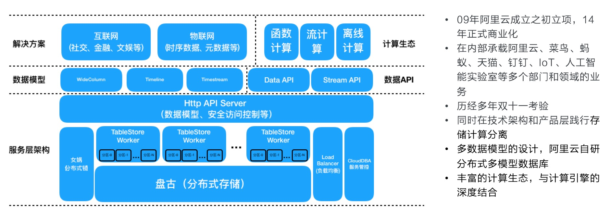


在服务端引擎层中，存在两个引擎：**存储引擎和索引引擎。**

这两个引擎的**数据结构和原理不同**，为了方便理解，本文将这两个引擎称为表引擎(Table)和多元索引引擎(Searchindex)。

整体来说，引擎层是基于LSM架构和共享存储(盘古)，支持自动的Sharding和存储计算分离。


## 表引擎

表引擎的整体架构类似于Google的BigTable，在开源领域的实现有HBase等。

数据模型可以定义为宽行模型，如下图所示。其中不同的分区可以加载到不同的机器上，实现水平扩展：

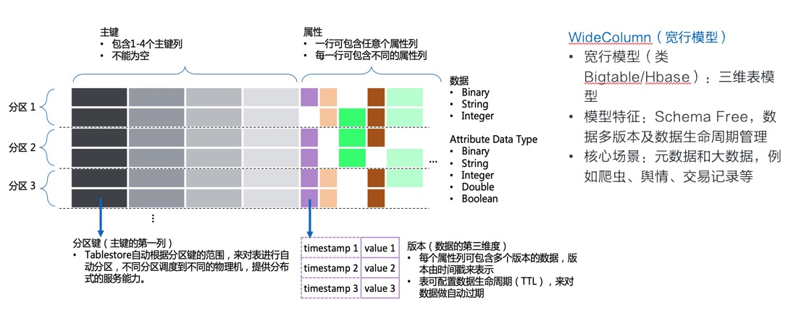

首先说明一下为什么Tablestore的主键可以包含多个主键列，而像HBase只有一个RowKey。这里有几点：

1. **多列主键列按照顺序共同构成一个主键**，类似MySQL的联合主键。如果使用过HBase，可以把这里的多列主键列，拼接起来看作一个RowKey，每一列其实都只是整体主键的一部分。
2. **第一列主键列是分区键**，使用分区键的范围进行分区划分，保证了分区键相同的行，一定在同一个分区(Partition)上。一些功能依赖这一特性，比如分区内事务(Transection)，本地二级索引(LocalIndex, 待发布)，分区内自增列等。
3. 业务上常需要多个字段来构成主键，如果只支持一个主键列，业务需要进行拼接，多列主键列**避免了业务层做主键拼接和拆解**。
4. 许多用户第一次看到多列主键列时，常会有误解，认为主键的范围查询(GetRange接口)可以针对每一列单独进行，实际上这里的**主键范围指的是整体主键的范围，而非单独某一列的范围**。

这个模型具有这样的一些优势：

1. **完全水平扩展**，因此可支撑的**读写并发和数据规模几乎无上限**。Tablestore线上也有一些业务在几千万级的tps/qps，以及10PB级的存储量。可以说一般业务达不到这样的上限，实际的上限仅取决于集群目前的机器资源，当业务数据量大量上涨时，只要增加机器资源即可。同时，基于共享存储的架构也很方便的实现了动态负载均衡，不需要数据库层进行副本数据复制。
2. 提供了**表模型**，相比纯粹的KeyValue数据库而言，**具有列和多版本的概念**，可以单独对某列进行读写。表模型也是一种比较通用的模型，可以方便与其他系统进行数据模型映射。
3. 表模型中，**按照主键有序存储**，而非Hash映射，因此**支持主键的范围扫描**。类似于HashMap与SortedMap的区别，这个模型中为SortedMap。
4. **Schema Free**, 即每行可以有不同的属性列，数据列个数也不限制。这很适合存储半结构化的数据，同时业务在运行过程中，也可以进行任意的属性列变更。
5. 支持**数据自动过期和多版本**。每列都可以存储多个版本的值，每个值会有一个版本号，同时也是一个时间戳，如果设置了数据自动过期，就会按照这个时间戳来判断数据是否过期，后台对过期数据自动清理。

这个模型也有一些劣势：

1. **数据查询依赖主键**。可以把这个数据模型理解为SortedMap，大家知道，在SortedMap上只能做点查和顺/逆序扫描，比如以下查询方式：
   1. **主键点查**：通过已知主键，精确读取表上的一行。
   2. **主键范围查**：按照顺序从开始主键(StartPrimaryKey)扫描到结束主键(EndPrimaryKey)，或者逆序扫描。即对Table进行顺序或逆序遍历，支持指定起始位置和结束位置。
   3. **主键前缀范围查**：其实等价于主键范围查，这里只是说明，主键前缀的一个范围，其实可以转换成主键的一个范围，在表上进行顺序扫描即可。
2. 针对属性列的查询需要使用Filter，**Filter模式在过滤大量数据时效率不高，甚至变成全表扫描**。通常来说，数据查询的效率与底层扫描的数据量正相关，而底层扫描的数据量取决于数据分布和结构。数据默认仅按照主键有序存储，那么要按照某一属性列查询，符合条件的数据必然分布于全表的范围内，需要扫描后筛选。全表数据越多，扫描的数据量也就越大，效率也就越低。

那么在实际业务中，主键查询常常不能满足需求，而使用Filter在数据规模大的情况下效率很低，怎么解决这一问题呢？

上面提到，数据查询的效率与底层扫描的数据量正相关，而Filter模式慢在符合条件的数据太分散，必须扫描大量的数据并从中筛选。那么解决这一问题也就有两种思路：

1. **让符合条件的数据不再分散分布**：使用全局二级索引，将某列或某几列作为二级索引的主键。相当于通过数据冗余，直接把符合条件的数据预先排在一起，查询时直接精确定位和扫描，效率极高。
2. **加快筛选的速度：** 使用多元索引，多元索引底层提供了倒排索引，BKD-Tree等数据结构。以上面查询某属性列值为例，我们给这一列建立多元索引后，就会给这一列的值建立倒排索引，倒排索引实际上记录了某个值对应的所有主键的集合，即Value -> List, 那么要查询属性列为某个Value的所有记录时，直接通过倒排索引获取所有符合条件的主键，进行读取即可。本质上是加快了从海量数据中筛选数据的效率。

## 全局二级索引

全局二级索引采用的仍然是表引擎，给主表建立了全局二级索引后，相当于多了一张索引表。这张索引表相当于**给主表提供了另外一种排序的方式**，即针对查询条件预先设计了一种数据分布，来加快数据查询的效率。索引的使用方式与主表类似，主要的查询方式仍然是上面讲的主键点查，主键范围查，主键前缀范围查。常见的关系型数据库的二级索引也是类似的原理。

列举一个最简单的例子，比如我们有一张表存储文件的MD5和SHA1值，表结构如下：

| FilePath(主键列)      | MD5(属性列)                      | SHA1(属性列)                             |
| :-------------------- | :------------------------------- | :--------------------------------------- |
| oss://abc/files/1.txt | 0cc175b9c0f1b6a831c399e269772661 | 86f7e437faa5a7fce15d1ddcb9eaeaea377667b8 |
| oss://abc/files/2.txt | 92eb5ffee6ae2fec3ad71c777531578f | e9d71f5ee7c92d6dc9e92ffdad17b8bd49418f98 |
| oss://abc/files/3.txt | 4a8a08f09d37b73795649038408b5f33 | 84a516841ba77a5b4648de2cd0dfcb30ea46dbb4 |

通过这张表，我们可以查询文件对应的MD5和SHA1值，但是**通过MD5或SHA1反查文件名却不容易**。我们可以给这张表建立两张全局二级索引表，表结构分别为：

索引1:

| MD5(主键列1)                     | FilePath(主键列2)     |
| :------------------------------- | :-------------------- |
| 0cc175b9c0f1b6a831c399e269772661 | oss://abc/files/1.txt |
| 4a8a08f09d37b73795649038408b5f33 | oss://abc/files/3.txt |
| 92eb5ffee6ae2fec3ad71c777531578f | oss://abc/files/2.txt |

索引2:

| SHA1(主键列1)                            | FilePath(主键列2)     |
| :--------------------------------------- | :-------------------- |
| 84a516841ba77a5b4648de2cd0dfcb30ea46dbb4 | oss://abc/files/3.txt |
| 86f7e437faa5a7fce15d1ddcb9eaeaea377667b8 | oss://abc/files/1.txt |
| e9d71f5ee7c92d6dc9e92ffdad17b8bd49418f98 | oss://abc/files/2.txt |
|                                          |                       |

为了确保主键的唯一性，全局二级索引中，会将原主键的主键列也放到主键列中，比如上面的FilePath列。有了上面两张索引表，就可以通过**主键前缀范围查**的方式里精确定位某个MD5/SHA1对应的文件名了。

## 多元索引引擎

多元索引引擎相比于表引擎，底层增加了倒排索引，多维空间索引等，支持**多条件组合查询、模糊查询、地理空间查询，以及全文索引**等，还提供一些**统计聚合**能力(统计聚合功能待发布)。因为功能较单纯的二级索引更加丰富，而且一个索引就可以满足多种维度的查询，因此命名为多元索引。

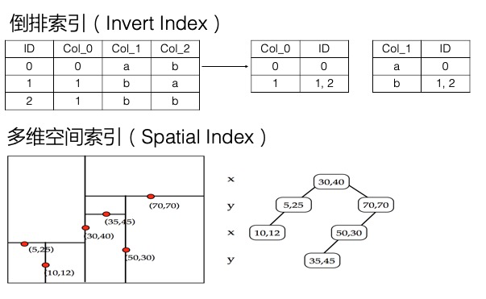

上面在讲解决Filter模式查询慢的问题时，提到倒排索引加快了数据筛选的速度，因为记录了某列的Value到符合条件的行的映射，Value -> List 。实际上，倒排索引这一方式，不仅可以解决单列值的检索问题，也可以解决**多条件组合查询**的问题。

我们举一个订单场景的例子，比如下表为一个订单记录：

| 订单号      | 订单（md5）（主键）              | 消费者编号 | 消费者姓名 | 售货员编号 | 售货员姓名 | 产品编号 | 产品名   | 产品品牌 | 产品类型 | 下单时间            | 支付时间 | 支付状态 | 产品单价 | 数量 | 总价钱  |
| :---------- | :------------------------------- | :--------- | :--------- | :--------- | :--------- | :------- | :------- | :------- | :------- | :------------------ | :------- | :------- | :------- | :--- | :------ |
| o0000000000 | c49f5fd5aba33159accae0d3ecd749a7 | c0019      | 消陈九     | s0020      | 售楚十     | p0003004 | vivo x21 | vivo     | 手机     | 2018-07-17 21:00:00 |          | 否       | 2498.99  | 2    | 4997.98 |

上面一共16个字段，我们希望**按照任意多个字段组合查询**，比如查询某一售货员、某一产品类型、单价在xx元之上的所有记录。可以想到，这样的排列组合会有非常多种，因此我们不太可能预先将任何一种查询条件的数据放到一起，来加快查询的效率，这需要建立很多的全局二级索引。而如果采用Filter模型，又很可能需要扫描全表，效率不高。折中的方式是，可以先对某个字段建立二级索引，缩小数据范围，再对其中数据进行Filter。那么有没有更好的方式呢？

多元索引可以很好的解决这一问题，而且只需要建立一个多元索引，将所有可能查询的列加入到这个多元索引中即可，加入的顺序也没有要求。多元索引中的每一列默认都会建立倒排，倒排就记录了Value到List的映射。针对多列的多个条件，在每列的倒排表中找到对应的List，这个称为一个倒排链，而**筛选符合多个条件的数据即为计算多个倒排链的交并集**，这里底层有着大量的优化，可以高效的实现这一操作。因此多元索引在处理多条件组合查询方面效率很高。

此外，多元索引还支持全文索引、模糊查询、地理空间查询等，以地理空间查询为例，多元索引通过底层的BKD-Tree结构，支持高效的查询一个地理多边形内的点，也支持按照地理位置排序、聚合统计等。

## 索引选择

### 不是一定需要索引

1. 如果基于主键和主键范围查询的功能已经可以满足业务需求，那么不需要建立索引。
2. 如果对某个范围内进行筛选，范围内数据量不大或者查询频率不高，可以使用Filter，不需要建立索引。
3. 如果是某种复杂查询，执行频率较低，对延迟不敏感，可以考虑通过DLA(数据湖分析)服务访问Tablestore，使用SQL进行查询。

### 全局二级索引还是多元索引

1. 一个全局二级索引是一个索引表，类似于主表，其提供了另一种数据分布方式，或者认为是另一种主键排序方式。**一个索引对应一种查询条件，预先将符合查询条件的数据排列在一起，查询效率很高**。索引表可支撑的数据规模与主表相同，另一方面，全局二级索引的主键设计也同样需要考虑散列问题。
2. 一个多元索引是一系列数据结构的组合，其中的每一列都支持建立倒排索引等结构，查询时可以按照其中任意一列进行排序。**一个多元索引可以支持多种查询条件**，不需要对不同查询条件建立多个多元索引。相比全局二级索引，也支持多条件组合查询、模糊查询、全文索引、地理位置查询等。多元索引本质上是通过各种数据结构加快了数据的筛选过程，功能非常丰富，但在数据按照某种固定顺序读取这种场景上，效率不如全局二级索引。多元索引的查询效率与倒排链长度等因素相关，即查询性能与整个表的全量数据规模有关，在数据规模达到百亿行以上时，建议使用RoutingKey对数据进行分片，查询时也通过指定RoutingKey查询来减少查询涉及到的数据量。简而言之，查询灵活度和数据规模不可兼得。

关于使用多元索引还是全局二级索引，也有另外一篇文章描述：[《Tablestore索引功能详解》](https://yq.aliyun.com/articles/692837)。

> 除了全局二级索引之外，后续还会推出本地二级索引(LocalIndex)。

### 常见组合方案

丰富的查询功能当然是业务都希望具备的，但是在数据规模很大的情况下，灵活的查询意味着成本。比如万亿行数据的规模，对于表引擎来说，因为水平扩展能力很强，成本也很低，问题不大，但是建立多元索引，费用就会非常高昂。全局二级索引成本较低，但是只适合固定维度的查询。

常见的超大规模数据，都带有一些时间属性，比如大量设备产生的数据(监控数据)，或者人产生的数据(消息、行为数据等)，这类数据非常适合采用Tablestore存储。对这类数据建立索引，会有一些组合方案：

1. 对元数据表建立多元索引，全量数据表不建立索引或采用全局二级索引。
   1. 元数据表可以是产生数据的主体表，比如设备信息表，用户信息表等。在时序模型中，产生数据的主体也可以认为是一个时间线，这条线会不断的产生新的点。
   2. Tablestore的时序数据模型(Timestream)采用的也是类似的方式，对时序数据中的时间线建立一张表，专门用来记录时间线的元数据，每个时间线一行。时间线表建立多元索引，用来做时间线检索，而全量数据则不建立索引。在检索到时间线后，对某个时间线下的数据进行范围扫描，来读取这个时间线的数据。
2. 热数据建立多元索引，老数据不建立索引或者采用全局二级索引：
   1. 很多情况下仅需要对非常热的数据进行多种维度查询，对冷数据采取固定维度查询即可。因此冷热分离可以给业务提供更高的性价比。
   2. 目前多元索引还不支持TTL(后续会支持)，需要业务层区分热数据和冷数据。