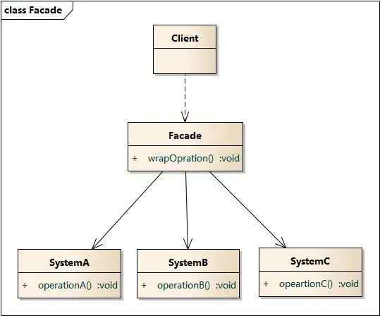
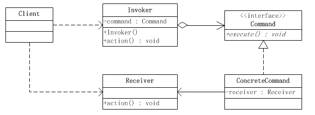
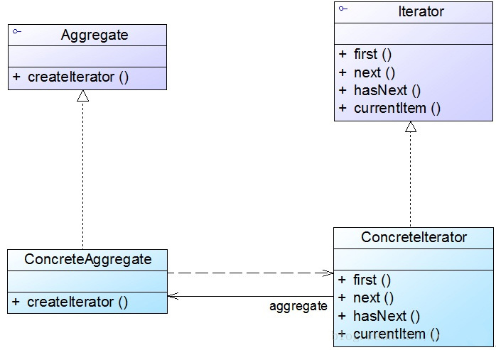
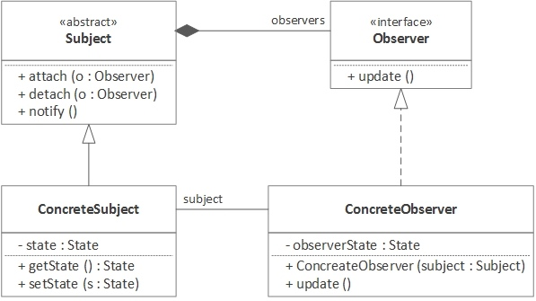
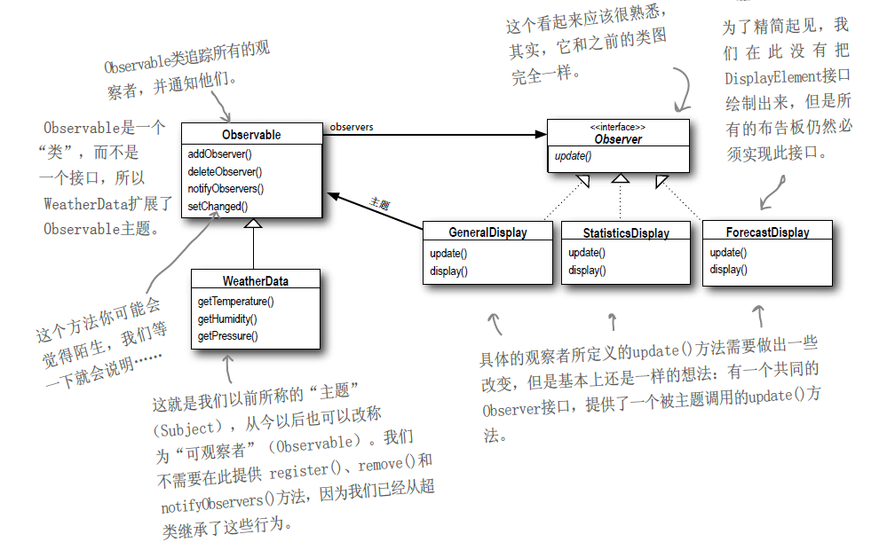

# 设计模式六大原则

- 开闭原则
- 里式替换原则
- 依赖倒置原则
- 接口隔离原则
- 迪米特法则
- 合成复用原则


# 创建型模式

- 工厂模式（Factory Pattern）
- 静态工厂模式 （Static Factory）
- 抽象工厂模式（Abstract Factory Pattern）
- 单例模式（Singleton Pattern）
- 建造者模式（Builder Pattern）


## 单例模式

确保一个类只有一个实例，并为整个系统提供一个全局访问点的一种模式方法。

特点：

1、构造方法私有化

2、实例化的变量引用私有化

3、获取实例的方法共有


### 创建实例

饿汉式、懒汉式、双重校验锁、静态内部类、枚举、CAS


#### 饿汉式

```java
public class HungrySingleton {
    // 1.必须是 static
    private static HungrySingleton instance = new HungrySingleton();

    // 必须是私有构造
    private HungrySingleton() { }

    public static HungrySingleton getInstance() {
        return instance;
    }
}
```

问题

> 1.没有synchronized关键字同步，如何做到单例的-->类加载器classLoader在加载时候(loadClass())通过synchronized关键字保证同步
>
> 2.通过反射可以破坏吗
>
> 3.通过序列化可以破坏吗

#### 懒汉式

#### 双重校验锁

#### 静态内部类

#### 枚举

```java
/**
 * 枚举enum和静态代码块的特性相似，在使用枚举时，构造方法会被自动调用，利用这一特性也可以实现单例
 *
 * JVM 会阻止反射获取枚举类的私有构造方法。
 */
public enum EnumSingleton {

    INSTANCE;

    public void func1(){
        System.out.println("func1");
    }
    public void func2(){
        System.out.println("func2");
    }
    // ......

    public static void main(String[] args) {
        EnumSingleton.INSTANCE.func1();
        EnumSingleton.INSTANCE.func2();
    }
}

/*
Java规范字规定，每个枚举类型及其定义的枚举变量在JVM中都是唯一的，因此在枚举类型的序列化和反序列化上，
Java做了特殊的规定。在序列化的时候Java仅仅是将枚举对象的name属性输到结果中，反序列化的时候则是通过
java.lang.Enum的valueOf()方法来根据名字查找枚举对象。也就是说，序列化的时候只将DATASOURCE这个名称输出，
反序列化的时候再通过这个名称，查找对应的枚举类型，因此反序列化后的实例也会和之前被序列化的对象实例相同。
 */

```


#### CAS


### 应用实例


# 结构型模式

- 适配器模式（Adapter Pattern）
- 装饰器模式（Decorator Pattern）
- 外观模式/门面模式 （Facade Pattern）
- 桥接模式（Bridge Pattern）
- 组合模式（Composite Pattern）
- 代理模式（Proxy Pattern）

## 适配器模式

### 类图

<font color=#dd0000>将一个类的接口转换成客户希望的另外一个接口。</font>适配器模式使得原本由于接口不兼容而不能一起工作的那些类可以一起工作。


### 示例

```java
// 客户端使用的接口
public interface Target {
     /*
     * 客户端请求处理的方法
     */
    public void request();
}

// 被适配的对象
public class Adaptee {
     /*
     * 原本存在的方法
     */
    public void specificRequest(){
    }
}

// 适配器实现
public class Adapter implements Target{
     /*
     * 持有需要被适配的接口对象
     */
    private Adaptee adaptee;
    /*
     * 构造方法，传入需要被适配的对象
     * @param adaptee 需要被适配的对象
     */
    public Adapter(Adaptee adaptee){
    	this.adaptee = adaptee;
    }
    @Override
    public void request() {
        adaptee.specificRequest();
    }
}

/*
 * 使用适配器的客户端
 */
public class Client {
    public static void main(String[] args){
        //创建需要被适配的对象
        Adaptee adaptee = new Adaptee();
        //创建客户端需要调用的接口对象
        Target target = new Adapter(adaptee);
        //请求处理
        target.request();
    }
}
```

### 应用

```java
java.io.InputStreamReader(InputStream)//字符流和字节流的转换
java.io.OutputStreamWriter(OutputStream)//字节流和字符流的转换
java.io.FilterInputStream
```


## 装饰器模式

<font color=#dd0000>动态地给一个对象增加一些额外的职责</font>，相比于使用继承，装饰模式比生成子类实现更为灵活。

### 类图


- 抽象构件(Component)角色：给出一个抽象接口，以规范准备接收附加责任的对象。

- 具体构件(ConcreteComponent)角色：定义一个将要接收附加责任的类。

- 装饰(Decorator)角色：持有一个构件(Component)对象的实例，并定义一个与抽象构件接口一致的接口。

- 具体装饰(ConcreteDecorator)角色：负责给构件对象“贴上”附加的责任。


### 示例

```java
public interface Component {   
    public void sampleOperation();
}
```


```java
public class ConcreteComponent implements Component {
    @Override
    public void sampleOperation() {
        // 写相关的业务代码
    }
}
```


```java
public class Decorator implements Component{
    private Component component;
    
    public Decorator(Component component){
        this.component = component;
    }

    @Override
    public void sampleOperation() {
        // 委派给构件
        component.sampleOperation();
    }
}
```


```java
public class ConcreteDecoratorA extends Decorator {

    public ConcreteDecoratorA(Component component) {
        super(component);
    }
    
    @Override
    public void sampleOperation() {
      // 写相关的业务代码
　　　super.sampleOperation();
     // 写相关的业务代码
    }
}

public class ConcreteDecoratorB extends Decorator {

    public ConcreteDecoratorB(Component component) {
        super(component);
    }
    
    @Override
    public void sampleOperation() {
      // 写相关的业务代码
　　　super.sampleOperation();
     // 写相关的业务代码
    }
}
```


```java
public class Main {
    public static void main(String[] args) {
        Component component = new ConcreteComponent();
        component.sampleOperation();

        System.out.println("....................................................");

        Component dec = new ConcreteDecoratorB(new ConcreteDecoratorA(new ConcreteComponent()));
        dec.sampleOperation();
    }
}
```


### 应用

- 抽象构件(Component)角色：由InputStream扮演。这是一个抽象类，为各种子类型提供统一的接口。

- 具体构件(ConcreteComponent)角色：由ByteArrayInputStream、FileInputStream、PipedInputStream、StringBufferInputStream等类扮演。它们实现了抽象构件角色所规定的接口。

- 抽象装饰(Decorator)角色：由FilterInputStream扮演。它实现了InputStream所规定的接口。

- 具体装饰(ConcreteDecorator)角色：由几个类扮演，分别是BufferedInputStream、DataInputStream以及两个不常用到的类LineNumberInputStream、PushbackInputStream。


### 半透明的装饰者模式

装饰者模式和适配器模式都是“包装模式(Wrapper Pattern)”，它们都是通过封装其他对象达到设计的目的的，但是它们的形态有很大区别。

理想的装饰者模式在对被装饰对象进行功能增强的同时，要求具体构件角色、装饰角色的接口与抽象构件角色的接口完全一致。而适配器模式则不然，一般而言，适配器模式并不要求对源对象的功能进行增强，但是会改变源对象的接口，以便和目标接口相符合。

装饰者模式有透明和半透明两种，这两种的区别就在于装饰角色的接口与抽象构件角色的接口是否完全一致。透明的装饰者模式也就是理想的装饰者模式，要求具体构件角色、装饰角色的接口与抽象构件角色的接口完全一致。相反，如果装饰角色的接口与抽象构件角色接口不一致，也就是说装饰角色的接口比抽象构件角色的接口宽的话，装饰角色实际上已经成了一个适配器角色，这种装饰者模式也是可以接受的，称为“半透明”的装饰模式，如下图所示。


在适配器模式里面，适配器类的接口通常会与目标类的接口重叠，但往往并不完全相同。换言之，适配器类的接口会比被装饰的目标类接口宽。

显然，半透明的装饰者模式实际上就是处于适配器模式与装饰者模式之间的灰色地带。如果将装饰者模式与适配器模式合并成为一个“包装模式”的话，那么半透明的装饰者模式倒可以成为这种合并后的“包装模式”的代表。


## 外观模式/门面模式

外部与一个子系统的通信必须通过一个统一的外观对象进行，为子系统中的一组接口提供一个一致的界面，<font color=#dd0000>外观模式定义了一个高层接口，这个接口使得这一子系统更加容易使用。简单的来说就是对外提供一个简单接口，隐藏实现的逻辑。</font>

它通过引入一个外观角色来简化客户端与子系统之间的交互，为复杂的子系统调用提供一个统一的入口，降低子系统与客户端的耦合度，且客户端调用非常方便。

外观模式的目的不是给予子系统添加新的功能接口，而是为了让外部减少与子系统内多个模块的交互，松散耦合，从而让外部能够更简单地使用子系统。


### 类图




- Facade: 外观角色
- SubSystem:子系统角色
- client：客户端


### 示例

电脑的电源键，我们只需按电源键，就可以让它启动或者关闭，无需知道它是怎么启动的(启动CPU、启动内存、启动硬盘)，怎么关闭的(关闭硬盘、关闭内存、关闭CPU)；

```java
/**
 * 子系统角色类
 * 电脑CPU
 */
public class CPU {
    public void startUp(){
        System.out.println("cpu is  startUp...");
    }
    public void shutDown(){
        System.out.println("cpu is  shutDown...");

    }
}

/**
 * 子系统角色类
 * 电脑硬盘
 */
public class Disk {
    public void startUp() {
        System.out.println("disk is  startUp...");
    }

    public void shutDown() {
        System.out.println("disk is  shutDown...");

    }
}

/**
 * 子系统角色类
 * 电脑内存
 */
public class Memory {
    public void startUp() {
        System.out.println("memory is  startUp...");
    }

    public void shutDown() {
        System.out.println("memory is  shutDown...");

    }
}

/**
 * 外观角色
 * 电脑
 * 用户通过操作当前类即可达到操作所有子系统的目的
 */
public class Computer {
    private CPU cpu;
    private Disk disk;
    private Memory memory;

    public Computer() {
        cpu = new CPU();
        disk = new Disk();
        memory = new Memory();
    }

    public void startUp() {
        cpu.startUp();
        disk.startUp();
        memory.startUp();
    }

    public void shutDown() {
        cpu.shutDown();
        disk.shutDown();
        memory.shutDown();
    }
}

/**
 * 外观模式 测试类
 */
public class FacedeTest {
    @Test
    public void facedeTest() {
        Computer computer = new Computer();
        computer.startUp();
        System.out.println("------------------");
        computer.shutDown();
    }
}
```


EncryptFacade充当外观类，FileReader、CipherMachine和FileWriter充当子系统类

```java
//文件读取类：子系统类
class FileReader {
	public String read(String fileNameSrc) {
		System.out.print("读取文件，获取明文：");
		StringBuffer sb = new StringBuffer();
		try{
			FileInputStream inFS = new FileInputStream(fileNameSrc);		
			int data;
    		while((data = inFS.read())! = -1) {
    			sb = sb.append((char)data);
    		}
     		inFS.close();
     		System.out.println(sb.toString());
		}
		catch(FileNotFoundException e) {
			System.out.println("文件不存在！");
		}
		catch(IOException e) {
			System.out.println("文件操作错误！");
		}
		return sb.toString();
	}
}

//数据加密类：子系统类
class CipherMachine {
	public String encrypt(String plainText) {
		System.out.print("数据加密，将明文转换为密文：");
		String es = "";
		for(int i = 0; i < plainText.length(); i++) {
			String c = String.valueOf(plainText.charAt(i) % 7);
			es += c;
		}
		System.out.println(es);
		return es;
	}
}

//文件保存类：子系统类
class FileWriter {
	public void write(String encryptStr,String fileNameDes) {
		System.out.println("保存密文，写入文件。");
		try{
     		FileOutputStream outFS = new FileOutputStream(fileNameDes);
      		outFS.write(encryptStr.getBytes());
      		outFS.close();
		}	
		catch(FileNotFoundException e) {
			System.out.println("文件不存在！");
		}
		catch(IOException e) {
			System.out.println("文件操作错误！");
		}		
	}
}

//加密外观类：外观类
class EncryptFacade {
    //维持对其他对象的引用
	private FileReader reader;
	private CipherMachine cipher;
	private FileWriter writer;
	
	public EncryptFacade() {
		reader = new FileReader();
		cipher = new CipherMachine();
		writer = new FileWriter();
	}
	
    //调用其他对象的业务方法
	public void fileEncrypt(String fileNameSrc, String fileNameDes) {
		String plainStr = reader.read(fileNameSrc);
		String encryptStr = cipher.encrypt(plainStr);
		writer.write(encryptStr,fileNameDes);
	}
}

class Client {
	public static void main(String args[]) {
		EncryptFacade ef = new EncryptFacade();
		ef.fileEncrypt("facade/src.txt","facade/des.txt");
	}
}
```


### 应用

#### spring JDBC 中的外观模式

`org.springframework.jdbc.support.JdbcUtils`

#### Mybatis中的外观模式

`org.apache.ibatis.session.Configuration` 类中以 `new` 开头的方法

#### Tomcat 中的外观模式

`org.apache.catalina.connector.Request` 和 `org.apache.catalina.connector.RequestFacade` 这两个类都实现了 `HttpServletRequest` 接口

在 `Request` 中调用 `getRequest()` 实际获取的是 `RequestFacade` 的对象

```java
protected RequestFacade facade = null;

public HttpServletRequest getRequest() {
    if (facade == null) {
        facade = new RequestFacade(this);
    }
    return facade;
}
```

在 `RequestFacade` 中再对认为是子系统的操作进行封装

```java
public class RequestFacade implements HttpServletRequest {
    /**
     * The wrapped request.
     */
    protected Request request = null;
    
    @Override
    public Object getAttribute(String name) {
        if (request == null) {
            throw new IllegalStateException(sm.getString("requestFacade.nullRequest"));
        }
        return request.getAttribute(name);
    }
    // ...省略...
}
```

#### SLF4J 中的外观模式

`SLF4J` 是简单的日志外观模式框架，抽象了各种日志框架例如 `Logback`、`Log4j`、`Commons-logging` 和 `JDK` 自带的 `logging` 实现接口。它使得用户可以在部署时使用自己想要的日志框架。

`SLF4J` **没有替代任何日志框架，它仅仅是标准日志框架的外观模式**。如果在类路径下除了 `SLF4J` 再没有任何日志框架，那么默认状态是在控制台输出日志。

> 日志处理框架 Logback 是 Log4j 的改进版本，原生支持SLF4J（因为是同一作者开发的），因此 Logback＋SLF4J 的组合是日志框架的最佳选择，比 SLF4J+其它日志框架 的组合要快一些。而且Logback的配置可以是XML或Groovy代码。


## 桥接模式

桥接（Bridge）是用于把抽象化与实现化解耦，使得二者可以独立变化。它通过提供抽象化和实现化之间的桥接结构，来实现二者的解耦。

这种模式涉及到一个作为桥接的接口，使得实体类的功能独立于接口实现类。这两种类型的类可被结构化改变而互不影响。又称为柄体（Handle and Body）模式或接口（Interface）模式

> 桥接模式（Bridge Pattern），将抽象部分与它的实现部分分离，使它们都可以独立地变化。更容易理解的表述是：实现系统可从多种维度分类，桥接模式将各维度抽象出来，各维度独立变化，之后可通过聚合，将各维度组合起来，减少了各维度间的耦合。


**主要解决**：

在有多种可能会变化的情况下，用继承会造成类爆炸问题，扩展起来不灵活。体现了<font color=#dd0000>组合优先于继承的思想</font>


### 类图


- 抽象化(Abstraction)角色

> 抽象化给出的定义，并保存一个对实现化对象的引用。
>
> 用于定义抽象类的接口，它一般是抽象类而不是接口，其中定义了一个Implementor（实现类接口）类型的对象并可以维护该对象，它与Implementor之间具有关联关系，它既可以包含抽象业务方法，也可以包含具体业务方法。

- 扩充抽象化(RefinedAbstraction)角色

> 扩展抽象化角色，改变修正父类对抽象化的定义。
>
> 扩充由Abstraction定义的接口，通常情况下它不再是抽象类而是具体类，它实现了在Abstraction中声明的抽象业务方法，在RefinedAbstraction中可以调用在Implementor中定义的业务方法。

- 实现化(Implementor)角色

> 这个角色给出实现化角色的接口，但不给出具体的实现。
>
> 定义实现类的接口，这个接口不一定要与Abstraction的接口完全一致，事实上这两个接口可以完全不同，一般而言，Implementor接口仅提供基本操作，而Abstraction定义的接口可能会做更多更复杂的操作。Implementor接口对这些基本操作进行了声明，而具体实现交给其子类。通过关联关系，在Abstraction中不仅拥有自己的方法，还可以调用到Implementor中定义的方法，使用关联关系来替代继承关系。

- 具体实现化(ConcreteImplementor)角色

> 这个角色给出实现化角色接口的具体实现。
>
> 具体实现Implementor接口，在不同的ConcreteImplementor中提供基本操作的不同实现，在程序运行时，ConcreteImplementor对象将替换其父类对象，提供给抽象类具体的业务操作方法。


### 示例

汽车可按品牌分（本例中只考虑BMT，BenZ，Land Rover），也可按手动档、自动档、手自一体来分。

使用继承方式的类图如下


对于每种组合都需要创建一个具体类，如果有N个维度，每个维度有M种变化，则需要MNMN个具体类，类非常多，并且非常多的重复功能。

如果某一维度，如Transmission多一种可能，比如手自一体档（AMT），则需要增加3个类，BMWAMT，BenZAMT，LandRoverAMT。


桥接模式类图


当把每个维度拆分开来，只需要M*N个类，并且由于每个维度独立变化，基本不会出现重复代码。

此时如果增加手自一体档，只需要增加一个AMT类即可


```java
import org.slf4j.Logger;
import org.slf4j.LoggerFactory;

/**
 * @program: java-sample
 * @description: 桥接模式
 * @author: baijd-a
 * @create: 2020-07-28 20:09
 **/
abstract class AbstractCar {
    protected Transmission gear;
    public abstract void run();
    public void setTransmission(Transmission gear) {
        this.gear = gear;
    }
}

class BMWCar extends AbstractCar{
    private static final Logger LOG = LoggerFactory.getLogger(BMWCar.class);
    @Override
    public void run() {
        gear.gear();
        LOG.info("BMW is running");
    };
}

class BenZCar extends AbstractCar{
    private static final Logger LOG = LoggerFactory.getLogger(BenZCar.class);
    @Override
    public void run() {
        gear.gear();
        LOG.info("BenZCar is running");
    };
}

class LandRoverCar extends AbstractCar{
    private static final Logger LOG = LoggerFactory.getLogger(LandRoverCar.class);
    @Override
    public void run() {
        gear.gear();
        LOG.info("LandRoverCar is running");
    }
}

abstract class Transmission{
    public abstract void gear();
}

class Manual extends Transmission {
    private static final Logger LOG = LoggerFactory.getLogger(Manual.class);
    @Override
    public void gear() {
        LOG.info("Manual transmission");
    }
}

class Auto extends Transmission {
    private static final Logger LOG = LoggerFactory.getLogger(Auto.class);
    @Override
    public void gear() {
        LOG.info("Auto transmission");
    }
}


public class BridgeTest {
    public static void main(String[] args) {
        Transmission auto = new Auto();
        AbstractCar bmw = new BMWCar();
        bmw.setTransmission(auto);
        bmw.run();

        Transmission manual = new Manual();
        AbstractCar benz = new BenZCar();
        benz.setTransmission(manual);
        benz.run();
    }
}
```


电脑问题示例


将这个场景中的两个变化的维度分离，品牌和类型。两者通过桥接进行两两组合。


### 应用

桥梁模式在Java应用中的一个非常典型的例子就是JDBC驱动器。抽象API可以对各种数据库引擎发出SQL指令，并不直接与数据库引擎互动，JDBC驱动器负责这个底层的工作。


## 组合模式

组合模式对单个对象(叶子对象)和组合对象(容器对象)具有一致性，它将对象组织到树结构中，可以用来描述整体与部分的关系。同时它也模糊了简单元素(叶子对象)和复杂元素(容器对象)的概念，使得客户能够像处理简单元素一样来处理复杂元素，从而使客户程序能够与复杂元素的内部结构解耦。


### 主要解决的问题


### 类图


**抽象构件(Component)角色：**这是一个抽象角色，它给参加组合的对象定义出公共的接口及其默认行为，可以用来管理所有的子对象。组合对象通常把它所包含的子对象当做类型为`Component`的对象。在安全式的组合模式里，构建角色并不定义出管理子对象的方法，这一定义由树枝构件对象给出。

**树叶构件(Leaf)角色：**树叶对象没有下级子对象的对象，定义出参加组合的原始对象的行为。

**树枝构件(Composite)角色：**代表参加组合的有下级子对象的对象。树枝构件类给出所有的管理子对象的方法，如`add()`、`remove()`、以及`getChild()`等。


### 示例

```java
import java.util.ArrayList;
import java.util.List;

/**
 * @program: java-sample
 * @description: 文件/文件夹组合模式
 * @author: baijd-a
 * @create: 2020-07-30 19:54
 **/
public class FileCompositeTest {
    //抽象文件类：抽象构件
    abstract static class AbstractFile {
        public abstract void add(AbstractFile file);

        public abstract void remove(AbstractFile file);

        public abstract AbstractFile getChild(int i);

        public abstract void killVirus();
    }

    //图像文件类：叶子构件
    static class ImageFile extends AbstractFile {
        private String name;

        public ImageFile(String name) {
            this.name = name;
        }

        @Override
        public void add(AbstractFile file) {
            System.out.println("对不起，不支持该方法！");
        }

        @Override
        public void remove(AbstractFile file) {
            System.out.println("对不起，不支持该方法！");
        }

        @Override
        public AbstractFile getChild(int i) {
            System.out.println("对不起，不支持该方法！");
            return null;
        }

        @Override
        public void killVirus() {
            //模拟杀毒
            System.out.println("----对图像文件'" + name + "'进行杀毒");
        }
    }

    //文本文件类：叶子构件
    static class TextFile extends AbstractFile {
        private String name;

        public TextFile(String name) {
            this.name = name;
        }

        @Override
        public void add(AbstractFile file) {
            System.out.println("对不起，不支持该方法！");
        }

        @Override
        public void remove(AbstractFile file) {
            System.out.println("对不起，不支持该方法！");
        }

        @Override
        public AbstractFile getChild(int i) {
            System.out.println("对不起，不支持该方法！");
            return null;
        }

        @Override
        public void killVirus() {
            //模拟杀毒
            System.out.println("----对文本文件'" + name + "'进行杀毒");
        }
    }

    //视频文件类：叶子构件
    static class VideoFile extends AbstractFile {
        private String name;

        public VideoFile(String name) {
            this.name = name;
        }

        @Override
        public void add(AbstractFile file) {
            System.out.println("对不起，不支持该方法！");
        }

        @Override
        public void remove(AbstractFile file) {
            System.out.println("对不起，不支持该方法！");
        }

        @Override
        public AbstractFile getChild(int i) {
            System.out.println("对不起，不支持该方法！");
            return null;
        }

        @Override
        public void killVirus() {
            //模拟杀毒
            System.out.println("----对视频文件'" + name + "'进行杀毒");
        }
    }

    //文件夹类：容器构件
    static class Folder extends AbstractFile {
        //定义集合fileList，用于存储AbstractFile类型的成员
        private List<AbstractFile> fileList = new ArrayList<AbstractFile>();
        private String name;

        public Folder(String name) {
            this.name = name;
        }

        @Override
        public void add(AbstractFile file) {
            fileList.add(file);
        }

        @Override
        public void remove(AbstractFile file) {
            fileList.remove(file);
        }

        @Override
        public AbstractFile getChild(int i) {
            return (AbstractFile) fileList.get(i);
        }

        @Override
        public void killVirus() {
            System.out.println("****对文件夹'" + name + "'进行杀毒");  //模拟杀毒

            //递归调用成员构件的killVirus()方法
            for (Object obj : fileList) {
                ((AbstractFile) obj).killVirus();
            }
        }
    }

    public static void main(String[] args) {
        //针对抽象构件编程
        AbstractFile file1, file2, file3, file4, file5, folder1, folder2, folder3, folder4;

        folder1 = new Folder("Sunny的资料");
        folder2 = new Folder("图像文件");
        folder3 = new Folder("文本文件");
        folder4 = new Folder("视频文件");

        file1 = new ImageFile("小龙女.jpg");
        file2 = new ImageFile("张无忌.gif");
        file3 = new TextFile("九阴真经.txt");
        file4 = new TextFile("葵花宝典.doc");
        file5 = new VideoFile("笑傲江湖.rmvb");

        folder2.add(file1);
        folder2.add(file2);
        folder3.add(file3);
        folder3.add(file4);
        folder4.add(file5);
        folder1.add(folder2);
        folder1.add(folder3);
        folder1.add(folder4);

        //从“Sunny的资料”节点开始进行杀毒操作
        folder1.killVirus();
    }
}
```


### 应用

- java.util.Map#putAll(Map)
- java.util.List#addAll(Collection)
- java.util.Set#addAll(Collection)
- java.nio.ByteBuffer#put(ByteBuffer) (CharBuffer, ShortBuffer, IntBuffer, LongBuffer, FloatBuffer, DoubleBuffer)


```properties
	Map/抽象构件 putAll(Map)
----------------------------------------
|					|
|					|
Node<K,V>/叶子节点	HashMap	putAll(Map)/中间构建
```

putAll方法传入的是Map对象，Map就是一个抽象构件（同时这个构件中只支持键值对的存储格式），而HashMap是一个中间构件，HashMap中的Node节点就是叶子节点。说到中间构件就会有规定的存储方式。HashMap中的存储方式是一个静态内部类的数组Node<K,V>[] tab。

所以我们调用put方法实际上是加入一个叶子节点，而我们调用putAll相当于把其他Map下面的文件夹中的文件拷贝过来。还有Hashtable也可以看作一个中间构件，里面的putAll方法同样是适合放入实现Map接口的对象。这里如果将Hashtable的这个中间构件放入HashMap中，那么我们这些方法还能用吗。答案是能用，组合模式处理的就是一致性的问题。Map接口中的方法，比如put()，remove()，到下面的中间构件中其实都是一致的功能，不过就是不同的中间构件中的处理方式可能会有细微的差别。


## 代理模式

所谓的代理，就是一个人或者一个机构代表另外一个人或者另外一个机构采取行动。在一些情况下，一个客户不想或者不能够直接引用一个对象，而代理对象可以在客户端和目标对象中间起到中介的作用。


### 静态代理


因为代理对象需要同目标对象实现同样的接口，所以会有很多的代理类，造成类过多。

一旦接口中增加方法，目标对象同代理对象都需要进行维护。


### JDK动态代理

实现动态代理需要使用到JDK为我们提供的一个类`Proxy`和一个接口`InvocationHandler`

- 代理对象不需要实现目标对象的接口。
- 代理对象的生成，使用的是Java的API，<font color=#dd0000>动态的在内存中构件代理对象</font>(这需要我们指定创建代理对象/目标对象的接口的类型)。
- 动态代理也叫做JDK代理、接口代理。


```java
// java.lang.reflect.Proxy

/**
ClassLoader loader：指定当前目标对象使用类加载器，获取加载器的方法是固定的。

Class<?>[] interfaces：目标对象实现的接口类型，使用泛型方式确认类型。

InvocationHandler h：事件处理。执行目标对象的方法时，会触发事件处理器的方法，会把当前执行目标对象的方法作为参数传入。
*/
public static Object newProxyInstance(ClassLoader loader, Class<?>[] interfaces, InvocationHandler h) 
    throws IllegalArgumentException {
    //......
}
```


```java
// java.lang.reflect.InvocationHandler

/**
Object proxy: 代理类实例

Method method: 被调用的方法对象

Object[] args: 调用参数
*/
Object invoke(Object proxy, Method method, Object[] args);
```


### CGLIB动态代理

静态代理和动态代理模式都需要目标对象是一个实现了接口的目标对象，但是有的时候，目标对象可能只是一个单独的对象，并没有实现任何的接口，这个时候，我们就可以使用目标对象子类的方式实现代理，这种代理方式就是：Cglib代理

> Cglib代理，也叫做子类代理，它是在内存中构件一个子类对象，从而实现对目标对象的功能拓展。


- JDK的动态代理有个限制，就是使用动态代理的目标对象必须实现至少一个接口，由此，没有实现接口但是想要使用代理的目标对象，就可以使用Cglib代理。

- Cglib是强大的高性能的代码生成包，它可以在运行期间拓展Java类与实现Java接口。它广泛的被许多AOP的框架使用，例如Spring AOP和synaop，为他们提供方法的`interception`(拦截)。

- Cglib包的底层是通过使用一个小而快的字节码处理框架ASM来转换字节码并生成新的类，不鼓励直接只使用ASM，因为它要求你必须对JVM内部结构，包括class文件的格式和指令集都很熟悉。


```xml
<dependency>
    <groupId>cglib</groupId>
    <artifactId>cglib</artifactId>
    <version>3.2.5</version>
</dependency>
```


# 行为型模式

- 责任链模式（Chain of Responsibility Pattern）
- 命令模式（Command Pattern）
- 迭代器模式（Iterator Pattern）
- 备忘录模式（Memento Pattern）
- 观察者模式（Observer Pattern）
- 事件监听模式（Event listener）
- 状态模式（State Pattern）
- 策略模式（Strategy Pattern）
- 模板模式（Template Pattern）
- 访问者模式（Visitor Pattern）


## 责任链模式


### 应用

- `javax.servlet.Filter#doFilter()`
- `java.util.logging.Logger#log()`


## 命令模式

命令模式是对命令的封装。命令模式把发出命令的责任和执行命令的责任分隔开，委派给不同的对象。

> 每一个命令都是一个操作：请求的一方发出请求要求执行一个操作；接收的一方接收到请求，并执行操作。
>
> 命令模式允许请求的一方和接收的一方独立开来，使得请求的一方不必知道接收请求的一方的接口，更不必知道请求是怎么被接收、以及操作是否被执行、何时被执行、怎么被执行的。


### 类图



### 示例


### 应用

hystrix

Thread pools（线程池） 

> 通常一个典型的线程池实现类可能有一个名为addTask()的public方法，用来添加一项工作任务到任务   队列中。该任务队列中的所有任务可以用command对象来封装，通常这些command对象会实现一个通用的接口比如java.lang.Runnable。 


## 迭代器模式

提供一种方法顺序访问一个聚合对象中各个元素, 而又不需暴露该对象的内部表示。




- **Iterator（迭代器接口）**：该接口必须定义实现迭代功能的最小定义方法集，比如提供hasNext()和next()方法。
- **ConcreteIterator（迭代器实现类）**：迭代器接口Iterator的实现类。可以根据具体情况加以实现。
- **Aggregate（容器接口）**：定义基本功能以及提供类似iterator()的方法。
- **ConcreteAggregate（容器实现类）**：容器接口的实现类。必须实现iterator()方法。


## 备忘录模式


## 观察者模式

观察者模式定义了一种一对多的依赖关系，让多个观察者对象同时监听某一个主题对象，这个主题对象在状态上发生变化时，会通知所有观察者对象，让他们能够自动更新自己。


### 类图




- 抽象主题角色

> 抽象主题角色把所有对观察者对象的统一聚集管理，每个主题都可以有一个或多个观察者。抽象主题提供一个接口，可以增加和删除观察者对象，抽象主题角色又叫做抽象被观察者(Observable)角色。

- 具体主题角色

> 将有关状态存入具体观察者对象；在具体主题的内部状态改变时，给所有登记过的观察者发出通知。具体主题角色又叫做具体被观察者角色。

- 抽象观察者角色

> 为所有的具体观察者定义一个接口，在得到主题的通知时更新自己，这个接口叫做更新接口。

- 具体观察者角色

> 具体观察者角色实现抽象观察者角色所要求的更新接口，以便使本身的状态与主题的状态协调同步。如果需要，具体观察者角色可以保持一个指向具体主题对象的引用。


### 推拉模型

- 推模型
  主题对象向观察者推送主题的详细信息，不管观察者是否需要，推送的信息通常是主题对象的全部或部分数据。 
- 拉模型
  主题对象在通知观察者的时候，只传递少量信息。如果观察者需要更具体的信息，由观察者主动到主题对象中获取，相当于是观察者从主题对象中拉数据。一般这种模型的实现中，<font color=#00dd00>**会把主题对象自身通过update()方法传递给观察者**</font>，这样在观察者需要获取数据的时候，就可以通过这个引用来获取了。


### Java 内置观察者模式




#### Observable

```java
void addObserver(Observer o)：如果观察者与集合中已有的观察者不同，则向对象的观察者集中添加此观察者。
protected void clearChanged()：指示对象不再改变，或者它已对其所有的观察者通知了最近的改变，所以 hasChanged 方法将返回 false。
int countObservers()：返回 Observable 对象的观察者数目。
void deleteObserver(Observer o)：从对象的观察者集合中删除某个观察者。
void deleteObservers()：清除观察者列表，使此对象不再有任何观察者。
boolean hasChanged()：测试对象是否改变。
void notifyObservers()：如果 hasChanged 方法指示对象已改变，则通知其所有观察者，并调用 clearChanged 方法来指示此对象不再改变。
void notifyObservers(Object arg)：如果 hasChanged 方法指示对象已改变，则通知其所有观察者，并调用 clearChanged 方法来指示此对象不再改变。
protected void setChanged()：标记此 Observable 对象为已改变的对象；现在 hasChanged 方法将返回 true。
```


### 注意

- 不要依赖于观察者被通知的次序

- `Observable`是一个“类”而不是一个“接口”，限制了它的使用和复用。

  > `Observable`是一个，类到底会造成什么问题?
  >
  > 1.因为`Observable`是一个“类”，你必须设计一个类继承它。如果某类想同时具有Observable类和另一个超类的行为，就会陷入两难，毕竟Java不支持多重继承。
  >
  > 2.因为没有`Observable`接口，所以无法建立自己的实现和Java内置的`Observer API`搭配使用，也无法将`java.util`的实现换成另一套做法的实现（比方说，**Observable将关键的方法保护起来**，在`Observable` 的 `API`中，`setChanged`方法被保护起来了（被定义成`protected`）。这意味着：除非继承自`Observable`，否则无法创建`Observable`实例并组合到你自己的对象中来。


## 状态模式


## 策略模式


## 模板模式


## 访问者模式


## 事件监听模式

- servlet，tomcat，spring等，内部都使用了事件监听模式

- 事件源 经过 事件的封装 传给监听器，当事件源触发事件后，监听器接收到事件对象可以回调事件的方法 


### 示例

```java
import lombok.AllArgsConstructor;
import lombok.Data;
import lombok.NoArgsConstructor;

import java.util.EventListener;
import java.util.Vector;

public class Demo3 {

    public static void main(String[] args) {
        MyEventSource source = new MyEventSource("first servlet", new Vector<>());

        MyEventListenerImpl listener1 = new MyEventListenerImpl();
        MyEventListenerImpl listener2 = new MyEventListenerImpl();
        MyEventListenerImpl listener3 = new MyEventListenerImpl();

        source.registerListener(listener1);
        source.registerListener(listener2);
        source.registerListener(listener3);

        source.display();
    }
}

@Data
@NoArgsConstructor
@AllArgsConstructor
class MyEventSource {

    String servlet;
    Vector<MyEventListener> listeners;

    public void registerListener(MyEventListener listener) {
        listeners.add(listener);
    }

    public void removeListener(MyEventListener listener) {
        listeners.remove(listener);
    }

    public void display() {
        for (MyEventListener listener : listeners) {
            listener.display(new MyEvent(this));
        }
    }
}

@Data
@NoArgsConstructor
@AllArgsConstructor
class MyEvent {
    MyEventSource source;
}

class MyEvent extends java.util.EventObject {
    /**
     * Constructs a prototypical Event.
     *
     * @param source The object on which the Event initially occurred.
     * @throws IllegalArgumentException if source is null.
     */
    public MyEvent(Object source) {
        super(source);
    }

    @Override
    public MyEventSource getSource() {
        return (MyEventSource) source;
    }

    @Override
    public String toString() {
        return "MyEvent{" +
                "source=" + source +
                '}';
    }
}

/**
 * 所有事件监听器接口都必须扩展 EventListener 接口。
 */
interface MyEventListener extends java.util.EventListener {

    void display(MyEvent var1);
}


/**
 * 事件监听器实现类
 */
class MyEventListenerImpl implements MyEventListener {

    @Override
    public void display(MyEvent var1) {
        System.out.println(var1.getSource().getServlet());
    }
}
```


实现步骤：

 1、首要定义事件源对象

​	如上述MyEventSource。

 2、其次定义事件（状态）对象（该事件对象包装了事件源对象、作为参数传递给监听器、很薄的一层包装类） 

​	如上述MyEvent

 3、最后定义我们的事件侦听器接口和其实现类

​	如上述MyEventListener和MyEventListenerImpl


**综上**：其实事件侦听接口中抽象出来的，就是我们要侦听的事件源中的方法，只是此处需要将包装后的事件类传递进去。


总结
	监听器模式是观察者模式的另一种形态，同样基于事件驱动模型。监听器模式更加灵活，可以对不同事件作出反应。但也是付出了系统的复杂性作为代价的，因为我们要为每一个事件源定制一个监听器以及事件，这会增加系统的负担。 


### JDK

如上述示例所示，JDK提供了两个接口来帮助实现事件监听模式：`java.util.EventObject` 和 `java.util.EventListener`


### Spring

- ApplicationEvent

> 此类被所有的 `application events` 所继承 。抽象的原因是因为直接发布这个`ApplicationEvent`是没有意义的。

- ApplicationListener

> 这个接口被所有的 `application event listeners.`所实现 , 基于Java的 `java.util.EventListener`接口规范