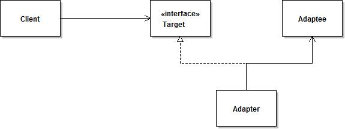

# 设计模式六大原则

- 开闭原则
- 里式替换原则
- 依赖倒置原则
- 接口隔离原则
- 迪米特法则
- 合成复用原则


# 创建型模式

- 工厂模式（Factory Pattern）
- 静态工厂模式 （Static Factory）
- 抽象工厂模式（Abstract Factory Pattern）
- 单例模式（Singleton Pattern）
- 建造者模式（Builder Pattern）
- 原型模式（Prototype Pattern）

  


## 单例模式

确保一个类只有一个实例，并为整个系统提供一个全局访问点的一种模式方法。

特点：

1、构造方法私有化

2、实例化的变量引用私有化

3、获取实例的方法共有


### 创建实例

饿汉式、懒汉式、双重校验锁、静态内部类、枚举、CAS


#### 饿汉式

```java
public class HungrySingleton {
    // 1.必须是 static
    private static HungrySingleton instance = new HungrySingleton();

    // 必须是私有构造
    private HungrySingleton() { }

    public static HungrySingleton getInstance() {
        return instance;
    }
}
```

问题

> 1.没有synchronized关键字同步，如何做到单例的-->类加载器classLoader在加载时候(loadClass())通过synchronized关键字保证同步
>
> 2.通过反射可以破坏吗
>
> 3.通过序列化可以破坏吗

#### 懒汉式

#### 双重校验锁

#### 静态内部类

#### 枚举

```java
/**
 * 枚举enum和静态代码块的特性相似，在使用枚举时，构造方法会被自动调用，利用这一特性也可以实现单例
 *
 * JVM 会阻止反射获取枚举类的私有构造方法。
 */
public enum EnumSingleton {

    INSTANCE;

    public void func1(){
        System.out.println("func1");
    }
    public void func2(){
        System.out.println("func2");
    }
    // ......

    public static void main(String[] args) {
        EnumSingleton.INSTANCE.func1();
        EnumSingleton.INSTANCE.func2();
    }
}

/*
Java规范字规定，每个枚举类型及其定义的枚举变量在JVM中都是唯一的，因此在枚举类型的序列化和反序列化上，
Java做了特殊的规定。在序列化的时候Java仅仅是将枚举对象的name属性输到结果中，反序列化的时候则是通过
java.lang.Enum的valueOf()方法来根据名字查找枚举对象。也就是说，序列化的时候只将DATASOURCE这个名称输出，
反序列化的时候再通过这个名称，查找对应的枚举类型，因此反序列化后的实例也会和之前被序列化的对象实例相同。
 */

```


#### CAS


### 应用实例


# 结构型模式

- 适配器模式（Adapter Pattern）
- 装饰器模式（Decorator Pattern）
- 外观模式（Facade Pattern）
- 门面模式 （Facade）
- 桥接模式（Bridge Pattern）
- 组合模式（Composite Pattern）
- 代理模式（Proxy Pattern）

## 适配器模式

### 示例

将一个类的接口转换成客户希望的另外一个接口。适配器模式使得原本由于接口不兼容而不能一起工作的那些类可以一起工作。




```java
// 客户端使用的接口
public interface Target {
     /*
     * 客户端请求处理的方法
     */
    public void request();
}

// 被适配的对象
public class Adaptee {
     /*
     * 原本存在的方法
     */
    public void specificRequest(){
    }
}

// 适配器实现
public class Adapter implements Target{
     /*
     * 持有需要被适配的接口对象
     */
    private Adaptee adaptee;
    /*
     * 构造方法，传入需要被适配的对象
     * @param adaptee 需要被适配的对象
     */
    public Adapter(Adaptee adaptee){
    	this.adaptee = adaptee;
    }
    @Override
    public void request() {
        adaptee.specificRequest();
    }
}

/*
 * 使用适配器的客户端
 */
public class Client {
    public static void main(String[] args){
        //创建需要被适配的对象
        Adaptee adaptee = new Adaptee();
        //创建客户端需要调用的接口对象
        Target target = new Adapter(adaptee);
        //请求处理
        target.request();
    }
}
```

### 应用

```java
java.util.Arrays#asList()
java.io.InputStreamReader(InputStream)//字符流和字节流的转换
java.io.OutputStreamWriter(OutputStream)//字节流和字符流的转换
java.io.ByteArrayInputStream/ByteArrayOutputStream
FileInputStream
```

ByteArrayInputStream继承了 OutputStream 类型，同时持有一个对 byte 数组的引用。它一个 byte 数组的接口适配成 OutputString 类型的接口，因此也是一个对象形式的适配器模式的应用。


# 行为型模式

- 责任链模式（Chain of Responsibility Pattern）
- 命令模式（Command Pattern）
- 迭代器模式（Iterator Pattern）
- 备忘录模式（Memento Pattern）
- 观察者模式（Observer Pattern）
- 事件监听模式（event listener）
- 状态模式（State Pattern）
- 策略模式（Strategy Pattern）
- 模板模式（Template Pattern）
- 访问者模式（Visitor Pattern）

  


## 事件监听模式

- servlet，tomcat，spring等，内部都使用了事件监听模式

- 事件源 经过 事件的封装 传给监听器，当事件源触发事件后，监听器接收到事件对象可以回调事件的方法 


### 示例

```java
import lombok.AllArgsConstructor;
import lombok.Data;
import lombok.NoArgsConstructor;

import java.util.EventListener;
import java.util.Vector;

public class Demo3 {

    public static void main(String[] args) {
        MyEventSource source = new MyEventSource("first servlet", new Vector<>());

        MyEventListenerImpl listener1 = new MyEventListenerImpl();
        MyEventListenerImpl listener2 = new MyEventListenerImpl();
        MyEventListenerImpl listener3 = new MyEventListenerImpl();

        source.registerListener(listener1);
        source.registerListener(listener2);
        source.registerListener(listener3);

        source.display();
    }
}

@Data
@NoArgsConstructor
@AllArgsConstructor
class MyEventSource {

    String servlet;
    Vector<MyEventListener> listeners;

    public void registerListener(MyEventListener listener) {
        listeners.add(listener);
    }

    public void removeListener(MyEventListener listener) {
        listeners.remove(listener);
    }

    public void display() {
        for (MyEventListener listener : listeners) {
            listener.display(new MyEvent(this));
        }
    }
}

@Data
@NoArgsConstructor
@AllArgsConstructor
class MyEvent {
    MyEventSource source;
}

class MyEvent extends java.util.EventObject {
    /**
     * Constructs a prototypical Event.
     *
     * @param source The object on which the Event initially occurred.
     * @throws IllegalArgumentException if source is null.
     */
    public MyEvent(Object source) {
        super(source);
    }

    @Override
    public MyEventSource getSource() {
        return (MyEventSource) source;
    }

    @Override
    public String toString() {
        return "MyEvent{" +
                "source=" + source +
                '}';
    }
}

/**
 * 所有事件监听器接口都必须扩展 EventListener 接口。
 */
interface MyEventListener extends java.util.EventListener {

    void display(MyEvent var1);
}


/**
 * 事件监听器实现类
 */
class MyEventListenerImpl implements MyEventListener {

    @Override
    public void display(MyEvent var1) {
        System.out.println(var1.getSource().getServlet());
    }
}
```


实现步骤：

 1、首要定义事件源对象

​	如上述MyEventSource。

 2、其次定义事件（状态）对象（该事件对象包装了事件源对象、作为参数传递给监听器、很薄的一层包装类） 

​	如上述MyEvent

 3、最后定义我们的事件侦听器接口和其实现类

​	如上述MyEventListener和MyEventListenerImpl


**综上**：其实事件侦听接口中抽象出来的，就是我们要侦听的事件源中的方法，只是此处需要将包装后的事件类传递进去。


总结
	监听器模式是观察者模式的另一种形态，同样基于事件驱动模型。监听器模式更加灵活，可以对不同事件作出相应。但也是付出了系统的复杂性作为代价的，因为我们要为每一个事件源定制一个监听器以及事件，这会增加系统的负担。 


### 扩展

如上述示例所示，JDK提供了两个接口来帮助实现事件监听模式：`java.util.EventObject` 和 `java.util.EventListener`