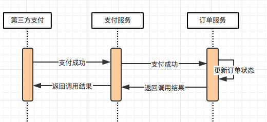
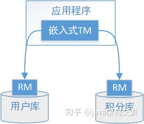
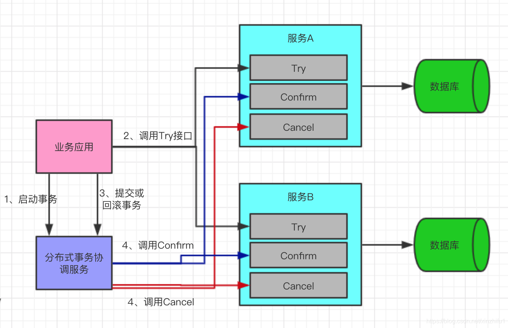
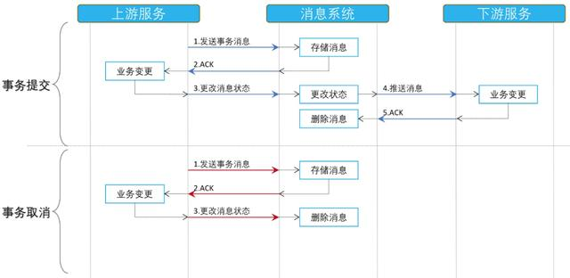
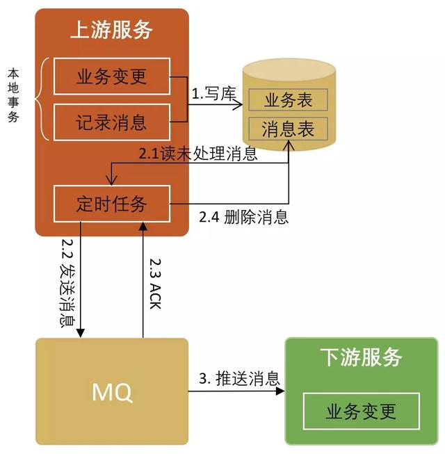
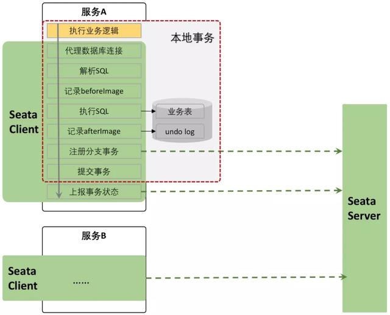

# 分布式事务相关概念

谈到分布式系统，特别是微服务架构，我们不得不谈分布式事务。

## 数据库事务

事务应该具有 4 个属性：原子性、一致性、隔离性、持久性。这四个属性通常称为 ACID 特性。

## 分布式事务

分布式事务是指事务的参与者、支持事务的服务器、资源服务器以及事务管理器分别位于不同的分布式系统的不同节点之上。

> 例如在大型电商系统中，下单接口通常会扣减库存、减去优惠、生成订单 id, 而订单服务与库存、优惠、订单 id 都是不同的服务，下单接口的成功与否，不仅取决于本地的 db 操作，而且依赖第三方系统的结果，这时候分布式事务就保证这些操作要么全部成功，要么全部失败。
>
> 本质上来说，分布式事务就是为了保证不同数据库的数据一致性。

## 一致性

### 强一致性

任何一次读都能读到某个数据的最近一次写的数据。系统中的所有进程，看到的操作顺序，都和全局时钟下的顺序一致。简言之，在任意时刻，所有节点中的数据是一样的。

### 弱一致性

数据更新后，如果能容忍后续的访问只能访问到部分或者全部访问不到，则是弱一致性。

### 最终一致性

不保证在任意时刻任意节点上的同一份数据都是相同的，但是随着时间的迁移，不同节点上的同一份数据总是在向趋同的方向变化。简单说，就是在一段时间后，节点间的数据会最终达到一致状态。

## CAP 原则/定理

CAP 原则又称 CAP 定理，指的是在一个分布式系统中， Consistency（一致性）、 Availability（可用性）、Partition tolerance（分区容错性），三者不可得兼。

一致性（C）：

> 在分布式系统中的所有数据备份，在任意同一时刻都具有同样的值。（等同于所有节点访问同一份最新的数据副本）

可用性（A）：

> 在集群中一部分节点故障后，集群整体是否还能响应客户端的读写请求。（对数据更新具备高可用性）

分区容错性（P）：

> `the system continues to operate despite arbitrary message loss or failure of part of the system`”，即分布式系统在遇到某节点或网络分区故障的时候，仍然能够对外提供满足一致性和可用性的服务。

CAP 原则的精髓就是要么 AP，要么 CP，要么 AC，但是不存在 CAP。如果在某个分布式系统中数据无副本， 那么系统必然满足强一致性条件， 因为只有独一数据，不会出现数据不一致的情况，此时 C 和 P 两要素具备，但是如果系统发生了网络分区状况或者宕机，必然导致某些数据不可以访问，此时可用性条件就不能被满足，即在此情况下获得了 CP 系统，但是 CAP 不可同时满足。

## BASE 理论

BASE 理论指的是基本可用 Basically Available，软状态 Soft State，最终一致性 Eventual Consistency，核心思想是即便无法做到强一致性，但应该采用适合的方式保证最终一致性。

> BASE，Basically Available Soft State Eventual Consistency 的简写：
> BA：Basically Available 基本可用，分布式系统在出现故障的时候，允许损失部分可用性，即保证核心可用。
> S：Soft State 软状态，允许系统存在中间状态，而该中间状态不会影响系统整体可用性。
> E：Eventual Consistency 最终一致性，系统中的所有数据副本经过一定时间后，最终能够达到一致的状态。

BASE 理论本质上是对 CAP 理论的延伸，是对 CAP 中 AP 方案的一个补充。

## 柔性事务

> 不同于 ACID 的刚性事务，在分布式场景下基于 BASE 理论，就出现了柔性事务的概念。

柔性事务有两个特性：基本可用和柔性状态。

所谓基本可用是指分布式系统出现故障的时候允许损失一部分的可用性。柔性状态是指允许系统存在中间状态，这个中间状态不会影响系统整体的可用性，比如数据库读写分离的主从同步延迟等。柔性事务的一致性指的是最终一致性。

# 分布式事务使用场景

## 转账

转账是最经典那的分布式事务场景，假设用户 A 使用银行 app 发起一笔跨行转账给用户 B，银行系统首先扣掉用户 A 的钱，然后增加用户 B 账户中的余额。此时就会出现 2 种异常情况：1. 用户 A 的账户扣款成功，用户 B 账户余额增加失败 2. 用户 A 账户扣款失败，用户 B 账户余额增加成功。对于银行系统来说，以上 2 种情况都是不允许发生，此时就需要分布式事务来保证转账操作的成功。

## 下单扣库存

在电商系统中，下单是用户最常见操作。在下单接口中必定会涉及生成订单 id, 扣减库存等操作，对于微服务架构系统，订单 id 与库存服务一般都是独立的服务，此时就需要分布式事务来保证整个下单接口的成功。

## 同步超时

继续以电商系统为例，在微服务体系架构下，我们的支付与订单都是作为单独的系统存在。订单的支付状态依赖支付系统的通知，假设一个场景：我们的支付系统收到来自第三方支付的通知，告知某个订单支付成功，接收通知接口需要同步调用订单服务变更订单状态接口，更新订单状态为成功。流程图如下，从图中可以看出有两次调用，第三方支付调用支付服务，以及支付服务调用订单服务，这两步调用都可能出现调用超时的情况，此处如果没有分布式事务的保证，就会出现用户订单实际支付情况与最终用户看到的订单支付情况不一致的情况。



# JTA接口

https://developer.aliyun.com/article/278407


java提供一个`javax.transaction`包，定义了事务（包括分布式事务）的一些接口。这些接口定义的组件间的通信用到了XA协议（`javax.transaction.xa`），X/Open XA接口是双向的系统接口，在事务管理器（Transaction Manager）以及一个或多个资源管理器（Resource Manager）之间形成通信桥梁。

```xml
<dependency>
    <groupId>javax.transaction</groupId>
    <artifactId>jta</artifactId>
    <version>1.1</version>
</dependency>
```


```java
1.javax.transaction.UserTransaction // 是面向开发人员的接口,能够编程地控制事务处理。

2.javax.transaction.TransactionManager // 允许应用程序服务器来控制代表正在管理的应用程序的事务。

3.javax.transaction.xa.XAResource // 面向提供商的实现接口，是一个基于X/Open CAE Specification的行业标准XA接口的Java映射。提供商在提供访问自己资源的驱动时，必须实现这样的接口。
```


**示例（转账）**

假设我们要操作账户a和账户b，本地事务处理（在一个数据库中）流程：

```java
Connection conn = null; 
try{
     //若设置为 true 则数据库将会把每一次数据更新认定为一个事务并自动提交
    conn.setAutoCommit(false);
     // 将 A 账户中的金额减少 500 
     // 将 B 账户中的金额增加 500 
     conn.commit();
} catch() {
     conn.rollback();
}
```

如果账户a和b不在一个数据库中，可以应用UserTransaction接口：

```java
 UserTransaction userTx = null; 
 Connection connA = null; 
 Connection connB = null; 
 try{
    userTx.begin();
     // 将 A 账户中的金额减少 500 
     // 将 B 账户中的金额增加 500 
     userTx.commit();
} catch() {
     userTx.rollback();
}
```

此时，connection就得支持XAResource接口了。**XAResource和Transaction如何关联**呢？增强exec方法。Connection的exec方法除了处理数据之外，还包含和Transaction关联的操作。

```java
public void execute(String sql) { 
     // 对于每次数据库操作都检查此会话所在的数据库连接是否已经被加入到事务中
	 associateWithTransactionIfNecessary(); 
	 try{ 
        	// 处理数据库操作的代码
	 } catch(SQLException sqle){ 
		 // 处理异常代码
	 } catch(Exception ne){ 
		 e.printStackTrace(); 
	 } 
 }
public void associateWithTransactionIfNecessary(){    
    // 获得 TransactionManager 
    TransactionManager tm = getTransactionManager(); 
    Transaction tx = tm.getTransaction()；
    // 检查当前线程是否有分布式事务
    if(tx != null){ 
        // 在分布式事务内，通过 tx 对象判断当前数据连接是否已经被包含在事务中，
        // 如果不是那么将此连接加入到事务中
        Connection conn = this.getConnection(); 
        //tx.hasCurrentResource， xaConn.getDataSource() 不是标准的 JTA 
        // 接口方法，是为了实现分布式事务而增加的自定义方法
        if(!tx.hasCurrentResource(conn)){ 
            XAConnection xaConn = (XAConnection)conn; 
            XADataSource xaSource = xaConn.getDataSource(); 
            // 调用 Transaction 的接口方法，将数据库事务资源加入到当前事务中
            tx.enListResource(xaSource.getXAResource(), 1);
        } 
    } 
}
```


Transactionanager本身并不承担实际的事务处理功能，它更多的是充当**用户接口和实现接口之间的桥梁**。此接口中的大部分事务方法与UserTransaction和 Transaction 相同。


Transaction代表了一个物理意义上的事务，在开发人员调用`UserTransaction.begin()`方法时，TransactionManager 会创建一个Transaction事务对象（标志着事务的开始），并把此对象通过ThreadLocal关联到当前线程。

同样`UserTransaction.commit()`会调用 `TransactionManager.commit()`方法，将从当前线程下取出事务对象Transaction并把此对象所代表的事务提交。其它方法诸如rollback()，getStatus()也是如此。


至于TransactionManager和Transaction的关系：Transaction负责实现接口操作，至于这些接口方法什么时候被调用，包括它从线程上被“拿上”还是“拿下”，这个活儿由TransactionManager干。然后用户就可以不分线程的使用TransactionManager，也无需知道自己用的是哪个Transaction。


```java
// 创建一个Transaction，挂到当前线程上
UserTransaction userTx = null; 
Connection connA = null; 
Connection connB = null; 
try{
    userTx.begin();
    // 将Connection对应的XAResource挂到当前线程对应的Transaction
    connA.exec("xxx")
    connB.exec("xxx")
    // 找到Transaction关联的XAResource，让它们都提交
    userTx.commit();
} catch() {
    // 找到Transaction关联的XAResource，让它们都回滚
    userTx.rollback();
}
```


# 分布式事务协议

## XA协议

最早的分布式事务模型是由 X/Open 国际联盟提出的分布式事务处理模型**DTP**（X/Open Distributed Transaction Processing（DTP）模型），也称为XA协议。 

XA规范主要定义了(全局)事务管理器(TM)和(局 部)资源管理器(RM)之间的接口。主流的关系型 数据库产品都是实现了XA接口的。 




**DTP模型定义如下角色：**

- AP(Application Program)：即应用程序，可以理解为使用DTP分布式事务的程序。
- RM(Resource Manager)：即资源管理器，可以理解为事务的参与者，一般情况下是指一个数据库实例，通过资源管理器对该数据库进行控制，资源管理器控制着分支事务。
- TM(Transaction Manager)：事务管理器，负责协调和管理事务，事务管理器控制着全局事务，管理事务生命周期，并协调各个RM。全局事务是指分布式事务处理环境中，需要操作多个数据库共同完成一个工作，这个工作即是一个全局事务。
- DTP模型定义TM和RM之间通讯的接口规范叫XA，简单理解为数据库提供的2PC接口协议，基于数据库的XA协议来实现2PC又称为XA方案。


XA 是一个两阶段提交协议，该协议分为以下两个阶段：

- 第一阶段：事务协调器要求每个涉及到事务的数据库预提交(precommit)此操作，并反映是否可以提交.
- 第二阶段：事务协调器要求每个数据库提交数据。

> MySQL从5.5版本开始支持，SQL Server 2005 开始支持，Oracle 7 开始支持。


在java中，JTA规范是XA规范的Java版，其把XA规范中规定的DTP模型交互接口抽象成Java接口中的方法，并规定每个方法要实现什么样的功能。

```xml
<dependency>
    <groupId>javax.transaction</groupId>
    <artifactId>jta</artifactId>
    <version>1.1</version>
</dependency>
```


JTA的实现框架有：

- JOTM

  > 存在的问题：使用中不能自动rollback，无论什么情况都commit。注：spring3开始已经不再支持jotm

- Atomikos

  > 稳定 易用

**以新用户注册送积分为例来说明：**

**执行流程如下：**

1. 应用程序（AP）持有用户库和积分库两个数据源。
2. 应用程序（AP）通过TM通知用户库RM新增用户，同时通知积分库RM为该用户新增积分，RM此时并未提交事务，此时用户和积分资源锁定。
3. TM收到执行回复，只要有一方失败则分别向其他RM发起回滚事务，回滚完毕，资源锁释放。
4. TM收到执行回复，全部成功，此时向所有RM发起提交事务，提交完毕，资源锁释放。


**以上三个角色之间的交互方式如下：**

1. TM向AP提供 应用程序编程接口，AP通过TM提交及回滚事务。
2. TM交易中间件通过XA接口来通知RM数据库事务的开始、结束以及提交、回滚等。

**总结：**

整个2PC的事务流程涉及到三个角色AP、RM、TM。AP指的是使用2PC分布式事务的应用程序；RM指的是资源管理器，它控制着分支事务；TM指的是事务管理器，它控制着整个全局事务。

1. 在准备阶段RM执行实际的业务操作，但不提交事务，资源锁定；
2. 在提交阶段TM会接受RM在准备阶段的执行回复，只要有任一个RM执行失败，TM会通知所有RM执行回滚操作，否则，TM将会通知所有RM提交该事务。提交阶段结束资源锁释放。

## 两阶段提交 2PC

Atomikos

**1. 第一阶段（投票阶段）：**

1. 协调者节点向所有参与者节点询问是否可以执行提交操作(vote)，并开始等待各参与者节点的响应。
2. 参与者节点执行询问发起为止的所有事务操作，并将Undo信息和Redo信息写入日志。（注意：若成功这里其实每个参与者已经执行了事务操作）
3. 各参与者节点响应协调者节点发起的询问。如果参与者节点的事务操作实际执行成功，则它返回一个”同意”消息；如果参与者节点的事务操作实际执行失败，则它返回一个”中止”消息。

**2. 第二阶段（提交执行阶段）：**

当协调者节点从所有参与者节点获得的相应消息都为”同意”时：

1. 协调者节点向所有参与者节点发出”正式提交(commit)”的请求。
2. 参与者节点正式完成操作，并释放在整个事务期间内占用的资源。
3. 参与者节点向协调者节点发送”完成”消息。
4. 协调者节点受到所有参与者节点反馈的”完成”消息后，完成事务。

如果任一参与者节点在第一阶段返回的响应消息为”中止”，或者 协调者节点在第一阶段的询问超时之前无法获取所有参与者节点的响应消息时：

1. 协调者节点向所有参与者节点发出”回滚操作(rollback)”的请求。
2. 参与者节点利用之前写入的Undo信息执行回滚，并释放在整个事务期间内占用的资源。
3. 参与者节点向协调者节点发送”回滚完成”消息。
4. 协调者节点收到所有参与者节点反馈的”回滚完成”消息后，取消事务。

不管最后结果如何，第二阶段都会结束当前事务。


**缺点：**

- **网络抖动导致的数据不一致：** 第二阶段中`协调者`向`参与者`发送`commit`命令之后，一旦此时发生网络抖动，导致一部分`参与者`接收到了`commit`请求并执行，可其他未接到`commit`请求的`参与者`无法执行事务提交。进而导致整个分布式系统出现了数据不一致。
- **超时导致的同步阻塞问题：** `2PC`中的所有的参与者节点都为`事务阻塞型`，当某一个`参与者`节点出现通信超时，其余`参与者`都会被动阻塞占用资源不能释放。
- **单点故障的风险：** 由于严重的依赖`协调者`，一旦`协调者`发生故障，而此时`参与者`还都处于锁定资源的状态，无法完成事务`commit`操作。虽然协调者出现故障后，会重新选举一个协调者，可无法解决因前一个`协调者`宕机导致的`参与者`处于阻塞状态的问题。


为此，提出了三阶段提交协议（3PC）。

## 三阶段提交 3PC

三阶段提交协议（3PC）主要是为了解决两阶段提交协议的阻塞问题。

三阶段提交有两个改动点。

- 引入超时机制。同时在协调者和参与者中都引入超时机制。（2PC只有协调者才拥有超时机制）

  > 当`参与者`各种原因未收到`协调者`的commit请求后，会对本地事务进行commit，不会一直阻塞等待，解决了`2PC`的单点故障问题，但`3PC` 还是没能从根本上解决数据一致性的问题。

- 在第一阶段和第二阶段中插入一个准备阶段。保证了在最后提交阶段之前各参与节点的状态是一致的。

  > 增加了一个询问阶段，询问阶段可以确保尽可能早的发现无法执行操作而需要中止的行为，但是它并不能发现所有的这种行为，只会减少这种情况的发生。

也就是说，除了引入超时机制之外，3PC把2PC的准备阶段再次一分为二，这样三阶段提交就有CanCommit、PreCommit、DoCommit三个阶段。

**1. CanCommit阶段**

3PC的CanCommit阶段其实和2PC的准备阶段很像。协调者向参与者发送commit请求，参与者如果可以提交就返回Yes响应，否则返回No响应。

1. 事务询问
   协调者向参与者发送CanCommit请求。询问是否可以执行事务提交操作。然后开始等待参与者的响应。
2. 响应反馈
   参与者接到CanCommit请求之后，正常情况下，如果其自身认为可以顺利执行事务，则返回Yes响应，并进入预备状态。否则反馈No

**2. PreCommit阶段**

协调者根据参与者的反应情况来决定是否可以进行事务的PreCommit操作。根据响应情况，有以下两种可能。

假如协调者从所有的参与者获得的反馈都是Yes响应，那么就会执行事务的预执行。

1. 发送预提交请求
   协调者向参与者发送PreCommit请求，并进入Prepared阶段。
2. 事务预提交
   参与者接收到PreCommit请求后，会执行事务操作，并将undo和redo信息记录到事务日志中。
3. 响应反馈
   如果参与者成功的执行了事务操作，则返回ACK响应，同时开始等待最终指令。

假如有任何一个参与者向协调者发送了No响应，或者等待超时之后，协调者都没有接到参与者的响应，那么就执行事务的中断。

1. 发送中断请求
   协调者向所有参与者发送abort请求。
2. 中断事务
   参与者收到来自协调者的abort请求之后（或超时之后，仍未收到协调者的请求），执行事务的中断。

**3. doCommit阶段**

该阶段进行真正的事务提交，也可以分为以下两种情况。

1. 执行提交

1. 发送提交请求
   协调者接收到参与者发送的ACK响应，那么他将从预提交状态进入到提交状态。并向所有参与者发送doCommit请求。
2. 事务提交
   参与者接收到doCommit请求之后，执行正式的事务提交。并在完成事务提交之后释放所有事务资源。
3. 响应反馈
   事务提交完之后，向协调者发送Ack响应。
4. 完成事务
   协调者接收到所有参与者的ack响应之后，完成事务。

2 中断事务
协调者没有接收到参与者发送的ACK响应（可能是接受者发送的不是ACK响应，也可能响应超时），那么就会执行中断事务。

1. 发送中断请求
   协调者向所有参与者发送abort请求
2. 事务回滚
   参与者接收到abort请求之后，利用其在阶段二记录的undo信息来执行事务的回滚操作，并在完成回滚之后释放所有的事务资源。
3. 反馈结果
   参与者完成事务回滚之后，向协调者发送ACK消息
4. 中断事务
   协调者接收到参与者反馈的ACK消息之后，执行事务的中断。


## 补偿事务 TCC

https://blog.csdn.net/pseudonym_/article/details/88398341

https://xie.infoq.cn/article/e6539ce436294828b5c9420f9

支持 TCC 事务的开源框架有：ByteTCC、Himly、TCC-transaction、  [spring-cloud-rest-tcc](https://github.com/prontera/spring-cloud-rest-tcc)


无论是 2PC 还是 3PC，都存在一个大粒度资源锁定的问题。为了解释这个问题，我们先来想象这样一种场景，用户在电商网站购买商品1000元，使用余额支付800元，使用红包支付200元。我们看一下在 2PC 中的流程：

prepare 阶段：

- 下单系统插入一条订单记录，不提交
- 余额系统减 800 元，给记录加锁，写 redo 和 undo 日志，不提交
- 红包系统减 200 元，给记录加锁，写 redo 和 undo 日志，不提交

commit 阶段：

- 下单系统提交订单记录
- 余额系统提交，释放锁
- 红包系统提交，释放锁

为什么说这是一种大粒度的资源锁定呢？是因为在 prepare 阶段，当数据库给用户余额减 800 元之后，为了维持隔离性，会给该条记录加锁，在事务提交前，其它事务无法再访问该条记录。但实际上，我们只需要预留其中的 800 元，不需要锁定整个用户余额。这是 2PC 和 3PC 的局限，因为这两者是**资源层**的协议，无法提供更灵活的资源锁定操作。为了解决这个问题，TCC 应运而生。TCC 本质上也是一个二阶段提交协议，但和 JTA 中的二阶段协议不同的是，它是一个**服务层**的协议，因此开发者可以根据业务自由控制资源锁定的粒度。我们等会儿可以看到 TCC 在上面这个场景中的优势，但在那之前，我们先来看一下 TCC 协议的运行过程。

TCC 将事务的提交过程分为 try-confirm-cancel(实际上 TCC 就是 try、confirm、cancel 的简称) 三个阶段:

- try：完成业务检查、预留业务资源
- confirm：使用预留的资源执行业务操作（需要保证幂等性）
- cancel：取消执行业务操作，释放预留的资源（需要保证幂等性）

和 JTA 二阶段事务的参与方都要实现 prepare、commit、rollback 一样，TCC 的事务参与方也必须实现 try、confirm、cancel 三个接口。流程如下：

1. 事务发起方向事务协调器发起事务请求，事务协调器调用所有事务参与者的 try 方法完成资源的预留，这时候并没有真正执行业务，而是为后面具体要执行的业务预留资源，这里完成了一阶段。
2. 如果事务协调器发现有参与者的 try 方法预留资源时候发现资源不够，则调用参与方的 cancel 方法回滚预留的资源，需要注意 cancel 方法需要实现业务幂等，因为有可能调用失败（比如网络原因参与者接受到了请求，但是由于网络原因事务协调器没有接受到回执）会重试。
3. 如果事务协调器发现所有参与者的 try 方法返回都 OK，则事务协调器调用所有参与者的 confirm 方法，不做资源检查，直接进行具体的业务操作。
4. 如果协调器发现所有参与者的 confirm 方法都 OK 了，则分布式事务结束。
5. 如果协调器发现有些参与者的 confirm 方法失败了，或者由于网络原因没有收到回执，则协调器会进行重试。这里如果重试一定次数后还是失败，会怎么样？常见的是做事务补偿。

TCC 执行场景示意图如下：




现在我们再回到开始的那个支付场景中，看看 TCC 在该场景中的流程：

Try操作

- tryX 下单系统创建待支付订单
- tryY 冻结账户红包 200 元
- tryZ 冻结资金账户 800 元

Confirm操作

- confirmX 订单更新为支付成功
- confirmY 扣减账户红包 200 元
- confirmZ 扣减资金账户 800 元

Cancel操作

- cancelX 订单处理异常，资金红包退回，订单支付失败
- cancelY 冻结红包失败，账户余额退回，订单支付失败
- cancelZ 冻结余额失败，账户红包退回，订单支付失败

可以看到，我们使用了冻结代替了原先的账号锁定（实际操作中，冻结操作可以用数据库减操作+日志实现），这样在冻结操作之后，事务提交之前，其它事务也能使用账户余额，提高了并发性。

总结一下，相比于二阶段提交协议，TCC 主要有以下区别：

- 2PC 位于资源层而 TCC 位于服务层。
- 2PC 的接口由第三方厂商实现，TCC 的接口由开发人员实现。
- TCC 可以更灵活地控制资源锁定的粒度。
- TCC 对应用的侵入性强。业务逻辑的每个分支都需要实现 try、confirm、cancel 三个操作，应用侵入性较强，改造成本高。


**TCC的缺点：**

- 应用侵入性强：TCC由于基于在业务层面，至使每个操作都需要有 `try`、`confirm`、`cancel`三个接口。
- 开发难度大：代码开发量很大，要保证数据一致性 `confirm` 和 `cancel` 接口还必须实现幂等性。


同时 TCC 事务为了解决异步网络中的通信失败或超时带来的异常情况，要求业务方在设计实现上要遵循三个策略：

- 允许空回滚：原因是异常发生在阶段 1 时，部分参与方没有收到 try 请求从而触发整个事务的 cancel 操作，try 失败或者没有执行 try 操作的参与方收到 cancel 请求时，要进行空回滚操作。
- 保持幂等性：原因是异常发生在阶段 2 时，比如网络超时，则会重复调用参与方的 confirm/cancel 方法，因此需要这两个方法实现上保证幂等性。
- 防止资源悬挂：原因网络异常导致两个阶段无法保证严格的顺序执行，出现参与方侧 try 请求比 cancel 请求更晚到达的情况，cancel 会执行空回滚而确保事务的正确性，但是此时 try 方法也不可以再被执行。

TCC 事务将分布式事务从资源层提到业务层来实现，可以让业务灵活选择资源的锁定粒度，并且全局事务执行过程中不会一直持有锁，所以系统的吞吐量比 2PC/XA 模式要高很多。


[TCC简单实现示例参考](https://xie.infoq.cn/article/e6539ce436294828b5c9420f9)


## Saga

Saga 和 TCC 一样，也是一种补偿事务，但是它没有 try 阶段，而是把分布式事务看作一组本地事务构成的事务链。

事务链中的每一个正向事务操作，都对应一个可逆的事务操作。Saga 事务协调器负责按照顺序执行事务链中的分支事务，分支事务执行完毕，即释放资源。如果某个分支事务失败了，则按照反方向执行事务补偿操作。


假如一个 Saga 的分布式事务链有 n 个分支事务构成，[T1,T2,...,Tn]，那么该分布式事务的执行情况有三种：

- T1,T2,...,Tn：n 个事务全部执行成功了。
- T1,T2,...,Ti,Ci,...,C2,C1：执行到第 i (i<=n) 个事务的时候失败了，则按照 i->1 的顺序依次调用补偿操作。如果补偿失败了，就一直重试。补偿操作可以优化为并行执行。
- T1,T2,...,Ti (失败),Ti (重试),Ti (重试),...,Tn：适用于事务必须成功的场景，如果发生失败了就一直重试，不会执行补偿操作。


Saga 事务和 TCC 事务一样，对业务实现要求高，要求业务设计实现上遵循三个策略：

- 允许空补偿：网络异常导致事务的参与方只收到了补偿操作指令，因为没有执行过正常操作，因此要进行空补偿。
- 保持幂等性：事务的正向操作和补偿操作都可能被重复触发，因此要保证操作的幂等性。
- 防止资源悬挂：网络异常导致事务的正向操作指令晚于补偿操作指令到达，则要丢弃本次正常操作，否则会出现资源悬挂问题。


虽然 Saga 和 TCC 都是补偿事务，但是由于提交阶段不同，所以两者也是有不同的：

- Saga 是不完美补偿，补偿操作会留下之前原始事务操作的痕迹，需要考虑对业务上的影响。
- TCC 是完美补偿，补偿操作会彻底清理之前的原始事务操作，用户是感知不到事务取消之前的状态信息的。
- TCC 的事务可以更好的支持异步化，但是 Saga 模式一般在补偿阶段比较适合异步化。


Saga 模式非常适合于业务流程长的长事务的场景，实现上对业务侵入低，所以非常适合微服务架构的场景。同时 Saga 采用的是一阶段提交模式，不会对资源长时间加锁，不存在“木桶效应”，所以采用这种模式架构的系统性能高、吞吐高。

阿里巴巴的 Seata 开源项目和华为的 ServiceComb 开源项目都支持 Saga 模式。


## 基于消息队列的分布式事务

基于消息的分布式事务模式核心思想是通过消息系统来通知其他事务参与方自己事务的执行状态。

消息系统的引入更有效的将事务参与方解耦，各个参与方可以异步执行。

该种模式的<font color=#00dd00>难点在于解决本地事务执行和消息发送的一致性</font>：两者要同时执行成功或者同时取消执行。

实现上主要有两种方式：

- 基于事务消息的方案
- 基于本地消息的方案


### 基于事务消息的分布式事务

普通消息是无法解决本地事务执行和消息发送的一致性问题的。因为消息发送是一个网络通信的过程，发送消息的过程就有可能出现发送失败、或者超时的情况。超时有可能发送成功了，有可能发送失败了，消息的发送方是无法确定的，所以此时消息发送方无论是提交事务还是回滚事务，都有可能不一致性出现。

解决这个问题，需要引入事务消息，事务消息和普通消息的区别在于事务消息发送成功后，处于 prepared 状态，不能被订阅者消费，等到事务消息的状态更改为可消费状态后，下游订阅者才可以监听到此消息。


本地事务和事务消息的发送的处理流程如下：

- 事务发起者预先发送一个事务消息。
- MQ 系统收到事务消息后，将消息持久化，消息的状态是“待发送”，并给发送者一个 ACK 消息。
- 事务发起者如果没有收到 ACK 消息，则取消本地事务的执行；如果收到了 ACK 消息，则执行本地事务，并给 MQ 系统再发送一个消息，通知本地事务的执行情况。
- MQ 系统收到消息通知后，根据本地事务的执行情况更改事务消息的状态，如果成功执行，则将消息更改为“可消费”并择机下发给订阅者；如果事务执行失败，则删除该事务消息。
- 本地事务执行完毕后，发给 MQ 的通知消息有可能丢失了。所以支持事务消息的 MQ 系统有一个定时扫描逻辑，扫描出状态仍然是“待发送”状态的消息，并向消息的发送方发起询问，询问这条事务消息的最终状态如何并根据结果更新事务消息的状态。因此事务的发起方需要给 MQ 系统提供一个事务消息状态查询接口。
- 如果事务消息的状态是“可发送”，则 MQ 系统向下游参与者推送消息，推送失败会不停重试。
- 下游参与者收到消息后，执行本地事务，本地事务如果执行成功，则给 MQ 系统发送 ACK 消息；如果执行失败，则不发送 ACK 消息，MQ 系统会持续推送给消息。



### 基于本地消息表的分布式事务

基于事务消息的模式对 MQ 系统要求较高，并不是所有 MQ 系统都支持事务消息的，RocketMQ 是目前为数不多的支持事务消息的 MQ 系统。如果所依赖的 MQ 系统不支持事务消息，那么可以采用本地消息表的分布式模式。

该种模式的核心思想是事务的发起方维护一个本地消息表，业务执行和本地消息表的执行处在同一个本地事务中。业务执行成功，则同时记录一条“待发送”状态的消息到本地消息表中。系统中启动一个定时任务定时扫描本地消息表中状态为“待发送”的记录，并将其发送到 MQ 系统中，如果发送失败或者超时，则一直发送，直到发送成功后，从本地消息表中删除该记录。后续的消费订阅流程则与基于事务消息的模式雷同。




## 最大努力通知型分布式事务

最大努力通知型的分布式事务解决方案，也是基于 MQ 系统的一种解决方案，但是不要求 MQ 消息可靠。

**举例**

假设小明通过联通的网上营业厅为手机充话费，充值方式选择支付宝支付。整个操作的流程如下：

- 小明选择充值金额“50 元”，支付方式“支付宝”。
- 联通网上营业厅创建一个充值订单，状态为“支付中”，并跳转到支付宝的支付页面（此时进入了支付宝的系统中）。
- 支付宝验明确认小明的支付后，从小明的账户中扣除 50 元，并向联通的账户中增加 50 元。执行完毕后向 MQ 系统发送一条消息，消息的内容标识支付是否成功，消息发送允许失败。
- 如果消息发送成功，那么支付宝的通知服务会订阅到该消息，并调用联通的接口通知本次支付的结果。如果此时联通的服务挂掉了，导致通知失败了，则会按照 5min、10min、30min、1h、...、24h 等递增的时间间隔，间隔性重复调用联通的接口，直到调用成功或者达到预订的时间窗口上限后，则不再通知。这就是尽最大努力通知的含义。
- 如果联通服务恢复正常，收到了支付宝的通知，如果支付成功，则给账户充值；如果支付失败，则取消充值。执行完毕后给支付宝通知服务确认响应，确认响应允许失败，支付宝系统会继续重试。所以联通的充值接口需要保持幂等性。
- 如果联通服务故障时间很久，恢复正常后，已超出支付宝通知服务的时间窗口，则联通扫描“支付中”的订单，主动向支付宝发起请求，核验订单的支付结果。

**特点剖析**

最大努力通知型方案本质是通过引入定期校验机制来对最终一致性做兜底，对业务侵入性较低、对 MQ 系统要求较低，实现比较简单，适合于对最终一致性敏感度比较低、业务链路较短的场景，比如跨平台、跨企业的系统间的业务交互。


# Seata

http://seata.io/zh-cn/blog/seata-at-tcc-saga.html

http://seata.io/zh-cn/blog/seata-quick-start.html


Seata 支持 TCC 模式、Saga 模式。但是 Seata 对 TCC 模式的支持提供了一种对业务入侵度为0的解决方案，这种方案叫做 AT (Automatic Transaction) 模式。下面我们重点说一下 AT 模式的运行机制：

- 全局事务依然是基于各个分支事务来完成。Seata Server 协调各个分支事务要么一起提交，要么一起回滚。
- 各个分支事务在运行时，Seata Client 通过对 SQL 执行的代理和拦截，通过解析 SQL 定位到行记录，记录下 SQL 执行前后的行数据快照，beforeImage 和 afterImage 共同构成了回滚日志，回滚日志记录在独立的表中。回滚日志的写入和业务数据的更改在在同一个本地事务中提交。
- 分支事务完成后，立即释放对本地资源的锁，然后给 Seata 协调器上报事务执行的结果。
- Seata 协调器汇总各个分支事务的完成情况，生成事务提交或者回滚的决议，将决议下发给 Seata Client。
- 如果决议是提交事务，则 Seata Client 异步清理回滚日志；如果决议是回滚事务，则 Seata Client 根据回滚日志进行补偿操作，补偿前会对比当前数据快照和 afterImage 是否一致，如果不一致则回滚失败，需要人工介入。



AT 模式通过自动生成回滚日志的方式，使得业务方接入成本低，对业务入侵度很低，但是应用 AT 模式也有一些限制：

- AT 模式只支持基于 ACID 事务的关系数据库。
- AT 模式是通过对 SQL 解析来完成的，对 SQL 语法的支持有限，使用复杂 SQL 时需要考虑兼容性。
- 目前不支持复合主键，业务表在设计时注意添加自增主键。
- 全局事务默认的隔离级别是读未提交，但是通过 SELECT...FOR UPDATE 等语句，可以实现读已提交的隔离级别。通过全局排它写锁，可以做到的隔离级别介于读未提交和读已提交之间。