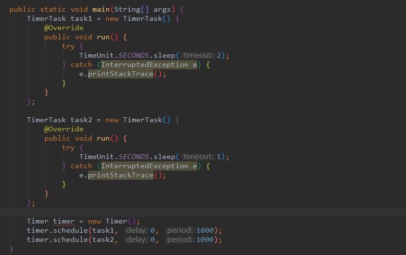
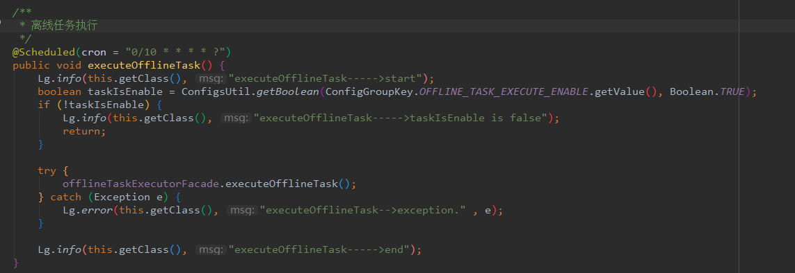
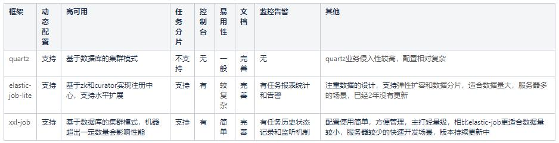

# 定时任务

Java 原生 Timer 和ScheduledExecutorService

Timer缺陷：

1. Timer底层是使用单线程来处理多个Timer任务，这意味着所有任务实际上都是串行执行，前一个任务的延迟会影响到之后的任务的执行。
2. 由于单线程的缘故，一旦某个定时任务在运行时，产生未处理的异常，那么不仅当前这个线程会停止，所有的定时任务都会停止。
3. Timer任务执行是依赖于系统绝对时间，系统时间变化会导致执行计划的变更。

由于上述缺陷，尽量不要使用Timer， idea中也会明确提示，使用ScheduledThreadPoolExecutor替代Timer 。

ScheduledExecutorService对于Timer的缺陷进行了修补，首先ScheduledExecutorService内部实现是ScheduledThreadPool线程池，可以支持多个任务并发执行。

对于某一个线程执行的任务出现异常，也会处理，不会影响其他线程任务的执行，另外ScheduledExecutorService是基于时间间隔的延迟，执行不会由于系统时间的改变发生变化。

当然，ScheduledExecutorService也有自己的局限性：只能根据任务的延迟来进行调度，无法满足基于绝对时间和日历调度的需求。

spring task 是spring自主开发的轻量级定时任务框架，不需要依赖其他额外的包，配置较为简单。

此处使用注解配置

Spring Task 本身不支持持久化，也没有推出官方的分布式集群模式，只能靠开发者在业务应用中自己手动扩展实现，无法满足可视化，易配置的需求。

# 分布式定时任务

