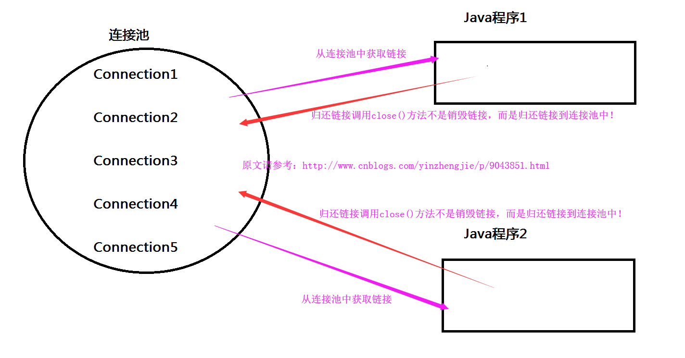

# 数据源/连接池

---

## 起源

- 在JDBC中我们对于数据库的连接和释放，都是通过 DriverManager.getConnection(url, user, password); 来实现的。这种做法每次都会建立一个数据库连接进行sql操作。“获得连接”或“释放资源”是非常消耗系统资源的两个过程。这样如果操作频繁，势必会导致连接、查询效率低下。

- 为了解决此类性能问题，通常情况我们采用连接池技术，来共享连接Connection。这样我们就不需要每次都创建连接、释放连接了，这些操作都交给了连接池。

## java之连接池规范

- Java为数据库连接池提供了公共的接口：javax.sql.DataSource，各个厂商需要让自己的连接池实现这个接口。这样应用程序可以方便的切换不同厂商的连接池！常见的连接池：DBCP、C3P0、durid。

## 连接池/数据源定义

	用池来管理Connection，这样可以重复使用Connection。有了池，所以我们就不用自己来创建Connection，

	而是通过池来获取Connection对象。当使用完Connection后，调用Connection的close()方法也不会真的

	关闭Connection，而是把Connection“归还”给池。池就可以再利用这个Connection对象了。



### C3P0

- 3种配置方式

#### 1.ComboPooledDataSource.setXXX

```java

	package C3P0; 
	import java.sql.Connection; 
	import java.sql.SQLException; 
	import java.beans.PropertyVetoException; 
	import com.mchange.v2.c3p0.ComboPooledDataSource; 
	
	public class DBPool{       
	   private static DBPool dbPool;       
	   private ComboPooledDataSource dataSource;     

	   static {       
	           dbPool = new DBPool();       
	   }       
	
	   public DBPool(){       
	           try {       
	                 dataSource = new ComboPooledDataSource();       
	                 dataSource.setUser("id");       
	                 dataSource.setPassword("pw");       
	                 dataSource.setJdbcUrl("jdbc:mysql://127.0.0.1:3306/test? 
	autoReconnect=true&useUnicode=true&characterEncoding=GB2312"); 
	                 dataSource.setDriverClass("com.mysql.jdbc.Driver"); 	
	           } catch (PropertyVetoException e) {       
	               throw new RuntimeException(e);       
	           }       
	   }       
	
	   public final static DBPool getInstance(){       
	           return dbPool;       
	   }       
	
	   public final Connection getConnection(){       
	           try {       
	               return dataSource.getConnection();       
	           }   catch (SQLException e)   {       
	               throw new RuntimeException("无法从数据源获取连接",e);       
	           }       
	   }     
		
	   public static void main(String[] args) throws SQLException { 
	        Connection con = null; 
	        try { 
	        con = DBPool.getInstance().getConnection(); 
	        } catch (Exception e){ 
	        } finally { 
	        if (con != null) 
	        con.close(); 
	        } 
	        } 
	
	}
```

#### 2.c3p0-config.xml

```xml

	<?xml version="1.0" encoding="UTF-8"?>
		<c3p0-config>
			<named-config name="userApp">
				<property name="driverClass">com.mysql.jdbc.Driver</property>
				<property name="jdbcUrl">jdbc:mysql://localhost:3306/test</property>
				<property name="user">root</property>
				<property name="password">123456</property>
				<property name="acquireIncrement">5</property>
				<property name="initialPoolSize">10</property>
				<property name="minPoolSize">10</property>
				<property name="maxPoolSize">20</property>
				<property name="maxStatements">0</property>
				</user-overrides>
			</named-config>
	</c3p0-config>
```

```java

	package cn.langzi.jdbc.c3p0;
	import java.sql.Connection;
	import java.sql.ResultSet;
	import java.sql.SQLException;
	import java.sql.Statement;
	import javax.sql.DataSource;
	import com.mchange.v2.c3p0.ComboPooledDataSource;
	
	public class DbConnection {
	    private static DataSource dataSource;
	    static{
	        dataSource = new ComboPooledDataSource("userApp");
	    }
	    public static Connection getConnectioon() throws SQLException{
	        return dataSource.getConnection();
	    }
	}
```


#### 3.加载配置文件

```java

	public final class ConnectionManager {
	
	 private static ConnectionManager instance;
	
	 public ComboPooledDataSource ds;
	
	 private static String c3p0Properties = "c3p0.properties";
	 
	 private ConnectionManager() throws Exception {
	  Properties p = new Properties();
	  p.load(this.getClass().getResourceAsStream(c3p0Properties));
	  ds = new ComboPooledDataSource();
	  ds.setUser(p.getProperty("user"));
	  ds.setPassword(p.getProperty("user"));
	  ds.setJdbcUrl(p.getProperty("user"));
	  ds.setDriverClass(p.getProperty("user"));
	  ds.setInitialPoolSize(Integer.parseInt(p.getProperty("initialPoolSize")));
	  ds.setMinPoolSize(Integer.parseInt(p.getProperty("minPoolSize")));
	  ds.setMaxPoolSize(Integer.parseInt(p.getProperty("maxPoolSize")));
	  ds.setMaxStatements(Integer.parseInt(p.getProperty("maxStatements")));
	  ds.setMaxIdleTime(Integer.parseInt(p.getProperty("maxIdleTime")));
	 }
	
	 
	
	 public static final ConnectionManager getInstance() {
	  if (instance == null) {
	   try {
	    instance = new ConnectionManager();
	   } catch (Exception e) {
	    e.printStackTrace();
	   }
	  }
	  return instance;
	 }
	
	 
	
	 public synchronized final Connection getConnection() {
	  try {
	   return ds.getConnection();
	  } catch (SQLException e) {
	   e.printStackTrace();
	  }
	  return null;
	 }
	
	 protected void finalize() throws Throwable {
	  DataSources.destroy(ds); // 关闭datasource
	  super.finalize();
	 }
	}
```

### DBCP

### Durid