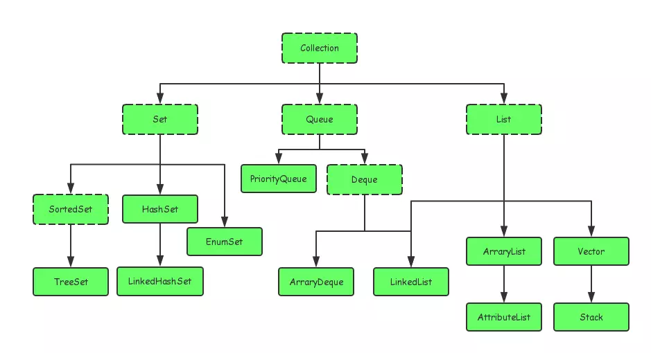
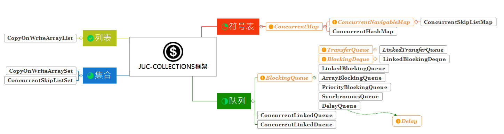
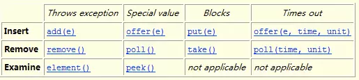

## 概述

学习维度：

​	1.容量大小与扩容
​	2.是否允许null值
​	3.是否允许并发，并发控制逻辑


[https://segmentfault.com/a/1190000015558984](https://segmentfault.com/a/1190000015558984)


- Java集合大致可以分为Set、List、Queue和Map四种体系

```properties
其中Set代表无序、不可重复的集合；

List代表有序、可重复的集合；

Map则代表具有映射关系的集合；

Queue体系集合，代表一种队列集合实现。
```

- 集合类之间的关系




```properties
Collections: 集合工具类提供了对集合排序、遍历等多种算法实现。
Arrays: 工具
```


- juc集合框架




## Map

我们知道，一般的Map都是无序的，也就是只能通过键的hash值进行定位。JDK为了实现有序的Map，提供了一个**SortedMap**接口，SortedMap提供了一些根据键范围进行查找的功能，比如返回整个Map中 key最小/大的键、返回某个范围内的子Map视图等等。

为了进一步对有序Map进行增强，JDK又引入了**NavigableMap**接口，该接口进一步扩展了SortedMap的功能，提供了根据指定Key返回最接近项、按升序/降序返回所有键的视图等功能。

同时，也提供了一个基于NavigableMap的实现类——**TreeMap**，TreeMap底层基于红黑树设计，是一种有序的Map。


### HashMap

[https://mp.weixin.qq.com/s/w282P0z7IDUcatOFtoJgiA](https://mp.weixin.qq.com/s/w282P0z7IDUcatOFtoJgiA)


#### 红黑树

红黑树具有以下5种性质：

（1）节点是红色或黑色。

（2）根节点是黑色。

（3）每个叶节点（NIL节点，空节点）是黑色的。

（4）每个红色节点的两个子节点都是黑色。(从每个叶子到根的所有路径上不能有两个连续的红色节点)

（5）从任一节点到其每个叶子的所有路径都包含相同数目的黑色节点。

红黑树的时间复杂度为O(log n)，与树的高度成正比。

红黑树每次的插入、删除操作都需要做平衡，平衡时有可能会改变根节点的位置，颜色转换，左旋，右旋等。


#### 数据结构

- 数组+链表+红黑树

> 数组的查询效率为O(1)，链表的查询效率是O(k)，红黑树的查询效率是O(log k)，k为桶中的元素个数，所以当元素数量非常多的时候，转化为红黑树能极大地提高效率。

```java
// 节点定义
static class Node<K,V> implements Map.Entry<K,V> {
    final int hash; //key值的高低16位异或(OXR)以后的数值
    final K key;
    V value;
    Node<K,V> next;

    Node(int hash, K key, V value, Node<K,V> next) {
        this.hash = hash;
        this.key = key;
        this.value = value;
        this.next = next;
    }

    public final K getKey()        { return key; }
    public final V getValue()      { return value; }
    public final String toString() { return key + "=" + value; }

    public final int hashCode() {
        return Objects.hashCode(key) ^ Objects.hashCode(value);
    }

    public final V setValue(V newValue) {
        V oldValue = value;
        value = newValue;
        return oldValue;
    }

    public final boolean equals(Object o) {
        if (o == this)
            return true;
        if (o instanceof Map.Entry) {
            Map.Entry<?,?> e = (Map.Entry<?,?>)o;
            if (Objects.equals(key, e.getKey()) &&
                Objects.equals(value, e.getValue()))
                return true;
        }
        return false;
    }
}
```


HashMap使用链表法避免哈希冲突（相同hash值），当链表长度大于TREEIFY_THRESHOLD（默认为8）时，将链表转换为红黑树，当然小于UNTREEIFY_THRESHOLD（默认为6）时，又会转回链表以达到性能均衡。 我们看一张HashMap的数据结构（数组+链表+红黑树 ）就更能理解table了：


#### 属性

```java
public class HashMap<K,V> extends AbstractMap<K,V> implements Map<K,V>, Cloneable, Serializable {
    // 序列号
    private static final long serialVersionUID = 362498820763181265L;    
    // 默认的初始容量是16
    static final int DEFAULT_INITIAL_CAPACITY = 1 << 4;   
    // 最大容量
    static final int MAXIMUM_CAPACITY = 1 << 30; 
    // 默认的填充因子
    static final float DEFAULT_LOAD_FACTOR = 0.75f;
    // 当桶(bucket)上的结点数大于这个值时会转成红黑树
    static final int TREEIFY_THRESHOLD = 8; 
    // 当桶(bucket)上的结点数小于这个值时树转链表
    static final int UNTREEIFY_THRESHOLD = 6;
    // 桶中结构转化为红黑树对应的table的最小大小
    static final int MIN_TREEIFY_CAPACITY = 64;
    // 存储元素的数组，总是2的幂次倍
    transient Node<k,v>[] table; 
    // 存放具体元素的集
    transient Set<map.entry<k,v>> entrySet;
    // 存放元素的个数，注意这个不等于数组的长度。
    transient int size;
    // 每次扩容和更改map结构的计数器
    transient int modCount;   
    // 临界值 当实际大小(容量*填充因子)超过临界值时，会进行扩容
    int threshold;
    // 填充因子
    final float loadFactor;
}
```

#### 构造函数

```java
public HashMap() {
    // 初始化填充因子
    this.loadFactor = DEFAULT_LOAD_FACTOR; 
}

public HashMap(int initialCapacity) {
    // 调用HashMap(int, float)型构造函数
    this(initialCapacity, DEFAULT_LOAD_FACTOR);
}

public HashMap(Map<? extends K, ? extends V> m) {
    // 初始化填充因子
    this.loadFactor = DEFAULT_LOAD_FACTOR;
    // 将m中的所有元素添加至HashMap中
    putMapEntries(m, false);
}

public HashMap(int initialCapacity, float loadFactor) {
    // 初始容量不能小于0，否则报错
    if (initialCapacity < 0)
        throw new IllegalArgumentException("Illegal initial capacity: " +
                                            initialCapacity);
    // 初始容量不能大于最大值，否则为最大值
    if (initialCapacity > MAXIMUM_CAPACITY)
        initialCapacity = MAXIMUM_CAPACITY;
    // 填充因子不能小于或等于0，不能为非数字
    if (loadFactor <= 0  Float.isNaN(loadFactor))
        throw new IllegalArgumentException("Illegal load factor: " +
                                            loadFactor);
    // 初始化填充因子                                        
    this.loadFactor = loadFactor;
    // 初始化threshold大小
    this.threshold = tableSizeFor(initialCapacity);    
}
```


```java
// 主要功能是返回一个比给定整数大且最接近的2的幂次方整数，如给定10，返回2的4次方16.
static final int tableSizeFor(int cap) {
   int n = cap - 1;
   n |= n >>> 1;
   n |= n >>> 2;
   n |= n >>> 4;
   n |= n >>> 8;
   n |= n >>> 16;
   return (n < 0) ? 1 : (n >= MAXIMUM_CAPACITY) ? MAXIMUM_CAPACITY : n + 1;
 }
```


```java
/**
  * 将m的所有元素存入本HashMap实例中
  */
 final void putMapEntries(Map<? extends K, ? extends V> m, boolean evict) {
   // 得到 m 中元素的个数
   int s = m.size();
   // 当 m 中有元素时，则需将map中元素放入本HashMap实例。
   if (s > 0) {
     // 判断table是否已经初始化，如果未初始化，则先初始化一些变量。（table初始化是在put时）
     if (table == null) { // pre-size
       // 根据待插入的map 的 size 计算要创建的 HashMap 的容量。
       float ft = ((float) s / loadFactor) + 1.0F;
       int t = ((ft < (float) MAXIMUM_CAPACITY) ? (int) ft : MAXIMUM_CAPACITY);
       // 把要创建的 HashMap 的容量存在 threshold 中
       if (t > threshold)
         threshold = tableSizeFor(t);
     }
     // 如果table初始化过，因为别的函数也会调用它，所以有可能HashMap已经被初始化过了。
     // 判断待插入的 map 的 size,若 size 大于 threshold，则先进行 resize()，进行扩容
     else if (s > threshold)
       resize();
     // 然后就开始遍历 带插入的 map ，将每一个 <Key ,Value> 插入到本HashMap实例。
     for (Map.Entry<? extends K, ? extends V> e : m.entrySet()) {
       K key = e.getKey();
       V value = e.getValue();
       // put(K,V)也是调用 putVal 函数进行元素的插入
       putVal(hash(key), key, value, false, evict);
     }
   }
 }
```


#### 为什么数组必须是2的倍数

如下所示的**`hash`计算**：

​	`key` 的 `hash`值的计算是通过hashCode()的高16位异或低16位实现的：

​	(`h = k.hashCode()) ^ (h >>> 16)`


比如，原来的 hashCode : 

1111 1111 1111 1111 0100 1100 0000 1010

移位后的hashCode: 

0000 0000 0000 0000 1111 1111 1111 1111

进行异或(OXR)运算 结果：

1111 1111 1111 1111 1011 0011 1111 0101


这样可以将hashcode高位和低位的值进行混合做异或运算，而且混合后，**低位的信息中加入了高位的信息，这样高位的信息被变相的保留了下来。掺杂的元素多了，那么生成的hash值的随机性会增大。**


至于为什么`table`大小必须是2的次幂(指长度扩为原来2倍)呢？

在扩容的时候，如果数组`table`长度是2的次幂，那么扩容后元素的位置要么是在原位置，要么是在原位置再移动2次幂的位置。

看下图可以明白这句话的意思，n为`table`的长度，图（a）表示扩容前的`key1`和`key2`两种`key`确定索引位置的示例，图（b）表示扩容后`key1`和`key2`两种`key`确定索引位置的示例，其中`hash1`是`key1`对应的哈希与高位运算结果。


元素在重新计算hash之后，因为n变为2倍，那么n-1的mask范围在高位多1bit(红色)，因此新的index就会发生这样的变化：


因此，我们在扩充HashMap的时候，只需要看看原来的hash值新增的那个bit是1还是0就好了，**是0的话索引没变，是1的话索引变成“原索引+oldCap”**，可以看看下图为16扩充为32的resize示意图 ：


#### put

```java
public V put(K key, V value) {
    return putVal(hash(key), key, value, false, true);
}
```


```java
static final int hash(Object key) {
    int h;
    return (key == null) ? 0 : (h = key.hashCode()) ^ (h >>> 16);//key值高低16位异或
}
```


```java
final V putVal(int hash, K key, V value, boolean onlyIfAbsent,
                   boolean evict) {
    Node<K,V>[] tab; Node<K,V> p; int n, i;
    // 步骤①：tab为空则创建 
    // table未初始化或者长度为0，进行扩容
    if ((tab = table) == null  (n = tab.length) == 0)
        n = (tab = resize()).length;
    // 步骤②：计算index，并对null做处理  
    // (n - 1) & hash 确定元素存放在哪个桶中，桶为空，新生成结点放入桶中(此时，这个结点是放在数组中)
    if ((p = tab[i = (n - 1) & hash]) == null)
        tab[i] = newNode(hash, key, value, null);
    // 桶中已经存在元素
    else {
        Node<K,V> e; K k;
        // 步骤③：节点key存在，直接覆盖value 
        // 比较桶中第一个元素(数组中的结点)的hash值相等，key相等
        if (p.hash == hash &&
            ((k = p.key) == key  (key != null && key.equals(k))))
                // 将第一个元素赋值给e，用e来记录
                e = p;
        // 步骤④：判断该链为红黑树 
        // hash值不相等，即key不相等；为红黑树结点
        else if (p instanceof TreeNode)
            // 放入树中
            e = ((TreeNode<K,V>)p).putTreeVal(this, tab, hash, key, value);
        // 步骤⑤：该链为链表 
        // 为链表结点
        else {
            // 在链表最末插入结点
            for (int binCount = 0; ; ++binCount) {
                // 到达链表的尾部
                if ((e = p.next) == null) {
                    // 在尾部插入新结点
                    p.next = newNode(hash, key, value, null);
                    // 结点数量达到阈值，转化为红黑树
                    if (binCount >= TREEIFY_THRESHOLD - 1) // -1 for 1st
                        treeifyBin(tab, hash);
                    // 跳出循环
                    break;
                }
                // 判断链表中结点的key值与插入的元素的key值是否相等
                if (e.hash == hash &&
                    ((k = e.key) == key  (key != null && key.equals(k))))
                    // 相等，跳出循环
                    break;
                // 用于遍历桶中的链表，与前面的e = p.next组合，可以遍历链表
                p = e;
            }
        }
        // 表示在桶中找到key值、hash值与插入元素相等的结点
        if (e != null) { 
            // 记录e的value
            V oldValue = e.value;
            // onlyIfAbsent为false或者旧值为null
            if (!onlyIfAbsent  oldValue == null)
                //用新值替换旧值
                e.value = value;
            // 访问后回调
            afterNodeAccess(e);
            // 返回旧值
            return oldValue;
        }
    }
    // 结构性修改
    ++modCount;
    // 步骤⑥：超过最大容量 就扩容 
    // 实际大小大于阈值则扩容
    if (++size > threshold)
        resize();
    // 插入后回调
    afterNodeInsertion(evict);
    return null;
}
```


#### resize

- 什么时候扩容

  在put元素的过程中，如果当前容器中元素的个数达到阈值（当前数组长度乘以加载因子的值，`table.length * loadFactor`）

- 扩容

  其实就是重新计算容量；而这个扩容是计算出所需容器的大小之后重新定义一个新的容器，将原来容器中的元素放入其中。

```java
final Node<K,V>[] resize() {
       // 保存当前table
       Node<K,V>[] oldTab = table;
       // 保存当前table的容量
       int oldCap = (oldTab == null) ? 0 : oldTab.length;
       // 保存当前阈值
       int oldThr = threshold;
       // 初始化新的table容量和阈值 
       int newCap, newThr = 0;
       /*
       1. resize（）函数在size　> threshold时被调用。oldCap大于 0 代表原来的 table 表非空，
          oldCap 为原表的大小，oldThr（threshold） 为 oldCap × load_factor
       */
       if (oldCap > 0) {
           // 若旧table容量已超过最大容量，更新阈值为Integer.MAX_VALUE（最大整形值），这样以后就不会自动扩容了。
           if (oldCap >= MAXIMUM_CAPACITY) {
               threshold = Integer.MAX_VALUE;
               return oldTab;
           }
            // 容量翻倍，使用左移，效率更高
           else if ((newCap = oldCap << 1) < MAXIMUM_CAPACITY &&
                    oldCap >= DEFAULT_INITIAL_CAPACITY)
               // 阈值翻倍
               newThr = oldThr << 1; // double threshold
       }
       /*
       2. resize（）函数在table为空被调用。oldCap 小于等于 0 且 oldThr 大于0，代表用户创建了一个 HashMap，但是使用的构造函数为      
          HashMap(int initialCapacity, float loadFactor) 或 HashMap(int initialCapacity)
          或 HashMap(Map<? extends K, ? extends V> m)，导致 oldTab 为 null，oldCap 为0， oldThr 为用户指定的 HashMap的初始容量。
   　　*/
       else if (oldThr > 0) // initial capacity was placed in threshold
           //当table没初始化时，threshold持有初始容量。还记得threshold = tableSizeFor(t)么;
           newCap = oldThr;
       /*
       3. resize（）函数在table为空被调用。oldCap 小于等于 0 且 oldThr 等于0，用户调用 HashMap()构造函数创建的　HashMap，所有值均采用默认值，oldTab（Table）表为空，oldCap为0，oldThr等于0，
       */
       else {               // zero initial threshold signifies using defaults
           newCap = DEFAULT_INITIAL_CAPACITY;
           newThr = (int)(DEFAULT_LOAD_FACTOR * DEFAULT_INITIAL_CAPACITY);
       }
       // 新阈值为0
       if (newThr == 0) {
           float ft = (float)newCap * loadFactor;
           newThr = (newCap < MAXIMUM_CAPACITY && ft < (float)MAXIMUM_CAPACITY ?
                     (int)ft : Integer.MAX_VALUE);
       }
       threshold = newThr;
       @SuppressWarnings({"rawtypes","unchecked"})
       // 初始化table
       Node<K,V>[] newTab = (Node<K,V>[])new Node[newCap];
       table = newTab;
       if (oldTab != null) {
           // 把 oldTab 中的节点　reHash 到　newTab 中去
           for (int j = 0; j < oldCap; ++j) {
               Node<K,V> e;
               if ((e = oldTab[j]) != null) {
                   oldTab[j] = null;
                   // 若节点是单个节点，直接在 newTab　中进行重定位
                   if (e.next == null)
                       newTab[e.hash & (newCap - 1)] = e;
                   // 若节点是　TreeNode 节点，要进行 红黑树的 rehash　操作
                   else if (e instanceof TreeNode)
                       ((TreeNode<K,V>)e).split(this, newTab, j, oldCap);
                   // 若是链表，进行链表的 rehash　操作
                   else { // preserve order
                       Node<K,V> loHead = null, loTail = null;
                       Node<K,V> hiHead = null, hiTail = null;
                       Node<K,V> next;
                       // 将同一桶中的元素根据(e.hash & oldCap)是否为0进行分割（代码后有图解，可以回过头再来看），分成两个不同的链表，完成rehash
                       do {
                           next = e.next;
                           // 根据算法　e.hash & oldCap 判断节点位置rehash　后是否发生改变
                           //最高位==0，这是索引不变的链表。
                           if ((e.hash & oldCap) == 0) { 
                               if (loTail == null)
                                   loHead = e;
                               else
                                   loTail.next = e;
                               loTail = e;
                           }
                           //最高位==1 （这是索引发生改变的链表）
                           else {  
                               if (hiTail == null)
                                   hiHead = e;
                               else
                                   hiTail.next = e;
                               hiTail = e;
                           }
                       } while ((e = next) != null);
                       if (loTail != null) {  // 原bucket位置的尾指针不为空(即还有node)  
                           loTail.next = null; // 链表最后得有个null
                           newTab[j] = loHead; // 链表头指针放在新桶的相同下标(j)处
                       }
                       if (hiTail != null) {
                           hiTail.next = null;
                           // rehash　后节点新的位置一定为原来基础上加上　oldCap，具体解释看下图
                           newTab[j + oldCap] = hiHead;
                       }
                   }
               }
           }
       }
       return newTab;
   }
}
```


#### get


#### HashMap线程不安全的点

初始化

put

resize


#### HashMap如何同步

```java
Map m = Collections.synchronizeMap(hashMap);
```


### LinkedHashMap

<font color=#dd0000>内部维持了一个双向链表，可以保持顺序。保持进入的顺序与被取出的顺序一致</font>

源码示例

```java
public class HashMap<K,V> extends AbstractMap<K,V>
    implements Map<K,V>, Cloneable, Serializable {
    
    // Callbacks to allow LinkedHashMap post-actions
    // 专门预留给LinkedHashMap的
    void afterNodeAccess(Node<K,V> p) { }
    
    //回调函数，新节点插入之后回调 ， 根据evict 和   判断是否需要删除最老插入的节点。
    void afterNodeInsertion(boolean evict) { }
    void afterNodeRemoval(Node<K,V> p) { }
}
```


```java
public class LinkedHashMap<K,V>
    extends HashMap<K,V>
    implements Map<K,V> {
	
	static class Entry<K,V> extends HashMap.Node<K,V> {
        Entry<K,V> before, after;
        Entry(int hash, K key, V value, Node<K,V> next) {
            super(hash, key, value, next);
        }
    }

    private static final long serialVersionUID = 3801124242820219131L;

    /**
     * The head (eldest) of the doubly linked list.
     */
    transient LinkedHashMap.Entry<K,V> head;

    /**
     * The tail (youngest) of the doubly linked list.
     */
    transient LinkedHashMap.Entry<K,V> tail;

    /**
     * The iteration ordering method for this linked hash map: <tt>true</tt>
     * for access-order, <tt>false</tt> for insertion-order.
     *
     *  定义了排序模式，对于访问顺序，为 true；对于插入顺序，则为 false。
     * 
     * @serial
     */
    final boolean accessOrder;
    
    
    //在构建新节点时，构建的是`LinkedHashMap.Entry` 不再是`Node`.
    Node<K,V> newNode(int hash, K key, V value, Node<K,V> e) {
        LinkedHashMap.Entry<K,V> p =
            new LinkedHashMap.Entry<K,V>(hash, key, value, e);
        linkNodeLast(p);
        return p;
    }
    
    
    // link at the end of list //将新增的节点，连接在链表的尾部
    private void linkNodeLast(LinkedHashMap.Entry<K,V> p) {
        LinkedHashMap.Entry<K,V> last = tail;
        tail = p;
        if (last == null)
            head = p;
        else {
            p.before = last;
            last.after = p;
        }
    }
    
    // 回调函数。HashMap中removeNode()中会调用 给LinkedHashMap预留的afterNodeRemoval方法
    // 该方法的作用是：当map中删除node节点后，LinkedHashMap需要将 before after 指针置空
    void afterNodeRemoval(Node<K,V> e) { // unlink
        LinkedHashMap.Entry<K,V> p =
            (LinkedHashMap.Entry<K,V>)e, b = p.before, a = p.after;
        p.before = p.after = null;
        if (b == null)
            head = a;
        else
            b.after = a;
        if (a == null)
            tail = b;
        else
            a.before = b;
    }

	//回调函数，新节点插入之后回调 ， 根据 evict 判断是否需要删除最老插入的节点。
    void afterNodeInsertion(boolean evict) { // possibly remove eldest
        LinkedHashMap.Entry<K,V> first;
        if (evict && (first = head) != null && removeEldestEntry(first)) {
            K key = first.key;
            removeNode(hash(key), key, null, false, true);
        }
    }

	// 回调函数，根据LinkedHashMap的排序模式accessOrder，判断是否需要将该节点移动到双向链表的尾部
    void afterNodeAccess(Node<K,V> e) { // move node to last
        LinkedHashMap.Entry<K,V> last;
        if (accessOrder && (last = tail) != e) {
            LinkedHashMap.Entry<K,V> p =
                (LinkedHashMap.Entry<K,V>)e, b = p.before, a = p.after;
            p.after = null;
            if (b == null)
                head = a;
            else
                b.after = a;
            if (a != null)
                a.before = b;
            else
                last = b;
            if (last == null)
                head = p;
            else {
                p.before = last;
                last.after = p;
            }
            tail = p;
            ++modCount;
        }
    }
}
```

使用示例

```java
public class LinkedHashMapTest {

    public static void main(String[] args) {

        System.out.println("accessOrder=false的情况:");
        
        Map<String, String> map = new LinkedHashMap<>();
        map.put("1", "a");
        map.put("2", "b");
        map.put("3", "c");
        map.put("4", "d");

        Iterator<Map.Entry<String, String>> iterator = map.entrySet().iterator();
        while (iterator.hasNext()) {
            System.out.println(iterator.next());
        }

        System.out.println("以下是accessOrder=true的情况:");

        map = new LinkedHashMap<>(10, 0.75f, true);
        map.put("1", "a");
        map.put("2", "b");
        map.put("3", "c");
        map.put("4", "d");
        map.get("2");	//2移动到了内部的链表末尾
        map.get("4");	//4调整至末尾
        map.put("3", "e");	//3调整至末尾
        map.put(null, null);//插入两个新的节点 null
        map.put("5", null);	//5
        iterator = map.entrySet().iterator();
        while (iterator.hasNext()) {
            System.out.println(iterator.next());
        }

    }
}
```


- LinkedHashMap对于HashMap的修改


`LinkedHashMap`并没有重写任何`put`()方法。但是其重写了构建新节点的`newNode`()方法.
`newNode`()会在`HashMap`的putVal()方法里被调用，`putVal`()方法会在批量插入数据`putMapEntries(Map<? extends K, ? extends V> m, boolean evict)`或者插入单个数据`public V put(K key, V value)`时被调用。


### TreeMap

基本概念：

- TreeMap集合是基于红黑树（Red-Black tree）的 `NavigableMap`实现。该集合最重要的特点就是<font color=#dd0000>可排序</font>，该映射根据其键的自然顺序进行排序，或者根据创建映射时提供的 `Comparator` 进行排序，具体取决于使用的构造方法。
- 要想使用TreeMap存储并排序我们自定义的类（如`User`类），那么必须自己定义比较机制：
  - 一种方式是User类去实现`java.lang.Comparable`接口，并实现其`compareTo`()方法。
  - 另一种方式是写一个类（如`MyCompatator`）去实现`java.util.Comparator`接口，并实现compare()方法，然后将`MyCompatator`类实例对象作为TreeMap的构造方法参数进行传参（当然也可以使用匿名内部类）


```java
public class TreeMap<K,V>
    extends AbstractMap<K,V>
    implements NavigableMap<K,V>, Cloneable, java.io.Serializable {

    // 比较器对象
    private final Comparator<? super K> comparator;

	// 根节点
    private transient Entry<K,V> root;

    // 集合大小
    private transient int size = 0;

    // 树结构被修改的次数
    private transient int modCount = 0;
    
    
    // 静态内部类用来表示节点类型
    static final class Entry<K,V> implements Map.Entry<K,V> {
        K key;     // 键
        V value;   // 值
        Entry<K,V> left;    // 指向左子树的引用（指针）
        Entry<K,V> right;   // 指向右子树的引用（指针）
        Entry<K,V> parent;  // 指向父节点的引用（指针）
        boolean color = BLACK; // 
    }
    
    public TreeMap() {
        comparator = null;
    }
    
    public TreeMap(Comparator<? super K> comparator) {
        this.comparator = comparator;
    }

	public TreeMap(Map<? extends K, ? extends V> m) {
        comparator = null;
        putAll(m);
    }
    
    public TreeMap(SortedMap<K, ? extends V> m) {
        comparator = m.comparator();
        try {
            buildFromSorted(m.size(), m.entrySet().iterator(), null, null);
        } catch (java.io.IOException cannotHappen) {
        } catch (ClassNotFoundException cannotHappen) {
        }
    }
    
    public V put(K key, V value) {
        Entry<K,V> t = root;  // 获取根节点

        // 如果根节点为空，则该元素置为根节点 
        if (t == null) {
            compare(key, key); // type (and possibly null) check

            root = new Entry<>(key, value, null);
            size = 1;    // 集合大小为1
            modCount++;  // 结构修改次数自增
            return null;
        }

        int cmp;
        Entry<K,V> parent;
        Comparator<? super K> cpr = comparator;  // 比较器对象

        // 如果比较器对象不为空，也就是自定义了比较器
        if (cpr != null) {   
            do { // 循环比较并确定元素应插入的位置(也就是找到该元素的父节点)
                parent = t;  // t就是root

                // 调用比较器对象的compare()方法，该方法返回一个整数
                cmp = cpr.compare(key, t.key); 
                if (cmp < 0)      // 待插入元素的key"小于"当前位置元素的key，则查询左子树
                    t = t.left;
                else if (cmp > 0) // 待插入元素的key"大于"当前位置元素的key，则查询右子树
                    t = t.right;
                else              // "相等"则替换其value。
                    return t.setValue(value);
            } while (t != null);
        }

        // 如果比较器对象为空，使用默认的比较机制
        else {
            if (key == null)
                throw new NullPointerException();
            @SuppressWarnings("unchecked")
                Comparable<? super K> k = (Comparable<? super K>) key; // 取出比较器对象
            do {  // 同样是循环比较并确定元素应插入的位置(也就是找到该元素的父节点)
                parent = t;
                cmp = k.compareTo(t.key); // 同样调用比较方法并返回一个整数
                if (cmp < 0)       // 待插入元素的key"小于"当前位置元素的key，则查询左子树
                    t = t.left;
                else if (cmp > 0)  // 待插入元素的key"大于"当前位置元素的key，则查询右子树
                    t = t.right;
                else               // "相等"则替换其value。
                    return t.setValue(value);
            } while (t != null);
        }

        Entry<K,V> e = new Entry<>(key, value, parent);  // 根据key找到父节点后新建一个节点
        if (cmp < 0)  // 根据比较的结果来确定放在左子树还是右子树
            parent.left = e;
        else
            parent.right = e;
        fixAfterInsertion(e);
        size++;      // 集合大小+1
        modCount++;  // 集合结构被修改次数+1
        return null;
    }


	// 以getEntry()方法为基础的获取元素的方法，其中包括contains()，containsKey()，get()，remove()，replace等。
	
	final Entry<K,V> getEntry(Object key) {
        // 如果有自定义比较器对象，就按照自定义规则遍历二叉树
        if (comparator != null)
            return getEntryUsingComparator(key);
        if (key == null)
            throw new NullPointerException();
        @SuppressWarnings("unchecked")
            Comparable<? super K> k = (Comparable<? super K>) key;
        Entry<K,V> p = root;
        while (p != null) {    // 按照默认比较规则遍历二叉树
            int cmp = k.compareTo(p.key);
            if (cmp < 0)
                p = p.left;
            else if (cmp > 0)
                p = p.right;
            else
                return p;
        }
        return null;
    }

	// 以getFirstEntry()，getLastEntry()为基础的获取头和尾元素的方法，其中包括：firstKey()，lastKey()；firstEntry()，lastEntry()；pollFirstEntry()，pollLastEntry()；
	
	final Entry<K,V> getFirstEntry() { // 获取第一个元素也就是最小的元素，一直遍历左子树
        Entry<K,V> p = root;
        if (p != null)
            while (p.left != null)
                p = p.left;
        return p;
    }

    final Entry<K,V> getLastEntry() { // 获取最后个元素也就是最大的元素，一直遍历右子树
        Entry<K,V> p = root;
        if (p != null)
            while (p.right != null)
                p = p.right;
        return p;
    }

}
```


### NavigableMap

- `NavigableMap` 继承了 `SortedMap`，提供了关于搜索的更多方法


```java
public interface NavigableMap<K,V> extends SortedMap<K,V> {
 
    //返回第一个key小于参数的Entry
    Map.Entry<K,V> lowerEntry(K key);

    //返回第一个key小于参数的key
    K lowerKey(K key);

    //返回第一个key小于等于参数的Entry
    Map.Entry<K,V> floorEntry(K key);

    //返回第一个key小于等于参数的key
    K floorKey(K key);

    //返回第一个key大于等于参数的Entry
    Map.Entry<K,V> ceilingEntry(K key);

    //返回第一个key大于等于参数的key
    K ceilingKey(K key);

    //返回第一个key大于参数的Entry
    Map.Entry<K,V> higherEntry(K key);

    //返回第一个key大于参数的key
    K higherKey(K key);

    //返回key最小的Entry
    Map.Entry<K,V> firstEntry();

    //返回key最大的Entry
    Map.Entry<K,V> lastEntry();

    //删除并返回key最小的Entry
    Map.Entry<K,V> pollFirstEntry();

    //删除并返回key最大的Entry
    Map.Entry<K,V> pollLastEntry();

    //返回key降序排列的NavigableMap
    NavigableMap<K,V> descendingMap();

    //返回key升序排列的NavigableSet
    NavigableSet<K> navigableKeySet();

    //返回key降序排列的NavigableSet
    NavigableSet<K> descendingKeySet();

    //返回key升序排列的子映射，设置包含标志
    NavigableMap<K,V> subMap(K fromKey, boolean fromInclusive, K toKey, boolean toInclusive);

    //按key升序排列，返回子映射，开头到toKey，设置包含标志
    NavigableMap<K,V> headMap(K toKey, boolean inclusive);

    //按key升序排列，返回子映射，fromKey到末尾，设置包含标志
    NavigableMap<K,V> tailMap(K fromKey, boolean inclusive);

    //同时也继承了SortedMap的不带包含标志的子映射方法
    SortedMap<K,V> subMap(K fromKey, K toKey);
    SortedMap<K,V> headMap(K toKey);
    SortedMap<K,V> tailMap(K fromKey);
    
} 
```


### HashTable

线程安全的hashMap，通过`synchornized`实现

```java
public class Hashtable<K,V>
    extends Dictionary<K,V>
    implements Map<K,V>, Cloneable, java.io.Serializable {

    private transient Entry<?,?>[] table;

    private transient int count;

    private int threshold;

    private float loadFactor;

    private static final int MAX_ARRAY_SIZE = Integer.MAX_VALUE - 8;
    
    /**
     * The number of times this Hashtable has been structurally modified
     * Structural modifications are those that change the number of entries in
     * the Hashtable or otherwise modify its internal structure (e.g.,
     * rehash).  This field is used to make iterators on Collection-views of
     * the Hashtable fail-fast.  (See ConcurrentModificationException).
     */
    private transient int modCount = 0;

    /** use serialVersionUID from JDK 1.0.2 for interoperability */
    private static final long serialVersionUID = 1421746759512286392L;

    public Hashtable(int initialCapacity, float loadFactor) {
        if (initialCapacity < 0)
            throw new IllegalArgumentException("Illegal Capacity: "+
                                               initialCapacity);
        if (loadFactor <= 0 || Float.isNaN(loadFactor))
            throw new IllegalArgumentException("Illegal Load: "+loadFactor);

        if (initialCapacity==0)
            initialCapacity = 1;
        this.loadFactor = loadFactor;
        table = new Entry<?,?>[initialCapacity];
        threshold = (int)Math.min(initialCapacity * loadFactor, MAX_ARRAY_SIZE + 1);
    }

    public Hashtable(int initialCapacity) {
        this(initialCapacity, 0.75f);
    }

    /**
     * Constructs a new, empty hashtable with a default initial capacity (11)
     * and load factor (0.75).
     */
    public Hashtable() {
        this(11, 0.75f);
    }

    public Hashtable(Map<? extends K, ? extends V> t) {
        this(Math.max(2*t.size(), 11), 0.75f);
        putAll(t);
    }
    
    @SuppressWarnings("unchecked")
    public synchronized V get(Object key) {
        Entry<?,?> tab[] = table;
        int hash = key.hashCode();
        int index = (hash & 0x7FFFFFFF) % tab.length;
        for (Entry<?,?> e = tab[index] ; e != null ; e = e.next) {
            if ((e.hash == hash) && e.key.equals(key)) {
                return (V)e.value;
            }
        }
        return null;
    }
    
    /**
     * Increases the capacity of and internally reorganizes this
     * hashtable, in order to accommodate and access its entries more
     * efficiently.  This method is called automatically when the
     * number of keys in the hashtable exceeds this hashtable's capacity
     * and load factor.
     */
    @SuppressWarnings("unchecked")
    protected void rehash() {
        int oldCapacity = table.length;
        Entry<?,?>[] oldMap = table;

        // overflow-conscious code
        int newCapacity = (oldCapacity << 1) + 1;
        if (newCapacity - MAX_ARRAY_SIZE > 0) {
            if (oldCapacity == MAX_ARRAY_SIZE)
                // Keep running with MAX_ARRAY_SIZE buckets
                return;
            newCapacity = MAX_ARRAY_SIZE;
        }
        Entry<?,?>[] newMap = new Entry<?,?>[newCapacity];

        modCount++;
        threshold = (int)Math.min(newCapacity * loadFactor, MAX_ARRAY_SIZE + 1);
        table = newMap;

        for (int i = oldCapacity ; i-- > 0 ;) {
            for (Entry<K,V> old = (Entry<K,V>)oldMap[i] ; old != null ; ) {
                Entry<K,V> e = old;
                old = old.next;

                int index = (e.hash & 0x7FFFFFFF) % newCapacity;
                e.next = (Entry<K,V>)newMap[index];
                newMap[index] = e;
            }
        }
    }

    private void addEntry(int hash, K key, V value, int index) {
        modCount++;

        Entry<?,?> tab[] = table;
        if (count >= threshold) {
            // Rehash the table if the threshold is exceeded
            rehash();

            tab = table;
            hash = key.hashCode();
            index = (hash & 0x7FFFFFFF) % tab.length;
        }

        // Creates the new entry.
        @SuppressWarnings("unchecked")
        Entry<K,V> e = (Entry<K,V>) tab[index];
        tab[index] = new Entry<>(hash, key, value, e);
        count++;
    }

    public synchronized V put(K key, V value) {
        // Make sure the value is not null
        if (value == null) {
            throw new NullPointerException();
        }

        // Makes sure the key is not already in the hashtable.
        Entry<?,?> tab[] = table;
        int hash = key.hashCode();
        int index = (hash & 0x7FFFFFFF) % tab.length;
        @SuppressWarnings("unchecked")
        Entry<K,V> entry = (Entry<K,V>)tab[index];
        for(; entry != null ; entry = entry.next) {
            if ((entry.hash == hash) && entry.key.equals(key)) {
                V old = entry.value;
                entry.value = value;
                return old;
            }
        }

        addEntry(hash, key, value, index);
        return null;
    }

    /**
     * Removes the key (and its corresponding value) from this
     * hashtable. This method does nothing if the key is not in the hashtable.
     */
    public synchronized V remove(Object key) {
        Entry<?,?> tab[] = table;
        int hash = key.hashCode();
        int index = (hash & 0x7FFFFFFF) % tab.length;
        @SuppressWarnings("unchecked")
        Entry<K,V> e = (Entry<K,V>)tab[index];
        for(Entry<K,V> prev = null ; e != null ; prev = e, e = e.next) {
            if ((e.hash == hash) && e.key.equals(key)) {
                modCount++;
                if (prev != null) {
                    prev.next = e.next;
                } else {
                    tab[index] = e.next;
                }
                count--;
                V oldValue = e.value;
                e.value = null;
                return oldValue;
            }
        }
        return null;
    }
}
```


- 默认初始值为11


### ConcurrentHashMap


### ConcurrentSkipListMap

- TreeMap的线程安全版本


ConcurrentSkipListMap的类继承图


我们知道，一般的Map都是无序的，也就是只能通过键的hash值进行定位。JDK为了实现有序的Map，提供了一个**SortedMap**接口，SortedMap提供了一些根据键范围进行查找的功能，比如返回整个Map中 key最小/大的键、返回某个范围内的子Map视图等等。

为了进一步对有序Map进行增强，JDK又引入了**NavigableMap**接口，该接口进一步扩展了SortedMap的功能，提供了根据指定Key返回最接近项、按升序/降序返回所有键的视图等功能。

同时，也提供了一个基于NavigableMap的实现类——**TreeMap**，TreeMap底层基于红黑树设计，是一种有序的Map。


#### ConcurrentNavigableMap接口


为了对高并发环境下的有序Map提供更好的支持，J.U.C新增了一个`ConcurrentNavigableMap`接口


```java
public interface ConcurrentNavigableMap<K,V>
    extends ConcurrentMap<K,V>, NavigableMap<K,V> {

    ConcurrentNavigableMap<K,V> subMap(K fromKey, boolean fromInclusive,
                                       K toKey,   boolean toInclusive);

    ConcurrentNavigableMap<K,V> headMap(K toKey, boolean inclusive);

    ConcurrentNavigableMap<K,V> tailMap(K fromKey, boolean inclusive);

    ConcurrentNavigableMap<K,V> subMap(K fromKey, K toKey);

    ConcurrentNavigableMap<K,V> headMap(K toKey);

    ConcurrentNavigableMap<K,V> tailMap(K fromKey);

    ConcurrentNavigableMap<K,V> descendingMap();

    public NavigableSet<K> navigableKeySet();

    NavigableSet<K> keySet();

    public NavigableSet<K> descendingKeySet();
}
```


J.U.C提供了基于`ConcurrentNavigableMap`接口的一个实现——`ConcurrentSkipListMap`。`ConcurrentSkipListMap`可以看成是并发版本的`TreeMap`，但是和`TreeMap`不同是，`ConcurrentSkipListMap`并不是基于红黑树实现的，其底层是一种类似**跳表（Skip List）**的结构。


#### Skip List简介


**Skip List**（以下简称跳表），是一种类似链表的数据结构，其查询/插入/删除的时间复杂度都是`O(logn)`。

我们知道，通常意义上的链表是不能支持随机访问的（通过索引快速定位），其查找的时间复杂度是`O(n)`，而数组这一可支持随机访问的数据结构，虽然查找很快，但是插入/删除元素却需要移动插入点后的所有元素，时间复杂度为`O(n)`。

为了解决这一问题，引入了树结构，树的增删改查效率比较平均，一棵平衡二叉树（AVL）的增删改查效率一般为`O(logn)`，比如工业上常用红黑树作为AVL的一种实现。

但是，AVL的实现一般都比较复杂，插入/删除元素可能涉及对整个树结构的修改，特别是并发环境下，通常需要全局锁来保证AVL的线程安全，于是又出现了一种类似链表的数据结构——**跳表**。


我们先来看下传统的单链表：


上图的单链表中（省去了结点之间的链接），当想查找7、15、46这三个元素时，必须从头指针head开始，遍历整个单链表，其查找复杂度很低，为`O(n)`。


来看下**Skip List**的数据结构是什么样的：


上图是Skip List一种可能的结构，它分了2层，假设我们要查找**“15”**这个元素，那么整个步骤如下：

1. 从头指针**head**开始，找到第一个结点的最上层，发现其指向的下个结点值为8，小于15，则直接从1结点跳到8结点。
2. 8结点最上层指向的下一结点值为18，大于15，则从8结点的下一层开始查找。
3. 从8结点的最下层一直向后查找，依次经过10、13，最后找到15结点。


上述整个查找路径如下图标黄部分所示：


同理，如果要查找**“46”**这个元素，则整个查找路径如下图标黄部分所示：


上面就是跳跃表的基本思想了，每个结点不仅仅只包含指向下一个结点的指针，可能还包含很多个其它指向后续结点的指针。并且，一个结点本身可以看成是一个链表（自上向下链接）。这样就可以跳过一些不必要的结点，从而加快查找、删除等操作，这其实是一种**“空间换时间”**的算法设计思想。


**那么一个结点可以包含多少层呢？** 比如，Skip List也可能是下面这种包含3层的结构(在一个3层Skip List中查找元素“46”)：


层数是根据一种随机算法得到的，为了不让层数过大，还会有一个最大层数**MAX_LEVEL**限制，随机算法生成的层数不得大于该值。后面讲**ConcurrentSkipListMap**时，我们会具体分析。


**总结**

1. 跳表由很多层组成；
2. 每一层都是一个有序链表；
3. 对于每一层的任意结点，不仅有指向下一个结点的指针，也有指向其下一层的指针。


#### ConcurrentSkipListMap的内部结构


内部一共定义了3种不同类型的结点，元素的增删改查都从最上层的head指针指向的结点开始：

```java
public class ConcurrentSkipListMap2<K, V> extends AbstractMap<K, V>
    implements ConcurrentNavigableMap<K, V>, Cloneable, Serializable {
    /**
     * 最底层链表的头指针BASE_HEADER
     */
    private static final Object BASE_HEADER = new Object();

    /**
     * 最上层链表的头指针head
     */
    private transient volatile HeadIndex<K, V> head;

    /* ---------------- 普通结点Node定义 -------------- */
    static final class Node<K, V> {
        final K key;
        volatile Object value;
        volatile Node<K, V> next;

        // ...
    }

    /* ---------------- 索引结点Index定义 -------------- */
    static class Index<K, V> {
        final Node<K, V> node;      // node指向最底层链表的Node结点
        final Index<K, V> down;     // down指向下层Index结点
        volatile Index<K, V> right; // right指向右边的Index结点

        // ...
    }

    /* ---------------- 头索引结点HeadIndex -------------- */
    static final class HeadIndex<K, V> extends Index<K, V> {
        final int level;    // 层级

        // ...
    }
}
```


**普通结点：Node**

​	Node结点，也就是**ConcurrentSkipListMap**最底层链表中的结点，保存着实际的键值对，如果单独看底层链，其实就是一个按照Key有序排列的单链表（见示意图中的最下层节点）


**索引结点：Index**

​	Index结点是除底层链外，其余各层链表中的非头结点（见示意图中的蓝色结点）。


**头索引结点：HeadIndex**

​	HeadIndex结点是各层链表的头结点，它是Index类的子类，唯一的区别是增加了一个`level`字段，用于表示当前链表的级别，越往上层，level值越大。


## List


### ArrayList

- `ArrayList` 是一个**动态数组**，它是**线程不安全**的，允许元素为null。
- 其底层数据结构依然是**数组**，它实现了`List<E>, RandomAccess, Cloneable, java.io.Serializable`接口，其中`RandomAccess`代表了其拥有**随机快速访问**的能力，`ArrayList`可以以O(1)的时间复杂度去根据下标访问元素。
- 数组，所以占据一块连续的内存空间，所以可以根据下标快速存取
- 当元素个数超过容量，便会进行扩容。扩容是其性能消耗比较大的地方（初始化时尽量指定大小）


```java
public class ArrayList<E> extends AbstractList<E>
        implements List<E>, RandomAccess, Cloneable, java.io.Serializable
{
    private static final long serialVersionUID = 8683452581122892189L;

	// 默认的数组存储容量
    private static final int DEFAULT_CAPACITY = 10;

	// 当指定数组的容量为0的时候使用这个变量赋值
    private static final Object[] EMPTY_ELEMENTDATA = {};

	// 默认的实例化的时候使用此变量赋值
	// 这样可以知道当第一个元素添加的时候进行扩容至多少
    private static final Object[] DEFAULTCAPACITY_EMPTY_ELEMENTDATA = {};

	// 真正存放数据的对象数组，并不被序列化 //非private以简化嵌套类访问
    transient Object[] elementData; // non-private to simplify nested class access

    private int size;

    public ArrayList(int initialCapacity) {
        if (initialCapacity > 0) {
            this.elementData = new Object[initialCapacity];
        } else if (initialCapacity == 0) {
            this.elementData = EMPTY_ELEMENTDATA;
        } else {
            throw new IllegalArgumentException("Illegal Capacity: "+
                                               initialCapacity);
        }
    }

    public ArrayList() {
        this.elementData = DEFAULTCAPACITY_EMPTY_ELEMENTDATA;
    }

    public ArrayList(Collection<? extends E> c) {
        elementData = c.toArray();
        if ((size = elementData.length) != 0) {
            // c.toArray might (incorrectly) not return Object[] (see 6260652)
            if (elementData.getClass() != Object[].class)
                elementData = Arrays.copyOf(elementData, size, Object[].class);
        } else {
            // replace with empty array.
            this.elementData = EMPTY_ELEMENTDATA;
        }
    }
}
```


- 这里我们主要分析一下`add`()与扩容机制


```java
//1
public boolean add(E e) {
    ensureCapacityInternal(size + 1);  // Increments modCount!!
    elementData[size++] = e;
    return true;
}

//2
private void ensureCapacityInternal(int minCapacity) {
    ensureExplicitCapacity(calculateCapacity(elementData, minCapacity));
}

//3
private static int calculateCapacity(Object[] elementData, int minCapacity) {
    //通过这个DEFAULTCAPACITY_EMPTY_ELEMENTDATA判断是否是使用默认构造函数初始化
    if (elementData == DEFAULTCAPACITY_EMPTY_ELEMENTDATA) {
        return Math.max(DEFAULT_CAPACITY, minCapacity);
    }
    return minCapacity;
}

//4
private void ensureExplicitCapacity(int minCapacity) {
    modCount++;

    // overflow-conscious code
    if (minCapacity - elementData.length > 0)
        grow(minCapacity);
}

//5
private void grow(int minCapacity) {
    // overflow-conscious code
    int oldCapacity = elementData.length;
    int newCapacity = oldCapacity + (oldCapacity >> 1);//扩容的长度是增加了原来数组数组的一半大小
    if (newCapacity - minCapacity < 0)
        newCapacity = minCapacity;//如果还不够 ，那么就用 能容纳的最小的数量。
    if (newCapacity - MAX_ARRAY_SIZE > 0)
        //如果新容量比预定义的最大容量（Integer.MAX_VALUE - 8）还大，那么调用hugeCapacity,将新容量设置为 Integer.MAX_VALUE 
        newCapacity = hugeCapacity(minCapacity);
    // minCapacity is usually close to size, so this is a win:
    elementData = Arrays.copyOf(elementData, newCapacity);
}

//6
private static int hugeCapacity(int minCapacity) {
    if (minCapacity < 0) // overflow
        throw new OutOfMemoryError();
    return (minCapacity > MAX_ARRAY_SIZE) ?
        Integer.MAX_VALUE :
    MAX_ARRAY_SIZE;
}
```


```java
public void add(int index, E element) {
    rangeCheckForAdd(index);//判断索引是否越界，若越界就会抛异常
	
    //扩容检查
    ensureCapacityInternal(size + 1);  // Increments modCount!!
    
    // 将指定下标空出，具体就是将index及其后的元素都往后挪动一位
    System.arraycopy(elementData, index, elementData, index + 1,
                     size - index);
    
    // 赋值
    elementData[index] = element;
    size++;// 长度加1
}

public E get(int index) {
    rangeCheck(index);

    return elementData(index);
}

public E set(int index, E element) {
    rangeCheck(index);

    E oldValue = elementData(index);
    elementData[index] = element;
    return oldValue;
}

public E remove(int index) {
    rangeCheck(index);

    modCount++;
    E oldValue = elementData(index);

    int numMoved = size - index - 1;
    if (numMoved > 0)
        System.arraycopy(elementData, index+1, elementData, index,
                         numMoved);
    elementData[--size] = null; // clear to let GC do its work

    return oldValue;
}

public boolean remove(Object o) {
    if (o == null) {
        for (int index = 0; index < size; index++)
            if (elementData[index] == null) {
                fastRemove(index);
                return true;
            }
    } else {
        for (int index = 0; index < size; index++)
            if (o.equals(elementData[index])) {
                fastRemove(index);
                return true;
            }
    }
    return false;
}

public void clear() {
    modCount++;

    // clear to let GC do its work
    for (int i = 0; i < size; i++)
        elementData[i] = null;

    size = 0;
}
```


### LinkedList

- `LinkedList` 是**线程不安全**的，**允许元素为null**的**双向链表**。
- 其底层数据结构是链表，它实现List<E>, Deque<E>, Cloneable, java.io.Serializable接口，它实现了Deque<E>,所以它也可以作为一个双端队列。和ArrayList比，没有实现RandomAccess所以其以下标，随机访问元素速度较慢。

> 底层在根据下标查询Node的时候，会根据index判断目标Node在前半段还是后半段，然后决定是**顺序还是逆序查询**，**以提升时间效率**。


```java
public class LinkedList<E>
    extends AbstractSequentialList<E>
    implements List<E>, Deque<E>, Cloneable, java.io.Serializable
{
    transient int size = 0;

    /**
     * Pointer to first node.
     * Invariant: (first == null && last == null) ||
     *            (first.prev == null && first.item != null)
     */
    transient Node<E> first;

    /**
     * Pointer to last node.
     * Invariant: (first == null && last == null) ||
     *            (last.next == null && last.item != null)
     */
    transient Node<E> last;

    /**
     * Constructs an empty list.
     */
    public LinkedList() {
    }

    /**
     * Constructs a list containing the elements of the specified
     * collection, in the order they are returned by the collection's
     * iterator.
     *
     * @param  c the collection whose elements are to be placed into this list
     * @throws NullPointerException if the specified collection is null
     */
    public LinkedList(Collection<? extends E> c) {
        this();
        addAll(c);
    }
    
    private static class Node<E> {
        E item;//元素值
        Node<E> next;//后置节点
        Node<E> prev;//前置节点

        Node(Node<E> prev, E element, Node<E> next) {
            this.item = element;
            this.next = next;
            this.prev = prev;
        }
    }


	/**
     * Returns the (non-null) Node at the specified element index.
     *
     * 通过下标获取某个node 的时候，会根据index处于前半段还是后半段 进行一个折半，以提升查询效率
     */
    Node<E> node(int index) {
        // assert isElementIndex(index);

        if (index < (size >> 1)) {
            Node<E> x = first;
            for (int i = 0; i < index; i++)
                x = x.next;
            return x;
        } else {
            Node<E> x = last;
            for (int i = size - 1; i > index; i--)
                x = x.prev;
            return x;
        }
    }
}
```


### Vector

- Vector是线程安全的ArrayList(synchronized实现)，允许元素为NULL的动态数组
- 底层是由**数组**实现，是一个**动态数组**，其容量能自动增长或者减少。Vector 继承 AbstractList 抽象类，实现 List、RandomAccess、Clone、java.io.Serializable 接口。其实现原理与 ArrayList 类似。
- Vector 实现 RandomAccess 接口，提供快速随机访问功能。
- Vector 实现 Clone 接口，重写 Object clone() 方法可以克隆对象。
- Vector 实现 java.io.Serializable 接口，可以进行序列化和反序列化，方便数据在网络进行传输。


与 ArrayList 一样，Vector 支持容量自动增长，但是增长方式与 ArrayList 略有不同。Vector 通过维护 **capacity** 和 **capacityIncrement** 这两个属性来优化其内存管理，而 capacityIncrement 是容量增长的系数，当 Vector 容量不足时，如果 capacityIncrement 为 0 的话，那么 Vector 容量扩容为原先的 2 倍（newCapacity = 2 * oldCapacity）；如果 capacityIncrement 大于 0，那么扩容后的容量为 oldCapacity + capacityIncrement。扩容的原理其实是对数组进行复制，对需要移动的元素进行移动，相当消耗性能的。


```java
public class Vector<E>
    extends AbstractList<E>
    implements List<E>, RandomAccess, Cloneable, java.io.Serializable
{
    protected Object[] elementData;

    protected int elementCount;

    protected int capacityIncrement;

    private static final long serialVersionUID = -2767605614048989439L;


    public Vector(int initialCapacity, int capacityIncrement) {
        super();
        if (initialCapacity < 0)
            throw new IllegalArgumentException("Illegal Capacity: "+
                                               initialCapacity);
        this.elementData = new Object[initialCapacity];
        this.capacityIncrement = capacityIncrement;
    }

    public Vector(int initialCapacity) {
        this(initialCapacity, 0);
    }

    public Vector() {
        this(10);
    }

    public Vector(Collection<? extends E> c) {
        elementData = c.toArray();
        elementCount = elementData.length;
        // c.toArray might (incorrectly) not return Object[] (see 6260652)
        if (elementData.getClass() != Object[].class)
            elementData = Arrays.copyOf(elementData, elementCount, Object[].class);
    }
}
```


### CopyOnWriteArrayList

`ArrayList`是一种“列表”数据机构，其底层是通过**数组**来实现元素的**随机访问**。JDK1.5之前，如果想要在并发环境下使用“列表”，一般有以下3种方式：

1. 使用**Vector**类
2. 使用`Collections.synchronizedList`返回一个同步代理类；
3. 自己实现**ArrayList**的子类，并进行同步/加锁。

前两种方式都相当于加了一把“全局锁”，访问任何方法都需要首先获取锁。第3种方式，需要自己实现，复杂度较高。


大多数业务场景都是一种**“读多写少”**的情形，**CopyOnWriteArrayList**就是为适应这种场景而诞生的。

CopyOnWriteArrayList，运用了一种**“写时复制”**的思想。通俗的理解就是当我们需要修改（增/删/改）列表中的元素时，不直接进行修改，而是先将列表Copy，然后在新的副本上进行修改，修改完成之后，再将引用从原列表指向新列表。

这样做的好处是**读/写是不会冲突**的，可以并发进行，读操作还是在原列表，写操作在新列表。仅仅当有多个线程同时进行写操作时，才会进行同步。


```java
public class CopyOnWriteArrayList<E>
    implements List<E>, RandomAccess, Cloneable, java.io.Serializable {
    
    private static final long serialVersionUID = 8673264195747942595L;

    final transient ReentrantLock lock = new ReentrantLock();

    private transient volatile Object[] array;

    public CopyOnWriteArrayList() {
        setArray(new Object[0]);
    }

    public CopyOnWriteArrayList(Collection<? extends E> c) {
        Object[] elements;
        if (c.getClass() == CopyOnWriteArrayList.class)
            elements = ((CopyOnWriteArrayList<?>)c).getArray();
        else {
            elements = c.toArray();
            // c.toArray might (incorrectly) not return Object[] (see 6260652)
            if (elements.getClass() != Object[].class)
                elements = Arrays.copyOf(elements, elements.length, Object[].class);
        }
        setArray(elements);
    }

    public CopyOnWriteArrayList(E[] toCopyIn) {
        setArray(Arrays.copyOf(toCopyIn, toCopyIn.length, Object[].class));
    }
    
    public E get(int index) {
        return get(getArray(), index);
    }
    
    public E set(int index, E element) {
        final ReentrantLock lock = this.lock;
        lock.lock();
        try {
            Object[] elements = getArray();
            E oldValue = get(elements, index);

            if (oldValue != element) {
                int len = elements.length;
                Object[] newElements = Arrays.copyOf(elements, len);
                newElements[index] = element;
                setArray(newElements);
            } else {
                // Not quite a no-op; ensures volatile write semantics
                setArray(elements);
            }
            return oldValue;
        } finally {
            lock.unlock();
        }
    }
    
    public boolean add(E e) {
        final ReentrantLock lock = this.lock;
        lock.lock();
        try {
            Object[] elements = getArray();     // 旧数组
            int len = elements.length;
            Object[] newElements = Arrays.copyOf(elements, len + 1);// 复制并创建新数组
            newElements[len] = e;               // 将元素插入到新数组末尾
            setArray(newElements);              // 内部array引用指向新数组
            return true;
        } finally {
            lock.unlock();
        }
    }
    
    public void add(int index, E element) {
        final ReentrantLock lock = this.lock;
        lock.lock();
        try {
            Object[] elements = getArray();
            int len = elements.length;
            if (index > len || index < 0)
                throw new IndexOutOfBoundsException("Index: "+index+
                                                    ", Size: "+len);
            Object[] newElements;
            int numMoved = len - index;
            if (numMoved == 0)
                newElements = Arrays.copyOf(elements, len + 1);
            else {
                newElements = new Object[len + 1];
                System.arraycopy(elements, 0, newElements, 0, index);
                System.arraycopy(elements, index, newElements, index + 1,
                                 numMoved);
            }
            newElements[index] = element;
            setArray(newElements);
        } finally {
            lock.unlock();
        }
    }
    
    public E remove(int index) {
        final ReentrantLock lock = this.lock;
        lock.lock();
        try {
            Object[] elements = getArray();
            int len = elements.length;
            E oldValue = get(elements, index);
            int numMoved = len - index - 1;
            if (numMoved == 0)
                setArray(Arrays.copyOf(elements, len - 1));
            else {
                Object[] newElements = new Object[len - 1];
                System.arraycopy(elements, 0, newElements, 0, index);
                System.arraycopy(elements, index + 1, newElements, index,
                                 numMoved);
                setArray(newElements);
            }
            return oldValue;
        } finally {
            lock.unlock();
        }
    }
    
    public boolean remove(Object o) {
        Object[] snapshot = getArray();
        int index = indexOf(o, snapshot, 0, snapshot.length);
        return (index < 0) ? false : remove(o, snapshot, index);
    }
}
```


**add**方法首先会进行加锁，保证只有一个线程能进行修改；然后会创建一个新数组（大小为`n+1`），并将原数组的值复制到新数组，新元素插入到新数组的最后；最后，将字段`array`指向新数组。


上图中，ThreadB对Array的修改由于是在新数组上进行的，所以并不会对ThreadA的读操作产生影响。


## Set

> Set不允许包含相同的元素，如果试图把两个相同元素加入同一个集合中，add方法返回false。  
>
> Set判断两个对象相同不是使用==运算符，而是根据equals方法。也就是说，只要两个对象用equals方法比较返回true，Set就不会接受这两个对象。  
>
> HashSet与TreeSet都是基于Set接口的实现类。其中TreeSet是Set的子接口SortedSet的实现类。


- set接口定义集合的基本操作

```java
public interface Set<E> extends Collection<E> {
    
    int size();
    
    boolean isEmpty();
    
    boolean contains(Object o);
    
    Iterator<E> iterator();
    
    Object[] toArray();
    
    <T> T[] toArray(T[] a);
    
    boolean add(E e);
    
    boolean remove(Object o);
    
    boolean containsAll(Collection<?> c);
    
    boolean addAll(Collection<? extends E> c);
    
    boolean retainAll(Collection<?> c);
    
    boolean removeAll(Collection<?> c);
    
    void clear();
    
    boolean equals(Object o);
    
    int hashCode();
    
    @Override
    default Spliterator<E> spliterator() {
        return Spliterators.spliterator(this, Spliterator.DISTINCT);
    }
}
```


### HashSet

- HashSet有以下特点:

> 1.不能保证元素的排列顺序，顺序有可能发生变化  
> 2.不是同步的  
> 3.集合元素可以是null,但只能放入一个null  
> 4.当向HashSet结合中存入一个元素时，HashSet会调用该对象的hashCode()方法来得到该对象的hashCode值，然后根据 hashCode值来决定该对象在HashSet中存储位置。

**HashSet判断两个元素相等的标准是两个对象通过equals方法比较相等，并且两个对象的hashCode()方法返回值相等**

- 注意：
  如果要把一个对象放入HashSet中，重写该对象对应类的equals方法，也应该重写其hashCode()方法。  
  其规则是如果两个对象通过equals方法比较返回true时，其hashCode也应该相同。  
  另外，对象中用作equals比较标准的属性，都应该用来计算 hashCode的值。


```java
public class HashSet<E>
    extends AbstractSet<E>
    implements Set<E>, Cloneable, java.io.Serializable
{
    static final long serialVersionUID = -5024744406713321676L;

    private transient HashMap<E,Object> map;

    // Dummy value to associate with an Object in the backing Map
    private static final Object PRESENT = new Object();

    /**
     * Constructs a new, empty set; the backing <tt>HashMap</tt> instance has
     * default initial capacity (16) and load factor (0.75).
     */
    public HashSet() {
        map = new HashMap<>();
    }

    /**
     * Constructs a new set containing the elements in the specified
     * collection.  The <tt>HashMap</tt> is created with default load factor
     * (0.75) and an initial capacity sufficient to contain the elements in
     * the specified collection.
     *
     * @param c the collection whose elements are to be placed into this set
     * @throws NullPointerException if the specified collection is null
     */
    public HashSet(Collection<? extends E> c) {
        map = new HashMap<>(Math.max((int) (c.size()/.75f) + 1, 16));
        addAll(c);
    }

    /**
     * Constructs a new, empty set; the backing <tt>HashMap</tt> instance has
     * the specified initial capacity and the specified load factor.
     *
     * @param      initialCapacity   the initial capacity of the hash map
     * @param      loadFactor        the load factor of the hash map
     * @throws     IllegalArgumentException if the initial capacity is less
     *             than zero, or if the load factor is nonpositive
     */
    public HashSet(int initialCapacity, float loadFactor) {
        map = new HashMap<>(initialCapacity, loadFactor);
    }

    /**
     * Constructs a new, empty set; the backing <tt>HashMap</tt> instance has
     * the specified initial capacity and default load factor (0.75).
     *
     * @param      initialCapacity   the initial capacity of the hash table
     * @throws     IllegalArgumentException if the initial capacity is less
     *             than zero
     */
    public HashSet(int initialCapacity) {
        map = new HashMap<>(initialCapacity);
    }

    /**
     * Constructs a new, empty linked hash set.  (This package private
     * constructor is only used by LinkedHashSet.) The backing
     * HashMap instance is a LinkedHashMap with the specified initial
     * capacity and the specified load factor.
     *
     * @param      initialCapacity   the initial capacity of the hash map
     * @param      loadFactor        the load factor of the hash map
     * @param      dummy             ignored (distinguishes this
     *             constructor from other int, float constructor.)
     * @throws     IllegalArgumentException if the initial capacity is less
     *             than zero, or if the load factor is nonpositive
     */
    HashSet(int initialCapacity, float loadFactor, boolean dummy) {
        map = new LinkedHashMap<>(initialCapacity, loadFactor);
    }
    
    // ......其他方法
}
```


### NavigableSet

`NavigableSet` 继承了 `SortedSet`，提供了关于搜索的更多方法

```java
public interface NavigableSet<E> extends SortedSet<E> {
 
    E lower(E e);
    
    E floor(E e);
    
    E ceiling(E e);
    
    E higher(E e);
    
    E pollFirst();
    
    E pollLast();
    
    Iterator<E> iterator();
    
    NavigableSet<E> descendingSet();
    
    Iterator<E> descendingIterator();
    
    NavigableSet<E> subSet(E fromElement, boolean fromInclusive,
                           E toElement,   boolean toInclusive);
    
    NavigableSet<E> headSet(E toElement, boolean inclusive);
    
    NavigableSet<E> tailSet(E fromElement, boolean inclusive);
    
    SortedSet<E> subSet(E fromElement, E toElement);
    
    SortedSet<E> headSet(E toElement);
    
    SortedSet<E> tailSet(E fromElement);
}    
```


### TreeSet

`TreeSet`类型是`J2SE`中唯一可实现自动排序的类型

- TreeSet是SortedSet接口的唯一实现类，TreeSet可以确保集合元素处于排序状态。
- TreeSet支持两种排序方式，自然排序 和定制排序，其中自然排序为默认的排序方式。  
- 排序规则

> 自然排序：

```
自然排序使用要排序元素的CompareTo（Object obj）方法来比较元素之间大小关系，然后将元素按照升序排列。

Java提供了一个Comparable接口，该接口里定义了一个compareTo(Object obj)方法，该方法返回一个整数值，实现了该接口的对象就可以比较大小。

obj1.compareTo(obj2)方法如果返回0，则说明被比较的两个对象相等，如果返回一个正数，则表明obj1大于obj2，如果是 负数，则表明obj1小于obj2。

如果我们将两个对象的equals方法总是返回true，则这两个对象的compareTo方法返回应该返回0
```

> 定制排序：

```
自然排序是根据集合元素的大小，以升序排列，如果要定制排序，应该使用Comparator接口，实现 int compare(To1,To2)方法
```

- 比较规则  

  **TreeSet判断两个对象不相等的方式是两个对象通过equals方法返回false，或者通过CompareTo方法比较没有返回0**


```java
public class TreeSet<E> extends AbstractSet<E>
    implements NavigableSet<E>, Cloneable, java.io.Serializable
{
    /**
     * The backing map.
     */
    private transient NavigableMap<E,Object> m;

    // Dummy value to associate with an Object in the backing Map
    private static final Object PRESENT = new Object();

    /**
     * Constructs a set backed by the specified navigable map.
     */
    TreeSet(NavigableMap<E,Object> m) {
        this.m = m;
    }

    public TreeSet() {
        this(new TreeMap<E,Object>());
    }

    public TreeSet(Comparator<? super E> comparator) {
        this(new TreeMap<>(comparator));
    }

    public TreeSet(Collection<? extends E> c) {
        this();
        addAll(c);
    }

    public TreeSet(SortedSet<E> s) {
        this(s.comparator());
        addAll(s);
    }
}
```


### LinkedHashSet

- `LinkedHashSet`集合同样是根据元素的`hashCode`值来决定元素的存储位置。但是它同时使用链表维护元素的次序。这样使得元素看起 来像是以插入顺序保存的。当遍历该集合时候，`LinkedHashSet`将会以元素的添加顺序访问集合的元素。
- **LinkedHashSet在迭代访问Set中的全部元素时，性能比HashSet好，但是插入时性能稍微逊色于HashSet**。
- `LinkedHashSet`继承`HashSet`，其构造函数全部调用`HashSet`的统一个构造函数，使其初始化一个`LinkedHashMap`作为其父类的成员变量


```java
public class LinkedHashSet<E>
    extends HashSet<E>
    implements Set<E>, Cloneable, java.io.Serializable {

    private static final long serialVersionUID = -2851667679971038690L;

    public LinkedHashSet(int initialCapacity, float loadFactor) {
        super(initialCapacity, loadFactor, true);
    }

    public LinkedHashSet(int initialCapacity) {
        super(initialCapacity, .75f, true);
    }

    public LinkedHashSet() {
        super(16, .75f, true);
    }

    public LinkedHashSet(Collection<? extends E> c) {
        super(Math.max(2*c.size(), 11), .75f, true);
        addAll(c);
    }

    @Override
    public Spliterator<E> spliterator() {
        return Spliterators.spliterator(this, Spliterator.DISTINCT | Spliterator.ORDERED);
    }
}
```


### ConcurrentSkipListSet

- TreeSet的线程安全版本

`ConcurrentSkipListSet`实现了`NavigableSet`接口，`ConcurrentSkipListMap`实现了`NavigableMap`接口，以提供和排序相关的功能，维持元素的有序性，所以**ConcurrentSkipListSet**就是一种为并发环境设计的有序`SET`工具类。


**ConcurrentSkipListSet**的实现非常简单，其内部引用了一个`ConcurrentSkipListMap`对象，所有API方法均委托`ConcurrentSkipListMap`对象完成


```java
public class ConcurrentSkipListSet<E> extends AbstractSet<E>
    implements NavigableSet<E>, Cloneable, java.io.Serializable {

    private final ConcurrentNavigableMap<E, Object> m;

    public ConcurrentSkipListSet() {
        m = new ConcurrentSkipListMap<E, Object>();
    }

    public ConcurrentSkipListSet(Comparator<? super E> comparator) {
        m = new ConcurrentSkipListMap<E, Object>(comparator);
    }

    public ConcurrentSkipListSet(Collection<? extends E> c) {
        m = new ConcurrentSkipListMap<E, Object>();
        addAll(c);
    }

    public ConcurrentSkipListSet(SortedSet<E> s) {
        m = new ConcurrentSkipListMap<E, Object>(s.comparator());
        addAll(s);
    }

    ConcurrentSkipListSet(ConcurrentNavigableMap<E, Object> m) {
        this.m = m;
    }
    
    // ...
}
```


从上述代码可以看出，**ConcurrentSkipListSet**在构造时创建了一个ConcurrentSkipListMap对象，并由字段m引用，所以其实ConcurrentSkipListSet就是一种**跳表类型**的数据结构，其平均增删改查的时间复杂度均为`O(logn)`。


### CopyOnWriteArraySet


`CopyOnWriteArraySet`，是另一类适合并发环境的SET工具类，也是基于“**写时复制**”的思想。事实上，`CopyOnWriteArraySet`内部引用了一个`CopyOnWriteArrayList`对象，以“组合”方式，委托`CopyOnWriteArrayList`对象实现了所有API功能。


```java
public class CopyOnWriteArraySet<E> extends AbstractSet<E>
    implements java.io.Serializable {

    private final CopyOnWriteArrayList<E> al;

    public CopyOnWriteArraySet() {
        al = new CopyOnWriteArrayList<E>();
    }

    public CopyOnWriteArraySet(Collection<? extends E> c) {
        if (c.getClass() == CopyOnWriteArraySet.class) {
            CopyOnWriteArraySet<E> cc = (CopyOnWriteArraySet<E>) c;
            al = new CopyOnWriteArrayList<E>(cc.al);
        } else {
            al = new CopyOnWriteArrayList<E>();
            al.addAllAbsent(c);
        }
    }
    // ...
    
    public boolean remove(Object o) {
        return al.remove(o);
    }
    
    public boolean add(E e) {
        return al.addIfAbsent(e);
    }
}
```


`CopyOnWriteArraySet`不允许含有重复元素，所以添加元素（`add`方法）时，内部调用了`CopyOnWriteArrayList`的`addIfAbsent`方法。


## Queue

- 队列时一种先进先出的数据结构，队尾入队，队头出队。
- 队列分类有 阻塞队列，延迟队列，优先队列，双端队列，有界队列，无界队列，同步队列

```java
/* @see java.util.Collection
 * @see LinkedList
 * @see PriorityQueue
 * @see java.util.concurrent.LinkedBlockingQueue
 * @see java.util.concurrent.BlockingQueue
 * @see java.util.concurrent.ArrayBlockingQueue
 * @see java.util.concurrent.LinkedBlockingQueue
 * @see java.util.concurrent.PriorityBlockingQueue
 * @since 1.5
 * @author Doug Lea
 * @param <E> the type of elements held in this collection
 */
public interface Queue<E> extends Collection<E> {

    //将指定的元素插入到此队列中
    boolean add(E e);

    //将指定的元素插入到此队列中
    boolean offer(E e);

    //检索并删除此队列的头。队列为空则抛出异常
    E remove();

    //检索并删除此队列的头，如果此队列为空，则返回{@code null}。
    E poll();

    //检索但不删除此队列的头，如果此队列为空，抛出异常。
    E element();
    
    //检索但不删除此队列的头，如果此队列为空，则返回{@code null}。
    E peek();
}
```


| 操作类型 | 抛出异常  | 返回特殊值 |
| :------- | :-------- | :--------- |
| 插入     | add(e)    | offer(e)   |
| 删除     | remove()  | poll()     |
| 读取     | element() | peek()     |


### PriorityQueue

```java
public abstract class AbstractQueue<E> extends AbstractCollection<E> implements Queue<E> {

    protected AbstractQueue() {
    }

    public boolean add(E e) {
        if (offer(e))
            return true;
        else
            throw new IllegalStateException("Queue full");
    }

    public E remove() {
        E x = poll();
        if (x != null)
            return x;
        else
            throw new NoSuchElementException();
    }

    public E element() {
        E x = peek();
        if (x != null)
            return x;
        else
            throw new NoSuchElementException();
    }

    public void clear() {
        while (poll() != null)
            ;
    }

    public boolean addAll(Collection<? extends E> c) {
        if (c == null)
            throw new NullPointerException();
        if (c == this)
            throw new IllegalArgumentException();
        boolean modified = false;
        for (E e : c)
            if (add(e))
                modified = true;
        return modified;
    }

}
```


```java
public class PriorityQueue<E> extends AbstractQueue<E>
    implements java.io.Serializable {

    private static final long serialVersionUID = -7720805057305804111L;

    private static final int DEFAULT_INITIAL_CAPACITY = 11;

    transient Object[] queue; // non-private to simplify nested class access

    private int size = 0;

    private final Comparator<? super E> comparator;

    transient int modCount = 0; // non-private to simplify nested class access
    
    private static final int MAX_ARRAY_SIZE = Integer.MAX_VALUE - 8;
    
    public PriorityQueue(int initialCapacity,
                         Comparator<? super E> comparator) {
        // Note: This restriction of at least one is not actually needed,
        // but continues for 1.5 compatibility
        if (initialCapacity < 1)
            throw new IllegalArgumentException();
        this.queue = new Object[initialCapacity];
        this.comparator = comparator;
    }
    //多个构造
    // ......
    private void grow(int minCapacity) {
        int oldCapacity = queue.length;
        // Double size if small; else grow by 50%
        int newCapacity = oldCapacity + ((oldCapacity < 64) ?
                                         (oldCapacity + 2) :
                                         (oldCapacity >> 1));
        // overflow-conscious code
        if (newCapacity - MAX_ARRAY_SIZE > 0)
            newCapacity = hugeCapacity(minCapacity);
        queue = Arrays.copyOf(queue, newCapacity);
    }

    private static int hugeCapacity(int minCapacity) {
        if (minCapacity < 0) // overflow
            throw new OutOfMemoryError();
        return (minCapacity > MAX_ARRAY_SIZE) ?
            Integer.MAX_VALUE :
            MAX_ARRAY_SIZE;
    }
}
```


## Deque

双端队列，队首和队尾都可以进行“出队”和“入队”操作。


```java
public interface Deque<E> extends Queue<E> {

    void addFirst(E e);

    void addLast(E e);

    boolean offerFirst(E e);

    boolean offerLast(E e);

    E removeFirst();

    E removeLast();

    E pollFirst();

    E pollLast();

    E getFirst();

    E getLast();

    E peekFirst();

    E peekLast();

    boolean removeFirstOccurrence(Object o);

    boolean removeLastOccurrence(Object o);

    // *** Queue methods ***

    boolean add(E e);

    boolean offer(E e);

    E remove();

    E poll();

    E element();

    E peek();


    // *** Stack methods ***

    void push(E e);

    E pop();


    // *** Collection methods ***
    
    boolean remove(Object o);

    boolean contains(Object o);

    public int size();

    Iterator<E> iterator();

    Iterator<E> descendingIterator();

}
```


| 操作类型 | 抛出异常      | 返回特殊值    |
| :------- | :------------ | :------------ |
| 队首入队 | addFirst(e)   | offerFirst(e) |
| 队首出队 | removeFirst() | pollFirst()   |
| 队首读取 | getFirst()    | peekFirst()   |
| 队尾入队 | addLast(e)    | offerLast(e)  |
| 队尾出队 | removeLast()  | pollLast()    |
| 队尾读取 | getLast()     | peekLast()    |


除此之外，`Deque`还可以当作“栈”来使用，我们知道“栈”是一种具有**“LIFO”**特点的数据结构，`Deque`提供了`push`、`pop`、`peek`这三个栈方法，一般实现这三个方法时，可以利用已有方法，即有如下映射关系：

| 栈方法 | Deque方法     |
| :----- | :------------ |
| push   | addFirst(e)   |
| pop    | removeFirst() |
| peek   | peekFirst()   |


### Stack

- 先进先出的数据结构


```java
public class Stack<E> extends Vector<E> {

    public Stack() {
    }

    public E push(E item) {
        addElement(item);

        return item;
    }

    public synchronized E pop() {
        E       obj;
        int     len = size();

        obj = peek();
        removeElementAt(len - 1);

        return obj;
    }

    public synchronized E peek() {
        int     len = size();

        if (len == 0)
            throw new EmptyStackException();
        return elementAt(len - 1);
    }

    public boolean empty() {
        return size() == 0;
    }

    public synchronized int search(Object o) {
        int i = lastIndexOf(o);

        if (i >= 0) {
            return size() - i;
        }
        return -1;
    }

    private static final long serialVersionUID = 1224463164541339165L;
}
```


### ArrayDeque

```java
/**
 * Resizable-array implementation of the {@link Deque} interface.  Array
 * deques have no capacity restrictions; they grow as necessary to support
 * usage.  They are not thread-safe; in the absence of external
 * synchronization, they do not support concurrent access by multiple threads.
 * Null elements are prohibited.  This class is likely to be faster than
 * {@link Stack} when used as a stack, and faster than {@link LinkedList}
 * when used as a queue.
 */
public class ArrayDeque<E> extends AbstractCollection<E>
                           implements Deque<E>, Cloneable, Serializable
{
    /**
     * The array in which the elements of the deque are stored.
     * The capacity of the deque is the length of this array, which is
     * always a power of two. The array is never allowed to become
     * full, except transiently within an addX method where it is
     * resized (see doubleCapacity) immediately upon becoming full,
     * thus avoiding head and tail wrapping around to equal each
     * other.  We also guarantee that all array cells not holding
     * deque elements are always null.
     */
    transient Object[] elements; // non-private to simplify nested class access

    /**
     * The index of the element at the head of the deque (which is the
     * element that would be removed by remove() or pop()); or an
     * arbitrary number equal to tail if the deque is empty.
     */
    transient int head;

    /**
     * The index at which the next element would be added to the tail
     * of the deque (via addLast(E), add(E), or push(E)).
     */
    transient int tail;

    /**
     * The minimum capacity that we'll use for a newly created deque.
     * Must be a power of 2.
     */
    private static final int MIN_INITIAL_CAPACITY = 8;
    
    private void doubleCapacity() {
        assert head == tail;
        int p = head;
        int n = elements.length;
        int r = n - p; // number of elements to the right of p
        int newCapacity = n << 1;
        if (newCapacity < 0)
            throw new IllegalStateException("Sorry, deque too big");
        Object[] a = new Object[newCapacity];
        System.arraycopy(elements, p, a, 0, r);
        System.arraycopy(elements, 0, a, r, p);
        elements = a;
        head = 0;
        tail = n;
    }
}
```


### LinkedList

- 详情见上

```java
public class LinkedList<E>
    extends AbstractSequentialList<E>
    implements List<E>, Deque<E>, Cloneable, java.io.Serializable
{
    //......
}
```


## BlockingQueue

- 线程安全的队列

| 队列特性 | 有界队列           | 近似无界队列                             | 无界队列            | 特殊队列                          |
| :------- | :----------------- | :--------------------------------------- | :------------------ | :-------------------------------- |
| 有锁算法 | ArrayBlockingQueue | LinkedBlockingQueue、LinkedBlockingDeque | /                   | PriorityBlockingQueue、DelayQueue |
| 无锁算法 | /                  | /                                        | LinkedTransferQueue | SynchronousQueue                  |


“阻塞队列”通常利用了“锁”来实现，也就是会阻塞调用线程，其使用场景一般是在**“生产者-消费者”**模式中，用于线程之间的数据交换或系统解耦。


```java
public interface BlockingQueue<E> extends Queue<E> {
    
    /**
     * 插入元素e至队尾, 如果队列已满, 则阻塞调用线程直到队列有空闲空间.
     */
    void put(E e) throws InterruptedException;

    /**
     * 插入元素e至队列, 如果队列已满, 则限时阻塞调用线程，直到队列有空闲空间或超时.
     */
    boolean offer(E e, long timeout, TimeUnit unit)
        throws InterruptedException;

    /**
     * 从队首删除元素，如果队列为空, 则阻塞调用线程直到队列中有元素.
     */
    E take() throws InterruptedException;

    /**
     * 从队首删除元素，如果队列为空, 则限时阻塞调用线程，直到队列中有元素或超时.
     */
    E poll(long timeout, TimeUnit unit) throws InterruptedException;
    
    //......
}
```


| 操作类型 | 抛出异常  | 返回特殊值 | 阻塞线程 | 超时                 |
| :------- | :-------- | :--------- | :------- | :------------------- |
| 插入     | add(e)    | offer(e)   | put(e)   | offer(e, time, unit) |
| 删除     | remove()  | poll()     | take()   | poll(time, unit)     |
| 读取     | element() | peek()     | /        | /                    |





对于每种基本方法，“抛出异常”和“返回特殊值”的方法定义和Queue是完全一样的。

**BlockingQueue只是增加了两类和阻塞相关的方法**：

`put(e)`、`take()`；`offer(e, time, unit)`、`poll(time, unit)`。


### ArrayBlockingQueue

`ArrayBlockingQueue`是一种**有界阻塞队列**，在初始构造的时候需要指定队列的容量。具有如下特点：

1. 不允许null元素
2. 队列的容量一旦在构造时指定，后续不能改变；
3. 插入元素时，在队尾进行；删除元素时，在队首进行；
4. 队列满时，调用特定方法插入元素会阻塞线程；队列空时，删除元素也会阻塞线程；
5. 支持公平/非公平策略，默认为非公平策略。

> *这里的公平策略，是指当线程从阻塞到唤醒后，以最初请求的顺序（FIFO）来添加或删除元素；非公平策略指线程被唤醒后，谁先抢占到锁，谁就能往队列中添加/删除顺序，是随机的。*


```java
public class ArrayBlockingQueue<E> extends AbstractQueue<E>
        implements BlockingQueue<E>, java.io.Serializable {
	/**
     * 内部数组
     */
    final Object[] items;

    /**
     * 下一个待删除位置的索引: take, poll, peek, remove方法使用
     */
    int takeIndex;

    /**
     * 下一个待插入位置的索引: put, offer, add方法使用
     */
    int putIndex;

    /**
     * 队列中的元素个数
     */
    int count;

    /**
     * 全局锁
     */
    final ReentrantLock lock;

    /**
     * 非空条件队列：当队列空时，线程在该队列等待获取
     */
    private final Condition notEmpty;

    /**
     * 非满条件队列：当队列满时，线程在该队列等待插入
     */
    private final Condition notFull;
    
    
    public ArrayBlockingQueue(int capacity) {
        this(capacity, false);
    }
    
    public ArrayBlockingQueue(int capacity, boolean fair) {
        if (capacity <= 0)
            throw new IllegalArgumentException();
        this.items = new Object[capacity];
        lock = new ReentrantLock(fair);
        notEmpty = lock.newCondition();
        notFull =  lock.newCondition();
    }
    
    public ArrayBlockingQueue(int capacity, boolean fair,
                              Collection<? extends E> c) {
        //......
    }
    
    public boolean add(E e) {
        return super.add(e);// -> AbstractQueue.add() -> this.offer()
    }
    
    public boolean offer(E e) {
        checkNotNull(e);
        final ReentrantLock lock = this.lock;
        lock.lock();
        try {
            if (count == items.length)
                return false;
            else {
                enqueue(e);
                return true;
            }
        } finally {
            lock.unlock();
        }
    }
    
    public void put(E e) throws InterruptedException {
        checkNotNull(e);
        final ReentrantLock lock = this.lock;
        lock.lockInterruptibly();
        try {
            while (count == items.length)
                notFull.await();
            enqueue(e);
        } finally {
            lock.unlock();
        }
    }
    
    public boolean offer(E e, long timeout, TimeUnit unit)
        throws InterruptedException {

        checkNotNull(e);
        long nanos = unit.toNanos(timeout);
        final ReentrantLock lock = this.lock;
        lock.lockInterruptibly();
        try {
            while (count == items.length) {
                if (nanos <= 0)
                    return false;
                nanos = notFull.awaitNanos(nanos);
            }
            enqueue(e);
            return true;
        } finally {
            lock.unlock();
        }
    }

    public E poll() {
        final ReentrantLock lock = this.lock;
        lock.lock();
        try {
            return (count == 0) ? null : dequeue();
        } finally {
            lock.unlock();
        }
    }

    public E take() throws InterruptedException {
        final ReentrantLock lock = this.lock;
        lock.lockInterruptibly();
        try {
            while (count == 0)
                notEmpty.await();
            return dequeue();
        } finally {
            lock.unlock();
        }
    }

    public E poll(long timeout, TimeUnit unit) throws InterruptedException {
        long nanos = unit.toNanos(timeout);
        final ReentrantLock lock = this.lock;
        lock.lockInterruptibly();
        try {
            while (count == 0) {
                if (nanos <= 0)
                    return null;
                nanos = notEmpty.awaitNanos(nanos);
            }
            return dequeue();
        } finally {
            lock.unlock();
        }
    }

    public E peek() {
        final ReentrantLock lock = this.lock;
        lock.lock();
        try {
            return itemAt(takeIndex); // null when queue is empty
        } finally {
            lock.unlock();
        }
    }
}
```


总结：

1. ArrayBlockingQueue的内部数组其实是一种环形结构。
2. ArrayBlockingQueue利用了ReentrantLock来保证线程的安全性，针对队列的修改都需要加全局锁。在一般的应用场景下已经足够。对于超高并发的环境，由于生产者-消息者共用一把锁，可能出现性能瓶颈。
3. ArrayBlockingQueue是有界的，且在初始时指定队列大小


### LinkedBlockingQueue

- **近似有界阻塞队列**，为什么说近似？因为LinkedBlockingQueue既可以在初始构造时就指定队列的容量，也可以不指定，如果不指定，那么它的容量大小默认为`Integer.MAX_VALUE`。

- 底层基于**单链表**实现的。
- 不能指定公平/非公平策略（默认都是非公平）
- 它维护了两把锁——`takeLock`和`putLock`。

> takeLock用于控制出队的并发，putLock用于入队的并发。
>
> 这也就意味着，同一时刻，只能有一个线程能执行入队/出队操作，其余入队/出队线程会被阻塞；
>
> 但是，入队和出队之间可以并发执行，即同一时刻，可以同时有一个线程进行入队，另一个线程进行出队，这样就可以提升吞吐量。


```java
public class LinkedBlockingQueue<E> extends AbstractQueue<E>
    implements BlockingQueue<E>, java.io.Serializable {

    /**
     * 队列容量.
     * 如果不指定, 则为Integer.MAX_VALUE
     */
    private final int capacity;

    /**
     * 队列中的元素个数(使用AtomicInteger以保证入队/出队并发修改元素时的数据一致性。)
     */
    private final AtomicInteger count = new AtomicInteger();

    /**
     * 队首指针.
     * head.item == null
     */
    transient Node<E> head;

    /**
     * 队尾指针.
     * last.next == null
     */
    private transient Node<E> last;

    /**
     * 出队锁
     */
    private final ReentrantLock takeLock = new ReentrantLock();

    /**
     * 队列空时，出队线程在该条件队列等待
     */
    private final Condition notEmpty = takeLock.newCondition();

    /**
     * 入队锁
     */
    private final ReentrantLock putLock = new ReentrantLock();

    /**
     * 队列满时，入队线程在该条件队列等待
     */
    private final Condition notFull = putLock.newCondition();

    /**
     * 链表结点定义
     */
    static class Node<E> {
        E item;

        Node<E> next;   // 后驱指针

        Node(E x) {
            item = x;
        }
    }

    //...
    public LinkedBlockingQueue() {
        this(Integer.MAX_VALUE);
    }

    public LinkedBlockingQueue(int capacity) {
        if (capacity <= 0) throw new IllegalArgumentException();
        this.capacity = capacity;
        last = head = new Node<E>(null);
    }

    public LinkedBlockingQueue(Collection<? extends E> c) {
        //......
    }
    
    /**
     * Inserts the specified element at the tail of this queue, waiting if
     * necessary for space to become available.
     */
    public void put(E e) throws InterruptedException {
        if (e == null) throw new NullPointerException();
        // Note: convention in all put/take/etc is to preset local var
        // holding count negative to indicate failure unless set.
        int c = -1;
        Node<E> node = new Node<E>(e);
        final ReentrantLock putLock = this.putLock;
        final AtomicInteger count = this.count;
        putLock.lockInterruptibly();
        try {
            /*
             * Note that count is used in wait guard even though it is
             * not protected by lock. This works because count can
             * only decrease at this point (all other puts are shut
             * out by lock), and we (or some other waiting put) are
             * signalled if it ever changes from capacity. Similarly
             * for all other uses of count in other wait guards.
             */
            while (count.get() == capacity) {
                notFull.await();
            }
            enqueue(node);
            c = count.getAndIncrement();
            if (c + 1 < capacity)
                notFull.signal();
        } finally {
            putLock.unlock();
        }
        if (c == 0)
            signalNotEmpty();
    }
    
    public E take() throws InterruptedException {
        E x;
        int c = -1;
        final AtomicInteger count = this.count;
        final ReentrantLock takeLock = this.takeLock;
        takeLock.lockInterruptibly();
        try {
            while (count.get() == 0) {
                notEmpty.await();
            }
            x = dequeue();
            c = count.getAndDecrement();
            if (c > 1)
                notEmpty.signal();
        } finally {
            takeLock.unlock();
        }
        if (c == capacity)
            signalNotFull();
        return x;
    }
}
```


构造完成后，LinkedBlockingQueue的初始结构如下：


插入部分元素后的LinkedBlockingQueue结构：


### LinkedBlockingDeque

- 双端阻塞队列

```java
public class LinkedBlockingDeque<E>
    extends AbstractQueue<E>
    implements BlockingDeque<E>, java.io.Serializable {

    private static final long serialVersionUID = -387911632671998426L;

    /** Doubly-linked list node class */
    static final class Node<E> {
        /**
         * The item, or null if this node has been removed.
         */
        E item;

        /**
         * One of:
         * - the real predecessor Node
         * - this Node, meaning the predecessor is tail
         * - null, meaning there is no predecessor
         */
        Node<E> prev;

        /**
         * One of:
         * - the real successor Node
         * - this Node, meaning the successor is head
         * - null, meaning there is no successor
         */
        Node<E> next;

        Node(E x) {
            item = x;
        }
    }

    /**
     * Pointer to first node.
     * Invariant: (first == null && last == null) ||
     *            (first.prev == null && first.item != null)
     */
    transient Node<E> first;

    /**
     * Pointer to last node.
     * Invariant: (first == null && last == null) ||
     *            (last.next == null && last.item != null)
     */
    transient Node<E> last;

    /** Number of items in the deque */
    private transient int count;

    /** Maximum number of items in the deque */
    private final int capacity;

    /** Main lock guarding all access */
    final ReentrantLock lock = new ReentrantLock();

    /** Condition for waiting takes */
    private final Condition notEmpty = lock.newCondition();

    /** Condition for waiting puts */
    private final Condition notFull = lock.newCondition();

    public LinkedBlockingDeque() {
        this(Integer.MAX_VALUE);
    }

    public LinkedBlockingDeque(int capacity) {
        if (capacity <= 0) throw new IllegalArgumentException();
        this.capacity = capacity;
    }

    public LinkedBlockingDeque(Collection<? extends E> c) {
		//......
    }
    
}
```


### PriorityBlockingQueue

基于堆的优先级阻塞队列，底层基于**堆**实现。

PriorityBlockingQueue是一种**无界阻塞队列**，即该阻塞队列中的元素可自动排序。默认情况下，元素采取自然升序排列在构造的时候可以指定队列的初始容量。具有如下特点：

1. PriorityBlockingQueue与之前介绍的阻塞队列最大的不同之处就是：它是一种**优先级队列**，也就是说元素并不是以FIFO的方式出/入队，而是以按照权重大小的顺序出队；
2. PriorityBlockingQueue是真正的无界队列（仅受内存大小限制），它不像ArrayBlockingQueue那样构造时必须指定最大容量，也不像LinkedBlockingQueue默认最大容量为`Integer.MAX_VALUE`；
3. 由于PriorityBlockingQueue是按照元素的权重进入排序，所以队列中的元素必须是可以比较的，也就是说元素必须实现`Comparable`接口；
4. 由于PriorityBlockingQueue无界队列，所以插入元素永远不会阻塞线程；
5. PriorityBlockingQueue底层是一种**基于数组实现的堆结构**。


> **注意**：*堆分为“大顶堆”和“小顶堆”，PriorityBlockingQueue会依据元素的比较方式选择构建大顶堆或小顶堆。比如：如果元素是Integer这种引用类型，那么默认就是“小顶堆”，也就是每次出队都会是当前队列最小的元素。*


```java
public class PriorityBlockingQueue<E> extends AbstractQueue<E>
        implements BlockingQueue<E>, java.io.Serializable {
 
    /**
     * 默认容量.
     */
    private static final int DEFAULT_INITIAL_CAPACITY = 11;
 
    /**
     * 最大容量.
     */
    private static final int MAX_ARRAY_SIZE = Integer.MAX_VALUE - 8;
 
    /**
     * 内部堆数组, 保存实际数据, 可以看成一颗二叉树:
     * 对于顶点queue[n], queue[2*n+1]表示左子结点, queue[2*(n+1)]表示右子结点.
     */
    private transient Object[] queue;
 
    /**
     * 队列中的元素个数.
     */
    private transient int size;
 
    /**
     * 比较器, 如果为null, 表示以元素自身的自然顺序进行比较（元素必须实现Comparable接口）.
     */
    private transient Comparator<? super E> comparator;
 
    /**
     * 全局锁.
     */
    private final ReentrantLock lock;
 
    /**
     * 当队列为空时，出队线程在该条件队列上等待.
     * 
     * PriorityBlockingQueue只有一个条件等待队列,
     * 	因为构造时不会限制最大容量且会自动扩容，所以插入元素并不会阻塞，
     * 	仅当队列为空时，才可能阻塞“出队”线程。
     */
    private final Condition notEmpty;
 
    // ...
}
```


### DelayQueue

底层基于已有的`PriorityBlockingQueue`实现的**无界阻塞队列**；

`DelayQueue`中的所有元素必须实现`Delayed`接口

如果一个类实现了`Delayed`接口，当创建该类的对象并添加到`DelayQueue`中后，**只有当该对象的getDalay方法返回的剩余时间≤0时才会出队**。

由于`DelayQueue`内部委托了`PriorityBlockingQueue`对象来实现所有方法，所以能以堆的结构维护元素顺序，这样剩余时间最小的元素就在堆顶，**每次出队其实就是删除剩余时间≤0的最小元素**。


```java
public class DelayQueue<E extends Delayed> extends AbstractQueue<E>
    implements BlockingQueue<E> {

    private final transient ReentrantLock lock = new ReentrantLock();
    
    private final PriorityQueue<E> q = new PriorityQueue<E>();
    
    /**
     * leader线程是首个尝试出队元素（队列不为空）但被阻塞的线程.
     * 该线程会限时等待（队首元素的剩余有效时间），用于唤醒其它等待线程
     */
    private Thread leader = null;

	//出队线程条件队列, 当有多个线程, 会在此条件队列上等待.
    private final Condition available = lock.newCondition();
}
```


```java
//实现Comparable接口则是为了能够比较两个对象，以便排序。
public interface Delayed extends Comparable<Delayed> {
    long getDelay(TimeUnit unit);
}
```


为了提升性能，DelayQueue并不会让所有出队线程都无限等待，而是用`leader`保存了第一个尝试出队的线程，该线程的等待时间是队首元素的剩余有效期。这样，一旦leader线程被唤醒（此时队首元素也失效了），就可以出队成功，然后唤醒一个其它在`available`条件队列上等待的线程。之后，会重复上一步，新唤醒的线程可能取代成为新的leader线程。这样，就避免了无效的等待，提升了性能。


### SynchronousQueue

 实现了`BlockingQueue`接口的阻塞队列，底层基于**栈**和**队列**实现。特点简要概括如下：

1. 入队线程和出队线程**必须一一匹配**，否则任意先到达的线程会阻塞。比如ThreadA进行入队操作，在有其它线程执行出队操作之前，ThreadA会一直等待，反之亦然；
2. `SynchronousQueue`内部不保存任何元素，也就是说它的容量为0，数据直接在配对的生产者和消费者线程之间传递，不会将数据缓冲到队列中。（在内部通过栈或队列结构保存阻塞线程）
3. `SynchronousQueue`支持公平/非公平策略。其中非公平模式，基于内部数据结构——“栈”来实现，公平模式，基于内部数据结构——“队列”来实现；
4. `SynchronousQueue`基于一种名为“[Dual stack and Dual queue](http://www.cs.rochester.edu/research/synchronization/pseudocode/duals.html)”的无锁算法实现。


```java
public class SynchronousQueue<E> extends AbstractQueue<E>
    implements BlockingQueue<E>, java.io.Serializable {
    
    private static final long serialVersionUID = -3223113410248163686L;
    
    abstract static class Transferer<E> {
        /**
         * Performs a put or take.
         *
         * @param e 非null表示 生产者 -> 消费者;
         *          null表示, 消费者 -> 生产者.
         * @return 非null表示传递的数据; null表示传递失败（超时或中断）.
         */
        abstract E transfer(E e, boolean timed, long nanos);
    }

    /** The number of CPUs, for spin control */
    static final int NCPUS = Runtime.getRuntime().availableProcessors();

    static final int maxTimedSpins = (NCPUS < 2) ? 0 : 32;

    static final int maxUntimedSpins = maxTimedSpins * 16;

    static final long spinForTimeoutThreshold = 1000L;

    private transient volatile Transferer<E> transferer;
    
    /** Dual stack （双栈结构），非公平策略时使用.*/
    static final class TransferStack<E> extends Transferer<E> {
        //......
    }
    
    /** Dual Queue （双端队列），公平策略时使用.*/
    static final class TransferQueue<E> extends Transferer<E> {
        //......
    }
    
    /**
     * 默认构造器.
     * 默认使用非公平策略.
     */
    public SynchronousQueue() {
        this(false);
    }

    /**
     * 指定策略的构造器.
     */
    public SynchronousQueue(boolean fair) {
        transferer = fair ? new TransferQueue<E>() : new TransferStack<E>();
    }
    
    /**
    * 所有的put,offer,take,poll等操作,都代理到了 transferer.transfer()方法
    */
    
    public void put(E e) throws InterruptedException {
        if (e == null) throw new NullPointerException();
        if (transferer.transfer(e, false, 0) == null) {
            Thread.interrupted();
            throw new InterruptedException();
        }
    }

    public boolean offer(E e, long timeout, TimeUnit unit)
        throws InterruptedException {
        if (e == null) throw new NullPointerException();
        if (transferer.transfer(e, true, unit.toNanos(timeout)) != null)
            return true;
        if (!Thread.interrupted())
            return false;
        throw new InterruptedException();
    }

    public boolean offer(E e) {
        if (e == null) throw new NullPointerException();
        return transferer.transfer(e, true, 0) != null;
    }

    public E take() throws InterruptedException {
        E e = transferer.transfer(null, false, 0);
        if (e != null)
            return e;
        Thread.interrupted();
        throw new InterruptedException();
    }

    public E poll(long timeout, TimeUnit unit) throws InterruptedException {
        E e = transferer.transfer(null, true, unit.toNanos(timeout));
        if (e != null || !Thread.interrupted())
            return e;
        throw new InterruptedException();
    }

    public E poll() {
        return transferer.transfer(null, true, 0);
    }
    
    public void clear() {
    }
    
    public boolean remove(Object o) {
        return false;
    }
    
    public E peek() {
        return null;
    }
}
```

 可以看到，对于公平策略，内部构造了一个**`TransferQueue`**对象，而非公平策略则是构造了**`TransferStack`**对象。这两个类都继承了内部类**`Transferer`**，`SynchronousQueue`中的所有方法，其实都是委托调用了`TransferQueue/TransferStack`的方法： 


#### 栈结构

 非公平策略由TransferStack类实现，既然TransferStack是栈，那就有结点。TransferStack内部定义了名为**SNode**的结点： 

```java
static final class SNode {
    volatile SNode next;
    volatile SNode match;       // 与当前结点配对的结点
    volatile Thread waiter;     // 当前结点对应的线程
    Object item;                // 实际数据或null
    int mode;                   // 结点类型
 
    SNode(Object item) {
        this.item = item;
    }
  
    // Unsafe mechanics
    private static final sun.misc.Unsafe UNSAFE;
    private static final long matchOffset;
    private static final long nextOffset;
 
    static {
        try {
            UNSAFE = sun.misc.Unsafe.getUnsafe();
            Class<?> k = SNode.class;
            matchOffset = UNSAFE.objectFieldOffset(k.getDeclaredField("match"));
            nextOffset = UNSAFE.objectFieldOffset(k.getDeclaredField("next"));
        } catch (Exception e) {
            throw new Error(e);
        }
    }

    // ...

}
```

上述SNode结点的定义中有个`mode`字段，表示结点的类型。TransferStack一共定义了**三种结点类型**，任何线程对TransferStack的操作都会创建下述三种类型的某种结点：

- ***REQUEST\***：表示未配对的消费者（当线程进行出队操作时，会创建一个mode值为REQUEST的SNode结点 ）
- ***DATA\***：表示未配对的生产者（当线程进行入队操作时，会创建一个mode值为DATA的SNode结点 ）
- ***FULFILLING\***：表示配对成功的消费者/生产者


```java
static final class TransferStack<E> extends Transferer<E> {
 
    /**
     * 未配对的消费者
     */
    static final int REQUEST = 0;
    /**
     * 未配对的生产者
     */
    static final int DATA = 1;
    /**
     * 配对成功的消费者/生产者
     */
    static final int FULFILLING = 2;
 
     volatile SNode head;
 
    // Unsafe mechanics
    private static final sun.misc.Unsafe UNSAFE;
    private static final long headOffset;
 
    static {
        try {
            UNSAFE = sun.misc.Unsafe.getUnsafe();
            Class<?> k = TransferStack.class;
            headOffset = UNSAFE.objectFieldOffset(k.getDeclaredField("head"));
        } catch (Exception e) {
            throw new Error(e);
        }
    }
 
    // ...
}
```


#### 核心操作—put/take


#### 总结

`TransferQueue`主要用于线程之间的数据交换，由于采用无锁算法，其性能一般比单纯的其它阻塞队列要高。它的最大特点是**不存储实际元素，而是在内部通过栈或队列结构保存阻塞线程。**


### LinkedTransferQueue

`LinkedTransferQueue`是在JDK1.7时，J.U.C包新增的一种比较特殊的阻塞队列，它除了具备阻塞队列的常用功能外，还有一个比较特殊的`transfer()`方法。 

在普通阻塞队列中，当队列为空时，消费者线程（调用**take**或**poll**方法的线程）一般会阻塞等待生产者线程往队列中存入元素。而**LinkedTransferQueue**的**transfer**方法则比较特殊：

1. 当有消费者线程阻塞等待时，调用`transfer`方法的生产者线程不会将元素存入队列，而是直接将元素传递给消费者；
2. 如果调用`transfer`方法的生产者线程发现没有正在等待的消费者线程，则会将元素入队，然后会阻塞等待，直到有一个消费者线程来获取该元素。


```java
public interface TransferQueue<E> extends BlockingQueue<E> {

    // 当生产者线程调用tryTransfer方法时，如果没有消费者等待接收元素，则会立即返回false。
    // 该方法和transfer方法的区别就是tryTransfer方法无论消费者是否接收，
    // 		方法立即返回，而transfer方法必须等到消费者消费后才返回。
    boolean tryTransfer(E e);

    void transfer(E e) throws InterruptedException;

    // 加上了限时等待功能，如果没有消费者消费该元素，则等待指定的时间再返回；
    // 如果超时还没消费元素，则返回false，如果在超时时间内消费了元素，则返回true。
    boolean tryTransfer(E e, long timeout, TimeUnit unit)
        throws InterruptedException;

    boolean hasWaitingConsumer();

    int getWaitingConsumerCount();
}
```


`LinkedTransferQueue`的特点简要概括如下：

1. `LinkedTransferQueue`是一种无界阻塞队列，底层基于单链表实现；
2. `LinkedTransferQueue`中的结点有两种类型：数据结点、请求结点；
3. `LinkedTransferQueue`基于无锁算法实现。

```java
public class LinkedTransferQueue<E> extends AbstractQueue<E>
    implements TransferQueue<E>, java.io.Serializable {
    
    private static final long serialVersionUID = -3223113410248163686L;

    /**
     * 队列结点定义.
     */
    static final class Node {
        final boolean isData;   // true: 数据结点; false: 请求结点
        volatile Object item;   // 结点值
        volatile Node next;     // 后驱结点指针
        volatile Thread waiter; // 等待线程

        // 设置当前结点的后驱结点为val
        final boolean casNext(Node cmp, Node val) {
            return UNSAFE.compareAndSwapObject(this, nextOffset, cmp, val);
        }

        // 设置当前结点的值为val
        final boolean casItem(Object cmp, Object val) {
            // assert cmp == null || cmp.getClass() != Node.class;
            return UNSAFE.compareAndSwapObject(this, itemOffset, cmp, val);
        }

        Node(Object item, boolean isData) {
            UNSAFE.putObject(this, itemOffset, item); // relaxed write
            this.isData = isData;
        }

        // 设置当前结点的后驱结点为自身
        final void forgetNext() {
            UNSAFE.putObject(this, nextOffset, this);
        }

        /**
         * 设置当前结点的值为自身.
         * 设置当前结点的等待线程为null.
         */
        final void forgetContents() {
            UNSAFE.putObject(this, itemOffset, this);
            UNSAFE.putObject(this, waiterOffset, null);
        }

        /**
         * 判断当前结点是否匹配成功.
         * Node.item == this || (Node.isData == true && Node.item == null)
         */
        final boolean isMatched() {
            Object x = item;
            return (x == this) || ((x == null) == isData);
        }

        /**
         * 判断是否为未匹配的请求结点.
         * Node.isData == false && Node.item == null
         */
        final boolean isUnmatchedRequest() {
            return !isData && item == null;
        }

        /**
         * 当该结点(havaData)是未匹配结点, 且与当前的结点类型不同时, 返回true.
         */
        final boolean cannotPrecede(boolean haveData) {
            boolean d = isData;
            Object x;
            return d != haveData && (x = item) != this && (x != null) == d;
        }

        /**
         * 尝试匹配数据结点.
         */
        final boolean tryMatchData() {
            // assert isData;   当前结点必须为数据结点
            Object x = item;
            if (x != null && x != this && casItem(x, null)) {
                LockSupport.unpark(waiter);     // 唤醒等待线程
                return true;
            }
            return false;
        }

        // Unsafe mechanics
        private static final sun.misc.Unsafe UNSAFE;
        private static final long itemOffset;
        private static final long nextOffset;
        private static final long waiterOffset;

        static {
            try {
                UNSAFE = sun.misc.Unsafe.getUnsafe();
                Class<?> k = Node.class;
                itemOffset = UNSAFE.objectFieldOffset(k.getDeclaredField("item"));
                nextOffset = UNSAFE.objectFieldOffset(k.getDeclaredField("next"));
                waiterOffset = UNSAFE.objectFieldOffset(k.getDeclaredField("waiter"));
            } catch (Exception e) {
                throw new Error(e);
            }
        }
    }
    
    // 提供了两种构造器，也没有参数设置队列初始容量，所以是一种无界队列：
    public LinkedTransferQueue() {}

    public LinkedTransferQueue(Collection<? extends E> c) {
        this();
        addAll(c);
    }
}
```


关于Node结点，有以下几点需要特别注意：

1. Node结点有两种类型：数据结点、请求结点，通过字段`isData`区分，只有不同类型的结点才能相互匹配；
2. Node结点的值保存在`item`字段，匹配前后值会发生变化；

Node结点的状态变化如下表：

| 结点/状态 | 数据结点                         | 请求结点                    |
| :-------- | :------------------------------- | :-------------------------- |
| 匹配前    | isData = true; item = 数据结点值 | isData = false; item = null |
| 匹配后    | isData = true; item = null       | isData = false; item = this |

> 从上表也可以看出，对于一个数据结点，当`item == null`表示匹配成功；对于一个请求结点，当`item == this`表示匹配成功。归纳起来，匹配成功的结点Node就是满足`(Node.item == this) || ((Node.item == null) == Node.isData)`。

------

`LinkedTransferQueue`内部的其余字段定义如下，主要就是通过`Unsafe`类操作字段值，内部定义了很多常量字段，比如自旋，这些都是为了非阻塞算法的锁优化而定义的：


```JAVA
public class LinkedTransferQueue<E> extends AbstractQueue<E>
    implements TransferQueue<E>, java.io.Serializable {

    /**
     * True如果是多核CPU
     */
    private static final boolean MP = Runtime.getRuntime().availableProcessors() > 1;

    /**
     * 线程自旋次数(仅多核CPU时用到).
     */
    private static final int FRONT_SPINS = 1 << 7;

    /**
     * 线程自旋次数(仅多核CPU时用到).
     */
    private static final int CHAINED_SPINS = FRONT_SPINS >>> 1;

    /**
     * The maximum number of estimated removal failures (sweepVotes)
     * to tolerate before sweeping through the queue unlinking
     * cancelled nodes that were not unlinked upon initial
     * removal. See above for explanation. The value must be at least
     * two to avoid useless sweeps when removing trailing nodes.
     */
    static final int SWEEP_THRESHOLD = 32;

    /**
     * 队首结点指针.
     */
    transient volatile Node head;

    /**
     * 队尾结点指针.
     */
    private transient volatile Node tail;

    /**
     * The number of apparent failures to unsplice removed nodes
     */
    private transient volatile int sweepVotes;

    // CAS设置队尾tail指针为val
    private boolean casTail(Node cmp, Node val) {
        return UNSAFE.compareAndSwapObject(this, tailOffset, cmp, val);
    }

    // CAS设置队首head指针为val
    private boolean casHead(Node cmp, Node val) {
        return UNSAFE.compareAndSwapObject(this, headOffset, cmp, val);
    }

    private boolean casSweepVotes(int cmp, int val) {
        return UNSAFE.compareAndSwapInt(this, sweepVotesOffset, cmp, val);
    }

    /*
     * xfer方法的入参, 不同类型的方法内部调用xfer方法时入参不同.
     */
    private static final int NOW = 0;   // for untimed poll, tryTransfer
    private static final int ASYNC = 1; // for offer, put, add
    private static final int SYNC = 2; // for transfer, take
    private static final int TIMED = 3; // for timed poll, tryTransfer

    // Unsafe mechanics

    private static final sun.misc.Unsafe UNSAFE;
    private static final long headOffset;
    private static final long tailOffset;
    private static final long sweepVotesOffset;

    static {
        try {
            UNSAFE = sun.misc.Unsafe.getUnsafe();
            Class<?> k = LinkedTransferQueue.class;
            headOffset = UNSAFE.objectFieldOffset(k.getDeclaredField("head"));
            tailOffset = UNSAFE.objectFieldOffset(k.getDeclaredField("tail"));
            sweepVotesOffset = UNSAFE.objectFieldOffset(k.getDeclaredField("sweepVotes"));
        } catch (Exception e) {
            throw new Error(e);
        }
    }

    //...
}
```


上述比较重要的就是4个常量值的定义：

```java
/*
 * xfer方法的入参, 不同类型的方法内部调用xfer方法时入参不同.
 */
private static final int NOW = 0;   // for untimed poll, tryTransfer
private static final int ASYNC = 1; // for offer, put, add
private static final int SYNC = 2; // for transfer, take
private static final int TIMED = 3; // for timed poll, tryTransfer
```

这四个常量值，作为`xfer`方法的入参，用于标识不同操作类型。其实从常量的命名也可以看出它们对应的操作含义：

**NOW表示即时操作（可能失败），即不会阻塞调用线程：**
poll（获取并移除队首元素，如果队列为空，直接返回null）；tryTransfer（尝试将元素传递给消费者，如果没有等待的消费者，则立即返回false，也不会将元素入队）

**ASYNC表示异步操作（必然成功）：**
offer（插入指定元素至队尾，由于是无界队列，所以会立即返回true）；put（插入指定元素至队尾，由于是无界队列，所以会立即返回）；add（插入指定元素至队尾，由于是无界队列，所以会立即返回true）

**SYNC表示同步操作（阻塞调用线程）：**
transfer（阻塞直到出现一个消费者线程）；take（从队首移除一个元素，如果队列为空，则阻塞线程）

**TIMED表示限时同步操作（限时阻塞调用线程）：**
poll(long timeout, TimeUnit unit)；tryTransfer(E e, long timeout, TimeUnit unit)

关于`xfer`方法，它是LinkedTransferQueued的核心内部方法，我们后面会详细介绍。


#### transfer方法

[https://segmentfault.com/a/1190000016460411](https://segmentfault.com/a/1190000016460411)


## 同步队列


### ConcurrentLinkedQueue

底层是基于单链表实现的。

在实现上并没有利用锁或底层同步原语，而是完全基于**自旋+CAS**的方式实现了该队列。（如同AQS，AQS内部的CLH等待队列也是利用了这种方式。）


```java
public class ConcurrentLinkedQueue<E> extends AbstractQueue<E>
    implements Queue<E>, java.io.Serializable {
 
    /**
     * 队列头指针
     */
    private transient volatile Node<E> head;
 
    /**
     * 队列尾指针.
     */
    private transient volatile Node<E> tail;
 
    // Unsafe mechanics
     
    private static final sun.misc.Unsafe UNSAFE;
    private static final long headOffset;
    private static final long tailOffset;
     
    static {
        try {
            UNSAFE = sun.misc.Unsafe.getUnsafe();
            Class<?> k = ConcurrentLinkedQueue.class;
            headOffset = UNSAFE.objectFieldOffset (k.getDeclaredField("head"));
            tailOffset = UNSAFE.objectFieldOffset (k.getDeclaredField("tail"));
        } catch (Exception e) {
            throw new Error(e);
        }
    }
    //...
}
```


节点定义

```java
/**
     * 队列结点定义
     */
    private static class Node<E> {
        volatile E item;        // 元素值
        volatile Node<E> next;  // 后驱指针
 
        Node(E item) {
            UNSAFE.putObject(this, itemOffset, item);
        }
 
        boolean casItem(E cmp, E val) {
            return UNSAFE.compareAndSwapObject(this, itemOffset, cmp, val);
        }
 
        void lazySetNext(Node<E> val) {
            UNSAFE.putOrderedObject(this, nextOffset, val);
        }
 
        boolean casNext(Node<E> cmp, Node<E> val) {
            return UNSAFE.compareAndSwapObject(this, nextOffset, cmp, val);
        }
 
        // Unsafe mechanics
 
        private static final sun.misc.Unsafe UNSAFE;
        private static final long itemOffset;
        private static final long nextOffset;
 
        static {
            try {
                UNSAFE = sun.misc.Unsafe.getUnsafe();
                Class<?> k = Node.class;
                itemOffset = UNSAFE.objectFieldOffset(k.getDeclaredField("item"));
                nextOffset = UNSAFE.objectFieldOffset(k.getDeclaredField("next"));
            } catch (Exception e) {
                throw new Error(e);
            }
        }
    }
```


构造

```java
/**
 * 构建一个空队列（head,tail均指向一个占位结点）.
 */
public ConcurrentLinkedQueue() {
    head = tail = new Node<E>(null);
}

/**
 * 根据已有集合,构造队列
 */
public ConcurrentLinkedQueue(Collection<? extends E> c) {
    //......
}
```

**注意**：通过空构造器建立的`ConcurrentLinkedQueue`对象，其`head`和`tail`指针并非指向`null`，而是指向一个item值为null的`Node`结点——哨兵结点，如下图： 


入队出队

```java
/**
     * 入队一个元素.
     *
     * @throws NullPointerException 元素不能为null
     */
public boolean add(E e) {
    return offer(e);
}

/**
     * 在队尾入队元素e, 直到成功
     */
public boolean offer(E e) {
    checkNotNull(e);
    final Node<E> newNode = new Node<E>(e);
    for (Node<E> t = tail, p = t; ; ) {// 自旋, 直到插入结点成功
        Node<E> q = p.next;
        if (q == null) {// CASE1: 正常情况下, 新结点直接插入到队尾
            if (p.casNext(null, newNode)) {
                // CAS竞争插入成功
                if (p != t)// CAS竞争失败的线程会在下一次自旋中进入该逻辑
                    casTail(t, newNode);// 重新设置队尾指针tail
                return true;
            }
            // CAS竞争插入失败,则进入下一次自旋

        } else if (p == q)// CASE2: 发生了出队操作
            p = (t != (t = tail)) ? t : head;
        else
            // 将p重新指向队尾结点
            p = (p != t && t != (t = tail)) ? t : q;
    }
}

/**
 * 在队首出队元素, 直到成功
 */
public E poll() {
    restartFromHead:
    for (; ; ) {
        for (Node<E> h = head, p = h, q; ; ) {
            E item = p.item;
 
            if (item != null && p.casItem(item, null)) {    // CASE2: 队首是非哨兵结点(item!=null)
                if (p != h) // hop two nodes at a time
                    updateHead(h, ((q = p.next) != null) ? q : p);
                return item;
            } else if ((q = p.next) == null) {      // CASE1: 队首是一个哨兵结点(item==null)
                updateHead(h, p);
                return null;
            } else if (p == q)
                continue restartFromHead;
            else
                p = q;
        }
    }
}
```


### ConcurrentLinkedDeque

在JDK1.7之前，除了`Stack`类外，并没有其它适合并发环境的“栈”数据结构。`ConcurrentLinkedDeque`作为双端队列，可以当作“栈”来使用，并且高效地支持并发环境。

和`ConcurrentLinkedQueue`一样，采用了无锁算法，底层基于**自旋+CAS**的方式实现。

双链表结构


```java
public class ConcurrentLinkedDeque<E> extends AbstractCollection<E>
    implements Deque<E>, java.io.Serializable {

    /**
     * 头指针
     */
    private transient volatile Node<E> head;

    /**
     * 尾指针
     */
    private transient volatile Node<E> tail;

    // 这两个字段初始时都指向一个值为null的空结点，在结点删除时使用
    private static final Node<Object> PREV_TERMINATOR, NEXT_TERMINATOR;
    
    // Unsafe mechanics
    private static final sun.misc.Unsafe UNSAFE;
    private static final long headOffset;
    private static final long tailOffset;

    static {
        PREV_TERMINATOR = new Node<Object>();
        PREV_TERMINATOR.next = PREV_TERMINATOR;
        NEXT_TERMINATOR = new Node<Object>();
        NEXT_TERMINATOR.prev = NEXT_TERMINATOR;
        try {
            UNSAFE = sun.misc.Unsafe.getUnsafe();
            Class<?> k = ConcurrentLinkedDeque.class;
            headOffset = UNSAFE.objectFieldOffset(k.getDeclaredField("head"));
            tailOffset = UNSAFE.objectFieldOffset(k.getDeclaredField("tail"));
        } catch (Exception e) {
            throw new Error(e);
        }
    }
}
```


构造

```java
/**
 * 空构造器.
 */
public ConcurrentLinkedDeque() {
    head = tail = new Node<E>(null);

}
/**
 * 从已有集合，构造队列
 */
public ConcurrentLinkedDeque(Collection<? extends E> c) {
}
```

注意：同`ConcurrentLinkedQueue`一样，默认构造也是将head和tail指针并非指向null，而是指向一个item值为null的Node结点——哨兵结点。


入队出队

```java
public void addFirst(E e) {
    linkFirst(e);
}

public void addLast(E e) {
    linkLast(e);
}

public boolean offerFirst(E e) {
    linkFirst(e);
    return true;
}

public boolean offerLast(E e) {
    linkLast(e);
    return true;
}


public E removeFirst() {
    return screenNullResult(pollFirst());
}

public E removeLast() {
    return screenNullResult(pollLast());
}

public E pollFirst() {
    for (Node<E> p = first(); p != null; p = succ(p)) {
        E item = p.item;
        if (item != null && p.casItem(item, null)) {
            unlink(p);
            return item;
        }
    }
    return null;
}

public E pollLast() {
    for (Node<E> p = last(); p != null; p = pred(p)) {
        E item = p.item;
        if (item != null && p.casItem(item, null)) {
            unlink(p);
            return item;
        }
    }
    return null;
}
```


# 集合操作工具类


## Arrays


## Collections


