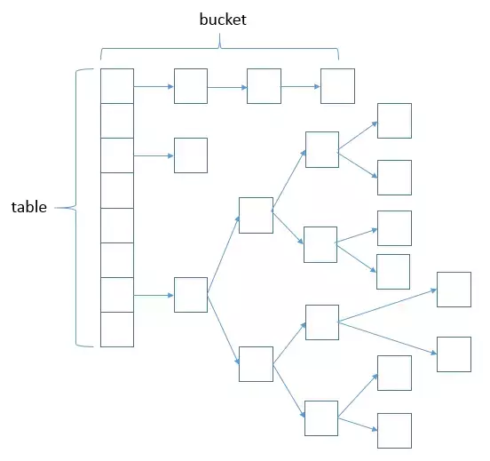
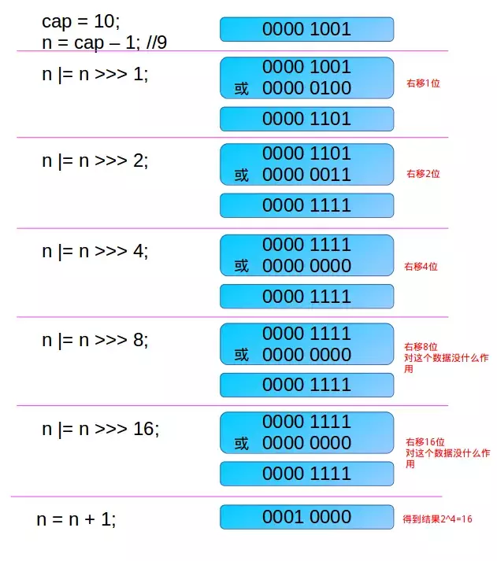
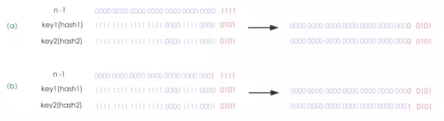
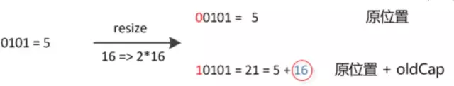
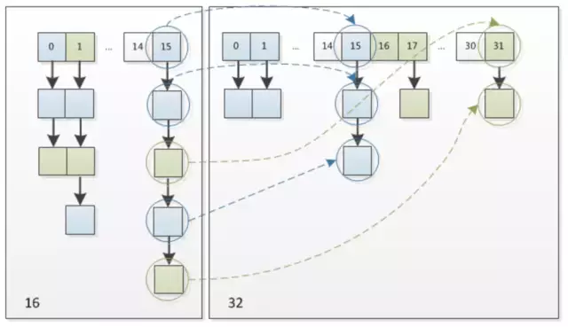

# HashMap详解

[https://mp.weixin.qq.com/s/w282P0z7IDUcatOFtoJgiA](https://mp.weixin.qq.com/s/w282P0z7IDUcatOFtoJgiA)


## 红黑树

红黑树具有以下5种性质：

（1）节点是红色或黑色。

（2）根节点是黑色。

（3）每个叶节点（NIL节点，空节点）是黑色的。

（4）每个红色节点的两个子节点都是黑色。(从每个叶子到根的所有路径上不能有两个连续的红色节点)

（5）从任一节点到其每个叶子的所有路径都包含相同数目的黑色节点。

红黑树的时间复杂度为O(log n)，与树的高度成正比。

红黑树每次的插入、删除操作都需要做平衡，平衡时有可能会改变根节点的位置，颜色转换，左旋，右旋等。


## 数据结构

- 数组+链表+红黑树

> 数组的查询效率为O(1)，链表的查询效率是O(k)，红黑树的查询效率是O(log k)，k为桶中的元素个数，所以当元素数量非常多的时候，转化为红黑树能极大地提高效率。

```java
// 节点定义
static class Node<K,V> implements Map.Entry<K,V> {
    final int hash; //key值的高低16位异或(OXR)以后的数值
    final K key;
    V value;
    Node<K,V> next;

    Node(int hash, K key, V value, Node<K,V> next) {
        this.hash = hash;
        this.key = key;
        this.value = value;
        this.next = next;
    }

    public final K getKey()        { return key; }
    public final V getValue()      { return value; }
    public final String toString() { return key + "=" + value; }

    public final int hashCode() {
        return Objects.hashCode(key) ^ Objects.hashCode(value);
    }

    public final V setValue(V newValue) {
        V oldValue = value;
        value = newValue;
        return oldValue;
    }

    public final boolean equals(Object o) {
        if (o == this)
            return true;
        if (o instanceof Map.Entry) {
            Map.Entry<?,?> e = (Map.Entry<?,?>)o;
            if (Objects.equals(key, e.getKey()) &&
                Objects.equals(value, e.getValue()))
                return true;
        }
        return false;
    }
}
```


HashMap使用链表法避免哈希冲突（相同hash值），当链表长度大于TREEIFY_THRESHOLD（默认为8）时，将链表转换为红黑树，当然小于UNTREEIFY_THRESHOLD（默认为6）时，又会转回链表以达到性能均衡。 我们看一张HashMap的数据结构（数组+链表+红黑树 ）就更能理解table了：




## 属性

```java
public class HashMap<K,V> extends AbstractMap<K,V> implements Map<K,V>, Cloneable, Serializable {
    // 序列号
    private static final long serialVersionUID = 362498820763181265L;    
    // 默认的初始容量是16
    static final int DEFAULT_INITIAL_CAPACITY = 1 << 4;   
    // 最大容量
    static final int MAXIMUM_CAPACITY = 1 << 30; 
    // 默认的填充因子
    static final float DEFAULT_LOAD_FACTOR = 0.75f;
    // 当桶(bucket)上的结点数大于这个值时会转成红黑树
    static final int TREEIFY_THRESHOLD = 8; 
    // 当桶(bucket)上的结点数小于这个值时树转链表
    static final int UNTREEIFY_THRESHOLD = 6;
    // 桶中结构转化为红黑树对应的table的最小大小
    static final int MIN_TREEIFY_CAPACITY = 64;
    // 存储元素的数组，总是2的幂次倍
    transient Node<k,v>[] table; 
    // 存放具体元素的集
    transient Set<map.entry<k,v>> entrySet;
    // 存放元素的个数，注意这个不等于数组的长度。
    transient int size;
    // 每次扩容和更改map结构的计数器
    transient int modCount;   
    // 临界值 当实际大小(容量*填充因子)超过临界值时，会进行扩容
    int threshold;
    // 填充因子
    final float loadFactor;
}
```

## 构造函数

```java
public HashMap() {
    // 初始化填充因子
    this.loadFactor = DEFAULT_LOAD_FACTOR; 
}

public HashMap(int initialCapacity) {
    // 调用HashMap(int, float)型构造函数
    this(initialCapacity, DEFAULT_LOAD_FACTOR);
}

public HashMap(Map<? extends K, ? extends V> m) {
    // 初始化填充因子
    this.loadFactor = DEFAULT_LOAD_FACTOR;
    // 将m中的所有元素添加至HashMap中
    putMapEntries(m, false);
}

public HashMap(int initialCapacity, float loadFactor) {
    // 初始容量不能小于0，否则报错
    if (initialCapacity < 0)
        throw new IllegalArgumentException("Illegal initial capacity: " +
                                            initialCapacity);
    // 初始容量不能大于最大值，否则为最大值
    if (initialCapacity > MAXIMUM_CAPACITY)
        initialCapacity = MAXIMUM_CAPACITY;
    // 填充因子不能小于或等于0，不能为非数字
    if (loadFactor <= 0  Float.isNaN(loadFactor))
        throw new IllegalArgumentException("Illegal load factor: " +
                                            loadFactor);
    // 初始化填充因子                                        
    this.loadFactor = loadFactor;
    // 初始化threshold大小
    this.threshold = tableSizeFor(initialCapacity);    
}
```


```java
// 主要功能是返回一个比给定整数大且最接近的2的幂次方整数，如给定10，返回2的4次方16.
static final int tableSizeFor(int cap) {
   int n = cap - 1;
   n |= n >>> 1;
   n |= n >>> 2;
   n |= n >>> 4;
   n |= n >>> 8;
   n |= n >>> 16;
   return (n < 0) ? 1 : (n >= MAXIMUM_CAPACITY) ? MAXIMUM_CAPACITY : n + 1;
 }
```





```java
/**
  * 将m的所有元素存入本HashMap实例中
  */
 final void putMapEntries(Map<? extends K, ? extends V> m, boolean evict) {
   // 得到 m 中元素的个数
   int s = m.size();
   // 当 m 中有元素时，则需将map中元素放入本HashMap实例。
   if (s > 0) {
     // 判断table是否已经初始化，如果未初始化，则先初始化一些变量。（table初始化是在put时）
     if (table == null) { // pre-size
       // 根据待插入的map 的 size 计算要创建的 HashMap 的容量。
       float ft = ((float) s / loadFactor) + 1.0F;
       int t = ((ft < (float) MAXIMUM_CAPACITY) ? (int) ft : MAXIMUM_CAPACITY);
       // 把要创建的 HashMap 的容量存在 threshold 中
       if (t > threshold)
         threshold = tableSizeFor(t);
     }
     // 如果table初始化过，因为别的函数也会调用它，所以有可能HashMap已经被初始化过了。
     // 判断待插入的 map 的 size,若 size 大于 threshold，则先进行 resize()，进行扩容
     else if (s > threshold)
       resize();
     // 然后就开始遍历 带插入的 map ，将每一个 <Key ,Value> 插入到本HashMap实例。
     for (Map.Entry<? extends K, ? extends V> e : m.entrySet()) {
       K key = e.getKey();
       V value = e.getValue();
       // put(K,V)也是调用 putVal 函数进行元素的插入
       putVal(hash(key), key, value, false, evict);
     }
   }
 }
```


## 为什么数组必须是2的倍数

如下所示的**`hash`计算**：

​	`key` 的 `hash`值的计算是通过hashCode()的高16位异或低16位实现的：

​	(`h = k.hashCode()) ^ (h >>> 16)`


比如，原来的 hashCode : 

1111 1111 1111 1111 0100 1100 0000 1010

移位后的hashCode: 

0000 0000 0000 0000 1111 1111 1111 1111

进行异或(OXR)运算 结果：

1111 1111 1111 1111 1011 0011 1111 0101


这样可以将hashcode高位和低位的值进行混合做异或运算，而且混合后，**低位的信息中加入了高位的信息，这样高位的信息被变相的保留了下来。掺杂的元素多了，那么生成的hash值的随机性会增大。**


至于为什么`table`大小必须是2的次幂(指长度扩为原来2倍)呢？

在扩容的时候，如果数组`table`长度是2的次幂，那么扩容后元素的位置要么是在原位置，要么是在原位置再移动2次幂的位置。

看下图可以明白这句话的意思，n为`table`的长度，图（a）表示扩容前的`key1`和`key2`两种`key`确定索引位置的示例，图（b）表示扩容后`key1`和`key2`两种`key`确定索引位置的示例，其中`hash1`是key1对应的哈希与高位运算结果。



元素在重新计算hash之后，因为n变为2倍，那么n-1的mask范围在高位多1bit(红色)，因此新的index就会发生这样的变化：



因此，我们在扩充HashMap的时候，只需要看看原来的hash值新增的那个bit是1还是0就好了，**是0的话索引没变，是1的话索引变成“原索引+oldCap”**，可以看看下图为16扩充为32的resize示意图 ：




## put

```java
public V put(K key, V value) {
    return putVal(hash(key), key, value, false, true);
}
```


```java
static final int hash(Object key) {
    int h;
    return (key == null) ? 0 : (h = key.hashCode()) ^ (h >>> 16);//key值高低16位异或
}
```


```java
final V putVal(int hash, K key, V value, boolean onlyIfAbsent,
                   boolean evict) {
    Node<K,V>[] tab; Node<K,V> p; int n, i;
    // 步骤①：tab为空则创建 
    // table未初始化或者长度为0，进行扩容
    if ((tab = table) == null  (n = tab.length) == 0)
        n = (tab = resize()).length;
    // 步骤②：计算index，并对null做处理  
    // (n - 1) & hash 确定元素存放在哪个桶中，桶为空，新生成结点放入桶中(此时，这个结点是放在数组中)
    if ((p = tab[i = (n - 1) & hash]) == null)
        tab[i] = newNode(hash, key, value, null);
    // 桶中已经存在元素
    else {
        Node<K,V> e; K k;
        // 步骤③：节点key存在，直接覆盖value 
        // 比较桶中第一个元素(数组中的结点)的hash值相等，key相等
        if (p.hash == hash &&
            ((k = p.key) == key  (key != null && key.equals(k))))
                // 将第一个元素赋值给e，用e来记录
                e = p;
        // 步骤④：判断该链为红黑树 
        // hash值不相等，即key不相等；为红黑树结点
        else if (p instanceof TreeNode)
            // 放入树中
            e = ((TreeNode<K,V>)p).putTreeVal(this, tab, hash, key, value);
        // 步骤⑤：该链为链表 
        // 为链表结点
        else {
            // 在链表最末插入结点
            for (int binCount = 0; ; ++binCount) {
                // 到达链表的尾部
                if ((e = p.next) == null) {
                    // 在尾部插入新结点
                    p.next = newNode(hash, key, value, null);
                    // 结点数量达到阈值，转化为红黑树
                    if (binCount >= TREEIFY_THRESHOLD - 1) // -1 for 1st
                        treeifyBin(tab, hash);
                    // 跳出循环
                    break;
                }
                // 判断链表中结点的key值与插入的元素的key值是否相等
                if (e.hash == hash &&
                    ((k = e.key) == key  (key != null && key.equals(k))))
                    // 相等，跳出循环
                    break;
                // 用于遍历桶中的链表，与前面的e = p.next组合，可以遍历链表
                p = e;
            }
        }
        // 表示在桶中找到key值、hash值与插入元素相等的结点
        if (e != null) { 
            // 记录e的value
            V oldValue = e.value;
            // onlyIfAbsent为false或者旧值为null
            if (!onlyIfAbsent  oldValue == null)
                //用新值替换旧值
                e.value = value;
            // 访问后回调
            afterNodeAccess(e);
            // 返回旧值
            return oldValue;
        }
    }
    // 结构性修改
    ++modCount;
    // 步骤⑥：超过最大容量 就扩容 
    // 实际大小大于阈值则扩容
    if (++size > threshold)
        resize();
    // 插入后回调
    afterNodeInsertion(evict);
    return null;
}
```


## resize

- 什么时候扩容

  在put元素的过程中，如果当前容器中元素的个数达到阈值（当前数组长度乘以加载因子的值，`table.length * loadFactor`）

- 扩容

  其实就是重新计算容量；而这个扩容是计算出所需容器的大小之后重新定义一个新的容器，将原来容器中的元素放入其中。

```java
final Node<K,V>[] resize() {
       // 保存当前table
       Node<K,V>[] oldTab = table;
       // 保存当前table的容量
       int oldCap = (oldTab == null) ? 0 : oldTab.length;
       // 保存当前阈值
       int oldThr = threshold;
       // 初始化新的table容量和阈值 
       int newCap, newThr = 0;
       /*
       1. resize（）函数在size　> threshold时被调用。oldCap大于 0 代表原来的 table 表非空，
          oldCap 为原表的大小，oldThr（threshold） 为 oldCap × load_factor
       */
       if (oldCap > 0) {
           // 若旧table容量已超过最大容量，更新阈值为Integer.MAX_VALUE（最大整形值），这样以后就不会自动扩容了。
           if (oldCap >= MAXIMUM_CAPACITY) {
               threshold = Integer.MAX_VALUE;
               return oldTab;
           }
            // 容量翻倍，使用左移，效率更高
           else if ((newCap = oldCap << 1) < MAXIMUM_CAPACITY &&
                    oldCap >= DEFAULT_INITIAL_CAPACITY)
               // 阈值翻倍
               newThr = oldThr << 1; // double threshold
       }
       /*
       2. resize（）函数在table为空被调用。oldCap 小于等于 0 且 oldThr 大于0，代表用户创建了一个 HashMap，但是使用的构造函数为      
          HashMap(int initialCapacity, float loadFactor) 或 HashMap(int initialCapacity)
          或 HashMap(Map<? extends K, ? extends V> m)，导致 oldTab 为 null，oldCap 为0， oldThr 为用户指定的 HashMap的初始容量。
   　　*/
       else if (oldThr > 0) // initial capacity was placed in threshold
           //当table没初始化时，threshold持有初始容量。还记得threshold = tableSizeFor(t)么;
           newCap = oldThr;
       /*
       3. resize（）函数在table为空被调用。oldCap 小于等于 0 且 oldThr 等于0，用户调用 HashMap()构造函数创建的　HashMap，所有值均采用默认值，oldTab（Table）表为空，oldCap为0，oldThr等于0，
       */
       else {               // zero initial threshold signifies using defaults
           newCap = DEFAULT_INITIAL_CAPACITY;
           newThr = (int)(DEFAULT_LOAD_FACTOR * DEFAULT_INITIAL_CAPACITY);
       }
       // 新阈值为0
       if (newThr == 0) {
           float ft = (float)newCap * loadFactor;
           newThr = (newCap < MAXIMUM_CAPACITY && ft < (float)MAXIMUM_CAPACITY ?
                     (int)ft : Integer.MAX_VALUE);
       }
       threshold = newThr;
       @SuppressWarnings({"rawtypes","unchecked"})
       // 初始化table
       Node<K,V>[] newTab = (Node<K,V>[])new Node[newCap];
       table = newTab;
       if (oldTab != null) {
           // 把 oldTab 中的节点　reHash 到　newTab 中去
           for (int j = 0; j < oldCap; ++j) {
               Node<K,V> e;
               if ((e = oldTab[j]) != null) {
                   oldTab[j] = null;
                   // 若节点是单个节点，直接在 newTab　中进行重定位
                   if (e.next == null)
                       newTab[e.hash & (newCap - 1)] = e;
                   // 若节点是　TreeNode 节点，要进行 红黑树的 rehash　操作
                   else if (e instanceof TreeNode)
                       ((TreeNode<K,V>)e).split(this, newTab, j, oldCap);
                   // 若是链表，进行链表的 rehash　操作
                   else { // preserve order
                       Node<K,V> loHead = null, loTail = null;
                       Node<K,V> hiHead = null, hiTail = null;
                       Node<K,V> next;
                       // 将同一桶中的元素根据(e.hash & oldCap)是否为0进行分割（代码后有图解，可以回过头再来看），分成两个不同的链表，完成rehash
                       do {
                           next = e.next;
                           // 根据算法　e.hash & oldCap 判断节点位置rehash　后是否发生改变
                           //最高位==0，这是索引不变的链表。
                           if ((e.hash & oldCap) == 0) { 
                               if (loTail == null)
                                   loHead = e;
                               else
                                   loTail.next = e;
                               loTail = e;
                           }
                           //最高位==1 （这是索引发生改变的链表）
                           else {  
                               if (hiTail == null)
                                   hiHead = e;
                               else
                                   hiTail.next = e;
                               hiTail = e;
                           }
                       } while ((e = next) != null);
                       if (loTail != null) {  // 原bucket位置的尾指针不为空(即还有node)  
                           loTail.next = null; // 链表最后得有个null
                           newTab[j] = loHead; // 链表头指针放在新桶的相同下标(j)处
                       }
                       if (hiTail != null) {
                           hiTail.next = null;
                           // rehash　后节点新的位置一定为原来基础上加上　oldCap，具体解释看下图
                           newTab[j + oldCap] = hiHead;
                       }
                   }
               }
           }
       }
       return newTab;
   }
}
```


## get


## HashMap线程不安全的点

初始化

put

resize


## HashMap如何同步

```java
Map m = Collections.synchronizeMap(hashMap);
```


# HashTable


# ConCurrentHashMap