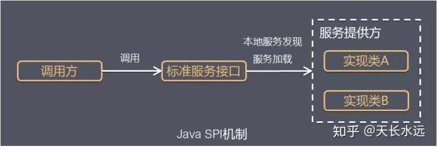
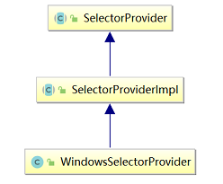

# Java SPI机制详解


## 定义

SPI 全称为 (Service Provider Interface) ，是JDK内置的一种服务提供发现机制。SPI是一种动态替换发现的机制， 比如有个接口，想运行时动态的给它添加实现，你只需要添加一个实现。它可以用来启用框架扩展和替换组件。

比如我们经常遇到的就是java.sql.Driver接口，其他不同厂商可以针对同一接口做出不同的实现，mysql和postgresql都有不同的实现提供给用户，而Java的SPI机制可以为某个接口寻找服务实现。




Java SPI 实际上是“**基于接口的编程＋策略模式＋配置文件**”组合实现的动态加载机制，提供了通过interface寻找implement的方法。类似于IOC的思想，将装配的控制权移到程序之外，从而实现解耦。


## 应用场景

调用者根据需要，使用、扩展或替换实现策略。

- 数据库驱动加载接口实现类的加载

  JDBC加载不同类型数据库的驱动

- 日志门面接口实现类加载

  SLF4J加载不同提供应商的日志实现类

- Spring

  Servlet容器启动初始化`org.springframework.web.SpringServletContainerInitializer`

- Spring Boot

  自动装配过程中，加载META-INF/spring.factories文件，解析properties文件

- Dubbo

  Dubbo大量使用了SPI技术，里面有很多个组件，每个组件在框架中都是以接口的形成抽象出来

  例如Protocol 协议接口


## 约定

使用Java SPI需要符合的约定：

1. `Service provider`提供`Interface`的具体实现后，在目录`META-INF/services`下的文件(以`Interface`全路径命名)中添加具体实现类的全路径名；
2. 接口实现类的jar包存放在使用程序的classpath中；
3. 使用程序使用`ServiceLoader`动态加载实现类(根据目录`META-INF/services`下的配置文件找到实现类的全限定名并调用`classloader`来加载实现类到JVM);
4. `SPI`的实现类必须具有无参数的构造方法。


## Driver示例

数据库DriverManager、Spring、ConfigurableBeanFactory等都用到了SPI机制，这里以数据库DriverManager为例，看一下其实现的内幕。

DriverManager是jdbc里管理和注册不同数据库driver的工具类。针对一个数据库，可能会存在着不同的数据库驱动实现。我们在使用特定的驱动实现时，不希望修改现有的代码，而希望通过一个简单的配置就可以达到效果。 在使用mysql驱动的时候，会有一个疑问，DriverManager是怎么获得某确定驱动类的？我们在运用Class.forName("com.mysql.jdbc.Driver")加载mysql驱动后，就会执行其中的静态代码把driver注册到DriverManager中，以便后续的使用。

在JDBC4.0之前，连接数据库的时候，通常会用`Class.forName("com.mysql.jdbc.Driver")`这句先加载数据库相关的驱动，然后再进行获取连接等的操作。而JDBC4.0之后不需要`Class.forName`来加载驱动，直接获取连接即可，这里使用了Java的SPI扩展机制来实现。

在java中定义了接口java.sql.Driver，并没有具体的实现，具体的实现都是由不同厂商来提供的。

### mysql

在mysql-connector-java-5.1.45.jar中，META-INF/services目录下会有一个名字为java.sql.Driver的文件：

```
com.mysql.jdbc.Driver
com.mysql.fabric.jdbc.FabricMySQLDriver
```

### pg

而在postgresql-42.2.2.jar中，META-INF/services目录下会有一个名字为java.sql.Driver的文件：

```
org.postgresql.Driver
```

### 用法

```java
String url = "jdbc:mysql://localhost:3306/test";
Connection conn = DriverManager.getConnection(url,username,password);
```

上面展示的是mysql的用法，pg用法也是类似。不需要使用`Class.forName("com.mysql.jdbc.Driver")`来加载驱动。

### Mysql DriverManager实现

上面代码没有了加载驱动的代码，我们怎么去确定使用哪个数据库连接的驱动呢？这里就涉及到使用Java的SPI扩展机制来查找相关驱动的东西了，关于驱动的查找其实都在DriverManager中，DriverManager是Java中的实现，用来获取数据库连接，在DriverManager中有一个静态代码块如下：

```java
static {
	loadInitialDrivers();
	println("JDBC DriverManager initialized");
}
```

可以看到其内部的静态代码块中有一个`loadInitialDrivers`方法，`loadInitialDrivers`用法用到了上文提到的spi工具类`ServiceLoader`:

```java
public Void run() {

    ServiceLoader<Driver> loadedDrivers = ServiceLoader.load(Driver.class);
    Iterator<Driver> driversIterator = loadedDrivers.iterator();

    /* Load these drivers, so that they can be instantiated.
         * It may be the case that the driver class may not be there
         * i.e. there may be a packaged driver with the service class
         * as implementation of java.sql.Driver but the actual class
         * may be missing. In that case a java.util.ServiceConfigurationError
         * will be thrown at runtime by the VM trying to locate
         * and load the service.
         *
         * Adding a try catch block to catch those runtime errors
         * if driver not available in classpath but it's
         * packaged as service and that service is there in classpath.
         */
    try{
        while(driversIterator.hasNext()) {
            driversIterator.next();
        }
    } catch(Throwable t) {
        // Do nothing
    }
    return null;
}
```

遍历使用SPI获取到的具体实现，实例化各个实现类。在遍历的时候，首先调用`driversIterator.hasNext()`方法，这里会搜索classpath下以及jar包中所有的META-INF/services目录下的java.sql.Driver文件，并找到文件中的实现类的名字，此时并没有实例化具体的实现类。


## 使用示例

### 接口

比如我们有一个公共的标准接口，类似`java.sql.Driver`

```java
package com.spi.demo;

public interface PayService {
    public void pay();
}
```


### 服务提供者

作为服务的提供者，我们实现上述的接口，可以实现多个

```java
package com.spi.demo;

public class AlipayService implements PayService{

    public AlipayService(){}

    @Override
    public void pay() {
        System.out.println("Alipay");
    }
}

package com.spi.demo;

public class WeixinpayService implements PayService{

    public WeixinpayService(){}
    @Override
    public void pay() {
        System.out.println("Weixin Pay");
    }
}
```


实现接口后，需要在 `META-INF/Services` 目录下新建一个与工程对应的文件，`com.spi.demo.PayService`

```txt
com.spi.demo.AlipayService
com.spi.demo.WeixinpayService
```

在文件中写入自己的实现类


### 服务使用者

新建工程，引用上述服务提供者的`jar`包

```java
import com.spi.demo.PayService;

import java.util.Iterator;
import java.util.ServiceLoader;

public class Main {

        public static void main(String[] args) {
        ServiceLoader<PayService> payServices = ServiceLoader.load(PayService.class);
        Iterator<PayService> iterator = payServices.iterator();
        while (iterator.hasNext()){
            PayService payService = iterator.next();
            payService.pay();
        }
    }

}
```


## SPI原理

ServiceLoader类

```java
public final class ServiceLoader<S> implements Iterable<S>{
private static final String PREFIX = "META-INF/services/";

    // 代表被加载的类或者接口
    private final Class<S> service;

    // 用于定位，加载和实例化providers的类加载器
    private final ClassLoader loader;

    // 创建ServiceLoader时采用的访问控制上下文
    private final AccessControlContext acc;

    // 缓存providers，按实例化的顺序排列
    private LinkedHashMap<String,S> providers = new LinkedHashMap<>();

    // 懒查找迭代器
    private LazyIterator lookupIterator;
  
    ......
}
```


实现的流程如下：

- 1 应用程序调用`ServiceLoader.load`方法 `ServiceLoader.load`方法内先创建一个新的`ServiceLoader`，并实例化该类中的成员变量，包括：
  
  - `loader`(`ClassLoader`类型，类加载器)
  - `acc`(`AccessControlContext`类型，访问控制器)
  - `providers`(`LinkedHashMap<String,S>`类型，用于缓存加载成功的类)
  - `lookupIterator`(实现迭代器功能)
- 2 应用程序通过迭代器接口获取对象实例 ServiceLoader先判断成员变量providers对象中`(LinkedHashMap<String,S>`类型)是否有缓存实例对象，如果有缓存，直接返回。 如果没有缓存，执行类的装载，实现如下：

  - (1) 读取`META-INF/services`下的配置文件，获得所有能被实例化的类的名称，值得注意的是，`ServiceLoader`**可以跨越jar包获取META-INF下的配置文件**，具体加载配置的实现代码如下：

    ```java
    try {
        String fullName = PREFIX + service.getName();
        if (loader == null)
        	configs = ClassLoader.getSystemResources(fullName);
        else
        	configs = loader.getResources(fullName);
        } catch (IOException x) {
        	fail(service, "Error locating configuration files", x);
    }
    ```

  - (2) 通过反射方法`Class.forName()`加载类对象，并用`instance()`方法将类实例化。

  - (3) 把实例化后的类缓存到`providers`对象中， 然后返回实例对象。


## 总结

SPI机制在实际开发中使用得场景也有很多。特别是统一标准的不同厂商实现，当有关组织或者公司定义标准之后，具体厂商或者框架开发者实现，之后提供给开发者使用。


# SelectorProvider SPI

> SelectorProvider 定义了创建 Selector、ServerSocketChannel、SocketChannel 等方法，采用 JDK 的 Service Provider Interface (SPI) 方式实现。


```java
public static ServerSocketChannel open() throws IOException {
    return SelectorProvider.provider().openServerSocketChannel();
}
```

## SelectorProvider 相关类

SelectorProvider 是一个抽象类，需要子类实现。主要方法如下：

```java
public abstract DatagramChannel openDatagramChannel() throws IOException;
public abstract DatagramChannel openDatagramChannel(ProtocolFamily family) throws IOException;
public abstract ServerSocketChannel openServerSocketChannel() throws IOException;
public abstract SocketChannel openSocketChannel() throws IOException;

public abstract AbstractSelector openSelector() throws IOException;
public abstract Pipe openPipe() throws IOException;
```

**总结：** SelectorProvider 相当于一个工厂类，提供了对 DatagramChannel、ServerSocketChannel、SocketChannel、Selector 了创建方法。

java.nio.channels.spi 中提供了一系列的抽象类，由具体的厂商实现，当然我们一般使用的都是 JDK 自己的实现。相关的 SPI 接口如下：

```java
AbstractInterruptibleChannel    -> SocketChannelImpl/ServerSocketChannelImpl     
AbstractSelectableChannel   
AbstractSelectionKey            -> SelectionKeyImpl
AbstractSelector                -> WindowsSelectorImpl/PollSelectorImpl/EpollSelectorImpl
SelectorProvider                -> DefaultSelectorProvider
```

## SelectorProvider 加载过程

### SelectorProvider 加载

```java
private static SelectorProvider provider = null;
public static SelectorProvider provider() {
    synchronized (lock) {
        if (provider != null)
            return provider;
        return AccessController.doPrivileged(
            new PrivilegedAction<SelectorProvider>() {
                public SelectorProvider run() {
                        // 1. java.nio.channels.spi.SelectorProvider 属性指定实现类
                        if (loadProviderFromProperty())
                            return provider;
                        // 2. SPI 指定实现类
                        if (loadProviderAsService())
                            return provider;
                        // 3. 默认实现，Windows 和 Linux 下不同
                        provider = sun.nio.ch.DefaultSelectorProvider.create();
                        return provider;
                    }
                });
    }
}
```

**总结：** SelectorProvider 提供了三种方式来自定义 SelectorProvider 的实现类。

1. `java.nio.channels.spi.SelectorProvider` 属性指定实现类
2. 采用 SPI 方法创建 SelectorProvider
3. 默认实现 DefaultSelectorProvider，Windows 和 Linux 下具体的实现不同。



```java
public abstract class SelectorProviderImpl extends SelectorProvider {
    public DatagramChannel openDatagramChannel() throws IOException {
        return new DatagramChannelImpl(this);
    }
    public DatagramChannel openDatagramChannel(ProtocolFamily family) throws IOException {
        return new DatagramChannelImpl(this, family);
    }

    public Pipe openPipe() throws IOException {
        return new PipeImpl(this);
    }

    public abstract AbstractSelector openSelector() throws IOException;

    public ServerSocketChannel openServerSocketChannel() throws IOException {
        return new ServerSocketChannelImpl(this);
    }
    public SocketChannel openSocketChannel() throws IOException {
        return new SocketChannelImpl(this);
    }
}
```

**总结：** SelectorProviderImpl 提供了 ServerSocketChannel、SocketChannel 的创建，至于 Selector 在不同的平台下有不同的实现。

### Windows 下 DefaultSelectorProvider

```java
public class DefaultSelectorProvider {
    public static SelectorProvider create() {
        return new sun.nio.ch.WindowsSelectorProvider();
    }
}

public class WindowsSelectorProvider extends SelectorProviderImpl {
    public AbstractSelector openSelector() throws IOException {
        return new WindowsSelectorImpl(this);
    }
}
```

### Unix 下 DefaultSelectorProvider

```java
public class DefaultSelectorProvider {
    public static SelectorProvider create() {
        String osname = AccessController
            .doPrivileged(new GetPropertyAction("os.name"));
        if (osname.equals("SunOS"))
            return createProvider("sun.nio.ch.DevPollSelectorProvider");
        if (osname.equals("Linux"))
            return createProvider("sun.nio.ch.EPollSelectorProvider");
        return new sun.nio.ch.PollSelectorProvider();
    }
}
```

**总结：** Unix 平台下需要根据不同的操作系统选择不同的 Selector，例如 Linux 下是 EPollSelectorProvider。

```java
public class EPollSelectorProvider extends SelectorProviderImpl {
    public AbstractSelector openSelector() throws IOException {
        return new EPollSelectorImpl(this);
    }

    public Channel inheritedChannel() throws IOException {
        return InheritedChannel.getChannel();
    }
}
```

**总结：** 无论是 WindowsSelectorProvider 还是 EPollSelectorImpl，它们都继承 SelectorProviderImpl，关于 ServerSocketChannel、SocketChanne 的创建都是一样的，区别是 Selector 有兼容性问题。Socket 在 Windows 和 Linux 下是有兼容性问题的。

```java
ServerSocketChannelImpl(SelectorProvider sp) throws IOException {
    super(sp);
    this.fd =  Net.serverSocket(true);  // 创建 socket，这个 Net 工具本身是跨平台的
    this.fdVal = IOUtil.fdVal(fd);
    this.state = ST_INUSE;
}
```

Socket 的创建是在 `sun.nio.ch.Net` 工具类的 socket0 完成的，这个类很多方法都是 native 方法，在不同的平台有不同的实现。


# Dubbo SPI