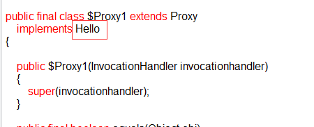
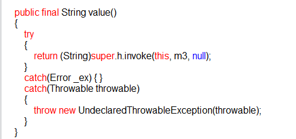
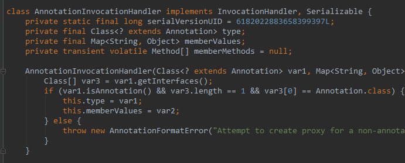
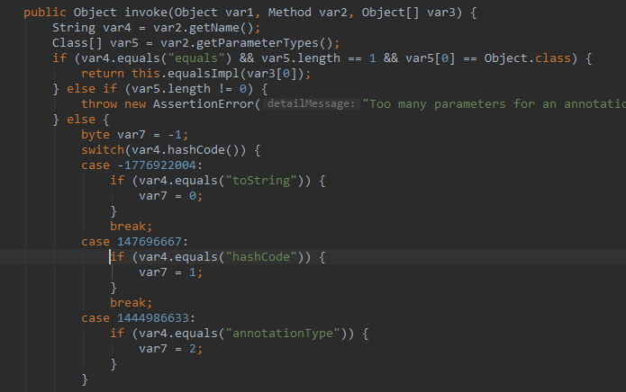
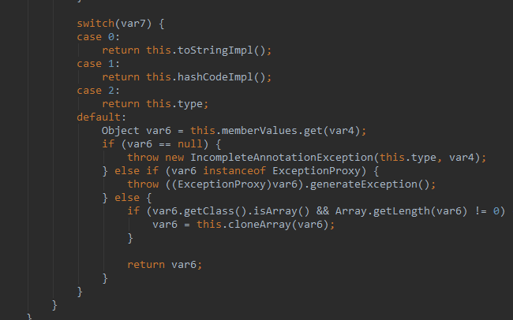

# java注解详解

[原文链接](https://www.cnblogs.com/yangming1996/p/9295168.html)

[原文链接](https://blog.csdn.net/yuzongtao/article/details/83306182)

## 1.1 注解的本质

「java.lang.annotation.Annotation」接口中有这么一句话，用来描述『注解』。

The common interface extended by all annotation types

**所有的注解类型都继承自这个普通的接口**（Annotation）
这句话有点抽象，但却说出了注解的本质。我们看一个 JDK 内置注解的定义：
	

	@Target(ElementType.METHOD)
	@Retention(RetentionPolicy.SOURCE)
	public @interface Override {
	
	}
	这是注解 @Override 的定义，其实它本质上就是：
	public interface Override extends Annotation{
		
	}

- 没错，注解的本质就是一个**继承了 Annotation 接口的接口**。
  有关这一点，你可以去反编译任意一个注解类，你会得到结果的。

- 一个注解准确意义上来说，只不过是一种特殊的注释而已，如果没有解析它的代码，它可能连注释都不如。

## 1.2 解析一个类或者方法的注解

### 1.2.1 编译期直接的扫描

- 指的是编译器在对 java 代码编译字节码的过程中会检测到某个类或者方法被一些注解修饰，这时它就会对于这些注解进行某些处理。典型的就是注解 @Override，一旦编译器检测到某个方法被修饰了 @Override 注解，编译器就会检查当前方法的方法签名是否真正重写了父类的某个方法，也就是比较父类中是否具有一个同样的方法签名。

- 这一种情况只适用于那些编译器已经熟知的注解类，比如 JDK 内置的几个注解

- 而你自定义的注解，编译器是不知道你这个注解的作用的，当然也不知道该如何处理，
  往往只是会根据该注解的作用范围来选择是否编译进字节码文件，仅此而已。

### 1.2.2 运行期反射

## 1.3 元注解

- 修饰注解的注解，通常用在注解的定义上

```java
@Target(ElementType.METHOD)
@Retention(RetentionPolicy.SOURCE)
public @interface Override {

}
```

这是我们 @Override 注解的定义，你可以看到其中的 @Target，@Retention 两个注解就是我们所谓的『元注解』，『元注解』一般用于指定某个注解生命周期以及作用目标等信息。

- JAVA 中有以下几个『元注解』

### 1.3.1 @Target（注解的作用目标）

用于指明被修饰的注解最终可以作用的目标是谁，也就是指明，你的注解到底是用来修饰方法的？修饰类的？还是用来修饰字段属性的。

@Target 的定义如下：

```java
@Documented
@Retention(RetentionPolicy.RUNTIME)
@Target(ElementType.ANNOTATION_TYPE)
public @interface Target {
    /**
				 * Returns an array of the kinds of elements an annotation type
				 * can be applied to.
				 * @return an array of the kinds of elements an annotation type
				 * can be applied to
				 */
    ElementType[] value();
}
```

我们可以通过以下的方式来为这个 value 传值：

```java
@Target(value = {ElementType.FIELD})
```

被这个 @Target 注解修饰的注解将只能作用在成员字段上，不能用于修饰方法或者类。

### 1.3.2 ElementType 是一个枚举类型

```java

ElementType.TYPE：允许被修饰的注解作用在类、接口和枚举上
ElementType.FIELD：允许作用在属性字段上
ElementType.METHOD：允许作用在方法上
ElementType.PARAMETER：允许作用在方法参数上
ElementType.CONSTRUCTOR：允许作用在构造器上
ElementType.LOCAL_VARIABLE：允许作用在本地局部变量上
ElementType.ANNOTATION_TYPE：允许作用在注解上
ElementType.PACKAGE：允许作用在包上
```

### 1.3.3 @Retention：注解的生命周期

- 用于指明当前注解的生命周期。

- 基本定义如下：

  ```java
  @Documented
  		@Retention(RetentionPolicy.RUNTIME)
  		@Target(ElementType.ANNOTATION_TYPE)
  		public @interface Retention {
  			/**
  			 * Returns the retention policy.
  			 * @return the retention policy
  			 */
  			RetentionPolicy value();
  		}
  ```

  同样的，它也有一个 value 属性

  ```java
  @Retention(value = RetentionPolicy.RUNTIME
  ```

  

  这里的 RetentionPolicy 依然是一个枚举类型，它有以下几个枚举值可取：

  ```java
  RetentionPolicy.SOURCE：当前注解编译期可见，不会写入 class 文件
  RetentionPolicy.CLASS：类加载阶段丢弃，会写入 class 文件
  RetentionPolicy.RUNTIME：永久保存，可以反射获取
  ```

## 1.4 JAVA 的内置三大注解

- 除了上述四种元注解外，JDK 还为我们预定义了另外三种注解，它们是：

  > @Override
  >
  > @Deprecated
  >
  > @SuppressWarnings

  ### 1.4.1 @Override

  ```java
  @Target(ElementType.METHOD)
  @Retention(RetentionPolicy.SOURCE)
  public @interface Override {
  }
  ```

  - 它没有任何的属性，所以并不能存储任何其他信息。它只能作用于方法之上，编译结束后将被丢弃。
  - 所以你看，它就是一种典型的『**标记式注解**』，仅被编译器可知，编译器在对 java 文件进行编译成字节码的过程中，一旦检测到某个方法上被修饰了该注解，就会去匹对父类中是否具有一个同样方法签名的函数，如果不是，自然不能通过编译。

  ### 1.4.2 @Deprecated

  ### 1.4.3 @SuppressWarnings 

  - 主要用来压制 java 的警告.

  - 它有一个 value 属性需要你主动的传值，这个 value 代表一个什么意思呢，这个 value 代表的就是需要被压制的警告类型。例如：

    ```java
    public static void main(String[] args) {
    	Date date = new Date(2018, 7, 11);
    }
    ```

    > 这么一段代码，程序启动时编译器会报一个警告：
    >
    > Warning:(8, 21) java: java.util.Date 中的 Date(int,int,int) 已过时

  - 而如果我们不希望程序启动时，编译器检查代码中过时的方法，就可以使用 @SuppressWarnings 注解并给它的 value 属性传入一个参数值来压制编译器的检查。

    ```java
    @SuppressWarning(value = "deprecated")
    public static void main(String[] args) {
    	Date date = new Date(2018, 7, 11);
    }
    ```

  - 这样你就会发现，编译器不再检查 main 方法下是否有过时的方法调用，也就压制了编译器对于这种警告的检查。
    	当然，JAVA 中还有很多的警告类型，他们都会对应一个字符串，通过设置 value 属性的值即可压制对于这一类警告类型的检查。

## 1.5 注解与反射

- 我们就来从虚拟机的层面看看，注解的本质到底是什么

- 首先，我们自定义一个注解类型：

  ```java
  package Main;
  
  import java.lang.annotation.*;
  
  @Target(value = {ElementType.FIELD,ElementType.METHOD})
  @Retention(value = RetentionPolicy.RUNTIME)
  public @interface Hello {
      String value();
  }
  ```

- 这里我们指定了 Hello 这个注解只能修饰字段和方法，并且该注解永久存活，以便我们反射获取。之前我们说过，虚拟机规范定义了一系列和注解相关的属性表，也就是说，无论是字段、方法或是类本身，如果被注解修饰了，就可以被写进字节码文件。属性表有以下几种：

  > RuntimeVisibleAnnotations：运行时可见的注解
  > RuntimeInVisibleAnnotations：运行时不可见的注解
  > RuntimeVisibleParameterAnnotations：运行时可见的方法参数注解
  > RuntimeInVisibleParameterAnnotations：运行时不可见的方法参数注解
  > AnnotationDefault：注解类元素的默认值

- 给大家看虚拟机的这几个注解相关的属性表的目的在于，让大家从整体上构建一个基本的
  印象，注解在字节码文件中是如何存储的。

- 所以，对于一个类或者接口来说，Class 类中提供了以下一些方法用于反射注解。

  > getAnnotation：返回指定的注解
  > isAnnotationPresent：判定当前元素是否被指定注解修饰
  > getAnnotations：返回所有的注解
  > getDeclaredAnnotation：返回本元素的指定注解
  > getDeclaredAnnotations：返回本元素的所有注解，不包含父类继承而来的

  方法、字段中相关反射注解的方法基本是类似的，这里不再赘述，我们下面看一个完整的例子。

- 首先，设置一个虚拟机启动参数，用于捕获 JDK 动态代理类。
  **-Dsun.misc.ProxyGenerator.saveGeneratedFiles=true**

  **System.getProperties().put("sun.misc.ProxyGenerator.saveGeneratedFiles","true");**

  ```java
  package Main;
  
  import java.lang.annotation.Annotation;
  import java.lang.reflect.AnnotatedElement;
  import java.lang.reflect.Method;
  
  public class Test {
      @Hello("hello")
      public static void main(String[] args) throws NoSuchMethodException {
          Class cls = Test.class;
          Method method = cls.getMethod("main", String[].class);
          Hello hello = method.getAnnotation(Hello.class);
      }
  }
  ```

  - 我们说过，注解本质上是继承了 Annotation 接口的接口，而当你通过反射，也就是我们这里getAnnotation 方法去获取一个注解类实例的时候，其实 JDK 是通过动态代理机制生成一个实现我们注解（接口）的代理类。

  - 我们运行程序后，会看到输出目录里有这么一个代理类，反编译之后是这样的：

  

  

  - 代理类实现接口 Hello 并重写其所有方法，包括 value 方法以及接口 Hello 从 Annotation 接口继承而来的方法。

  - 而这个关键的 InvocationHandler 实例是谁？

  - AnnotationInvocationHandler 是 JAVA 中专门用于处理注解的 Handler， 这个类的设计也非常有意思。

    

    这里有一个 memberValues，它是一个 Map 键值对，键是我们注解属性名称，值就是该属性当初被赋上的值。

    

    

  - 而这个 invoke 方法就很有意思了，大家注意看，我们的代理类代理了 Hello 接口中所有的方法，所以对于代理类中任何方法的调用都会被转到这里来。

  - var2 指向被调用的方法实例，而这里首先用变量 var4 获取该方法的简明名称，接着 switch 结构判断当前的调用方法是谁，如果是 Annotation 中的四大方法，将 var7 赋上特定的值。

  - var2 指向被调用的方法实例，而这里首先用变量 var4 获取该方法的简明名称，接着 switch 结构判断当前的调用方法是谁，如果是 Annotation 中的四大方法，将 var7 赋上特定的值。

  - 那么假如 var7 没有匹配上这四种方法，说明当前的方法调用的是自定义注解字节声明的方法，例如我们 Hello 注解的 value 方法。**这种情况下，将从我们的注解 map 中获取这个注解属性对应的值。**

## 1.6自定义注解 

- 注解是给机器看的，注释是给程序员看的，这是两者的区别。
- 大体分为三部分: 定义注解、使用注解、解析注解。

### 1.6.2 类注解

```java
import java.lang.annotation.*;

@Inherited
@Target({ ElementType.METHOD, ElementType.TYPE })
@Retention(RetentionPolicy.RUNTIME)
@interface Test {
	String value();
	String test() default "Test";
	int[] numbers() default { 0, 0, 0 };
}

@Test(value = "TestValue", test = "Schwarzes marken", numbers = { 6, 6, 6 })
class A {}

class TestAnnotation extends A {}

public class Main {

	public static void main(String[] args) {

		//注解无需实例，可直接通过Class类获得
		Test test = TestAnnotation.class.getAnnotation(Test.class);

		System.out.println(test.value() + ": " + test.test() + ": " + test.numbers()[0]);
	}
}
```

### 1.6.1 方法注解：

- （1）定义注解:定义一个简单的注解

```java
import java.lang.annotation.ElementType;
import java.lang.annotation.Retention;
import java.lang.annotation.RetentionPolicy;
import java.lang.annotation.Target;
@Target(ElementType.METHOD)
@Retention(RetentionPolicy.RUNTIME)
public @interface MyAnnotation {
    //定义注解的属性，这不是方法
    String name();//必选注解
    int value() default 20;//有属性就是可选属性
}
```

- (2)注解的使用

  ```java
  package annotation;
  
      public class UseMyAnnotion {
  
      //    这里只用一个属性，另一个value属性有默认值不用设置
      @MyAnnotation(name = "QizoZhi")
      public void show(String str){
      System.out.println(str);
      }
  }
  ```

- （3）解析注解:这里使用了底层的映射原理

  ```java
  package annotation;
  
  import java.lang.reflect.InvocationTargetException;
  import java.lang.reflect.Method;
  
  public class MyAnnotationParser {
  
      public static void main(String[] args) throws NoSuchMethodException, 
      SecurityException, IllegalAccessException, 
      IllegalArgumentException, InvocationTargetException {
          //        获取字节码对象
          Class clazz = UseMyAnnotion.class;
          Method method = clazz.getMethod("show", String.class);
          //        获取方法上面的注解
          MyAnnotation annotation = method.getAnnotation(MyAnnotation.class);
          //        获取注解属性值
          System.out.println(annotation.name()+"\t"+annotation.value());
  
          //        取到值就可以根据业务处理数据
  
          //激活方法，也就是让方法执行
          method.invoke(new UseMyAnnotion(), "HH");
      }
  }
  ```

## 1.7 注解的实现原理

- 实现注解三要素：

  > 1. 注解声明
  >
  > 2. 使用注解的元素
  >
  > 3. 操作注解使其起作用(注解处理器)
  >
  >    这个是注解使用的核心了，前面我们说了那么多注解相关的，那到底java是如何去处理这些注解的呢从**getAnnotation**进去可以看到**java.lang.class实现了AnnotatedElement**方法
  >
  >    MyAnTargetType t = AnnotationTest.class.**getAnnotation**(MyAnTargetType.class);

  ```java
  public final class Class<T> implements java.io.Serializable,
  
  									  GenericDeclaration,
  
  									  Type,
  
  									  AnnotatedElement
  ```

  - **java.lang.reflect.AnnotatedElement** 接口是所有程序元素（Class、Method和Constructor）的父接口，所以程序通过反射获取了某个类的AnnotatedElement对象之后，程序就可以调用该对象的如下四个个方法来访问Annotation信息：

  ```xml
  方法1：<T extends Annotation> T getAnnotation(Class<T> annotationClass): 
  				返回该程序元素上存在的、指定类型的注解，如果该类型注解不存在，则返回null。
  		　　
  方法2：Annotation[] getAnnotations():返回该程序元素上存在的所有注解。
  		　    
  方法3：boolean isAnnotationPresent(Class<?extends Annotation>
  				annotationClass):判断该程序元素上是否包含指定类型的注解，存在则返回true，否则返回false.
  		　　
  方法4：Annotation[] getDeclaredAnnotations()：返回直接存在于此元素上的所有注释。
  				与此接口中的其他方法不同，该方法将忽略继承的注释。（如果没有注释直接存在于此元素				上，则返回长度为零的一个数组。）该方法的调用者可以随意修改返回的数组；
  				这不会对其他调用者返回的数组产生任何影响
  ```

  

## 1.8 总结一下整个反射注解的工作原理

- 首先，我们通过键值对的形式可以为注解属性赋值，像这样：@Hello（value = "hello"）。
- 接着，你用注解修饰某个元素，编译器将在编译期扫描每个类或者方法上的注解，会做一个基本的检查，你的这个注解是否允许作用在当前位置，最后会将注解信息写入元素的属性表。
- 然后，当你进行反射的时候，虚拟机将所有生命周期在 RUNTIME 的注解取出来放到一个 map 中，并创建一个 AnnotationInvocationHandler 实例，把这个 map 传递给它。
- 最后，虚拟机将采用 JDK 动态代理机制生成一个目标注解的代理类，并初始化好处理器。
- 那么这样，一个注解的实例就创建出来了，它本质上就是一个代理类，你应当去理解好 AnnotationInvocationHandler 中 invoke 方法的实现逻辑，这是核心。一句话概括就是，**通过方法名返回注解属性值**。