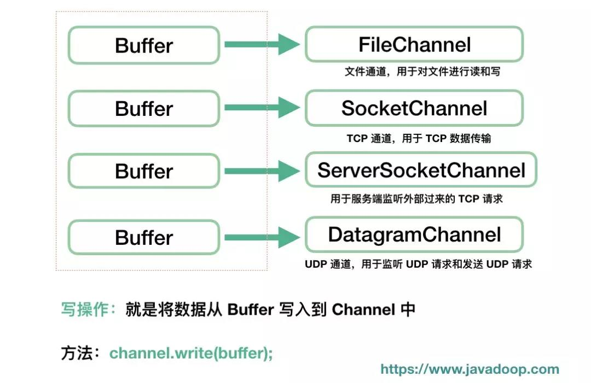

# IO

[链接1](https://www.cnblogs.com/runningTurtle/p/7088125.html)

[链接2](https://zhuanlan.zhihu.com/p/25418336)


## 流的概念和作用

- Java IO 也称为IO流，IO = 流，它的核心就是对文件的操作，对于 字节 、字符类型的输入和输出流。
- IO流的本质是数据传输，并且流是单向的。

流是一组有顺序的，有起点和终点的字节集合，是对数据传输的总称或抽象。即数据在两设备间的传输称为流，**流的本质是数据传输，并且流是单向的。根据数据传输特性将流抽象为各种类，方便更直观的进行数据操作。** 

## IO流的分类

- 根据处理数据类型的不同分为：字符流和字节流
- 根据数据流向不同分为：输入流和输出流

### 字符流和字节流

字符流的由来： <font color="#00dd00">因为数据编码的不同</font>，而有了对字符进行高效操作的流对象。本质其实就是基于字节流读取时，去查了指定的码表。 字节流和字符流的区别：

- 读写单位不同：字节流以字节（8bit）为单位，字符流以字符为单位，根据码表映射字符，一次可能读多个字节。
- 处理对象不同：字节流能处理所有类型的数据（如图片、avi等），而字符流只能处理字符类型的数据。

结论：只要是处理纯文本数据，就优先考虑使用字符流。 除此之外都使用字节流。

### 输入流和输出流

输入流和输出流是以程序为参照物，输入到程序，或是从程序输出。

- 输入流：从文件读入到程序。只能进行读操作。
- 输出流：从程序输出到文件。只能进行写操作。


### 节点流和处理流：

- 节点流：直接与数据源相连，读入或读出。
- 处理流：与节点流一块使用，在节点流的基础上，再套接一层，套接在节点流上的就是处理流。处理流的构造方法总是要带一个其他的流对象做参数。一个流对象经过其他流的多次包装，称为流的链接。

## IO流对象

### 输入字节流 InputStream

从IO中输入字节流的继承图中可以看出。

1）InputStream是所有数据字节流的父类，它是一个抽象类。

2）ByteArrayInputStream、StringBufferInputStream、FileInputStream是三种基本的介质流，它们分别从Byte数组、StringBuffer、和本地文件中读取数据，PipedInputStream是从与其他线程共用的管道中读取数据。

3）ObjectInputStream和所有FileInputStream 的子类都是装饰流（装饰器模式的主角）。


### 输出字节流 OutputStream

从IO中输入字节流的继承图中可以看出。

1）OutputStream是所有输出字节流的父类，它是一个抽象类。

2）ByteArrayOutputStream、FIleOutputStream是两种基本的介质，它们分别向Byte 数组，和本地文件中写入数据。PipedOutputStream是从与其他线程共用的管道中写入数据。

3）ObjectOutputStream和所有FileOutputStream的子类都是装饰流。


图中蓝色为主要对应部分，红色为不对应部分，黑色的虚线部分代表这些流一般需要搭配使用。从上面的图中可以看出Java IO中的字节流是非常对称的。我们来看看这些字节流中不对称的几个类。

1. LineNumberInputStream 主要完成从流中读取数据时，会得到相应的行号，至于什么时候分行、在哪里分行是由改类主动确定的，并不是在原始中有这样一个行号。在输出部分没有对应的部分，我们完全可以自己建立一个LineNumberOutputStream，在最初写入时会有一个基准的行号，以后每次遇到换行时会在下一行添加一个行号，看起来也是可以的。好像更不入流了。
2. PushbackInputStream 的功能是查看最后一个字节，不满意就放入缓冲区。主要用在编译器的语法、词法分析部分。输出部分的BufferedOutputStream 几乎实现相近的功能。
3. StringBufferInputStream 已经被Deprecated，本身就不应该出现在InputStream 部分，主要因为String 应该属于字符流的范围。已经被废弃了，当然输出部分也没有必要需要它了！还允许它存在只是为了保持版本的向下兼容而已。
4. SequenceInputStream 可以认为是一个工具类，将两个或者多个输入流当成一个输入流依次读取。完全可以从IO 包中去除，还完全不影响IO 包的结构，却让其更“纯洁”――纯洁的Decorator 模式。
5. PrintStream 也可以认为是一个辅助工具。主要可以向其他输出流，或者FileInputStream 写入数据，本身内部实现还是带缓冲的。本质上是对其它流的综合运用的一个工具而已。一样可以踢出IO 包！System.out 和System.out 就是PrintStream 的实例。

### 字符输入流Reader

在上面的继承关系图中可以看出：

1、Reader是所有的输入字符流的父类，它是一个抽象类。

2、CharReader、StringReader 是两种基本的介质流，它们分别将Char数组、String中读取数据。PipedInputReader 是从与其他线程共用的管道中读取数据。

3、BuffereReader 很明显的是一个装饰器，它和其子类复制装饰其他Reader对象。

4、FilterReader 是所有自定义具体装饰流的父类，其子类PushbackReader 对Reader 对象进行装饰，回增加一个行号。

5、InputStreamReader 是一个连接字节流和字符流的桥梁，它将字节流转变为字符流。FileReader 可以说是一个达到此功能、常用的工具类，在其源代码中明显使用了将FileInputStream转变为Reader 的方法。我们可以从这个类中得到一定的技巧。Reader 中各个类的用途和使用方法基本和InputStream 中的类使用一致。


### 字符输出流Writer

在上面的关系图中可以看出：

1、Writer 是所有输出字符流的父类，它是一个抽象类。

2、CharArrayWriter、StringWriter 是两种基本的介质流，它们分别向Char 数组、String 中写入数据。PipedInputWriter 是从与其他线程共用的管道中读取数据。


3、BuffereWriter 很明显是一个装饰器，他和其子类复制装饰其他Reader对象。

4、FilterWriter 和PrintStream 及其类似，功能和使用也非常相似。

5、OutputStreamWriter 是OutputStream 到Writer 转换到桥梁，它的子类FileWriter 其实就是一个实现此功能的具体类（具体可以研究一下SourceCode）。功能和使用OutputStream极其类似。


字符流的输入与输出对应图


### 字符流与字节流的转换

转换流的特点：

1、其是字符流和字节流之间的桥梁。

2、可对读取到的字节数据经过指定编码转换成字符。

3、可对读取到的字符数据经过指定编码转换成字节。


何时使用转换流？

1、当字节和字符之间有转换动作时。

2、流操作的数据需要编码或解码时。


具体的对象体现：

1、InputStreamReader：字节到字符的桥梁。

2、OutputStreamWriter：字符到字节的桥梁。

这两个流对象时字符体系中的成员，它们有转换的作用，本身又是字符流，所以在构造的时候需要传入字节流对象进来。

### File类

File类是对文件系统中文件以及文件夹进行封装的对象，可以通过对象的思想来操作文件和文件夹。File类保存文件或目录的各种数据信息，包括文件名、文件长度、最后修改时间、是否可读、获取当前文件的路径名、判断文件是否存在、获取当前目录中的文件列表、创建、删除文件和目录等方法。


### RandomAccessFile类

该对象不是流体系中的一员，其封装了字节流，同时还封装了一个缓冲区（字符数组），通过内部的指针来操作字符数组中的数据。该对象特点：

1、该对象只能操作文件，所以构造函数接受两种数据类型的参数：

· 字符串文件路径

· File对象

2、该对象既可以对文件进行读操作，也能进行写操作，在进行对象实例化时可指定操作模式（r , rw）。

注意：**该对象在实例化时，如果要操作的文件不存在，会自动创建；如果文件存在，写数据未指定位置，会从头开始写，即覆盖原有的内容。**可以用于多线程下载或多个线程同时写数据到文件。


## 各IO类关系梳理

- InputStream: Java IO中的顶级的字节输入流的抽象类，定义了最基础的输入、读取的相关方法。实现了Closeable

  接口。

  - FileInputStream: 继承自`InputStream`的文件输入流类，用于从本地文件中读取字节数据。

  - ByteArrayInputStream: 继承自`InputStream`的字节数组输入流类，它包含一个内部缓冲区，该缓冲区包含从流中读取的字节；通俗点说，它的内部缓冲区就是一个字节数组，而 ByteArrayInputStream 本质就是通过字节数组来实现的。InputStream通过`read()`向外提供接口，供它们来读取字节数据；而 ByteArrayInputStream 的内部额外的定义了一个计数器，它被用来跟踪`read()`方法要读取的下一个字节。

  - StringBufferInputStream: 继承自`InputStream`的字节输入流类，其中读取的字节由字符串的内容提供的输入流。该类已过时，不推荐使用，由 StringReader 代替。

  - PipedInputStream: 继承自`InputStream`的管道输入流类，在使用管道通信时，必须与 PipedOutputStream 配合使用。让多线程可以通过管道进行线程间的通讯。

  - ObjectInputStream: 继承自`InputStream`的对象输入流类，实现了 ObjectInput 和 ObjectStreamConstants 接口。作用是从输入流中读取Java对象和基本数据。只有支持 Serializable 或 Externalizable 接口的对象才能被`ObjectInputStream/ObjectOutputStream`所操作！

  - SequenceInputStream: 继承自`InputStream`的输入合并流类。SequenceInputStream 会将与之相连接的流集组合成一个输入流并从第一个输入流开始读取，直到到达文件末尾，接着从第二个输入流读取，依次类推，直到到达包含的最后一个输入流的文件末 尾为止。合并流的作用是将多个源合并合一个源。

  - AudioInputStream: 继承自`InputStream`的音频输入流类。音频输入流是具有指定音频格式和长度的输入流。长度用示例帧表示，不用字节表示。提供几种方法，用于从流读取一定数量的字节，或未指定数量的字节。音频输入流跟踪所读取的最后一个字节。可以跳过任意数量的字节以到达稍后的读取位置。音频输入流可支持标记。设置标记时，会记住当前位置，以便可以稍后返回到该位置。

  - FilterInputStream: 继承自InputStream的过滤输入流类（装饰器超类），是用来“封装其它的输入流，并为它们提供额外的功能”。

    - BufferedInputStream: 继承自`FilterInputStream`的带缓冲区功能的输入流类（装饰器子类），默认缓冲区大小是8K，能够减少访问磁盘的次数，提高文件读取性能。

    - DataInputStream: 继承自`FilterInputStream`的数据输入流类，实现了 DataInput 接口。它允许应用程序以与机器无关方式从底层输入流中读取基本 Java 数据类型。

    - PushbackInputStream: 继承自`FilterInputStream`的回退输入流类。允许试探性的读取数据流，如果不是我们想要的则返还回去。

    - LineNumberInputStream: 继承自`FilterInputStream`的行号输入流类。可以获取当前的行号或设置当前行号，已过时，已经被 LineNumberReader 替代。

    - CheckedInputStream: 继承自`FilterInputStream`的校验输入流类。

    - CipherInputStream: 继承自`FilterInputStream`的密钥输入流类。

    - DigestInputStream: 继承自`FilterInputStream`的摘要处理输入流类。

    - InflaterInputStream: 继承自FilterInputStream

      的解压缩处理输入流类。

      - GZIPInputStream: 继承自`InflaterInputStream`的gzip文件处理输入流类。

      - ZipInputStream: 继承自InflaterInputStream

        的解压缩处理输入流类。

        - JarInputStream: 继承自`ZipInputStream`的解压缩处理输入流类。

    - DeflaterInputStream: 继承自`FilterInputStream`的压缩数据输入流类。

    - ProgressMonitorInputStream: 继承自`FilterInputStream`的进度监控输入流类。

- OutputStream: JavaIO中的顶级的字节输出流的抽象类，定义了最基础的输出、写入的相关方法。实现了

  Closeable和Flushable接口。

  - FileOutputStream: 继承自`OutputStream`的文件输出流类，用于向本地文件中写入字节数据。

  - ByteArrayOutputStream: 继承自`OutputStream`的字节数组输出流类，ByteArrayOutputStream 中的数据会被写入一个 byte 数组。缓冲区会随着数据的不断写入而自动增长。可使用 toByteArray() 和 toString() 获取数据。

  - PipedOutputStream: 继承自`OutputStream`的管道输出流类，在使用管道通信时，必须与 PipedInputStream 配合使用。让多线程可以通过管道进行线程间的通讯。

  - ObjectOutputStream: 继承自`OutputStream`的对象输出流类，实现了 ObjectOutput 和 ObjectStreamConstants 接口。作用是把Java对象和基本数据写入到对象输出流中。只有支持 Serializable 或 Externalizable 接口的对象才能被`ObjectInputStream/ObjectOutputStream`所操作！

  - FilterOutputStream: 继承自OutputStream

    的过滤输出流类，是用来“封装其它的输出流，并为它们提供额外的功能”。

    - BufferedOutputStream: 继承自`FilterOutputStream`的带缓冲区功能的输出流类，默认缓冲区大小是8K，能够提高文件的写入效率。

    - DataOutputStream: 继承自`FilterOutputStream`的数据输出流类，实现了 DataOutput 接口。它允许应用程序以与机器无关方式向底层输入流中写入基本 Java 数据类型。

    - PrintStream: 继承自`FilterOutputStream`的打印输出流类，实现了 Appendable 和 Closeable 接口。使它们能够方便地打印各种数据值表示形式。PrintStream 永远不会抛出 IOException。PrintStream 提供了自动flush 和 字符集设置功能。所谓自动flush，就是往PrintStream写入的数据会立刻调用flush()函数。

    - CheckedOutputStream: 继承自`FilterOutputStream`的校验输出流类。

    - CipherOutputStream: 继承自`FilterOutputStream`的密钥输出流类。

    - DigestOutputStream: 继承自`FilterOutputStream`的摘要处理输出流类。

    - InflaterOutputStream: 继承自`FilterOutputStream`的解压缩处理输出流类。

    - DeflaterOutputStream: 继承自FilterOutputStream

      的解压缩数据输出流类。

      - GZIPOutputStream: 继承自`DeflaterOutputStream`的gzip文件解压缩输出流类。
      - ZipOutputStream: 继承自DeflaterOutputStream的zip文件解压缩输出流类。
        - JarOutputStream: 继承自`ZipOutputStream`的zip文件解压缩输出流类。

- Reader: JavaIO中的顶级的字符读取的抽象类，定义了最基础的读取方法。实现了 Readable 和 Closeable 接口。

  - BufferedReader: 继承自Reader

    的带缓冲功能的字符流类，默认缓冲区大小是8K，从字符输入流中读取文本，缓冲各个字符，从而实现字符、数组和行的高效读取。创建 BufferReader 时，我们会通过它的构造函数指定某个 Reader 为参数。BufferReader 会将该 Reader 中的数据分批读取，每次读取一部分到缓冲中；操作完缓冲中的这部分数据之后，再从 Reader 中读取下一部分的数据。

    - LineNumberReader: 继承自`BufferedReader`，可以获取当前的行号或设置当前行号。

  - InputStreamReader: 继承自Reader，用于将从字节流转换成字符流的 Reader。是字节流通向字符流的桥梁。如果不指定字符集编码，该解码过程将使用平台默认的字符编码。

    - FileReader: 继承自`InputStreamReader`，用来读取字符文件的便捷类。

  - StringReader: 继承自`Reader`，用于字符串读取的字符流。

  - CharArrayReader: 继承自`Reader`的字符数组输入流类。

  - FilterReader: 继承自Reader的字符过滤输入流抽象类。

    - PushbackReader: 继承自`FilterReader`的字符回退输入流类。

  - PipedReader: 继承自`Reader`的字符管道输入流类。作用是可以通过管道进行线程间的通讯。必须和 PipedWriter 配合使用。

- Writer: JavaIO中的顶级的字符写入的抽象类，定义了最基础的写入方法。实现了 Appendable 、 Closeable 和 Flushable 接口。

  - BufferedWriter: 继承自`Writer`的带缓冲功能的字符流类，默认缓冲区大小是8K，从字符输出流中写入字符到文本中，缓冲各个字符，从而实现字符、数组和行的高效写入。
  - OutputStreamWriter: 继承自Reader，用于将从字节流转换成字符流的 Writer。是字节流通向字符流的桥梁。如果不指定字符集编码，该解码过程将使用平台默认的字符编码。
    - FileWriter: 继承自`OutputStreamWriter`，用来向文件中写入字符的便捷类。
  - FilterWriter: 继承自`Writer`的字符过滤输出流抽象类。与 FilterOutputStream 功能一样、只是简单重写了父类的方法、目的是为所有装饰类提供标准和基本的方法、要求子类必须实现核心方法、和拥有自己的特色。这里 FilterWriter 没有子类、可能其意义只是提供一个接口、留着以后的扩展，本身是一个抽象类。
  - StringWriter: 继承自`Writer`，用于字符串写入的字符流。
  - PipedWriter: 继承自`Writer`的字符管道输出流类。作用是可以通过管道进行线程间的通讯。必须和 PipedReader 配合使用。
  - CharArrayWriter: 继承自`Writer`的字符数组输出流类。
  - PrintWriter: 继承自`Writer`的打印写入类，提供了PrintStream的所有打印方法，其方法也从不抛出IOException。与PrintStream的区别：作为处理流使用时，PrintStream只能封装OutputStream类型的字节流，而PrintWriter既可以封装OutputStream类型的字节流，还能够封装Writer类型的字符输出流并增强其功能。


## 流中主要方法梳理

### InputStream中的主要方法

- `abstract int read()`: 从流中读取数据，读取一个字节，返回值为所读得字节
- `int read(byte b[])`: 从流中读取数据，读取多个字节，放置到字节数组 b 中，通常读取的字节数量为 b 的长度，返回值为实际独取的字节的数量。
- `int read(byte b[], int off, int len)`: 从流中读取数据，读取 len 个字节，放置到以下标 off 开始字节数组 b 中，返回值为实际读取的字节的数量。
- `long skip(long n)`: 读指针跳过n个字节不读，返回值为实际跳过的字节数量。
- `int available()`: 返回值为流中尚未读取的字节的数量。
- `void close()`: 关闭输入流。
- `synchronized void mark(int readlimit)`: 记录当前指针的所在位置，`readlimit`表示读指针读出的`readlimit`个字节后，所标记的指针位置才实效。
- `synchronized void reset()`: 把读指针重新指向用 mark 方法所记录的位置。
- `boolean markSupported()`: 当前的流是否支持读指针的记录功能。

> **注**：其中`read()`返回的是读入的一个字节所对应的 int 值(0-255),而`read(byte[] b)`和`read(byte[] b, int off, int len)`返回的是读入的字节数。

### OutputStream中的主要方法

- `abstract void write(int b)`: 输出数据，往流中写一个字节 b。
- `void write(byte b[])`: 输出数据，往流中写一个字节数组 b。
- `void write(byte b[], int off, int len)`: 输出数据，把字节数组 b 中从下标 off 开始，长度为 len 的字节写入到流中。
- `void flush()`: 刷空输出流，并输出所有被缓存的字节。由于某些流支持缓存功能，该方法将把缓存中所有内容强制输出到流中。
- `void close()`: 关闭输出流。

### Reader中的主要方法

- `int read(java.nio.CharBuffer target)`: 试图读取字符入指定的字符缓冲区。
- `int read()`: 读取单个字符。
- `int read(char cbuf[])`: 读取字符到一个数组中。
- `int read(char cbuf[], int off, int len)`: 读取字符到一个数组中的一部分。
- `long skip(long n)`: 跳过n个字符。
- `boolean ready()`: 通知此流是否已准备好被读取。
- `boolean markSupported()`: 告诉此流是否支持`mark()`操作。
- `void mark(int readAheadLimit)`: 标记流中的当前位置。
- `void reset()`: 重置流。
- `void close()`: 关闭该流并释放与之关联的所有系统资源。

### Writer中的主要方法

- `void write(int c)`: 写入单个字符。
- `void write(char cbuf[])`: 写入字符数组。
- `abstract void write(char cbuf[], int off, int len)`: 写入字符数组的一部分。
- `void write(String str)`: 写入一个字符串。
- `void write(String str, int off, int len)`: 写入一个字符串的一部分。
- `Writer append(CharSequence csq)`: 将指定的字符序列追加写到writer中。
- `Writer append(CharSequence csq, int start, int end)`: 将指定的字符序列的子序列追加写入此writer。
- `Writer append(char c)`: 将指定字符追加到这个writer。
- `abstract void flush()`: 刷新流。
- `abstract void close()`: 关闭流，但要先刷新它


## 使用示例


```java
package com.juc.demo.io;

import org.junit.Test;

import java.io.*;
import java.nio.charset.StandardCharsets;

public class IoTest {

    /**
     * ByteArrayInputStream:
     * 1.构造函数中需要传入一个byte数组作为数据源，当执行read操作时，就会从该数组中读取数据;
     * 2.如果在构造函数中传入了null作为字节数据，那么在执行read操作时就会出现NullPointerException异常，
     * 但是在构造函数初始化阶段不会抛出异常
     * <p>
     * ByteArrayOutputStream:
     * 1.其内部也有一个字节数组用于存储write操作时写入的数据，在构造函数中可以传入一个size指定
     * 其内部的byte数组的大小，如果不指定，那么默认它会将byte数组初始化为32字节，
     * 当持续通过write向ByteArrayOutputStream中写入数据时，如果其内部的byte数组的剩余空间
     * 不能够存储需要写入的数据，那么那么它会通过调用内部的ensureCapacity()方法对其内部
     * 维护的byte数组进行扩容以存储所有要写入的数据，所以不必担心其内部的byte数组太小
     * 导致的IndexOutOfBoundsException之类的异常。
     */
    @Test
    public void testByteArrayInputOutputStream() {

        String str = "I am String!";
        byte[] bytes = str.getBytes();

        ByteArrayInputStream bais = new ByteArrayInputStream(bytes);
        ByteArrayOutputStream baos = new ByteArrayOutputStream();

        byte[] buf = new byte[1024];
        int len = 0;
        try {
            while ((len = bais.read(buf)) > 0) {
                baos.write(buf, 0, len);
            }
            System.out.println(baos.toString("UTF-8"));
        } catch (IOException ioe) {
            ioe.printStackTrace();
        }
    }

    /**
     * FileInputStream 能够将文件作为数据源，读取文件中的流，通过File对象或文件路径等初始化
     *
     * @throws IOException
     */
    @Test
    public void testFileInputOutputStream() throws IOException {
        String inputFileName = "E:/notes/java/javaBasic/java-Enum.md";
        String outputFileName = "E:/temp/file.md";
        FileInputStream fis = null;
        FileOutputStream fos = null;
        try {
            fis = new FileInputStream(inputFileName);
            fos = new FileOutputStream(outputFileName);
            byte[] buf = new byte[1024];
            int length = 0;
            while ((length = fis.read(buf)) > 0) {
                fos.write(buf, 0, length);
            }
        } catch (IOException e) {
            e.printStackTrace();
        } finally {
            fis.close();
            fos.close();
        }
    }

    /**
     * PipedInputStream和PipedOutputStream一般是结合使用的，这两个类用于在两个线程间进行管道通信，
     * 一般在一个线程中执行PipedOutputStream 的write操作，而在另一个线程中执行PipedInputStream的read操作。
     * <p>
     * 可以在构造函数中传入相关的流将PipedInputStream 和PipedOutputStream 绑定起来，
     * 也可以通过二者的connect方法将二者绑定起来，一旦二者进进行了绑定，那么PipedInputStream
     * 的read方法就会自动读取PipedOutputStream写入的数据。
     * <p>
     * PipedInputStream的read操作是阻塞式的，当执行PipedOutputStream的write操作时，PipedInputStream会在
     * 另一个线程中自动读取PipedOutputStream写入的内容，如果PipedOutputStream一直没有执行write操作写入
     * 数据，那么PipedInputStream的read方法会一直阻塞PipedInputStream的read方法所运行的线程直至读到数据。
     * 单独使用PipedInputStream或单独使用PipedOutputStream时没有任何意义的，必须将二者通过connect方法（或在
     * 构造函数中传入对应的流）进行连接绑定，如果单独使用其中的某一个类，就会触发IOException: Pipe Not Connected.
     */
    @Test
    public void testPipeInputOutputStream() {

        PipedOutputStream pos = new PipedOutputStream();
        PipedInputStream pis = new PipedInputStream();

        Thread writerThread = new Thread(() -> {
            String msg = "hello world.";
            System.out.println("writer thread send msg");
            try {
                pos.write(msg.getBytes());
            } catch (IOException e) {
                e.printStackTrace();
            } finally {
                try {
                    pos.close();
                } catch (IOException e) {
                    e.printStackTrace();
                }
            }
        });

        Thread readerThread = new Thread(() -> {
            byte[] buf = new byte[1024];

            System.out.println("reader thread revceive msg");
            try {
                int len = pis.read(buf);
                String message = new String(buf, 0, len, StandardCharsets.UTF_8);
                System.out.println(message);
            } catch (IOException e) {
                e.printStackTrace();
            } finally {
                try {
                    pis.close();
                } catch (IOException e) {
                    e.printStackTrace();
                }
            }
        });
        // 通过pos.connect(pis)将这两种流绑定在一起
        try {
            pos.connect(pis);
        } catch (IOException e) {
            e.printStackTrace();
        }
        readerThread.start();
        writerThread.start();
    }

    /**
     * 此处Person应该声明为static且实现Serializable接口
     * 如果为非static类型，则下述示例会报错 java.io.NotSerializableException
     * <p>
     * 原因：
     * 非静态内部类拥有对外部类的所有成员的完全访问权限，包括实例字段和方法。为实现这一行为，
     * 非静态内部类存储着对外部类的实例的一个隐式引用。序列化时要求所有的成员变量是Serializable,
     * 现在外部的类并没有implements Serializable,所以就抛出java.io.NotSerializableException异常。
     */
    static class Person implements Serializable {

        private String name;
        private int age;

        public Person() {
        }

        public Person(String name, int age) {
            this.name = name;
            this.age = age;
        }

        public String getName() {
            return name;
        }

        public int getAge() {
            return age;
        }

        public void setName(String name) {
            this.name = name;
        }

        public void setAge(int age) {
            this.age = age;
        }
    }

    /**
     * ObjectOutputStream:
     * 具有一系列writeXXX方法，在其构造函数中可以掺入一个OutputStream，可以方便的向指定的输出流中
     * 写入基本类型数据以及String，比如writeBoolean、writeChar、writeInt、writeLong、writeFloat、
     * writeDouble、writeCharts、writeUTF等，除此之外，ObjectOutputStream还具有writeObject方法。
     * writeObject方法中传入的类型必须实现了Serializable接口，从而在执行writeObject操作时将对象
     * 进行序列化成流，并将其写入指定的输出流中。
     * ObjectInputStream:
     * 与ObjectOutputStream相对应，ObjectInputStream有与OutputStream中的writeXXX系列方法完全对应
     * 的readXXX系列方法，专门用于读取OutputStream通过writeXXX写入的数据。
     */
    @Test
    public void testObjectInputOutputStream() {
        try {
            String fileName = "E:/temp/file.txt";

            //将内存中的对象序列化到物理文件中
            FileOutputStream fos = new FileOutputStream(fileName);
            ObjectOutputStream oos = new ObjectOutputStream(fos);

            String description = "以下是人员数组";

            Person[] persons = new Person[]{
                    new Person("iSpring", 26),
                    new Person("Mr.Sun", 27),
                    new Person("Miss.Zhou", 27)
            };

            oos.writeObject(description);

            oos.writeInt(persons.length);

            for (Person person : persons) {
                oos.writeObject(person);
            }
            oos.close();

            //从物理文件中反序列化读取对象信息
            FileInputStream fis = new FileInputStream(fileName);
            ObjectInputStream ois = new ObjectInputStream(fis);
            String str = (String) ois.readObject();
            System.out.println(str);
            int personCount = ois.readInt();
            for (int i = 0; i < personCount; i++) {
                Person person = (Person) ois.readObject();
                StringBuilder sb = new StringBuilder();
                sb.append("姓名: ").append(person.getName()).append(", 年龄: ").append(person.getAge());
                System.out.println(sb);
            }
        } catch (ClassNotFoundException | IOException e) {
            e.printStackTrace();
        }

    }

    /**
     * SequenceInputStream:
     * 主要是将两个（或多个）InputStream在逻辑上合并为一个InputStream，
     * 比如在构造函数中传入两个InputStream，分别为in1和in2,那么SequenceInputStream在
     * 读取操作时会先读取in1，如果in1读取完毕，就会接着读取in2。
     * <p>
     * 在我们理解了SequenceInputStream 的作用是将两个输入流合并为一个输入流之后，
     * 我们就能理解为什么不存在对应的SequenceOutputStream 类了，因为将一个输出流拆分为多个输出流是没有意义的。
     */
    @Test
    public void testSequenceInputOutputStream() {
        String inputFileName1 = "E:/temp/file.txt";
        String inputFileName2 = "E:/temp/file1.txt";
        String outputFileName = "E:/temp/file2.txt";

        try {
            FileInputStream fis1 = new FileInputStream(inputFileName1);
            FileInputStream fis2 = new FileInputStream(inputFileName2);
            SequenceInputStream sis = new SequenceInputStream(fis1, fis2);
            FileOutputStream fos = new FileOutputStream(outputFileName);

            byte[] buf = new byte[1024];
            int length;
            while ((length = sis.read(buf)) > 0) {
                fos.write(buf, 0, length);
            }

            sis.close();
            fos.close();
        } catch (IOException e) {
            e.printStackTrace();
        }
    }

    /**
     * DataInputStream可以让你从InputStream读取Java基本类型来代替原始的字节。
     * DataInputStream来包装InputStream，你就可以从DataInputStream直接以Java基本类型来读取数据。
     * <p>
     * 如果你需要读取的数据是由大于一个字节的java基础类型构成，比如int, long, float, double等，
     * 那么用DataInputStream是很方便的。DataInputStream希望的数据是写入到网络的有序多字节数据。
     */
    @Test
    public void testDataInputStream() {
        DataOutputStream dataOutputStream = null;
        try {
            dataOutputStream = new DataOutputStream(new FileOutputStream("E:/temp/file.txt"));
        } catch (FileNotFoundException e) {
            e.printStackTrace();
        }

        try {
            dataOutputStream.writeInt(123);
            dataOutputStream.writeFloat(123.45F);
            dataOutputStream.writeLong(789);
        } catch (IOException e) {
            e.printStackTrace();
        } finally {
            try {
                dataOutputStream.close();
            } catch (IOException e) {
                e.printStackTrace();
            }
        }

        DataInputStream dataInputStream = null;
        try {
            dataInputStream = new DataInputStream(new FileInputStream("E:/temp/file.txt"));
        } catch (FileNotFoundException e) {
            e.printStackTrace();
        }

        int int123 = 0;
        float float12345 = 0;
        long long789 = 0;
        try {
            int123 = dataInputStream.readInt();
            float12345 = dataInputStream.readFloat();
            long789 = dataInputStream.readLong();
        } catch (IOException e) {
            e.printStackTrace();
        } finally {
            try {
                dataInputStream.close();
            } catch (IOException e) {
                e.printStackTrace();
            }
        }

        System.out.println("int123     = " + int123);
        System.out.println("float12345 = " + float12345);
        System.out.println("long789    = " + long789);
    }

    /**
     * 打印流 -> PrintWriter
     */
    @Test
    public void testPrintStream() {
        PrintStream ps = null;        // 声明打印流对象
        // 使用FileOuputStream实例化，意味着所有的输出是向文件之中
        try {
            String inputFileName = "E:/temp/file.txt";
            ps = new PrintStream(new FileOutputStream(inputFileName));
            ps.print("hello ");
            ps.println("world!!!");
            ps.print("1 + 1 = " + 2);
        } catch (FileNotFoundException e) {
            e.printStackTrace();
        } finally {
            if (ps != null) {
                ps.close();
            }
        }
    }

    /**
     * 回退流：
     * 在JAVA IO中所有的数据都是采用顺序的读取方式，即对于一个输入流来讲都是采用从头到尾的顺序读取的，
     * 如果在输入流中某个不需要的内容被读取进来，则只能通过程序将这些不需要的内容处理掉，为了解决这样
     * 的处理问题，在JAVA中提供了一种回退输入流（PushbackInputStream、PushbackReader），可以把读取进
     * 来的某些数据重新回退到输入流的缓冲区之中。
     * <p>
     * 常用方法
     * 1、public PushbackInputStream(InputStream in) 构造方法 将输入流放入到回退流之中。
     * 2、public int read() throws IOException   普通读取数据。
     * 3、public int read(byte[] b,int off,int len) throws IOException 普通方法 读取指定范围的数据。
     * 4、public void unread(int b) throws IOException 普通方法 回退一个数据到缓冲区前面。
     * 5、public void unread(byte[] b) throws IOException 普通方法 回退一组数据到缓冲区前面。
     * 6、public void unread(byte[] b,int off,int len) throws IOException 普通方法 回退指定范围的一组数据到缓冲区前面。
     */
    @Test
    public void testPushBackInputStream() {
        String str = "www.baidu.com";        // 定义字符串

        PushbackInputStream push = null;        // 定义回退流对象
        ByteArrayInputStream bai = null;        // 定义内存输入流

        bai = new ByteArrayInputStream(str.getBytes());    // 实例化内存输入流
        push = new PushbackInputStream(bai);    // 从内存中读取数据

        System.out.print("读取之后的数据为：");

        int temp = 0;
        while (true) {
            try {
                if ((temp = push.read()) == -1) {
                    break;
                }
            } catch (IOException e) {
                e.printStackTrace();
            }    // 读取内容
            if (temp == '.') {    // 判断是否读取到了“.”
                try {
                    push.unread(temp);    // 放回到缓冲区之中
                    temp = push.read();    // 再读一遍
                } catch (IOException e) {
                    e.printStackTrace();
                }
                System.out.print("（退回" + (char) temp + "）");
            } else {
                System.out.print((char) temp);    // 输出内容
            }
        }
    }

    @Test
    public void tesBufferedInputOutputStream() {
        try {
            String inputFileName = "E:/temp/file.txt";
            String outputFileName = "E:/temp/file1.txt";

            FileInputStream fis = new FileInputStream(inputFileName);
            BufferedInputStream bis = new BufferedInputStream(fis, 1024 * 10);

            FileOutputStream fos = new FileOutputStream(outputFileName);
            BufferedOutputStream bos = new BufferedOutputStream(fos, 1024 * 10);

            byte[] buf = new byte[1024];
            int length = 0;
            while ((length = bis.read(buf)) > 0) {
                bos.write(buf, 0, length);
            }

            bis.close();
            bos.close();
        } catch (IOException e) {
            e.printStackTrace();
        }
    }
}
```


## 使用到的设计模式

### 装饰器模式

由于java I/O库需要很多性能的各种组合，如果这些性能都是用继承来实现，那么每一种组合都需要一个类，这样就会造成大量行重复的类出现。如果采用装饰模式，那么类的数目就会大大减少，性能的重复也可以减至最少。因此装饰模式是java I/O库基本模式。装饰模式的引进，造成灵活性和复杂性的提高。因此在使用java IO库时，必须理解java IO库是由一些基本的原始流处理器和围绕它们的装饰流处理器所组成的。

以字节输入流为例。`InputStream`是需要被装饰的抽象构件，而其下的`FileInputStream`、`ByteArrayInputStream`等是被装饰的具体构件；`FilterInputStream`是装饰器的父类，`BufferedInputStream`、`DataInputStream`则是具体的装饰器类。

### 适配器模式

适配器模式是java IO库中第二个重要的设计模式。如：`StringBufferInputStream`就是一个适配器类。它继承了`InputStream`类型，同时持有一个对`String`类型的引用。这是将`String`对象适配成`InputStream`类型的对象形式的适配器模式。`PipedOutputStream`也是一个适配器类。`PipedOutputStream`总是和`PipedInputStream`一起使用，它接收一个类型为`PipedInputStream`的输入类型，并将之转换成`OutputStream`类型的输出流，这是一个对象形式的适配器模式应用。


# BIO/NIO/AIO

BIO、NIO和 AIO 是 Java 语言对操作系统的各种 IO 模型的封装。程序员在使用这些 API 的时候，不需要关心操作系统层面的知识，也不需要根据不同操作系统编写不同的代码。只需要使用Java的API就可以了。

- 同步与异步

```properties
同步： 同步就是发起一个调用后，被调用者未处理完请求之前，调用不返回。

异步： 异步就是发起一个调用后，立刻得到被调用者的回应表示已接收到请求，但是被调用者并没有返回结果，此时我们可以处理其他的请求，被调用者通常依靠事件，回调等机制来通知调用者其返回结果。
```

- 阻塞和非阻塞

```properties
阻塞： 阻塞就是发起一个请求，调用者一直等待请求结果返回，也就是当前线程会被挂起，无法从事其他任务，只有当条件就绪才能继续。

非阻塞： 非阻塞就是发起一个请求，调用者不用一直等着结果返回，可以先去干其他事情。
```


## BIO(Blocking I/O)

- **同步阻塞I/O模式**，数据的读取写入必须阻塞在一个线程内等待其完成。


```java
package com.juc.demo.io;

import org.junit.Test;

import java.io.*;
import java.net.InetSocketAddress;
import java.net.ServerSocket;
import java.net.Socket;
import java.util.Date;

class ConnectIOnHandler extends Thread {

    private Socket socket;

    public ConnectIOnHandler(Socket socket) {
        this.socket = socket;
    }

    public void run() {
        try {
            InputStream input = socket.getInputStream();
            BufferedReader reader = new BufferedReader(new InputStreamReader(input));
            while (true) {
                String line = reader.readLine();
                if (line != null) {
                    System.out.println(line);
                }
                if (line != null && line.equals("quit")) {
                    System.out.println(line);
                    socket.close();
                    break;
                }
            }

        } catch (Exception e) {
            e.printStackTrace();
            try {
                socket.close();
            } catch (IOException e1) {
                e1.printStackTrace();
            }
        }
    }
}

class ClientThread implements Runnable {

    private Socket cSocket;
    private int i;

    public ClientThread(Socket cSocket, int i) {
        super();
        this.cSocket = cSocket;
        this.i = i;
    }


    @Override
    public void run() {
        try {
            cSocket.connect(new InetSocketAddress(8088));
            OutputStream out = cSocket.getOutputStream();
            String con = "thread" + i + "\r\n";
            out.write(con.getBytes());
            Thread.sleep(1000);
            out.write("quit".getBytes());
            out.close();
            cSocket.close();

        } catch (Exception e) {
            try {
                cSocket.close();
            } catch (IOException e1) {
                e1.printStackTrace();
            }
            e.printStackTrace();
        }
    }

}

public class Bio {

    @Test
    public void bioServer() {
        try {
            ServerSocket socket = new ServerSocket(8088);
            int i = 1;
            while (true) {
                Socket cSocket = socket.accept();
                System.out.println("线程数:" + i);
                System.out.println(cSocket.getPort());
                new Thread(new ConnectIOnHandler(cSocket)).start();
                i++;
            }

        } catch (Exception e) {
            e.printStackTrace();
        }
    }

    @Test
    public void bioClient() {
        ByteArrayOutputStream output = null;
        try {

            int i = 1;
            while (true) {
                Socket socket = new Socket();
                System.out.println("start new Thread");
                new Thread(new ClientThread(socket, i)).start();
                i++;
                Thread.sleep(2000);
            }
        } catch (Exception e) {
            e.printStackTrace();
        } finally {
            if (output != null) {
                try {
                    output.close();
                } catch (IOException e) {
                    e.printStackTrace();
                }
            }
        }
    }

    @Test
    public void test() {
        // TODO 服务端处理客户端连接请求
        ServerSocket serverSocket = null;
        try {
            serverSocket = new ServerSocket(3333);
        } catch (IOException e) {
            e.printStackTrace();
        }

        // 接收到客户端连接请求之后为每个客户端创建一个新的线程进行链路处理
        ServerSocket finalServerSocket = serverSocket;
        Thread ts = new Thread(() -> {
            while (true) {
                try {
                    // 阻塞方法获取新的连接
                    Socket socket = finalServerSocket.accept();

                    // 每一个新的连接都创建一个线程，负责读取数据
                    new Thread(() -> {
                        try {
                            int len;
                            byte[] data = new byte[1024];
                            InputStream inputStream = socket.getInputStream();
                            // 按字节流方式读取数据
                            while ((len = inputStream.read(data)) != -1) {
                                System.out.println(new String(data, 0, len));
                            }
                        } catch (IOException e) {
                        }
                    }).start();

                } catch (IOException e) {
                }

            }
        });

        // TODO 创建多个线程，模拟多个客户端连接服务端
        Thread tc = new Thread(() -> {
            try {
                Socket socket = new Socket("127.0.0.1", 3333);
                while (true) {
                    try {
                        socket.getOutputStream().write((new Date() + ": hello world").getBytes());
                        Thread.sleep(2000);
                    } catch (Exception e) {
                    }
                }
            } catch (IOException e) {
            }
        });

        ts.start();
        tc.start();

        try {
            ts.join();
        } catch (InterruptedException e) {
            e.printStackTrace();
        }
    }
}
```


## NIO(New I/O，Non-blocking I/O)

- NIO是一种**同步非阻塞的I/O模型**，在Java 1.4 中引入了NIO框架，对应 `java.nio` 包，提供了 `Channel , Selector，Buffer`等抽象。


### Buffer

一个 Buffer 本质上是内存中的一块，我们可以将数据写入这块内存，之后从这块内存获取数据。

java.nio 定义了以下几个 Buffer 的实现


其实核心是最后的 **ByteBuffer**，前面的一大串类只是包装了一下它而已，我们使用最多的通常也是 ByteBuffer。

我们应该将 Buffer 理解为一个数组，IntBuffer、CharBuffer、DoubleBuffer 等分别对应 int[]、char[]、double[] 等。

MappedByteBuffer 用于实现内存映射文件，也不是本文关注的重点。

我觉得操作 Buffer 和操作数组、类集差不多，只不过大部分时候我们都把它放到了 NIO 的场景里面来使用而已。下面介绍 Buffer 中的几个重要属性和几个重要方法。

**position、limit、capacity**

就像数组有数组容量，每次访问元素要指定下标，Buffer 中也有几个重要属性：position、limit、capacity。


最好理解的当然是 capacity，它代表这个缓冲区的容量，一旦设定就不可以更改。比如 capacity 为 1024 的 IntBuffer，代表其一次可以存放 1024 个 int 类型的值。一旦 Buffer 的容量达到 capacity，需要清空 Buffer，才能重新写入值。

position 和 limit 是变化的，我们分别看下读和写操作下，它们是如何变化的。

**position** 的初始值是 0，每往 Buffer 中写入一个值，position 就自动加 1，代表下一次的写入位置。读操作的时候也是类似的，每读一个值，position 就自动加 1。

从写操作模式到读操作模式切换的时候（**flip**），position 都会归零，这样就可以从头开始读写了。

**Limit**：写操作模式下，limit 代表的是最大能写入的数据，这个时候 limit 等于 capacity。写结束后，切换到读模式，此时的 limit 等于 Buffer 中实际的数据大小，因为 Buffer 不一定被写满了。


### 初始化 Buffer 

每个 Buffer 实现类都提供了一个静态方法 `allocate(int capacity)` 帮助我们快速实例化一个 Buffer。如：

```java
ByteBuffer byteBuf = ByteBuffer.allocate(1024);IntBuffer intBuf = IntBuffer.allocate(1024);LongBuffer longBuf = LongBuffer.allocate(1024);// ...
```

另外，我们经常使用 wrap 方法来初始化一个 Buffer。

```java
publicstatic ByteBuffer wrap(byte[] array) {    ...}
```

### 填充 Buffer

各个 Buffer 类都提供了一些 put 方法用于将数据填充到 Buffer 中，如 ByteBuffer 中的几个 put 方法：

```java
// 填充一个 byte 值
public abstract ByteBuffer put(byte b);
// 在指定位置填充一个 int 值
public abstract ByteBuffer put(int index, byte b);
// 将一个数组中的值填充进去
publicfinal ByteBuffer put(byte[] src) {...}
public ByteBuffer put(byte[] src, int offset, int length) {...}
```

上述这些方法需要自己控制 Buffer 大小，不能超过 capacity，超过会抛 java.nio.BufferOverflowException 异常。

对于 Buffer 来说，另一个常见的操作中就是，我们要将来自 Channel 的数据填充到 Buffer 中，在系统层面上，这个操作我们称为**读操作**，因为数据是从外部（文件或网络等）读到内存中。

```java
int num = channel.read(buf);
```

上述方法会返回从 Channel 中读入到 Buffer 的数据大小。

### 提取 Buffer 中的值

前面介绍了写操作，每写入一个值，position 的值都需要加 1，所以 position 最后会指向最后一次写入的位置的后面一个，如果 Buffer 写满了，那么 position 等于 capacity（position 从 0 开始）。

如果要读 Buffer 中的值，需要切换模式，从写入模式切换到读出模式。注意，通常在说 NIO 的读操作的时候，我们说的是从 Channel 中读数据到 Buffer 中，对应的是对 Buffer 的写入操作，初学者需要理清楚这个。

调用 Buffer 的 **flip()** 方法，可以从写入模式切换到读取模式。其实这个方法也就是设置了一下 position 和 limit 值罢了。

```java
publicfinal Buffer flip() {    
    limit = position; // 将 limit 设置为实际写入的数据数量    
    position = 0; // 重置 position 为 0    
    mark = -1; // mark 之后再说   
    return this;
}
```

对应写入操作的一系列 put 方法，读操作提供了一系列的 get 方法：

```java
// 根据 position 来获取数据
public abstractbyteget();
// 获取指定位置的数据
public abstractbyteget(int index);
// 将 Buffer 中的数据写入到数组中
public ByteBuffer get(byte[] dst)
```

附一个经常使用的方法：

```java
new String(buffer.array()).trim();
```

当然了，除了将数据从 Buffer 取出来使用，更常见的操作是将我们写入的数据传输到 Channel 中，如通过 FileChannel 将数据写入到文件中，通过 SocketChannel 将数据写入网络发送到远程机器等。对应的，这种操作，我们称之为**写操作**。

```java
int num = channel.write(buf);
```

### mark() & reset()

除了 position、limit、capacity 这三个基本的属性外，还有一个常用的属性就是 mark。

mark 用于临时保存 position 的值，每次调用 mark() 方法都会将 mark 设值为当前的 position，便于后续需要的时候使用。

```java
publicfinal Buffer mark() {    mark = position;    return this;}
```

那到底什么时候用呢？考虑以下场景，我们在 position 为 5 的时候，先 mark() 一下，然后继续往下读，读到第 10 的时候，我想重新回到 position 为 5 的地方重新来一遍，那只要调一下 reset() 方法，position 就回到 5 了。

```java
publicfinal Buffer reset() {    
    int m = mark;    
    if (m < 0)       
        throw new InvalidMarkException();    
    position = m;    
    return this;
}
```

### rewind() & clear() & compact()

**rewind()**：会重置 position 为 0，通常用于重新从头读写 Buffer。

```java
publicfinal Buffer rewind() {    
    position = 0;    
    mark = -1;    
    return this;
}
```

**clear()**：有点重置 Buffer 的意思，相当于重新实例化了一样。

通常，我们会先填充 Buffer，然后从 Buffer 读取数据，之后我们再重新往里填充新的数据，我们一般在重新填充之前先调用 clear()。

```java
publicfinal Buffer clear() {    
	position = 0;    
	limit = capacity;   
    mark = -1;   
    return this;
}
```

**compact()**：和 clear() 一样的是，它们都是在准备往 Buffer 填充新的数据之前调用。

前面说的 clear() 方法会重置几个属性，但是我们要看到，clear() 方法并不会将 Buffer 中的数据清空，只不过后续的写入会覆盖掉原来的数据，也就相当于清空了数据了。

而 compact() 方法有点不一样，调用这个方法以后，会先处理还没有读取的数据，也就是 position 到 limit 之间的数据（还没有读过的数据），先将这些数据移到左边，然后在这个基础上再开始写入。很明显，此时 limit 还是等于 capacity，position 指向原来数据的右边。


### Channel

所有的 NIO 操作始于通道，通道是数据来源或数据写入的目的地，主要地，我们将关心 java.nio 包中实现的以下几个 Channel：


- FileChannel：文件通道，用于文件的读和写
- DatagramChannel：用于 UDP 连接的接收和发送
- SocketChannel：把它理解为 TCP 连接通道，简单理解就是 TCP 客户端
- ServerSocketChannel：TCP 对应的服务端，用于监听某个端口进来的请求

**我们最应该关注，也是后面将会重点介绍的是 SocketChannel 和 ServerSocketChannel。**

Channel 经常翻译为通道，类似 IO 中的流，用于读取和写入。它与前面介绍的 Buffer 打交道，读操作的时候将 Channel 中的数据填充到 Buffer 中，而写操作时将 Buffer 中的数据写入到 Channel 中。




至少读者应该记住一点，这两个方法都是 channel 实例的方法。

### FileChannel

我想文件操作对于大家来说应该是最熟悉的，不过我们在说 NIO 的时候，其实 FileChannel 并不是关注的重点。而且后面我们说非阻塞的时候会看到，FileChannel 是不支持非阻塞的。

**这里算是简单介绍下常用的操作吧，感兴趣的读者瞄一眼就是了。**

**初始化：**

```java
FileInputStream inputStream = new FileInputStream(new File("/data.txt"));FileChannel fileChannel = inputStream.getChannel();
```

当然了，我们也可以从 RandomAccessFile#getChannel 来得到 FileChannel。

**读取文件内容：**

```java
ByteBuffer buffer = ByteBuffer.allocate(1024);int num = fileChannel.read(buffer);
```

前面我们也说了，所有的 Channel 都是和 Buffer 打交道的。

**写入文件内容：**

```java
ByteBuffer buffer = ByteBuffer.allocate(1024);buffer.put("随机写入一些内容到 Buffer 中".getBytes());
// Buffer 切换为读模式
buffer.flip();
while(buffer.hasRemaining()) {    
    // 将 Buffer 中的内容写入文件    
    fileChannel.write(buffer);
}
```

### SocketChannel

我们前面说了，我们可以将 SocketChannel 理解成一个 TCP 客户端。虽然这么理解有点狭隘，因为我们在介绍 ServerSocketChannel 的时候会看到另一种使用方式。

打开一个 TCP 连接：

```java
SocketChannel socketChannel = SocketChannel.open(new InetSocketAddress("https://www.javadoop.com", 80));
```

当然了，上面的这行代码等价于下面的两行：

```java
// 打开一个通道
SocketChannel socketChannel = SocketChannel.open();
// 发起连接
socketChannel.connect(new InetSocketAddress("https://www.javadoop.com", 80));
```

SocketChannel 的读写和 FileChannel 没什么区别，就是操作缓冲区。

```java
// 读取数据
socketChannel.read(buffer);
// 写入数据到网络连接中
while(buffer.hasRemaining()) {    
    socketChannel.write(buffer);
}
```

不要在这里停留太久，先继续往下走。

### ServerSocketChannel

之前说 SocketChannel 是 TCP 客户端，这里说的 ServerSocketChannel 就是对应的服务端。

ServerSocketChannel 用于监听机器端口，管理从这个端口进来的 TCP 连接。

```java
// 实例化
ServerSocketChannel serverSocketChannel = ServerSocketChannel.open();
// 监听 8080 端口
serverSocketChannel.socket().bind(new InetSocketAddress(8080));while (true) {    
    // 一旦有一个 TCP 连接进来，就对应创建一个 SocketChannel 进行处理    
    SocketChannel socketChannel = serverSocketChannel.accept();
}
```

> 这里我们可以看到 SocketChannel 的第二个实例化方式

到这里，我们应该能理解 SocketChannel 了，它不仅仅是 TCP 客户端，它代表的是一个网络通道，可读可写。

ServerSocketChannel 不和 Buffer 打交道了，因为它并不实际处理数据，它一旦接收到请求后，实例化 SocketChannel，之后在这个连接通道上的数据传递它就不管了，因为它需要继续监听端口，等待下一个连接。

### DatagramChannel

UDP 和 TCP 不一样，DatagramChannel 一个类处理了服务端和客户端。

> 科普一下，UDP 是面向无连接的，不需要和对方握手，不需要通知对方，就可以直接将数据包投出去，至于能不能送达，它是不知道的

**监听端口：**

```java
DatagramChannel channel = DatagramChannel.open();channel.socket().bind(new InetSocketAddress(9090));
ByteBuffer buf = ByteBuffer.allocate(48);channel.receive(buf);
```

**发送数据：**

```java
String newData = "New String to write to file..."                    + System.currentTimeMillis();ByteBuffer buf = ByteBuffer.allocate(48);buf.put(newData.getBytes());buf.flip();int bytesSent = channel.send(buf, new InetSocketAddress("jenkov.com", 80));
```

### Selector

NIO 三大组件就剩 Selector 了，Selector 建立在非阻塞的基础之上，大家经常听到的 **多路复用** 在 Java 世界中指的就是它，用于实现一个线程管理多个 Channel。

读者在这一节不能消化 Selector 也没关系，因为后续在介绍非阻塞 IO 的时候还得说到这个，这里先介绍一些基本的接口操作。

1. 首先，我们开启一个 Selector。你们爱翻译成**选择器**也好，**多路复用器**也好。

   ```java
   Selector selector = Selector.open();
   ```

2. 将 Channel 注册到 Selector 上。前面我们说了，Selector 建立在非阻塞模式之上，所以注册到 Selector 的 Channel 必须要支持非阻塞模式，**FileChannel 不支持非阻塞**，我们这里讨论最常见的 SocketChannel 和 ServerSocketChannel。

   ```java
   // 将通道设置为非阻塞模式，因为默认都是阻塞模式的
   channel.configureBlocking(false);
   // 注册
   SelectionKey key = channel.register(selector, SelectionKey.OP_READ);
   ```

   register 方法的第二个 int 型参数（使用二进制的标记位）用于表明需要监听哪些感兴趣的事件，共以下四种事件：

   我们可以同时监听一个 Channel 中的发生的多个事件，比如我们要监听 ACCEPT 和 READ 事件，那么指定参数为二进制的 000**1**000**1** 即十进制数值 17 即可。

   注册方法返回值是 **SelectionKey** 实例，它包含了 Channel 和 Selector 信息，也包括了一个叫做 Interest Set 的信息，即我们设置的我们感兴趣的正在监听的事件集合。

3. - SelectionKey.OP_READ

     > 对应 00000001，通道中有数据可以进行读取

   - SelectionKey.OP_WRITE

     > 对应 00000100，可以往通道中写入数据

   - SelectionKey.OP_CONNECT

     > 对应 00001000，成功建立 TCP 连接

   - SelectionKey.OP_ACCEPT

     > 对应 00010000，接受 TCP 连接

4. 调用 select() 方法获取通道信息。用于判断是否有我们感兴趣的事件已经发生了。

Selector 的操作就是以上 3 步，这里来一个简单的示例，大家看一下就好了。之后在介绍非阻塞 IO 的时候，会演示一份可执行的示例代码。

```java
Selector selector = Selector.open();
channel.configureBlocking(false);
SelectionKey key = channel.register(selector, SelectionKey.OP_READ);while(true) {  
    // 判断是否有事件准备好  
    int readyChannels = selector.select();  
    if(readyChannels == 0) continue;  
    // 遍历  
    Set<SelectionKey> selectedKeys = selector.selectedKeys();  
    Iterator<SelectionKey> keyIterator = selectedKeys.iterator();  				  while(keyIterator.hasNext()) {    
        SelectionKey key = keyIterator.next();    
        if(key.isAcceptable()) {        
            // a connection was accepted by a ServerSocketChannel.    
        } else if (key.isConnectable()) {        
            // a connection was established with a remote server.    
        } else if (key.isReadable()) {        
            // a channel is ready for reading    
        } else if (key.isWritable()) {        
            // a channel is ready for writing    
        }    keyIterator.remove();  
    }
}
```

对于 Selector，我们还需要非常熟悉以下几个方法：

1. **select()**

   调用此方法，会将**上次 select 之后的**准备好的 channel 对应的 SelectionKey 复制到 selected set 中。如果没有任何通道准备好，这个方法会阻塞，直到至少有一个通道准备好。

2. **selectNow()**

   功能和 select 一样，区别在于如果没有准备好的通道，那么此方法会立即返回 0。

3. **select(long timeout)**

   看了前面两个，这个应该很好理解了，如果没有通道准备好，此方法会等待一会

4. **wakeup()**

   这个方法是用来唤醒等待在 select() 和 select(timeout) 上的线程的。如果 wakeup() 先被调用，此时没有线程在 select 上阻塞，那么之后的一个 select() 或 select(timeout) 会立即返回，而不会阻塞，当然，它只会作用一次。

### 小结

到此为止，介绍了 Buffer、Channel 和 Selector 的常见接口。

Buffer 和数组差不多，它有 position、limit、capacity 几个重要属性。put() 一下数据、flip() 切换到读模式、然后用 get() 获取数据、clear() 一下清空数据、重新回到 put() 写入数据。

Channel 基本上只和 Buffer 打交道，最重要的接口就是 channel.read(buffer) 和 channel.write(buffer)。

Selector 用于实现非阻塞 IO，这里仅仅介绍接口使用，后续请关注非阻塞 IO 的介绍。


### 示例

```java
package com.juc.demo.io;

import java.io.IOException;
import java.net.InetSocketAddress;
import java.net.Socket;
import java.nio.ByteBuffer;
import java.nio.channels.SelectionKey;
import java.nio.channels.Selector;
import java.nio.channels.ServerSocketChannel;
import java.nio.channels.SocketChannel;
import java.nio.charset.Charset;
import java.util.Date;
import java.util.Iterator;
import java.util.Set;

public class Nio {

    public static void main(String[] args) throws IOException {
        // 1. serverSelector负责轮询是否有新的连接，服务端监测到新的连接之后，不再创建一个新的线程，
        // 而是直接将新连接绑定到clientSelector上，这样就不用 IO 模型中 1 个 while 循环在死等
        Selector serverSelector = Selector.open();
        // 2. clientSelector负责轮询连接是否有数据可读
        Selector clientSelector = Selector.open();

        Thread ts = new Thread(() -> {
            try {
                // 对应IO编程中服务端启动
                ServerSocketChannel listenerChannel = ServerSocketChannel.open();
                listenerChannel.socket().bind(new InetSocketAddress(3333));
                listenerChannel.configureBlocking(false);
                listenerChannel.register(serverSelector, SelectionKey.OP_ACCEPT);

                while (true) {
                    // 监测是否有新的连接，这里的1指的是阻塞的时间为 1ms
                    if (serverSelector.select(1) > 0) {
                        Set<SelectionKey> set = serverSelector.selectedKeys();
                        Iterator<SelectionKey> keyIterator = set.iterator();

                        while (keyIterator.hasNext()) {
                            SelectionKey key = keyIterator.next();

                            if (key.isAcceptable()) {
                                try {
                                    // (1) 每来一个新连接，不需要创建一个线程，而是直接注册到clientSelector
                                    SocketChannel clientChannel = ((ServerSocketChannel) key.channel()).accept();
                                    clientChannel.configureBlocking(false);
                                    clientChannel.register(clientSelector, SelectionKey.OP_READ);
                                } finally {
                                    keyIterator.remove();
                                }
                            }

                        }
                    }
                }
            } catch (IOException ignored) {
            }
        });
        Thread tc = new Thread(() -> {
            try {
                while (true) {
                    // (2) 批量轮询是否有哪些连接有数据可读，这里的1指的是阻塞的时间为 1ms
                    if (clientSelector.select(1) > 0) {
                        Set<SelectionKey> set = clientSelector.selectedKeys();
                        Iterator<SelectionKey> keyIterator = set.iterator();

                        while (keyIterator.hasNext()) {
                            SelectionKey key = keyIterator.next();

                            if (key.isReadable()) {
                                try {
                                    SocketChannel clientChannel = (SocketChannel) key.channel();
                                    ByteBuffer byteBuffer = ByteBuffer.allocate(1024);
                                    // (3) 面向 Buffer
                                    clientChannel.read(byteBuffer);
                                    byteBuffer.flip();
                                    System.out.println(
                                            Charset.defaultCharset().newDecoder().decode(byteBuffer).toString());
                                } finally {
                                    keyIterator.remove();
                                    key.interestOps(SelectionKey.OP_READ);
                                }
                            }

                        }
                    }
                }
            } catch (IOException ignored) {
            }
        });

        ts.start();
        tc.start();

        // TODO 创建多个线程，模拟多个客户端连接服务端
        Thread t = new Thread(() -> {
            try {
                Socket socket = new Socket("127.0.0.1", 3333);
                while (true) {
                    try {
                        socket.getOutputStream().write((new Date() + ": hello world").getBytes());
                        Thread.sleep(2000);
                    } catch (Exception e) {
                    }
                }
            } catch (IOException e) {
            }
        });

        t.start();

        try {
            ts.join();
        } catch (InterruptedException e) {
            e.printStackTrace();
        }

        try {
            ts.join();
        } catch (InterruptedException e) {
            e.printStackTrace();
        }
    }
}
```


## AIO(Asynchronous I/O)

- AIO 也就是 NIO 2。在 Java 7 中引入了 NIO 的改进版 NIO 2,它是**异步非阻塞的IO模型**。异步 IO 是基于事件和回调机制实现的，也就是应用操作之后会直接返回，不会堵塞在那里，当后台处理完成，操作系统会通知相应的线程进行后续的操作。


```java
package com.juc.demo.io;
import java.io.IOException;
import java.net.InetSocketAddress;
import java.net.SocketAddress;
import java.nio.ByteBuffer;
import java.nio.channels.AsynchronousServerSocketChannel;
import java.nio.channels.AsynchronousSocketChannel;
import java.nio.channels.CompletionHandler;
import java.util.concurrent.ExecutionException;
import java.util.concurrent.Future;
import java.util.concurrent.TimeUnit;
import java.util.concurrent.TimeoutException;


public class Aio {

    public static final int    PORT = 8082;
    public static final String HOST = "localhost";

    public static void main(String[] args) throws IOException, InterruptedException, ExecutionException {
        new Aio();
    }

    public Aio() throws IOException, InterruptedException, ExecutionException {
        // open a server channel and bind to a free address, then accept a connection
        System.out.println("Open server channel");
        SocketAddress address = new InetSocketAddress(HOST, PORT);
        AsynchronousServerSocketChannel server = AsynchronousServerSocketChannel.open().bind(address);
        System.out.println("Initiate accept");
        Future<AsynchronousSocketChannel> future = server.accept();

        // wait for the accept to finish
        AsynchronousSocketChannel worker = future.get();
        System.out.println("Accept completed");

        ByteBuffer readBuffer = ByteBuffer.allocate(100);
        try {
            // read a message from the client, timeout after 10 seconds
            worker.read(readBuffer).get(10, TimeUnit.SECONDS);
            System.out.println("Message received from client: " + new String(readBuffer.array()));

            // send a message to the client
            ByteBuffer message = ByteBuffer.wrap("hello client, i am Alice.".getBytes());
            worker.write(message);
        } catch (TimeoutException e) {
            System.out.println("Client didn't respond in time");
        }
        server.close();
    }
}


class AIOSocketClient {

    public static final int    PORT = 8082;
    public static final String HOST = "localhost";

    public static void main(String[] args) throws IOException {
        // create a client
        SocketAddress address = new InetSocketAddress(HOST, PORT);
        ClientWrapper client = new ClientWrapper(address);
        // start client thread
        client.start();
        try {
            client.join();
        } catch (InterruptedException e) {
            System.out.println(e);
        }
        client.close();
    }

}

class ClientWrapper extends Thread {

    AsynchronousSocketChannel client;
    Future<Void>              connectFuture;

    public ClientWrapper(SocketAddress server) throws IOException{
        // open a new socket channel and connect to the server
        System.out.println("Open client channel");
        client = AsynchronousSocketChannel.open();
        System.out.println("Connect to server");
        connectFuture = client.connect(server);
    }

    public void run() {
        System.out.println("client run.");
        // if the connect hasn't happened yet cancel it
        // if (!connectFuture.isDone()) {
        // connectFuture.cancel(true);
        // return;
        // }
        try {
            connectFuture.get();
        } catch (InterruptedException e1) {
            System.out.println("client connect error." + e1);
            return;

        } catch (ExecutionException e1) {
            System.out.println("client connect error." + e1);
            return;
        }

        try {
            // send a message to the server
            ByteBuffer message = ByteBuffer.wrap("hello server, i am Bruce.".getBytes());
            // wait for the response
            System.out.println("Sending message to the server...");
            Integer countBytes = client.write(message).get();
            System.out.println(countBytes);

            final ByteBuffer readBuffer = ByteBuffer.allocate(100);
            // Future<Integer> numberBytes = client.read(readBuffer);
            client.read(readBuffer, null, new CompletionHandler<Integer, Object>() {

                @Override
                public void completed(Integer result, Object attachment) {
                    System.out.println("Message received from server: " + new String(readBuffer.array()));
                    clearUp();
                }

                @Override
                public void failed(Throwable e, Object attachment) {
                    System.err.println("Exception performing write");
                    e.printStackTrace();
                    clearUp();
                }

                private void clearUp() {
                    try {
                        client.close();
                    } catch (IOException e) {
                        System.out.println(e);
                    }
                }
            });

        } catch (InterruptedException e) {
            System.out.println(e);
        } catch (ExecutionException e) {
            System.out.println(e);
        }
    }

    public void close() throws IOException {
        client.close();
    }
}
```


# netty