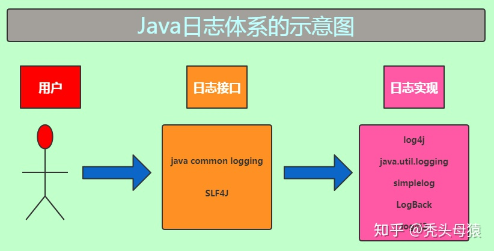

# java日志库

JUL(Java util Logging)、JCL(Java Commons Logging)、Log4j、SLF4J、Logback、Log4j2 等等的日志工具

## Java 日志演化历史

最先出现的是 Apache 开源社区的 Log4j，这个日志确实是应用最广泛的日志工具，成为了 Java 日志的事实上的标准。

然而，当时 Java 的开发主体 Sun 公司认为自己才是正统，在 Jdk1.4中增加了 JUL（在java.util.logging包下）日志实现，企图对抗 Log4j，但是却造成了 Java 目前开发者记录日志局面的混乱。


**为什么 JUL 的出现会导致开发局面混乱**

比如我们的项目应用使用 Log4j，然后使用了一个第三方库，而第三方库使用了 JUL，那么，我们的应用就得同时使用 Log4j 和JUL两个日志工具了，然后又有需要使用另外一个第三方库，但是这个第三方库使用了 Log4j 和 JUL 之外的 simplelog。这个时候你的应用里各种 log 工具满天飞，这势必会使你的程序员感到崩溃。因为这些日志工具互相没有关联，替换和统一日志工具也就变成了比较棘手的一件事情。

> 如果你遇到了这种问题，该如何解决呢？
> 解决这个问题，我们会用到一个设计模式——“适配器模式”，即把这个问题进行抽象，抽象出一个接口层，对每个日志实现都进行适配，这样这些提供给别人的库都直接使用抽象的接口层即可。


为了搞定这个日常开发中比较棘手的问题，Apache 开源社区提供了一个日志框架作为日志的抽象，叫 commons-logging，也被称为 JCL(java common logging)，JCL 对各种日志接口进行抽象，抽象出一个接口层，对每个日志实现都进行适配，这样这些提供给别人的库都直接使用抽象层即可，确实出色地完成了兼容主流的日志实现（Log4j、JUL、simplelog 等），较好的解决了上述问题


但是美好的日子并不长，作为元老级日志 Log4j 的作者 (Ceki Gülcü)，他觉得 JCL 不够优秀，所以他再度出山，搞出了一套更优雅的日志框架 SLF4J（这个也是抽象层），即简单日志门面（Simple Logging Facade for Java），并为 SLF4J 实现了一个亲儿子——logback，确实更加优雅了。

最后，Ceki Gülcü 觉得还是得照顾下自己的 “大儿子”——Log4j，又把 Log4j 进行了改造，就是所谓的 Log4j2，同时支持 JCL 以及 SLF4J。

SLF4J 的出现，又使 Java 日志体系变得混乱起来。



日志库 Log4j，JUL，logback 是互相不兼容的，没有共同的 Interface，所以 commons-logging、SLF4J 通过适配器模式，抽象出来一个共同的接口，然后根据使用的具体日志框架来实现日志。

java common logging 和 SLF4J 都是日志的接口，供用户使用，而没有提供实现，Log4j，JUL，logback 等等才是日志的真正实现。

当我们调用日志接口时，接口会自动寻找恰当的实现，返回一个合适的实例给我们服务。这些过程都是透明化的，用户不需要进行任何操作。


## Log4j

1.依赖

```xml
<dependency>
    <groupId>log4j</groupId>
    <artifactId>log4j</artifactId>
    <version>1.2.17</version>
</dependency>
```

2.配置 log4j.properties 

Log4j 有三个主要组件：记录器， appender 和布局。这三种类型的组件协同工作，使开发人员能够根据消息类型和级别记录消息，并在运行时控制这些消息的格式和报告位置。

Log4j 建议只使用四个级别，优先级从高到低分别是 ERROR、WARN、INFO、DEBUG。

比如定义了 INFO 级别，只有等于及高于这个级别的才进行处理，则应用程序中所有 DEBUG 级别的日志信息将不被打印出来。ALL，打印所有的日志；OFF，关闭所有的日志输出。

appenderName，就是指定日志信息输出到哪个地方。可同时指定多个输出目的地。

在 src 根目录下建立 log4j.properties，根据自己的需求，相应的修改其中的配置，其内容如下所示：

```properties
#配置根Logger
    #改代码表示输输出info级别以上的日志，文件分别输出，一个是file，一个是error
    log4j.rootLogger=info,file,error

    #配置file日志信息输出目的地Appender
    #定义名为file的输出端是每天产生一个日志文件
    log4j.appender.file=org.apache.log4j.DailyRollingFileAppender
    #指定日志信息的最低输出级别位INFO，默认为DEBUG。
    log4j.appender.file.Threshold=INFO
    #指定当前消息输出到jpm/log4j/log.log文件中
    log4j.appender.file.File=/jpm/log4j/log.log
    #指定按天来滚动日志文件
    log4j.appender.file.DatePattern=yyyy-MM-dd
    #配置日志信息的格式（布局）Layout是可以灵活地指定布局模式
    log4j.appender.file.layout=org.apache.log4j.PatternLayout
    #格式化日志，Log4j采用类似C语言中的printf函数的打印格式格式化日志信息
    log4j.appender.file.layout.ConversionPattern=[%d{yyyy-MM-ddHH:mm:ss}][%-5p][jpm-%c{1}-%M(%L)]-%m%n
    #指定输出信息的编码
    log4j.appender.file.encoding=UTF-8

    #配置error日志信息输出目的地Appender
    #定义名为error的输出端是每天产生一个日志文件
    log4j.appender.error=org.apache.log4j.DailyRollingFileAppender
    #指定日志信息的最低输出级别位ERROR，默认为DEBUG。
    log4j.appender.error.Threshold=ERROR
    #指定当前消息输出到jpm/log4j/error.log文件中
    log4j.appender.error.File=/jpm/log4j/error.log
    #指定按月来滚动日志文件
    log4j.appender.error.DatePattern=yyyy-MM
    #配置日志信息的格式（布局）Layout是可以灵活地指定布局模式
    log4j.appender.error.layout=org.apache.log4j.PatternLayout
    #格式化日志，Log4j采用类似C语言中的printf函数的打印格式格式化日志信息
    log4j.appender.error.layout.ConversionPattern=[%d{yyyy-MM-ddHH:mm:ss}][%-5p][jpm-%c{1}-%M(%L)]-%m%n
    #指定输出信息的编码
    log4j.appender.error.encoding=UTF-8

    #使某个功能的日志单独输出到指定的日志文件
    log4j.logger.saveUserLog=INFO,saveUserLog
    #该配置就是让job的日志只输出到自己指定的日志文件中,表示Logger不会在父Logger的appender里输出，默认为true。
    log4j.additivity.saveUserLog=false
    log4j.appender.saveUserLog=org.apache.log4j.DailyRollingFileAppender
    log4j.appender.saveUserLog.File=/jpm/log4j/saveUserLog.log
    log4j.appender.saveUserLog.DatePattern=yyyy-MM-dd
    log4j.appender.saveUserLog.Append=true
    log4j.appender.saveUserLog.layout=org.apache.log4j.PatternLayout
    log4j.appender.saveUserLog.layout.ConversionPattern=%m%n
    log4j.appender.error.encoding=UTF-8
```

输出日志的代码示例

```java
import org.apache.log4j.Logger;

public class TestLog4j {

    public static void main(String[] args) {
        final Logger logger = Logger.getLogger(TestLog4j.class);
        final Logger saveUserLog = Logger.getLogger("saveUserLog");

        if (logger.isDebugEnabled()) {
            logger.debug("debug");
        }

        logger.info("info");
        logger.error("error");

        saveUserLog.info("张三,男,26岁,北京大学,2018-05-19,学霸");

    }

}
```

## JUL

Java Logging API 是 Sun 公司于 2002 年 5 月正式发布的。它是自 J2SE 1.4 版本开始提供的一个新的应用程序接口，需 JDK1.4 版本以上才能支持，java.util.logging.* 包是 JDK 的日志记录 API。

## java common logging

commons-logging 提供的是一个日志接口，是为那些需要建立在不同环境下使用不同日志架构的组件或库的开发者创建的，其中包括 log4j 以及 Java log 的日志架构。commons-logging 有两个基本的抽象类：Log(基本记录器) 和 LogFactory(负责创建 Log 实例)。把日志信息抽象成 commons-logging 的 Log 接口，并由 commons-logging 在运行时决定使用哪种日志架构。因为 Log4j 的强大功能，commons-logging 一般会和 Log4j 一起使用，这几乎成为了 Java 日志的标准工具。

## SLF4J

Simple Logging Facade for JAVA即 java 简单日志门面。 和 commons-loging 一样也是对不同日志框架提供的一个门面封装，可以在部署的时候不修改任何配置即可接入一种日志实现方案，能支持多个参数，并通过 {} 占位符进行替换。

```java
LOGGER.debug("Hello {}", name);
```

正是因为 SLF4J 的这个占位符功能，使得人们越来越多的使用 SLF4J 这个接口用到实际开发项目中。

## logback

LogBack 和 Log4j 都是开源日记工具库，LogBack 是 Log4j 的改良版本，比 Log4j 拥有更多的特性，同时也带来很大性能提升。LogBack 官方建议配合 Slf4j 使用，这样可以灵活地替换底层日志框架。

Logback 主要由三个模块组成：

- logback-core
- logback-classic
- logback-access

其中 logback-core 提供了 Logback 的核心功能，是另外两个组件的基础。logback-classic 的地位和作用等同于 Log4J，它也被认为是 Log4J 的一个改进版，并且它实现了简单日志门面 SLF4J，所以当想配合 SLF4J 使用时，需要将 logback-classic 加入 classpath；而 logback-access 主要作为一个与 Servlet 容器交互的模块，比如说 tomcat 或者 jetty，提供一些与 HTTP 访问相关的功能。


1.依赖

想在 Java 程序中使用 Logback，需要依赖三个 jar 包，分别是 slf4j-api，logback-core，logback-classic。其中 slf4j-api 并不是 Logback 的一部分，建议将 SLF4J 与 Logback 结合使用。

```xml
<dependency>
    <groupId>org.slf4j</groupId>
    <artifactId>slf4j-api</artifactId>
    <version>1.7.25</version>
</dependency>

<dependency>
    <groupId>ch.qos.logback</groupId>
    <artifactId>logback-core</artifactId>
    <version>1.2.3</version>
</dependency>

<dependency>
    <groupId>ch.qos.logback</groupId>
    <artifactId>logback-classic</artifactId>
    <version>1.2.3</version>
</dependency>

<dependency>
    <groupId>ch.qos.logback</groupId>
    <artifactId>logback-access</artifactId>
    <version>1.2.3</version>
</dependency>
```


2.配置 logback.xml

在 src 根目录下建立 logback.xml，根据自己的需求，相应的修改其中的配置

```xml
<?xml version="1.0" encoding="UTF-8"?>
<configuration>
    <include resource="org/springframework/boot/logging/logback/base.xml"/>
    <!-- 日志输出的通道 -->
    <appender name="STDOUT" class="ch.qos.logback.core.ConsoleAppender">
        <!-- encoder 默认配置为PatternLayoutEncoder -->
        <encoder>
            <pattern>%d{HH:mm:ss.SSS} [%thread] %-5level %logger{36} - %msg%n
            </pattern>
        </encoder>
    </appender>
    <!-- 按照每天生成日志文件 -->   
    <appender name="FILE"  class="ch.qos.logback.core.rolling.RollingFileAppender">   
        <file>./logs/qz-liuxuejia.log</file> 
        <Encoding>UTF-8</Encoding>   
        <rollingPolicy class="ch.qos.logback.core.rolling.TimeBasedRollingPolicy">
            <!--日志文件输出的文件名-->
            <FileNamePattern>./logs/qz-liuxuejia.%d{yyyy-MM-dd}.log</FileNamePattern>   
            <MaxHistory>30</MaxHistory>
        </rollingPolicy>   
        <layout class="ch.qos.logback.classic.PatternLayout">  
            <!--格式化输出：%d表示日期，%thread表示线程名，%-5level：级别从左显示5个字符宽度%msg：日志消息，%n是换行符--> 
            <pattern>%d{yyyy-MM-dd HH:mm:ss.SSS} [%thread] %-5level %logger{50} - %msg%n   
            </pattern>   
       </layout> 
        <!--日志文件最大的大小-->
       <!-- <triggeringPolicy class="ch.qos.logback.core.rolling.SizeBasedTriggeringPolicy">
         <MaxFileSize>10MB</MaxFileSize>
       </triggeringPolicy> -->
    </appender> 

    <!-- 指定某一个包或者某一个类的打印级别以及是否传入root进行打印 -->
    <!-- addtivity:是否向上级loger传递打印信息。默认是true。-->
    <!-- <loger>可以包含零个或多个<appender-ref>元素，标识这个appender将会添加到这个loger。-->
    <!-- name:用来指定受此loger约束的某一个包或者具体的某一个类。-->
    <!-- level:
        用来设置打印级别，大小写无关：TRACE, DEBUG, INFO, WARN, ERROR, ALL 和 OFF，还有一个特俗值INHERITED或者同义词NULL，代表强制执行上级的级别。
        如果未设置此属性，那么当前loger将会继承上级的级别。-->
    <logger name="jdbc.sqltiming" level="DEBUG"/>
    <logger name="com.ibatis" level="DEBUG" />
    <logger name="com.ibatis.common.jdbc.SimpleDataSource" level="DEBUG" />
    <logger name="com.ibatis.common.jdbc.ScriptRunner" level="DEBUG" />
    <logger name="com.ibatis.sqlmap.engine.impl.SqlMapClientDelegate" level="DEBUG" />
    <logger name="java.sql.Connection" level="DEBUG" />
    <logger name="java.sql.Statement" level="DEBUG" />
    <logger name="java.sql.PreparedStatement" level="DEBUG" />
    <!-- 也是<loger>元素，但是它是根loger。只有一个level属性，应为已经被命名为"root". -->
    <root level="DEBUG">
        <appender-ref ref="STDOUT"/>
        <appender-ref ref="FILE"/>
    </root>
</configuration>  
```


## Log4j2

Apache Log4j 2 是对 Log4j 的升级，与其前身 Log4j 1.x 相比有了显着的改进，并提供了许多 Logback 可用的改进，同时支持 JCL 以及 SLF4J。


1.依赖

```xml
<dependency>
    <groupId>org.apache.logging.log4j</groupId>
    <artifactId>log4j-api</artifactId>
    <version>2.8.2</version>
</dependency>

<dependency>
    <groupId>org.apache.logging.log4j</groupId>
    <artifactId>log4j-core</artifactId>
    <version>2.8.2</version>
</dependency>
```

2.配置log4j2.xml

```xml
<?xml version="1.0" encoding="UTF-8"?>
<!--日志级别以及优先级排序: OFF > FATAL > ERROR > WARN > INFO > DEBUG > TRACE > ALL -->
<!-- status用来指定Log4j本身的打印日志的级别 -->
<!--monitorInterval：Log4j能够自动检测修改配置文件和重新配置本身，设置间隔秒数 -->
<configuration status="WARN" monitorInterval="30">
    <!--先定义所有的appender -->
    <appenders>
        <!--这个输出控制台的配置 -->
        <console name="Console" target="SYSTEM_OUT">
            <!--输出日志的格式 -->
            <PatternLayout
                           pattern="[%d{yyyy-MM-dd HH:mm:ss.SSS}] [%-5level] %l %logger{36} - %msg%n" />
        </console>

        <!--定义输出到指定位置的文件 -->
        <File name="log" fileName="/jpm/log4j2/logs/log.log" append="true">
            <PatternLayout
                           pattern="[%d{yyyy-MM-dd HH:mm:ss.SSS}] [%-5level] %l %logger{36} - %msg%n" />
        </File>

        <!-- 这个会打印出所有的info及以下级别的信息，每次大小超过size，则这size大小的日志会自动存入按年份-月份建立的文件夹下面并进行压缩，作为存档 -->
        <RollingFile name="RollingFileInfo" fileName="/jpm/log4j2/logs/info.log"
                     filePattern="/jpm/log4j2/logs/$${date:yyyy-MM}/info-%d{yyyy-MM-dd}-%i.log">
            <!--控制台只输出level及以上级别的信息（onMatch），其他的直接拒绝（onMismatch） -->
            <ThresholdFilter level="info" onMatch="ACCEPT"
                             onMismatch="DENY" />
            <PatternLayout
                           pattern="[%d{yyyy-MM-dd HH:mm:ss.SSS}] [%-5level] %l %logger{36} - %msg%n" />
            <Policies>
                <TimeBasedTriggeringPolicy />
                <SizeBasedTriggeringPolicy size="100 MB" />
            </Policies>
            <!-- DefaultRolloverStrategy属性如不设置，则默认为最多同一文件夹下7个文件，这里设置了30 -->
            <DefaultRolloverStrategy max="30" />
        </RollingFile>

        <RollingFile name="RollingFileError" fileName="/jpm/log4j2/logs/error.log"
                     filePattern="/jpm/log4j2/logs/$${date:yyyy-MM}/error-%d{yyyy-MM-dd}-%i.log">
            <ThresholdFilter level="error" onMatch="ACCEPT"
                             onMismatch="DENY" />
            <PatternLayout
                           pattern="[%d{yyyy-MM-dd HH:mm:ss.SSS}] [%-5level] %l %logger{36} - %msg%n" />
            <Policies>
                <TimeBasedTriggeringPolicy />
                <SizeBasedTriggeringPolicy size="100 MB" />
            </Policies>
        </RollingFile>
    </appenders>

    <!--只有定义了logger并引入的appender，appender才会生效 -->
    <loggers>
        <!--过滤掉spring和mybatis的一些无用的DEBUG信息 -->
        <logger name="org.springframework" level="INFO"></logger>
        <logger name="org.mybatis" level="INFO"></logger>
        <root level="INFO">
            <appender-ref ref="Console" />
            <appender-ref ref="log" />
            <appender-ref ref="RollingFileInfo" />
            <appender-ref ref="RollingFileError" />
        </root>
    </loggers>

</configuration>
```

## JCL(java common logging) + Log4j 

使用 commons-logging 的 Log 接口，并由 commons-logging 在运行时决定使用哪种日志架构（如 Log4j）。现在，Apache 通用日志工具 commons-logging 和 Log4j 已经成为 Java 日志的标准工具，这个组合是比较常用的一个日志框架组合。

1.依赖

```xml
<dependency>
    <groupId>commons-logging</groupId>
    <artifactId>commons-logging</artifactId>
    <version>1.2</version>
</dependency>

<dependency>
    <groupId>log4j</groupId>
    <artifactId>log4j</artifactId>
    <version>1.2.17</version>
</dependency>
```

2.配置 common-logging.properties 

只需要一行即可，放在 classpath 下，如果是 Maven 中就在 src/resources 下，不过如果没有 common-logging.properties 文件，但是 src 下有 log4j.properties 配置也可以正常的输出 Log4j 设置的日志。

```properties
org.apache.commons.logging.Log=org.apache.commons.logging.impl.Log4JLogger
```

## SLF4J + Log4j

SLF4j+Log4j 与 JCL+Log4J 的使用方式差不多，主要差异就在 SLF4J 用 用绑定包（slf4j-Log4j12.jar）来告知用哪种日志实现，而 JCL 是通过配置文件来获得该选择哪个日志实现。

1.依赖

```xml
<dependency>
    <groupId>org.slf4j</groupId>
    <artifactId>slf4j-api</artifactId>
    <version>1.7.25</version>
</dependency>

<dependency>
    <groupId>org.slf4j</groupId>
    <artifactId>slf4j-log4j12</artifactId>
    <version>1.7.25</version>
</dependency>
```

2.log4j.properties 配置文件

参见上述log4j配置文件