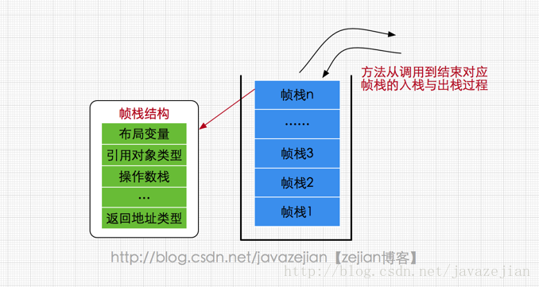
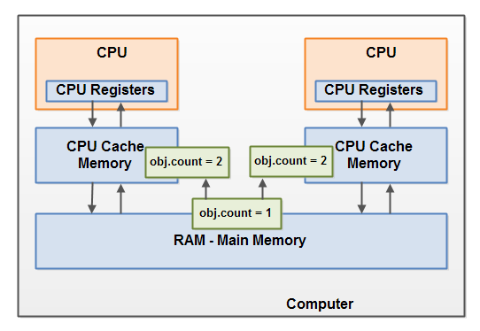

[TOC]


# Java内存区域


方法区（Method Area）：

```tex
方法区属于线程共享的内存区域，又称Non-Heap（非堆），
主要用于存储已被虚拟机加载的类信息、常量、静态变量、即时编译器编译后的代码等数据，
根据Java 虚拟机规范的规定，当方法区无法满足内存分配需求时，将抛出OutOfMemoryError 异常。
值得注意的是在方法区中存在一个叫运行时常量池(Runtime Constant Pool）的区域，它主要用于存放编译器生成的各种字面量和符号引用，这些内容将在类加载后存放到运行时常量池中，以便后续使用。
```


JVM堆（Java Heap）：

```tex
Java 堆也是属于线程共享的内存区域，它在虚拟机启动时创建，是Java 虚拟机所管理的内存中最大的一块，主要用于存放对象实例，几乎所有的对象实例都在这里分配内存，
注意Java 堆是垃圾收集器管理的主要区域，因此很多时候也被称做GC 堆，如果在堆中没有内存完成实例分配，并且堆也无法再扩展时，将会抛出OutOfMemoryError 异常。
```


程序计数器(Program Counter Register)：

```tex
属于线程私有的数据区域，是一小块内存空间，主要代表当前线程所执行的字节码行号指示器。字节码解释器工作时，通过改变这个计数器的值来选取下一条需要执行的字节码指令，分支、循环、跳转、异常处理、线程恢复等基础功能都需要依赖这个计数器来完成。
```


虚拟机栈(Java Virtual Machine Stacks)：

```tex
属于线程私有的数据区域，与线程同时创建，总数与线程关联，代表Java方法执行的内存模型。
每个方法执行时都会创建一个栈桢来存储方法的的变量表、操作数栈、动态链接方法、返回值、返回地址等信息。
每个方法从调用直结束就对于一个栈桢在虚拟机栈中的入栈和出栈过程，如下（图有误，应该为栈桢）：
```




本地方法栈(Native Method Stacks)：

```tex
本地方法栈属于线程私有的数据区域，这部分主要与虚拟机用到的 Native 方法相关
```


# java内存模型(JMM)

```properties
- 并发 并行
- 同步 异步
- 阻塞 非阻塞
- 原子性、可见性、有序性
- 可重入，可重入/不可重入是什么意思
```


## 1.概念

- JVM 中试图定义一种 JMM 来屏蔽各种硬件和操作系统的内存访问差异，以实现让 Java 程序在各种平台下都能达到一致的内存访问效果。

- JMM定义了**Java 虚拟机(JVM)在计算机内存(RAM)中的工作方式**。

- JMM 的主要目标是定义程序中各个变量的访问规则，即在虚拟机中将变量存储到内存和从内存中取出变量这样的底层细节。(此处的变量与 Java 编程中的变量有所区别，它包括了实例字段、静态字段和构成数组对象的元素，但不包括局部变量与方法参数，因为后者是线程私有的，不会被共享，自然就不会存在竞争问题。)

- JMM 是围绕着在并发过程中如何处理**原子性、可见性和有序性**这 3 个特征来建立的。


JMM定义了**线程和主内存之间的抽象关系**：线程之间的共享变量存储在主内存（main memory）中，每个线程都有一个私有的本地内存（local memory），本地内存中存储了该线程以读/写共享变量的副本。


## 2.JVM对JMM的实现

- 在JVM内部，Java内存模型把内存分成了两部分：线程栈区和堆区


- JVM中运行的每个线程都拥有自己的线程栈，线程栈包含了当前线程执行的方法调用相关信息，我们也把它称作调用栈。随着代码的不断执行，调用栈会不断变化。
- 线程栈还包含了当前方法的所有本地变量信息。一个线程只能读取自己的线程栈，
- 所有原始类型(boolean,byte,short,char,int,long,float,double)的本地变量都直接保存在线程栈当中，对于它们的值各个线程之间都是独立的。
- 堆区包含了Java应用创建的所有对象信息，不管对象是哪个线程创建的，其中的对象包括原始类型的封装类（如Byte、Integer、Long等等）。


- 一个本地变量如果是原始类型，那么它会被完全存储到栈区。
- 一个本地变量也有可能是一个对象的引用，这种情况下，这个本地引用会被存储到栈中，但是对象本身仍然存储在堆区。


- 对于一个对象的成员方法，这些方法中包含本地变量，仍需要存储在栈区，即使它们所属的对象在堆区。
- 对于一个对象的成员变量，不管它是原始类型还是包装类型，都会被存储到堆区。


- 堆中的对象可以被多线程共享。如果一个线程获得一个对象的引用，它便可访问这个对象的成员变量。如果两个线程同时调用了同一个对象的同一个方法，那么这两个线程便可同时访问这个对象的成员变量，但是对于本地变量，每个线程都会拷贝一份到自己的线程栈中。


### 硬件内存架构


### Java内存模型和硬件架构之间的桥接

- Java内存模型和硬件内存架构并不一致。硬件内存架构中并没有区分栈和堆，从硬件上看，不管是栈还是堆，大部分数据都会存到主存中，当然一部分栈和堆的数据也有可能会存到CPU寄存器中，如下图所示，Java内存模型和计算机硬件内存架构是一个交叉关系：


- 当对象和变量存储到计算机的各个内存区域时，必然会面临一些问题，其中最主要的两个问题是：

> 1. 共享对象对各个线程的可见性
> 2. 共享对象的竞争现象


#### 共享对象的可见性

- 当多个线程同时操作同一个共享对象时，如果没有合理的使用volatile和synchronization关键字，一个线程对共享对象的更新有可能导致其它线程不可见。


- 要解决共享对象可见性这个问题，我们可以使用`volatile`关键字。volatile 关键字可以保证变量会直接从主存读取，而对变量的更新也会直接写到主存。（总线锁，缓存锁）


#### 竞争现象


- 如果多个线程共享一个对象，如果它们同时修改这个共享对象，这就产生了竞争现象。

如下图所示，线程A和线程B共享一个对象obj。假设线程A从主存读取Obj.count变量到自己的CPU缓存，同时，线程B也读取了Obj.count变量到它的CPU缓存，并且这两个线程都对Obj.count做了加1操作。此时，Obj.count加1操作被执行了两次，不过都在不同的CPU缓存中。

如果这两个加1操作是串行执行的，那么Obj.count变量便会在原始值上加2，最终主存中的Obj.count的值会是3。然而下图中两个加1操作是并行的，不管是线程A还是线程B先flush计算结果到主存，最终主存中的Obj.count只会增加1次变成2，尽管一共有两次加1操作。



- 要解决上面的问题我们可以使用`synchronized`代码块。`synchronized`代码块可以保证同一个时刻只能有一个线程进入代码竞争区，`synchronized`代码块也能保证代码块中所有变量都将会从主存中读，当线程退出代码块时，对所有变量的更新将会flush到主存，不管这些变量是不是`volatile`类型的。
  


