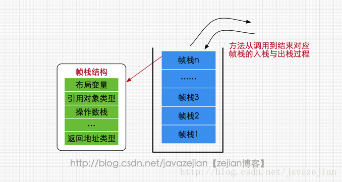
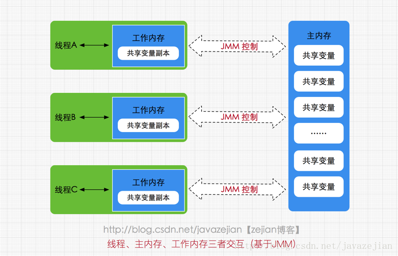

[TOC]


# Jvm内存区域


1. Heap（堆区）

- New Generation（新生代）
  - Eden
  - Survivor From
  - Survivor To
- Old Generation（老年代）

1. 方法区

- Permanent Generation（持久代）

1. Stack（栈区）
2. Metaspace（元空间）
3. Direct ByteBuffer（直接内存）

下面我们就通过一些JVM启动参数来配置以上内存空间

## Heap（堆）内存大小设置

-Xms512m

> 设置JVM堆初始内存为512M

-Xmx1g

> 设置JVM堆最大可用内存为1G

## New Generation（新生代）内存大小设置

-Xmn256m

> 设置JVM的新生代内存大小（－Xmn 是将NewSize与MaxNewSize设为一致。256m）,同下面两个参数
>  -XX:NewSize=256m
>  -XX:MaxNewSize=256m

**还可以通过新生代和老年代内存的比值来设置新生代大小**
 -XX:NewRatio=3

> 设置新生代（包括Eden和两个Survivor区）与老年代的比值（除去持久代）。设置为3，则新生代与老年代所占比值为1：3，新生代占整个堆栈的1/4

## Survivor内存大小设置

-XX:SurvivorRatio=8

> 设置为8,则两个Survivor区与一个Eden区的比值为2:8,一个Survivor区占整个新生代的1/10

## Eden内存大小设置

新生代减去2*Survivor的内存大小就是Eden的大小。

## Old Generation（老年的）的内存大小设置

堆内存减去新生代内存
 如上面设置的参数举例如下：
 老年代初始内存为：512M-256M=256M
 老年代最大内存为：1G-256M=768M

## Stack(栈)内存大小设置

-Xss1m
 每个线程都会产生一个栈。在相同物理内存下，减小这个值能生成更多的线程。如果这个值太小会影响方法调用的深度。

## Permanent Generation（持久代）内存大小设置

方法区内存分配（JDK8以前的版本使用，JDK8以后没有持久代了，使用的MetaSpace）
 -XX: PermSize=128m 设置持久代初始内存大小128M
 -XX:MaxPermSize=512m 设置持久代最大内存大小512M

## Metaspace（元空间）内存大小设置

元空间（Metaspace）(JDK8)
 -XX:MetaspaceSize=128m -XX:MaxMetaspaceSize=512m（JDK8），JDK8的持久代几乎可用完机器的所有内存，同样设一个128M的初始值，512M的最大值保护一下。

> 1. 默认情况下，类元数据分配受到可用的本机内存容量的限制（容量依然取决于你使用32位JVM还是64位操作系统的虚拟内存的可用性）。

1. 一个新的参数 (MaxMetaspaceSize)可以使用。允许你来限制用于类元数据的本地内存。如果没有特别指定，元空间将会根据应用程序在运行时的需求动态设置大小。

## Direct ByteBuffer（直接内存）内存大小设置

-XX:MaxDirectMemorySize

> 此参数的含义是当Direct ByteBuffer分配的堆外内存到达指定大小后，即触发Full GC。注意该值是有上限的，默认是64M，最大为sun.misc.VM.maxDirectMemory()，在程序中中可以获得-XX:MaxDirectMemorySize的设置的值。
>  使用NIO可以api可以使用直接内存。

## 设置新生代代对象进入老年代的年龄

-XX:MaxTenuringThreshold=15

> 设置垃圾最大年龄。如果设置为0的话，则新生代对象不经过Survivor区，直接进入老年代。对于老年代比较多的应用，可以提高效率。如果将此值设置为一个较大值，则新生代对象会在Survivor区进行多次复制，这样可以增加对象再新生代的存活时间，增加在新生代即被回收的概论。

他最大值为15岁，因为对象头中用了4位进行存储垃圾年龄 【1111（二进制）=15（十进制）】。

## 不常用的参数：

-XX:MaxHeapFreeRatio=70

> GC后java堆中空闲量占的最大比例，大于该值，则堆内存会减少

-XX:MinHeapFreeRatio=40

> GC后java堆中空闲量占的最小比例，小于该值，则堆内存会增加

-XX:PretenureSizeThreshold=1024

> （单位字节）对象大小大于1024字节的直接在老年代分配对象

-XX:TLABWasteTargetPercent =1

> TLAB占eden区的百分比    默认1%


# 运行时数据区


## 方法区（Method Area）

- 方法区属于线程共享的内存区域，又称Non-Heap（非堆）
- 主要用于存储已被虚拟机加载的**类信息（如类名、修饰符等）、常量、静态变量、即时编译器编译后的代码**等数据
- 根据Java 虚拟机规范的规定，当方法区无法满足内存分配需求时，将抛出OutOfMemoryError 异常。
- 值得注意的是在方法区中存在一个叫**运行时常量池**(Runtime Constant Pool）的区域，它主要用于存放编译器生成的各种**字面量和符号引用**，这些内容将在类加载后存放到运行时常量池中，以便后续使用。
- 方法区对应Hotspot虚拟机的**永久代（Permanent Generation）/ 元空间**

> 在JDK8之前的HotSpot JVM，存放这些”永久的”的区域叫做“永久代(permanent generation)”。永久代是一片连续的堆空间，在JVM启动之前通过在命令行设置参数-XX:MaxPermSize来设定永久代最大可分配的内存空间，**默认大小是64M**（64位JVM默认是85M）。
>
> 随着JDK8的到来，JVM不再有 **永久代(PermGen)**。但类的元数据信息（metadata）还在，只不过不再是存储在连续的堆空间上，而是移动到叫做“Metaspace”的本地内存（Native memory）。


## JVM堆（Java Heap）

- Java 堆也是属于线程共享的内存区域
- 它在虚拟机启动时创建，是Java 虚拟机所管理的内存中最大的一块，主要用于存放**对象实例以及数组**，几乎所有的对象实例都在这里分配内存
- 注意Java 堆是垃圾收集器管理的主要区域，因此很多时候也被称做GC 堆，如果在堆中没有内存完成实例分配，并且堆也无法再扩展时，将会抛出OutOfMemoryError 异常。


## 程序计数器(Program Counter Register)

- 属于线程私有的数据区域
- 是一小块内存空间，主要代表当前线程所执行的字节码行号指示器。字节码解释器工作时，通过改变这个计数器的值来选取下一条需要执行的字节码指令，分支、循环、跳转、异常处理、线程恢复等基础功能都需要依赖这个计数器来完成。


## 虚拟机栈(Java Virtual Machine Stacks)

- 属于线程私有的数据区域，与线程同时创建，每个线程对应一个虚拟机栈，它是线程私有的，代表Java方法执行的内存模型。
- 每个方法执行时都会创建一个**栈桢**来存储方法的的**局部变量表、操作数栈、动态链接、方法出口等**信息。
- 每个方法从调用至结束就对于一个栈桢在虚拟机栈中的入栈和出栈过程，如下（图有误，应该为栈桢）：




> 虚拟机栈定义了两种**异常类型**：**StackOverFlowError(栈溢出)和OutOfMemoryError（内存溢出）**。
>
> 如果线程调用的栈深度大于虚拟机允许的最大深度，则抛出StackOverFlowError；
>
> 不过大多数虚拟机都允许动态扩展虚拟机栈的大小，所以线程可以一直申请栈，直到内存不足时，抛出OutOfMemoryError。


## 本地方法栈(Native Method Stacks)

- 本地方法栈属于线程私有的数据区域

- 这部分主要与虚拟机用到的 Native 方法相关


## 直接内存 

直接内存并不是虚拟机内存的一部分，也不是Java虚拟机规范中定义的内存区域。jdk1.4中新加入的NIO，引入了通道与缓冲区的IO方式，它可以调用Native方法直接分配堆外内存，这个堆外内存就是本机内存，不会影响到堆内存的大小。


# 典型JVM参数配置参考

- java-Xmx3550m-Xms3550m-Xmn2g-Xss128k
- -XX:ParallelGCThreads=20
- -XX:+UseConcMarkSweepGC-XX:+UseParNewGC

-Xmx3550m:设置JVM最大可用内存为3550M。

-Xms3550m:设置JVM最小内存为3550m。此值可以设置与-Xmx相同,以避免每次垃圾回收完成后JVM重新分配内存。

-Xmn2g:设置年轻代大小为2G。整个堆大小=年轻代大小+年老代大小+持久代大小。持久代一般固定大小为64m,所以增大年轻代后,将会减小年老代大小。此值对系统性能影响较大,官方推荐配置为整个堆的3/8。

-Xss128k:设置每个线程的堆栈大小。JDK5.0以后每个线程堆栈大小为1M,以前每个线程堆栈大小为256K。具体应根据线程所需内存大小进行调整。在相同物理内存下,减小这个值能生成更多的线程。但是操作系统对一个进程内的线程数还是有限制的,不能无限生成,经验值在3000~5000左右。


# 硬件内存模型

 先来看看硬件内存简单架构，如下图所示： 


缓存一致性协议（MESI 协议)；总线锁


# java内存模型(JMM)


## 概念

- JVM 中试图定义一种 JMM 来屏蔽各种硬件和操作系统的内存访问差异，以实现让 Java 程序在各种平台下都能达到一致的内存访问效果。

- JMM定义了**Java 虚拟机(JVM)在计算机内存(RAM)中的工作方式**。

- JMM 的主要目标是定义程序中各个变量的访问规则，即在虚拟机中将变量存储到内存和从内存中取出变量这样的底层细节。(此处的变量与 Java 编程中的变量有所区别，它包括了实例字段、静态字段和构成数组对象的元素，但不包括局部变量与方法参数，因为后者是线程私有的，不会被共享，自然就不会存在竞争问题。)

- JMM 是围绕着在并发过程中如何处理**原子性、可见性和有序性**这 3 个特征来建立的。


JMM定义了**线程和主内存之间的抽象关系**：线程之间的共享变量存储在主内存（main memory）中，每个线程都有一个私有的本地内存（local memory），本地内存中存储了该线程以读/写共享变量的副本。


## JVM对JMM的实现

- 在JVM内部，Java内存模型把内存分成了两部分：线程栈区和堆区


- JVM中运行的每个线程都拥有自己的线程栈，线程栈包含了当前线程执行的方法调用相关信息，我们也把它称作调用栈。随着代码的不断执行，调用栈会不断变化。
- 线程栈还包含了当前方法的所有本地变量信息。一个线程只能读取自己的线程栈，
- 所有原始类型(`boolean,byte,short,char,int,long,float,double`)的本地变量都直接保存在线程栈当中，对于它们的值各个线程之间都是独立的。
- 堆区包含了Java应用创建的所有对象信息，不管对象是哪个线程创建的，其中的对象包括原始类型的封装类（如`Byte、Integer、Long`等等）。


- 一个本地变量如果是原始类型，那么它会被完全存储到栈区。
- 一个本地变量也有可能是一个对象的引用，这种情况下，这个本地引用会被存储到栈中，但是对象本身仍然存储在堆区。


- 对于一个对象的成员方法，这些方法中包含本地变量，仍需要存储在栈区，即使它们所属的对象在堆区。
- 对于一个对象的成员变量，不管它是原始类型还是包装类型，都会被存储到堆区（方法区，也属于堆区）。


- 堆中的对象可以被多线程共享。如果一个线程获得一个对象的引用，它便可访问这个对象的成员变量。如果两个线程同时调用了同一个对象的同一个方法，那么这两个线程便可同时访问这个对象的成员变量，但是对于本地变量，每个线程都会拷贝一份到自己的线程栈中。




### 硬件内存架构


### Java内存模型和硬件架构之间的桥接

- Java内存模型和硬件内存架构并不一致。硬件内存架构中并没有区分栈和堆，从硬件上看，不管是栈还是堆，大部分数据都会存到主存中，当然一部分栈和堆的数据也有可能会存到CPU寄存器中，如下图所示，Java内存模型和计算机硬件内存架构是一个交叉关系：


- 当对象和变量存储到计算机的各个内存区域时，必然会面临一些问题，其中最主要的两个问题是：

> 1. 共享对象对各个线程的可见性
> 2. 共享对象的竞争现象


#### 共享对象的可见性

- 当多个线程同时操作同一个共享对象时，如果没有合理的使用`volatile`和`synchronization`关键字，一个线程对共享对象的更新有可能导致其它线程不可见。


- 要解决共享对象可见性这个问题，我们可以使用`volatile`关键字。`volatile` 关键字可以保证变量会直接从主存读取，而对变量的更新也会直接写到主存。（总线锁，缓存锁）


#### 竞争现象


- 如果多个线程共享一个对象，如果它们同时修改这个共享对象，这就产生了竞争现象。

如下图所示，线程A和线程B共享一个对象`obj`。假设线程A从主存读取`Obj.count`变量到自己的`CPU`缓存，同时，线程B也读取了`Obj.count`变量到它的`CPU`缓存，并且这两个线程都对`Obj.count`做了加1操作。此时，`Obj.count`加1操作被执行了两次，不过都在不同的`CPU`缓存中。

如果这两个加1操作是串行执行的，那么`Obj.count`变量便会在原始值上加2，最终主存中的`Obj.count`的值会是3。然而下图中两个加1操作是并行的，不管是线程A还是线程B先`flush`计算结果到主存，最终主存中的`Obj.count`只会增加1次变成2，尽管一共有两次加1操作。


- 要解决上面的问题我们可以使用`synchronized`代码块。`synchronized`代码块可以保证同一个时刻只能有一个线程进入代码竞争区，`synchronized`代码块也能保证代码块中所有变量都将会从主存中读，当线程退出代码块时，对所有变量的更新将会flush到主存，不管这些变量是不是`volatile`类型的。
  


## Happens-Before 内存模型

Happens-Before 内存模型或许叫做 Happens-Before 原则更为合适，在 《JSR 133 ：Java 内存模型与线程规范》中，Happens-Before 内存模型被定义成 Java 内存模型近似模型，Happens-Before 原则要说明的是关于可见性的一组偏序关系。

为了方便程序员开发，将底层的繁琐细节屏蔽掉，Java 内存模型 定义了 Happens-Before 原则。只要我们理解了 Happens-Before 原则，无需了解 JVM 底层的内存操作，就可以解决在并发编程中遇到的变量可见性问题。JVM 定义的 Happens-Before 原则是一组偏序关系：**对于两个操作 A 和 B，这两个操作可以在不同的线程中执行。如果 A Happens-Before B，那么可以保证，当 A 操作执行完后，A 操作的执行结果对 B 操作是可见的**。


Happens-Before 原则一共包括 8 条。

### 1、程序顺序规则

这条规则是指在一个线程中，按照程序顺序，前面的操作 Happens-Before 于后续的任意操作。这一条规则还是非常好理解的，看下面这一段代码

```java
class Test{
1	int x ;
2	int y ;
3	public void run(){
4		y = 20;
5		x = 12;
	}
}
```

第四行代码要 Happens-Before 于第五行代码，也就是按照代码的顺序来。

### 2、锁定规则

这条规则是指对一个锁的解锁 Happens-Before 于后续对这个锁的加锁。例如下面的代码，在进入同步块之前，会自动加锁，而在代码块执行完会自动释放锁，加锁以及释放锁都是编译器帮我们实现的

```java
synchronized (this) {
	// 此处自动加锁
	// x 是共享变量, 初始值 =10
	if (this.x < 12) {
	   this.x = 12;
	}
} // 此处自动解锁
```

对于锁定规则可以这样理解：假设 x 的初始值是 10，线程 A 执行完代码块后 x 的值会变成 12（执行完自动释放锁），线程 B 进入代码块时，能够看到线程 A 对 x 的写操作，也就是线程 B 能够看到 x==12。

### 3、volatile 变量规则

这条规则是指对一个 volatile 变量的写操作及这个写操作之前的所有操作 Happens-Before 对这个变量的读操作及这个读操作之后的所有操作。

### 4、线程启动规则

这条规则是指主线程 A 启动子线程 B 后，子线程 B 能够看到主线程在启动子线程 B 前的操作。

```java
public class Demo {
    private static int count = 0;
    public static void main(String[] args) throws InterruptedException {
        Thread t1 = new Thread(() -> {
            System.out.println(count);
        });
        count = 12;
        t1.start();
    }
}
```

子线程 t1 能够看见主线程对 count 变量的修改，所以在线程中打印出来的是 12 。这也就是线程启动规则

### 5、线程结束规则

这条是关于线程等待的。它是指主线程 A 等待子线程 B 完成（主线程 A 通过调用子线程 B 的 join() 方法实现），当子线程 B 完成后（主线程 A 中 join() 方法返回），主线程能够看到子线程的操作。当然所谓的“看到”，指的是对共享变量的操作。

```java
public class Demo {
    private static int count = 0;
    public static void main(String[] args) throws InterruptedException {
        Thread t1 = new Thread(() -> {
            // t1 线程修改了变量
            count = 12;
        });
        t1.start();
        t1.join();
        // mian 线程可以看到 t1 线程改修后的变量
        System.out.println(count);
    }
}
```

### 6、中断规则

一个线程在另一个线程上调用 interrupt ，Happens-Before 被中断线程检测到 interrupt 被调用。

```java
public class Demo {
    private static int count = 0;
    public static void main(String[] args) throws InterruptedException {
        Thread t1 = new Thread(() -> {
            // t1 线程可以看到被中断前的数据
            System.out.println(count);
        });
        t1.start();
        count = 25;
        // t1 线程被中断
        t1.interrupt();
    }
}
```

mian 线程中调用了 t1 线程的 interrupt() 方法，mian 对 count 的修改对 t1 线程是可见的。

### 7、终结器规则

一个对象的构造函数执行结束 Happens-Before 它的 finalize()方法的开始。“结束”和“开始”表明在时间上，一个对象的构造函数必须在它的 finalize()方法调用时执行完。根据这条原则，可以确保在对象的 finalize 方法执行时，该对象的所有 field 字段值都是可见的。

### 8、传递性规则

这条规则是指如果 A Happens-Before B，且 B Happens-Before C，那么 A Happens- Before C。