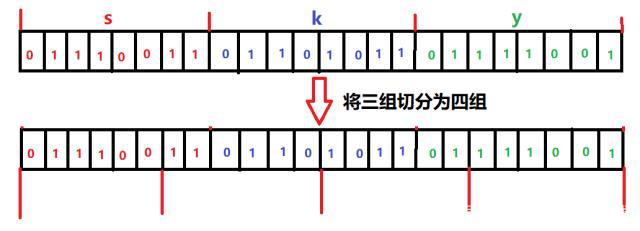
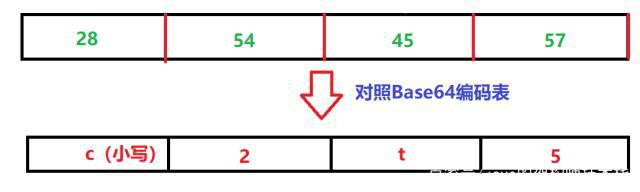

# MD5算法

`MD5` 用的是 **哈希函数**，它的典型应用是对一段信息产生 **信息摘要**，以 **防止被篡改**。

严格来说，`MD5` 不是一种 **加密算法** 而是 **摘要算法**。

无论是多长的输入，`MD5` 都会输出长度为 `128bits` 的一个串 (通常用 `16` **进制** 表示为 `32` 个字符)。

```java
public static final byte[] computeMD5(byte[] content) {
    try {
        MessageDigest md5 = MessageDigest.getInstance("MD5");
        return md5.digest(content);
    } catch (NoSuchAlgorithmException e) {
        throw new RuntimeException(e);
    }
}
```


# SHA1算法

SHA1 是和 MD5 一样流行的 消息摘要算法，然而 SHA1 比 MD5 的 安全性更强。

对于长度小于 2 ^ 64 位的消息，SHA1 会产生一个 160 位的消息摘要。

基于 MD5、SHA1 的信息摘要特性不可逆 (一般而言)，可以被应用在检查 文件完整性 以及 数字签名 等场景。

```java
public static byte[] computeSHA1(byte[] content) {
    try {
        MessageDigest sha1 = MessageDigest.getInstance("SHA1");
        return sha1.digest(content);
    } catch (NoSuchAlgorithmException e) {
        throw new RuntimeException(e);
    }
}
```


# HMAC算法

HMAC 是密钥相关的 哈希运算消息认证码（Hash-based Message Authentication Code），HMAC 运算利用 哈希算法 (MD5、SHA1 等)，以 一个密钥 和 一个消息 为输入，生成一个 消息摘要 作为 输出。

HMAC 发送方 和 接收方 都有的 key 进行计算，而没有这把 key 的第三方，则是 无法计算 出正确的 散列值的，这样就可以 防止数据被篡改。

```java
package net.pocrd.util;

import net.pocrd.annotation.NotThreadSafe;
import net.pocrd.define.ConstField;
import org.slf4j.Logger;
import org.slf4j.LoggerFactory;
import javax.crypto.Mac;
import javax.crypto.SecretKey;
import javax.crypto.spec.SecretKeySpec;
import java.util.Arrays;


@NotThreadSafe
public class HMacHelper {
    
    private static final Logger logger = LoggerFactory.getLogger(HMacHelper.class);
    private Mac mac;

    /**
     * MAC算法可选以下多种算法
     * HmacMD5/HmacSHA1/HmacSHA256/HmacSHA384/HmacSHA512
     */
    private static final String KEY_MAC = "HmacMD5";
    public HMacHelper(String key) {
        try {
            SecretKey secretKey = new SecretKeySpec(key.getBytes(ConstField.UTF8), KEY_MAC);
            mac = Mac.getInstance(secretKey.getAlgorithm());
            mac.init(secretKey);
        } catch (Exception e) {
            logger.error("create hmac helper failed.", e);
        }
    }
    public byte[] sign(byte[] content) {
        return mac.doFinal(content);
    }

    public boolean verify(byte[] signature, byte[] content) {
        try {
            byte[] result = mac.doFinal(content);
            return Arrays.equals(signature, result);
        } catch (Exception e) {
            logger.error("verify sig failed.", e);
        }
        return false;
    }
}
```


**注意**：`HMAC` 算法实例在 **多线程环境** 下是 **不安全的**。但是需要在 **多线程访问** 时，进行同步的辅助类，使用 `ThreadLocal` 为 **每个线程缓存** 一个实例可以避免进行锁操作。


# AES/DES/3DES算法

`AES`、`DES`、`3DES` 都是 **对称** 的 **块加密算法**，**加解密** 的过程是 **可逆的**。常用的有 `AES128`、`AES192`、`AES256` (默认安装的 `JDK` 尚不支持 `AES256`，需要安装对应的 `jce` 补丁进行升级 `jce1.7`，`jce1.8`)。


## DES算法

DES 加密算法是一种 分组密码，以 64 位为 分组对数据 加密，它的 密钥长度 是 56 位，加密解密 用 同一算法。

DES 加密算法是对 密钥 进行保密，而 公开算法，包括加密和解密算法。这样，只有掌握了和发送方 相同密钥 的人才能解读由 DES加密算法加密的密文数据。因此，破译 DES 加密算法实际上就是 搜索密钥的编码。对于 56 位长度的 密钥 来说，如果用 穷举法 来进行搜索的话，其运算次数为 2 ^ 56 次。

## 3DES算法

是基于 `DES` 的 **对称算法**，对 **一块数据** 用 **三个不同的密钥** 进行 **三次加密**，**强度更高**。

## AES算法

AES 加密算法是密码学中的 高级加密标准，该加密算法采用 对称分组密码体制，密钥长度的最少支持为 128 位、 192 位、256 位，分组长度 128 位，算法应易于各种硬件和软件实现。这种加密算法是美国联邦政府采用的 区块加密标准。

AES 本身就是为了取代 DES 的，AES 具有更好的 安全性、效率 和 灵活性。

```java
import net.pocrd.annotation.NotThreadSafe;
import javax.crypto.Cipher;
import javax.crypto.KeyGenerator;
import javax.crypto.spec.IvParameterSpec;
import javax.crypto.spec.SecretKeySpec;
import java.security.SecureRandom;

@NotThreadSafe
public class AesHelper {
    private SecretKeySpec keySpec;
    private IvParameterSpec iv;

    public AesHelper(byte[] aesKey, byte[] iv) {
        if (aesKey == null || aesKey.length < 16 || (iv != null && iv.length < 16)) {
            throw new RuntimeException("错误的初始密钥");
        }
        if (iv == null) {
            iv = Md5Util.compute(aesKey);
        }
        keySpec = new SecretKeySpec(aesKey, "AES");
        this.iv = new IvParameterSpec(iv);
    }

    public AesHelper(byte[] aesKey) {
        if (aesKey == null || aesKey.length < 16) {
            throw new RuntimeException("错误的初始密钥");
        }
        keySpec = new SecretKeySpec(aesKey, "AES");
        this.iv = new IvParameterSpec(Md5Util.compute(aesKey));
    }

    public byte[] encrypt(byte[] data) {
        byte[] result = null;
        Cipher cipher = null;
        try {
            cipher = Cipher.getInstance("AES/CFB/NoPadding");
            cipher.init(Cipher.ENCRYPT_MODE, keySpec, iv);
            result = cipher.doFinal(data);
        } catch (Exception e) {
            throw new RuntimeException(e);
        }
        return result;
    }

    public byte[] decrypt(byte[] secret) {
        byte[] result = null;
        Cipher cipher = null;
        try {
            cipher = Cipher.getInstance("AES/CFB/NoPadding");
            cipher.init(Cipher.DECRYPT_MODE, keySpec, iv);
            result = cipher.doFinal(secret);
        } catch (Exception e) {
            throw new RuntimeException(e);
        }
        return result;
    }

    public static byte[] randomKey(int size) {
        byte[] result = null;
        try {
            KeyGenerator gen = KeyGenerator.getInstance("AES");
            gen.init(size, new SecureRandom());
            result = gen.generateKey().getEncoded();
        } catch (Exception e) {
            throw new RuntimeException(e);
        }
        return result;
    }
}
```


# RSA算法

`RSA` 加密算法是目前最有影响力的 **公钥加密算法**，并且被普遍认为是目前 **最优秀的公钥方案** 之一。`RSA` 是第一个能同时用于 **加密** 和 **数字签名** 的算法，它能够 **抵抗** 到目前为止已知的 **所有密码攻击**，已被 `ISO` 推荐为公钥数据加密标准。

> `RSA` **加密算法** 基于一个十分简单的数论事实：将两个大 **素数** 相乘十分容易，但想要对其乘积进行 **因式分解** 却极其困难，因此可以将 **乘积** 公开作为 **加密密钥**。

```java
import net.pocrd.annotation.NotThreadSafe;
import org.bouncycastle.jce.provider.BouncyCastleProvider;
import org.slf4j.Logger;
import org.slf4j.LoggerFactory;
import javax.crypto.Cipher;
import java.io.ByteArrayOutputStream;
import java.security.KeyFactory;
import java.security.Security;
import java.security.Signature;
import java.security.interfaces.RSAPrivateCrtKey;
import java.security.interfaces.RSAPublicKey;
import java.security.spec.PKCS8EncodedKeySpec;
import java.security.spec.X509EncodedKeySpec;

@NotThreadSafe
public class RsaHelper {
    private static final Logger logger = LoggerFactory.getLogger(RsaHelper.class);
    private RSAPublicKey publicKey;
    private RSAPrivateCrtKey privateKey;

    static {
        Security.addProvider(new BouncyCastleProvider()); //使用bouncycastle作为加密算法实现
    }

    public RsaHelper(String publicKey, String privateKey) {
        this(Base64Util.decode(publicKey), Base64Util.decode(privateKey));
    }

    public RsaHelper(byte[] publicKey, byte[] privateKey) {
        try {
            KeyFactory keyFactory = KeyFactory.getInstance("RSA");
            if (publicKey != null && publicKey.length > 0) {
                this.publicKey = (RSAPublicKey)keyFactory.generatePublic(new X509EncodedKeySpec(publicKey));
            }
            if (privateKey != null && privateKey.length > 0) {
                this.privateKey = (RSAPrivateCrtKey)keyFactory.generatePrivate(new PKCS8EncodedKeySpec(privateKey));
            }
        } catch (Exception e) {
            throw new RuntimeException(e);
        }
    }

    public RsaHelper(String publicKey) {
        this(Base64Util.decode(publicKey));
    }

    public RsaHelper(byte[] publicKey) {
        try {
            KeyFactory keyFactory = KeyFactory.getInstance("RSA");
            if (publicKey != null && publicKey.length > 0) {
                this.publicKey = (RSAPublicKey)keyFactory.generatePublic(new X509EncodedKeySpec(publicKey));
            }
        } catch (Exception e) {
            throw new RuntimeException(e);
        }
    }

    public byte[] encrypt(byte[] content) {
        if (publicKey == null) {
            throw new RuntimeException("public key is null.");
        }

        if (content == null) {
            return null;
        }

        try {
            Cipher cipher = Cipher.getInstance("RSA/ECB/PKCS1Padding");
            cipher.init(Cipher.ENCRYPT_MODE, publicKey);
            int size = publicKey.getModulus().bitLength() / 8 - 11;
            ByteArrayOutputStream baos = new ByteArrayOutputStream((content.length + size - 1) / size * (size + 11));
            int left = 0;
            for (int i = 0; i < content.length; ) {
                left = content.length - i;
                if (left > size) {
                    cipher.update(content, i, size);
                    i += size;
                } else {
                    cipher.update(content, i, left);
                    i += left;
                }
                baos.write(cipher.doFinal());
            }
            return baos.toByteArray();
        } catch (Exception e) {
            throw new RuntimeException(e);
        }
    }

    public byte[] decrypt(byte[] secret) {
        if (privateKey == null) {
            throw new RuntimeException("private key is null.");
        }

        if (secret == null) {
            return null;
        }

        try {
            Cipher cipher = Cipher.getInstance("RSA/ECB/PKCS1Padding");
            cipher.init(Cipher.DECRYPT_MODE, privateKey);
            int size = privateKey.getModulus().bitLength() / 8;
            ByteArrayOutputStream baos = new ByteArrayOutputStream((secret.length + size - 12) / (size - 11) * size);
            int left = 0;
            for (int i = 0; i < secret.length; ) {
                left = secret.length - i;
                if (left > size) {
                    cipher.update(secret, i, size);
                    i += size;
                } else {
                    cipher.update(secret, i, left);
                    i += left;
                }
                baos.write(cipher.doFinal());
            }
            return baos.toByteArray();
        } catch (Exception e) {
            logger.error("rsa decrypt failed.", e);
        }
        return null;
    }

    public byte[] sign(byte[] content) {
        if (privateKey == null) {
            throw new RuntimeException("private key is null.");
        }
        if (content == null) {
            return null;
        }
        try {
            Signature signature = Signature.getInstance("SHA1WithRSA");
            signature.initSign(privateKey);
            signature.update(content);
            return signature.sign();
        } catch (Exception e) {
            throw new RuntimeException(e);
        }
    }

    public boolean verify(byte[] sign, byte[] content) {
        if (publicKey == null) {
            throw new RuntimeException("public key is null.");
        }
        if (sign == null || content == null) {
            return false;
        }
        try {
            Signature signature = Signature.getInstance("SHA1WithRSA");
            signature.initVerify(publicKey);
            signature.update(content);
            return signature.verify(sign);
        } catch (Exception e) {
            logger.error("rsa verify failed.", e);
        }
        return false;
    }
}
```


# ECC算法

`ECC` 也是一种 **非对称加密算法**，主要优势是在某些情况下，它比其他的方法使用 **更小的密钥**，比如 `RSA` **加密算法**，提供 **相当的或更高等级** 的安全级别。不过一个缺点是 **加密和解密操作** 的实现比其他机制 **时间长** (相比 `RSA` 算法，该算法对 `CPU` 消耗严重)。

```java
import net.pocrd.annotation.NotThreadSafe;
import org.bouncycastle.jcajce.provider.asymmetric.ec.BCECPrivateKey;
import org.bouncycastle.jcajce.provider.asymmetric.ec.BCECPublicKey;
import org.bouncycastle.jce.provider.BouncyCastleProvider;
import org.slf4j.Logger;
import org.slf4j.LoggerFactory;
import javax.crypto.Cipher;
import java.io.ByteArrayOutputStream;
import java.security.KeyFactory;
import java.security.Security;
import java.security.Signature;
import java.security.spec.PKCS8EncodedKeySpec;
import java.security.spec.X509EncodedKeySpec;

@NotThreadSafe
public class EccHelper {
    private static final Logger logger = LoggerFactory.getLogger(EccHelper.class);
    private static final int SIZE = 4096;
    private BCECPublicKey  publicKey;
    private BCECPrivateKey privateKey;

    static {
        Security.addProvider(new BouncyCastleProvider());
    }

    public EccHelper(String publicKey, String privateKey) {
        this(Base64Util.decode(publicKey), Base64Util.decode(privateKey));
    }

    public EccHelper(byte[] publicKey, byte[] privateKey) {
        try {
            KeyFactory keyFactory = KeyFactory.getInstance("EC", "BC");
            if (publicKey != null && publicKey.length > 0) {
                this.publicKey = (BCECPublicKey)keyFactory.generatePublic(new X509EncodedKeySpec(publicKey));
            }
            if (privateKey != null && privateKey.length > 0) {
                this.privateKey = (BCECPrivateKey)keyFactory.generatePrivate(new PKCS8EncodedKeySpec(privateKey));
            }
        } catch (ClassCastException e) {
            throw new RuntimeException("", e);
        } catch (Exception e) {
            throw new RuntimeException(e);
        }
    }

    public EccHelper(String publicKey) {
        this(Base64Util.decode(publicKey));
    }

    public EccHelper(byte[] publicKey) {
        try {
            KeyFactory keyFactory = KeyFactory.getInstance("EC", "BC");
            if (publicKey != null && publicKey.length > 0) {
                this.publicKey = (BCECPublicKey)keyFactory.generatePublic(new X509EncodedKeySpec(publicKey));
            }
        } catch (Exception e) {
            throw new RuntimeException(e);
        }
    }

    public byte[] encrypt(byte[] content) {
        if (publicKey == null) {
            throw new RuntimeException("public key is null.");
        }
        try {
            Cipher cipher = Cipher.getInstance("ECIES", "BC");
            cipher.init(Cipher.ENCRYPT_MODE, publicKey);
            int size = SIZE;
            ByteArrayOutputStream baos = new ByteArrayOutputStream((content.length + size - 1) / size * (size + 45));
            int left = 0;
            for (int i = 0; i < content.length; ) {
                left = content.length - i;
                if (left > size) {
                    cipher.update(content, i, size);
                    i += size;
                } else {
                    cipher.update(content, i, left);
                    i += left;
                }
                baos.write(cipher.doFinal());
            }
            return baos.toByteArray();
        } catch (Exception e) {
            throw new RuntimeException(e);
        }
    }

    public byte[] decrypt(byte[] secret) {
        if (privateKey == null) {
            throw new RuntimeException("private key is null.");
        }
        try {
            Cipher cipher = Cipher.getInstance("ECIES", "BC");
            cipher.init(Cipher.DECRYPT_MODE, privateKey);
            int size = SIZE + 45;
            ByteArrayOutputStream baos = new ByteArrayOutputStream((secret.length + size + 44) / (size + 45) * size);
            int left = 0;
            for (int i = 0; i < secret.length; ) {
                left = secret.length - i;
                if (left > size) {
                    cipher.update(secret, i, size);
                    i += size;
                } else {
                    cipher.update(secret, i, left);
                    i += left;
                }
                baos.write(cipher.doFinal());
            }
            return baos.toByteArray();
        } catch (Exception e) {
            logger.error("ecc decrypt failed.", e);
        }
        return null;
    }

    public byte[] sign(byte[] content) {
        if (privateKey == null) {
            throw new RuntimeException("private key is null.");
        }
        try {
            Signature signature = Signature.getInstance("SHA1withECDSA", "BC");
            signature.initSign(privateKey);
            signature.update(content);
            return signature.sign();
        } catch (Exception e) {
            throw new RuntimeException(e);
        }
    }

    public boolean verify(byte[] sign, byte[] content) {
        if (publicKey == null) {
            throw new RuntimeException("public key is null.");
        }
        try {
            Signature signature = Signature.getInstance("SHA1withECDSA", "BC");
            signature.initVerify(publicKey);
            signature.update(content);
            return signature.verify(sign);
        } catch (Exception e) {
            logger.error("ecc verify failed.", e);
        }
        return false;
    }
}
```


# Base64

## 来由

很早之前，电子邮件刚刚问世，那时候消息的传递都是英文，后来中国开通了互联网之后，对邮件的使用量也大量增加，这时候电子邮件就有了中文的需求。但是中文在传输的时候不能被有效地处理，这时候Base就出来了，Base64通过对这些中文进行编码，转化为服务器和网关能够识别的数据。这时候就能够使用电子邮件有效地传输了。

上面的这个例子不是说Base64专门为电子邮件而生的，从其诞生之初，就开始在各大领域有了广泛的应用。比如说网络上传递图片，我们可以Base64先对图片进行处理，然后就可以有效的传输了。


## 转换原理

如同ASCII 编码，Base64也有这样一套编码。范围是”A-Z“、”a-z“、”0-9“、”+“、”/“一共64个字符。


在编码的时候Base64就是通过上面的进行转换编码的。


比如说有一封邮件，我们想要对其使用Base64进行编码。基本步骤如下：

（1）对邮件的数据进行切分，每三个字节一组，一共24个bit。

（2）对切分后的数据重组，24个bit重组为4组，每组6个bit。

（3）对重组后的数据处理，每组最前面添加两个“0”，构成每组8个bit。此时一共32个bit。

（4）根据Base64编码表，获取相应的编码值。


比如说电子邮件里面出现了三个字母sky。我们要对这个三个字符使用Base64进行编码。

（1）对邮件的数据进行切分，每三个字节一组，一共24个bit

​	

（2）对切分后的数据重组，24个bit重组为4组，每组6个bit

​	

（3）对重组后的数据处理，每组最前面添加两个“0”，构成每组8个bit。由于在最前面添加的0，所以对数值不构成影响。

（4）根据Base64编码表，获取相应的编码值

​	

（5）完成编码的转换

​	

到这我们基本上就是实现了Base64编码机制从sky到c2t5的转换。


> 注意：
>
> （1）在第三步中，最前面添加了两个0，所以最终编码之后要比之前多出三分之一的大小。
>
> （2）上面的例子中，我们使用的是ASCII编码，但是如果我们使用UTF-8，对应Base64编码的结果是不一样的。
>
> （3）Base64只是进行了编码，方便数据的传输而已。这可不是加密。


## 使用

### Java8之前--sun.misc

早期在Java上做Base64的编码与解码，会使用到JDK里sun.misc套件下的BASE64Encoder和BASE64Decoder这两个类

```java
final BASE64Encoder encoder = new BASE64Encoder();
final BASE64Decoder decoder = new BASE64Decoder();
final String text = "字串文字";
final byte[] textByte = text.getBytes("UTF-8");
//编码
final String encodedText = encoder.encode(textByte);
System.out.println(encodedText);
//解码
System.out.println(new String(decoder.decodeBuffer(encodedText), "UTF-8"));

final BASE64Encoder encoder = new BASE64Encoder();
final BASE64Decoder decoder = new BASE64Decoder();
final String text = "字串文字";
final byte[] textByte = text.getBytes("UTF-8");
//编码
final String encodedText = encoder.encode(textByte);
System.out.println(encodedText);

//解码
System.out.println(new String(decoder.decodeBuffer(encodedText), "UTF-8"));
```

sun.mis c套件所提供的Base64功能，编码和解码的效率并不太好


### Apache Commons Codec

Apache Commons Codec有提供Base64的编码与解码功能，会使用到org.apache.commons.codec.binary套件下的Base64类

```java
final Base64 base64 = new Base64();
final String text = "字串文字";
final byte[] textByte = text.getBytes("UTF-8");
//编码
final String encodedText = base64.encodeToString(textByte);
System.out.println(encodedText);
//解码
System.out.println(new String(base64.decode(encodedText), "UTF-8"));

final Base64 base64 = new Base64();
final String text = "字串文字";
final byte[] textByte = text.getBytes("UTF-8");
//编码
final String encodedText = base64.encodeToString(textByte);
System.out.println(encodedText);
//解码
System.out.println(new String(base64.decode(encodedText), "UTF-8"));
```


### Java8

Java 8的java.util套件中，新增了Base64的类别，可以用来处理Base64的编码与解码

```java
final Base64.Decoder decoder = Base64.getDecoder();
final Base64.Encoder encoder = Base64.getEncoder();
final String text = "字串文字";
final byte[] textByte = text.getBytes("UTF-8");
//编码
final String encodedText = encoder.encodeToString(textByte);
System.out.println(encodedText);
//解码
System.out.println(new String(decoder.decode(encodedText), "UTF-8"));

final Base64.Decoder decoder = Base64.getDecoder();
final Base64.Encoder encoder = Base64.getEncoder();
final String text = "字串文字";
final byte[] textByte = text.getBytes("UTF-8");
//编码
final String encodedText = encoder.encodeToString(textByte);
System.out.println(encodedText);
//解码
System.out.println(new String(decoder.decode(encodedText), "UTF-8"));
```

与sun.mis c套件和Apache Commons Codec所提供的Base64编解码器来比较的话，Java 8提供的Base64拥有更好的效能。