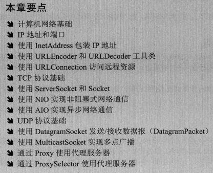
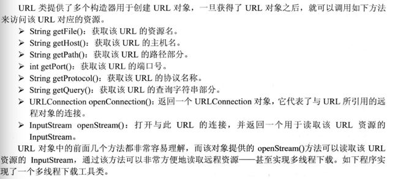

# java网络编程




java中网络相关的类在java.net包下。


URLDecoder类包含一个decode(String s, String enc)静态方法,它可以将看上去是URL编码的特殊字符串转换成普通字符串

URLEncoder类包含一个encoder(String s,String enc)静态方法,它可以将普通字符串转换成url编码.


URL: Uniform Resource Locator ,统一资源定位器： Java允许通过Web服务器从远程主机上读取文件 

例如：为了读取一个文件，首先要为文件创建一个URL：

URL url=new URL(“www.bit.edu.cn/index.html”)

然后，可以使用定义在URL类中的openStream()方法，对文件的URL打开一个输入流：

InputStream inputStream=url.openStream();

现在可以从输入流中读取数据了




## 示例

server：

```java
package com.juc.demo.net;

import java.io.*;
import java.net.*;
import java.util.concurrent.ExecutorService;
import java.util.concurrent.LinkedBlockingQueue;
import java.util.concurrent.ThreadPoolExecutor;
import java.util.concurrent.TimeUnit;


class SingleServer implements Runnable {

    private Socket socket;

    private int clineNo;

    public SingleServer(Socket socket, int clineNo) {
        this.socket = socket;
        this.clineNo = clineNo;
    }

    @Override
    public void run() {

        try {
            System.out.println("server recv a new client connect. connect_no = " + clineNo);

            BufferedReader reader = new BufferedReader(new InputStreamReader(socket.getInputStream()));
            Writer writer = new BufferedWriter(new OutputStreamWriter(socket.getOutputStream()));

            for (; ; ) {
                //接收
                char[] readBuffer = new char[1024];
                //int readLength = reader.read(readBuffer, 0, 1024);
                //System.out.println("readLength:" + readLength + ", readContent: " + readBuffer);
                if (reader.ready()) {
                    String recvContent = reader.readLine();
                    System.out.println("server recv data contect : " + recvContent);

                }
                //发送
                // dos.write(readBuffer, 0, readBuffer.length);
            }
        } catch (IOException e) {
            e.printStackTrace();
        }
    }
}

public class SocketServer {

    private ServerSocket serverSocket;

    private ExecutorService threadPoolExecutor;

    public void start() {
        // 在端口上创建一个服务器套接字
        try {
            serverSocket = new ServerSocket();
            threadPoolExecutor = new ThreadPoolExecutor(5, 5, 10,
                    TimeUnit.SECONDS, new LinkedBlockingQueue<Runnable>(10));
            //准备地址
            SocketAddress inetSocketAddress = new InetSocketAddress("127.0.0.1", 8888);
            //绑定
            serverSocket.bind(inetSocketAddress, 128);
            //这里无需启动侦听-> listen(),目前怀疑上述bind()函数中的第二个参数几位listen函数的backlog
            //直接accept()监听即可
            System.out.println("server bind success, waiting for client accept");
        } catch (IOException e) {
            e.printStackTrace();
        }
        // 监听来自客户端的连接

        int clientNum = 0;

        try {
            while (true) {
                Socket clientSocket = serverSocket.accept();
                threadPoolExecutor.execute(new SingleServer(clientSocket, clientNum++));
            }
        } catch (IOException e) {
            try {
                serverSocket.close();
            } catch (IOException ex) {
                ex.printStackTrace();
            }
            e.printStackTrace();
        } finally {
            try {
                serverSocket.close();
            } catch (IOException e) {
                e.printStackTrace();
            }
        }

    }

    public static void main(String[] args) {
        //启动服务端
        SocketServer socketServer = new SocketServer();
        socketServer.start();
    }
}
```


client：

```java
package com.juc.demo.net;

import java.io.*;
import java.net.*;

public class SocketClient implements Runnable {

    private Socket socket = null;

    @Override
    public void run() {
        try {
            socket = new Socket("127.0.0.1", 8888);

            Reader reader = new BufferedReader(new InputStreamReader(socket.getInputStream()));
            Writer writer = new BufferedWriter(new OutputStreamWriter(socket.getOutputStream()));
            PrintWriter printWriter = new PrintWriter(writer, true);

            while (true) {
                String sendContent = "send data to server";
                // writer.write(sendContent, 0, sendContent.length());
                printWriter.println(sendContent);
                Thread.sleep(2000);
                System.out.println("client send msg: " + sendContent);
            }
        } catch (UnknownHostException e) {
            e.printStackTrace();
        } catch (IOException e) {
            e.printStackTrace();
        } catch (InterruptedException e) {
            e.printStackTrace();
        } finally {
            try {
                socket.close();
            } catch (IOException e) {
                e.printStackTrace();
            }
        }
    }

    public static void main(String[] args) {
        //启动10个客户端不断给服务端发送
        Thread[] client = new Thread[10];
        for (int i = 0; i < 10; i++){
            client[i] = new Thread(new SocketClient());
            client[i].start();
        }

        for (int i = 0; i < 10; i++){
            try {
                client[i].join();
            } catch (InterruptedException e) {
                e.printStackTrace();
            }
        }
        try {
            Thread.sleep(3000);
        } catch (InterruptedException e) {
            e.printStackTrace();
        }

//        Thread client = new Thread(new SocketClient());
//        client.start();
    }
}
```

