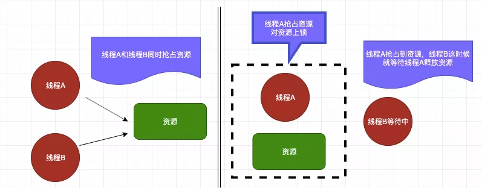
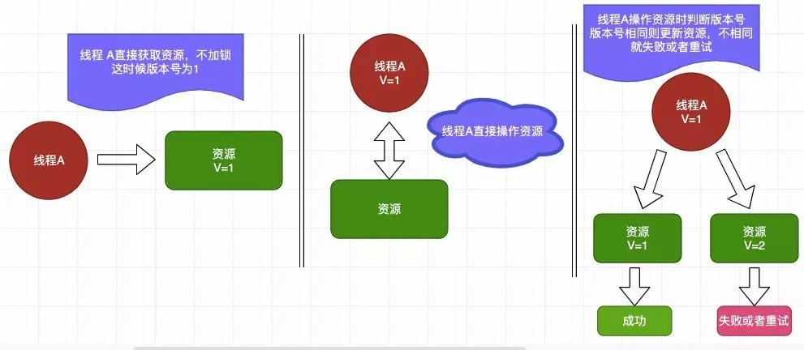
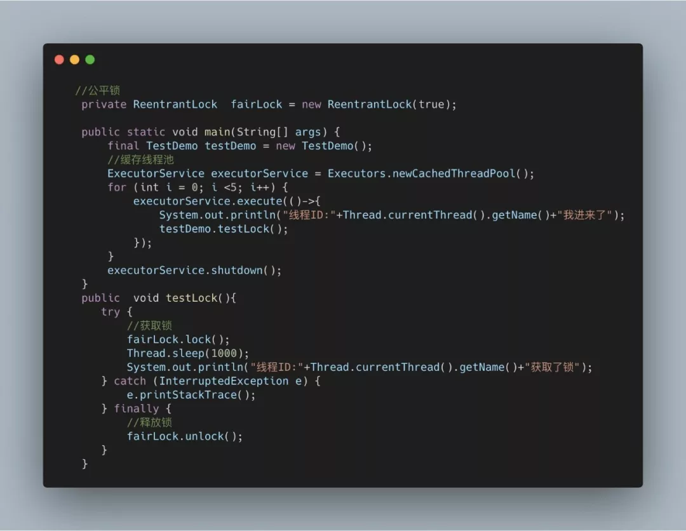
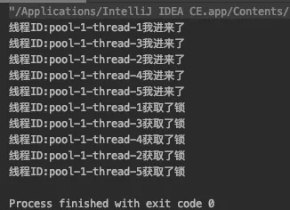
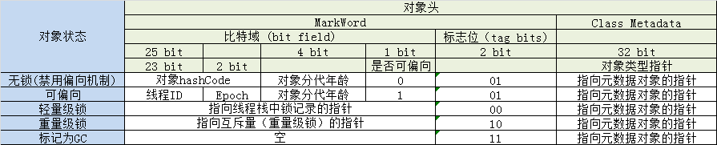

[TOC]

# java中的锁


[https://tech.meituan.com/2018/11/15/java-lock.html](https://tech.meituan.com/2018/11/15/java-lock.html)


> 说到了锁我们经常会联想到生活中的锁，在我们日常中我们经常会接触到锁。比如我们的手机锁，电脑锁，再比如我们生活中的门锁，这些都是锁。
>
> 说了这么多还是不清楚锁到底有什么用处？这一点就要深思我们为什么要使用锁，我们用手机锁是为了保障我们的隐私安全，使用门锁是为了保障我们的财产安全，准确的来说我们使用锁就是为了安全。那么在生活中我们可以加锁来保障自己的隐私和财产安全，那Java中的锁有什么用处呢？


- Java中的锁准确的来说也是为了保证安全，不过不同的是Java中的锁是为了保证并发所需要的。所以在Java中加锁准确的来说是为了**保证并发安全**，同时也是为了**解决内存中的一致性，原子性，有序性三种问题**。在Java中提供了各式各样的锁，每种锁都有其自身的特点和适用范围。所以我们都要熟悉锁的区别和原理才能正确的使用。


## 乐观锁和悲观锁


### 悲观锁

- 悲观锁如其名它是悲观的，它觉得每次访问数据都可能被其他人(线程)修改，所以在访问资源的时候就会对资源进行加锁，用这种方式来保证资源在访问的时候不会被其他线程修改。这样的话其他线程想要获取资源的话就只能阻塞，等到当前线程释放锁后在获取。在Java中悲观锁的实现有`synchronized关键字`和`Lock`的实现类都是悲观锁。我们来看一下悲观锁到底是怎么执行的。




线程A抢占到资源后线程B就陷入了阻塞中,然后就等待线程A释放资源。


当线程A释放完资源后线程B就去获取锁开始操作资源˛悲观锁保证了资源同时只能一个线程进行操作。


### 乐观锁

与悲观锁相反，乐观锁并不会觉得访问数据的时候会有人修改(所以它是乐观的)，所以在访问资源的时候并不会上锁，但是在提交的时候回去判断一下是否有人修改了当前数据，在数据库中我们可以使用`version`版本号去实现。在Java中我们是使用CSA来实现。我们看一下乐观锁的执行过程




### 使用悲观锁和乐观锁

```java
//悲观锁
public synchronized void testMethod(){
    //do something
}

//乐观锁
private AtomicLong value = new AtomicLong();
```

可以使用synchronized关键字来实现悲观锁，乐观锁可以使用并法包下提供的原子类。


## 公平锁和非公平锁

- 公平锁如其名讲究的是一个公平，所以多个线程同时申请申请锁的话，线程会放入一个队列中，在队列中第一个进入队列的线程才能获取锁资源，讲究的是先到先得。

- 非公平锁先到不一定先得

不过公平锁也是有缺点的，当一个线程获取资源后在队列中的其他的线程就只能在阻塞，CPU的所以公平锁比非公平锁的效率要低很多。因为*CPU唤醒阻塞线程的开销比非公平锁大*。


在Java中ReentrantLock提供了公平锁和非公平锁的实现。看一下ReentrantLock怎么实现公平锁和非公平锁

```java
//公平锁
private ReentrantLock fairLock = new ReentrantLock(true);

//非公平锁
private ReentrantLock fairLock = new ReentrantLock(false);

//默认是非公平锁
private ReentrantLock fairLock = new ReentrantLock();
```

### 使用

ReentrantLock默认就是非公平的锁，我们来看一下公平锁的例子：



看一下输出结果：



我们可以看到公平锁的输出结果是按照顺序来的，先到先得。


在看一下非公平锁的例子：


输出结果：


我们可以看到如果使用非公平锁的话最后输出的结果是完全没有顺序的，先到不一定先得。


所以在使用公平锁的时候线程1获取到锁之后线程2在请求锁的话就会挂起等待线程1释放锁，然后线程2才能获取锁。如果再有一个线程3想要请求锁的话，这时候如果使用的是非公平锁，那么线程2和线程3中两个有一个会获取到锁，公平锁的情况下线程3只能先挂起，等待线程2获取锁资源释放后在获取。


### 公平锁与非公平锁效率差异原因

在需要公平资源的场景下使用公平锁，如果不需要特殊的公平对待的话尽量使用非公平锁，因为公平锁会带来性能的开销。

公平锁要维护一个队列，后来的线程要加锁，即使锁空闲，也要先检查有没有其他线程在 wait，如果有自己要挂起，加到队列后面，然后唤醒队列最前面的线程。这种情况下相比较非公平锁多了一次挂起和唤醒

**线程切换的开销**，其实就是非公平锁效率高于公平锁的原因，因为**非公平锁减少了线程挂起的几率**，后来的线程有一定几率逃离被挂起的开销。


## 独占锁和共享锁

看到独占和共享会联想到什么，对的独占锁就是每次只有一个线程能霸占这个锁资源，而其他线程就只能等待当前获取锁资源的线程释放锁才能再次获取锁，刚刚上面的**ReentrantLock就是独占锁**，那这样看来独占锁不也就是悲观锁吗？因为悲观锁抢占资源后就只能等待释放其他线程才能再次获取到锁资源。其实准确的说<font color="00dd00">独占锁也是悲观锁</font>。

在谈共享锁，共享锁其实也是乐观锁它放宽了锁的策略，<u>允许多个线程同时获取锁</u>。在**并发包中ReadWriteLock就是一个典型的共享锁**。它允许一个资源可以被多个读操作访问，或者被一个 写操作访问，但两者不能同时进行。


## 自旋锁

自旋锁其实就是当一个线程获取锁的时候，这个锁已经被其他人获取到了那么这个线程不会立马挂起，反而在不放弃CPU使用权的情况下会尝试再次获取锁资源，默认次数是10次，可以使用`-XX: PreBlockSpinsh`来设置次数。

如果自旋锁获取锁的时间太长，会造成后面的线程CPU资源耗尽释放。并且自旋锁是不公平的。


**优点：**自旋锁<u>不会使线程状态发生切换</u>，一直处于用户态，即线程一直都是active的；不会使线程进入阻塞状态，减少了不必要的上下文切换，执行速度快。


## 可重入锁


### 什么是重入锁

- `java.util.concurrent.locks.ReentrantLock`

这个是 JDK @since 1.5 添加的一种颗粒度更小的锁，它完全可以替代 synchronized 关键字来实现它的所有功能，而且 ReentrantLock 锁的灵活度要远远大于 synchronized 关键字。


从类结构图看出，ReentrantLock 实现了 Lock 接口，ReentrantLock 只是 Lock 接口的一个实现而已。


### 为什么叫重入锁呢

`ReentrantLock`：Re-Entrant-Lock：即表示**可重新反复进入的锁，但仅限于当前线程**；

```java
public void m() {
    lock.lock();
    lock.lock();
    try {
      // ... method body
    } finally {
      lock.unlock()
      lock.unlock()
    }
}
```

如示例代码所示，当前线程可以反复加锁，但也需要释放同样加锁次数的锁，即重入了多少次，就要释放多少次，不然也会导入锁不被释放。


### 重入锁最重要的几个方法


这几个方法都是 Lock 接口中定义的：


**1）lock()**

获取锁，有以下三种情况：

- 锁空闲：直接获取锁并返回，同时设置锁持有者数量为：1；
- 当前线程持有锁：直接获取锁并返回，同时锁持有者数量递增1；
- 其他线程持有锁：当前线程会休眠等待，直至获取锁为止；

**2）lockInterruptibly()**

获取锁，逻辑和 lock() 方法一样，但这个方法在获取锁过程中能响应中断。

**3）tryLock()**

从关键字字面理解，这是在尝试获取锁，获取成功返回：true，获取失败返回：false, 这个方法不会等待，有以下三种情况：

- 锁空闲：直接获取锁并返回：true，同时设置锁持有者数量为：1；
- 当前线程持有锁：直接获取锁并返回：true，同时锁持有者数量递增1；
- 其他线程持有锁：获取锁失败，返回：false；

**4）tryLock(long timeout, TimeUnit unit)**

逻辑和 tryLock() 差不多，只是这个方法是带时间的。

**5）unlock()**

释放锁，每次锁持有者数量递减 1，直到 0 为止。所以，现在知道为什么 lock 多少次，就要对应 unlock 多少次了吧。

**6）newCondition**

返回一个这个锁的 Condition 实例，可以实现 synchronized 关键字类似 wait/ notify 实现多线程通信的功能，不过这个比 wait/ notify 要更灵活，更强大！


### 重入锁大概的用法

```java
class X {

  private final ReentrantLock lock = new ReentrantLock();

  // ...

  public void m() {
    lock.lock();  // block until condition holds
    try {
      // ... method body
    } finally {
      lock.unlock()
    }
  }

}}
```

加锁和释放锁都在方法里面进行，可以自由控制，比 synchronized 更灵活，更方便。但要注意的是，释放锁操作必须在 finally 里面，不然如果出现异常导致锁不能被正常释放，进而会卡死后续所有访问该锁的线程。


### synchronized 是重入锁吗


```java
public synchronized void operation(){
    add();
}

public synchronized void add(){

}
```

`operation`() 方法调用了 `add`() 方法，两个方法都是用 `synchronized` 修饰的，`add`()  方法可以成功获取当前线程 `operation`() 方法已经获取到的锁，**说明 `synchronized` 就是可重入锁**。


## 分段锁

分段锁其实是一种锁的设计，并不是具体的一种锁，对于ConcurrentHashMap而言，其并发的实现就是通过分段锁的形式来实现高效的并发操作。

我们以ConcurrentHashMap来说一下分段锁的含义以及设计思想，ConcurrentHashMap中的分段锁称为Segment，它即类似于HashMap（JDK7与JDK8中HashMap的实现）的结构，即内部拥有一个Entry数组，数组中的每个元素又是一个链表；同时又是一个ReentrantLock（Segment继承了ReentrantLock)。

当需要put元素的时候，并不是对整个hashmap进行加锁，而是先通过hashcode来知道他要放在那一个分段中，然后对这个分段进行加锁，所以当多线程put的时候，只要不是放在一个分段中，就实现了真正的并行的插入。

但是，在统计size的时候，可就是获取hashmap全局信息的时候，就需要获取所有的分段锁才能统计。

分段锁的设计目的是细化锁的粒度，当操作不需要更新整个数组的时候，就仅仅针对数组中的一项进行加锁操作。


## 锁的状态（无锁/偏向锁/轻量级锁/重量级锁）

[https://blog.csdn.net/lengxiao1993/article/details/81568130](https://blog.csdn.net/lengxiao1993/article/details/81568130)

[https://www.cnblogs.com/paddix/p/5405678.html](https://www.cnblogs.com/paddix/p/5405678.html)


锁的状态总共有四种：**无锁状态、偏向锁、轻量级锁和重量级锁**。随着锁的竞争，锁可以从偏向锁升级到轻量级锁，再升级的重量级锁（但是锁的升级是单向的，也就是说只能从低到高升级，不会出现锁的降级）。JDK 1.6中默认是开启偏向锁和轻量级锁的，我们也可以通过`-XX:-UseBiasedLocking`来禁用偏向锁。





这三种锁是指锁的状态，并且是针对Synchronized。在Java 5通过引入锁升级的机制来实现高效Synchronized。这三种锁的状态是通过对象监视器在对象头中的字段来表明的。

- 偏向锁是指一段同步代码一直被一个线程所访问，那么该线程会自动获取锁。降低获取锁的代价。
- 轻量级锁是指当锁是偏向锁的时候，被另一个线程所访问，偏向锁就会升级为轻量级锁，其他线程会通过自旋的形式尝试获取锁，不会阻塞，提高性能。
- 重量级锁是指当锁为轻量级锁的时候，另一个线程虽然是自旋，但自旋不会一直持续下去，当自旋一定次数的时候，还没有获取到锁，就会进入阻塞，该锁膨胀为重量级锁。重量级锁会让其他申请的线程进入阻塞，性能降低。


[TOC]

# juc下的锁

[https://www.cnblogs.com/chenpi/p/5614290.html#_label3]([https://www.cnblogs.com/chenpi/p/5614290.html#_label3)

[https://segmentfault.com/a/1190000015558984](https://segmentfault.com/a/1190000015558984)


## juc-locks 锁框架


Lock接口可以视为synchronized的增强版，提供了更灵活的功能。该接口提供了限时锁等待、锁中断、锁尝试等功能。

### 接口定义

该接口的方法声明如下：

```java
public interface Lock {
    
    void lock();
    
    void lockInterruptibly() throws InterruptedException;
    
    boolean tryLock();
    
    boolean tryLock(long time, TimeUnit unit) throws InterruptedException;
    
    void unlock();
    
    Condition newCondition();
}
```

需要注意`lock()`和`lockInterruptibly()`这两个方法的区别：

```pro
lock()方法类似于使用synchronized关键字加锁，如果锁不可用，出于线程调度目的，将禁用当前线程，并且在获得锁之前，该线程将一直处于休眠状态。

lockInterruptibly()方法顾名思义，就是如果锁不可用，那么当前正在等待的线程是可以被中断的，这比synchronized关键字更加灵活。
```


### 使用示例

```java
Lock lock = ...;
if (lock.tryLock()) {
    try {
        // manipulate protected state
    } finally {
        lock.unlock();
    }
} else {
    // perform alternative actions
}
```


## Condition接口

### 接口定义

```java
public interface Condition {
    
    void await() throws InterruptedException;
    
    void awaitUninterruptibly();
    
    long awaitNanos(long nanosTimeout) throws InterruptedException;
    
    boolean await(long time, TimeUnit unit) throws InterruptedException;
    
    boolean awaitUntil(Date deadline) throws InterruptedException;
    
    void signal();
    
    void signalAll();
}
```


### 使用示例

Oracle官方文档中给出了一个缓冲队列的示例：

*假定有一个缓冲队列，支持 put 和 take 方法。如果试图在空队列中执行 take 操作，则线程将一直阻塞，直到队列中有可用元素；如果试图在满队列上执行 put 操作，则线程也将一直阻塞，直到队列不满。*

```java
class BoundedBuffer {
    final Lock lock = new ReentrantLock();
    final Condition notFull = lock.newCondition();
    final Condition notEmpty = lock.newCondition();
 
    final Object[] items = new Object[100];
    int putptr, takeptr, count;
 
    public void put(Object x) throws InterruptedException {
        lock.lock();
        try {
            while (count == items.length)    //防止虚假唤醒，Condition的await调用一般会放在一个循环判断中
                notFull.await();
            items[putptr] = x;
            if (++putptr == items.length)
                putptr = 0;
            ++count;
            notEmpty.signal();
        } finally {
            lock.unlock();
        }
    }
 
    public Object take() throws InterruptedException {
        lock.lock();
        try {
            while (count == 0)
                notEmpty.await();
            Object x = items[takeptr];
            if (++takeptr == items.length)
                takeptr = 0;
            --count;
            notFull.signal();
            return x;
        } finally {
            lock.unlock();
        }
    }
}
```

> 等待 Condition 时，为了防止发生“虚假唤醒”， Condition 一般都是在一个循环中被等待，并测试正被等待的状态声明，如上述代码注释部分。
> 虽然上面这个示例程序即使不用while，改用if判断也不会出现问题，但是最佳实践还是做while循环判断——[Guarded Suspension模式](https://segmentfault.com/a/1190000015558585)，以防遗漏情况。


## ReadWriteLock接口

- 所谓读写锁，是一对相关的锁——读锁和写锁，读锁用于只读操作，写锁用于写入操作。读锁可以由多个线程同时保持，而写锁是独占的，只能由一个线程获取。


### 接口定义

```java
public interface ReadWriteLock {
    /**
     * Returns the lock used for reading.
     *
     * @return the lock used for reading
     */
    Lock readLock();

    /**
     * Returns the lock used for writing.
     *
     * @return the lock used for writing
     */
    Lock writeLock();
}
```


## ReentrantLock

- ReentrantLock类，实现了`Lock`接口，是一种**可重入**的**独占锁**，它具有与使用 `synchronized` 相同的一些基本行为和语义，但功能更强大。`ReentrantLock`内部通过内部类实现了AQS框架(`AbstractQueuedSynchronizer`)的API来实现**独占锁**的功能。


### 类定义

```java
public class ReentrantLock implements Lock, java.io.Serializable {
    private static final long serialVersionUID = 7373984872572414699L;
    /** Synchronizer providing all implementation mechanics */
    private final Sync sync;
    //......
}
```


### 使用示例

```java
class X {
    private final ReentrantLock lock = new ReentrantLock();
    // ...
    public void m() {
        lock.lock(); // block until condition holds
        try {
            // ... method body
        } finally {
            lock.unlock();
        }
    }
}
```


## ReentrantReadWriteLock类

- `ReentrantReadWriteLock`类，顾名思义，是一种读写锁，它是`ReadWriteLock`接口的直接实现，该类在内部实现了具体**独占锁**特点的写锁，以及具有**共享锁**特点的读锁，和`ReentrantLock`一样，`ReentrantReadWriteLock`类也是通过定义内部类实现`AQS`框架的API来实现独占/共享的功能。


### 特点：

- 支持公平/非公平策略

- 支持锁重入

  > 同一读线程在获取了读锁后还可以获取读锁；
  >
  > 同一写线程在获取了写锁之后既可以再次获取写锁又可以获取读锁；

- 支持锁降级

  > 所谓锁降级，就是：先获取写锁，然后获取读锁，最后释放写锁，这样写锁就降级成了读锁。但是，读锁不能升级到写锁。

- Condition条件支持

  > ReentrantReadWriteLock的内部读锁类、写锁类实现了Lock接口，所以可以通过`newCondition()`方法获取Condition对象。但是这里要注意，读锁是没法获取Condition对象的，读锁调用`newCondition() `方法会直接抛出`UnsupportedOperationException`。

  

  > 我们知道，condition的作用其实是对Object类的`wait()`和`notify()`的增强，是为了让线程在指定对象上等待，是一种线程之间进行协调的工具。
  > 当线程调用condition对象的`await`方法时，必须拿到和这个condition对象关联的锁。由于线程对读锁的访问是不受限制的（在写锁未被占用的情况下），那么即使拿到了和读锁关联的condition对象也是没有意义的，因为读线程之前不需要进行协调。


### 使用示例

以下是Oracle官方给出的一个例子：
使用`ReentrantReadWriteLock`控制对`TreeMap`的访问（利用读锁控制读操作的访问，利用写锁控制修改操作的访问），将`TreeMap`包装成一个线程安全的集合，并且利用了读写锁的特性来提高并发访问。

```java
public class RWTreeMap {
    private final Map<String, Data> m = new TreeMap<String, Data>();
    private final ReentrantReadWriteLock rwl = new ReentrantReadWriteLock();
    private final Lock r = rwl.readLock();
    private final Lock w = rwl.writeLock();
 
    public Data get(String key) {
        r.lock();
        try {
            return m.get(key);
        } finally {
            r.unlock();
        }
    }
 
    public String[] allKeys() {
        r.lock();
        try {
            return (String[]) m.keySet().toArray();
        } finally {
            r.unlock();
        }
    }
 
    public Data put(String key, Data value) {
        w.lock();
        try {
            return m.put(key, value);
        } finally {
            w.unlock();
        }
    }
 
    public void clear() {
        w.lock();
        try {
            m.clear();
        } finally {
            w.unlock();
        }
    }
}
```


## LockSupport

`LockSupport`类，是JUC包中的一个工具类，是用来创建锁和其他同步类的基本线程阻塞原语。

`LockSupport`类的核心方法其实就两个：`park()`和`unark()`，其中`park()`方法用来阻塞当前调用线程，`unpark()`方法用于唤醒指定线程。

这其实和`Object`类的`wait`()和`Condition`类的`await`()方法有些类似，但是`LockSupport`的这两种方法从语意上讲比Object类的方法更清晰，而且可以针对指定线程进行阻塞和唤醒。


### 使用示例

*假设现在需要实现一种FIFO类型的独占锁，可以把这种锁看成是ReentrantLock的公平锁简单版本，且是不可重入的，就是说当一个线程获得锁后，其它等待线程以FIFO的调度方式等待获取锁。*


```java
public class FIFOMutex {
    private final AtomicBoolean locked = new AtomicBoolean(false);
    private final Queue<Thread> waiters = new ConcurrentLinkedQueue<Thread>();
 
    public void lock() {
        Thread current = Thread.currentThread();
        waiters.add(current);
 
        // 如果当前线程不在队首，或锁已被占用，则当前线程阻塞
        // NOTE：这个判断的意图其实就是：锁必须由队首元素拿到
        while (waiters.peek() != current || !locked.compareAndSet(false, true)) {
            LockSupport.park(this);
        }
        waiters.remove(); // 删除队首元素
    }
 
    public void unlock() {
        locked.set(false);
        LockSupport.unpark(waiters.peek());
    }
}
```

```java
public class Main {
    public static void main(String[] args) throws InterruptedException {
        FIFOMutex mutex = new FIFOMutex();
        MyThread a1 = new MyThread("a1", mutex);
        MyThread a2 = new MyThread("a2", mutex);
        MyThread a3 = new MyThread("a3", mutex);
 
        a1.start();
        a2.start();
        a3.start();
 
        a1.join();
        a2.join();
        a3.join();
 
        assert MyThread.count == 300;
        System.out.print("Finished");
    }
}
 
class MyThread extends Thread {
    private String name;
    private FIFOMutex mutex;
    public static int count;
 
    public MyThread(String name, FIFOMutex mutex) {
        this.name = name;
        this.mutex = mutex;
    }
 
    @Override
    public void run() {
        for (int i = 0; i < 100; i++) {
            mutex.lock();
            count++;
            System.out.println("name:" + name + "  count:" + count);
            mutex.unlock();
        }
    }
}
```

上述FIFOMutex 类的实现中，当判断锁已被占用时，会调用`LockSupport.park(this)`方法，将当前调用线程阻塞；当使用完锁时，会调用`LockSupport.unpark(waiters.peek())`方法将等待队列中的队首线程唤醒。


**注意**:

1.`park`方法的调用一般要方法一个循环判断体里面。

​	之所以这样做，是为了防止线程被唤醒后，不进行判断而意外继续向下执行，这其实是一种[Guarded Suspension](https://segmentfault.com/a/1190000015558585)的多线程设计模式。

2.`park`方法是会响应中断的，但是不会抛出异常。(也就是说如果当前调用线程被中断，则会立即返回但不会抛出中断异常)

3.park的重载方法`park(Object blocker)`，会传入一个blocker对象，所谓Blocker对象，其实就是当前线程调用时所在调用对象（如上述示例中的FIFOMutex对象）。该对象一般供监视、诊断工具确定线程受阻塞的原因时使用。


## StampedLock

对读写锁`ReentrantReadWriteLock`的增强，该类提供了一些功能，优化了读锁、写锁的访问，同时使读写锁之间可以互相转换，更细粒度控制并发。


> 该类的设计初衷是作为一个内部工具类，用于辅助开发其它线程安全组件，用得好，该类可以提升系统性能，用不好，容易产生死锁和其它莫名其妙的问题。


### StampedLock的引入

> 为什么有了ReentrantReadWriteLock，还要引入StampedLock？


ReentrantReadWriteLock使得多个读线程同时持有读锁（只要写锁未被占用），而写锁是独占的。

但是，读写锁如果使用不当，很容易产生“饥饿”问题：

比如在读线程非常多，写线程很少的情况下，很容易导致写线程“饥饿”，虽然使用“公平”策略可以一定程度上缓解这个问题，但是“公平”策略是以牺牲系统吞吐量为代价的。


### StampedLock的特点

1. 所有获取锁的方法，都返回一个邮戳（Stamp），Stamp为0表示获取失败，其余都表示成功；
2. 所有释放锁的方法，都需要一个邮戳（Stamp），这个Stamp必须是和成功获取锁时得到的Stamp一致；
3. StampedLock是**不可重入**的；（如果一个线程已经持有了写锁，再去获取写锁的话就会造成死锁）
4. StampedLock有三种访问模式：
   ①Reading（读模式）：功能和ReentrantReadWriteLock的读锁类似
   ②Writing（写模式）：功能和ReentrantReadWriteLock的写锁类似
   ③Optimistic reading（**乐观读模式**）：这是一种优化的读模式。
5. StampedLock支持读锁和写锁的相互转换
   我们知道ReentrantReadWriteLock中，当线程获取到写锁后，可以降级为读锁，但是读锁是不能直接升级为写锁的。
   StampedLock提供了读锁和写锁相互转换的功能，使得该类支持更多的应用场景。
6. 无论写锁还是读锁，都不支持Conditon等待


> 我们知道，在ReentrantReadWriteLock中，当读锁被使用时，如果有线程尝试获取写锁，该写线程会阻塞。
> 但是，在Optimistic reading中，即使读线程获取到了读锁，写线程尝试获取写锁也不会阻塞，这相当于对读模式的优化，但是可能会导致数据不一致的问题。所以，当使用Optimistic reading获取到读锁时，必须对获取结果进行校验。


### StampedLock使用示例

看一个Oracle官方的例子：

```java
class Point {
    private double x, y;
    private final StampedLock sl = new StampedLock();

    void move(double deltaX, double deltaY) {
        long stamp = sl.writeLock();    //涉及对共享资源的修改，使用写锁-独占操作
        try {
            x += deltaX;
            y += deltaY;
        } finally {
            sl.unlockWrite(stamp);
        }
    }

    /**
     * 使用乐观读锁访问共享资源
     * 注意：乐观读锁在保证数据一致性上需要拷贝一份要操作的变量到方法栈，并且在操作数据时候可能其他写线程已经修改了数据，
     * 而我们操作的是方法栈里面的数据，也就是一个快照，所以最多返回的不是最新的数据，但是一致性还是得到保障的。
     *
     * @return
     */
    double distanceFromOrigin() {
        long stamp = sl.tryOptimisticRead();    // 使用乐观读锁
        double currentX = x, currentY = y;      // 拷贝共享资源到本地方法栈中
        if (!sl.validate(stamp)) {              // 如果有写锁被占用，可能造成数据不一致，所以要切换到普通读锁模式
            stamp = sl.readLock();             
            try {
                currentX = x;
                currentY = y;
            } finally {
                sl.unlockRead(stamp);
            }
        }
        return Math.sqrt(currentX * currentX + currentY * currentY);
    }

    void moveIfAtOrigin(double newX, double newY) { // upgrade
        // Could instead start with optimistic, not read mode
        long stamp = sl.readLock();
        try {
            while (x == 0.0 && y == 0.0) {
                long ws = sl.tryConvertToWriteLock(stamp);  //读锁转换为写锁
                if (ws != 0L) {
                    stamp = ws;
                    x = newX;
                    y = newY;
                    break;
                } else {
                    sl.unlockRead(stamp);
                    stamp = sl.writeLock();
                }
            }
        } finally {
            sl.unlock(stamp);
        }
    }
}

```

可以看到，上述示例最特殊的其实是**distanceFromOrigin**方法，这个方法中使用了“Optimistic reading”乐观读锁，使得读写可以并发执行，但是“Optimistic reading”的使用必须遵循以下模式：

```java
long stamp = lock.tryOptimisticRead();  // 非阻塞获取版本信息
copyVaraibale2ThreadMemory();           // 拷贝变量到线程本地堆栈
if(!lock.validate(stamp)){              // 校验
    long stamp = lock.readLock();       // 获取读锁
    try {
        copyVaraibale2ThreadMemory();   // 拷贝变量到线程本地堆栈
     } finally {
       lock.unlock(stamp);              // 释放悲观锁
    }

}
useThreadMemoryVarables();              // 使用线程本地堆栈里面的数据进行操作

```


### StampedLock原理
