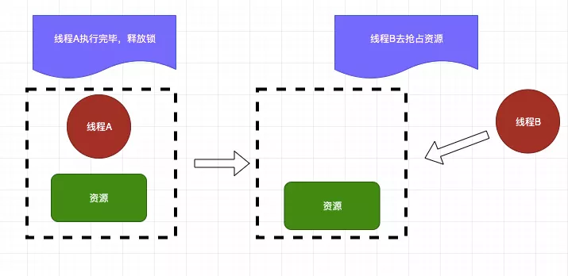
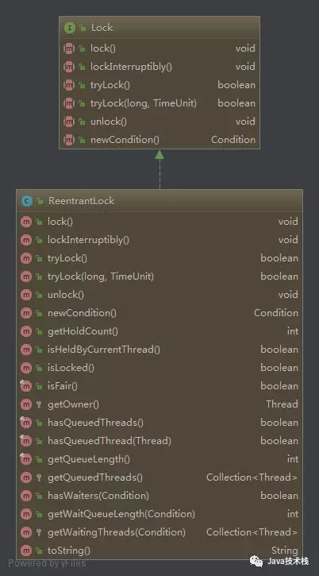
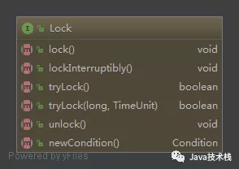

[TOC]

# java中的锁


[https://tech.meituan.com/2018/11/15/java-lock.html](https://tech.meituan.com/2018/11/15/java-lock.html)


> 说到了锁我们经常会联想到生活中的锁，在我们日常中我们经常会接触到锁。比如我们的手机锁，电脑锁，再比如我们生活中的门锁，这些都是锁。
>
> 说了这么多还是不清楚锁到底有什么用处？这一点就要深思我们为什么要使用锁，我们用手机锁是为了保障我们的隐私安全，使用门锁是为了保障我们的财产安全，准确的来说我们使用锁就是为了安全。那么在生活中我们可以加锁来保障自己的隐私和财产安全，那Java中的锁有什么用处呢？


- Java中的锁准确的来说也是为了保证安全，不过不同的是Java中的锁是为了保证并发所需要的。所以在Java中加锁准确的来说是为了**保证并发安全**，同时也是为了**解决内存中的一致性，原子性，有序性三种问题**。在Java中提供了各式各样的锁，每种锁都有其自身的特点和适用范围。所以我们都要熟悉锁的区别和原理才能正确的使用。


## 乐观锁和悲观锁


### 悲观锁

- 悲观锁如其名它是悲观的，它觉得每次访问数据都可能被其他人(线程)修改，所以在访问资源的时候就会对资源进行加锁，用这种方式来保证资源在访问的时候不会被其他线程修改。这样的话其他线程想要获取资源的话就只能阻塞，等到当前线程释放锁后在获取。在Java中悲观锁的实现有`synchronized关键字`和`Lock`的实现类都是悲观锁。我们来看一下悲观锁到底是怎么执行的。


线程A抢占到资源后线程B就陷入了阻塞中,然后就等待线程A释放资源。



当线程A释放完资源后线程B就去获取锁开始操作资源˛悲观锁保证了资源同时只能一个线程进行操作。


### 乐观锁

与悲观锁相反，乐观锁并不会觉得访问数据的时候会有人修改(所以它是乐观的)，所以在访问资源的时候并不会上锁，但是在提交的时候回去判断一下是否有人修改了当前数据，在数据库中我们可以使用`version`版本号去实现。在Java中我们是使用CSA来实现。我们看一下乐观锁的执行过程


### 使用悲观锁和乐观锁

```java
//悲观锁
public synchronized void testMethod(){
    //do something
}

//乐观锁
private AtomicLong value = new AtomicLong();
```

可以使用synchronized关键字来实现悲观锁，乐观锁可以使用并法包下提供的原子类。


## 公平锁和非公平锁

- 公平锁如其名讲究的是一个公平，所以多个线程同时申请申请锁的话，线程会放入一个队列中，在队列中第一个进入队列的线程才能获取锁资源，讲究的是先到先得。

- 非公平锁先到不一定先得

不过公平锁也是有缺点的，当一个线程获取资源后在队列中的其他的线程就只能在阻塞，CPU的所以公平锁比非公平锁的效率要低很多。因为*CPU唤醒阻塞线程的开销比非公平锁大*。


在Java中ReentrantLock提供了公平锁和非公平锁的实现。看一下ReentrantLock怎么实现公平锁和非公平锁

```java
//公平锁
private ReentrantLock fairLock = new ReentrantLock(true);

//非公平锁
private ReentrantLock fairLock = new ReentrantLock(false);

//默认是非公平锁
private ReentrantLock fairLock = new ReentrantLock();
```

### 使用

ReentrantLock默认就是非公平的锁，我们来看一下公平锁的例子：


看一下输出结果：


我们可以看到公平锁的输出结果是按照顺序来的，先到先得。


在看一下非公平锁的例子：


输出结果：


我们可以看到如果使用非公平锁的话最后输出的结果是完全没有顺序的，先到不一定先得。


所以在使用公平锁的时候线程1获取到锁之后线程2在请求锁的话就会挂起等待线程1释放锁，然后线程2才能获取锁。如果再有一个线程3想要请求锁的话，这时候如果使用的是非公平锁，那么线程2和线程3中两个有一个会获取到锁，公平锁的情况下线程3只能先挂起，等待线程2获取锁资源释放后在获取。


### 公平锁与非公平锁效率差异原因

在需要公平资源的场景下使用公平锁，如果不需要特殊的公平对待的话尽量使用非公平锁，因为公平锁会带来性能的开销。

公平锁要维护一个队列，后来的线程要加锁，即使锁空闲，也要先检查有没有其他线程在 wait，如果有自己要挂起，加到队列后面，然后唤醒队列最前面的线程。这种情况下相比较非公平锁多了一次挂起和唤醒

**线程切换的开销**，其实就是非公平锁效率高于公平锁的原因，因为**非公平锁减少了线程挂起的几率**，后来的线程有一定几率逃离被挂起的开销。


## 独占锁和共享锁

看到独占和共享会联想到什么，对的独占锁就是每次只有一个线程能霸占这个锁资源，而其他线程就只能等待当前获取锁资源的线程释放锁才能再次获取锁，刚刚上面的**ReentrantLock就是独占锁**，那这样看来独占锁不也就是悲观锁吗？因为悲观锁抢占资源后就只能等待释放其他线程才能再次获取到锁资源。其实准确的说<font color="00dd00">独占锁也是悲观锁</font>。

在谈共享锁，共享锁其实也是乐观锁它放宽了锁的策略，<u>允许多个线程同时获取锁</u>。在**并发包中ReadWriteLock就是一个典型的共享锁**。它允许一个资源可以被多个读操作访问，或者被一个 写操作访问，但两者不能同时进行。


## 自旋锁

自旋锁其实就是当一个线程获取锁的时候，这个锁已经被其他人获取到了那么这个线程不会立马挂起，反而在不放弃CPU使用权的情况下会尝试再次获取锁资源，默认次数是10次，可以使用`-XX: PreBlockSpinsh`来设置次数。

如果自旋锁获取锁的时间太长，会造成后面的线程CPU资源耗尽释放。并且自旋锁是不公平的。


**优点：**自旋锁<u>不会使线程状态发生切换</u>，一直处于用户态，即线程一直都是active的；不会使线程进入阻塞状态，减少了不必要的上下文切换，执行速度快。


## 可重入锁


### 什么是重入锁

- `java.util.concurrent.locks.ReentrantLock`

这个是 JDK @since 1.5 添加的一种颗粒度更小的锁，它完全可以替代 synchronized 关键字来实现它的所有功能，而且 ReentrantLock 锁的灵活度要远远大于 synchronized 关键字。



从类结构图看出，ReentrantLock 实现了 Lock 接口，ReentrantLock 只是 Lock 接口的一个实现而已。


### 为什么叫重入锁呢

`ReentrantLock`：Re-Entrant-Lock：即表示**可重新反复进入的锁，但仅限于当前线程**；

```java
public void m() {
    lock.lock();
    lock.lock();
    try {
      // ... method body
    } finally {
      lock.unlock()
      lock.unlock()
    }
}
```

如示例代码所示，当前线程可以反复加锁，但也需要释放同样加锁次数的锁，即重入了多少次，就要释放多少次，不然也会导入锁不被释放。


### 重入锁最重要的几个方法


这几个方法都是 Lock 接口中定义的：




**1）lock()**

获取锁，有以下三种情况：

- 锁空闲：直接获取锁并返回，同时设置锁持有者数量为：1；
- 当前线程持有锁：直接获取锁并返回，同时锁持有者数量递增1；
- 其他线程持有锁：当前线程会休眠等待，直至获取锁为止；

**2）lockInterruptibly()**

获取锁，逻辑和 lock() 方法一样，但这个方法在获取锁过程中能响应中断。

**3）tryLock()**

从关键字字面理解，这是在尝试获取锁，获取成功返回：true，获取失败返回：false, 这个方法不会等待，有以下三种情况：

- 锁空闲：直接获取锁并返回：true，同时设置锁持有者数量为：1；
- 当前线程持有锁：直接获取锁并返回：true，同时锁持有者数量递增1；
- 其他线程持有锁：获取锁失败，返回：false；

**4）tryLock(long timeout, TimeUnit unit)**

逻辑和 tryLock() 差不多，只是这个方法是带时间的。

**5）unlock()**

释放锁，每次锁持有者数量递减 1，直到 0 为止。所以，现在知道为什么 lock 多少次，就要对应 unlock 多少次了吧。

**6）newCondition**

返回一个这个锁的 Condition 实例，可以实现 synchronized 关键字类似 wait/ notify 实现多线程通信的功能，不过这个比 wait/ notify 要更灵活，更强大！


### 重入锁大概的用法

```java
class X {

  private final ReentrantLock lock = new ReentrantLock();

  // ...

  public void m() {
    lock.lock();  // block until condition holds
    try {
      // ... method body
    } finally {
      lock.unlock()
    }
  }

}}
```

加锁和释放锁都在方法里面进行，可以自由控制，比 synchronized 更灵活，更方便。但要注意的是，释放锁操作必须在 finally 里面，不然如果出现异常导致锁不能被正常释放，进而会卡死后续所有访问该锁的线程。


### synchronized 是重入锁吗


```java
public synchronized void operation(){
    add();
}

public synchronized void add(){

}
```

`operation`() 方法调用了 `add`() 方法，两个方法都是用 `synchronized` 修饰的，`add`()  方法可以成功获取当前线程 `operation`() 方法已经获取到的锁，**说明 `synchronized` 就是可重入锁**。


## 分段锁

分段锁其实是一种锁的设计，并不是具体的一种锁，对于ConcurrentHashMap而言，其并发的实现就是通过分段锁的形式来实现高效的并发操作。

我们以ConcurrentHashMap来说一下分段锁的含义以及设计思想，ConcurrentHashMap中的分段锁称为Segment，它即类似于HashMap（JDK7与JDK8中HashMap的实现）的结构，即内部拥有一个Entry数组，数组中的每个元素又是一个链表；同时又是一个ReentrantLock（Segment继承了ReentrantLock)。

当需要put元素的时候，并不是对整个hashmap进行加锁，而是先通过hashcode来知道他要放在那一个分段中，然后对这个分段进行加锁，所以当多线程put的时候，只要不是放在一个分段中，就实现了真正的并行的插入。

但是，在统计size的时候，可就是获取hashmap全局信息的时候，就需要获取所有的分段锁才能统计。

分段锁的设计目的是细化锁的粒度，当操作不需要更新整个数组的时候，就仅仅针对数组中的一项进行加锁操作。


## 锁的状态（无锁/偏向锁/轻量级锁/重量级锁）

[https://blog.csdn.net/lengxiao1993/article/details/81568130](https://blog.csdn.net/lengxiao1993/article/details/81568130)

[https://www.cnblogs.com/paddix/p/5405678.html](https://www.cnblogs.com/paddix/p/5405678.html)


锁的状态总共有四种：**无锁状态、偏向锁、轻量级锁和重量级锁**。随着锁的竞争，锁可以从偏向锁升级到轻量级锁，再升级的重量级锁（但是锁的升级是单向的，也就是说只能从低到高升级，不会出现锁的降级）。JDK 1.6中默认是开启偏向锁和轻量级锁的，我们也可以通过`-XX:-UseBiasedLocking`来禁用偏向锁。


这三种锁是指锁的状态，并且是针对Synchronized。在Java 5通过引入锁升级的机制来实现高效Synchronized。这三种锁的状态是通过对象监视器在对象头中的字段来表明的。

- 偏向锁是指一段同步代码一直被一个线程所访问，那么该线程会自动获取锁。降低获取锁的代价。
- 轻量级锁是指当锁是偏向锁的时候，被另一个线程所访问，偏向锁就会升级为轻量级锁，其他线程会通过自旋的形式尝试获取锁，不会阻塞，提高性能。
- 重量级锁是指当锁为轻量级锁的时候，另一个线程虽然是自旋，但自旋不会一直持续下去，当自旋一定次数的时候，还没有获取到锁，就会进入阻塞，该锁膨胀为重量级锁。重量级锁会让其他申请的线程进入阻塞，性能降低。