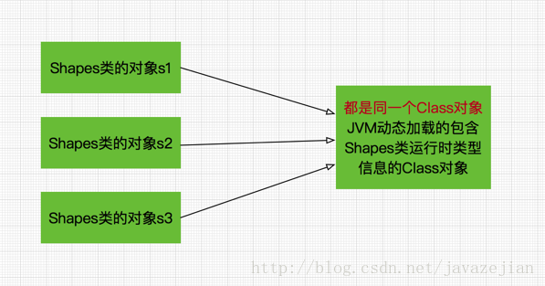
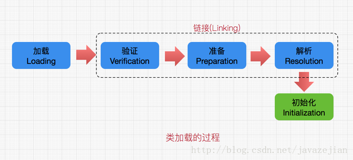

# 1.java类型信息

- RTTI

  Run-Time Type Identification，运行时类型识别，其作用是在运行时识别一个对象的类型和类的信息。

  > 1. 传统的”RRTI”,它假定我们在编译期已知道了所有类型(在没有反射机制创建和使用类对象时，一般都是编译期已确定其类型，如new对象时该类必须已定义好)
  > 2. 另外一种是反射机制，它允许我们在运行时发现和使用类型的信息。在Java中用来表示运行时类型信息的对应类就是Class类，**Class类也是一个实实在在的类**，存在于JDK的java.lang包中

## 1.1 Class对象

- Class 是一个类; **一个描述类的类：**

  　　封装了描述方法的 Method,

  ​        描述字段的 Filed,

  ​        描述构造器的 Constructor 等属性.

- Class类被创建后的对象就是Class对象，注意，**Class对象表示的是自己手动编写类的类型信息**，比如创建一个Shapes类，那么，JVM就会创建一个Shapes对应Class类的Class对象，该Class对象保存了Shapes类相关的类型信息。

- 实际上**在Java中每个类都有一个Class对象**，每当我们编写并且编译一个新创建的类就会产生一个对应Class对象。并且这个Class对象会被保存在同名.class文件里(编译后的字节码文件保存的就是Class对象)，

- 为什么需要这样一个Class对象呢

  > ​	是这样的，当我们new一个新对象或者引用静态成员变量时，Java虚拟机**(JVM)中的类加载器**子系统会将**对应Class对象加载到JVM中**，然后JVM再根据这个类型信息相关的Class对象创建我们需要实例对象或者提供静态变量的引用值。

- **Class类只存私有构造函数，因此对应Class对象只能有JVM创建和加载**

- 需要特别注意的是，**手动编写的每个class类**，无论创建多少个实例对象，**在JVM中都只有一个Class对象**，即在内存中每个类有且只有一个相对应的Class对象，挺拗口，通过下图理解（内存中的简易现象图）：



**总结：**

```xml
手动编写的类被编译后会产生一个Class对象，其表示的是创建的类的类型信息，而且这个Class对象保存在同名.class的文件中(字节码文件)，比如创建一个Shapes类，编译Shapes类后就会创建其包含Shapes类相关类型信息的Class对象，并保存在Shapes.class字节码文件中。

每个通过关键字class标识的类，在内存中有且只有一个与之对应的Class对象来描述其类型信息，无论创建多少个实例对象，其依据的都是用一个Class对象。

Class类只存私有构造函数，因此对应Class对象只能有JVM创建和加载

Class类的对象作用是运行时提供或获得某个对象的类型信息，这点对于反射技术很重要
```
**常用方法**：

```java
//通过Class.forName获取Gum类的Class对象*
Class clazz=Class.forName("com.zejian.Gum");
```

- forName方法是**Class类的一个static成员方法**，记住所有的Class对象都源于这个Class类，因此Class类中定义的方法将适应所有Class对象。

- 调用forName方法将会导致**Gum类被加载**(前提是Gum类从来没有被加载过)。

- 返回一个对应类的Class对象

- 需要捕获一个名称为ClassNotFoundException的异常

  > forName方法在编译器是无法检测到其传递的字符串对应的类是否存在的，只能在程序运行时进行检查

  

	//字面常量的方式获取Class对象
	Class clazz = Gum.class;

- 通过字面量的方法获取Class对象的引用不会自动初始化该类
- 字面常量的获取Class对象引用方式不仅可以应用于普通的类，**也可以应用用接口，数组以及基本数据类型**

```java
boolean.class = Boolean.TYPE;
char.class = Character.TYPE;
byte.class = Byte.TYPE;
short.class = Short.TYPE;
int.class = Integer.TYPE;
long.class = Long.TYPE;
float.class = Float.TYPE;
double.class = Double.TYPE;
void.class = Void.TYPE;
```


## 1.2类加载过程



**加载**：

​	类加载过程的一个阶段：通过一个类的完全限定查找此类字节码文件，并利用字节码文件创建一个Class对象

**链接**：

​	验证字节码的安全性和完整性，准备阶段正式为静态域分配存储空间，注意此时只是分配静态成员变量的存储空间，不包含实例成员变量，如果必要的话，解析这个类创建的对其他类的所有引用。

**初始化**：

​	类加载最后阶段，若该类具有超类，则对其进行初始化，执行静态初始化器和静态初始化成员变量。


## 1.3 类初始化时机

- 关于类加载的初始化阶段，在**虚拟机规范严格规定**了**有且只有5种场景**必须对类进行初始化：

```xml
1.使用new关键字实例化对象时、读取或者设置一个类的静态字段(不包含编译期常量)以及调用静态方法的时候，必须触发类加载的初始化过程(类加载过程最终阶段)。

2.使用反射包(java.lang.reflect)的方法对类进行反射调用时，如果类还没有被初始化，则需先进行初始化，这点对反射很重要。

3.当初始化一个类的时候，如果其父类还没进行初始化则需先触发其父类的初始化。

4.当Java虚拟机启动时，用户需要指定一个要执行的主类(包含main方法的类)，虚拟机会先初始化这个主类

5.当使用JDK 1.7 的动态语言支持时，如果一个java.lang.invoke.MethodHandle 实例最后解析结果为REF_getStatic、REF_putStatic、REF_invokeStatic的方法句柄，并且这个方法句柄对应类没有初始化时，必须触发其初始化(这点看不懂就算了，这是1.7的新增的动态语言支持，其关键特征是它的类型检查的主体过程是在运行期而不是编译期进行的，这是一个比较大点的话题，这里暂且打住)
```


# 2.java反射机制

- 反射机制是在运行状态中，对于任意一个类，都能够知道这个类的所有属性和方法；对于任意一个对象，都能够调用它的任意一个方法和属性，这种动态获取的信息以及动态调用对象的方法的功能称为java语言的反射机制。
- 常用的类主要有**Constructor类**表示的是Class 对象所表示的类的构造方法，利用它可以在运行时动态创建对象、**Field**表示Class对象所表示的类的成员变量，通过它可以在运行时动态修改成员变量的属性值(包含private)、**Method**表示Class对象所表示的类的成员方法，通过它可以动态调用对象的方法(包含private)

## 2.1Constructor类及其用法

- Constructor代表某个类的构造方法。

### 2.1.1 获取构造方法：

- 得到这个类的所有构造方法： Constructor[] cons = Class.forName(“cn.itheima.Person”).getConstructors();
- 获取某一个构造方法： Constructor con=Person.class.getConstructor(String.class,int.class);、

### 2.1.2 创建实例对象：

通常方式：Person p = new Person(“lisi”,30);

反射方式：Person p= (Person)con.newInstance(“lisi”,30);

- **注：**

  1、创建实例时newInstance方法中的参数列表必须与获取Constructor的方法getConstructor方法中的参数列表一致。

  2、newInstance()：构造出一个实例对象，每调用一次就构造一个对象。

  3、利用Constructor类来创建类实例的好处是可以指定构造函数，而Class类只能利用无参构造函数创建类实例对象。

## 2.2Method类及其用法

- Method类位于 java.lang.reflect 包中，主要用于在程序运行状态中，动态地获取方法信息

### **常用方法：**

1. getAnnotatedReturnType()/getAnnotatedExceptionTypes()

   返回一个AnnotatedType对象/对象数组，该对象表示使用一个类型来指定由该可执行文件表示的方法/构造函数的返回类型

   ```java
   public class MethodTest {
       
       public String test() {
           return null;
       }
   
       public static void main(String[] args) throws Exception {
           Method method = MethodTest.class.getDeclaredMethod("test");
           AnnotatedType methodAnnotatedReturnType = method.getAnnotatedReturnType();
           // class java.lang.String
           System.out.println(methodAnnotatedReturnType.getType());
       }
   }
   ```

2. getAnnotatedExceptionTypes()

   返回一个AnnotatedType对象，该对象表示使用一个类型来指定该可执行对象表示的方法/构造函数的接收者类型

3. getAnnotatedParameterTypes()

   返回一个AnnotatedType对象数组，这些对象表示使用类型来指定由该可执行文件表示的方法/构造函数的形式参数类型

4. **getAnnotation(Class<T> annotationClass)**

   **getDeclaredAnnotation(Class<T> annotationClass)**

   * 如果该方法对象存在指定类型的注解，则返回该注解，否则返回null。

   * **只有类级别的注解会被继承得到，对于其他对象而言，getAnnotation() 方法与 getDeclaredAnnotation() 方法作用相同**

   ```java
   @Target(ElementType.METHOD)
   @Retention(RetentionPolicy.RUNTIME)
   public @interface MethodAnnotation {
       String key();
       String value();
   }
   
   public class MethodTest {
       
       @MethodAnnotation(key = "key", value = "value")
       public void test() {}
   
       public static void main(String[] args) throws Exception {
           Method method = MethodTest.class.getDeclaredMethod("test");
           MethodAnnotation annotation = method.getAnnotation(MethodAnnotation.class);
           // @lang.reflect.MethodAnnotation(value=value, key=key)
           System.out.println(annotation);
       }
   }
   ```

5. **getAnnotationsByType(Class<T> annotationClass)**

   **getDeclaredAnnotationsByType(Class<T> annotationClass)**

   - 如果该方法对象存在指定类型的注解，则返回该注解数组，否则返回null
   - 只有类级别的注解会被继承得到，对于其他对象而言，getAnnotationsByType() 方法与 getDeclaredAnnotationsByType() 方法作用相同
   - getAnnotationsByType() 方法与 getAnnotation() 方法的区别在于 getAnnotationsByType() 方法会检查修饰该方法对象的注解是否为可重复类型注解，如果是则会返回该参数类型的一个或多个注解
   - @Repeatable 用于声明注解为可重复类型注解，当声明为可重复类型注解后，如果方法注解仍为一个，则 getAnnotation() 方法会正常返回，如果方法注解为多个，则 getAnnotation()方法会返回null

   ```java
   @Target(ElementType.METHOD)
   @Retention(RetentionPolicy.RUNTIME)
   @Repeatable(RepeatableAnnotation.class)
   public @interface MethodAnnotation {
   
       String key();
   
       String value();
   }
   
   @Target(ElementType.METHOD)
   @Retention(RetentionPolicy.RUNTIME)
   @interface RepeatableAnnotation {
       MethodAnnotation[] value();
   }
   
   public class MethodTest {
       
       @MethodAnnotation(key = "key1", value = "value1")
       @MethodAnnotation(key = "key2", value = "value2")
       public void test() {}
   
       public static void main(String[] args) throws Exception {
           Method method = MethodTest.class.getDeclaredMethod("test");
           MethodAnnotation[] annotationsByType = method.getAnnotationsByType(MethodAnnotation.class);
           // [@lang.reflect.MethodAnnotation(value=value1, key=key1), @lang.reflect.MethodAnnotation(value=value2, key=key2)]
           System.out.println(Arrays.toString(annotationsByType));
       }
   }
   ```

6. **getAnnotations()/getDeclaredAnnotations()**

   - 返回该方法对象上的所有注解，如果没有注解，则返回空数组

   - **只有类级别的注解会被继承得到，对于其他对象而言，getAnnotations() 方法与 getDeclaredAnnotations() 方法作用相同**

7. **getModifiers()**

   返回修饰该方法对象修饰符的整数形式，使用 Modifier 类对其进行解码

8. **getName()**

   返回方法对象名称

9. **isAnnotationPresent(Class<? extends Annotation> annotationClass)**

   如果该方法对象上有指定类型的注解，则返回true，否则为false

10. **isVarArgs()**

    如果该方法对象的参数中存在 可变参，则返回true，否则为false

11. **getDeclaringClass()**

    返回该方法对象表示的方法所在类的Class对象

    ```java
    public class MethodTest {
    
        public void test() {}
    
        public static void main(String[] args) throws Exception {
            Method method = MethodTest.class.getDeclaredMethod("test");
            Class<?> declaringClass = method.getDeclaringClass();
            // class lang.reflect.MethodTest
            System.out.println(declaringClass);
        }
    }
    ```

12. getParameterAnnotations()

    返回一组注解数组，这些注解以声明顺序修饰该方法对象的参数

13. getParameterCount()

    返回该方法对象的参数个数 (**无论是显式声明的还是隐式声明的或不声明的**)

14. **getParameters()**

    返回一个参数对象数组，该数组表示该方法对象的所有参数

15. getDefaultValue()

    - 返会该注解方法对象表示的成员默认值
    - 如果成员属于基本数据类型，则返回对应的包装类实例
    - 如果没有默认值或者该方法实例不表示注解方法，则返回null

16. getParameterTypes()

    返回一个Class对象数组，该数组以声明顺序表示该方法对象的参数对象，会擦除泛型

17. getReturnType()

    返回一个Class对象，该Class对象表示该方法对象的返回对象，会擦除泛型

18. getGenericReturnType()

    返回一个Type对象，该Type对象表示该方法对象的返回类型，会保留泛型

19. getExceptionTypes()

    返回一个Class对象数组，该数组表示由该方法对象抛出的异常对象，会擦除泛型

20. getGenericExceptionTypes()

    返回一个Type对象数组，该数组表示由该方法对象抛出的异常类型，会保留泛型

21. getTypeParameters()

    返回一个TypeVariable对象数组，该数组表示该方法对象声明列表上的类型变量数组

22. **toString()**

    返回该方法对象的字符串表示形式，会擦除泛型

    ```java
    public class MethodTest<T, V> {
    
        public <T, V> void test() {}
    
        public static void main(String[] args) throws Exception {
            Method method = MethodTest.class.getMethod("test");
            // public void lang.reflect.MethodTest.test()
            System.out.println(method.toString());
        }
    }
    ```

23. **toGenericString()**

    返回该方法对象的字符串表示形式，会保留泛型

    ```java
    public class MethodTest<T, V> {
    
        public <T, V> void test() {}
    
        public static void main(String[] args) throws Exception {
            Method method = MethodTest.class.getMethod("test");
            // public <T,V> void lang.reflect.MethodTest.test()
            System.out.println(method.toGenericString());
        }
    }
    ```

24. **isAccessible()**

    获取该方法对象的可访问标志

25. **setAccessible(boolean flag)**

    - 设置该方法对象的可访问标志

    - 在其他类里调用该方法对象时，如果该方法为私有方法，需要设置访问标志为true，否则会报异常

26. **isDefault()**

    判断该方法对象是否为默认方法，如果是则返回true，否则为false

    ```java
    public interface Interface {
    
        default void test() {
            System.out.println("这是一个默认方法");
        }
    }
    
    public class MethodTest implements Interface {
    
        public static void main(String[] args) throws Exception {
            Method method = MethodTest.class.getMethod("test");
            // true
            System.out.println(method.isDefault());
        }
    }
    ```

27. isSynthetic()

    - 判断该方法对象是否为合成方法，如果是则返回true，否则为false
    - 在内部类InnerClass中，name是一个私有属性，而我们在外部类MethodTest中，直接引用了这个属性，因此编译器通过生成一个合成方法，用于绕开private私有属性的限制

```java
public class MethodTest {

    private class InnerClass {
        private String name = "小明";
    }

    public static void main(final String[] arguments) {
        InnerClass innerClass = new MethodTest().new InnerClass();
        System.out.println("name: " + innerClass.name);

        Method[] declaredMethods = innerClass.getClass().getDeclaredMethods();
        for (Method declaredMethod : declaredMethods) {
            // 【static java.lang.String lang.reflect.MethodTest$InnerClass.access$100(lang.reflect.MethodTest$InnerClass)】 isSynthetic(): true
            System.out.println("【" + declaredMethod + "】" + " isSynthetic(): " + declaredMethod.isSynthetic());
        }
    }
}
```

28. isBridge()

    判断该方法对象是否桥接方法，如果是则返回true，否则为false

    **桥接方法**: 是 JDK1.5 引入泛型后，为了使Java的泛型方法生成的字节码和 1.5 版本前的字节码相兼容，由编译器自动生成的方法

29. **Object invoke(Object obj, Object... args)**

    调用底层的方法，通过该方法对象的代表，对指定的对象指定参数。obj对象中带有参数args的method方法。

    obj：类的实例

    args：被调用方法的参数数组

## 2.3Field类及其用法

- Field类代表某个类中一个成员变量

- 方法介绍

  Field **getField**(String s);//只能获取公有和父类中公有

  Field **getDeclaredField**(String s);//获取该类中任意成员变量，包括私有

  **setAccessible**(ture);//如果是私有字段，要先将该私有字段进行取消权限检查的能力。也称暴力访问。

  **set**(Object obj, Object value);//将指定对象变量上此Field对象表示的字段设置为指定的新值。

  Object **get**(Object obj);//返回指定对象上Field表示的字段的值。

## 2.4Class类常用方法总结

**getConstructor(Class[])** :返回当前 Class 对象表示的类的指定的**公有构造**子对象。 

**getConstructors()** :返回当前 Class 对象表示的类的所有**公有构造**子对象数组。 

**getMethod(String, Class[])** :返回当前 Class 对象表示的类或接口的指定的**公有成员**方法对象。 

**getMethods()** :返回当前 Class 对象表示的类或接口的所有**公有成员**方法对象数组，包括已声明的和从父类继承的方法。 

**getField(String)** :返回当前 Class 对象表示的类或接口的指定的**公有成员**域对象。 

**getFields()** :返回当前 Class 对象表示的类或接口的所有可访问的**公有**域对象数组。 


**getDeclaredConstructor(Class[])** :返回当前 Class 对象表示的类的指定已说明的一个构造子对象。 

**getDeclaredConstructors()** :返回当前 Class 对象表示的类的所有已说明的构造子对象数组。 

**getDeclaredMethod(String, Class[])** :返回当前 Class 对象表示的类或接口的指定已说明的一个方法对象。 

**getDeclaredMethods()** :返回 Class 对象表示的类或接口的所有已说明的方法数组。 

**getDeclaredField(String)** :返回当前 Class 对象表示的类或接口的指定已说明的一个域对象。 

**getDeclaredFields()** :返回当前 Class 对象表示的类或接口的所有已说明的域对象数组。 


**getName()**：返回String形式的该类的名称。

 **newInstance()**：根据某个Class对象产生其对应类的实例，它调用的是此类的默认构造方法(没有默认无参构造器会报错)

**getClassLoader()**：返回该Class对象对应的类的类加载器。

**getSuperClass()**：返回某子类所对应的直接父类所对应的Class对象

**isArray()**：判定此Class对象所对应的是否是一个数组对象

**getComponentType**() ：如果当前类表示一个数组，则返回表示该数组组件的 Class 对象，否则返回 null。 

**getInterfaces()** :返回当前对象表示的类或接口实现的接口。 

**isInstance(Object)** :此方法是 Java 语言 instanceof 操作的动态等价方法。

**isInterface()** :判定指定的 Class 对象是否表示一个接口类型

**isPrimitive()** :判定指定的 Class 对象是否表示一个 Java 的基类型。

## 2.4描述注解 -- Annotation

- 如果在程序中要获取注解，然后获取注解的值进而判断我们赋值是否合法，那么类对象的创建和方法的创建必须是通过反射而来的

## 2.5反射与泛型


[地址链接](https://www.cnblogs.com/tech-bird/p/3525336.html)


