[TOC]


# 相关概念

## 进程与线程

- 并发与并行
  - 并行：真正意义上的同时运行，一般需要多台机器或多个CPU同时执行一个任务。
  - 并发：CPU通过时间片轮转方式执行多个任务。
- 进程与线程介绍
  - 进程：系统进行资源分配和调度的最小单位。
  - 线程：线程是进程的一个实体,是CPU调度和分派的最小单位。
- 进程与线程区别
  - 进程有独立的地址空间，一个进程崩溃后，在保护模式下不会对其它进程产生影响。
  - 线程只是一个进程中的不同执行路径。线程有自己的堆栈和局部变量，但线程之间没有单独的地址空间，一个线程死掉就等于整个进程死掉。
  - 一个程序至少有一个进程,一个进程至少有一个线程。

## 线程状态

```java
public enum State {
    NEW,

    RUNNABLE,

    BLOCKED,

    WAITING,

    TIMED_WAITING,

    TERMINATED;
}
```


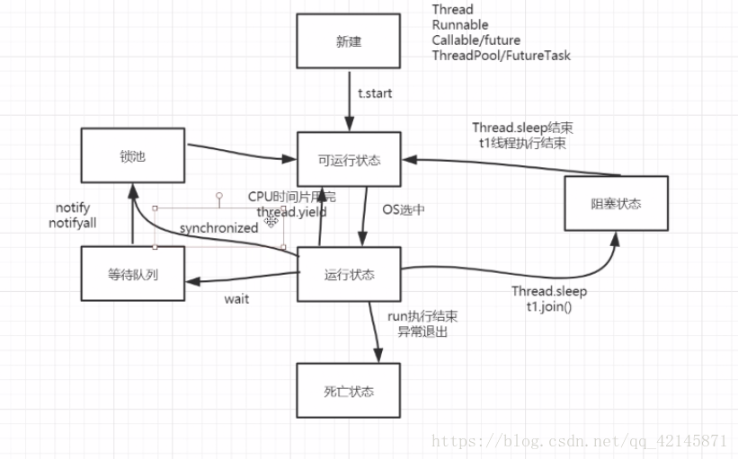


- 新建状态（new）:

  使用 **new** 关键字和 **Thread** 类或其子类建立一个线程对象后，该线程对象就处于新建状态。它保持这个状态直到程序 **start()** 这个线程。

- 运行状态（runable）:

  包括了操作系统线程状态中的Running和Ready，也就是处于此状态的线程有可能正在执行，也有可能正在等待着CPU为它分配执行时间。

- 无限期等待（Waiting）：

  处于这种状态的线程不会被分配CPU执行时间，它们要等待被其他线程显式地唤醒。以下方法会让线程陷入无限期的等待状态：

  - 没有设置timeout参数的Object.wait()方法；
  - 没有设置timeout参数的Thread.join()方法；
  - LockSupport.park()方法；

- 限期等待（Timed Waiting）：

  处于这种状态的线程也不会被分配CPU执行时间，不过无须等待被其他线程显式地唤醒，在一定时间之后它们会由操作系统自动唤醒。以下方法会让线程进入限期等待状态：

  - Thread.sleep()方法；
  - 设置了timeout参数的Object.wait()方法；
  - 设置了timeout参数的Thread.join()方法；
  - LockSupport.parkNanos()方法；
  - LockSupport.parkUntil()方法；

- 阻塞状态:

  “阻塞状态”与“等待状态”的区别是：“阻塞状态”在等待着获取到一个排它锁，这个事件将在另外一个线程放弃这个锁的时候发生；而“等待状态”则是在等待一段时间，或者唤醒动作的发生。在程序等待进入同步区域（synchronized）的时候，线程将进入这种状态。

  可以分为三种：

  - 等待阻塞：运行状态中的线程执行 wait() 方法，使线程进入到等待阻塞状态。
  - 同步阻塞：线程在获取 synchronized 同步锁失败(因为同步锁被其他线程占用)。
  - 其他阻塞：通过调用线程的 sleep() 或 join() 发出了 I/O 请求时，线程就会进入到阻塞状态。当sleep() 状态超时，join() 等待线程终止或超时，或者 I/O 处理完毕，线程重新转入就绪状态。

- 死亡状态:

  一个运行状态的线程完成任务或者其他终止条件发生时，该线程就切换到终止状态。

# 创建一个线程

- 通过实现 Runnable 接口；
- 通过继承 Thread 类本身；
- 通过 Callable 和 Future 创建线程。

## Runnable 接口

- 最简单的方法是创建一个实现 Runnable 接口的类。

```java
class RunnableDemo implements Runnable {
   
   private Thread t;
   private String threadName;
   
   RunnableDemo( String name) {
      threadName = name;
      System.out.println("Creating " +  threadName );
   }
   
   public void run() {
      System.out.println("Running " +  threadName );
      try {
         for(int i = 4; i > 0; i--) {
            System.out.println("Thread: " + threadName + ", " + i);
            // 让线程睡眠一会
            Thread.sleep(50);
         }
      }catch (InterruptedException e) {
         System.out.println("Thread " +  threadName + " interrupted.");
      }
      System.out.println("Thread " +  threadName + " exiting.");
   }
   
   public void start () {
      System.out.println("Starting " +  threadName );
      if (t == null) {
         t = new Thread (this, threadName);
         t.start ();
      }
   }
}

public class TestThread {
 
   public static void main(String args[]) {
      RunnableDemo R1 = new RunnableDemo( "Thread-1");
      R1.start();
      
      RunnableDemo R2 = new RunnableDemo( "Thread-2");
      R2.start();
   }   
}
```

## Thread 类

- 第二种方法是创建一个新的类，该类继承 Thread 类，然后创建一个该类的实例。

  继承类必须重写 run() 方法，该方法是新线程的入口点。它也必须调用 start() 方法才能执行。

  该方法尽管被列为一种多线程实现方式，但是本质上也是实现了 Runnable 接口的一个实例。

```java
class ThreadDemo extends Thread {
   private Thread t;
   private String threadName;
   
   ThreadDemo( String name) {
      threadName = name;
      System.out.println("Creating " +  threadName );
   }
   
   public void run() {
      System.out.println("Running " +  threadName );
      try {
         for(int i = 4; i > 0; i--) {
            System.out.println("Thread: " + threadName + ", " + i);
            // 让线程睡眠一会
            Thread.sleep(50);
         }
      }catch (InterruptedException e) {
         System.out.println("Thread " +  threadName + " interrupted.");
      }
      System.out.println("Thread " +  threadName + " exiting.");
   }
   
   public void start () {
      System.out.println("Starting " +  threadName );
      if (t == null) {
         t = new Thread (this, threadName);
         t.start ();
      }
   }
}
 
public class TestThread {
 
   public static void main(String args[]) {
      ThreadDemo T1 = new ThreadDemo( "Thread-1");
      T1.start();
      
      ThreadDemo T2 = new ThreadDemo( "Thread-2");
      T2.start();
   }   
}
```

- 常用方法

```java
构造：
public Thread() {
        init(null, null, "Thread-" + nextThreadNum(), 0);
    }
    
public Thread(Runnable target) {
        init(null, target, "Thread-" + nextThreadNum(), 0);
    }

public Thread(ThreadGroup group, Runnable target) {
        init(group, target, "Thread-" + nextThreadNum(), 0);
    }

......


public static native Thread currentThread();

public static native void yield();

public static native void sleep(long millis) throws InterruptedException;

public static void sleep(long millis, int nanos) throws InterruptedException;
    
public synchronized void start();

@Deprecated
public final void stop();
    
@Deprecated
public final synchronized void stop(Throwable obj);

public void interrupt();

public static boolean interrupted();

public boolean isInterrupted();

@Deprecated
public void destroy();

public final native boolean isAlive();

@Deprecated
public final void suspend();

@Deprecated
public final void resume();

public final void setPriority(int newPriority);

public final int getPriority();

public final synchronized void setName(String name);

public final String getName();

public final ThreadGroup getThreadGroup();

public static int activeCount();	//程序中活跃的线程数。

public static int enumerate(Thread tarray[]);	//枚举程序中的线程。 

@Deprecated
public native int countStackFrames();

public final synchronized void join(long millis);//等待线程终止。 
public final synchronized void join(long millis, int nanos);
public final void join();

public final void setDaemon(boolean on);//设置一个线程为守护线程。(用户线程和守护线程的区别在于，是否等待主线程依赖于主线程结束而结束) 
    
public final boolean isDaemon();

public final void checkAccess();


public long getId();

public State getState();
```

## Callable 和 Future

- 1. 创建 Callable 接口的实现类，并实现 call() 方法，该 call() 方法将作为线程执行体，并且有返回值。
- 2. 创建 Callable 实现类的实例，使用 FutureTask 类来包装 Callable 对象，该 FutureTask 对象封装了该 Callable 对象的 call() 方法的返回值。
- 3. 使用 FutureTask 对象作为 Thread 对象的 target 创建并启动新线程。
- 4. 调用 FutureTask 对象的 get() 方法来获得子线程执行结束后的返回值。

```java
public class CallableThreadTest implements Callable<Integer> {
    public static void main(String[] args)  
    {  
        CallableThreadTest ctt = new CallableThreadTest();  
        FutureTask<Integer> ft = new FutureTask<>(ctt);  
        for(int i = 0;i < 100;i++)  
        {  
            System.out.println(Thread.currentThread().getName()+" 的循环变量i的值"+i);  
            if(i==20)  
            {  
                new Thread(ft,"有返回值的线程").start();  
            }  
        }  
        try  
        {  
            System.out.println("子线程的返回值："+ft.get());  
        } catch (InterruptedException e)  
        {  
            e.printStackTrace();  
        } catch (ExecutionException e)  
        {  
            e.printStackTrace();  
        }  
  
    }
    @Override  
    public Integer call() throws Exception  
    {  
        int i = 0;  
        for(;i<100;i++)  
        {  
            System.out.println(Thread.currentThread().getName()+" "+i);  
        }  
        return i;  
    }  
}
```

- 注意：

  ```java
  future.isDone() //return true,false 无阻塞
  future.get() // return 返回值，阻塞直到该线程运行结束
  ```

# 停止一个线程

- stop() destroy() resume()等方法已经被废弃，那么如何停止一个线程呢？

## 使用标志位终止线程

- 用修改标志位的方式来结束 run() 方法。

```java
public class ServerThread extends Thread {
    //volatile修饰符用来保证其它线程读取的总是该变量的最新的值
    public volatile boolean exit = false; 

    @Override
    public void run() {
        ServerSocket serverSocket = new ServerSocket(8080);
        while(!exit){
            serverSocket.accept(); //阻塞等待客户端消息
            ...
        }
    }
    
    public static void main(String[] args) {
        ServerThread t = new ServerThread();
        t.start();
        ...
        t.exit = true; //修改标志位，退出线程
    }
}
```


##  使用 interrupt() 中断线程

- 注意：

  interrupt() 方法并不像在 for 循环语句中使用 break 语句那样干脆，马上就停止循环。调用 interrupt() 方法仅仅是在当前线程中打一个停止的标记，并不是真的停止线程。

  也就是说，线程中断并不会立即终止线程，而是通知目标线程，有人希望你终止。至于目标线程收到通知后会如何处理，则完全由目标线程自行决定。这一点很重要，如果中断后，线程立即无条件退出，那么我们又会遇到 stop() 方法的老问题。

```java
public class InterruptThread1 extends Thread{

    public static void main(String[] args) {
        try {
            InterruptThread1 t = new InterruptThread1();
            t.start();
            Thread.sleep(200);
            t.interrupt();
        } catch (InterruptedException e) {
            e.printStackTrace();
        }
    }

    @Override
    public void run() {
        super.run();
        for(int i = 0; i <= 200000; i++) {
            //判断是否被中断
            if(Thread.currentThread().isInterrupted()){
                //处理中断逻辑
                break;
            }
            System.out.println("i=" + i);
        }
    }
}
```

- 这种方式看起来与之前介绍的“使用标志位终止线程”非常类似，**但是在遇到 sleep() 或者 wait() 这样的操作，我们只能通过中断来处理了**。
- Thread.sleep() 方法会抛出一个 InterruptedException 异常，当线程被 sleep() 休眠时，如果被中断，这会就抛出这个异常。
- 注意：Thread.sleep() 方法由于中断而抛出的异常，是会清除中断标记的。

# 线程调度

## 线程优先级

- 1 （Thread.MIN_PRIORITY ） 

- 10 （Thread.MAX_PRIORITY ）
- 5（ Thread.NORM_PRIORITY）默认情况下的优先级

线程的优先级有继承关系，比如A线程中创建了B线程，那么B将和A具有相同的优先级。

Thread类的setPriority()和getPriority()方法分别用来设置和获取线程的优先级。

## 线程睡眠

- Thread.sleep(long millis)方法，使线程转到阻塞状态。（millis参数设定睡眠的时间，以毫秒为单位）。
- 当睡眠结束后，就转为就绪（Runnable）状态。sleep()平台移植性好。

## 线程等待

- Object类中的wait()方法，导致当前的线程等待，直到其他线程调用此对象的 notify() 方法或 notifyAll() 唤醒方法。这个两个唤醒方法也是Object类中的方法，行为等价于调用 wait(0) 一样。

## 线程唤醒

- Object类中的notify()方法，唤醒在此对象监视器上等待的单个线程。如果所有线程都在此对象上等待，则会选择唤醒其中一个线程。选择是任意性的，并在对实现做出决定时发生。线程通过调用其中一个 wait 方法，在对象的监视器上等待。 直到当前的线程放弃此对象上的锁定，才能继续执行被唤醒的线程。被唤醒的线程将以常规方式与在该对象上主动同步的其他所有线程进行竞争；例如，唤醒的线程在作为锁定此对象的下一个线程方面没有可靠的特权或劣势。类似的方法还有一个notifyAll()，唤醒在此对象监视器上等待的所有线程。

-  注意：Thread中suspend()和resume()两个方法在JDK1.5中已经废除，不再介绍。因为有死锁倾向。

## 线程让步

- Thread.yield() 
-  **yield()应该做的是让当前运行线程回到可运行状态，以允许具有相同优先级的其他线程获得运行机会。**因此，使用yield()的目的是让相同优先级的线程之间能适当的轮转执行。但是，实际中无法保证yield()达到让步目的，因为让步的线程还有可能被线程调度程序再次选中。

## 线程加入

- join()方法，等待其他线程终止。在当前线程中调用另一个线程的join()方法，则当前线程转入阻塞状态，直到另一个进程运行结束，当前线程再由阻塞转为就绪状态。

# 线程间通信

## wait/notify

- `wait()`与`notify()`的成对使用， 是一种**线程间通信**的手段。（进一步分析， `wait()` 操作的调用必然是在等待某种条件的成立， 而条件的成立必然是由其他的线程来完成的。）
- 在Java中，可以通过配合调用`Object`对象的`wait`方法和`notify`方法或`notifyAll`方法来实现**线程间的协作通信**。在线程中调用wait方法，将阻塞等待其他线程的通知(其他线程调用`notify`方法或`notifyAll`方法)，在线程中调用`notify`方法或`notifyAll`方法，将通知其他线程从`wait`方法处返回。
- 在JDK1.4之后出现了一个**Condition类**，这个类也能够实现**线程间的协作通信**，并且一般建议使用Condition替代`wait,notify,notifyAll`家族，实现更安全的线程间协作通信功能，比如`ArrayBlockingQueue`就是使用`Condition`实现阻塞队列的。
- 注意
  - `Object.wait()`与`Object.notify()`**必须要与**同步块或同步方法(**synchronized**块或者`synchronized`方法)一起使用，也就是`wait`与`notify`是针对已经获取了`Object`锁进行操作，从语法角度来说就是说`Object.wait(),Object.notify`必须在同步块或同步方法内。
  - `wait`：线程在获取对象锁后，主动释放对象锁，同时本线程休眠。直到有其它线程调用对象的`notify()`唤醒该线程，才能继续获取对象锁，并继续执行。
  - `notify`：对对象锁的唤醒操作。有一点需要注意的是`notify()`调用后，并**不是马上就释放对象锁**的，而是在相应的同步块或同步方法中执行结束，自动释放锁后，JVM会在`wait`()对象锁的线程中随机选取一线程，赋予其对象锁，唤醒线程，继续执行。这样就提供了在线程间同步、唤醒的操作。

### 为什么需要和synchronized一起使用

**每个对象都可以被认为是一个"监视器monitor"，这个监视器由三部分组成（一个独占锁，一个入口队列，一个等待队列）(ps:和AQS的state，同步队列，等待队列好相似)。**注意是一个对象只能有一个独占锁，但是任意线程线程都可以拥有这个独占锁。

- 对于对象的<font color="#dd0000">非同步方法</font>而言，任意时刻可以有任意个线程调用该方法。（即普通方法同一时刻可以有多个线程调用）

- 对于对象的<font color="#dd000">同步方法</font>而言，只有拥有这个对象的独占锁才能调用这个同步方法。如果这个独占锁被其他线程占用，那么另外一个调用该同步方法的线程就会处于阻塞状态，**此线程进入入口队列**。

- 若一个拥有该独占锁的线程调用该对象同步方法的`wait`()方法，则该线程会释放独占锁，并**加入对象的等待队列**。只要该线程在该对象的等待队列中， 就会一直处于闲置状态， 不会被调度执行。（要注意`wait()`方法会强迫线程先进行释放锁操作，所以在调用`wait()`时， 该线程必须已经获得锁，否则会抛出异常。由于`wait()`在`synchonized`的方法内部被执行， 锁一定已经获得， 就不会抛出异常了。）

- 某个线程调用`notify`(),`notifyAll`()方法是**将等待队列的线程转移到入口队列，然后在入口队列中的多个线程就会竞争该对象的锁**，所以这个<font color="00dd00">调用线程本身必须拥有锁</font>。
- `wait()`与`notify()`的成对使用， 是一种**线程间通信**的手段。（进一步分析， `wait()` 操作的调用必然是在等待某种条件的成立， 而条件的成立必然是由其他的线程来完成的。）所以实际上， 我们调用 wait() 的时候， 实际上希望达到如下的效果

```java
// 线程A 的代码
while(!condition){ // 不能使用 if , 因为存在一些特殊情况， 使得线程没有收到 notify 时也能退出等待状态
    wait();
}
// do something
```

```java
// 线程 B 的代码
if(!condition){ 
	// do something ...
    condition = true;
    notify();
}
```

现在考虑， 如果`wait()` 和 `notify()` 的操作没有相应的同步机制， 则会发生如下情况

1.【线程A】 进入了 while 循环后（通过了 !condition 判断条件， 但尚未执行 wait 方法）, CPU 时间片耗尽， CPU 开始执行线程B的代码
2.【线程B】 执行完毕了 condition = true; notify(); 的操作， 此时【线程A】的 wait() 操作尚未被执行， notify() 操作没有产生任何效果
3.【线程A】执行wait() 操作， 进入等待状态，如果没有额外的 notify() 操作， 该线程将持续在 condition = true 的情形下， 持续处于等待状态得不到执行。

由此看出， 在使用 wait() 和 notify() 这种会挂起线程的操作时， 我们**需要一种同步机制保证， `condition` 的检查与 `wait()` 操作， 以及 `condition` 的更新与 `notify()` 是互斥的。**

那是否简单的将之前的代码包裹在一个 synchronized 代码块中就可以满足需求呢？ 像下面这样。

```java
// 线程A 的代码
synchronized(obj_A)
{
	while(!condition){ 
	    wait();
	}
	// do something 
}
```

```java
// 线程 B 的代码
synchronized(obj_A)
{
	if(!condition){ 
		// do something ...
	    condition = true;
	    notify();
	}
}
```

乍一看， 上述的代码可以解决问题， 但是仔细分析一下， 由于wait() 操作会挂起当前线程， 那么必然需要在挂起前释放掉 obj_A 的锁， 但如果 obj_A 允许是任意对象， wait() 函数作为一个没有参数输入的方法，无从得知应该释放哪个对象的锁 。于是很自然的， 语法就会被设计成 java 现在的样子。即基于对象的 wait() 与 notify() 的调用， 必须先获得该对象的锁。

```java
// 线程 A 的代码
synchronized(obj_A)
{
	while(!condition){ 
	    obj_A.wait();
	}
	// do something 
}
```

```java
// 线程 B 的代码
synchronized(obj_A)
{
	if(!condition){ 
		// do something ...
	    condition = true;
	    obj_A.notify();
	}
}
```


- 使用示例

```java
public class WaitNotifyTest {


    @Test
    public void test() throws InterruptedException {

        String s = "abc";

        for(int i = 1; i <= 10; i ++){
            new Thread(new Waiter(s),"waiter" + i).start();
        }

        // new Thread(new Notifier(s), "notifier").start();

        for(int i = 1; i <= 10; i ++){
            new Thread(new Notifier(s), "notifier" + i).start();
        }

        Thread.sleep(3000);
    }
}

class Notifier implements Runnable {

    private String msg;

    public Notifier(String msg) {
        this.msg = msg;
    }

    @Override
    public void run() {
        try {
            Thread.sleep(200);
            synchronized (msg) {
                msg.notify();
                // msg.notifyAll();
            }
        } catch (InterruptedException e) {
            e.printStackTrace();
        }

    }

}

class Waiter implements Runnable{

    private String msg;

    public Waiter(String m){
        this.msg=m;
    }

    @Override
    public void run() {
        String threadName = Thread.currentThread().getName();
        synchronized (msg) {
            try{
                System.out.println("thread: " + threadName + " start waiting!");
                msg.wait();
            }catch(InterruptedException e){
                e.printStackTrace();
            }
        }
        System.out.println("thread: " + threadName + " get the notifier!");
    }

}
```


## Condition类


# 线程同步

## synchronized

## volatile

## ThreadLocal类

**作用**：

- 同时满足变量在**线程间的隔离**与**方法间的共享**。（如果单看其中某一点，替代方法很多。比如可通过在线程内创建局部变量可实现每个线程有自己的实例，使用静态变量可实现变量在方法间的共享。但是如果同时满足，ThreadLocal是首选）

**实现**：

- 静态内部类 `ThreadLocalMap`
- 静态内部类 `Entry`

**内存泄漏问题**：

**hash冲突**

**使用示例**：

## Atomic类

AtomicInteger、AtomicBoolean……

## Lock类

lock: 在java.util.concurrent包内。共有三个实现：

- ReentrantLock
- ReentrantReadWriteLock.ReadLock
- ReentrantReadWriteLock.WriteLock

与synchronized区别如下：

1. lock更灵活，可以自由定义多把锁的枷锁解锁顺序（synchronized要按照先加的后解顺序）
2. 提供多种加锁方案，lock 阻塞式, trylock 无阻塞式, lockInterruptily 可打断式， 还有trylock的带超时时间版本。
3. 本质上和监视器锁（即synchronized是一样的）
4. 能力越大，责任越大，必须控制好加锁和解锁，否则会导致灾难。
5. 和Condition类的结合。
6. 性能更高，对比如下图：

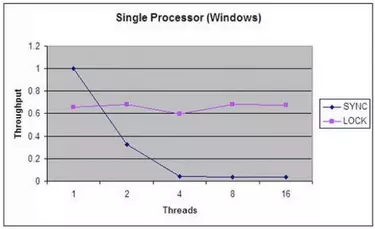

# 并发容器

- BlockingQueue

  阻塞队列。单向队列。

  BlockingQueue在队列的基础上添加了多线程协作的功能：

  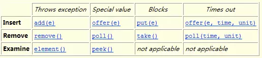

  除了传统的queue功能（表格左边的两列）之外，还提供了阻塞接口put和take，带超时功能的阻塞接口offer和poll。put会在队列满的时候阻塞，直到有空间时被唤醒；take在队　列空的时候阻塞，直到有东西拿的时候才被唤醒。用于生产者-消费者模型尤其好用，堪称神器。

  常见的阻塞队列有：

  - ArrayListBlockingQueue
  - LinkedListBlockingQueue
  - DelayQueue
  - SynchronousQueue

- ConcurrentHashMap

# Executor框架

- 线程的管理，用Executor框架

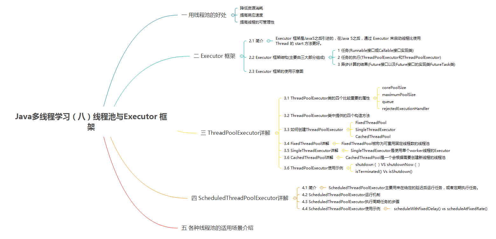

## executor框架成员关系：

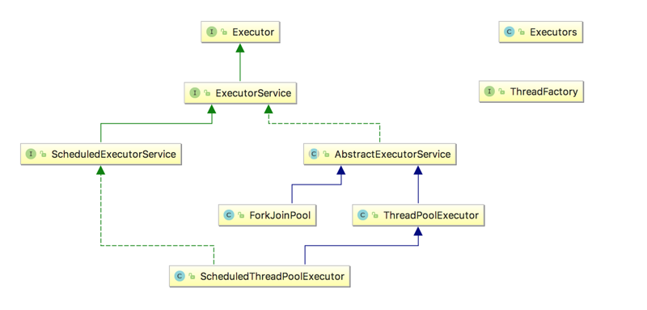

- 说明：
  - **Executor** 执行器接口，该接口定义执行Runnable任务的方式。
  - **ExecutorService** 该接口定义提供对Executor的服务。
  - **ScheduledExecutorService** 定时调度接口。
  - **AbstractExecutorService** 执行框架抽象类。
  - **ThreadPoolExecutor** JDK中线程池的具体实现。
  - **Executors** 线程池工厂类。

## executor框架使用示意图：

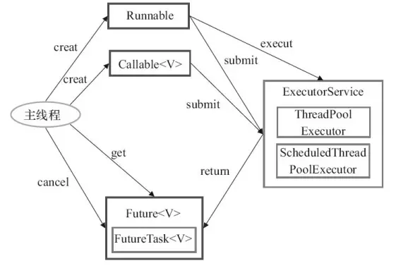

- 执行任务需要实现的**Runnable接口**或**Callable接口**。 **Runnable接口**或**Callable接口**实现类都可以被**ThreadPoolExecutor**或**ScheduledThreadPoolExecutor**执行。
- 使用步骤：
  - 主线程首先要创建实现`Runnable`或者`Callable`接口的任务对象。
    - 工具类Executors可以实现Runnable对象和Callable对象之间的相互转换。
    - `Runable`：无返回值；`Callable`：有返回值`Future`
  - 然后可以把创建完成的`Runnable`对象直接交给`ExecutorService`执行
    - ExecutorService.execute（Runnable command）
    - ExecutorService.submit（Runnable task）
    - ExecutorService.submit（Callable task）
  - 最后，主线程可以执行`FutureTask.get()`方法来等待任务执行完成。主线程也可以执行`FutureTask.cancel（boolean mayInterruptIfRunning）`来取消此任务的执行。

## 类成员

### Executors

- 线程池工厂

```java
public class Executors {

    public static ExecutorService newFixedThreadPool(int nThreads) {
        return new ThreadPoolExecutor(nThreads, nThreads,
                                      0L, TimeUnit.MILLISECONDS,
                                      new LinkedBlockingQueue<Runnable>());
    }

    public static ExecutorService newWorkStealingPool(int parallelism) {
        return new ForkJoinPool
            (parallelism,
             ForkJoinPool.defaultForkJoinWorkerThreadFactory,
             null, true);
    }

    //这个工厂方法是Java8引入的，返回一个ForkJoinPool类型的 executor，它的工作方法与其他常见的execuotr稍有不同。与使用一个固定大小的线程池不同，ForkJoinPools使用一个并行因子数来创建，默认值为主机CPU的可用核心数。
    public static ExecutorService newWorkStealingPool() {
        return new ForkJoinPool
            (Runtime.getRuntime().availableProcessors(),
             ForkJoinPool.defaultForkJoinWorkerThreadFactory,
             null, true);
    }

    public static ExecutorService newFixedThreadPool(int nThreads, ThreadFactory threadFactory) {
        return new ThreadPoolExecutor(nThreads, nThreads,
                                      0L, TimeUnit.MILLISECONDS,
                                      new LinkedBlockingQueue<Runnable>(),
                                      threadFactory);
    }

    /*
    * 单线程线程池
    */
    public static ExecutorService newSingleThreadExecutor() {
        return new FinalizableDelegatedExecutorService
            (new ThreadPoolExecutor(1, 1,
                                    0L, TimeUnit.MILLISECONDS,
                                    new LinkedBlockingQueue<Runnable>()));
    }

    public static ExecutorService newSingleThreadExecutor(ThreadFactory threadFactory) {
        return new FinalizableDelegatedExecutorService
            (new ThreadPoolExecutor(1, 1,
                                    0L, TimeUnit.MILLISECONDS,
                                    new LinkedBlockingQueue<Runnable>(),
                                    threadFactory));
    }

    //可变大小线程池，按照任务数来分配线程
    public static ExecutorService newCachedThreadPool() {
        return new ThreadPoolExecutor(0, Integer.MAX_VALUE,
                                      60L, TimeUnit.SECONDS,
                                      new SynchronousQueue<Runnable>());
    }

    public static ExecutorService newCachedThreadPool(ThreadFactory threadFactory) {
        return new ThreadPoolExecutor(0, Integer.MAX_VALUE,
                                      60L, TimeUnit.SECONDS,
                                      new SynchronousQueue<Runnable>(),
                                      threadFactory);
    }

    //适用于需要单个后台线程执行周期任务，同时保证顺序地执行各个任务的应用场景。
    public static ScheduledExecutorService newSingleThreadScheduledExecutor() {
        return new DelegatedScheduledExecutorService
            (new ScheduledThreadPoolExecutor(1));
    }

    public static ScheduledExecutorService newSingleThreadScheduledExecutor(ThreadFactory threadFactory) {
        return new DelegatedScheduledExecutorService
            (new ScheduledThreadPoolExecutor(1, threadFactory));
    }

    public static ScheduledExecutorService newScheduledThreadPool(int corePoolSize) {
        return new ScheduledThreadPoolExecutor(corePoolSize);
    }

    public static ScheduledExecutorService newScheduledThreadPool(
            int corePoolSize, ThreadFactory threadFactory) {
        return new ScheduledThreadPoolExecutor(corePoolSize, threadFactory);
    }
    
    ......
}
```

- Executors使用示例

```java
ExecutorService e = Executors.newCachedThreadPool();
    ExecutorService e = Executors.newSingleThreadExecutor();
    ExecutorService e = Executors.newFixedThreadPool(3);
    // 第一种是可变大小线程池，按照任务数来分配线程，
    // 第二种是单线程池，相当于FixedThreadPool(1)
    // 第三种是固定大小线程池。
    // 然后运行
    e.execute(new MyRunnableImpl());
```

#### FixedThreadPool详解

- 源代码中新创建的FixedThreadPool的corePoolSize和maximumPoolSize都被设置为nThreads。

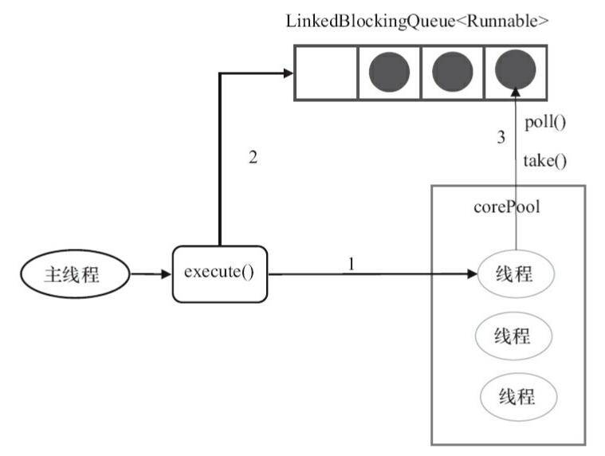

**上图说明：**

1. 如果当前运行的线程数小于corePoolSize，则创建新的线程来执行任务；
2. 当前运行的线程数等于corePoolSize后，将任务加入LinkedBlockingQueue；
3. 线程执行完1中的任务后，会在循环中反复从LinkedBlockingQueue中获取任务来执行；

**FixedThreadPool使用无界队列 LinkedBlockingQueue（队列的容量为Intger.MAX_VALUE）作为线程池的工作队列会对线程池带来如下影响：**

1. 当线程池中的线程数达到corePoolSize后，新任务将在无界队列中等待，因此线程池中的线程数不会超过corePoolSize；
2. 由于1，使用无界队列时maximumPoolSize将是一个无效参数；
3. 由于1和2，使用无界队列时keepAliveTime将是一个无效参数；
4. 运行中的FixedThreadPool（未执行shutdown()或shutdownNow()方法）不会拒绝任务

- 适用场景

  适用于为了满足资源管理需求，而需要限制当前线程数量的应用场景。它适用于负载比较重的服务器；


#### SingleThreadExecutor详解

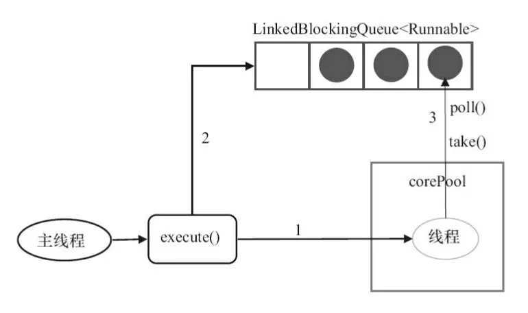

**上图说明;**

1. 如果当前运行的线程数少于corePoolSize，则创建一个新的线程执行任务；
2. 当前线程池中有一个运行的线程后，将任务加入LinkedBlockingQueue
3. 线程执行完1中的任务后，会在循环中反复从LinkedBlockingQueue中获取任务来执行

- 适用场景

  适用于需要保证顺序地执行各个任务并且在任意时间点，不会有多个线程是活动的应用场景。

#### CachedThreadPool详解

- CachedThreadPool的corePoolSize被设置为空（0），maximumPoolSize被设置为Integer.MAX.VALUE，即它是无界的，这也就意味着如果主线程提交任务的速度高于maximumPool中线程处理任务的速度时，CachedThreadPool会不断创建新的线程。极端情况下，这样会导致耗尽cpu和内存资源。

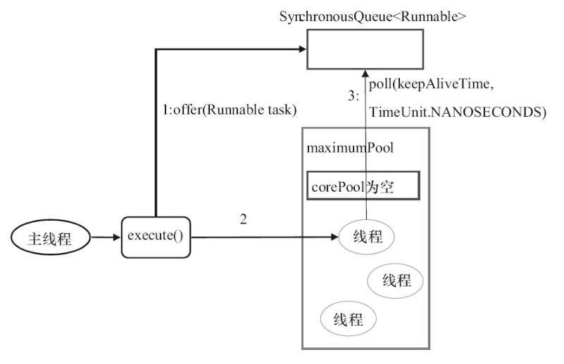

**上图说明：**

1. 首先执行SynchronousQueue.offer(Runnable task)。如果当前maximumPool中有闲线程正在执行SynchronousQueue.poll(keepAliveTime,TimeUnit.NANOSECONDS)，那么主线程执行offer操作与空闲线程执行的poll操作配对成功，主线程把任务交给空闲线程执行，execute()方法执行完成，否则执行下面的步骤2；
2. 当初始maximumPool为空，或者maximumPool中没有空闲线程时，将没有线程执行SynchronousQueue.poll(keepAliveTime,TimeUnit.NANOSECONDS)。这种情况下，步骤1将失败，此时CachedThreadPool会创建新线程执行任务，execute方法执行完成；

- 适用场景

  适用于执行很多的短期异步任务的小程序，或者是负载较轻的服务器；


```java
/**
* Runable接口交给ExecutorService接口执行
*/
ExecutorService executor = Executors.newSingleThreadExecutor();
	executor.submit(() -> {
	String threadName = Thread.currentThread().getName();
	System.out.println("Hello " + threadName);
});

//注意：
//	Executors必须显式的停止-否则它们将持续监听新的任务。
//	ExecutorService提供了两个方法来达到这个目的——shutdwon()会等待正在执行的任务执行完而shutdownNow()会终止所有正在执行的任务并立即关闭execuotr。

try {
    System.out.println("attempt to shutdown executor");
    executor.shutdown();
    executor.awaitTermination(5, TimeUnit.SECONDS);
    }
catch (InterruptedException e) {
    System.err.println("tasks interrupted");
}
finally {
    if (!executor.isTerminated()) {
        System.err.println("cancel non-finished tasks");
    }
    executor.shutdownNow();
    System.out.println("shutdown finished");
}
```

```java
/**
*Callable接口交给ExecutorService接口执行
*/
Callable<Integer> task = () -> {
    try {
        TimeUnit.SECONDS.sleep(1);
        return 123;
    }
    catch (InterruptedException e) {
        throw new IllegalStateException("task interrupted", e);
    }
};


ExecutorService executor = Executors.newFixedThreadPool(1);
Future<Integer> future = executor.submit(task);

System.out.println("future done? " + future.isDone());

Integer result = future.get();
//future.get(1, TimeUnit.SECONDS);

System.out.println("future done? " + future.isDone());
System.out.print("result: " + result);
```

- Future与底层的executor service紧密的结合在一起。记住，如果你关闭executor，所有的未中止的future都会抛出异常。

### Executor

```java
public interface Executor {

    void execute(Runnable command);
}
```

### Future

```java
public interface Future<V> {
    
    //取消任务，成功返回true，失败返回false。
    //参数mayInterruptIfRunning表示是否取消正在执行但是没有执行完成的任务，true可以取消，false不取消
    //结果：
    //	如果任务已经完成，无论参数是true或false，都返回false
	//	如果任务正在执行，若参数为true，返回true；若参数为false，返回false；
	//	如果任务还未执行，无论参数是true或false，都返回true。
    boolean cancel(boolean mayInterruptIfRunning);
    
    //任务是否被取消成功。
    boolean isCancelled();
    
    //任务是否已经完成。
    boolean isDone();
    
    //用来获取执行结果，会一直阻塞等到任务执行完成之后返回。
    V get();
    
    //用来获取执行结果，指定时间内获取不到结果，返回null
    V get(long timeout, TimeUnit unit);
    
}
```

### FutureTask

- 是Future接口的唯一实现。
- 一种可以取消的异步的计算任务。
- 它的计算是通过Callable实现的，它等价于可以携带结果的Runnable，并且有三个状态：等待、运行和完成。

```java
public class FutureTask<V> implements RunnableFuture<V> {
    
    public FutureTask(Callable<V> callable);
    
    public FutureTask(Runnable runnable, V result);
    
    public boolean isCancelled();

    public boolean isDone();

    public boolean cancel(boolean mayInterruptIfRunning);
    
    public V get();
    
    public V get(long timeout, TimeUnit unit);
    
    public void run();
```


### ExecutorService

- 源码

```java
public interface ExecutorService extends Executor {

    //关闭已在Executor上调用，因此不会再向DelayedPool添加任何其他任务。但是，已经在队列中提交的任务将被允许完成。
    void shutdown();

    //试图终止当前正在运行的任务，并停止处理排队的任务并返回正在等待执行的List。
    List<Runnable> shutdownNow();

    boolean isShutdown();

    boolean isTerminated();

    boolean awaitTermination(long timeout, TimeUnit unit);

    <T> Future<T> submit(Callable<T> task);

    <T> Future<T> submit(Runnable task, T result);

    Future<?> submit(Runnable task);

    //一次批量提交多个callable。这个方法结果一个callable的集合，然后返回一个future的列表。
    <T> List<Future<T>> invokeAll(Collection<? extends Callable<T>> tasks);

    <T> List<Future<T>> invokeAll(Collection<? extends Callable<T>> tasks,
                                  long timeout, TimeUnit unit);

    //它的工作方式与invokeAll()稍有不同。在等待future对象的过程中，这个方法将会阻塞直到第一个callable中止然后返回这一个callable的结果。
    <T> T invokeAny(Collection<? extends Callable<T>> tasks);

    <T> T invokeAny(Collection<? extends Callable<T>> tasks,
                    long timeout, TimeUnit unit);
}
```

- 使用示例

```java
//批量提交-->invokeAll
ExecutorService executor = Executors.newWorkStealingPool();

List<Callable<String>> callables = Arrays.asList(
        () -> "task1",
        () -> "task2",
        () -> "task3");

executor.invokeAll(callables)
    .stream()
    .map(future -> {
        try {
            return future.get();
        }
        catch (Exception e) {
            throw new IllegalStateException(e);
        }
    })
    .forEach(System.out::println);
```

```java
//批量提交callable --> invokeAny()

Callable<String> callable(String result, long sleepSeconds) {
    return () -> {
        TimeUnit.SECONDS.sleep(sleepSeconds);
        return result;
    };
}

ExecutorService executor = Executors.newWorkStealingPool();

List<Callable<String>> callables = Arrays.asList(
callable("task1", 2),
callable("task2", 1),
callable("task3", 3));

String result = executor.invokeAny(callables);
System.out.println(result);

// => task2
```


### ScheduledExecutorService

调度线程池，支持任务调度，持续执行或者延迟一段时间后执行。

```java
public interface ScheduledExecutorService extends ExecutorService {

    public ScheduledFuture<?> schedule(Runnable command,
                                       long delay, TimeUnit unit);

    public <V> ScheduledFuture<V> schedule(Callable<V> callable,
                                           long delay, TimeUnit unit);

    /**
     * @param command the task to execute
     * @param initialDelay the time to delay first execution
     * @param period the period between successive executions
     * @param unit the time unit of the initialDelay and period parameters
    */
    //以固定频率来执行一个任务
    //这个方法还接收一个初始化延迟，用来指定这个任务首次被执行等待的时长。
    public ScheduledFuture<?> scheduleAtFixedRate(Runnable command,
                                                  long initialDelay,
                                                  long period,
                                                  TimeUnit unit);

    //scheduleWithFixedDelay()在你不能预测调度任务的执行时长时是很有用的。
    //等待时间 period 的应用是在一次任务的结束和下一个任务的开始之间。
    public ScheduledFuture<?> scheduleWithFixedDelay(Runnable command,
                                                     long initialDelay,
                                                     long delay,
                                                     TimeUnit unit);

}
```

```java
public interface ScheduledFuture<V> extends Delayed, Future<V> {
}

public interface Delayed extends Comparable<Delayed> {

    long getDelay(TimeUnit unit);//获得剩余的延迟
}

```


- 使用示例

```java
ScheduledExecutorService executor = Executors.newScheduledThreadPool(1);

Runnable task = () -> System.out.println("Scheduling: " + System.nanoTime());
ScheduledFuture<?> future = executor.schedule(task, 3, TimeUnit.SECONDS);

TimeUnit.MILLISECONDS.sleep(1337);

long remainingDelay = future.getDelay(TimeUnit.MILLISECONDS);
System.out.printf("Remaining Delay: %sms", remainingDelay);
```

- scheduleAtFixedRate()使用

```java
//每分钟一次
ScheduledExecutorService executor = Executors.newScheduledThreadPool(1);

Runnable task = () -> System.out.println("Scheduling: " + System.nanoTime());

int initialDelay = 0;//这个方法还接收一个初始化延迟，用来指定这个任务首次被执行等待的时长。

int period = 1;
executor.scheduleAtFixedRate(task, initialDelay, period, TimeUnit.SECONDS);
```

注意：`scheduleAtFixedRate()`并不考虑任务的实际用时。

- scheduleWithFixedDelay()使用

```java
ScheduledExecutorService executor = Executors.newScheduledThreadPool(1);

Runnable task = () -> {
    try {
        TimeUnit.SECONDS.sleep(2);
        System.out.println("Scheduling: " + System.nanoTime());
    }
    catch (InterruptedException e) {
        System.err.println("task interrupted");
    }
};

executor.scheduleWithFixedDelay(task, 0, 1, TimeUnit.SECONDS);

//这个例子调度了一个任务，并在一次执行的结束和下一次执行的开始之间设置了一个1分钟的固定延迟。初始化延迟为0，任务执行时间为0。
```


### ThreadPoolExecutor

```java
public class ThreadPoolExecutor extends AbstractExecutorService {
    /**
    corePoolSize:池内线程初始值与最小值，就算是空闲状态，也会保持该数量线程。
    maximumPoolSize:线程最大值，线程的增长始终不会超过该值。
    keepAliveTime：当池内线程数高于corePoolSize时，经过多少时间多余的空闲线程才会被回收。回收前处于wait状态
    unit：
    时间单位，可以使用TimeUnit的实例，如TimeUnit.MILLISECONDS　
    workQueue:待入任务（Runnable）的等待场所，该参数主要影响调度策略，如公平与否，是否产生饿死(starving)
    threadFactory:线程工厂类，有默认实现，如果有自定义的需要则需要自己实现ThreadFactory接口并作为参数传入。
    */
    public ThreadPoolExecutor(int corePoolSize,
                                  int maximumPoolSize,
                                  long keepAliveTime,
                                  TimeUnit unit,
                                  BlockingQueue<Runnable> workQueue);

    /**
     * 用给定的初始参数创建一个新的ThreadPoolExecutor。

     * @param keepAliveTime 当线程池中的线程数量大于corePoolSize的时候，如果这时没有新的任务提交，
     *核心线程外的线程不会立即销毁，而是会等待，直到等待的时间超过了keepAliveTime；
     * @param unit  keepAliveTime参数的时间单位
     * @param workQueue 等待队列，当任务提交时，如果线程池中的线程数量大于等于corePoolSize的时候，把该任务封装成一个Worker对象放入等待队列；
     * 
     * @param threadFactory 执行者创建新线程时使用的工厂
     * @param handler RejectedExecutionHandler类型的变量，表示线程池的饱和策略。
     * 如果阻塞队列满了并且没有空闲的线程，这时如果继续提交任务，就需要采取一种策略处理该任务。
     * 线程池提供了4种策略：
        1.AbortPolicy：直接抛出异常，这是默认策略；
        2.CallerRunsPolicy：用调用者所在的线程来执行任务；
        3.DiscardOldestPolicy：丢弃阻塞队列中靠最前的任务，并执行当前任务；
        4.DiscardPolicy：直接丢弃任务；
     */
    public ThreadPoolExecutor(int corePoolSize,
                              int maximumPoolSize,
                              long keepAliveTime,
                              TimeUnit unit,
                              BlockingQueue<Runnable> workQueue,
                              ThreadFactory threadFactory,
                              RejectedExecutionHandler handler);
    
    public void execute(Runnable command);

    //关闭当前服务，当调用此方法时，它将不再接受新的任务，已经提交的任务，还要继续执行完毕。
    public void shutdown();
    
    //关闭当前服务，尚未执行的任务，不再执行；正在执行的任务，通过线程中断thread.interrupt。方法返回等待执行的任务列表。
    public List<Runnable> shutdownNow();
    
    //程序是否已经关闭。
    public boolean isShutdown();
    
    //如果关闭后所有任务都已完成，则返回 true。
    public boolean isTerminating();
    
    //程序是否已经终止。已经关闭并且所有的任务都执行完成，返回true，其他返回false。
    public boolean isTerminated();
    
    //请求关闭、发生超时或者当前线程中断，无论哪一个首先发生之后，都将导致阻塞，直到所有任务完成执行。如果程序终止，返回true，如果超时，返回false，等待时发生中断，抛出异常。
    public boolean awaitTermination(long timeout, TimeUnit unit);
    
    public boolean prestartCoreThread();
    
    public int prestartAllCoreThreads();
    
    public boolean allowsCoreThreadTimeOut();
    
    public void allowCoreThreadTimeOut(boolean value);
    
    public boolean remove(Runnable task);
    
    //Tries to remove from the work queue all
    public void purge();
    
    public int getActiveCount();
    
    public int getLargestPoolSize();
    
    public long getTaskCount();
    
    public long getCompletedTaskCount();
}
```

- `ThreadPoolExecutor`的创建

  - 1.构造方法(官方不推荐)

  - 2.`Executors`工具类

### ScheduledThreadPoolExecutor

- 一个可定时调度任务的**线程池**

- 适用场景

   适用于需要多个后台执行周期任务，同时为了满足资源管理需求而需要限制后台线程的数量的应用场景

- 主要用来在给定的延迟后运行任务，或者定期执行任务。

- 实现：

  ScheduledThreadPoolExecutor使用的任务队列DelayQueue封装了一个PriorityQueue，PriorityQueue会对队列中的任务进行排序，执行所需时间短的放在前面先被执行(ScheduledFutureTask的time变量小的先执行)，如果执行所需时间相同则先提交的任务将被先执行(ScheduledFutureTask的squenceNumber变量小的先执行)。

- ScheduledThreadPoolExecutor和Timer的比较：

  - Timer对系统时钟的变化敏感，ScheduledThreadPoolExecutor不是；

  - Timer只有一个执行线程，因此长时间运行的任务可以延迟其他任务。 ScheduledThreadPoolExecutor可以配置任意数量的线程。 此外，如果你想（通过提供ThreadFactory），你可以完全控制创建的线程;

  - 在TimerTask中抛出的运行时异常会杀死一个线程，从而导致Timer死机:-( ...即计划任务将不再运行。ScheduledThreadExecutor不仅捕获运行时异常，还允许您在需要时处理它们（通过重写afterExecute方法 ThreadPoolExecutor）。抛出异常的任务将被取消，但其他任务将继续运行。

- **综上，在JDK1.5之后，你没有理由再使用Timer进行任务调度了。**

> **备注：** Quartz是一个由java编写的任务调度库，由OpenSymphony组织开源出来。在实际项目开发中使用Quartz的还是居多，比较推荐使用Quartz。因为Quartz理论上能够同时对上万个任务进行调度，拥有丰富的功能特性，包括任务调度、任务持久化、可集群化、插件等等。

- ScheduledThreadPoolExecutor运行机制

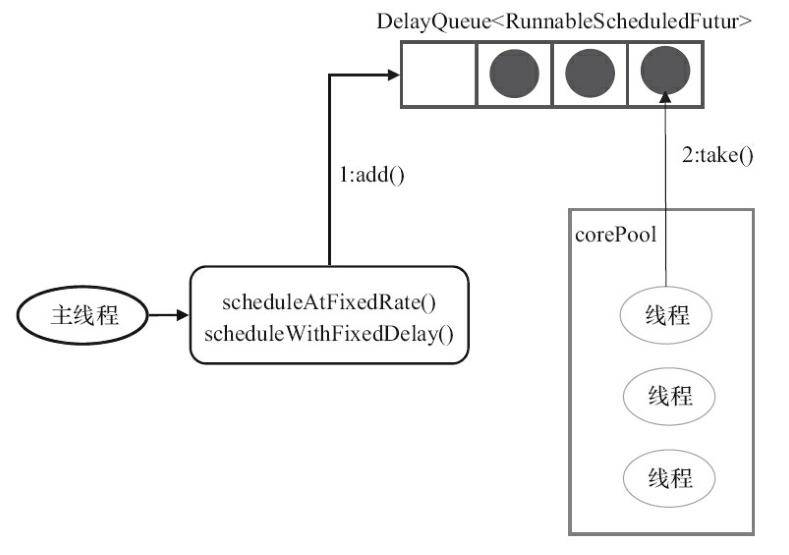

- ScheduledThreadPoolExecutor执行周期任务的步骤

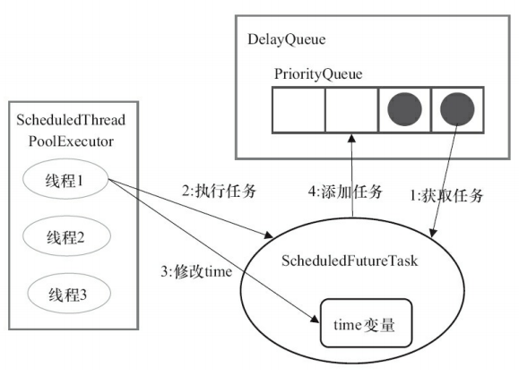

> 1.线程1从DelayQueue中获取已到期的ScheduledFutureTask（DelayQueue.take()）。到期任务是指ScheduledFutureTask的time大于等于当前系统的时间；
>
> 2.线程1执行这个ScheduledFutureTask；
>
> 3.线程1修改ScheduledFutureTask的time变量为下次将要被执行的时间；
>
> 4.线程1把这个修改time之后的ScheduledFutureTask放回DelayQueue中（DelayQueue.add())。


```java
public class ScheduledThreadPoolExecutor
        extends ThreadPoolExecutor
        implements ScheduledExecutorService {

	public ScheduledThreadPoolExecutor(int corePoolSize) {
    	    super(corePoolSize, Integer.MAX_VALUE, 0, NANOSECONDS,
        	      new DelayedWorkQueue());
    }
    
    public ScheduledThreadPoolExecutor(int corePoolSize,
                                       ThreadFactory threadFactory);
                                       
    public ScheduledThreadPoolExecutor(int corePoolSize,
                                       RejectedExecutionHandler handler);

	public ScheduledThreadPoolExecutor(int corePoolSize,
                                       ThreadFactory threadFactory,
                                       RejectedExecutionHandler handler);
                                       
    public ScheduledFuture<?> schedule(Runnable command,
                                       long delay,
                                       TimeUnit unit);
                                       
    public <V> ScheduledFuture<V> schedule(Callable<V> callable,
                                           long delay,
                                           TimeUnit unit);
    
    //将延迟视为两个任务开始之间的差异（即定期调用） 
    public ScheduledFuture<?> scheduleAtFixedRate(Runnable command,
                                                  long initialDelay,
                                                  long period,
                                                  TimeUnit unit);
    
    //将延迟视为一个任务结束与下一个任务开始之间的差异
    public ScheduledFuture<?> scheduleWithFixedDelay(Runnable command,
                                                     long initialDelay,
                                                     long delay,
                                                     TimeUnit unit);
    
    public void execute(Runnable command);
    
    public Future<?> submit(Runnable task);
    
    public <T> Future<T> submit(Runnable task, T result);
    
    public <T> Future<T> submit(Callable<T> task);
    
    public void shutdown();
    
    public List<Runnable> shutdownNow();
    
}
```

- 使用示例

```java
/**
 * 使用ScheduledExecutorService和ScheduledThreadPoolExecutor实现的java调度程序示例程序。
 */
public class ScheduledThreadPoolDemo {

    public static void main(String[] args) throws InterruptedException {

        //创建一个ScheduledThreadPoolExecutor对象
        ScheduledExecutorService scheduledThreadPool = Executors.newScheduledThreadPool(5);
        //计划在某段时间后运行
        System.out.println("Current Time = "+new Date());
        for(int i=0; i<3; i++){
            Thread.sleep(1000);
            WorkerThread worker = new WorkerThread("do heavy processing");
            //创建并执行在给定延迟后启用的单次操作。 
            scheduledThreadPool.schedule(worker, 10, TimeUnit.SECONDS);
        }

        //添加一些延迟让调度程序产生一些线程
        Thread.sleep(30000);
        System.out.println("Current Time = "+new Date());
        //关闭线程池
        scheduledThreadPool.shutdown();
        while(!scheduledThreadPool.isTerminated()){
            //等待所有任务完成
        }
        System.out.println("Finished all threads");
    }

}
```

### CompletionService

- 我们可以通过线程池的submit方法提交一个Callable任务，利用返回的Future的get方法来获取任务运行的结果，但是这种方法需要自己循环获取task，而且get方法会阻塞。
- 还可以用CompletionService来实现，CompletionService维护一个保存Future对象的BlockQueue，当Future对象状态是结束的时候，会加入到队列中，可以通过take方法，取出Future对象。

```java
public interface CompletionService<V> {
    
    Future<V> submit(Callable<V> task);
    
    Future<V> submit(Runnable task, V result);

    //获取任务结果。获取并移除表示下一个已完成任务的Future，如果任务不存在，则等待。
    Future<V> take();
    
    //获取任务结果。获取并移除表示下一个已完成任务的Future，如果不存在，则返回null。
    Future<V> poll();
    
    Future<V> poll(long timeout, TimeUnit unit);
}
```

### ExecutorCompletionService

- CompletionService的实现类，实现了上述方法