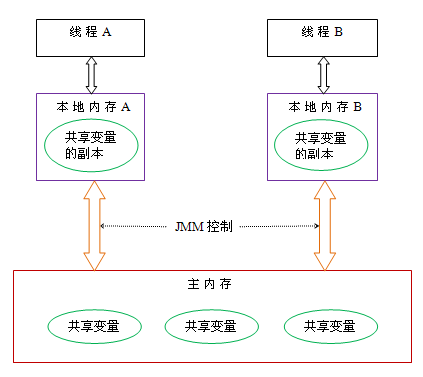
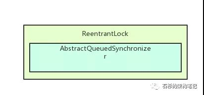
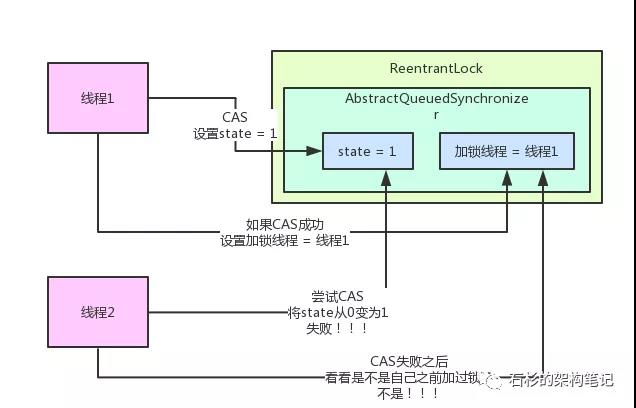
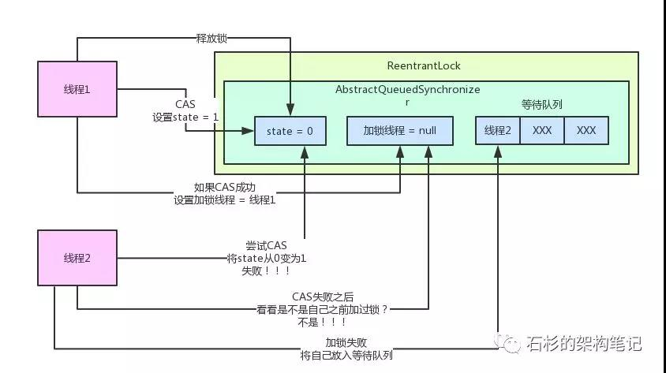
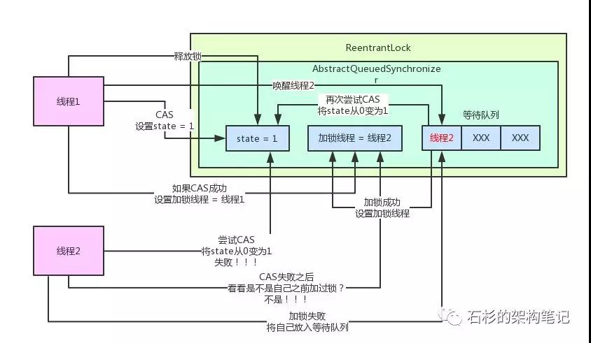

[TOC]


# Java内存区域


方法区（Method Area）：

```tex
方法区属于线程共享的内存区域，又称Non-Heap（非堆），
主要用于存储已被虚拟机加载的类信息、常量、静态变量、即时编译器编译后的代码等数据，
根据Java 虚拟机规范的规定，当方法区无法满足内存分配需求时，将抛出OutOfMemoryError 异常。
值得注意的是在方法区中存在一个叫运行时常量池(Runtime Constant Pool）的区域，它主要用于存放编译器生成的各种字面量和符号引用，这些内容将在类加载后存放到运行时常量池中，以便后续使用。
```


JVM堆（Java Heap）：

```tex
Java 堆也是属于线程共享的内存区域，它在虚拟机启动时创建，是Java 虚拟机所管理的内存中最大的一块，主要用于存放对象实例，几乎所有的对象实例都在这里分配内存，
注意Java 堆是垃圾收集器管理的主要区域，因此很多时候也被称做GC 堆，如果在堆中没有内存完成实例分配，并且堆也无法再扩展时，将会抛出OutOfMemoryError 异常。
```


程序计数器(Program Counter Register)：

```tex
属于线程私有的数据区域，是一小块内存空间，主要代表当前线程所执行的字节码行号指示器。字节码解释器工作时，通过改变这个计数器的值来选取下一条需要执行的字节码指令，分支、循环、跳转、异常处理、线程恢复等基础功能都需要依赖这个计数器来完成。
```


虚拟机栈(Java Virtual Machine Stacks)：

```tex
属于线程私有的数据区域，与线程同时创建，总数与线程关联，代表Java方法执行的内存模型。
每个方法执行时都会创建一个栈桢来存储方法的的变量表、操作数栈、动态链接方法、返回值、返回地址等信息。
每个方法从调用直结束就对于一个栈桢在虚拟机栈中的入栈和出栈过程，如下（图有误，应该为栈桢）：
```


本地方法栈(Native Method Stacks)：

```tex
本地方法栈属于线程私有的数据区域，这部分主要与虚拟机用到的 Native 方法相关
```


# java内存模型(JMM)

```properties
- 并发 并行
- 同步 异步
- 阻塞 非阻塞
- 原子性、可见性、有序性
- 可重入，可重入/不可重入是什么意思
```


## 1.概念

- JVM 中试图定义一种 JMM 来屏蔽各种硬件和操作系统的内存访问差异，以实现让 Java 程序在各种平台下都能达到一致的内存访问效果。

- JMM定义了**Java 虚拟机(JVM)在计算机内存(RAM)中的工作方式**。

- JMM 的主要目标是定义程序中各个变量的访问规则，即在虚拟机中将变量存储到内存和从内存中取出变量这样的底层细节。(此处的变量与 Java 编程中的变量有所区别，它包括了实例字段、静态字段和构成数组对象的元素，但不包括局部变量与方法参数，因为后者是线程私有的，不会被共享，自然就不会存在竞争问题。)

- JMM 是围绕着在并发过程中如何处理**原子性、可见性和有序性**这 3 个特征来建立的。





JMM定义了**线程和主内存之间的抽象关系**：线程之间的共享变量存储在主内存（main memory）中，每个线程都有一个私有的本地内存（local memory），本地内存中存储了该线程以读/写共享变量的副本。


## 2.JVM对JMM的实现

- 在JVM内部，Java内存模型把内存分成了两部分：线程栈区和堆区


- JVM中运行的每个线程都拥有自己的线程栈，线程栈包含了当前线程执行的方法调用相关信息，我们也把它称作调用栈。随着代码的不断执行，调用栈会不断变化。
- 线程栈还包含了当前方法的所有本地变量信息。一个线程只能读取自己的线程栈，
- 所有原始类型(boolean,byte,short,char,int,long,float,double)的本地变量都直接保存在线程栈当中，对于它们的值各个线程之间都是独立的。
- 堆区包含了Java应用创建的所有对象信息，不管对象是哪个线程创建的，其中的对象包括原始类型的封装类（如Byte、Integer、Long等等）。


- 一个本地变量如果是原始类型，那么它会被完全存储到栈区。
- 一个本地变量也有可能是一个对象的引用，这种情况下，这个本地引用会被存储到栈中，但是对象本身仍然存储在堆区。


- 对于一个对象的成员方法，这些方法中包含本地变量，仍需要存储在栈区，即使它们所属的对象在堆区。
- 对于一个对象的成员变量，不管它是原始类型还是包装类型，都会被存储到堆区。


- 堆中的对象可以被多线程共享。如果一个线程获得一个对象的引用，它便可访问这个对象的成员变量。如果两个线程同时调用了同一个对象的同一个方法，那么这两个线程便可同时访问这个对象的成员变量，但是对于本地变量，每个线程都会拷贝一份到自己的线程栈中。


### 硬件内存架构


### Java内存模型和硬件架构之间的桥接

- Java内存模型和硬件内存架构并不一致。硬件内存架构中并没有区分栈和堆，从硬件上看，不管是栈还是堆，大部分数据都会存到主存中，当然一部分栈和堆的数据也有可能会存到CPU寄存器中，如下图所示，Java内存模型和计算机硬件内存架构是一个交叉关系：


- 当对象和变量存储到计算机的各个内存区域时，必然会面临一些问题，其中最主要的两个问题是：

> 1. 共享对象对各个线程的可见性
> 2. 共享对象的竞争现象


#### 共享对象的可见性

- 当多个线程同时操作同一个共享对象时，如果没有合理的使用volatile和synchronization关键字，一个线程对共享对象的更新有可能导致其它线程不可见。


- 要解决共享对象可见性这个问题，我们可以使用`volatile`关键字。volatile 关键字可以保证变量会直接从主存读取，而对变量的更新也会直接写到主存。（总线锁，缓存锁）


#### 竞争现象


- 如果多个线程共享一个对象，如果它们同时修改这个共享对象，这就产生了竞争现象。

如下图所示，线程A和线程B共享一个对象obj。假设线程A从主存读取Obj.count变量到自己的CPU缓存，同时，线程B也读取了Obj.count变量到它的CPU缓存，并且这两个线程都对Obj.count做了加1操作。此时，Obj.count加1操作被执行了两次，不过都在不同的CPU缓存中。

如果这两个加1操作是串行执行的，那么Obj.count变量便会在原始值上加2，最终主存中的Obj.count的值会是3。然而下图中两个加1操作是并行的，不管是线程A还是线程B先flush计算结果到主存，最终主存中的Obj.count只会增加1次变成2，尽管一共有两次加1操作。


- 要解决上面的问题我们可以使用`synchronized`代码块。`synchronized`代码块可以保证同一个时刻只能有一个线程进入代码竞争区，`synchronized`代码块也能保证代码块中所有变量都将会从主存中读，当线程退出代码块时，对所有变量的更新将会flush到主存，不管这些变量是不是`volatile`类型的。
  


# java中的锁


[https://tech.meituan.com/2018/11/15/java-lock.html](https://tech.meituan.com/2018/11/15/java-lock.html)


> 说到了锁我们经常会联想到生活中的锁，在我们日常中我们经常会接触到锁。比如我们的手机锁，电脑锁，再比如我们生活中的门锁，这些都是锁。
>
> 说了这么多还是不清楚锁到底有什么用处？这一点就要深思我们为什么要使用锁，我们用手机锁是为了保障我们的隐私安全，使用门锁是为了保障我们的财产安全，准确的来说我们使用锁就是为了安全。那么在生活中我们可以加锁来保障自己的隐私和财产安全，那Java中的锁有什么用处呢？


- Java中的锁准确的来说也是为了保证安全，不过不同的是Java中的锁是为了保证并发所需要的。所以在Java中加锁准确的来说是为了**保证并发安全**，同时也是为了**解决内存中的一致性，原子性，有序性三种问题**。在Java中提供了各式各样的锁，每种锁都有其自身的特点和适用范围。所以我们都要熟悉锁的区别和原理才能正确的使用。


## 乐观锁和悲观锁


### 悲观锁

- 悲观锁如其名它是悲观的，它觉得每次访问数据都可能被其他人(线程)修改，所以在访问资源的时候就会对资源进行加锁，用这种方式来保证资源在访问的时候不会被其他线程修改。这样的话其他线程想要获取资源的话就只能阻塞，等到当前线程释放锁后在获取。在Java中悲观锁的实现有`synchronized关键字`和`Lock`的实现类都是悲观锁。我们来看一下悲观锁到底是怎么执行的。


线程A抢占到资源后线程B就陷入了阻塞中,然后就等待线程A释放资源。


当线程A释放完资源后线程B就去获取锁开始操作资源˛悲观锁保证了资源同时只能一个线程进行操作。


### 乐观锁

与悲观锁相反，乐观锁并不会觉得访问数据的时候会有人修改(所以它是乐观的)，所以在访问资源的时候并不会上锁，但是在提交的时候回去判断一下是否有人修改了当前数据，在数据库中我们可以使用`version`版本号去实现。在Java中我们是使用CSA来实现。我们看一下乐观锁的执行过程


### 使用悲观锁和乐观锁

```java
//悲观锁
public synchronized void testMethod(){
    //do something
}

//乐观锁
private AtomicLong value = new AtomicLong();
```

可以使用synchronized关键字来实现悲观锁，乐观锁可以使用并法包下提供的原子类。


## 公平锁和非公平锁

- 公平锁如其名讲究的是一个公平，所以多个线程同时申请申请锁的话，线程会放入一个队列中，在队列中第一个进入队列的线程才能获取锁资源，讲究的是先到先得。

- 非公平锁先到不一定先得

不过公平锁也是有缺点的，当一个线程获取资源后在队列中的其他的线程就只能在阻塞，CPU的所以公平锁比非公平锁的效率要低很多。因为*CPU唤醒阻塞线程的开销比非公平锁大*。


在Java中ReentrantLock提供了公平锁和非公平锁的实现。看一下ReentrantLock怎么实现公平锁和非公平锁

```java
//公平锁
private ReentrantLock fairLock = new ReentrantLock(true);

//非公平锁
private ReentrantLock fairLock = new ReentrantLock(false);

//默认是非公平锁
private ReentrantLock fairLock = new ReentrantLock();
```

### 使用

ReentrantLock默认就是非公平的锁，我们来看一下公平锁的例子：


看一下输出结果：


我们可以看到公平锁的输出结果是按照顺序来的，先到先得。


在看一下非公平锁的例子：


输出结果：


我们可以看到如果使用非公平锁的话最后输出的结果是完全没有顺序的，先到不一定先得。


所以在使用公平锁的时候线程1获取到锁之后线程2在请求锁的话就会挂起等待线程1释放锁，然后线程2才能获取锁。如果再有一个线程3想要请求锁的话，这时候如果使用的是非公平锁，那么线程2和线程3中两个有一个会获取到锁，公平锁的情况下线程3只能先挂起，等待线程2获取锁资源释放后在获取。


### 公平锁与非公平锁效率差异原因

在需要公平资源的场景下使用公平锁，如果不需要特殊的公平对待的话尽量使用非公平锁，因为公平锁会带来性能的开销。

公平锁要维护一个队列，后来的线程要加锁，即使锁空闲，也要先检查有没有其他线程在 wait，如果有自己要挂起，加到队列后面，然后唤醒队列最前面的线程。这种情况下相比较非公平锁多了一次挂起和唤醒

**线程切换的开销**，其实就是非公平锁效率高于公平锁的原因，因为**非公平锁减少了线程挂起的几率**，后来的线程有一定几率逃离被挂起的开销。


## 独占锁和共享锁

看到独占和共享会联想到什么，对的独占锁就是每次只有一个线程能霸占这个锁资源，而其他线程就只能等待当前获取锁资源的线程释放锁才能再次获取锁，刚刚上面的**ReentrantLock就是独占锁**，那这样看来独占锁不也就是悲观锁吗？因为悲观锁抢占资源后就只能等待释放其他线程才能再次获取到锁资源。其实准确的说<font color="00dd00">独占锁也是悲观锁</font>。

在谈共享锁，共享锁其实也是乐观锁它放宽了锁的策略，<u>允许多个线程同时获取锁</u>。在**并发包中ReadWriteLock就是一个典型的共享锁**。它允许一个资源可以被多个读操作访问，或者被一个 写操作访问，但两者不能同时进行。


## 自旋锁

自旋锁其实就是当一个线程获取锁的时候，这个锁已经被其他人获取到了那么这个线程不会立马挂起，反而在不放弃CPU使用权的情况下会尝试再次获取锁资源，默认次数是10次，可以使用`-XX: PreBlockSpinsh`来设置次数。

如果自旋锁获取锁的时间太长，会造成后面的线程CPU资源耗尽释放。并且自旋锁是不公平的。


**优点：**自旋锁<u>不会使线程状态发生切换</u>，一直处于用户态，即线程一直都是active的；不会使线程进入阻塞状态，减少了不必要的上下文切换，执行速度快。


## 可重入锁


### 什么是重入锁

- `java.util.concurrent.locks.ReentrantLock`

这个是 JDK @since 1.5 添加的一种颗粒度更小的锁，它完全可以替代 synchronized 关键字来实现它的所有功能，而且 ReentrantLock 锁的灵活度要远远大于 synchronized 关键字。


从类结构图看出，ReentrantLock 实现了 Lock 接口，ReentrantLock 只是 Lock 接口的一个实现而已。


### 为什么叫重入锁呢

`ReentrantLock`：Re-Entrant-Lock：即表示**可重新反复进入的锁，但仅限于当前线程**；

```java
public void m() {
    lock.lock();
    lock.lock();
    try {
      // ... method body
    } finally {
      lock.unlock()
      lock.unlock()
    }
}
```

如示例代码所示，当前线程可以反复加锁，但也需要释放同样加锁次数的锁，即重入了多少次，就要释放多少次，不然也会导入锁不被释放。


### 重入锁最重要的几个方法


这几个方法都是 Lock 接口中定义的：


**1）lock()**

获取锁，有以下三种情况：

- 锁空闲：直接获取锁并返回，同时设置锁持有者数量为：1；
- 当前线程持有锁：直接获取锁并返回，同时锁持有者数量递增1；
- 其他线程持有锁：当前线程会休眠等待，直至获取锁为止；

**2）lockInterruptibly()**

获取锁，逻辑和 lock() 方法一样，但这个方法在获取锁过程中能响应中断。

**3）tryLock()**

从关键字字面理解，这是在尝试获取锁，获取成功返回：true，获取失败返回：false, 这个方法不会等待，有以下三种情况：

- 锁空闲：直接获取锁并返回：true，同时设置锁持有者数量为：1；
- 当前线程持有锁：直接获取锁并返回：true，同时锁持有者数量递增1；
- 其他线程持有锁：获取锁失败，返回：false；

**4）tryLock(long timeout, TimeUnit unit)**

逻辑和 tryLock() 差不多，只是这个方法是带时间的。

**5）unlock()**

释放锁，每次锁持有者数量递减 1，直到 0 为止。所以，现在知道为什么 lock 多少次，就要对应 unlock 多少次了吧。

**6）newCondition**

返回一个这个锁的 Condition 实例，可以实现 synchronized 关键字类似 wait/ notify 实现多线程通信的功能，不过这个比 wait/ notify 要更灵活，更强大！


### 重入锁大概的用法

```java
class X {

  private final ReentrantLock lock = new ReentrantLock();

  // ...

  public void m() {
    lock.lock();  // block until condition holds
    try {
      // ... method body
    } finally {
      lock.unlock()
    }
  }

}}
```

加锁和释放锁都在方法里面进行，可以自由控制，比 synchronized 更灵活，更方便。但要注意的是，释放锁操作必须在 finally 里面，不然如果出现异常导致锁不能被正常释放，进而会卡死后续所有访问该锁的线程。


### synchronized 是重入锁吗


```java
public synchronized void operation(){
    add();
}

public synchronized void add(){

}
```

`operation`() 方法调用了 `add`() 方法，两个方法都是用 `synchronized` 修饰的，`add`()  方法可以成功获取当前线程 `operation`() 方法已经获取到的锁，**说明 `synchronized` 就是可重入锁**。


## 锁的状态

[https://blog.csdn.net/lengxiao1993/article/details/81568130](https://blog.csdn.net/lengxiao1993/article/details/81568130)

[https://www.cnblogs.com/paddix/p/5405678.html](https://www.cnblogs.com/paddix/p/5405678.html)


锁的状态总共有四种：**无锁状态、偏向锁、轻量级锁和重量级锁**。随着锁的竞争，锁可以从偏向锁升级到轻量级锁，再升级的重量级锁（但是锁的升级是单向的，也就是说只能从低到高升级，不会出现锁的降级）。JDK 1.6中默认是开启偏向锁和轻量级锁的，我们也可以通过`-XX:-UseBiasedLocking`来禁用偏向锁。


# volatile

- 保证线程可见性
- 防止指令重排（`synchronized`，`final`关键字也可以）

示例代码：

```java
public class VolatileTest {

    private int a = 1;
    private int b = 2;

//    private volatile int a = 1;
//    private volatile int b = 2;

    public void change(){
        // 这两步操作均为原子操作（赋值操作）
        a = 3;
        b = a;
    }

    public void print(){
        System.out.println("b=" + b + ";a=" + a);
    }

    @Test
    public void volatileTest1(){
        while (true){
            final VolatileTest test = new VolatileTest();
            new Thread(() -> {
                try {
                    Thread.sleep(10);
                } catch (InterruptedException e) {
                    e.printStackTrace();
                }
                test.change();
            }).start();

            new Thread(() -> {
                try {
                    Thread.sleep(10);
                } catch (InterruptedException e) {
                    e.printStackTrace();
                }
                test.print();
            }).start();
        }
    }
}
```

为什么会出现b=3;a=1这种结果呢？正常情况下，如果先执行change方法，再执行print方法，输出结果应该为b=3;a=3。相反，如果先执行的print方法，再执行change方法，结果应该是 b=2;a=1。那b=3;a=1的结果是怎么出来的？原因就是第一个线程将值a=3修改后，但是对第二个线程是不可见的，所以才出现这一结果。

如果将a和b都改成volatile类型的变量再执行，则再也不会出现b=3;a=1的结果了。

# synchronized

- 保证线程执行代码块/方法的原子性
- 修饰的对象

```java
// 1. 修饰一个代码块，被修饰的代码块称为同步语句块，其作用的范围是大括号{}括起来的代码，作用的对象是调用这个代码块的对象；
	public void run() {
        synchronized(this) {
			//......
        }
    }

// 2. 修饰一个方法，被修饰的方法称为同步方法，其作用的范围是整个方法，作用的对象是调用这个方法的对象；
	private synchronized void  add(){
        //......
    }

// 3. 修饰一个静态的方法，其作用的范围是整个静态方法，作用的对象是这个类的所有对象；
	private static synchronized void  add(){
        count++;//该操作为非原子操作
    }

// 4. 修饰一个类，其作用的范围是synchronized后面括号括起来的部分，作用主的对象是这个类的所有对象。
    class ClassName {
       public void method() {
          synchronized(ClassName.class) {
             // todo
          }
       }
    }
```

- Java中的每个对象都有一个锁（lock），或者叫做监视器（monitor），当一个线程访问某个对象的synchronized方法时，**将该对象上锁**，<font color="#STCAIYUN">其他任何线程都无法再去访问该对象的synchronized方法了（这里是指所有的同步方法，而不仅仅是同一个方法）</font>，直到之前的那个线程执行方法完毕后（或者是抛出了异常），才将该对象的锁释放掉，其他线程才有可能再去访问该对象的synchronized方法。

代码示例

```java
public class Counter{
     long count = 0;

     public synchronized void add(long value){
       this.count += value;
     }
}

public class CounterThread extends Thread{

     protected Counter counter = null;

     public CounterThread(Counter counter){
        this.counter = counter;
     }

    @Override
	public void run() {
    	for(int i=0; i<10; i++){
           counter.add(i);
        }
     }
}
public class Example {

    public static void main(String[] args){
      Counter counter = new Counter();
      Thread  threadA = new CounterThread(counter);
      Thread  threadB = new CounterThread(counter);

      threadA.start();
      threadB.start();
    }
}
```

创建了两个线程。他们的构造器引用同一个 Counter 实例。Counter.add 方法是同步在实例上，是因为 add 方法是实例方法并且被标记上 synchronized 关键字。因此每次只允许一个线程调用该方法。另外一个线程必须要等到第一个线程退出 add()方法时，才能继续执行方法。

如果两个线程引用了两个不同的 Counter 实例，那么他们可以同时调用 add()方法。这些方法调用了不同的对象，因此这些方法也就同步在不同的对象上。这些方法调用将不会被阻塞。如下面这个例子所示：

```java
public class Example {

    public static void main(String[] args){
      Counter counterA = new Counter();
      Counter counterB = new Counter();
      Thread  threadA = new CounterThread(counterA);
      Thread  threadB = new CounterThread(counterB);

      threadA.start();
      threadB.start();
    }
  }
```

这两个线程，threadA 和 threadB，不再引用同一个 counter 实例。CounterA 和 counterB 的 add 方法同步在他们所属的对象上。调用 counterA 的 add 方法将不会阻塞调用 counterB 的 add 方法。


```java
public class DemoApplicationTests {

    private static int count = 0;

    private static void  add(){
        try {
            Thread.sleep(1);
        } catch (InterruptedException e) {
            e.printStackTrace();
        }
        count++;//该操作为非原子操作
    }

    @Test
    public void threadTest1() throws InterruptedException {
        for (int i = 0; i < 100; i++) {
            new Thread(DemoApplicationTests::add).start();
        }
        Thread.sleep(1000);
        System.out.println("count: " + count);
    }
}
```

示例中当100个线程去执行add()方法对count进行操作时，在无法保证线程原子性的前提下，最终结果肯定小于100


# CAS

- `CompareAndSwap`，即比较并交换。CAS是一个原子操作，它比较一个内存位置的值并且只有相等时修改这个内存位置的值为新的值，保证了新的值总是基于最新的信息计算的，如果有其他线程在这期间修改了这个值则CAS失败。

## 什么是cas

- 在 Java 并发领域，解决并发安全问题可以使用 synchronized 关键字，但它是一种独占形式的锁，属于悲观锁机制，性能会大打折扣。volatile 貌似也是一个不错的选择，但 volatile 只能保持变量的可见性，并不保证变量的原子性操作。而cas是一种原子操作，同时 CAS 是一种乐观机制。

## 怎么使用cas

## cas实现原理

- CAS 的思想很简单：**三个参数，一个当前内存值 V、旧的预期值 A、即将更新的值 B，当且仅当预期值 A 和内存值 V 相同时，将内存值修改为 B 并返回 true，否则什么都不做，并返回 false**。

**实例分析：（以AtomicInteger为例）**

```java
public class AtomicInteger extends Number implements java.io.Serializable {
  private static final long serialVersionUID = 6214790243416807050L;

  // setup to use Unsafe.compareAndSwapInt for updates
  private static final Unsafe unsafe = Unsafe.getUnsafe();
  private static final long valueOffset;

  static {
    try {
      valueOffset = unsafe.objectFieldOffset
        (AtomicInteger.class.getDeclaredField("value"));
    } catch (Exception ex) { throw new Error(ex); }
  }

  private volatile int value;
  
  // 省略部分代码
}
```

这里用到了 `sun.misc.Unsafe` 类，它可以提供硬件级别的原子操作，它可以获取某个属性在内存中的位置，也可以修改对象的字段值，只不过该类对一般开发而言，很少会用到，其底层是用 C/C++ 实现的，所以它的方式都是被 native 关键字修饰过的。

可以看得出 AtomicInteger 类存储的值是在 **value 字段**中，并且获取了 Unsafe 实例，在静态代码块中，还获取了 **value 字段在内存中的偏移量 valueOffset**。


接下来我们看个例子：

```java
public class AddIntTest {
  public AtomicInteger i;
  public void add() {
    i.getAndIncrement();
  }
}
```

如上，getAndIncrement() 方法底层利用 CAS 技术保证了并发安全。

```java
public final int getAndIncrement() {
  return unsafe.getAndAddInt(this, valueOffset, 1);
}
```

getAndAddInt 方法：

```java
public final int getAndAddInt(Object var1, long var2, int var4) {
  int var5;
  do {
    var5 = this.getIntVolatile(var1, var2);
  } while(!this.compareAndSwapInt(var1, var2, var5, var5 + var4));// 自旋
  return var5;
}
```

**重点讲解：**

var5 通过 `this.getIntVolatile(var1, var2)`方法获取，是个 native 方法，其目的是获取 var1中 var2 偏移量的值，其中 var1 就是 AtomicInteger， var2 是 valueOffset 值。

那么 CAS **核心重点**来了，`compareAndSwapInt` 就是实现 CAS 的核心方法，其原理是如果 var1 中的 value 值和 var5 相等，就证明没有其他线程改变过这个变量，那么就把 value 值更新为 `var5 + var4`，其中 var4 是更新的增量值；反之如果没有更新，那么 CAS 就一直采用自旋的方式继续进行操作（其实就是个 while 循环），这一步也是一个原子操作。

**示例分析**：

1. 设定 AtomicInteger 的 value 原始值为 A，从 Java 内存模型得知，线程 1 和线程 2 各自持有一份 value 的副本，值都是 A。
2. 线程 1 通过`getIntVolatile(var1, var2)`拿到 value 值 A，这时线程 1 被挂起。
3. 线程 2 也通过`getIntVolatile(var1, var2)`方法获取到 value 值 A，并执行`compareAndSwapInt`方法比较内存值也为 A，成功修改内存值为 B。
4. 这时线程 1 恢复执行`compareAndSwapInt`方法比较，发现自己手里的值 A 和内存的值 B 不一致，说明该值已经被其它线程提前修改过了。
5. 线程 1 重新执行`getIntVolatile(var1, var2)`再次获取 value 值，因为变量 value 被 volatile 修饰，所以其它线程对它的修改，线程 A 总是能够看到，线程A继续执行`compareAndSwapInt`进行比较替换，直到成功。

## cas使用场景

- java.util.concurrent 包很多功能都是建立在 CAS 之上，如 ReenterLock 内部的 AQS，各种Atomic类，其底层都用 CAS来实现原子操作。

## cas存在的问题

### `ABA`问题：

例如：

> 线程 1 从内存位置 V 取出 A，这时候线程 2 也从内存位置 V 取出 A，此时线程 1 处于挂起状态，线程 2 将位置 V 的值改成 B，最后再改成 A，这时候线程 1 再执行，发现位置 V 的值没有变化，尽管线程 1 也更改成功了，但是不代表这个过程就是没有问题的。

再例如：

> 现有一个用单向链表实现的栈，栈顶元素为 A，A.next 为 B，期望用 CAS 将栈顶替换成 B。
>
> 有线程 1 获取了元素 A，此时线程 1 被挂起，线程 2 也获取了元素 A，并将 A、B 出栈，再 push D、C、A，这时线程 1 恢复执行 CAS，因为此时栈顶元素依然为 A，线程 1 执行成功，栈顶元素变成了 B，但 B.next 为 null，这就会导致 C、D 被丢掉了。


**ABA解决办法**

- 通常，我们的乐观锁实现中都会带一个 `version` 字段来记录更改的版本，避免并发操作带来的问题。

  在 Java 中，`AtomicStampedReference` 也实现了这个处理方式。

```java
public class AtomicStampedReference<V> {

    private static class Pair<T> {
        final T reference;
        final int stamp;
        private Pair(T reference, int stamp) {
            this.reference = reference;
            this.stamp = stamp;
        }
        static <T> Pair<T> of(T reference, int stamp) {
            return new Pair<T>(reference, stamp);
        }
    }

    private volatile Pair<V> pair;
    
    //省略代码
    
}
```

如上，每个 Pair 维护一个值，其中 reference 维护对象的引用，stamp 维护修改的版本号。

compareAndSet 方法：

```java
/**
     * Atomically sets the value of both the reference and stamp
     * to the given update values if the
     * current reference is {@code ==} to the expected reference
     * and the current stamp is equal to the expected stamp.
     *
     * @param expectedReference the expected value of the reference
     * @param newReference the new value for the reference
     * @param expectedStamp the expected value of the stamp
     * @param newStamp the new value for the stamp
     * @return {@code true} if successful
     */
public boolean compareAndSet(V   expectedReference,
                             V   newReference,
                             int expectedStamp,
                             int newStamp) {
    Pair<V> current = pair;
    return
        expectedReference == current.reference &&
        expectedStamp == current.stamp &&
        ((newReference == current.reference &&
          newStamp == current.stamp) ||
         casPair(current, Pair.of(newReference, newStamp)));
}

private boolean casPair(Pair<V> cmp, Pair<V> val) {
       return UNSAFE.compareAndSwapObject(this, pairOffset, cmp, val);
}
```

从 compareAndSet 方法得知，**如果要更改内存中的值，不但要值相同，还要版本号相同**。

举例分析：

```java
public class AtomicStampedReferenceTest {

  // 初始值为1，版本号为0
  private static AtomicStampedReference<Integer> a = new AtomicStampedReference<>(1, 0);

  // 计数器
  private static CountDownLatch countDownLatch = new CountDownLatch(1);

  public static void main(String[] args) {

    new Thread(() -> {
      System.out.println("线程名字：" + Thread.currentThread() + ", 当前 value = " + a.getReference());
      // 获取当前版本号
      int stamp = a.getStamp();

      // 计数器阻塞，直到计数器为0，才执行
      try {
        countDownLatch.await();
      } catch (InterruptedException e) {
        e.printStackTrace();
      }

      System.out.println("线程名字：" + Thread.currentThread() + ",CAS操作结果: " + a.compareAndSet(1, 2, stamp, stamp + 1));
    }, "线程1").start();

    // 线程2
    new Thread(() -> {
      // 将 value 值改成 2
      a.compareAndSet(1, 2, a.getStamp(), a.getStamp() + 1);
      System.out.println("线程名字" + Thread.currentThread() + "value = " + a.getReference());
      // 将 value 值又改成 1
      a.compareAndSet(2, 1, a.getStamp(), a.getStamp() + 1);
      System.out.println("线程名字" + Thread.currentThread() + "value = " + a.getReference());
      // 线程计数器
      countDownLatch.countDown();
    }, "线程2").start();

  }
}
```

这里我用 CountDownLatch 计数器实现线程先后执行顺序，线程2先执行完后，线程1才开始执行。

打印结果：

```java
线程名字：Thread[线程1,5,main], 当前 value = 1
线程名字Thread[线程2,5,main]value = 2
线程名字Thread[线程2,5,main]value = 1
线程名字：Thread[线程1,5,main],CAS操作结果: false
```


### 自旋问题：

从源码可以知道所说的自选无非就是操作结果失败后继续**循环操作**，这种操作也称之为**自旋锁**，是一种**乐观锁**机制，**一般来说都会给一个限定的自旋次数，防止进入死循环**。

自旋锁的优点是不需要休眠当前线程，因为自旋锁使用者**一般保持锁时间非常短**，因此选择自旋而不是休眠当前线程是提高并发性能的**关键点**，这是因为减少了很多不必要的线程上下文切换开销。

但是，如果 CAS 一直操作不成功，会造成**长时间原地自旋**，会给 CPU 带来非常大的执行开销。


## sun.misc.Unsafe类

- Unsafe类存在于`sun.misc`包中，其内部方法操作可以像C的指针一样直接操作内存，单从名称看来就可以知道该类是非安全的，毕竟Unsafe拥有着类似于C的指针操作。关于Unsafe类的主要功能点如下：

### 内存管理相关的api

```java
//分配内存指定大小的内存
public native long allocateMemory(long bytes);

//根据给定的内存地址address设置重新分配指定大小的内存
public native long reallocateMemory(long address, long bytes);

//用于释放allocateMemory和reallocateMemory申请的内存
public native void freeMemory(long address);

//将指定对象的给定offset偏移量内存块中的所有字节设置为固定值
public native void setMemory(Object o, long offset, long bytes, byte value);

//设置给定内存地址的值
public native void putAddress(long address, long x);

//获取指定内存地址的值
public native long getAddress(long address);

//设置给定内存地址的long值
public native void putLong(long address, long x);

//获取指定内存地址的long值
public native long getLong(long address);

//设置或获取指定内存的byte值
public native byte  getByte(long address);
public native void  putByte(long address, byte x);

//其他基本数据类型(long,char,float,double,short等)的操作与putByte及getByte相同

//操作系统的内存页大小
public native int pageSize();
```

### 提供实例对象新途径。

```java
//传入一个对象的class并创建该实例对象，但不会调用构造方法
public native Object allocateInstance(Class cls) throws InstantiationException;
```

### 类、实例对象、变量的操作

```java
//获取字段f在实例对象中的偏移量
public native long objectFieldOffset(Field f);

//静态属性的偏移量，用于在对应的Class对象中读写静态属性
public native long staticFieldOffset(Field f);

//返回值就是f.getDeclaringClass()
public native Object staticFieldBase(Field f);


//获得给定对象偏移量上的int值，所谓的偏移量可以简单理解为指针指向该变量的内存地址，
//通过偏移量便可得到该对象的变量，进行各种操作
public native int getInt(Object o, long offset);

//设置给定对象上偏移量的int值
public native void putInt(Object o, long offset, int x);

//获得给定对象偏移量上的引用类型的值
public native Object getObject(Object o, long offset);

//设置给定对象偏移量上的引用类型的值
public native void putObject(Object o, long offset, Object x);

//其他基本数据类型(long,char,byte,float,double)的操作与getInthe及putInt相同

//设置给定对象的int值，使用volatile语义，即设置后立马更新到内存对其他线程可见
public native void  putIntVolatile(Object o, long offset, int x);

//获得给定对象的指定偏移量offset的int值，使用volatile语义，总能获取到最新的int值。
public native int getIntVolatile(Object o, long offset);

//其他基本数据类型(long,char,byte,float,double)的操作与putIntVolatile及getIntVolatile相同，引用类型putObjectVolatile也一样。

//与putIntVolatile一样，但要求被操作字段必须有volatile修饰
public native void putOrderedInt(Object o,long offset,int x);
```

### 数组操作

```java
//获取数组第一个元素的偏移地址
public native int arrayBaseOffset(Class arrayClass);

//数组中一个元素占据的内存空间,arrayBaseOffset与arrayIndexScale配合使用，可定位数组中每个元素在内存中的位置
public native int arrayIndexScale(Class arrayClass);
```

### CAS 操作相关

- CAS是一些CPU直接支持的指令，也就是我们前面分析的无锁操作，**在Java中无锁操作CAS基于以下3个方法实现**

```java
//第一个参数o为给定对象，offset为对象内存的偏移量，通过这个偏移量迅速定位字段并设置或获取该字段的值，
//expected表示期望值，x表示要设置的值，下面3个方法都通过CAS原子指令执行操作。
public final native boolean compareAndSwapObject(Object o, long offset,Object expected, Object x);                                                                                                  

public final native boolean compareAndSwapInt(Object o, long offset,int expected,int x);

public final native boolean compareAndSwapLong(Object o, long offset,long expected,long x);
```

### Unsafe类中JDK 1.8新增的几个方法

```java
 //1.8新增，给定对象o，根据获取内存偏移量指向的字段，将其增加delta，
 //这是一个CAS操作过程，直到设置成功方能退出循环，返回旧值
 public final int getAndAddInt(Object o, long offset, int delta) {
     int v;
     do {
         //获取内存中最新值
         v = getIntVolatile(o, offset);
       //通过CAS操作
     } while (!compareAndSwapInt(o, offset, v, v + delta));
     return v;
 }

//1.8新增，方法作用同上，只不过这里操作的long类型数据
 public final long getAndAddLong(Object o, long offset, long delta) {
     long v;
     do {
         v = getLongVolatile(o, offset);
     } while (!compareAndSwapLong(o, offset, v, v + delta));
     return v;
 }

 //1.8新增，给定对象o，根据获取内存偏移量对于字段，将其 设置为新值newValue，
 //这是一个CAS操作过程，直到设置成功方能退出循环，返回旧值
 public final int getAndSetInt(Object o, long offset, int newValue) {
     int v;
     do {
         v = getIntVolatile(o, offset);
     } while (!compareAndSwapInt(o, offset, v, newValue));
     return v;
 }

// 1.8新增，同上，操作的是long类型
 public final long getAndSetLong(Object o, long offset, long newValue) {
     long v;
     do {
         v = getLongVolatile(o, offset);
     } while (!compareAndSwapLong(o, offset, v, newValue));
     return v;
 }

 //1.8新增，同上，操作的是引用类型数据
 public final Object getAndSetObject(Object o, long offset, Object newValue) {
     Object v;
     do {
         v = getObjectVolatile(o, offset);
     } while (!compareAndSwapObject(o, offset, v, newValue));
     return v;
 }
```

### 挂起与恢复

- 将一个线程进行挂起是通过park方法实现的，调用 **park**后，线程将一直阻塞直到超时或者中断等条件出现。**unpark**可以终止一个挂起的线程，使其恢复正常。Java对线程的挂起操作被封装在 **LockSupport**类中，LockSupport类中有各种版本pack方法，其底层实现最终还是使用**Unsafe.park()方法和Unsafe.unpark()**方法

```java
//线程调用该方法，线程将一直阻塞直到超时，或者是中断条件出现。  
public native void park(boolean isAbsolute, long time);  

//终止挂起的线程，恢复正常.java.util.concurrent包中挂起操作都是在LockSupport类实现的，其底层正是使用这两个方法，  
public native void unpark(Object thread); 
```

### 内存屏障

- 这里主要包括了loadFence、storeFence、fullFence等方法，这些方法是在Java 8新引入的，用于定义内存屏障，**避免代码重排序**，与Java内存模型相关

```java
//在该方法之前的所有读操作，一定在load屏障之前执行完成
public native void loadFence();

//在该方法之前的所有写操作，一定在store屏障之前执行完成
public native void storeFence();

//在该方法之前的所有读写操作，一定在full屏障之前执行完成，这个内存屏障相当于上面两个的合体功能
public native void fullFence();
```

### 其他操作

```java
//获取本机内存的页数，这个值永远都是2的幂次方  
public native int pageSize();  

//告诉虚拟机定义了一个没有安全检查的类，默认情况下这个类加载器和保护域来着调用者类  
public native Class defineClass(String name, byte[] b, int off, int len, ClassLoader loader, ProtectionDomain protectionDomain);  

//加载一个匿名类
public native Class defineAnonymousClass(Class hostClass, byte[] data, Object[] cpPatches);
//判断是否需要加载一个类
public native boolean shouldBeInitialized(Class<?> c);
//确保类一定被加载 
public native  void ensureClassInitialized(Class<?> c)
```


# AQS

AQS(`AbstractQueuedSynchronizer`，抽象队列同步器) 是构建锁或者其他同步组件的基础框架，位于 `java.util.concurrent.locks` 下。

JUC(`java.util.concurrent`)里所有的锁机制都是基于AQS框架上构建的。


首先通过上面我画的结构图（只是一个大致的框架，很多类并未列出），可以大致的了解到，JUC当中，锁、条件变量和一些并发工具类都围绕AQS进行构建。同时，线程池、阻塞队列等又依赖于锁和条件变量实现并发。所以说，<font color="#STCAIYUN">AQS是JUC并发包中的核心基础组件。</font>


## 引言

`ReentrantLock`来加锁和释放锁：

```java
Lock lock = new ReentrantLock();

lock.lock();
//业务逻辑

lock.unlock();
```

上述`ReentrantLock`、还有`ReentrantReadWriteLock`底层都是基于AQS来实现的。


给大家画一个图，看一下ReentrantLock和AQS之间的关系。



我们看上图，说白了，ReentrantLock内部包含了一个AQS对象，也就是AbstractQueuedSynchronizer类型的对象。


这个AQS对象就是ReentrantLock可以实现加锁和释放锁的关键性的**核心组件**。


## ReentrantLock加锁和释放锁的底层原理

好了，现在如果有一个线程过来尝试用ReentrantLock的lock()方法进行加锁，会发生什么事情？


很简单，这个AQS对象内部有一个核心的变量叫做**state**，是int类型的，代表了**加锁的状态**。


初始状态下，这个state的值是0。


另外，这个AQS内部还有一个**关键变量**，用来记录**当前加锁的是哪个线程**，初始化状态下，这个变量是null。


接着线程1跑过来调用ReentrantLock的lock()方法尝试进行加锁，这个加锁的过程，直接就是用CAS操作将state值从0变为1。

（关于CAS，之前专门有文章做过详细阐述，大家可以自行阅读了解）


如果之前没人加过锁，那么state的值肯定是0，此时线程1就可以加锁成功。


一旦线程1加锁成功了之后，就可以设置当前加锁线程是自己。所以大家看下面的图，就是线程1跑过来加锁的一个过程。


其实看到这儿，大家应该对所谓的AQS有感觉了。说白了，就是并发包里的一个核心组件，里面有state变量、加锁线程变量等核心的东西，维护了加锁状态。


你会发现，ReentrantLock这种东西只是一个外层的API，**内核中的锁机制实现都是依赖AQS组件的**。


这个ReentrantLock之所以用Reentrant打头，意思就是他是一个可重入锁。


可重入锁的意思，就是你可以对一个ReentrantLock对象多次执行lock()加锁和unlock()释放锁，也就是可以对一个锁加多次，叫做可重入加锁。


大家看明白了那个state变量之后，就知道了如何进行可重入加锁！


其实每次线程1可重入加锁一次，会判断一下当前加锁线程就是自己，那么他自己就可以可重入多次加锁，每次加锁就是把state的值给累加1，别的没啥变化。


接着，如果线程1加锁了之后，线程2跑过来加锁会怎么样呢？


**我们来看看锁的互斥是如何实现的？**


线程2跑过来一下看到，哎呀！state的值不是0啊？所以CAS操作将state从0变为1的过程会失败，因为state的值当前为1，说明已经有人加锁了！


接着线程2会看一下，是不是自己之前加的锁啊？当然不是了，**“加锁线程”**这个变量明确记录了是线程1占用了这个锁，所以线程2此时就是加锁失败。


给大家来一张图，一起来感受一下这个过程：



接着，线程2会将自己放入AQS中的一个等待队列，因为自己尝试加锁失败了，此时就要将自己放入队列中来等待，等待线程1释放锁之后，自己就可以重新尝试加锁了


所以大家可以看到，AQS是如此的核心！AQS内部还有一个等待队列，专门放那些加锁失败的线程！


同样，给大家来一张图，一起感受一下：


接着，线程1在执行完自己的业务逻辑代码之后，就会释放锁！**他释放锁的过程非常的简单**，就是将AQS内的state变量的值递减1，如果state值为0，则彻底释放锁，会将“加锁线程”变量也设置为null！


整个过程，参见下图：



接下来，会从**等待队列的队头唤醒线程2重新尝试加锁。**


好！线程2现在就重新尝试加锁，这时还是用CAS操作将state从0变为1，此时就会成功，成功之后代表加锁成功，就会将state设置为1。


此外，还要把**“加锁线程”**设置为线程2自己，同时线程2自己就从等待队列中出队了。


最后再来一张图，大家来看看这个过程。




## CLH 锁

- CLH锁是一种**自旋锁**，能确保无饥饿性，提供先来先服务的公平性。（所谓的自旋是指：当线程试图去拿已经被其它线程占有的锁时，当前线程不会进入阻塞态，而是进入一个死循环去自旋的获取锁，获取到锁之后退出死循环。）
- 同时CLH锁也是一种**基于链表的可扩展，高性能，公平的自旋锁**，申请线程只在本地变量上自旋轮询前驱的状态，如果发现前驱释放了锁就结束自旋。


## AQS原理


# juc并发包

[https://www.cnblogs.com/chenpi/p/5614290.html#_label3]([https://www.cnblogs.com/chenpi/p/5614290.html#_label3)

[https://segmentfault.com/a/1190000015558984](https://segmentfault.com/a/1190000015558984)


## juc-locks 锁框架


Lock接口可以视为synchronized的增强版，提供了更灵活的功能。该接口提供了限时锁等待、锁中断、锁尝试等功能。

### 接口定义

该接口的方法声明如下：

```java
public interface Lock {
    
    void lock();
    
    void lockInterruptibly() throws InterruptedException;
    
    boolean tryLock();
    
    boolean tryLock(long time, TimeUnit unit) throws InterruptedException;
    
    void unlock();
    
    Condition newCondition();
}
```

需要注意`lock()`和`lockInterruptibly()`这两个方法的区别：

```pro
lock()方法类似于使用synchronized关键字加锁，如果锁不可用，出于线程调度目的，将禁用当前线程，并且在获得锁之前，该线程将一直处于休眠状态。

lockInterruptibly()方法顾名思义，就是如果锁不可用，那么当前正在等待的线程是可以被中断的，这比synchronized关键字更加灵活。
```


### 使用示例

```java
Lock lock = ...;
if (lock.tryLock()) {
    try {
        // manipulate protected state
    } finally {
        lock.unlock();
    }
} else {
    // perform alternative actions
}
```


## Condition接口

### 接口定义

```java
public interface Condition {
    
    void await() throws InterruptedException;
    
    void awaitUninterruptibly();
    
    long awaitNanos(long nanosTimeout) throws InterruptedException;
    
    boolean await(long time, TimeUnit unit) throws InterruptedException;
    
    boolean awaitUntil(Date deadline) throws InterruptedException;
    
    void signal();
    
    void signalAll();
}
```


### 使用示例

Oracle官方文档中给出了一个缓冲队列的示例：

*假定有一个缓冲队列，支持 put 和 take 方法。如果试图在空队列中执行 take 操作，则线程将一直阻塞，直到队列中有可用元素；如果试图在满队列上执行 put 操作，则线程也将一直阻塞，直到队列不满。*

```java
class BoundedBuffer {
    final Lock lock = new ReentrantLock();
    final Condition notFull = lock.newCondition();
    final Condition notEmpty = lock.newCondition();
 
    final Object[] items = new Object[100];
    int putptr, takeptr, count;
 
    public void put(Object x) throws InterruptedException {
        lock.lock();
        try {
            while (count == items.length)    //防止虚假唤醒，Condition的await调用一般会放在一个循环判断中
                notFull.await();
            items[putptr] = x;
            if (++putptr == items.length)
                putptr = 0;
            ++count;
            notEmpty.signal();
        } finally {
            lock.unlock();
        }
    }
 
    public Object take() throws InterruptedException {
        lock.lock();
        try {
            while (count == 0)
                notEmpty.await();
            Object x = items[takeptr];
            if (++takeptr == items.length)
                takeptr = 0;
            --count;
            notFull.signal();
            return x;
        } finally {
            lock.unlock();
        }
    }
}
```

> 等待 Condition 时，为了防止发生“虚假唤醒”， Condition 一般都是在一个循环中被等待，并测试正被等待的状态声明，如上述代码注释部分。
> 虽然上面这个示例程序即使不用while，改用if判断也不会出现问题，但是最佳实践还是做while循环判断——[Guarded Suspension模式](https://segmentfault.com/a/1190000015558585)，以防遗漏情况。


## ReadWriteLock接口

- 所谓读写锁，是一对相关的锁——读锁和写锁，读锁用于只读操作，写锁用于写入操作。读锁可以由多个线程同时保持，而写锁是独占的，只能由一个线程获取。


### 接口定义

```java
public interface ReadWriteLock {
    /**
     * Returns the lock used for reading.
     *
     * @return the lock used for reading
     */
    Lock readLock();

    /**
     * Returns the lock used for writing.
     *
     * @return the lock used for writing
     */
    Lock writeLock();
}
```


## ReentrantLock

- ReentrantLock类，实现了`Lock`接口，是一种**可重入**的**独占锁**，它具有与使用 `synchronized` 相同的一些基本行为和语义，但功能更强大。`ReentrantLock`内部通过内部类实现了AQS框架(`AbstractQueuedSynchronizer`)的API来实现**独占锁**的功能。


### 类定义

```java
public class ReentrantLock implements Lock, java.io.Serializable {
    private static final long serialVersionUID = 7373984872572414699L;
    /** Synchronizer providing all implementation mechanics */
    private final Sync sync;
    //......
}
```


### 使用示例

```java
class X {
    private final ReentrantLock lock = new ReentrantLock();
    // ...
    public void m() {
        lock.lock(); // block until condition holds
        try {
            // ... method body
        } finally {
            lock.unlock();
        }
    }
}
```


## ReentrantReadWriteLock类

- `ReentrantReadWriteLock`类，顾名思义，是一种读写锁，它是`ReadWriteLock`接口的直接实现，该类在内部实现了具体**独占锁**特点的写锁，以及具有**共享锁**特点的读锁，和`ReentrantLock`一样，`ReentrantReadWriteLock`类也是通过定义内部类实现`AQS`框架的API来实现独占/共享的功能。


### 特点：

- 支持公平/非公平策略

- 支持锁重入

  > 同一读线程在获取了读锁后还可以获取读锁；
  >
  > 同一写线程在获取了写锁之后既可以再次获取写锁又可以获取读锁；

- 支持锁降级

  > 所谓锁降级，就是：先获取写锁，然后获取读锁，最后释放写锁，这样写锁就降级成了读锁。但是，读锁不能升级到写锁。

- Condition条件支持

  > ReentrantReadWriteLock的内部读锁类、写锁类实现了Lock接口，所以可以通过`newCondition()`方法获取Condition对象。但是这里要注意，读锁是没法获取Condition对象的，读锁调用`newCondition() `方法会直接抛出`UnsupportedOperationException`。

  

  > 我们知道，condition的作用其实是对Object类的`wait()`和`notify()`的增强，是为了让线程在指定对象上等待，是一种线程之间进行协调的工具。
  > 当线程调用condition对象的`await`方法时，必须拿到和这个condition对象关联的锁。由于线程对读锁的访问是不受限制的（在写锁未被占用的情况下），那么即使拿到了和读锁关联的condition对象也是没有意义的，因为读线程之前不需要进行协调。


### 使用示例

以下是Oracle官方给出的一个例子：
使用`ReentrantReadWriteLock`控制对`TreeMap`的访问（利用读锁控制读操作的访问，利用写锁控制修改操作的访问），将`TreeMap`包装成一个线程安全的集合，并且利用了读写锁的特性来提高并发访问。

```java
public class RWTreeMap {
    private final Map<String, Data> m = new TreeMap<String, Data>();
    private final ReentrantReadWriteLock rwl = new ReentrantReadWriteLock();
    private final Lock r = rwl.readLock();
    private final Lock w = rwl.writeLock();
 
    public Data get(String key) {
        r.lock();
        try {
            return m.get(key);
        } finally {
            r.unlock();
        }
    }
 
    public String[] allKeys() {
        r.lock();
        try {
            return (String[]) m.keySet().toArray();
        } finally {
            r.unlock();
        }
    }
 
    public Data put(String key, Data value) {
        w.lock();
        try {
            return m.put(key, value);
        } finally {
            w.unlock();
        }
    }
 
    public void clear() {
        w.lock();
        try {
            m.clear();
        } finally {
            w.unlock();
        }
    }
}
```


## LockSupport

LockSupport类，是JUC包中的一个工具类，是用来创建锁和其他同步类的基本线程阻塞原语。

LockSupport类的核心方法其实就两个：`park()`和`unark()`，其中`park()`方法用来阻塞当前调用线程，`unpark()`方法用于唤醒指定线程。

这其实和Object类的wait()和Condition类的signial()方法有些类似，但是LockSupport的这两种方法从语意上讲比Object类的方法更清晰，而且可以针对指定线程进行阻塞和唤醒。


### 使用示例

*假设现在需要实现一种FIFO类型的独占锁，可以把这种锁看成是ReentrantLock的公平锁简单版本，且是不可重入的，就是说当一个线程获得锁后，其它等待线程以FIFO的调度方式等待获取锁。*


```java
public class FIFOMutex {
    private final AtomicBoolean locked = new AtomicBoolean(false);
    private final Queue<Thread> waiters = new ConcurrentLinkedQueue<Thread>();
 
    public void lock() {
        Thread current = Thread.currentThread();
        waiters.add(current);
 
        // 如果当前线程不在队首，或锁已被占用，则当前线程阻塞
        // NOTE：这个判断的意图其实就是：锁必须由队首元素拿到
        while (waiters.peek() != current || !locked.compareAndSet(false, true)) {
            LockSupport.park(this);
        }
        waiters.remove(); // 删除队首元素
    }
 
    public void unlock() {
        locked.set(false);
        LockSupport.unpark(waiters.peek());
    }
}
```

```java
public class Main {
    public static void main(String[] args) throws InterruptedException {
        FIFOMutex mutex = new FIFOMutex();
        MyThread a1 = new MyThread("a1", mutex);
        MyThread a2 = new MyThread("a2", mutex);
        MyThread a3 = new MyThread("a3", mutex);
 
        a1.start();
        a2.start();
        a3.start();
 
        a1.join();
        a2.join();
        a3.join();
 
        assert MyThread.count == 300;
        System.out.print("Finished");
    }
}
 
class MyThread extends Thread {
    private String name;
    private FIFOMutex mutex;
    public static int count;
 
    public MyThread(String name, FIFOMutex mutex) {
        this.name = name;
        this.mutex = mutex;
    }
 
    @Override
    public void run() {
        for (int i = 0; i < 100; i++) {
            mutex.lock();
            count++;
            System.out.println("name:" + name + "  count:" + count);
            mutex.unlock();
        }
    }
}
```

上述FIFOMutex 类的实现中，当判断锁已被占用时，会调用`LockSupport.park(this)`方法，将当前调用线程阻塞；当使用完锁时，会调用`LockSupport.unpark(waiters.peek())`方法将等待队列中的队首线程唤醒。


**注意**:

1.`park`方法的调用一般要方法一个循环判断体里面。

​	之所以这样做，是为了防止线程被唤醒后，不进行判断而意外继续向下执行，这其实是一种[Guarded Suspension](https://segmentfault.com/a/1190000015558585)的多线程设计模式。

2.`park`方法是会响应中断的，但是不会抛出异常。(也就是说如果当前调用线程被中断，则会立即返回但不会抛出中断异常)

3.park的重载方法`park(Object blocker)`，会传入一个blocker对象，所谓Blocker对象，其实就是当前线程调用时所在调用对象（如上述示例中的FIFOMutex对象）。该对象一般供监视、诊断工具确定线程受阻塞的原因时使用。


## StampedLock

对读写锁`ReentrantReadWriteLock`的增强，该类提供了一些功能，优化了读锁、写锁的访问，同时使读写锁之间可以互相转换，更细粒度控制并发。


> 该类的设计初衷是作为一个内部工具类，用于辅助开发其它线程安全组件，用得好，该类可以提升系统性能，用不好，容易产生死锁和其它莫名其妙的问题。


### StampedLock的引入

> 为什么有了ReentrantReadWriteLock，还要引入StampedLock？


ReentrantReadWriteLock使得多个读线程同时持有读锁（只要写锁未被占用），而写锁是独占的。

但是，读写锁如果使用不当，很容易产生“饥饿”问题：

比如在读线程非常多，写线程很少的情况下，很容易导致写线程“饥饿”，虽然使用“公平”策略可以一定程度上缓解这个问题，但是“公平”策略是以牺牲系统吞吐量为代价的。


### StampedLock的特点

1. 所有获取锁的方法，都返回一个邮戳（Stamp），Stamp为0表示获取失败，其余都表示成功；
2. 所有释放锁的方法，都需要一个邮戳（Stamp），这个Stamp必须是和成功获取锁时得到的Stamp一致；
3. StampedLock是**不可重入**的；（如果一个线程已经持有了写锁，再去获取写锁的话就会造成死锁）
4. StampedLock有三种访问模式：
   ①Reading（读模式）：功能和ReentrantReadWriteLock的读锁类似
   ②Writing（写模式）：功能和ReentrantReadWriteLock的写锁类似
   ③Optimistic reading（**乐观读模式**）：这是一种优化的读模式。
5. StampedLock支持读锁和写锁的相互转换
   我们知道ReentrantReadWriteLock中，当线程获取到写锁后，可以降级为读锁，但是读锁是不能直接升级为写锁的。
   StampedLock提供了读锁和写锁相互转换的功能，使得该类支持更多的应用场景。
6. 无论写锁还是读锁，都不支持Conditon等待


> 我们知道，在ReentrantReadWriteLock中，当读锁被使用时，如果有线程尝试获取写锁，该写线程会阻塞。
> 但是，在Optimistic reading中，即使读线程获取到了读锁，写线程尝试获取写锁也不会阻塞，这相当于对读模式的优化，但是可能会导致数据不一致的问题。所以，当使用Optimistic reading获取到读锁时，必须对获取结果进行校验。


### StampedLock使用示例

看一个Oracle官方的例子：

```java
class Point {
    private double x, y;
    private final StampedLock sl = new StampedLock();

    void move(double deltaX, double deltaY) {
        long stamp = sl.writeLock();    //涉及对共享资源的修改，使用写锁-独占操作
        try {
            x += deltaX;
            y += deltaY;
        } finally {
            sl.unlockWrite(stamp);
        }
    }

    /**
     * 使用乐观读锁访问共享资源
     * 注意：乐观读锁在保证数据一致性上需要拷贝一份要操作的变量到方法栈，并且在操作数据时候可能其他写线程已经修改了数据，
     * 而我们操作的是方法栈里面的数据，也就是一个快照，所以最多返回的不是最新的数据，但是一致性还是得到保障的。
     *
     * @return
     */
    double distanceFromOrigin() {
        long stamp = sl.tryOptimisticRead();    // 使用乐观读锁
        double currentX = x, currentY = y;      // 拷贝共享资源到本地方法栈中
        if (!sl.validate(stamp)) {              // 如果有写锁被占用，可能造成数据不一致，所以要切换到普通读锁模式
            stamp = sl.readLock();             
            try {
                currentX = x;
                currentY = y;
            } finally {
                sl.unlockRead(stamp);
            }
        }
        return Math.sqrt(currentX * currentX + currentY * currentY);
    }

    void moveIfAtOrigin(double newX, double newY) { // upgrade
        // Could instead start with optimistic, not read mode
        long stamp = sl.readLock();
        try {
            while (x == 0.0 && y == 0.0) {
                long ws = sl.tryConvertToWriteLock(stamp);  //读锁转换为写锁
                if (ws != 0L) {
                    stamp = ws;
                    x = newX;
                    y = newY;
                    break;
                } else {
                    sl.unlockRead(stamp);
                    stamp = sl.writeLock();
                }
            }
        } finally {
            sl.unlock(stamp);
        }
    }
}
```

可以看到，上述示例最特殊的其实是**distanceFromOrigin**方法，这个方法中使用了“Optimistic reading”乐观读锁，使得读写可以并发执行，但是“Optimistic reading”的使用必须遵循以下模式：

```java
long stamp = lock.tryOptimisticRead();  // 非阻塞获取版本信息
copyVaraibale2ThreadMemory();           // 拷贝变量到线程本地堆栈
if(!lock.validate(stamp)){              // 校验
    long stamp = lock.readLock();       // 获取读锁
    try {
        copyVaraibale2ThreadMemory();   // 拷贝变量到线程本地堆栈
     } finally {
       lock.unlock(stamp);              // 释放悲观锁
    }

}
useThreadMemoryVarables();              // 使用线程本地堆栈里面的数据进行操作
```


### StampedLock原理


## juc-atomic 原子类框架

juc下的Atmic类都是线程安全的，他们的内部实现线程安全的方式是cas。


### 基本类型，使用原子的方式更新基本类型

- AtomicInteger：整形原子类
- AtomicLong：长整型原子类
- AtomicBoolean ：布尔型原子类

```java
public class AtomicInteger extends Number implements java.io.Serializable {
    private static final long serialVersionUID = 6214790243416807050L;

    // 获取指针类Unsafe
    private static final Unsafe unsafe = Unsafe.getUnsafe();

    //下述变量value在AtomicInteger实例对象内的内存偏移量
    private static final long valueOffset;

    static {
        try {
           //通过unsafe类的objectFieldOffset()方法，获取value变量在对象内存中的偏移
           //通过该偏移量valueOffset，unsafe类的内部方法可以获取到变量value对其进行取值或赋值操作
            valueOffset = unsafe.objectFieldOffset
                (AtomicInteger.class.getDeclaredField("value"));
        } catch (Exception ex) { throw new Error(ex); }
    }
   //当前AtomicInteger封装的int变量value
    private volatile int value;

    public AtomicInteger(int initialValue) {
        value = initialValue;
    }
    public AtomicInteger() {
    }
   //获取当前最新值，
    public final int get() {
        return value;
    }
    //设置当前值，具备volatile效果，方法用final修饰是为了更进一步的保证线程安全。
    public final void set(int newValue) {
        value = newValue;
    }
    //最终会设置成newValue，使用该方法后可能导致其他线程在之后的一小段时间内可以获取到旧值，有点类似于延迟加载
    public final void lazySet(int newValue) {
        unsafe.putOrderedInt(this, valueOffset, newValue);
    }
   //设置新值并获取旧值，底层调用的是CAS操作即unsafe.compareAndSwapInt()方法
    public final int getAndSet(int newValue) {
        return unsafe.getAndSetInt(this, valueOffset, newValue);
    }
   //如果当前值为expect，则设置为update(当前值指的是value变量)
    public final boolean compareAndSet(int expect, int update) {
        return unsafe.compareAndSwapInt(this, valueOffset, expect, update);
    }
    //当前值加1返回旧值，底层CAS操作
    public final int getAndIncrement() {
        return unsafe.getAndAddInt(this, valueOffset, 1);
    }
    //当前值减1，返回旧值，底层CAS操作
    public final int getAndDecrement() {
        return unsafe.getAndAddInt(this, valueOffset, -1);
    }
   //当前值增加delta，返回旧值，底层CAS操作
    public final int getAndAdd(int delta) {
        return unsafe.getAndAddInt(this, valueOffset, delta);
    }
    //当前值加1，返回新值，底层CAS操作
    public final int incrementAndGet() {
        return unsafe.getAndAddInt(this, valueOffset, 1) + 1;
    }
    //当前值减1，返回新值，底层CAS操作
    public final int decrementAndGet() {
        return unsafe.getAndAddInt(this, valueOffset, -1) - 1;
    }
   //当前值增加delta，返回新值，底层CAS操作
    public final int addAndGet(int delta) {
        return unsafe.getAndAddInt(this, valueOffset, delta) + delta;
    }
   //省略一些不常用的方法....
}
```


### 数组类型，使用原子的方式更新数组里的某个元素

原子更新数组指的是通过原子的方式**更新数组里的某个元素**


- AtomicIntegerArray：整形数组原子类
- AtomicLongArray：长整形数组原子类
- AtomicReferenceArray ：引用类型数组原子类

```java
public class AtomicIntegerArray implements java.io.Serializable {
    //获取unsafe类的实例对象
    private static final Unsafe unsafe = Unsafe.getUnsafe();
    //获取数组的第一个元素内存起始地址
    private static final int base = unsafe.arrayBaseOffset(int[].class);

    //数组元素的偏移量
    private static final int shift;
    //内部数组
    private final int[] array;

    static {
        //获取数组中一个元素占据的内存空间(arrayIndexScale方法可以获取每个数组元素占用的内存空间)
        int scale = unsafe.arrayIndexScale(int[].class);
        //判断是否为2的次幂，一般为2的次幂否则抛异常
        if ((scale & (scale - 1)) != 0)
            throw new Error("data type scale not a power of two");
        //
        shift = 31 - Integer.numberOfLeadingZeros(scale);
    }

    private long checkedByteOffset(int i) {
        if (i < 0 || i >= array.length)
            throw new IndexOutOfBoundsException("index " + i);

        return byteOffset(i);
    }
    //计算数组中每个元素的的内存地址
    private static long byteOffset(int i) {
        return ((long) i << shift) + base;
    }
    //省略其他代码......
}
```

由于这里是Int类型，而Java中一个int类型占用4个字节，也就是scale的值为4，那么如何根据数组下标值计算每个元素的内存地址呢？显然应该是

> 每个数组元素的内存地址 = 起始地址 + 元素下标  *  每个元素所占用的内存空间

上述代码中的`byteOffset`与该方法原理相同


首先来计算出shift的值

```java
shift = 31 - Integer.numberOfLeadingZeros(scale);
```

其中Integer.numberOfLeadingZeros(scale)是计算出scale的前导零个数(必须是连续的)，scale=4，转成二进制为
00000000 00000000 00000000 00000100
即前导零数为29，也就是**shift=2**，然后利用shift来定位数组中的内存位置，在数组不越界时，计算出前3个数组元素内存地址

```java
//第一个数组元素，index=0 ， 其中base为起始地址，4代表int类型占用的字节数 
address = base + 0 * 4 即address= base + 0 << 2
//第二个数组元素，index=1
address = base + 1 * 4 即address= base + 1 << 2
//第三个数组元素，index=2
address = base + 2 * 4 即address= base + 2 << 2
//........
```

显然shift=2，替换去就是

```java
address= base + i << shift
```

这就是 `byteOffset(int i)` 方法的计算原理。因此`byteOffset(int)`方法可以根据数组下标计算出每个元素的内存地址。至于其他方法就比较简单了，都是间接调用Unsafe类的CAS原子操作方法，如下简单看其中几个常用方法

```java
//执行自增操作，返回旧值，i是指数组元素下标
public final int getAndIncrement(int i) {
      return getAndAdd(i, 1);
}
//指定下标元素执行自增操作，并返回新值
public final int incrementAndGet(int i) {
    return getAndAdd(i, 1) + 1;
}

//指定下标元素执行自减操作，并返回新值
public final int decrementAndGet(int i) {
    return getAndAdd(i, -1) - 1;
}
//间接调用unsafe.getAndAddInt()方法
public final int getAndAdd(int i, int delta) {
    return unsafe.getAndAddInt(array, checkedByteOffset(i), delta);
}

//Unsafe类中的getAndAddInt方法，执行CAS操作
public final int getAndAddInt(Object o, long offset, int delta) {
        int v;
        do {
            v = getIntVolatile(o, offset);
        } while (!compareAndSwapInt(o, offset, v, v + delta));
        return v;
    }
```


### 引用类型

- AtomicReference：引用类型原子类
- AtomicStampedRerence：原子性更新引用类型里的字段原子类
- AtomicMarkableReference ：原子性更新带有标记位的引用类型

```java
public class AtomicReference<V> implements java.io.Serializable {
    private static final Unsafe unsafe = Unsafe.getUnsafe();
    private static final long valueOffset;

    static {
        try {
            valueOffset = unsafe.objectFieldOffset
                (AtomicReference.class.getDeclaredField("value"));
        } catch (Exception ex) { throw new Error(ex); }
    }
    //内部变量value，Unsafe类通过valueOffset内存偏移量即可获取该变量
    private volatile V value;

//CAS方法，间接调用unsafe.compareAndSwapObject(),它是一个
//实现了CAS操作的native方法
public final boolean compareAndSet(V expect, V update) {
        return unsafe.compareAndSwapObject(this, valueOffset, expect, update);
}

//设置并获取旧值
public final V getAndSet(V newValue) {
        return (V)unsafe.getAndSetObject(this, valueOffset, newValue);
    }
    //省略其他代码......
}

//Unsafe类中的getAndSetObject方法，实际调用还是CAS操作
public final Object getAndSetObject(Object o, long offset, Object newValue) {
      Object v;
      do {
          v = getObjectVolatile(o, offset);
      } while (!compareAndSwapObject(o, offset, v, newValue));
      return v;
  }
```

从源码看来，AtomicReference与AtomicInteger的实现原理基本是一样的，最终执行的还是Unsafe类，关于AtomicReference的其他方法也是一样的，如下


红框内的方法是Java8新增的，可以基于Lambda表达式对传递进来的期望值或要更新的值进行其他操作后再进行CAS操作，说白了就是对期望值或要更新的值进行额外修改后再执行CAS更新，在所有的Atomic原子类中几乎都存在这几个方法。


### 对象的属性修改类型

果需要更新对象的某个字段，Atomic同样也提供了相应的原子操作类：

- AtomicIntegerFieldUpdater:原子性更新整形字段的更新器
- AtomicLongFieldUpdater：原子性更新长整形字段的更新器
- AtomicReferenceFieldUpdater ：原子性更新带有版本号的引用类型。该类将整数值与引用关联起来，可用于解决原子的更新数据和数据的版本号，可以解决使用 CAS 进行原子更新时可能出现的 ABA 问题。


要想使用原子更新字段需要两步操作：

- 原子更新字段类型类都是抽象类，只能通过静态方法newUpdater来创建一个更新器，并且需要设置想要更新的类和属性；
- 更新类的属性必须使用public volatile进行修饰；


**注意：原子更新器的使用存在比较苛刻的条件**

- 操作的字段不能是static类型。

- 操作的字段不能是final类型的，因为final根本没法修改。

- 字段必须是volatile修饰的，也就是数据本身是读一致的。

- 属性必须对当前的Updater所在的区域是可见的。

  > 如果不是当前类内部进行原子更新器操作不能使用private，protected子类操作父类时修饰符必须是protect权限及以上，如果在同一个package下则必须是default权限及以上，也就是说无论何时都应该保证操作类与被操作类间的可见性。


**内部实现：**

AtomicIntegerFieldUpdater的**实现原理**，实际就是**反射和Unsafe类结合**，AtomicIntegerFieldUpdater是个抽象类，实际实现类为AtomicIntegerFieldUpdaterImpl

```java
private static class AtomicIntegerFieldUpdaterImpl<T>
            extends AtomicIntegerFieldUpdater<T> {
        private static final Unsafe unsafe = Unsafe.getUnsafe();
        private final long offset;//内存偏移量
        private final Class<T> tclass;
        private final Class<?> cclass;

        AtomicIntegerFieldUpdaterImpl(final Class<T> tclass,
                                      final String fieldName,
                                      final Class<?> caller) {
            final Field field;//要修改的字段
            final int modifiers;//字段修饰符
            try {
                field = AccessController.doPrivileged(
                    new PrivilegedExceptionAction<Field>() {
                        public Field run() throws NoSuchFieldException {
                            return tclass.getDeclaredField(fieldName);//反射获取字段对象
                        }
                    });
                    //获取字段修饰符
                modifiers = field.getModifiers();
            //对字段的访问权限进行检查,不在访问范围内抛异常
                sun.reflect.misc.ReflectUtil.ensureMemberAccess(
                    caller, tclass, null, modifiers);
                ClassLoader cl = tclass.getClassLoader();
                ClassLoader ccl = caller.getClassLoader();
                if ((ccl != null) && (ccl != cl) &&
                    ((cl == null) || !isAncestor(cl, ccl))) {
              sun.reflect.misc.ReflectUtil.checkPackageAccess(tclass);
                }
            } catch (PrivilegedActionException pae) {
                throw new RuntimeException(pae.getException());
            } catch (Exception ex) {
                throw new RuntimeException(ex);
            }

            Class<?> fieldt = field.getType();
            //判断是否为int类型
            if (fieldt != int.class)
                throw new IllegalArgumentException("Must be integer type");
            //判断是否被volatile修饰
            if (!Modifier.isVolatile(modifiers))
                throw new IllegalArgumentException("Must be volatile type");

            this.cclass = (Modifier.isProtected(modifiers) &&
                           caller != tclass) ? caller : null;
            this.tclass = tclass;
            //获取该字段的在对象内存的偏移量，通过内存偏移量可以获取或者修改该字段的值
            offset = unsafe.objectFieldOffset(field);
        }
        }
```

从AtomicIntegerFieldUpdaterImpl的构造器也可以看出更新器为什么会有这么多限制条件了，当然最终其CAS操作肯定是通过unsafe完成的，简单看一个方法

```java
public int incrementAndGet(T obj) {
        int prev, next;
        do {
            prev = get(obj);
            next = prev + 1;
            //CAS操作
        } while (!compareAndSet(obj, prev, next));
        return next;
}

//最终调用的还是unsafe.compareAndSwapInt()方法
public boolean compareAndSet(T obj, int expect, int update) {
            if (obj == null || obj.getClass() != tclass || cclass != null) fullCheck(obj);
            return unsafe.compareAndSwapInt(obj, offset, expect, update);
        }
```


AtomicIntegerFieldUpdater**使用示例**：


> 假设现在有这样的一个场景： 一百个线程同时对一个int对象进行修改，要求只能有一个线程可以修改。


错误实现：

```java
// 假设现在有这样的一个场景： 一百个线程同时对一个int对象进行修改，要求只能有一个线程可以修改。
private static int a = 100;
private static  volatile boolean ischanged = false;
public static void main(String[] args){
    for(int i=0; i<100;i++){
        Thread t = new Thread(new Runnable() {
            @Override
            public void run() {
                if(!ischanged){
                    ischanged = true;
                    a = 120;
                }
            }
        });
        t.start();
    }
}
// 1. 判断!ischanged 2.ischanged=true  该组合操作就不能保证原子性
```

正确实现：

```java
public class Test{
    //不能是 static,final;只能是 volatile
    public volatile int a = 100;
}

public static void main(String[] args){
    
    private static AtomicIntegerFieldUpdater<Test> update = AtomicIntegerFieldUpdater.newUpdater(Test.class, "a");
    private static Test test = new Test();
    
    for(int i=0; i<100;i++){
        Thread t = new Thread(new Runnable() {
            @Override
            public void run() {
                if(update.compareAndSet(test, 100, 120)){
                    System.out.print("已修改");
                }
            }
        });
        t.start();
    }
}
```


### Atomic中解决ABA问题

- 在cas中存在的ABA问题，Atomic类中是如何解决的呢？

#### AtomicStampedReference

- AtomicStampedReference原子类是一个带有时间戳的对象引用，在每次修改后，AtomicStampedReference不仅会设置新值而且还会记录更改的时间。当AtomicStampedReference设置对象值时，对象值以及时间戳都必须满足期望值才能写入成功，这也就解决了反复读写时，无法预知值是否已被修改的窘境

```java
public class ABADemo {

    static AtomicInteger atIn = new AtomicInteger(100);

    //初始化时需要传入一个初始值和初始时间
    static AtomicStampedReference<Integer> atomicStampedR =
            new AtomicStampedReference<Integer>(200,0);


    static Thread t1 = new Thread(new Runnable() {
        @Override
        public void run() {
            //更新为200
            atIn.compareAndSet(100, 200);
            //更新为100
            atIn.compareAndSet(200, 100);
        }
    });


    static Thread t2 = new Thread(new Runnable() {
        @Override
        public void run() {
            try {
                TimeUnit.SECONDS.sleep(1);
            } catch (InterruptedException e) {
                e.printStackTrace();
            }
            boolean flag=atIn.compareAndSet(100,500);
            System.out.println("flag:"+flag+",newValue:"+atIn);
        }
    });


    static Thread t3 = new Thread(new Runnable() {
        @Override
        public void run() {
            int time=atomicStampedR.getStamp();
            //更新为200
            atomicStampedR.compareAndSet(100, 200,time,time+1);
            //更新为100
            int time2=atomicStampedR.getStamp();
            atomicStampedR.compareAndSet(200, 100,time2,time2+1);
        }
    });


    static Thread t4 = new Thread(new Runnable() {
        @Override
        public void run() {
            int time = atomicStampedR.getStamp();
            System.out.println("sleep 前 t4 time:"+time);
            try {
                TimeUnit.SECONDS.sleep(1);
            } catch (InterruptedException e) {
                e.printStackTrace();
            }
            boolean flag=atomicStampedR.compareAndSet(100,500,time,time+1);
            System.out.println("flag:"+flag+",newValue:"+atomicStampedR.getReference());
        }
    });

    public static  void  main(String[] args) throws InterruptedException {
        t1.start();
        t2.start();
        t1.join();
        t2.join();

        t3.start();
        t4.start();
        /**
         * 输出结果:
         flag:true,newValue:500
         sleep 前 t4 time:0
         flag:false,newValue:200
         */
    }
}
```

对比输出结果可知，AtomicStampedReference类确实解决了ABA的问题，下面我们简单看看其内部实现原理

```java
public class AtomicStampedReference<V> {
    //通过Pair内部类存储数据和时间戳
    private static class Pair<T> {
        final T reference;
        final int stamp;
        private Pair(T reference, int stamp) {
            this.reference = reference;
            this.stamp = stamp;
        }
        static <T> Pair<T> of(T reference, int stamp) {
            return new Pair<T>(reference, stamp);
        }
    }
    //存储数值和时间的内部类
    private volatile Pair<V> pair;

    //构造器，创建时需传入初始值和时间初始值
    public AtomicStampedReference(V initialRef, int initialStamp) {
        pair = Pair.of(initialRef, initialStamp);
    }
}
```

#### AtomicMarkableReference

- AtomicMarkableReference与AtomicStampedReference不同的是，AtomicMarkableReference维护的是一个boolean值的标识，也就是说至于true和false两种切换状态，**经过博主测试，这种方式并不能完全防止ABA问题的发生，只能减少ABA问题发生的概率。**

```java
public class ABADemo {
    static AtomicMarkableReference<Integer> atMarkRef =
              new AtomicMarkableReference<Integer>(100,false);

 static Thread t5 = new Thread(new Runnable() {
        @Override
        public void run() {
            boolean mark=atMarkRef.isMarked();
            System.out.println("mark:"+mark);
            //更新为200
            System.out.println("t5 result:"+atMarkRef.compareAndSet(atMarkRef.getReference(), 200,mark,!mark));
        }
    });

    static Thread t6 = new Thread(new Runnable() {
        @Override
        public void run() {
            boolean mark2=atMarkRef.isMarked();
            System.out.println("mark2:"+mark2);
            System.out.println("t6 result:"+atMarkRef.compareAndSet(atMarkRef.getReference(), 100,mark2,!mark2));
        }
    });

    static Thread t7 = new Thread(new Runnable() {
        @Override
        public void run() {
            boolean mark=atMarkRef.isMarked();
            System.out.println("sleep 前 t7 mark:"+mark);
            try {
                TimeUnit.SECONDS.sleep(1);
            } catch (InterruptedException e) {
                e.printStackTrace();
            }
            boolean flag=atMarkRef.compareAndSet(100,500,mark,!mark);
            System.out.println("flag:"+flag+",newValue:"+atMarkRef.getReference());
        }
    });

    public static  void  main(String[] args) throws InterruptedException {        
        t5.start();t5.join();
        t6.start();t6.join();
        t7.start();

        /**
         * 输出结果:
         mark:false
         t5 result:true
         mark2:true
         t6 result:true
         sleep 前 t5 mark:false
         flag:true,newValue:500 ---->成功了.....说明还是发生ABA问题
         */
    }
}
```

AtomicMarkableReference的实现原理与AtomicStampedReference类似，这里不再介绍。到此，我们也明白了如果要完全杜绝ABA问题的发生，我们应该使用AtomicStampedReference原子类更新对象，而对于AtomicMarkableReference来说只能减少ABA问题的发生概率，并不能杜绝。


## juc-sync 同步器框架

这里的juc-sync同步器框架，是指`java.util.concurrent`包下一些**辅助同步器类**，每个类都有自己适合的使用场景：

| 同步器名称     | 作用                                                         |
| :------------- | :----------------------------------------------------------- |
| CountDownLatch | 倒数计数器，构造时设定计数值，当计数值归零后，所有阻塞线程恢复执行；其内部实现了AQS框架 |
| CyclicBarrier  | 循环栅栏，构造时设定等待线程数，当所有线程都到达栅栏后，栅栏放行；其内部通过ReentrantLock和Condition实现同步 |
| Semaphore      | 信号量，类似于“令牌”，用于控制共享资源的访问数量；其内部实现了AQS框架 |
| Exchanger      | 交换器，类似于双向栅栏，用于线程之间的配对和数据交换；其内部根据并发情况有“单槽交换”和“多槽交换”之分 |
| Phaser         | 多阶段栅栏，相当于CyclicBarrier的升级版，可用于分阶段任务的并发控制执行；其内部比较复杂，支持树形结构，以减少并发带来的竞争 |


## juc-collections 集合框架

这里的juc-collections集合框架，是指`java.util.concurrent`包下的一些同步集合类，按类型划分可以分为：**符号表**、**队列**、**Set集合**、**列表**四大类，每个类都有自己适合的使用场景，整个juc-collections集合框架的结构如下图：


其中阻塞队列的分类及特性如下表：


## juc-executors 执行器框架

executors其实可以划分为3大块，每一块的核心都是基于**Executor**这个接口：

1. 线程池
2. Future模式
3. Fork/Join框架

### Fork/Join并行计算框架


# ThreadLocal

- 使用
- 原理/实现方式
- 存在的问题


