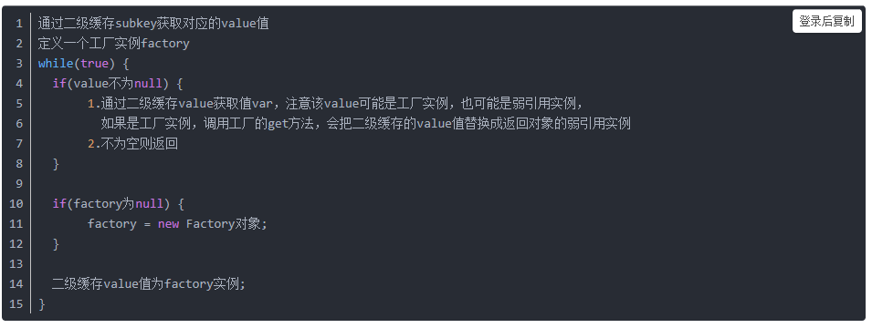
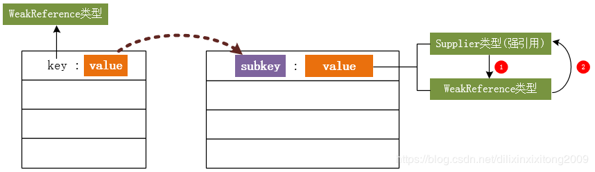

# 1.JDK动态代理使用

[网商博客链接](https://www.cnblogs.com/liuyun1995/p/8144706.html)

[文章链接](https://blog.csdn.net/dilixinxixitong2009/article/details/88362066)

[原文链接](https://www.cnblogs.com/zhangxinly/p/6974283.html)

```java
public interface Subject {
    public String say(String name, int age);
}
```

```java
public class RealSubject implements Subject{
    @Override
    public String say(String name, int age) {
        return "姓名:" +name + " 年龄:" + age;
    }
}
```

```java
public class MyInvocationHandler implements InvocationHandler{

    //需要被代理的类对象
    private Object object = null;

    public MyInvocationHandler() {
    }

    public MyInvocationHandler(Object object) {
        this.object = object;
    }

    // 绑定不同的对象，代理类不变，对象改变
    public Object bind(Object object) {

        this.object = object;

        /**
         * 参数1：类加载器，采用target（被代理的类）本身的类加载器
         * 参数2：生成的动态代理对象挂在那个接口下，采用target（被代理的类）实现的接口下，即Woker接口。
         * 参数3：定义实现方法逻辑的代理类，this表示当前对象，，
         *
         * 它必须实现InvocationHandler的invoke方法
         *
         * @return 代理类*/

        return Proxy.newProxyInstance(object.getClass().getClassLoader(),
                object.getClass().getInterfaces(), this);
    }

    /**
     * 参数解释
     *
     * @param proxy 代理类的实例对象
     * @param method 要调用的method
     * @param args method参数
     * @return
     * @throws Throwable
     */
    @Override
    public Object invoke(Object proxy, Method method, Object[] args) throws Throwable {
        System.out.println("日志：打印信息");
        //通过反射调用 被代理类的方法
        return method.invoke(object, args);
    }
}
```

```java
import java.lang.reflect.*;

/**
 * @author baijd
 */
public class Main {

    public static void main(String[] args) {
        //test1();

        test2();

        //test3();
    }

    public static void test1() {
        //这一句是生成代理类的class文件，前提是你需要在工程根目录下
        // 创建com/sun/proxy目录，不然会报找不到路径的io异常
        System.getProperties().put("sun.misc.ProxyGenerator.saveGeneratedFiles","true");

        MyInvocationHandler proxy = new MyInvocationHandler();

        //代理对象1
        Subject subject = (Subject) proxy.bind(new RealSubject());
        System.out.println(subject.say("asdf", 18));

        //代理对象2
        Subject2 subject2 = (Subject2) proxy.bind(new RealSubject2());
        System.out.println(subject2.say(190, 90));

        //即使是更换对象的方法也会打印信息

        System.out.println("*******************************************************");
        /*********************************************************/

        RealSubject sub = new RealSubject();
        RealSubject sub1 = new RealSubject();
        System.out.println("sub : " + sub.say("tom", 15) + ";"
                + "sub1: " + sub1.say("jerry", 13));

        Subject s = (Subject) proxy.bind(sub);
        System.out.println("proxy.bind() : s : " + s.say("tom", 18));

        s = (Subject) proxy.bind(sub1);
        System.out.println("proxy.bind() : s : " + s.say("jerry", 15));

        System.out.println("*******************************************************");
        /**************************************************************/
    }

    public static void test2() {
        System.getProperties().put("sun.misc.ProxyGenerator.saveGeneratedFiles","true");
        Subject2 subject2 = new RealSubject2();
        Subject2 proxySubject = (Subject2) Proxy.newProxyInstance(
                subject2.getClass().getClassLoader(),
                subject2.getClass().getInterfaces(),
                (proxy, method, args) -> method.invoke(subject2, args));
        System.out.println(proxySubject.say(15, 19));

    }

    public static void test3() {
        Subject subject = new RealSubject();
        Subject proxySubject = (Subject) Proxy.newProxyInstance(
                subject.getClass().getClassLoader(),
                subject.getClass().getInterfaces(),
                new InvocationHandler() {
                    @Override
                    public Object invoke(Object proxy, Method method, Object[] args) throws Throwable {
                        return method.invoke(subject, args);
                    }
                });
        System.out.println(proxySubject.say("zxcvb", 19));
    }

    interface IPro {
        void text();
    }
    class Proxyed implements IPro {
        @Override
        public void text() {
            System.err.println("test() 本方法");
        }
    }

    public class JavaProxy implements InvocationHandler {

        private Object source;

        public JavaProxy(Object source) {
            super();
            this.source = source;
        }

        @Override
        public Object invoke(Object proxy, Method method, Object[] args) throws Throwable {
            System.out.println("before");
            Object invoke = method.invoke(source, args);
            System.out.println("after");
            return invoke;
        }

        public Object getProxy() {
            return Proxy.newProxyInstance(getClass().getClassLoader(), source.getClass().getInterfaces(), this);
        }
    }

    public void test4() throws NoSuchMethodException, IllegalAccessException,
            InvocationTargetException, InstantiationException {
        //设置saveGeneratedFiles值为true则生成 class字节码文件方便分析
        System.getProperties().put("sun.misc.ProxyGenerator.saveGeneratedFiles", "true");

        //第一种，自己写
        //1.获取动态代理类
        Class proxyClazz = Proxy.getProxyClass(IPro.class.getClassLoader(),IPro.class);
        //2.获得代理类的构造函数，并传入参数类型InvocationHandler.class
        Constructor constructor = proxyClazz.getConstructor(InvocationHandler.class);
        //3.通过构造函数来创建动态代理对象，将自定义的InvocationHandler实例传入
        IPro iHello = (IPro) constructor.newInstance(new JavaProxy(new Proxyed()));
        //4.通过代理对象调用目标方法
        iHello.text();

        //第二种，调用JDK提供的方法，实现了1~4步
        Proxy.newProxyInstance(JavaProxy.class.getClassLoader(),
                Proxyed.class.getInterfaces(), new JavaProxy(new Proxyed()));
    }
}
```

# 2.JDK动态代理原理解析

- 动态代理的实现实现是jdk根据Proxy类和要代理的类，实现了属于自己的$ProxyN类。

  - 源码

  ```java
      public static void test2() {
          System.getProperties().put("sun.misc.ProxyGenerator.saveGeneratedFiles","true");
          Subject2 subject2 = new RealSubject2();
          Subject2 proxySubject = (Subject2) Proxy.newProxyInstance(
                  subject2.getClass().getClassLoader(),
                  subject2.getClass().getInterfaces(),
                  (proxy, method, args) -> method.invoke(subject2, args));
          System.out.println(proxySubject.say(15, 19));
  
      }
  
  ```

  

  - jdk生成的字节码

  ```java
  import java.lang.reflect.InvocationHandler;
  import java.lang.reflect.Method;
  import java.lang.reflect.Proxy;
  import java.lang.reflect.UndeclaredThrowableException;
  
  public final class $Proxy0 extends Proxy implements Subject2 {
      private static Method m1;
      private static Method m2;
      private static Method m3;
      private static Method m0;
  
      public $Proxy0(InvocationHandler var1) throws  {
          super(var1);
      }
  
      public final boolean equals(Object var1) throws  {
          try {
              return (Boolean)super.h.invoke(this, m1, new Object[]{var1});
          } catch (RuntimeException | Error var3) {
              throw var3;
          } catch (Throwable var4) {
              throw new UndeclaredThrowableException(var4);
          }
      }
  
      public final String toString() throws  {
          try {
              return (String)super.h.invoke(this, m2, (Object[])null);
          } catch (RuntimeException | Error var2) {
              throw var2;
          } catch (Throwable var3) {
              throw new UndeclaredThrowableException(var3);
          }
      }
  
      public final String say(double var1, int var3) throws  {
          try {
              return (String)super.h.invoke(this, m3, new Object[]{var1, var3});
          } catch (RuntimeException | Error var5) {
              throw var5;
          } catch (Throwable var6) {
              throw new UndeclaredThrowableException(var6);
          }
      }
  
      public final int hashCode() throws  {
          try {
              return (Integer)super.h.invoke(this, m0, (Object[])null);
          } catch (RuntimeException | Error var2) {
              throw var2;
          } catch (Throwable var3) {
              throw new UndeclaredThrowableException(var3);
          }
      }
  
      static {
          try {
              m1 = Class.forName("java.lang.Object").getMethod("equals", Class.forName("java.lang.Object"));
              m2 = Class.forName("java.lang.Object").getMethod("toString");
              m3 = Class.forName("Subject2").getMethod("say", Double.TYPE, Integer.TYPE);
              m0 = Class.forName("java.lang.Object").getMethod("hashCode");
          } catch (NoSuchMethodException var2) {
              throw new NoSuchMethodError(var2.getMessage());
          } catch (ClassNotFoundException var3) {
              throw new NoClassDefFoundError(var3.getMessage());
          }
      }
  }
  ```

- 在源码目录下新建com/sun/proxy目录，jdk会将生成的动态代理实际类放在这里。（System.getProperties().put("sun.misc.ProxyGenerator.saveGeneratedFiles","true");）

# 3.JDK动态代理源码（jdk1.8）

- [网上博客链接](https://www.cnblogs.com/liuyun1995/p/8144706.html)

- Proxy动态代理类用到了WeakCache

## 3.0WeakCache

- 缓存类，那它到底缓存什么类型的对象呢？
- 它是一个具有二级缓存的弱引用类，一级缓存的 key 和 value 都是弱引用，二级缓存都是强引用。
- 其中 key 是根据入参直接传入的，二级缓存的 key 和v alue 都是根据一级缓存的 key 和 value 通过各自的工厂方法(subKeyFactory 和 valueFactory)计算得到的。一级 key 可以为空，并且当二级缓存的 key 和 value 不为空时，它可以来做比较。二级缓存 key 可以用它们各自的 equals 方法做比较。当弱引用被 clear 后，entries 会被以惰性（lazily）方式被删除，被 clear 过后的弱引用的 value 值不会被删除，但是它们会在逻辑上被置为不存在的，并且要重新计算二级缓存的 key 和 value。
- 对象属性定义：

```java
//引用队列，存放被回收的 WeakReference。
private final ReferenceQueue<K> refQueue 
	= new ReferenceQueue<>();
//一、二级缓存容器，而一级缓存的 key、value 是弱引用类型对象，二级缓存的 key、value 则为强引用对象。为了支持null, map的key类型设置为Object
// the key type is Object for supporting null key
private final ConcurrentMap<Object, ConcurrentMap<Object, Supplier<V>>> map
	= new ConcurrentHashMap<>();
//记录已注册的 Supplier。（reverseMap记录了所有代理类生成器是否可用, 这是为了实现缓存的过期机制）
private final ConcurrentMap<Supplier<V>, Boolean> reverseMap
	= new ConcurrentHashMap<>();
//subKeyFactory valueFactory：二级缓存的 key、value 生成器。
//生成二级缓存key的工厂, 这里传入的是KeyFactory
private final BiFunction<K, P, ?> subKeyFactory;
//生成二级缓存value的工厂, 这里传入的是ProxyClassFactory
private final BiFunction<K, P, V> valueFactory;
```

- 定义的几个内部类的具体意义：

### 3.0.1Value

- 继承 Supplier 接口（Supplier<T> 接口没有入参，返回一个 T 类型的对象，结果的提供者，类似工厂方法），通用的 reference 引用对象的提供者，通过该 reference 来获取引用的底层实例。

```java
private interface Value<V> extends Supplier<V> {}
```

### 3.0.2LookupValue

- 实现 Value 接口，并重写了 hashCode 和 equals 方法，在 equals 方法中通过判断底层引用的实例是否相等为依据：

```java
private static final class LookupValue<V> implements Value<V> {
    private final V value;

    LookupValue(V value) {
        this.value = value;
    }

    @Override
    public V get() {
        return value;
    }

    @Override
    public int hashCode() {
        return System.identityHashCode(value); // compare by identity
    }

    @Override
    public boolean equals(Object obj) {
        return obj == this ||
            obj instanceof Value &&
            this.value == ((Value<?>) obj).get();  // compare by identity
    }
}
```

### 3.0.3CacheValue

- 对象的弱引用类型，其主要目的是判断不同的 CacheValue 是否引用的是同一个底层对象，即 equals 方法实现目的：

```java
    private static final class CacheValue<V>
        extends WeakReference<V> implements Value<V>
    {
        private final int hash;

        CacheValue(V value) {
            super(value);
            this.hash = System.identityHashCode(value); // compare by identity
        }

        @Override
        public int hashCode() {
            return hash;
        }

        @Override
        public boolean equals(Object obj) {
            V value;
            return obj == this ||
                   obj instanceof Value &&
                   // cleared CacheValue is only equal to itself
                   (value = get()) != null &&
                   value == ((Value<?>) obj).get(); // compare by identity
        }
    }
```

### 3.0.4CacheKey

- key 的弱引用类。一级缓存 key 对象类型。

```java
private static final class CacheKey<K> extends WeakReference<K> {

    //// 使用Object实例替换null
    // a replacement for null keys
    private static final Object NULL_KEY = new Object();

    static <K> Object valueOf(K key, ReferenceQueue<K> refQueue) {
        return key == null
            // 使用NULL_KEY替换null
            // null key means we can't weakly reference it,
            // so we use a NULL_KEY singleton as cache key
            ? NULL_KEY
            // 非空键使用WeakReference进行包装
            // non-null key requires wrapping with a WeakReference
            : new CacheKey<>(key, refQueue);
    }

    private final int hash;

    private CacheKey(K key, ReferenceQueue<K> refQueue) {
        super(key, refQueue);
        this.hash = System.identityHashCode(key);  // compare by identity
    }

    @Override
    public int hashCode() {
        return hash;
    }

    @Override
    public boolean equals(Object obj) {
        K key;
        return obj == this ||
            obj != null &&
            obj.getClass() == this.getClass() &&
            // cleared CacheKey is only equal to itself
            (key = this.get()) != null &&
            // compare key by identity
            key == ((CacheKey<K>) obj).get();
    }

    void expungeFrom(ConcurrentMap<?, ? extends ConcurrentMap<?, ?>> map,
                     ConcurrentMap<?, Boolean> reverseMap) {
        // removing just by key is always safe here because after a CacheKey
        // is cleared and enqueue-ed it is only equal to itself
        // (see equals method)...
        ConcurrentMap<?, ?> valuesMap = map.remove(this);
        // remove also from reverseMap if needed
        if (valuesMap != null) {
            for (Object cacheValue : valuesMap.values()) {
                reverseMap.remove(cacheValue);
            }
        }
    }
}
```

### 3.0.5Factory

- 工厂类，通过一级缓存的 key 和 parameter 生成最终结果值，同时会把值赋值给二级缓存 WeakReference 弱引用：

```java
private final class Factory implements Supplier<V> {

    //一级缓存key
    private final K key;
    //根据一级缓存key和该参数获取二级缓存value
    private final P parameter;
    //二级缓存key
    private final Object subKey;
    //二级缓存容器
    private final ConcurrentMap<Object, Supplier<V>> valuesMap;

    Factory(K key, P parameter, Object subKey,
            ConcurrentMap<Object, Supplier<V>> valuesMap) {
        this.key = key;
        this.parameter = parameter;
        this.subKey = subKey;
        this.valuesMap = valuesMap;
    }

    @Override
    public synchronized V get() { // serialize access
        // 检查二级缓存的工厂对象是否存在
        //这里再一次去二级缓存里面获取Supplier, 用来验证是否是Factory本身
        // re-check
        Supplier<V> supplier = valuesMap.get(subKey);
        if (supplier != this) {
            //在这里验证supplier是否是Factory实例本身, 如果不则返回null让调用者继续轮询重试
            //期间supplier可能替换成了CacheValue, 或者由于生成代理类失败被从二级缓存中移除了
            // 在等待的时候会发生变化
            // something changed while we were waiting:
            // might be that we were replaced by a CacheValue
            // or were removed because of failure ->
            // return null to signal WeakCache.get() to retry
            // the loop
            return null;
        }
        // else still us (supplier == this)

        // create new value
        V value = null;
        try {
            //委托valueFactory去生成代理类, 这里会通过传入的ProxyClassFactory去生成代理类
            //根据一级缓存key和paramter参数生成二级缓存的value值
            value = Objects.requireNonNull(valueFactory.apply(key, parameter));
        } finally {
            //如果生成代理类失败, 就将这个二级缓存删除
            if (value == null) { // remove us on failure
                valuesMap.remove(subKey, this);
            }
        }
        // the only path to reach here is with non-null value
        assert value != null;

        // 缓存Factory计算后的值，缓存的值是一个WeakReference类型
        // wrap value with CacheValue (WeakReference)
        CacheValue<V> cacheValue = new CacheValue<>(value);

        // 存储起来，用于后期的查找containsValue操作
        // put into reverseMap
        reverseMap.put(cacheValue, Boolean.TRUE);

        /**
         * 用新的弱引用替换旧的值
         * 注意：初始化时二级缓存value是工厂实例，使用该工厂获取值后，
         *      就会替换为获取的值的弱引用，上面的if判断也跟这里相关
         */
        // try replacing us with CacheValue (this should always succeed)
        if (!valuesMap.replace(subKey, this, cacheValue)) {
            throw new AssertionError("Should not reach here");
        }

        // successfully replaced us with new CacheValue -> return the value
        // wrapped by it
        return value;
    }
}
```

- 上面提到的二级缓存都是强用用，但是通过对 ValueFactory 通常应用一级 key 和 paramter 参数生成 value 值后，通过一个弱引用对象引用该 value 值，而在之后的步骤中，会对二级缓存执行 replace，替换二级 key 对应槽的 Supplier 工厂实例。那二级缓存的 value 值也可以是弱引用对象实例。也就是说二级缓存的 value 是强引用和弱引用来回转换。
- 分析完 WeakCache 私有内部类，接下来分析根据 key 和 paramter 参数值获取二级缓存的弱引用包装的实例对象：

### 3.0.6get()

```java
public V get(K key, P parameter) {
    //这里要求实现的接口不能为空
    Objects.requireNonNull(parameter);
	//清除过期的缓存
    expungeStaleEntries();
    
	// 创建一级缓存的弱引用key（将ClassLoader包装成CacheKey, 作为一级缓存的key）
    Object cacheKey = CacheKey.valueOf(key, refQueue);

    /**
     * 根据指定的一级key获取二级缓存容器
     * 当弱引用被 clear 后，entries 会被以惰性（lazily）方式被删除
     */
    // lazily install the 2nd level valuesMap for the particular cacheKey
    ConcurrentMap<Object, Supplier<V>> valuesMap = map.get(cacheKey);
    //如果根据ClassLoader没有获取到对应的值
    if (valuesMap == null) {
        //以CAS方式放入, 如果不存在则放入，否则返回原先的值
        ConcurrentMap<Object, Supplier<V>> oldValuesMap
            = map.putIfAbsent(cacheKey,
                              valuesMap = new ConcurrentHashMap<>());
        //如果oldValuesMap有值, 说明放入失败
        if (oldValuesMap != null) {
            valuesMap = oldValuesMap;
        }
    }

    // 使用指定的一级key和paramter参数创建二级key
    //根据代理类实现的接口数组来生成二级缓存key, 分为key0, key1, key2, keyx
    // create subKey and retrieve the possible Supplier<V> stored by that
    // subKey from valuesMap
    Object subKey = Objects.requireNonNull(subKeyFactory.apply(key, parameter));
    //获取二级缓存value值，即工厂实例
    Supplier<V> supplier = valuesMap.get(subKey);
    Factory factory = null;
	//这个循环提供了轮询机制, 如果条件为假就继续重试直到条件为真为止
    while (true) {
        //如果通过subKey取出来的值不为空
        if (supplier != null) {
            //在这里supplier可能是一个Factory也可能会是一个CacheValue
            //在这里不作判断, 而是在Supplier实现类的get方法里面进行验证
            // supplier might be a Factory or a CacheValue<V> instance
            V value = supplier.get();
            //这里的get()方法有可能返回null
            if (value != null) {
                return value;
            }
        }
        // else no supplier in cache
        // or a supplier that returned null (could be a cleared CacheValue
        // or a Factory that wasn't successful in installing the CacheValue)

        // lazily construct a Factory
        if (factory == null) {
            //新建一个Factory实例作为subKey对应的值
            factory = new Factory(key, parameter, subKey, valuesMap);
        }

        if (supplier == null) {
            //到这里表明subKey没有对应的值, 就将factory作为subKey的值放入
            supplier = valuesMap.putIfAbsent(subKey, factory);
            if (supplier == null) {
                //到这里表明成功将factory放入缓存
                // successfully installed Factory
                supplier = factory;
            }
            //否则, 可能期间有其他线程修改了值, 那么就不再继续给subKey赋值, 而是取出来直接用
            // else retry with winning supplier
        } else {
            //期间可能其他线程修改了值, 那么就将原先的值替换
            if (valuesMap.replace(subKey, supplier, factory)) {
                //成功将factory替换成新的值
                // successfully replaced
                // cleared CacheEntry / unsuccessful Factory
                // with our Factory
                supplier = factory;
            } else {
                //替换失败, 继续使用原先的值
                // retry with current supplier
                supplier = valuesMap.get(subKey);
            }
        }
    }
}
```

获取值的伪代码：



- 在文章的开始部分提到一级缓存的 key 和 value 都是弱引用，从 get() 方法可以看出，一级缓存的 key 是 CacheKey 类型，当 key 被回收时，其对应的 value 值也就没有被引用，失去了存在的意义，也就是可以理解为 value 也是弱引用类型。
- 二级缓存的 key 通过工厂方法（subKeyFactory）生成，其也有可能是弱引用类型实例，这就导致二级缓存可以是弱引用或强引用类型。value 是 CacheValue 类型的对象，从上面的分析可知，CacheValue 继承 WeakReference 类，即 value是弱引用类型。



- 至于为什么会有二级缓存。参考了一些资料，主要是因为有可能多个类具有共同的 classloader，为保证唯一性，就要有二级缓存，采用接口数组来唯一标识一个代理类。当 classloader 移除后，会将它所对应的所有缓存都清掉，所以就要采用弱引用类型，而接口数组对应的类肯定一直存在，所以才用了强引用。

### 3.0.7为什么要二级缓存

- **一级缓存用来区分classLoader,二级缓存用来区分实现的接口**
  生成类的缓存是按照ClassLoader来划分的，这是因为类的区分不仅根据类名还根据装载类的ClassLoader，也就是说同一个类被不同的ClassLoader加载，那么它们也是不同的.

## 3.1Proxy类介绍

```java
public class Proxy implements java.io.Serializable {

    private static final long serialVersionUID = -2222568056686623797L;

    /** parameter types of a proxy class constructor */
    private static final Class<?>[] constructorParams =
        { InvocationHandler.class };

    /**
     * a cache of proxy classes
     */
    private static final WeakCache<ClassLoader, Class<?>[], Class<?>>
        proxyClassCache = new WeakCache<>(new KeyFactory(), new ProxyClassFactory());

    /**
     * the invocation handler for this proxy instance.
     * @serial
     */
    protected InvocationHandler h;

```

- 其中构造函数中用到的两个内部类KeyFactory和ProxyClassFactory

### 3.1.1KeyFactory

```java
    private static final class KeyFactory
        implements BiFunction<ClassLoader, Class<?>[], Object>
    {
        @Override
        public Object apply(ClassLoader classLoader, Class<?>[] interfaces) {
            switch (interfaces.length) {
                case 1: return new Key1(interfaces[0]); // the most frequent
                case 2: return new Key2(interfaces[0], interfaces[1]);
                case 0: return key0;
                default: return new KeyX(interfaces);
            }
        }
    }

```

### 3.1.2ProxyClassFactory

- 该内部类是真正生成动态代理类的内部类

```java
    private static final class ProxyClassFactory
        implements BiFunction<ClassLoader, Class<?>[], Class<?>>
    {
        // prefix for all proxy class names
        private static final String proxyClassNamePrefix = "$Proxy";

        // next number to use for generation of unique proxy class names
        private static final AtomicLong nextUniqueNumber = new AtomicLong();

        @Override
        public Class<?> apply(ClassLoader loader, Class<?>[] interfaces) {

            Map<Class<?>, Boolean> interfaceSet = new IdentityHashMap<>(interfaces.length);
            for (Class<?> intf : interfaces) {
                /*
                 * Verify that the class loader resolves the name of this
                 * interface to the same Class object.
                 */
                Class<?> interfaceClass = null;
                try {
                    interfaceClass = Class.forName(intf.getName(), false, loader);
                } catch (ClassNotFoundException e) {
                }
                if (interfaceClass != intf) {
                    throw new IllegalArgumentException(
                        intf + " is not visible from class loader");
                }
                /*
                 * Verify that the Class object actually represents an
                 * interface.
                 */
                if (!interfaceClass.isInterface()) {
                    throw new IllegalArgumentException(
                        interfaceClass.getName() + " is not an interface");
                }
                /*
                 * Verify that this interface is not a duplicate.
                 */
                if (interfaceSet.put(interfaceClass, Boolean.TRUE) != null) {
                    throw new IllegalArgumentException(
                        "repeated interface: " + interfaceClass.getName());
                }
            }

            String proxyPkg = null;     // package to define proxy class in
            int accessFlags = Modifier.PUBLIC | Modifier.FINAL;

            /*
             * Record the package of a non-public proxy interface so that the
             * proxy class will be defined in the same package.  Verify that
             * all non-public proxy interfaces are in the same package.
             */
            for (Class<?> intf : interfaces) {
                int flags = intf.getModifiers();
                if (!Modifier.isPublic(flags)) {
                    accessFlags = Modifier.FINAL;
                    String name = intf.getName();
                    int n = name.lastIndexOf('.');
                    String pkg = ((n == -1) ? "" : name.substring(0, n + 1));
                    if (proxyPkg == null) {
                        proxyPkg = pkg;
                    } else if (!pkg.equals(proxyPkg)) {
                        throw new IllegalArgumentException(
                            "non-public interfaces from different packages");
                    }
                }
            }

            if (proxyPkg == null) {
                // if no non-public proxy interfaces, use com.sun.proxy package
                proxyPkg = ReflectUtil.PROXY_PACKAGE + ".";
            }

            /*
             * Choose a name for the proxy class to generate.
             */
            long num = nextUniqueNumber.getAndIncrement();
            String proxyName = proxyPkg + proxyClassNamePrefix + num;

            /*
             * Generate the specified proxy class.
             */
            byte[] proxyClassFile = ProxyGenerator.generateProxyClass(
                proxyName, interfaces, accessFlags);
            try {
                return defineClass0(loader, proxyName,
                                    proxyClassFile, 0, proxyClassFile.length);
            } catch (ClassFormatError e) {
                /*
                 * A ClassFormatError here means that (barring bugs in the
                 * proxy class generation code) there was some other
                 * invalid aspect of the arguments supplied to the proxy
                 * class creation (such as virtual machine limitations
                 * exceeded).
                 */
                throw new IllegalArgumentException(e.toString());
            }
        }
    }
```


## 源码讲解

---

- 从代码可以看到，JDK主要提供了两个类来实现动态代理 Proxy 和 InvocationHandler。
  - Proxy：真正实现代理功能的类，最终生成字节码的功能也在该类中实现。
  - InvocationHandler：由用户提供对被代理接口每个方法的实现增强

## 3.2从Proxy.newProxyInstance说起

- 该方法产生一个代理类（Object）类型，需要强转为具体的被代理接口定义

- 参数说明：

  - ```java
    ClassLoader loader
    ```

    被代理类的类加载器；

  - ```java
    Class<?>[] interfaces
    ```

    被代理类实现的接口（这儿只能提供接口数组，所以JDK动态代理只能代理接口，不能代理具体类）

  - ```java
    InvocationHandler h
    ```

    被代理对象每个方法的处理增强。

- Proxy.newProxyInstance -> getProxyClass0(loader, intfs);

- getProxyClass0是获取代理类实例对象的实现

```java
@CallerSensitive
public static Object newProxyInstance(ClassLoader loader,
                                      Class<?>[] interfaces,
                                      InvocationHandler h)
    throws IllegalArgumentException
    {
        Objects.requireNonNull(h);

        final Class<?>[] intfs = interfaces.clone();
        final SecurityManager sm = System.getSecurityManager();
        if (sm != null) {
            checkProxyAccess(Reflection.getCallerClass(), loader, intfs);
        }

        /*
         * Look up or generate the designated proxy class.
         */
        Class<?> cl = getProxyClass0(loader, intfs);

        /*
         * Invoke its constructor with the designated invocation handler.
         */
        try {
            if (sm != null) {
                checkNewProxyPermission(Reflection.getCallerClass(), cl);
            }

            final Constructor<?> cons = cl.getConstructor(constructorParams);
            final InvocationHandler ih = h;
            if (!Modifier.isPublic(cl.getModifiers())) {
                AccessController.doPrivileged(new PrivilegedAction<Void>() {
                    public Void run() {
                        cons.setAccessible(true);
                        return null;
                    }
                });
            }
            return cons.newInstance(new Object[]{h});
        } catch (IllegalAccessException|InstantiationException e) {
            throw new InternalError(e.toString(), e);
        } catch (InvocationTargetException e) {
            Throwable t = e.getCause();
            if (t instanceof RuntimeException) {
                throw (RuntimeException) t;
            } else {
                throw new InternalError(t.toString(), t);
            }
        } catch (NoSuchMethodException e) {
            throw new InternalError(e.toString(), e);
        }
    }
```

## 3.3getProxyClass0获取代理类实例

```java
private static Class<?> getProxyClass0(ClassLoader loader,
                                       Class<?>... interfaces) {
    if (interfaces.length > 65535) {
        throw new IllegalArgumentException("interface limit exceeded");
    }

    // If the proxy class defined by the given loader implementing
    // the given interfaces exists, this will simply return the cached copy;
    // otherwise, it will create the proxy class via the ProxyClassFactory
    return proxyClassCache.get(loader, interfaces);
}
```

## 3.4proxyClassCache.get()

- 从proxyClassCache弱缓存中获取，或者从ProxyClassFactory中提供

```java
public V get(K key, P parameter) {
    //参数非空验证
    Objects.requireNonNull(parameter);
	////将被clear的key值对应值从map中删除  
    expungeStaleEntries();
	//map中的key值和value值都是弱引用，这里valueOf静态方法，返回key的新建弱引用对象，  
	//这里有一点要注意CacheKey弱引用对象的hash值跟key值绑定，所以虽然新建了弱引用对象  
	//但是key值一样在map中就能取到对应的值  
    Object cacheKey = CacheKey.valueOf(key, refQueue);

    //根据key组成的cacheKey从一级缓存中获取map二级缓存
    // lazily install the 2nd level valuesMap for the particular cacheKey
    ConcurrentMap<Object, Supplier<V>> valuesMap = map.get(cacheKey);
    //如果二级缓存为空，则新建一个map放进去
    if (valuesMap == null) {
        ConcurrentMap<Object, Supplier<V>> oldValuesMap
            = map.putIfAbsent(cacheKey,
                              valuesMap = new ConcurrentHashMap<>());
        //应该是为了多线程资源争取 的 双重检测吧
        if (oldValuesMap != null) {
            valuesMap = oldValuesMap;
        }
    }

    /**
    * 为什么说第一次valuesMap里面value的实际类型和之后不一样？
   	* 		根据Supplier<V> supplier = valuesMap.get(subKey);
   	*		中supplier值以及在while循环第几次，按照时间先后考虑
   	*
    **/
    
    // create subKey and retrieve the possible Supplier<V> stored by that
    // subKey from valuesMap
    //根据key,parameter获取二级缓存的subKey
    Object subKey = Objects.requireNonNull(subKeyFactory.apply(key, parameter));
    //根据二级缓存的subKey获取对应的值V(Supplier<T>)
    Supplier<V> supplier = valuesMap.get(subKey);
    Factory factory = null;

    while (true) {
        if (supplier != null) {
            // supplier might be a Factory or a CacheValue<V> instance
            V value = supplier.get();
            if (value != null) {
                return value;
            }
        }
        // else no supplier in cache
        // or a supplier that returned null (could be a cleared CacheValue
        // or a Factory that wasn't successful in installing the CacheValue)

        // lazily construct a Factory
        if (factory == null) {
            factory = new Factory(key, parameter, subKey, valuesMap);
        }

        if (supplier == null) {
            supplier = valuesMap.putIfAbsent(subKey, factory);
            if (supplier == null) {
                // successfully installed Factory
                supplier = factory;
            }
            // else retry with winning supplier
        } else {
            if (valuesMap.replace(subKey, supplier, factory)) {
                // successfully replaced
                // cleared CacheEntry / unsuccessful Factory
                // with our Factory
                supplier = factory;
            } else {
                // retry with current supplier
                supplier = valuesMap.get(subKey);
            }
        }
    }
}
```

### 3.4.1为什么说第一次valuesMap里面value的实际类型和之后不一样

- 根据Supplier<V> supplier = valuesMap.get(subKey);中supplier值以及在while循环第几次，按照时间先后考虑

#### 3.4.1.1supplier==null,第一次while循环

- 这种出现在第一次请求中，二级缓存没有该key

```java
supplier = valuesMap.putIfAbsent(subKey, factory);
if (supplier == null) {
    // successfully installed Factory
    supplier = factory;
}
```

- 此时valuesMap里面的key是subKey，subKey是

```java
Object subKey = Objects.requireNonNull(subKeyFactory.apply(key, parameter));
```

- 根据java.lang.reflect.Proxy.KeyFactory#apply；subKey实际类型是Key1,Key2,Object或者KeyX，根据实现的接口数量决定

```java
private static final class KeyFactory
        implements BiFunction<ClassLoader, Class<?>[], Object>
    {
        @Override
        public Object apply(ClassLoader classLoader, Class<?>[] interfaces) {
            switch (interfaces.length) {
                case 1: return new Key1(interfaces[0]); // the most frequent
                case 2: return new Key2(interfaces[0], interfaces[1]);
                case 0: return key0;
                default: return new KeyX(interfaces);
            }
        }
    }
```

#### 3.4.1.2supplier==null,第二次while循环(或者因其他原因，第n次while循环)

- 这种出现在第一次请求中，二级缓存没有该key,supplier被赋值之后
  逻辑为

```java
if (supplier != null) {
  // supplier might be a Factory or a CacheValue<V> instance
  V value = supplier.get();
  if (value != null) {
     return value;
  }
 }
```

- supplier在第一次循环时，已经为factory了，这里调用get方法，就是进入
  java.lang.reflect.WeakCache.Factory#get的逻辑

```java
		@Override
        public synchronized V get() { // serialize access
            // re-check
            Supplier<V> supplier = valuesMap.get(subKey);
            if (supplier != this) {
                //supplier和当前supplier不等，验证不正确
                return null;
            }
            V value = null;
            try {
                //生成代理类对应的Class<?>信息
                value = Objects.requireNonNull(valueFactory.apply(key, parameter));
            } finally {
                if (value == null) { // remove us on failure
                    valuesMap.remove(subKey, this);
                }
            }
            assert value != null;
            CacheValue<V> cacheValue = new CacheValue<>(value);

            //把之前二级缓存的value替换为当前的CacheValue
            if (valuesMap.replace(subKey, this, cacheValue)) {
                // put also in reverseMap
                reverseMap.put(cacheValue, Boolean.TRUE);
            } else {
                throw new AssertionError("Should not reach here");
            }
            return value;
        }
```

- 其中， value = Objects.requireNonNull(valueFactory.apply(key, parameter));就是代理类

```java
java.lang.reflect.Proxy.ProxyClassFactory#apply //返回Class<?>
```

- 在生成value之后

```java
//把当前的值即this(类型为Factory)替换为了cacheValue(类型CacheValue)
valuesMap.replace(subKey, this, cacheValue)
```

- 并且这一次get()最终返回的是value;也就是Class<?>

#### 3.4.1.3supplier!=null

- 出现在之后的某一次请求中，二级缓存已经有该key-value

```java
if (supplier != null) {
  // supplier might be a Factory or a CacheValue<V> instance
  V value = supplier.get();
  if (value != null) {
     return value;
  }
 }
```

- 此时，supplier的类型为CacheValue 在Factory#get中生成时，就是

   CacheValue<V> cacheValue = new CacheValue<>(value);
   CacheValue#get方法，最终转入java.lang.ref.Reference#get，返回的就是这个value，即构造函数的参数value


