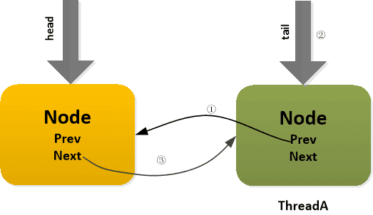
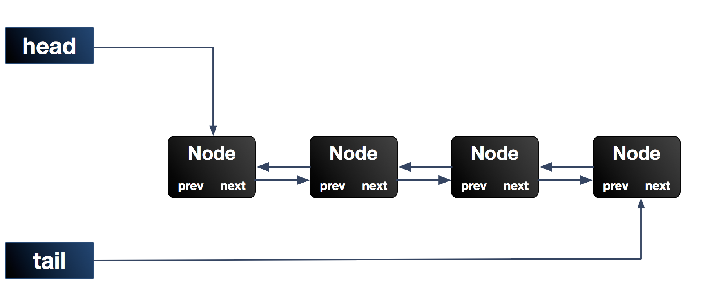

[TOC]

参考链接

[http://www.iocoder.cn/](http://www.iocoder.cn/)


# AQS

AQS(`AbstractQueuedSynchronizer`，抽象队列同步器) 是构建锁或者其他同步组件的基础框架，位于 `java.util.concurrent.locks` 下。

JUC(`java.util.concurrent`)里所有的锁机制都是基于AQS框架上构建的。


首先通过上面我画的结构图（只是一个大致的框架，很多类并未列出），可以大致的了解到，JUC当中，锁、条件变量和一些并发工具类都围绕AQS进行构建。同时，线程池、阻塞队列等又依赖于锁和条件变量实现并发。所以说，<font color="#STCAIYUN">AQS是JUC并发包中的核心基础组件。</font>


## 引言

`ReentrantLock`来加锁和释放锁：

```java
Lock lock = new ReentrantLock();

lock.lock();
//业务逻辑

lock.unlock();
```

上述`ReentrantLock`、还有`ReentrantReadWriteLock`底层都是基于AQS来实现的。


给大家画一个图，看一下ReentrantLock和AQS之间的关系。


我们看上图，说白了，ReentrantLock内部包含了一个AQS对象，也就是AbstractQueuedSynchronizer类型的对象。


这个AQS对象就是ReentrantLock可以实现加锁和释放锁的关键性的**核心组件**。


## ReentrantLock加锁和释放锁的底层原理

好了，现在如果有一个线程过来尝试用ReentrantLock的lock()方法进行加锁，会发生什么事情？


很简单，这个AQS对象内部有一个核心的变量叫做**state**，是int类型的，代表了**加锁的状态**。


初始状态下，这个state的值是0。


另外，这个AQS内部还有一个**关键变量**，用来记录**当前加锁的是哪个线程**，初始化状态下，这个变量是null。


接着线程1跑过来调用ReentrantLock的lock()方法尝试进行加锁，这个加锁的过程，直接就是用CAS操作将state值从0变为1。

（关于CAS，之前专门有文章做过详细阐述，大家可以自行阅读了解）


如果之前没人加过锁，那么state的值肯定是0，此时线程1就可以加锁成功。


一旦线程1加锁成功了之后，就可以设置当前加锁线程是自己。所以大家看下面的图，就是线程1跑过来加锁的一个过程。


其实看到这儿，大家应该对所谓的AQS有感觉了。说白了，就是并发包里的一个核心组件，里面有state变量、加锁线程变量等核心的东西，维护了加锁状态。


你会发现，ReentrantLock这种东西只是一个外层的API，**内核中的锁机制实现都是依赖AQS组件的**。


这个ReentrantLock之所以用Reentrant打头，意思就是他是一个可重入锁。


可重入锁的意思，就是你可以对一个ReentrantLock对象多次执行lock()加锁和unlock()释放锁，也就是可以对一个锁加多次，叫做可重入加锁。


大家看明白了那个state变量之后，就知道了如何进行可重入加锁！


其实每次线程1可重入加锁一次，会判断一下当前加锁线程就是自己，那么他自己就可以可重入多次加锁，每次加锁就是把state的值给累加1，别的没啥变化。


接着，如果线程1加锁了之后，线程2跑过来加锁会怎么样呢？


**我们来看看锁的互斥是如何实现的？**


线程2跑过来一下看到，哎呀！state的值不是0啊？所以CAS操作将state从0变为1的过程会失败，因为state的值当前为1，说明已经有人加锁了！


接着线程2会看一下，是不是自己之前加的锁啊？当然不是了，**“加锁线程”**这个变量明确记录了是线程1占用了这个锁，所以线程2此时就是加锁失败。


给大家来一张图，一起来感受一下这个过程：


接着，线程2会将自己放入AQS中的一个等待队列，因为自己尝试加锁失败了，此时就要将自己放入队列中来等待，等待线程1释放锁之后，自己就可以重新尝试加锁了


所以大家可以看到，AQS是如此的核心！AQS内部还有一个等待队列，专门放那些加锁失败的线程！


同样，给大家来一张图，一起感受一下：


接着，线程1在执行完自己的业务逻辑代码之后，就会释放锁！**他释放锁的过程非常的简单**，就是将AQS内的state变量的值递减1，如果state值为0，则彻底释放锁，会将“加锁线程”变量也设置为null！


整个过程，参见下图：


接下来，会从**等待队列的队头唤醒线程2重新尝试加锁。**


好！线程2现在就重新尝试加锁，这时还是用CAS操作将state从0变为1，此时就会成功，成功之后代表加锁成功，就会将state设置为1。


此外，还要把**“加锁线程”**设置为线程2自己，同时线程2自己就从等待队列中出队了。


最后再来一张图，大家来看看这个过程。


## CLH 锁

- CLH锁是一种**自旋锁**，能确保无饥饿性，提供先来先服务的公平性。（所谓的自旋是指：当线程试图去拿已经被其它线程占有的锁时，当前线程不会进入阻塞态，而是进入一个死循环去自旋的获取锁，获取到锁之后退出死循环。）
- 同时CLH锁也是一种**基于链表的可扩展，高性能，公平的自旋锁**，申请线程只在本地变量上自旋轮询前驱的状态，如果发现前驱释放了锁就结束自旋。


## 一.AQS简介

`java.util.concurrent`包的核心。，该包中的大多数同步器都是基于AQS来构建的。AQS框架提供了一套通用的机制来管理<u>同步状态</u>（`synchronization state`）、<u>阻塞/唤醒线程</u>、<u>管理等待队列</u>。

我们所熟知的`ReentrantLock`、`CountDownLatch`、`CyclicBarrier`等同步器，其实都是通过内部类实现了AQS框架暴露的API，以此实现各类同步器功能。这些同步器的主要区别其实就是对同步状态（`synchronization` `state`）的定义不同。


AQS框架，分离了构建同步器时的一系列关注点，它的所有操作都围绕着资源——同步状态（synchronization state）来展开，并替用户解决了如下问题：

1. 资源是可以被同时访问？还是在同一时间只能被一个线程访问？（**共享/独占功能**）
2. 访问资源的线程如何进行并发管理？（**等待队列**）
3. 如果线程等不及资源了，如何从等待队列退出？（**超时/中断**）


这其实是一种典型的<u>模板方法设计模式</u>：父类（AQS框架）定义好骨架和内部操作细节，具体规则由子类去实现。
AQS框架将剩下的一个问题留给用户：**什么是资源？如何定义资源是否可以被访问？**


我们来看下几个常见的同步器对这一问题的定义：

| 同步器                 | 资源的定义                                                   |
| :--------------------- | :----------------------------------------------------------- |
| ReentrantLock          | 资源表示独占锁。State为0表示锁可用；为1表示被占用；为N表示重入的次数 |
| CountDownLatch         | 资源表示倒数计数器。State为0表示计数器归零，所有线程都可以访问资源；为N表示计数器未归零，所有线程都需要阻塞。 |
| Semaphore              | 资源表示信号量或者令牌。State≤0表示没有令牌可用，所有线程都需要阻塞；大于0表示由令牌可用，线程每获取一个令牌，State减1，线程没释放一个令牌，State加1。 |
| ReentrantReadWriteLock | 资源表示共享的读锁和独占的写锁。state逻辑上被分成两个16位的unsigned short，分别记录读锁被多少线程使用和写锁被重入的次数。 |

综上所述，AQS框架提供了以下功能：

### 1.1 提供一套模板框架

由于并发的存在，需要考虑的情况非常多，因此能否以一种相对简单的方法来完成这两个目标就非常重要，因为对于用户（AQS框架的使用者来说），很多时候并不关心内部复杂的细节。而AQS其实就是利用模板方法模式来实现这一点，AQS中大多数方法都是final或是private的，也就是说Doug Lea并不希望用户直接使用这些方法，而是只覆写部分模板规定的方法。
AQS通过暴露以下API来让让用户自己解决上面提到的“**如何定义资源是否可以被访问**”的问题：


| 钩子方法          | 描述               |
| :---------------- | :----------------- |
| tryAcquire        | 排它获取（资源数） |
| tryRelease        | 排它释放（资源数） |
| tryAcquireShared  | 共享获取（资源数） |
| tryReleaseShared  | 共享获取（资源数） |
| isHeldExclusively | 是否排它状态       |


### 1.2 支持中断、超时

还记得Lock接口中的那些锁中断、限时等待、锁尝试的方法吗？这些方法的实现其实AQS都内置提供了。
使用了AQS框架的同步器，都支持下面的操作：

- 阻塞和非阻塞（例如tryLock）同步；
- 可选的超时设置，让调用者可以放弃等待；
- 可中断的阻塞操作。


### 1.3 支持独占模式和共享模式


### 1.4 支持Condition条件等待

AQS框架内部通过一个内部类`ConditionObject`，实现了`Condition`接口，以此来为子类提供条件等待的功能。


## 二.AQS方法说明

AQS利用了模板方法模式，其中大多数方法都是final或是private的，我们把这类方法称为**Skeleton Method**，也就是说这些方法是AQS框架自身定义好的骨架，子类是不能覆写的。

下面会按类别简述一些比较重要的方法

### 2.1 CAS操作

CAS，即CompareAndSet，在Java中CAS操作的实现都委托给一个名为UnSafe类，关于`Unsafe`类，以后会专门详细介绍该类，目前只要知道，通过该类可以实现对字段的原子操作。

| 方法名                  | 修饰符               | 描述                    |
| :---------------------- | :------------------- | :---------------------- |
| compareAndSetState      | protected final      | CAS修改同步状态值       |
| compareAndSetHead       | private final        | CAS修改等待队列的头指针 |
| compareAndSetTail       | private final        | CAS修改等待队列的尾指针 |
| compareAndSetWaitStatus | private static final | CAS修改结点的等待状态   |
| compareAndSetNext       | private static final | CAS修改结点的next指针   |

### 2.2 等待队列的核心操作

| 方法名              | 修饰符  | 描述                 |
| :------------------ | :------ | :------------------- |
| enq                 | private | 入队操作             |
| addWaiter           | private | 入队操作             |
| setHead             | private | 设置头结点           |
| unparkSuccessor     | private | 唤醒后继结点         |
| doReleaseShared     | private | 释放共享结点         |
| setHeadAndPropagate | private | 设置头结点并传播唤醒 |

### 2.3 资源的获取操作

| 方法名                       | 修饰符         | 描述                              |
| :--------------------------- | :------------- | :-------------------------------- |
| cancelAcquire                | private        | 取消获取资源                      |
| shouldParkAfterFailedAcquire | private static | 判断是否阻塞当前调用线程          |
| acquireQueued                | final          | 尝试获取资源,获取失败尝试阻塞线程 |
| doAcquireInterruptibly       | private        | 独占地获取资源（响应中断）        |
| doAcquireNanos               | private        | 独占地获取资源（限时等待）        |
| doAcquireShared              | private        | 共享地获取资源                    |
| doAcquireSharedInterruptibly | private        | 共享地获取资源（响应中断）        |
| doAcquireSharedNanos         | private        | 共享地获取资源（限时等待）        |

| 方法名                     | 修饰符       | 描述                       |
| :------------------------- | :----------- | :------------------------- |
| acquire                    | public final | 独占地获取资源             |
| acquireInterruptibly       | public final | 独占地获取资源（响应中断） |
| acquireInterruptibly       | public final | 独占地获取资源（限时等待） |
| acquireShared              | public final | 共享地获取资源             |
| acquireSharedInterruptibly | public final | 共享地获取资源（响应中断） |
| tryAcquireSharedNanos      | public final | 共享地获取资源（限时等待） |

### 2.4 资源的释放操作

| 方法名        | 修饰符       | 描述         |
| :------------ | :----------- | :----------- |
| release       | public final | 释放独占资源 |
| releaseShared | public final | 释放共享资源 |


## 三.AQS原理简述

我们在第一节中讲到，AQS框架分离了构建同步器时的一系列关注点，它的所有操作都围绕着资源——同步状态（synchronization state）来展开因此，围绕着资源，衍生出三个基本问题：

1. 同步状态（synchronization state）的管理
2. 阻塞/唤醒线程的操作
3. 线程等待队列的管理

### 3.1 同步状态

**同步状态的定义**
同步状态，其实就是资源。AQS使用单个int（32位）来保存同步状态，并暴露出`getState`、`setState`以及`compareAndSetState`操作来读取和更新这个状态。

```java
/**
 * 同步状态.
 */
private volatile int state;

protected final int getState() {
    return state;
}

protected final void setState(int newState) {
    state = newState;
}
/**
 * 以原子的方式更新同步状态.
 * 利用Unsafe类实现
 */
protected final boolean compareAndSetState(int expect, int update) {
    return unsafe.compareAndSwapInt(this, stateOffset, expect, update);
}
```

### 3.2 线程的阻塞/唤醒

在JDK1.5之前，除了内置的监视器机制外，没有其它方法可以安全且便捷得阻塞和唤醒当前线程。
JDK1.5以后，`java.util.concurrent.locks`包提供了`LockSupport`类来作为线程阻塞和唤醒的工具。

### 3.3 等待队列

等待队列，是AQS框架的核心，**整个框架的关键其实就是如何在并发状态下管理被阻塞的线程**。
等待队列是严格的FIFO队列，是Craig，Landin和Hagersten锁（CLH锁）的一种变种，采用双向链表实现，因此也叫CLH队列。

**1. 结点定义**
CLH队列中的结点是对线程的包装，结点一共有两种类型：独占（EXCLUSIVE）和共享（SHARED）。
每种类型的结点都有一些状态，其中独占结点使用其中的CANCELLED(1)、SIGNAL(-1)、CONDITION(-2)，共享结点使用其中的CANCELLED(1)、SIGNAL(-1)、PROPAGATE(-3)。

| 结点状态  | 值   | 描述                                                         |
| :-------- | :--- | :----------------------------------------------------------- |
| CANCELLED | 1    | 取消。表示后驱结点被中断或超时，需要移出队列                 |
| SIGNAL    | -1   | 发信号。表示后驱结点被阻塞了（当前结点在入队后、阻塞前，应确保将其prev结点类型改为SIGNAL，以便prev结点取消或释放时将当前结点唤醒。） |
| CONDITION | -2   | Condition专用。表示当前结点在Condition队列中，因为等待某个条件而被阻塞了 |
| PROPAGATE | -3   | 传播。适用于共享模式（比如连续的读操作结点可以依次进入临界区，设为PROPAGATE有助于实现这种迭代操作。） |
| INITIAL   | 0    | 默认。新结点会处于这种状态                                   |

> AQS使用CLH队列实现线程的结构管理，而CLH结构正是用前一结点某一属性表示当前结点的状态，之所以这么做是因为在双向链表的结构下，这样更容易实现取消和超时功能。
>
> next指针：用于维护队列顺序，当临界区的资源被释放时，头结点通过next指针找到队首结点。
> prev指针：用于在结点（线程）被取消时，让当前结点的前驱直接指向当前结点的后驱完成出队动作。


```java
static final class Node {
    
    // 共享模式结点
    static final Node SHARED = new Node();
    
    // 独占模式结点
    static final Node EXCLUSIVE = null;

    static final int CANCELLED =  1;

    static final int SIGNAL    = -1;

    static final int CONDITION = -2;

    static final int PROPAGATE = -3;

    /**
    * INITAL：      0 - 默认，新结点会处于这种状态。
    * CANCELLED：   1 - 取消，表示后续结点被中断或超时，需要移出队列；
    * SIGNAL：      -1- 发信号，表示后续结点被阻塞了；（当前结点在入队后、阻塞前，应确保将其prev结点类型改为SIGNAL，以便prev结点取消或释放时将当前结点唤醒。）
    * CONDITION：   -2- Condition专用，表示当前结点在Condition队列中，因为等待某个条件而被阻塞了；
    * PROPAGATE：   -3- 传播，适用于共享模式。（比如连续的读操作结点可以依次进入临界区，设为PROPAGATE有助于实现这种迭代操作。）
    * 
    * waitStatus表示的是后续结点状态，这是因为AQS中使用CLH队列实现线程的结构管理，而CLH结构正是用前一结点某一属性表示当前结点的状态，这样更容易实现取消和超时功能。
    */
    volatile int waitStatus;

    // 前驱指针
    volatile Node prev;

    // 后驱指针
    volatile Node next;

    // 结点所包装的线程
    volatile Thread thread;

    /**
     * 作用分成两种:
     *  1. 在 Sync Queue 里面, nextWaiter用来判断节点是 共享模式, 还是独占模式
     *  2. 在 Condition queue 里面, 节点主要是链接后继节点 (Condition queue是一个单向的, 不支持并发的 list)
     */
    Node nextWaiter;

    Node() {
    }

    Node(Thread thread, Node mode) { 
        this.nextWaiter = mode;
        this.thread = thread;
    }
}
```

**2. 队列定义**
对于CLH队列，当线程请求资源时，如果请求不到，会将线程包装成结点，将其挂载在队列尾部。
CLH队列的示意图如下：

①初始状态，队列head和tail都指向空


②首个线程入队，先创建一个空的头结点，然后以自旋的方式不断尝试插入一个包含当前线程的新结点

​	




```java
/**
 * 以自旋的方式不断尝试插入结点至队列尾部
 *
 * @return 当前结点的前驱结点
 */
private Node enq(final Node node) {
    for (; ; ) {
        Node t = tail;
        if (t == null) { // 如果队列为空，则创建一个空的head结点
            if (compareAndSetHead(new Node()))
                tail = head;
        } else {
            node.prev = t;
            if (compareAndSetTail(t, node)) {
                t.next = node;
                return t;
            }
        }
    }
}
```


## 利用AQS实现自定义同步器

AQS使用一个int成员变量来表示同步状态，通过内置的FIFO队列来完成获取资源线程的排队工作。

```java
private volatile int state;//共享变量，使用volatile修饰保证线程可见性
```


AQS支持两种同步方式：

**1.独占式**

**2.共享式**

这样方便使用者实现不同类型的同步组件，独占式如`ReentrantLock`，共享式如Semaphore，`CountDownLatch`，组合式的如`ReentrantReadWriteLock`。总之，`AQS`为使用提供了底层支撑，如何组装实现，使用者可以自由发挥。

同步器的设计是基于**模板方法模式**的，一般的使用方式是这样：

　**1.使用者继承AbstractQueuedSynchronizer并重写指定的方法。（这些重写方法很简单，无非是对于共享资源state的获取和释放）**

​	**2.将AQS组合在自定义同步组件的实现中，并调用其模板方法，而这些模板方法会调用使用者重写的方法。**

这其实是**模板方法模式**的一个很经典的应用。


**如何使用**

​	首先，我们需要去继承`AbstractQueuedSynchronizer`这个类，然后我们根据我们的需求去重写相应的方法，比如要实现一个独占锁，那就去重写`tryAcquire`，`tryRelease`方法，要实现共享锁，就去重写`tryAcquireShared`，`tryReleaseShared`；最后，在我们的组件中调用AQS中的模板方法就可以了，而这些模板方法是会调用到我们之前重写的那些方法的。也就是说，我们只需要很小的工作量就可以实现自己的同步组件，重写的那些方法，仅仅是一些简单的对于共享资源state的获取和释放操作，至于像是获取资源失败，线程需要阻塞之类的操作，自然是AQS帮我们完成了。


**设计思想**

　　对于使用者来讲，我们无需关心获取资源失败，线程排队，线程阻塞/唤醒等一系列复杂的实现，这些都在AQS中为我们处理好了。我们只需要负责好自己的那个环节就好，也就是获取/释放共享资源state。很经典的模板方法设计模式的应用，AQS为我们定义好顶级逻辑的骨架，并提取出公用的线程入队列/出队列，阻塞/唤醒等一系列复杂逻辑的实现，将部分简单的可由使用者决定的操作逻辑延迟到子类中去实现即可。


实现自定义的同步器：JDK官方文档中的小例子

```java
package juc;

import java.util.concurrent.locks.AbstractQueuedSynchronizer;

/**
 * Created by chengxiao on 2017/3/28.
 */
public class Mutex implements java.io.Serializable {
    //静态内部类，继承AQS
    private static class Sync extends AbstractQueuedSynchronizer {
        //是否处于占用状态
        protected boolean isHeldExclusively() {
            return getState() == 1;
        }
        //当状态为0的时候获取锁，CAS操作成功，则state状态为1，
        public boolean tryAcquire(int acquires) {
            if (compareAndSetState(0, 1)) {
                setExclusiveOwnerThread(Thread.currentThread());
                return true;
            }
            return false;
        }
        //释放锁，将同步状态置为0
        protected boolean tryRelease(int releases) {
            if (getState() == 0) throw new IllegalMonitorStateException();
            setExclusiveOwnerThread(null);
            setState(0);
            return true;
        }
    }
        //同步对象完成一系列复杂的操作，我们仅需指向它即可
        private final Sync sync = new Sync();
        //加锁操作，代理到acquire（模板方法）上就行，acquire会调用我们重写的tryAcquire方法
        public void lock() {
            sync.acquire(1);
        }
        public boolean tryLock() {
            return sync.tryAcquire(1);
        }
        //释放锁，代理到release（模板方法）上就行，release会调用我们重写的tryRelease方法。
        public void unlock() {
            sync.release(1);
        }
        public boolean isLocked() {
            return sync.isHeldExclusively();
        }
}
```


```java
package juc;

import java.util.concurrent.CyclicBarrier;

/**
 * Created by chengxiao on 2017/7/16.
 */
public class TestMutex {
    private static CyclicBarrier barrier = new CyclicBarrier(31);
    private static int a = 0;
    private static  Mutex mutex = new Mutex();

    public static void main(String []args) throws Exception {
        //说明:我们启用30个线程，每个线程对i自加10000次，同步正常的话，最终结果应为300000；
        //未加锁前
        for(int i=0;i<30;i++){
            Thread t = new Thread(new Runnable() {
                @Override
                public void run() {
                    for(int i=0;i<10000;i++){
                        increment1();//没有同步措施的a++；
                    }
                    try {
                        barrier.await();//等30个线程累加完毕
                    } catch (Exception e) {
                        e.printStackTrace();
                    }
                }
            });
            t.start();
        }
        barrier.await();
        System.out.println("加锁前，a="+a);
        //加锁后
        barrier.reset();//重置CyclicBarrier
        a=0;
        for(int i=0;i<30;i++){
            new Thread(new Runnable() {
                @Override
                public void run() {
                    for(int i=0;i<10000;i++){
                        increment2();//a++采用Mutex进行同步处理
                    }
                    try {
                        barrier.await();//等30个线程累加完毕
                    } catch (Exception e) {
                        e.printStackTrace();
                    }
                }
            }).start();
        }
        barrier.await();
        System.out.println("加锁后，a="+a);
    }
    /**
     * 没有同步措施的a++
     * @return
     */
    public static void increment1(){
        a++;
    }
    /**
     * 使用自定义的Mutex进行同步处理的a++
     */
    public static void increment2(){
        mutex.lock();
        a++;
        mutex.unlock();
    }
}
```

结果

```java
加锁前，a=279204
加锁后，a=300000
```


## AQS详解

我们先来简单描述下AQS的基本实现，前面我们提到过，AQS维护一个共享资源state，通过内置的FIFO来完成获取资源线程的排队工作。（这个内置的同步队列称为"CLH"队列）。该队列由一个一个的Node结点组成，每个Node结点维护一个prev引用和next引用，分别指向自己的前驱和后继结点。AQS维护两个指针，分别指向队列头部head和尾部tail。



其实就是个**双端双向链表**。

　　当线程获取资源失败（比如`tryAcquire`时试图设置`state`状态失败），会被构造成一个结点加入CLH队列中，同时当前线程会被阻塞在队列中（通过`LockSupport.park`实现，其实是等待态）。当持有同步状态的线程释放同步状态时，会唤醒后继结点，然后此结点线程继续加入到对同步状态的争夺中。


### 独占式

#### 获取同步状态--acquire()

来看看acquire方法，lock方法一般会直接代理到acquire上

```java
public final void acquire(int arg) {
        if (!tryAcquire(arg) &&
            acquireQueued(addWaiter(Node.EXCLUSIVE), arg))
            selfInterrupt();
    }
```

我们来简单理一下代码逻辑：

​	**a.首先，调用使用者重写的tryAcquire方法，若返回true，意味着获取同步状态成功，后面的逻辑不再执行；若返回false，也就是获取同步状态失败，进入b步骤；**

​	**b.此时，获取同步状态失败，构造独占式同步结点，通过addWatiter将此结点添加到同步队列的尾部（此时可能会有多个线程结点试图加入同步队列尾部，需要以线程安全的方式添加）；**

​	**c.该结点以在队列中尝试获取同步状态，若获取不到，则阻塞结点线程，直到被前驱结点唤醒或者被中断。**


#### addWaiter

为获取同步状态失败的线程，构造成一个Node结点，添加到同步队列尾部

```java
private Node addWaiter(Node mode) {
        Node node = new Node(Thread.currentThread(), mode);//构造结点
        //指向尾结点tail
        Node pred = tail;
        //如果尾结点不为空，CAS快速尝试在尾部添加，若CAS设置成功，返回；否则，eng。
        if (pred != null) {
            node.prev = pred;
            if (compareAndSetTail(pred, node)) {
                pred.next = node;
                return node;
            }
        }
        enq(node);
        return node;
    }
```

先cas快速设置，若失败，进入enq方法　　

将结点添加到同步队列尾部这个操作，同时可能会有多个线程尝试添加到尾部，是非线程安全的操作。

以上代码可以看出，使用了`compareAndSetTail`这个cas操作保证安全添加尾结点。

　

#### enq

```java
private Node enq(final Node node) {
        for (;;) {
            Node t = tail;
            if (t == null) { //如果队列为空，创建结点，同时被head和tail引用
                if (compareAndSetHead(new Node()))
                    tail = head;
            } else {
                node.prev = t;
                if (compareAndSetTail(t, node)) {//cas设置尾结点，不成功就一直重试
                    t.next = node;
                    return t;
                }
            }
        }
    }
```

enq内部是个死循环，通过CAS设置尾结点，不成功就一直重试。很经典的CAS自旋的用法，我们在之前关于原子类的源码分析中也提到过。这是一种**乐观的并发策略**。


#### acquireQueued

尝试获取资源,获取失败尝试阻塞线程

```java
final boolean acquireQueued(final Node node, int arg) {
        boolean failed = true;
        try {
            boolean interrupted = false;
            for (;;) {//死循环
                final Node p = node.predecessor();//找到当前结点的前驱结点
                if (p == head && tryAcquire(arg)) {//如果前驱结点是头结点（即：当前节点是老二节点），才tryAcquire，其他结点是没有机会tryAcquire的。
                    setHead(node);//获取同步状态成功，将当前结点设置为头结点。
                    p.next = null; // 方便GC
                    failed = false;
                    return interrupted;
                }
                // 如果没有获取到同步状态，通过shouldParkAfterFailedAcquire判断是否应该阻塞，parkAndCheckInterrupt用来阻塞线程
                if (shouldParkAfterFailedAcquire(p, node) &&
                    parkAndCheckInterrupt())
                    interrupted = true;
            }
        } finally {
            if (failed)
                cancelAcquire(node);
        }
    }
```

`acquireQueued`内部也是一个死循环，只有前驱结点是头结点的结点，也就是老二结点，才有机会去`tryAcquire`；若`tryAcquire`成功，表示获取同步状态成功，将此结点设置为头结点；若是非老二结点，或者`tryAcquire`失败，则进入`shouldParkAfterFailedAcquire`去判断当前线程是否应该阻塞，若应该阻塞，调用`parkAndCheckInterrupt`阻塞当前线程，直到被中断或者被前驱结点唤醒。若还不能休息，继续循环。


#### shouldParkAfterFailedAcquire

- 用来判断当前结点线程是否能休息

```java
private static boolean shouldParkAfterFailedAcquire(Node pred, Node node) {
        //获取前驱结点的wait值 
        int ws = pred.waitStatus;
        if (ws == Node.SIGNAL)//若前驱结点的状态是SIGNAL，意味着当前结点可以被安全地park
            return true;
        if (ws > 0) {
        // ws>0，只有CANCEL状态ws才大于0。若前驱结点处于CANCEL状态，也就是此结点线程已经无效，从后往前遍历，找到一个非CANCEL状态的结点，将自己设置为它的后继结点
            do {
                node.prev = pred = pred.prev;
            } while (pred.waitStatus > 0);
            pred.next = node;
        } else {  
            // 若前驱结点为其他状态，将其设置为SIGNAL状态
            compareAndSetWaitStatus(pred, ws, Node.SIGNAL);
        }
        return false;
    }
```


若`shouldParkAfterFailedAcquire`返回`true`，也就是当前结点的前驱结点为`SIGNAL`状态，则意味着当前结点可以放心休息，进入`parking`状态了。`parkAncCheckInterrupt`阻塞线程并处理中断。


```java
private final boolean parkAndCheckInterrupt() {
        LockSupport.park(this);//使用LockSupport使线程进入阻塞状态
        return Thread.interrupted();// 线程是否被中断过
    }
```

至此，关于acquire的方法源码已经分析完毕，我们来简单总结下

> a.首先tryAcquire获取同步状态，成功则直接返回；否则，进入下一环节；
>
> b.线程获取同步状态失败，就构造一个结点，加入同步队列中，这个过程要保证线程安全；
>
> c.加入队列中的结点线程进入自旋状态，若是老二结点（即前驱结点为头结点），才有机会尝试去获取同步状态；否则，当其前驱结点的状态为SIGNAL，线程便可安心休息，进入阻塞状态，直到被中断或者被前驱结点唤醒。


#### 释放同步状态--release()

当前线程执行完自己的逻辑之后，需要释放同步状态，来看看release方法的逻辑

```java
public final boolean release(int arg) {
        if (tryRelease(arg)) {//调用使用者重写的tryRelease方法，若成功，唤醒其后继结点，失败则返回false
            Node h = head;
            if (h != null && h.waitStatus != 0)
                unparkSuccessor(h);//唤醒后继结点
            return true;
        }
        return false;
    }
```


#### `unparkSuccessor`:唤醒后继结点　

```java
private void unparkSuccessor(Node node) {
        //获取wait状态
        int ws = node.waitStatus;
        if (ws < 0)
            compareAndSetWaitStatus(node, ws, 0);// 将等待状态waitStatus设置为初始值0
        Node s = node.next;//后继结点
        if (s == null || s.waitStatus > 0) {//若后继结点为空，或状态为CANCEL（已失效），则从后尾部往前遍历找到一个处于正常阻塞状态的结点　　　　　进行唤醒
            s = null;
            for (Node t = tail; t != null && t != node; t = t.prev)
                if (t.waitStatus <= 0)
                    s = t;
        }
        if (s != null)
            LockSupport.unpark(s.thread);//使用LockSupprot唤醒结点对应的线程
    }
```


`release`的同步状态相对简单，需要找到头结点的后继结点进行唤醒，若后继结点为空或处于CANCEL状态，从后向前遍历找寻一个正常的结点，唤醒其对应线程。


### 共享式

共享式：共享式地获取同步状态。对于独占式同步组件来讲，同一时刻只有一个线程能获取到同步状态，其他线程都得去排队等待，其待重写的尝试获取同步状态的方法`tryAcquire`返回值为`boolean`，这很容易理解；对于共享式同步组件来讲，同一时刻可以有多个线程同时获取到同步状态，这也是“共享”的意义所在。其待重写的尝试获取同步状态的方法`tryAcquireShared`返回值为int。

```java
 protected int tryAcquireShared(int arg) {
        throw new UnsupportedOperationException();
    }
```

**1.当返回值大于0时，表示获取同步状态成功，同时还有剩余同步状态可供其他线程获取；**

**2.当返回值等于0时，表示获取同步状态成功，但没有可用同步状态了；**

**3.当返回值小于0时，表示获取同步状态失败。**


#### 获取同步状态--acquireShared

```java
public final void acquireShared(int arg) {
        if (tryAcquireShared(arg) < 0)//返回值小于0，获取同步状态失败，排队去；获取同步状态成功，直接返回去干自己的事儿。
            doAcquireShared(arg);
    }
```


```java
private void doAcquireShared(int arg) {
        final Node node = addWaiter(Node.SHARED);//构造一个共享结点，添加到同步队列尾部。若队列初始为空，先添加一个无意义的傀儡结点，再将新节点添加到队列尾部。
        boolean failed = true;//是否获取成功
        try {
            boolean interrupted = false;//线程parking过程中是否被中断过
            for (;;) {//死循环
                final Node p = node.predecessor();//找到前驱结点
                if (p == head) {//头结点持有同步状态，只有前驱是头结点，才有机会尝试获取同步状态
                    int r = tryAcquireShared(arg);//尝试获取同步状态
                    if (r >= 0) {//r>=0,获取成功
                        setHeadAndPropagate(node, r);//获取成功就将当前结点设置为头结点，若还有可用资源，传播下去，也就是继续唤醒后继结点
                        p.next = null; // 方便GC
                        if (interrupted)
                            selfInterrupt();
                        failed = false;
                        return;
                    }
                }
                if (shouldParkAfterFailedAcquire(p, node) &&//是否能安心进入parking状态
                    parkAndCheckInterrupt())//阻塞线程
                    interrupted = true;
            }
        } finally {
            if (failed)
                cancelAcquire(node);
        }
    }
```


大体逻辑与独占式的acquireQueued差距不大，只不过由于是共享式，会有多个线程同时获取到线程，也可能同时释放线程，空出很多同步状态，所以当排队中的老二获取到同步状态，如果还有可用资源，会继续传播下去。


#### setHeadAndPropagate

```java
private void setHeadAndPropagate(Node node, int propagate) {
        Node h = head; // Record old head for check below
        setHead(node);
        if (propagate > 0 || h == null || h.waitStatus < 0) {
            Node s = node.next;
            if (s == null || s.isShared())
                doReleaseShared();
        }
    }
```


#### 释放同步状态--releaseShared

```java
public final boolean releaseShared(int arg) {
        if (tryReleaseShared(arg)) {
            doReleaseShared();//释放同步状态
            return true;
        }
        return false;
    }
```


```java
private void doReleaseShared() {
        for (;;) {//死循环，共享模式，持有同步状态的线程可能有多个，采用循环CAS保证线程安全
            Node h = head;
            if (h != null && h != tail) {
                int ws = h.waitStatus;
                if (ws == Node.SIGNAL) {
                    if (!compareAndSetWaitStatus(h, Node.SIGNAL, 0))
                        continue;          
                    unparkSuccessor(h);//唤醒后继结点
                }
                else if (ws == 0 &&
                         !compareAndSetWaitStatus(h, 0, Node.PROPAGATE))
                    continue;
            }
            if (h == head)
                break;
        }
    }
```

代码逻辑比较容易理解，需要注意的是，共享模式，释放同步状态也是多线程的，此处采用了CAS自旋来保证。


### 总结

​	AQS是JUC中很多同步组件的构建基础，简单来讲，它内部实现主要是状态变量state和一个FIFO队列来完成，同步队列的头结点是当前获取到同步状态的结点，获取同步状态state失败的线程，会被构造成一个结点（或共享式或独占式）加入到同步队列尾部（采用自旋CAS来保证此操作的线程安全），随后线程会阻塞；释放时唤醒头结点的后继结点，使其加入对同步状态的争夺中。

　AQS为我们定义好了顶层的处理实现逻辑，我们在使用AQS构建符合我们需求的同步组件时，只需重写`tryAcquire`，`tryAcquireShared`，`tryRelease`，`tryReleaseShared`几个方法，来决定同步状态的释放和获取即可，至于背后复杂的线程排队，线程阻塞/唤醒，如何保证线程安全，都由AQS为我们完成了，这也是非常典型的模板方法的应用。AQS定义好顶级逻辑的骨架，并提取出公用的线程入队列/出队列，阻塞/唤醒等一系列复杂逻辑的实现，将部分简单的可由使用者决定的操作逻辑延迟到子类中去实现。


## AQS之Condition队列

[http://www.iocoder.cn/JUC/sike/Condition/](http://www.iocoder.cn/JUC/sike/Condition/)


# 基于AQS实现的锁、同步器、阻塞队列


## ReentrantLock


## ReentrantReadWriteLock

- 读写锁维护着**一对**锁，一个读锁和一个写锁。
- **主要特性**：
  - 公平性：支持公平性和非公平性。
  - 重入性：支持重入。读写锁最多支持 65535 个递归写入锁和 65535 个递归读取锁。
  - 锁降级：遵循获取**写**锁，再获取**读**锁，最后释放**写**锁的次序，如此写锁能够**降级**成为读锁。


```java
public class ReentrantReadWriteLock
        implements ReadWriteLock, java.io.Serializable {
    private static final long serialVersionUID = -6992448646407690164L;
    /** Inner class providing readlock */
    private final ReentrantReadWriteLock.ReadLock readerLock;
    /** Inner class providing writelock */
    private final ReentrantReadWriteLock.WriteLock writerLock;
    
    /** Performs all synchronization mechanics */
    final Sync sync;

    /**
     * Creates a new {@code ReentrantReadWriteLock} with
     * default (nonfair) ordering properties.
     */
    public ReentrantReadWriteLock() {
        this(false);
    }

    /**
     * Creates a new {@code ReentrantReadWriteLock} with
     * the given fairness policy.
     *
     * @param fair {@code true} if this lock should use a fair ordering policy
     */
    public ReentrantReadWriteLock(boolean fair) {
        sync = fair ? new FairSync() : new NonfairSync();
        readerLock = new ReadLock(this);
        writerLock = new WriteLock(this);
    }

    public ReentrantReadWriteLock.WriteLock writeLock() { return writerLock; }
    public ReentrantReadWriteLock.ReadLock  readLock()  { return readerLock; }

    abstract static class Sync extends AbstractQueuedSynchronizer {
        
        static final int SHARED_SHIFT   = 16;
        //获得持有读状态的锁的线程数量。由于读锁可以同时被多个线程持有。而每个线程持有的读锁支持重入的特性，所以需要对每个线程持有的读锁的数量单独计数，这就需要用到 HoldCounter 计数器。
        static final int SHARED_UNIT    = (1 << SHARED_SHIFT);
        // 每个锁的最大重入次数，65535
        static final int MAX_COUNT      = (1 << SHARED_SHIFT) - 1;
        //获得持有写状态的锁的次数。
        static final int EXCLUSIVE_MASK = (1 << SHARED_SHIFT) - 1;
        
        /** Returns the number of shared holds represented in count  */
        static int sharedCount(int c)    { return c >>> SHARED_SHIFT; }
        /** Returns the number of exclusive holds represented in count  */
        static int exclusiveCount(int c) { return c & EXCLUSIVE_MASK; }
        
        /**
         * A counter for per-thread read hold counts.
         * Maintained as a ThreadLocal; cached in cachedHoldCounter
         */
        static final class HoldCounter {
            int count = 0;
            // Use id, not reference, to avoid garbage retention
            final long tid = getThreadId(Thread.currentThread());
        }

        /**
         * ThreadLocal subclass. Easiest to explicitly define for sake
         * of deserialization mechanics.
         */
        static final class ThreadLocalHoldCounter
            extends ThreadLocal<HoldCounter> {
            public HoldCounter initialValue() {
                return new HoldCounter();
            }
        }

        // 当前线程的读锁持有数量
        private transient ThreadLocalHoldCounter readHolds;

        // 最后一个获得读锁的线程的 HoldCounter 的缓存对象
        // 保存最后一个获得读锁的线程的HoldCounter，因为大部分时候，下一个释放锁的线程都是最后一个获取锁的线程，减少从ThreadLocalHoldCounter调用get()获取线程局部值的次数，提高程序效率
        private transient HoldCounter cachedHoldCounter;

        // 第一个获取读锁的线程
        private transient Thread firstReader = null;
        // 第一个获取读锁的重入数
        private transient int firstReaderHoldCount;
        
        /*
        tryAcquire主要逻辑为：在获取写锁时，

            a.如果存在读锁，则该线程必须加入同步等待队列中等待；
            如果存在写锁且由其他线程持有，也必须加入同步等待队列中；
            如果写锁由当前线程本身持有，则可以直接获得并支持重入，并且增加写锁的数量state值。

            b.如果当前不存在任何读锁或者写锁，
            	则在公平模式下必须队列中没有其他线程排队才尝试调用CAS操作获取锁
            	在非公平模式下则直接调用CAS操作尝试获取锁。

            c.writerShouldBlock()在公平和非公平模式下有不同的实现
            	在非公平模式下直接返回false，表示不需要阻塞，可以直接尝试获取锁
            	在公平模式下，则需要检查同步等待队列中是否有其他线程在排队，如果没有才能尝试获取锁
        */
        
        //1.获取、释放写锁
        protected final boolean tryAcquire(int acquires) {
            /**
             * 在写锁获取锁之前先判断是否有读锁存在，只有在读锁不存在的情况下才能去获取写锁
             *（可能有多个线程获取了读锁,为了保证写的操作对所有的读都可见）。
             */
            Thread current = Thread.currentThread();
            int c = getState();
            // 获取写锁（排它锁）的数量
            int w = exclusiveCount(c);
            if (c != 0) {
                // (Note: if c != 0 and w == 0 then shared count != 0)
                // (1)c!=0,w==0,锁数量不为0且写锁数量为0，说明读锁存在,获取写锁必须等待
       		 	// (2)w != 0 && current != getExclusiv
                if (w == 0 || current != getExclusiveOwnerThread())
                    return false;
                if (w + exclusiveCount(acquires) > MAX_COUNT)
                    throw new Error("Maximum lock count exceeded");
                // Reentrant acquire
                //执行到这里，说明存在写锁，且由当前线程持有
        		// 重入计数
                setState(c + acquires);
                return true;
            }
            // 执行到这里，说明当前不存在任何读锁或写锁（c == 0）
            if (writerShouldBlock() ||
                !compareAndSetState(c, c + acquires))
                return false;
            // 获取写锁成功，则记录拥有写锁的线程
            setExclusiveOwnerThread(current);
            return true;
        }
        
        protected final boolean tryRelease(int releases) {
            //检查写锁是否由当前线程持有，如果不是则返回异常；
            if (!isHeldExclusively())
                throw new IllegalMonitorStateException();
            // 写锁的数量
            int nextc = getState() - releases;
            // 计算释放后写锁的数量，如果为0,则可以唤醒后继线程
            boolean free = exclusiveCount(nextc) == 0;
            if (free)
                setExclusiveOwnerThread(null);
            setState(nextc);
            return free;
        }
        
        /*
        tryAcquireShared的主要逻辑为：

        （1）如果存在写锁且由其他线程持有，则获取读锁的线程必须加入同步等待队列中；

        （2）如果不存在写锁或者写锁由当前线程持有，则判断是否需要阻塞等待，
        	如果不需要且读锁数量没有达到最大值，则尝试CAS操作修改state值获取锁，
        	如果获取成功则更新本线程持有的读锁数量
        
        （3）最后，如果获取读锁失败则调用fullTryAcquireShared函数进一步尝试获取。
        */
        
        //2.获取、释放读锁
        protected final int tryAcquireShared(int unused) {
            Thread current = Thread.currentThread();
            int c = getState();
            /**持有写锁的线程可以获得读锁*/
			// 当写锁数量不为0,且写锁由其他线程持有时返回-1,表示需要加入同步等待队列中进行等待
            if (exclusiveCount(c) != 0 &&
                getExclusiveOwnerThread() != current)
                return -1;
             //执行到这里表明：没有写锁，或者写锁由当前线程持有
            int r = sharedCount(c);
            if (!readerShouldBlock() &&
                r < MAX_COUNT &&
                compareAndSetState(c, c + SHARED_UNIT)) {
                if (r == 0) {
                     // 记录第一个获取读锁的线程
                    firstReader = current;
                    firstReaderHoldCount = 1;
                } else if (firstReader == current) {
                    firstReaderHoldCount++;
                } else {
                    // 更新最后一个获取读锁的线程和本地变量的内容
                    HoldCounter rh = cachedHoldCounter;
                    if (rh == null || rh.tid != getThreadId(current))
                        cachedHoldCounter = rh = readHolds.get();
                    else if (rh.count == 0)
                        readHolds.set(rh);
                    rh.count++;
                }
                return 1;
            }
            return fullTryAcquireShared(current);
        }

        /*
        主要处理以下三种情况：

            （1）readerShouldBlock()返回true，即需要排队等待
            	（公平锁而言，是sync Queue中有节点；
            	非公平锁而言，是head.next是获取writeLock的节点）；
            	此时需要处理可重入读锁情况，即当前线程之前已经获得读锁，
            	并且还没有释放，此时线程可以获得读锁

            （2）r==MAX_COUNT，读锁数量达到最大值饱和

            （3）CAS设置失败，需要在for循环中设置，确保成功
        */
        final int fullTryAcquireShared(Thread current) {
            HoldCounter rh = null;
            for (;;) {
                int c = getState();
                // 写锁存在且由其他线程持有，获取读锁的线程需等待
                if (exclusiveCount(c) != 0) {
                    if (getExclusiveOwnerThread() != current)
                        return -1;
                    // else we hold the exclusive lock; blocking here
                    // would cause deadlock.
                } else if (readerShouldBlock()) {//在需要排队等待时，如果当前线程之前获得了读锁，并且还未释放，当前线程可以继续获取读锁
                    
                    /**
                     * 以下代码为判断当前线程是否获得了读锁并且暂未释放，
                         *（1）firstReader == current，说明当前线程至少持有一个读锁，并且是第一个获得读锁的线程，
                         *   为什么这里不用判断firstReaderHoldCount，因为在tryReleaseShared中，当前firstReaderHoldCount<1时，会设置firstReader = null
                         *（2）获取缓存的线程读锁数量，如果未缓存或者缓存的不是当前线程，则必须去ThreadLocal中取得线程局部值，
                         *   如果rh.count==0，说明当前线程之前未获得读锁，故返回-1，当前线程进入同步队列Sync Queue，
                         *   如果rh.count！=0，说明当前线程之前获得过读锁，且还未释放，所以继续向下执行，通过CAS操作获取读锁
                     *以上的操作唯一的目的就是查看当前线程之前是否获得读锁并且还未释放；
                     *至于先判断firstReader ，再判断cachedHoldCounter，都只是先查看本地缓存，提高效率，因为操作ThreadLocal的get()操作需要一定的时间
                     */
                    // Make sure we're not acquiring read lock reentrantly
                    if (firstReader == current) {
                        // assert firstReaderHoldCount > 0;
                    } else {
                        if (rh == null) {
                            rh = cachedHoldCounter;
                            if (rh == null || rh.tid != getThreadId(current)) {
                                rh = readHolds.get();
                                if (rh.count == 0)
                                    readHolds.remove();
                            }
                        }
                        if (rh.count == 0)
                            return -1;
                    }
                }
                if (sharedCount(c) == MAX_COUNT)
                    throw new Error("Maximum lock count exceeded");
                if (compareAndSetState(c, c + SHARED_UNIT)) {
                    if (sharedCount(c) == 0) {
                        firstReader = current;
                        firstReaderHoldCount = 1;
                    } else if (firstReader == current) {
                        firstReaderHoldCount++;
                    } else {
                        if (rh == null)
                            rh = cachedHoldCounter;
                        if (rh == null || rh.tid != getThreadId(current))
                            rh = readHolds.get();
                        else if (rh.count == 0)
                            readHolds.set(rh);
                        rh.count++;
                        cachedHoldCounter = rh; // cache for release
                    }
                    return 1;
                }
            }
        }
        
        protected final boolean tryReleaseShared(int unused) {
            Thread current = Thread.currentThread();
            if (firstReader == current) {
                // assert firstReaderHoldCount > 0;
                if (firstReaderHoldCount == 1)
                    firstReader = null;
                else
                    firstReaderHoldCount--;
            } else {
                HoldCounter rh = cachedHoldCounter;
                if (rh == null || rh.tid != getThreadId(current))
                    rh = readHolds.get();
                int count = rh.count;
                if (count <= 1) {
                    readHolds.remove();
                    if (count <= 0)
                        throw unmatchedUnlockException();
                }
                --rh.count;
            }
            for (;;) {
                int c = getState();
                int nextc = c - SHARED_UNIT;
                if (compareAndSetState(c, nextc))
                    // Releasing the read lock has no effect on readers,
                    // but it may allow waiting writers to proceed if
                    // both read and write locks are now free.
                    return nextc == 0;
            }
        }
        
        //3.锁降级
	}
    
    /**
     * Nonfair version of Sync
     */
    static final class NonfairSync extends Sync {
        private static final long serialVersionUID = -8159625535654395037L;
        final boolean writerShouldBlock() {
            return false; // writers can always barge
        }
        final boolean readerShouldBlock() {
            return apparentlyFirstQueuedIsExclusive();//判断是否当前写锁已经被获取
        }
    }

    /**
     * Fair version of Sync
     */
    static final class FairSync extends Sync {
        private static final long serialVersionUID = -2274990926593161451L;
        final boolean writerShouldBlock() {
            return hasQueuedPredecessors();//当前同步队列中是否有线程在等待
        }
        final boolean readerShouldBlock() {
            return hasQueuedPredecessors();//当前同步队列中是否有线程在等待
        }
    }
    
    
	public static class WriteLock implements Lock, java.io.Serializable {
        
        protected ReadLock(ReentrantReadWriteLock lock) {
            sync = lock.sync;
        }
        
        public void lock() {
            sync.acquireShared(1);
        }
        
        public void lockInterruptibly() throws InterruptedException {
            sync.acquireSharedInterruptibly(1);
        }
        
        public boolean tryLock() {
            return sync.tryReadLock();
        }
        
        public boolean tryLock(long timeout, TimeUnit unit)
                throws InterruptedException {
            return sync.tryAcquireSharedNanos(1, unit.toNanos(timeout));
        }
        
        public void unlock() {
            sync.releaseShared(1);
        }
        
        public Condition newCondition() {
            throw new UnsupportedOperationException();
        }
	}

	public static class ReadLock implements Lock, java.io.Serializable {
        
        protected WriteLock(ReentrantReadWriteLock lock) {
            sync = lock.sync;
        }
        
        public void lock() {
            sync.acquire(1);
        }
        
        public void lockInterruptibly() throws InterruptedException {
            sync.acquireInterruptibly(1);
        }
        
        public boolean tryLock( ) {
            return sync.tryWriteLock();
        }
        
        public boolean tryLock(long timeout, TimeUnit unit)
                throws InterruptedException {
            return sync.tryAcquireNanos(1, unit.toNanos(timeout));
        }
        
        public void unlock() {
            sync.release(1);
        }
        
        public Condition newCondition() {
            return sync.newCondition();
        }
        
        public boolean isHeldByCurrentThread() {
            return sync.isHeldExclusively();
        }
        
        public int getHoldCount() {
            return sync.getWriteHoldCount();
        }
    }
}
```


- `ReentrantReadWriteLock` 与 `ReentrantLock`一样，其锁主体也是 `Sync`，它的读锁、写锁都是通过 `Sync` 来实现的。所以 `ReentrantReadWriteLock` 实际上**只有一个锁**，只是在获取读取锁和写入锁的方式上不一样。
- 它的读写锁对应两个类：`ReadLock` 和 `WriteLock` 。这两个类都是 `Lock` 的子类实现。


### 锁降级

> 锁降级：从写锁变成读锁；锁升级：从读锁变成写锁。读锁是可以被多线程共享的，写锁是单线程独占的。


`ReentrantReadWriteLock`支持锁降级，不支持锁升级（会死锁）

```java
//如下代码会产生死锁，因为同一个线程中，在没有释放读锁的情况下，就去申请写锁，这属于锁升级，ReentrantReadWriteLock是不支持的。
ReadWriteLock rtLock = new ReentrantReadWriteLock();  

rtLock.readLock().lock();  
System.out.println("get readLock.");  

rtLock.writeLock().lock();  
System.out.println("blocking");  
```


```java
//ReentrantReadWriteLock支持锁降级，如果线程先获取写锁，再获得读锁，再释放写锁，这样写锁就降级为读锁了，如下代码是不会死锁的
ReadWriteLock rtLock = new ReentrantReadWriteLock();
rtLock.writeLock().lock();
System.out.println("writeLock");

rtLock.readLock().lock();
System.out.println("get read lock");

rtLock.writeLock().unlock();

new Thread(() -> {
    rtLock.readLock().lock();
    System.out.println("other thread get read lock");
    System.out.flush();
    rtLock.readLock().unlock();
}).start();

rtLock.readLock().unlock();
```


### 注意

关于ReentrantReadWriteLock，最后有两点规律需要注意：

1. 当RRW的等待队列队首结点是共享结点，说明当前写锁被占用，当写锁释放时，会以传播的方式唤醒头结点之后紧邻的各个共享结点。
2. 当RRW的等待队列队首结点是独占结点，说明当前读锁被使用，当读锁释放归零后，会唤醒队首的独占结点。


## CountDownLaunch

## Semaphore

## ArrayBlockingQueue

## LinkedBlockingQueue