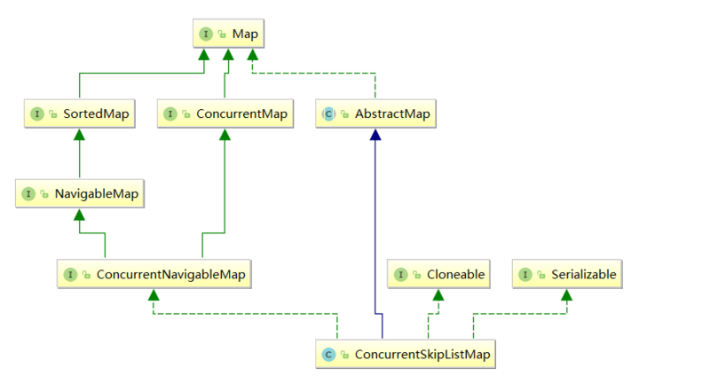
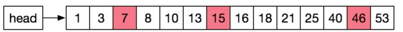
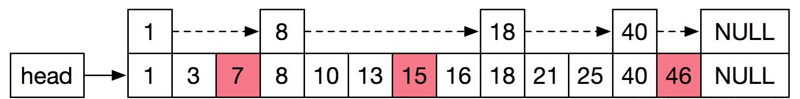
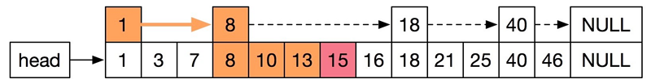
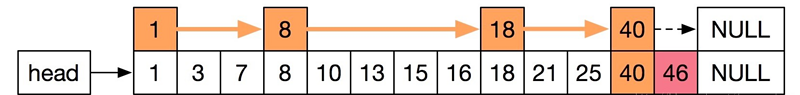
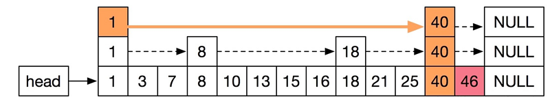
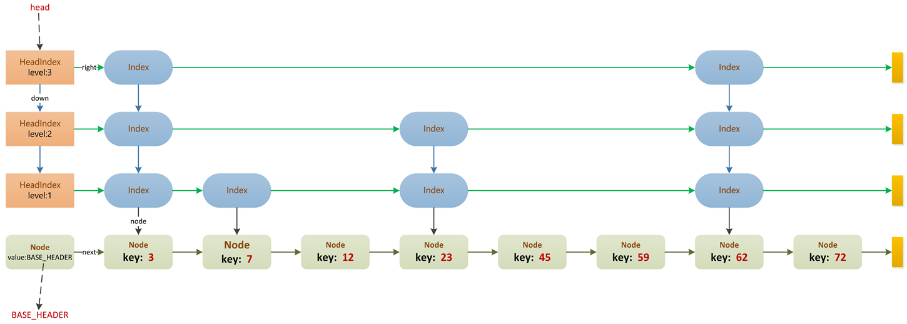
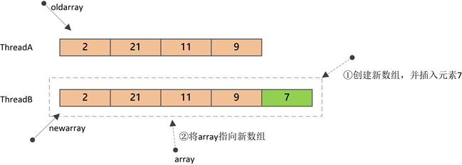
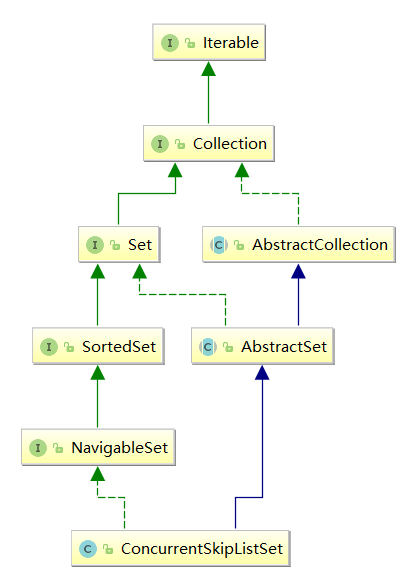

[https://segmentfault.com/a/1190000015558984](https://segmentfault.com/a/1190000015558984)


# juc-collections 集合框架

这里的juc-collections集合框架，是指`java.util.concurrent`包下的一些同步集合类，按类型划分可以分为：**符号表**、**队列**、**Set集合**、**列表**四大类，每个类都有自己适合的使用场景，整个juc-collections集合框架的结构如下图：


阻塞队列：

| 队列特性 | 有界队列           | 近似无界队列                             | 无界队列            | 特殊队列                          |
| :------- | :----------------- | :--------------------------------------- | :------------------ | :-------------------------------- |
| 有锁算法 | ArrayBlockingQueue | LinkedBlockingQueue、LinkedBlockingDeque | /                   | PriorityBlockingQueue、DelayQueue |
| 无锁算法 | /                  | /                                        | LinkedTransferQueue | SynchronousQueue                  |


## 队列

队列分类有 阻塞队列，延迟队列，优先队列，双端队列，有界队列，无界队列，同步队列


### 队列顶层接口 Queue

```java
/* @see java.util.Collection
 * @see LinkedList
 * @see PriorityQueue
 * @see java.util.concurrent.LinkedBlockingQueue
 * @see java.util.concurrent.BlockingQueue
 * @see java.util.concurrent.ArrayBlockingQueue
 * @see java.util.concurrent.LinkedBlockingQueue
 * @see java.util.concurrent.PriorityBlockingQueue
 * @since 1.5
 * @author Doug Lea
 * @param <E> the type of elements held in this collection
 */
public interface Queue<E> extends Collection<E> {

    //将指定的元素插入到此队列中
    boolean add(E e);

    //将指定的元素插入到此队列中
    boolean offer(E e);

    //检索并删除此队列的头。队列为空则抛出异常
    E remove();

    //检索并删除此队列的头，如果此队列为空，则返回{@code null}。
    E poll();

    //检索但不删除此队列的头，如果此队列为空，抛出异常。
    E element();
    
    //检索但不删除此队列的头，如果此队列为空，则返回{@code null}。
    E peek();
}
```


### 阻塞队列接口BlockingQueue

“阻塞队列”通常利用了“锁”来实现，也就是会阻塞调用线程，其使用场景一般是在**“生产者-消费者”**模式中，用于线程之间的数据交换或系统解耦。

```java
public interface BlockingQueue<E> extends Queue<E> {
    
    /**
     * 插入元素e至队尾, 如果队列已满, 则阻塞调用线程直到队列有空闲空间.
     */
    void put(E e) throws InterruptedException;

    /**
     * 插入元素e至队列, 如果队列已满, 则限时阻塞调用线程，直到队列有空闲空间或超时.
     */
    boolean offer(E e, long timeout, TimeUnit unit)
        throws InterruptedException;

    /**
     * 从队首删除元素，如果队列为空, 则阻塞调用线程直到队列中有元素.
     */
    E take() throws InterruptedException;

    /**
     * 从队首删除元素，如果队列为空, 则限时阻塞调用线程，直到队列中有元素或超时.
     */
    E poll(long timeout, TimeUnit unit) throws InterruptedException;
    
    //......
}
```


| 操作类型 | 抛出异常  | 返回特殊值 | 阻塞线程 | 超时                 |
| :------- | :-------- | :--------- | :------- | :------------------- |
| 插入     | add(e)    | offer(e)   | put(e)   | offer(e, time, unit) |
| 删除     | remove()  | poll()     | take()   | poll(time, unit)     |
| 读取     | element() | peek()     | /        | /                    |


对于每种基本方法，“抛出异常”和“返回特殊值”的方法定义和Queue是完全一样的。

**BlockingQueue只是增加了两类和阻塞相关的方法**：

`put(e)`、`take()`；`offer(e, time, unit)`、`poll(time, unit)`。


`BlockingQueue`还具有以下特点：

- `BlockingQueue`队列中不能包含`null`元素；
- `BlockingQueue`接口的实现类都必须是线程安全的，实现类一般通过“锁”保证线程安全；
- `BlockingQueue` 可以是限定容量的。`remainingCapacity`()方法用于返回剩余可用容量，对于没有容量限制的`BlockingQueue`实现，该方法总是返回`Integer.MAX_VALUE` 。


### 阻塞队列实现类


#### ArrayBlockingQueue
    

```java
public class ArrayBlockingQueue<E> extends AbstractQueue<E>
        implements BlockingQueue<E>, java.io.Serializable {
	/**
     * 内部数组
     */
    final Object[] items;

    /**
     * 下一个待删除位置的索引: take, poll, peek, remove方法使用
     */
    int takeIndex;

    /**
     * 下一个待插入位置的索引: put, offer, add方法使用
     */
    int putIndex;

    /**
     * 队列中的元素个数
     */
    int count;

    /**
     * 全局锁
     */
    final ReentrantLock lock;

    /**
     * 非空条件队列：当队列空时，线程在该队列等待获取
     */
    private final Condition notEmpty;

    /**
     * 非满条件队列：当队列满时，线程在该队列等待插入
     */
    private final Condition notFull;
}
```


ArrayBlockingQueue是一种**有界阻塞队列**，在初始构造的时候需要指定队列的容量。具有如下特点：

1. 队列的容量一旦在构造时指定，后续不能改变；
2. 插入元素时，在队尾进行；删除元素时，在队首进行；
3. 队列满时，调用特定方法插入元素会阻塞线程；队列空时，删除元素也会阻塞线程；
4. 支持公平/非公平策略，默认为非公平策略。

> *这里的公平策略，是指当线程从阻塞到唤醒后，以最初请求的顺序（FIFO）来添加或删除元素；非公平策略指线程被唤醒后，谁先抢占到锁，谁就能往队列中添加/删除顺序，是随机的。*


总结：

1. ArrayBlockingQueue的内部数组其实是一种环形结构。
2. ArrayBlockingQueue利用了ReentrantLock来保证线程的安全性，针对队列的修改都需要加全局锁。在一般的应用场景下已经足够。对于超高并发的环境，由于生产者-消息者共用一把锁，可能出现性能瓶颈。
3. ArrayBlockingQueue是有界的，且在初始时指定队列大小


#### LinkedBlockingQueue


- **近似有界阻塞队列**，为什么说近似？因为LinkedBlockingQueue既可以在初始构造时就指定队列的容量，也可以不指定，如果不指定，那么它的容量大小默认为`Integer.MAX_VALUE`。

- 底层基于**单链表**实现的。
- 不能指定公平/非公平策略（默认都是非公平）
- 它维护了两把锁——`takeLock`和`putLock`。

> takeLock用于控制出队的并发，putLock用于入队的并发。
>
> 这也就意味着，同一时刻，只能有一个线程能执行入队/出队操作，其余入队/出队线程会被阻塞；
>
> 但是，入队和出队之间可以并发执行，即同一时刻，可以同时有一个线程进行入队，另一个线程进行出队，这样就可以提升吞吐量。


```java
public class LinkedBlockingQueue<E> extends AbstractQueue<E>
    implements BlockingQueue<E>, java.io.Serializable {

    /**
     * 队列容量.
     * 如果不指定, 则为Integer.MAX_VALUE
     */
    private final int capacity;

    /**
     * 队列中的元素个数(使用AtomicInteger以保证入队/出队并发修改元素时的数据一致性。)
     */
    private final AtomicInteger count = new AtomicInteger();

    /**
     * 队首指针.
     * head.item == null
     */
    transient Node<E> head;

    /**
     * 队尾指针.
     * last.next == null
     */
    private transient Node<E> last;

    /**
     * 出队锁
     */
    private final ReentrantLock takeLock = new ReentrantLock();

    /**
     * 队列空时，出队线程在该条件队列等待
     */
    private final Condition notEmpty = takeLock.newCondition();

    /**
     * 入队锁
     */
    private final ReentrantLock putLock = new ReentrantLock();

    /**
     * 队列满时，入队线程在该条件队列等待
     */
    private final Condition notFull = putLock.newCondition();

    /**
     * 链表结点定义
     */
    static class Node<E> {
        E item;

        Node<E> next;   // 后驱指针

        Node(E x) {
            item = x;
        }
    }

    //...
}
```


构造完成后，LinkedBlockingQueue的初始结构如下：


插入部分元素后的LinkedBlockingQueue结构：


#### LinkedBlockingDeque


#### PriorityBlockingQueue


基于堆的优先级阻塞队列，底层基于**堆**实现


PriorityBlockingQueue是一种**无界阻塞队列**，在构造的时候可以指定队列的初始容量。具有如下特点：

1. PriorityBlockingQueue与之前介绍的阻塞队列最大的不同之处就是：它是一种**优先级队列**，也就是说元素并不是以FIFO的方式出/入队，而是以按照权重大小的顺序出队；
2. PriorityBlockingQueue是真正的无界队列（仅受内存大小限制），它不像ArrayBlockingQueue那样构造时必须指定最大容量，也不像LinkedBlockingQueue默认最大容量为`Integer.MAX_VALUE`；
3. 由于PriorityBlockingQueue是按照元素的权重进入排序，所以队列中的元素必须是可以比较的，也就是说元素必须实现`Comparable`接口；
4. 由于PriorityBlockingQueue无界队列，所以插入元素永远不会阻塞线程；
5. PriorityBlockingQueue底层是一种**基于数组实现的堆结构**。


> **注意**：*堆分为“大顶堆”和“小顶堆”，PriorityBlockingQueue会依据元素的比较方式选择构建大顶堆或小顶堆。比如：如果元素是Integer这种引用类型，那么默认就是“小顶堆”，也就是每次出队都会是当前队列最小的元素。*


```java
public class PriorityBlockingQueue<E> extends AbstractQueue<E>
        implements BlockingQueue<E>, java.io.Serializable {
 
    /**
     * 默认容量.
     */
    private static final int DEFAULT_INITIAL_CAPACITY = 11;
 
    /**
     * 最大容量.
     */
    private static final int MAX_ARRAY_SIZE = Integer.MAX_VALUE - 8;
 
    /**
     * 内部堆数组, 保存实际数据, 可以看成一颗二叉树:
     * 对于顶点queue[n], queue[2*n+1]表示左子结点, queue[2*(n+1)]表示右子结点.
     */
    private transient Object[] queue;
 
    /**
     * 队列中的元素个数.
     */
    private transient int size;
 
    /**
     * 比较器, 如果为null, 表示以元素自身的自然顺序进行比较（元素必须实现Comparable接口）.
     */
    private transient Comparator<? super E> comparator;
 
    /**
     * 全局锁.
     */
    private final ReentrantLock lock;
 
    /**
     * 当队列为空时，出队线程在该条件队列上等待.
     * 
     * PriorityBlockingQueue只有一个条件等待队列,
     * 	因为构造时不会限制最大容量且会自动扩容，所以插入元素并不会阻塞，
     * 	仅当队列为空时，才可能阻塞“出队”线程。
     */
    private final Condition notEmpty;
 
    // ...
}
```


#### DelayQueue


底层基于已有的`PriorityBlockingQueue`实现的**无界阻塞队列**；

`DelayQueue`中的所有元素必须实现`Delayed`接口

如果一个类实现了`Delayed`接口，当创建该类的对象并添加到`DelayQueue`中后，**只有当该对象的getDalay方法返回的剩余时间≤0时才会出队**。

由于`DelayQueue`内部委托了`PriorityBlockingQueue`对象来实现所有方法，所以能以堆的结构维护元素顺序，这样剩余时间最小的元素就在堆顶，**每次出队其实就是删除剩余时间≤0的最小元素**。


```java
public class DelayQueue<E extends Delayed> extends AbstractQueue<E>
    implements BlockingQueue<E> {

    private final transient ReentrantLock lock = new ReentrantLock();
    
    private final PriorityQueue<E> q = new PriorityQueue<E>();
    
    /**
     * leader线程是首个尝试出队元素（队列不为空）但被阻塞的线程.
     * 该线程会限时等待（队首元素的剩余有效时间），用于唤醒其它等待线程
     */
    private Thread leader = null;

	//出队线程条件队列, 当有多个线程, 会在此条件队列上等待.
    private final Condition available = lock.newCondition();
}
```


```java
//实现Comparable接口则是为了能够比较两个对象，以便排序。
public interface Delayed extends Comparable<Delayed> {
    long getDelay(TimeUnit unit);
}
```


为了提升性能，DelayQueue并不会让所有出队线程都无限等待，而是用`leader`保存了第一个尝试出队的线程，该线程的等待时间是队首元素的剩余有效期。这样，一旦leader线程被唤醒（此时队首元素也失效了），就可以出队成功，然后唤醒一个其它在`available`条件队列上等待的线程。之后，会重复上一步，新唤醒的线程可能取代成为新的leader线程。这样，就避免了无效的等待，提升了性能。


#### SynchronousQueue


底层基于**栈**和**队列**实现


特点简要概括如下：

1. 入队线程和出队线程**必须一一匹配**，否则任意先到达的线程会阻塞。比如ThreadA进行入队操作，在有其它线程执行出队操作之前，ThreadA会一直等待，反之亦然；
2. `SynchronousQueue`内部不保存任何元素，也就是说它的容量为0，数据直接在配对的生产者和消费者线程之间传递，不会将数据缓冲到队列中。（在内部通过栈或队列结构保存阻塞线程）
3. `SynchronousQueue`支持公平/非公平策略。其中非公平模式，基于内部数据结构——“栈”来实现，公平模式，基于内部数据结构——“队列”来实现；
4. SynchronousQueue基于一种名为“[Dual stack and Dual queue](http://www.cs.rochester.edu/research/synchronization/pseudocode/duals.html)”的无锁算法实现。


```java
public class SynchronousQueue<E> extends AbstractQueue<E>
    implements BlockingQueue<E>, java.io.Serializable {
    
    private static final long serialVersionUID = -3223113410248163686L;
    
    
    
}
```


#### LinkedTransferQueue


### 同步队列


#### ConcurrentLinkedQueue


底层是基于单链表实现的。

在实现上并没有利用锁或底层同步原语，而是完全基于**自旋+CAS**的方式实现了该队列。（如同AQS，AQS内部的CLH等待队列也是利用了这种方式。）


```java
public class ConcurrentLinkedQueue<E> extends AbstractQueue<E>
    implements Queue<E>, java.io.Serializable {
 
    /**
     * 队列头指针
     */
    private transient volatile Node<E> head;
 
    /**
     * 队列尾指针.
     */
    private transient volatile Node<E> tail;
 
    // Unsafe mechanics
     
    private static final sun.misc.Unsafe UNSAFE;
    private static final long headOffset;
    private static final long tailOffset;
     
    static {
        try {
            UNSAFE = sun.misc.Unsafe.getUnsafe();
            Class<?> k = ConcurrentLinkedQueue.class;
            headOffset = UNSAFE.objectFieldOffset (k.getDeclaredField("head"));
            tailOffset = UNSAFE.objectFieldOffset (k.getDeclaredField("tail"));
        } catch (Exception e) {
            throw new Error(e);
        }
    }
 
    /**
     * 队列结点定义
     */
    private static class Node<E> {
        volatile E item;        // 元素值
        volatile Node<E> next;  // 后驱指针
 
        Node(E item) {
            UNSAFE.putObject(this, itemOffset, item);
        }
 
        boolean casItem(E cmp, E val) {
            return UNSAFE.compareAndSwapObject(this, itemOffset, cmp, val);
        }
 
        void lazySetNext(Node<E> val) {
            UNSAFE.putOrderedObject(this, nextOffset, val);
        }
 
        boolean casNext(Node<E> cmp, Node<E> val) {
            return UNSAFE.compareAndSwapObject(this, nextOffset, cmp, val);
        }
 
        // Unsafe mechanics
 
        private static final sun.misc.Unsafe UNSAFE;
        private static final long itemOffset;
        private static final long nextOffset;
 
        static {
            try {
                UNSAFE = sun.misc.Unsafe.getUnsafe();
                Class<?> k = Node.class;
                itemOffset = UNSAFE.objectFieldOffset(k.getDeclaredField("item"));
                nextOffset = UNSAFE.objectFieldOffset(k.getDeclaredField("next"));
            } catch (Exception e) {
                throw new Error(e);
            }
        }
    }
 
     /**
     * 入队一个元素.
     *
     * @throws NullPointerException 元素不能为null
     */
    public boolean add(E e) {
        return offer(e);
    }
    
    /**
     * 在队尾入队元素e, 直到成功
     */
    public boolean offer(E e) {
        checkNotNull(e);
        final Node<E> newNode = new Node<E>(e);
        for (Node<E> t = tail, p = t; ; ) {// 自旋, 直到插入结点成功
            Node<E> q = p.next;
            if (q == null) {// CASE1: 正常情况下, 新结点直接插入到队尾
                if (p.casNext(null, newNode)) {
                    // CAS竞争插入成功
                    if (p != t)// CAS竞争失败的线程会在下一次自旋中进入该逻辑
                        casTail(t, newNode);// 重新设置队尾指针tail
                    return true;
                }
                // CAS竞争插入失败,则进入下一次自旋

            } else if (p == q)// CASE2: 发生了出队操作
                p = (t != (t = tail)) ? t : head;
            else
                // 将p重新指向队尾结点
                p = (p != t && t != (t = tail)) ? t : q;
        }
    }
    //...
}
```


#### ConcurrentLinkedDeque

在JDK1.7之前，除了`Stack`类外，并没有其它适合并发环境的“栈”数据结构。`ConcurrentLinkedDeque`作为双端队列，可以当作“栈”来使用，并且高效地支持并发环境。

和ConcurrentLinkedQueue一样，采用了无锁算法，底层基于**自旋+CAS**的方式实现。

双链表结构


```java
public class ConcurrentLinkedDeque<E> extends AbstractCollection<E>
    implements Deque<E>, java.io.Serializable {

    /**
     * 头指针
     */
    private transient volatile Node<E> head;

    /**
     * 尾指针
     */
    private transient volatile Node<E> tail;

    private static final Node<Object> PREV_TERMINATOR, NEXT_TERMINATOR;
    
    // Unsafe mechanics
    private static final sun.misc.Unsafe UNSAFE;
    private static final long headOffset;
    private static final long tailOffset;

    static {
        PREV_TERMINATOR = new Node<Object>();
        PREV_TERMINATOR.next = PREV_TERMINATOR;
        NEXT_TERMINATOR = new Node<Object>();
        NEXT_TERMINATOR.prev = NEXT_TERMINATOR;
        try {
            UNSAFE = sun.misc.Unsafe.getUnsafe();
            Class<?> k = ConcurrentLinkedDeque.class;
            headOffset = UNSAFE.objectFieldOffset(k.getDeclaredField("head"));
            tailOffset = UNSAFE.objectFieldOffset(k.getDeclaredField("tail"));
        } catch (Exception e) {
            throw new Error(e);
        }
    }
    
    /**
     * 双链表结点定义
     */
    static final class Node<E> {
        volatile Node<E> prev;  // 前驱指针
        volatile E item;        // 结点值
        volatile Node<E> next;  // 后驱指针

        Node() {
        }

        Node(E item) {
            UNSAFE.putObject(this, itemOffset, item);
        }

        boolean casItem(E cmp, E val) {
            return UNSAFE.compareAndSwapObject(this, itemOffset, cmp, val);
        }

        void lazySetNext(Node<E> val) {
            UNSAFE.putOrderedObject(this, nextOffset, val);
        }

        boolean casNext(Node<E> cmp, Node<E> val) {
            return UNSAFE.compareAndSwapObject(this, nextOffset, cmp, val);
        }

        void lazySetPrev(Node<E> val) {
            UNSAFE.putOrderedObject(this, prevOffset, val);
        }

        boolean casPrev(Node<E> cmp, Node<E> val) {
            return UNSAFE.compareAndSwapObject(this, prevOffset, cmp, val);
        }

        // Unsafe mechanics

        private static final sun.misc.Unsafe UNSAFE;
        private static final long prevOffset;
        private static final long itemOffset;
        private static final long nextOffset;

        static {
            try {
                UNSAFE = sun.misc.Unsafe.getUnsafe();
                Class<?> k = Node.class;
                prevOffset = UNSAFE.objectFieldOffset(k.getDeclaredField("prev"));
                itemOffset = UNSAFE.objectFieldOffset(k.getDeclaredField("item"));
                nextOffset = UNSAFE.objectFieldOffset(k.getDeclaredField("next"));
            } catch (Exception e) {
                throw new Error(e);
            }
        }
    }
    
    // ...
}
```


## juc并发map


### ConcurrentHashMap


### ConcurrentSkipListMap


ConcurrentSkipListMap的类继承图




我们知道，一般的Map都是无序的，也就是只能通过键的hash值进行定位。JDK为了实现有序的Map，提供了一个**SortedMap**接口，SortedMap提供了一些根据键范围进行查找的功能，比如返回整个Map中 key最小/大的键、返回某个范围内的子Map视图等等。

为了进一步对有序Map进行增强，JDK又引入了**NavigableMap**接口，该接口进一步扩展了SortedMap的功能，提供了根据指定Key返回最接近项、按升序/降序返回所有键的视图等功能。

同时，也提供了一个基于NavigableMap的实现类——**TreeMap**，TreeMap底层基于红黑树设计，是一种有序的Map。


#### ConcurrentNavigableMap接口


为了对高并发环境下的有序Map提供更好的支持，J.U.C新增了一个`ConcurrentNavigableMap`接口


```java
public interface ConcurrentNavigableMap<K,V>
    extends ConcurrentMap<K,V>, NavigableMap<K,V> {

    ConcurrentNavigableMap<K,V> subMap(K fromKey, boolean fromInclusive,
                                       K toKey,   boolean toInclusive);

    ConcurrentNavigableMap<K,V> headMap(K toKey, boolean inclusive);

    ConcurrentNavigableMap<K,V> tailMap(K fromKey, boolean inclusive);

    ConcurrentNavigableMap<K,V> subMap(K fromKey, K toKey);

    ConcurrentNavigableMap<K,V> headMap(K toKey);

    ConcurrentNavigableMap<K,V> tailMap(K fromKey);

    ConcurrentNavigableMap<K,V> descendingMap();

    public NavigableSet<K> navigableKeySet();

    NavigableSet<K> keySet();

    public NavigableSet<K> descendingKeySet();
}
```


J.U.C提供了基于`ConcurrentNavigableMap`接口的一个实现——`ConcurrentSkipListMap`。`ConcurrentSkipListMap`可以看成是并发版本的`TreeMap`，但是和`TreeMap`不同是，`ConcurrentSkipListMap`并不是基于红黑树实现的，其底层是一种类似**跳表（Skip List）**的结构。


#### Skip List简介


**Skip List**（以下简称跳表），是一种类似链表的数据结构，其查询/插入/删除的时间复杂度都是`O(logn)`。

我们知道，通常意义上的链表是不能支持随机访问的（通过索引快速定位），其查找的时间复杂度是`O(n)`，而数组这一可支持随机访问的数据结构，虽然查找很快，但是插入/删除元素却需要移动插入点后的所有元素，时间复杂度为`O(n)`。

为了解决这一问题，引入了树结构，树的增删改查效率比较平均，一棵平衡二叉树（AVL）的增删改查效率一般为`O(logn)`，比如工业上常用红黑树作为AVL的一种实现。

但是，AVL的实现一般都比较复杂，插入/删除元素可能涉及对整个树结构的修改，特别是并发环境下，通常需要全局锁来保证AVL的线程安全，于是又出现了一种类似链表的数据结构——**跳表**。


我们先来看下传统的单链表：




上图的单链表中（省去了结点之间的链接），当想查找7、15、46这三个元素时，必须从头指针head开始，遍历整个单链表，其查找复杂度很低，为`O(n)`。


来看下**Skip List**的数据结构是什么样的：




上图是Skip List一种可能的结构，它分了2层，假设我们要查找**“15”**这个元素，那么整个步骤如下：

1. 从头指针**head**开始，找到第一个结点的最上层，发现其指向的下个结点值为8，小于15，则直接从1结点跳到8结点。
2. 8结点最上层指向的下一结点值为18，大于15，则从8结点的下一层开始查找。
3. 从8结点的最下层一直向后查找，依次经过10、13，最后找到15结点。


上述整个查找路径如下图标黄部分所示：




同理，如果要查找**“46”**这个元素，则整个查找路径如下图标黄部分所示：




上面就是跳跃表的基本思想了，每个结点不仅仅只包含指向下一个结点的指针，可能还包含很多个其它指向后续结点的指针。并且，一个结点本身可以看成是一个链表（自上向下链接）。这样就可以跳过一些不必要的结点，从而加快查找、删除等操作，这其实是一种**“空间换时间”**的算法设计思想。


**那么一个结点可以包含多少层呢？** 比如，Skip List也可能是下面这种包含3层的结构(在一个3层Skip List中查找元素“46”)：




层数是根据一种随机算法得到的，为了不让层数过大，还会有一个最大层数**MAX_LEVEL**限制，随机算法生成的层数不得大于该值。后面讲**ConcurrentSkipListMap**时，我们会具体分析。


**总结**

1. 跳表由很多层组成；
2. 每一层都是一个有序链表；
3. 对于每一层的任意结点，不仅有指向下一个结点的指针，也有指向其下一层的指针。


#### ConcurrentSkipListMap的内部结构





内部一共定义了3种不同类型的结点，元素的增删改查都从最上层的head指针指向的结点开始：

```java
public class ConcurrentSkipListMap2<K, V> extends AbstractMap<K, V>
    implements ConcurrentNavigableMap<K, V>, Cloneable, Serializable {
    /**
     * 最底层链表的头指针BASE_HEADER
     */
    private static final Object BASE_HEADER = new Object();

    /**
     * 最上层链表的头指针head
     */
    private transient volatile HeadIndex<K, V> head;

    /* ---------------- 普通结点Node定义 -------------- */
    static final class Node<K, V> {
        final K key;
        volatile Object value;
        volatile Node<K, V> next;

        // ...
    }

    /* ---------------- 索引结点Index定义 -------------- */
    static class Index<K, V> {
        final Node<K, V> node;      // node指向最底层链表的Node结点
        final Index<K, V> down;     // down指向下层Index结点
        volatile Index<K, V> right; // right指向右边的Index结点

        // ...
    }

    /* ---------------- 头索引结点HeadIndex -------------- */
    static final class HeadIndex<K, V> extends Index<K, V> {
        final int level;    // 层级

        // ...
    }
}
```


**普通结点：Node**

​	Node结点，也就是**ConcurrentSkipListMap**最底层链表中的结点，保存着实际的键值对，如果单独看底层链，其实就是一个按照Key有序排列的单链表（见示意图中的最下层节点）


**索引结点：Index**

​	Index结点是除底层链外，其余各层链表中的非头结点（见示意图中的蓝色结点）。


**头索引结点：HeadIndex**

​	HeadIndex结点是各层链表的头结点，它是Index类的子类，唯一的区别是增加了一个`level`字段，用于表示当前链表的级别，越往上层，level值越大。


## list


`ArrayList`是一种“列表”数据机构，其底层是通过**数组**来实现元素的**随机访问**。JDK1.5之前，如果想要在并发环境下使用“列表”，一般有以下3种方式：

1. 使用**Vector**类
2. 使用`Collections.synchronizedList`返回一个同步代理类；
3. 自己实现**ArrayList**的子类，并进行同步/加锁。

前两种方式都相当于加了一把“全局锁”，访问任何方法都需要首先获取锁。第3种方式，需要自己实现，复杂度较高。


### CopyOnWriteArrayList


大多数业务场景都是一种**“读多写少”**的情形，**CopyOnWriteArrayList**就是为适应这种场景而诞生的。

CopyOnWriteArrayList，运用了一种**“写时复制”**的思想。通俗的理解就是当我们需要修改（增/删/改）列表中的元素时，不直接进行修改，而是先将列表Copy，然后在新的副本上进行修改，修改完成之后，再将引用从原列表指向新列表。

这样做的好处是**读/写是不会冲突**的，可以并发进行，读操作还是在原列表，写操作在新列表。仅仅当有多个线程同时进行写操作时，才会进行同步。


```java
public class CopyOnWriteArrayList<E>
    implements List<E>, RandomAccess, Cloneable, java.io.Serializable {
    private static final long serialVersionUID = 8673264195747942595L;

    final transient ReentrantLock lock = new ReentrantLock();

    private transient volatile Object[] array;

    public CopyOnWriteArrayList() {
        setArray(new Object[0]);
    }

    public CopyOnWriteArrayList(Collection<? extends E> c) {
        Object[] elements;
        if (c.getClass() == CopyOnWriteArrayList.class)
            elements = ((CopyOnWriteArrayList<?>)c).getArray();
        else {
            elements = c.toArray();
            // c.toArray might (incorrectly) not return Object[] (see 6260652)
            if (elements.getClass() != Object[].class)
                elements = Arrays.copyOf(elements, elements.length, Object[].class);
        }
        setArray(elements);
    }

    public CopyOnWriteArrayList(E[] toCopyIn) {
        setArray(Arrays.copyOf(toCopyIn, toCopyIn.length, Object[].class));
    }
    
    public boolean add(E e) {
        final ReentrantLock lock = this.lock;
        lock.lock();
        try {
            Object[] elements = getArray();     // 旧数组
            int len = elements.length;
            Object[] newElements = Arrays.copyOf(elements, len + 1);    // 复制并创建新数组
            newElements[len] = e;               // 将元素插入到新数组末尾
            setArray(newElements);              // 内部array引用指向新数组
            return true;
        } finally {
            lock.unlock();
        }
    }
}
```


**add**方法首先会进行加锁，保证只有一个线程能进行修改；然后会创建一个新数组（大小为`n+1`），并将原数组的值复制到新数组，新元素插入到新数组的最后；最后，将字段`array`指向新数组。




上图中，ThreadB对Array的修改由于是在新数组上进行的，所以并不会对ThreadA的读操作产生影响。


## set


### ConcurrentSkipListSet


`ConcurrentSkipListSet`实现了`NavigableSet`接口，`ConcurrentSkipListMap`实现了`NavigableMap`接口，以提供和排序相关的功能，维持元素的有序性，所以**ConcurrentSkipListSet**就是一种为并发环境设计的有序`SET`工具类。


**ConcurrentSkipListSet**的实现非常简单，其内部引用了一个`ConcurrentSkipListMap`对象，所有API方法均委托`ConcurrentSkipListMap`对象完成




```java
public class ConcurrentSkipListSet<E> extends AbstractSet<E>
    implements NavigableSet<E>, Cloneable, java.io.Serializable {

    private final ConcurrentNavigableMap<E, Object> m;

    public ConcurrentSkipListSet() {
        m = new ConcurrentSkipListMap<E, Object>();
    }

    public ConcurrentSkipListSet(Comparator<? super E> comparator) {
        m = new ConcurrentSkipListMap<E, Object>(comparator);
    }

    public ConcurrentSkipListSet(Collection<? extends E> c) {
        m = new ConcurrentSkipListMap<E, Object>();
        addAll(c);
    }

    public ConcurrentSkipListSet(SortedSet<E> s) {
        m = new ConcurrentSkipListMap<E, Object>(s.comparator());
        addAll(s);
    }

    ConcurrentSkipListSet(ConcurrentNavigableMap<E, Object> m) {
        this.m = m;
    }
    
    // ...
}
```


从上述代码可以看出，**ConcurrentSkipListSet**在构造时创建了一个ConcurrentSkipListMap对象，并由字段m引用，所以其实ConcurrentSkipListSet就是一种**跳表类型**的数据结构，其平均增删改查的时间复杂度均为`O(logn)`。


### CopyOnWriteArraySet


`CopyOnWriteArraySet`，是另一类适合并发环境的SET工具类，也是基于“**写时复制**”的思想。事实上，`CopyOnWriteArraySet`内部引用了一个`CopyOnWriteArrayList`对象，以“组合”方式，委托`CopyOnWriteArrayList`对象实现了所有API功能。


```java
public class CopyOnWriteArraySet<E> extends AbstractSet<E>
    implements java.io.Serializable {

    private final CopyOnWriteArrayList<E> al;

    public CopyOnWriteArraySet() {
        al = new CopyOnWriteArrayList<E>();
    }

    public CopyOnWriteArraySet(Collection<? extends E> c) {
        if (c.getClass() == CopyOnWriteArraySet.class) {
            CopyOnWriteArraySet<E> cc = (CopyOnWriteArraySet<E>) c;
            al = new CopyOnWriteArrayList<E>(cc.al);
        } else {
            al = new CopyOnWriteArrayList<E>();
            al.addAllAbsent(c);
        }
    }
    // ...
}
```


`CopyOnWriteArraySet`不允许含有重复元素，所以添加元素（`add`方法）时，内部调用了`CopyOnWriteArrayList`的`addAllAbsent`方法。