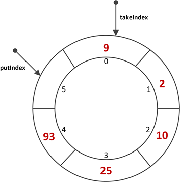

[https://segmentfault.com/a/1190000015558984](https://segmentfault.com/a/1190000015558984)


# juc-collections 集合框架

这里的juc-collections集合框架，是指`java.util.concurrent`包下的一些同步集合类，按类型划分可以分为：**符号表**、**队列**、**Set集合**、**列表**四大类，每个类都有自己适合的使用场景，整个juc-collections集合框架的结构如下图：


阻塞队列：

| 队列特性 | 有界队列           | 近似无界队列                             | 无界队列            | 特殊队列                          |
| :------- | :----------------- | :--------------------------------------- | :------------------ | :-------------------------------- |
| 有锁算法 | ArrayBlockingQueue | LinkedBlockingQueue、LinkedBlockingDeque | /                   | PriorityBlockingQueue、DelayQueue |
| 无锁算法 | /                  | /                                        | LinkedTransferQueue | SynchronousQueue                  |


## 队列

队列分类有 阻塞队列，延迟队列，优先队列，双端队列，有界队列，无界队列，同步队列


### 队列顶层接口 Queue

```java
/* @see java.util.Collection
 * @see LinkedList
 * @see PriorityQueue
 * @see java.util.concurrent.LinkedBlockingQueue
 * @see java.util.concurrent.BlockingQueue
 * @see java.util.concurrent.ArrayBlockingQueue
 * @see java.util.concurrent.LinkedBlockingQueue
 * @see java.util.concurrent.PriorityBlockingQueue
 * @since 1.5
 * @author Doug Lea
 * @param <E> the type of elements held in this collection
 */
public interface Queue<E> extends Collection<E> {

    //将指定的元素插入到此队列中
    boolean add(E e);

    //将指定的元素插入到此队列中
    boolean offer(E e);

    //检索并删除此队列的头。队列为空则抛出异常
    E remove();

    //检索并删除此队列的头，如果此队列为空，则返回{@code null}。
    E poll();

    //检索但不删除此队列的头，如果此队列为空，抛出异常。
    E element();
    
    //检索但不删除此队列的头，如果此队列为空，则返回{@code null}。
    E peek();
}
```


### 阻塞队列接口BlockingQueue

“阻塞队列”通常利用了“锁”来实现，也就是会阻塞调用线程，其使用场景一般是在**“生产者-消费者”**模式中，用于线程之间的数据交换或系统解耦。

```java
public interface BlockingQueue<E> extends Queue<E> {
    
    /**
     * 插入元素e至队尾, 如果队列已满, 则阻塞调用线程直到队列有空闲空间.
     */
    void put(E e) throws InterruptedException;

    /**
     * 插入元素e至队列, 如果队列已满, 则限时阻塞调用线程，直到队列有空闲空间或超时.
     */
    boolean offer(E e, long timeout, TimeUnit unit)
        throws InterruptedException;

    /**
     * 从队首删除元素，如果队列为空, 则阻塞调用线程直到队列中有元素.
     */
    E take() throws InterruptedException;

    /**
     * 从队首删除元素，如果队列为空, 则限时阻塞调用线程，直到队列中有元素或超时.
     */
    E poll(long timeout, TimeUnit unit) throws InterruptedException;
    
    //......
}
```


| 操作类型 | 抛出异常  | 返回特殊值 | 阻塞线程 | 超时                 |
| :------- | :-------- | :--------- | :------- | :------------------- |
| 插入     | add(e)    | offer(e)   | put(e)   | offer(e, time, unit) |
| 删除     | remove()  | poll()     | take()   | poll(time, unit)     |
| 读取     | element() | peek()     | /        | /                    |


对于每种基本方法，“抛出异常”和“返回特殊值”的方法定义和Queue是完全一样的。

**BlockingQueue只是增加了两类和阻塞相关的方法**：

`put(e)`、`take()`；`offer(e, time, unit)`、`poll(time, unit)`。


`BlockingQueue`还具有以下特点：

- `BlockingQueue`队列中不能包含`null`元素；
- `BlockingQueue`接口的实现类都必须是线程安全的，实现类一般通过“锁”保证线程安全；
- `BlockingQueue` 可以是限定容量的。`remainingCapacity`()方法用于返回剩余可用容量，对于没有容量限制的`BlockingQueue`实现，该方法总是返回`Integer.MAX_VALUE` 。


### 阻塞队列实现类


#### ArrayBlockingQueue


  public interface BlockingQueue<E> extends Queue<E> {
    
```java
public class ArrayBlockingQueue<E> extends AbstractQueue<E>
        implements BlockingQueue<E>, java.io.Serializable {
	/**
     * 内部数组
     */
    final Object[] items;

    /**
     * 下一个待删除位置的索引: take, poll, peek, remove方法使用
     */
    int takeIndex;

    /**
     * 下一个待插入位置的索引: put, offer, add方法使用
     */
    int putIndex;

    /**
     * 队列中的元素个数
     */
    int count;

    /**
     * 全局锁
     */
    final ReentrantLock lock;

    /**
     * 非空条件队列：当队列空时，线程在该队列等待获取
     */
    private final Condition notEmpty;

    /**
     * 非满条件队列：当队列满时，线程在该队列等待插入
     */
    private final Condition notFull;
}
```


ArrayBlockingQueue是一种**有界阻塞队列**，在初始构造的时候需要指定队列的容量。具有如下特点：

1. 队列的容量一旦在构造时指定，后续不能改变；
2. 插入元素时，在队尾进行；删除元素时，在队首进行；
3. 队列满时，调用特定方法插入元素会阻塞线程；队列空时，删除元素也会阻塞线程；
4. 支持公平/非公平策略，默认为非公平策略。

> *这里的公平策略，是指当线程从阻塞到唤醒后，以最初请求的顺序（FIFO）来添加或删除元素；非公平策略指线程被唤醒后，谁先抢占到锁，谁就能往队列中添加/删除顺序，是随机的。*


总结：

1. ArrayBlockingQueue的内部数组其实是一种环形结构。
2. ArrayBlockingQueue利用了ReentrantLock来保证线程的安全性，针对队列的修改都需要加全局锁。在一般的应用场景下已经足够。对于超高并发的环境，由于生产者-消息者共用一把锁，可能出现性能瓶颈。
3. ArrayBlockingQueue是有界的，且在初始时指定队列大小





#### LinkedBlockingQueue


- **近似有界阻塞队列**，为什么说近似？因为LinkedBlockingQueue既可以在初始构造时就指定队列的容量，也可以不指定，如果不指定，那么它的容量大小默认为`Integer.MAX_VALUE`。

- 底层基于**单链表**实现的。
- 不能指定公平/非公平策略（默认都是非公平）
- 它维护了两把锁——`takeLock`和`putLock`。

> takeLock用于控制出队的并发，putLock用于入队的并发。
>
> 这也就意味着，同一时刻，只能只有一个线程能执行入队/出队操作，其余入队/出队线程会被阻塞；
>
> 但是，入队和出队之间可以并发执行，即同一时刻，可以同时有一个线程进行入队，另一个线程进行出队，这样就可以提升吞吐量。


```java
public class LinkedBlockingQueue<E> extends AbstractQueue<E>
    implements BlockingQueue<E>, java.io.Serializable {

    /**
     * 队列容量.
     * 如果不指定, 则为Integer.MAX_VALUE
     */
    private final int capacity;

    /**
     * 队列中的元素个数(使用AtomicInteger以保证入队/出队并发修改元素时的数据一致性。)
     */
    private final AtomicInteger count = new AtomicInteger();

    /**
     * 队首指针.
     * head.item == null
     */
    transient Node<E> head;

    /**
     * 队尾指针.
     * last.next == null
     */
    private transient Node<E> last;

    /**
     * 出队锁
     */
    private final ReentrantLock takeLock = new ReentrantLock();

    /**
     * 队列空时，出队线程在该条件队列等待
     */
    private final Condition notEmpty = takeLock.newCondition();

    /**
     * 入队锁
     */
    private final ReentrantLock putLock = new ReentrantLock();

    /**
     * 队列满时，入队线程在该条件队列等待
     */
    private final Condition notFull = putLock.newCondition();

    /**
     * 链表结点定义
     */
    static class Node<E> {
        E item;

        Node<E> next;   // 后驱指针

        Node(E x) {
            item = x;
        }
    }

    //...
}
```


构造完成后，LinkedBlockingQueue的初始结构如下：


插入部分元素后的LinkedBlockingQueue结构：


#### LinkedBlockingDeque


#### PriorityBlockingQueue


- 基于堆的优先级阻塞队列，底层基于**堆**实现


PriorityBlockingQueue是一种**无界阻塞队列**，在构造的时候可以指定队列的初始容量。具有如下特点：

1. PriorityBlockingQueue与之前介绍的阻塞队列最大的不同之处就是：它是一种**优先级队列**，也就是说元素并不是以FIFO的方式出/入队，而是以按照权重大小的顺序出队；
2. PriorityBlockingQueue是真正的无界队列（仅受内存大小限制），它不像ArrayBlockingQueue那样构造时必须指定最大容量，也不像LinkedBlockingQueue默认最大容量为`Integer.MAX_VALUE`；
3. 由于PriorityBlockingQueue是按照元素的权重进入排序，所以队列中的元素必须是可以比较的，也就是说元素必须实现`Comparable`接口；
4. 由于PriorityBlockingQueue无界队列，所以插入元素永远不会阻塞线程；
5. PriorityBlockingQueue底层是一种**基于数组实现的堆结构**。


> **注意**：*堆分为“大顶堆”和“小顶堆”，PriorityBlockingQueue会依据元素的比较方式选择构建大顶堆或小顶堆。比如：如果元素是Integer这种引用类型，那么默认就是“小顶堆”，也就是每次出队都会是当前队列最小的元素。*


```java
public class PriorityBlockingQueue<E> extends AbstractQueue<E>
        implements BlockingQueue<E>, java.io.Serializable {
 
    /**
     * 默认容量.
     */
    private static final int DEFAULT_INITIAL_CAPACITY = 11;
 
    /**
     * 最大容量.
     */
    private static final int MAX_ARRAY_SIZE = Integer.MAX_VALUE - 8;
 
    /**
     * 内部堆数组, 保存实际数据, 可以看成一颗二叉树:
     * 对于顶点queue[n], queue[2*n+1]表示左子结点, queue[2*(n+1)]表示右子结点.
     */
    private transient Object[] queue;
 
    /**
     * 队列中的元素个数.
     */
    private transient int size;
 
    /**
     * 比较器, 如果为null, 表示以元素自身的自然顺序进行比较（元素必须实现Comparable接口）.
     */
    private transient Comparator<? super E> comparator;
 
    /**
     * 全局锁.
     */
    private final ReentrantLock lock;
 
    /**
     * 当队列为空时，出队线程在该条件队列上等待.
     * 
     * PriorityBlockingQueue只有一个条件等待队列,
     * 	因为构造时不会限制最大容量且会自动扩容，所以插入元素并不会阻塞，
     * 	仅当队列为空时，才可能阻塞“出队”线程。
     */
    private final Condition notEmpty;
 
    // ...
}
```


#### DelayQueue


### 同步队列


ConcurrentLinkedQueue


ConcurrentLinkedDeque


SynchronousQueue


LinkedTransferQueue


## map


ConcurrentHashMap


ConcurrentSkipListMap


## list


CopyOnWriteArrayList


## set


CopyOnWriteArraySet


ConcurrentSkipListSet