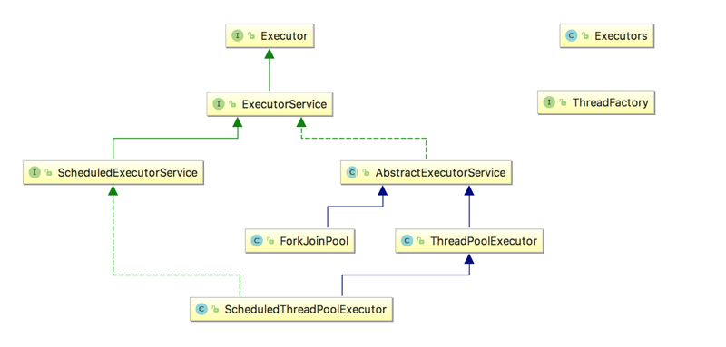
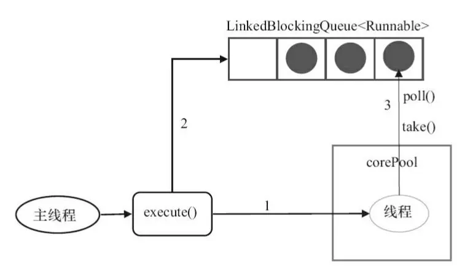
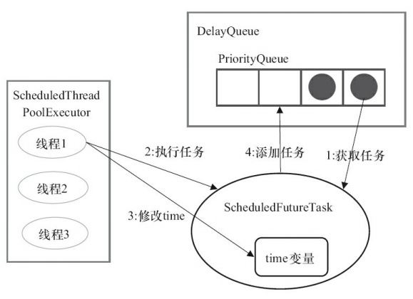

[TOC]

[https://segmentfault.com/a/1190000015558984](https://segmentfault.com/a/1190000015558984)


# executor框架成员关系：



`Runable`:


- 说明：
  - **`Executor`** ：执行器接口， 分离了任务和任务的执行。
  
  - **`ExecutorService`** ：在`Executor`的基础上提供了以下增强
  
    1. 关闭执行器，禁止任务的提交；
    2. 监视执行器的状态；
    3. 提供对异步任务的支持；
    4. 提供对批处理任务的支持。
  
    **`ScheduledExecutorService`** 在`ExecutorService`基础上提供了任务的延迟执行/周期执行的功能。
  
  - **`Executors`** 线程池工厂类。
  
  - **`ThreadFactory`**：线程工厂，用于创建单个线程，减少手工创建线程的繁琐工作，同时能够复用工厂的特性。
  
  - **`AbstractExecutorService`** ：`ExecutorService`的抽象实现，为各类执行器类的实现提供基础。
  
  - **`ThreadPoolExecutor`**：线程池执行器，也是最常用的线程池，可以以线程池的方式管理线程。 `JDK`中线程池的具体实现。
  
  - **`ScheduledThreadPoolExecutor`**：在`ThreadPoolExecutor`基础上，增加了对周期任务调度的支持。
  
  - **`ForkJoinPool`**：Fork/Join线程池，在`JDK1.7`时引入，是实现`Fork/Join`框架的核心类。


# executor框架使用示意图：


- 执行任务需要实现的**Runnable接口**或**Callable接口**。 **Runnable接口**或**Callable接口**实现类都可以被**ThreadPoolExecutor**或**ScheduledThreadPoolExecutor**执行。
- 使用步骤：
  - 主线程首先要创建实现`Runnable`或者`Callable`接口的任务对象。
    - 工具类`Executors`可以实现`Runnable`对象和`Callable`对象之间的相互转换。
    - `Runable`：无返回值；`Callable`：有返回值`Future`
  - 然后可以把创建完成的`Runnable`对象直接交给`ExecutorService`执行
    - `ExecutorService.execute`（Runnable command）
    - `ExecutorService.submit`（Runnable task）
    - `ExecutorService.submit`（Callable task）
  - 最后，主线程可以执行`FutureTask.get()`方法来等待任务执行完成。主线程也可以执行`FutureTask.cancel（boolean mayInterruptIfRunning）`来取消此任务的执行。


# 类和接口

## Executors

- 线程池工厂

```java
public class Executors {

    //创建具有指定并行级别的ForkJoin线程池.
    public static ExecutorService newWorkStealingPool(int parallelism) {
        return new ForkJoinPool
            (parallelism,
             ForkJoinPool.defaultForkJoinWorkerThreadFactory,
             null, true);
    }

    //这个工厂方法是Java8引入的，返回一个ForkJoinPool类型的 executor，
    //它的工作方法与其他常见的execuotr稍有不同。与使用一个固定大小的线程池不同，
    //ForkJoinPools使用一个并行因子数来创建，默认值为主机CPU的可用核心数。
    public static ExecutorService newWorkStealingPool() {
        return new ForkJoinPool
            (Runtime.getRuntime().availableProcessors(),
             ForkJoinPool.defaultForkJoinWorkerThreadFactory,
             null, true);
    }

    //固定大小的线程池
    public static ExecutorService newFixedThreadPool(int nThreads) {
        return new ThreadPoolExecutor(nThreads, nThreads,
                                      0L, TimeUnit.MILLISECONDS,
                                      new LinkedBlockingQueue<Runnable>());
    }

    //创建一个具有固定线程数的Executor.在需要时使用提供的 ThreadFactory 创建新线程.
    public static ExecutorService newFixedThreadPool(int nThreads, ThreadFactory threadFactory) {
        return new ThreadPoolExecutor(nThreads, nThreads,
                                      0L, TimeUnit.MILLISECONDS,
                                      new LinkedBlockingQueue<Runnable>(),
                                      threadFactory);
    }

    //单线程线程池
    public static ExecutorService newSingleThreadExecutor() {
        return new FinalizableDelegatedExecutorService
            (new ThreadPoolExecutor(1, 1,
                                    0L, TimeUnit.MILLISECONDS,
                                    new LinkedBlockingQueue<Runnable>()));
    }

    public static ExecutorService newSingleThreadExecutor(ThreadFactory threadFactory) {
        return new FinalizableDelegatedExecutorService
            (new ThreadPoolExecutor(1, 1,
                                    0L, TimeUnit.MILLISECONDS,
                                    new LinkedBlockingQueue<Runnable>(),
                                    threadFactory));
    }

    //可变大小线程池，按照任务数来分配线程
    public static ExecutorService newCachedThreadPool() {
        return new ThreadPoolExecutor(0, Integer.MAX_VALUE,
                                      60L, TimeUnit.SECONDS,
                                      new SynchronousQueue<Runnable>());
    }

    public static ExecutorService newCachedThreadPool(ThreadFactory threadFactory) {
        return new ThreadPoolExecutor(0, Integer.MAX_VALUE,
                                      60L, TimeUnit.SECONDS,
                                      new SynchronousQueue<Runnable>(),
                                      threadFactory);
    }

    //适用于需要单个后台线程执行周期任务，同时保证顺序地执行各个任务的应用场景。
    public static ScheduledExecutorService newSingleThreadScheduledExecutor() {
        return new DelegatedScheduledExecutorService
            (new ScheduledThreadPoolExecutor(1));
    }

    public static ScheduledExecutorService newSingleThreadScheduledExecutor(ThreadFactory threadFactory) {
        return new DelegatedScheduledExecutorService
            (new ScheduledThreadPoolExecutor(1, threadFactory));
    }

    public static ScheduledExecutorService newScheduledThreadPool(int corePoolSize) {
        return new ScheduledThreadPoolExecutor(corePoolSize);
    }

    //可延时、周期调度的线程池
    public static ScheduledExecutorService newScheduledThreadPool(
            int corePoolSize, ThreadFactory threadFactory) {
        return new ScheduledThreadPoolExecutor(corePoolSize, threadFactory);
    }
    
    //......
    //其余方法和类
}
```


- Executors使用示例

```java
ExecutorService e = Executors.newCachedThreadPool();
    ExecutorService e = Executors.newSingleThreadExecutor();
    ExecutorService e = Executors.newFixedThreadPool(3);
    // 第一种是可变大小线程池，按照任务数来分配线程，
    // 第二种是单线程池，相当于FixedThreadPool(1)
    // 第三种是固定大小线程池。
    // 然后运行
    e.execute(new MyRunnableImpl());
```

### FixedThreadPool详解

- 源代码中新创建的FixedThreadPool的corePoolSize和maximumPoolSize都被设置为nThreads。


**上图说明：**

1. 如果当前运行的线程数小于corePoolSize，则创建新的线程来执行任务；
2. 当前运行的线程数等于corePoolSize后，将任务加入LinkedBlockingQueue；
3. 线程执行完1中的任务后，会在循环中反复从LinkedBlockingQueue中获取任务来执行；

**FixedThreadPool使用无界队列 LinkedBlockingQueue（队列的容量为Intger.MAX_VALUE）作为线程池的工作队列会对线程池带来如下影响：**

1. 当线程池中的线程数达到corePoolSize后，新任务将在无界队列中等待，因此线程池中的线程数不会超过corePoolSize；
2. 由于1，使用无界队列时maximumPoolSize将是一个无效参数；
3. 由于1和2，使用无界队列时keepAliveTime将是一个无效参数；
4. 运行中的FixedThreadPool（未执行shutdown()或shutdownNow()方法）不会拒绝任务

- 适用场景

  适用于为了满足资源管理需求，而需要限制当前线程数量的应用场景。它适用于负载比较重的服务器；


### SingleThreadExecutor详解



**上图说明;**

1. 如果当前运行的线程数少于corePoolSize，则创建一个新的线程执行任务；
2. 当前线程池中有一个运行的线程后，将任务加入LinkedBlockingQueue
3. 线程执行完1中的任务后，会在循环中反复从LinkedBlockingQueue中获取任务来执行

- 适用场景

  适用于需要保证顺序地执行各个任务并且在任意时间点，不会有多个线程是活动的应用场景。


### CachedThreadPool详解

- CachedThreadPool的corePoolSize被设置为空（0），maximumPoolSize被设置为Integer.MAX.VALUE，即它是无界的，这也就意味着如果主线程提交任务的速度高于maximumPool中线程处理任务的速度时，CachedThreadPool会不断创建新的线程。极端情况下，这样会导致耗尽cpu和内存资源。


**上图说明：**

1. 首先执行`SynchronousQueue.offer(Runnable task)`。如果当前`maximumPool`中有空闲线程正在执行`SynchronousQueue.poll(keepAliveTime,TimeUnit.NANOSECONDS)`，那么主线程执行`offer`操作与空闲线程执行的poll操作配对成功，主线程把任务交给空闲线程执行，`execute`()方法执行完成，否则执行下面的步骤2；
2. 当初始`maximumPool`为空，或者`maximumPool`中没有空闲线程时，将没有线程执行`SynchronousQueue.poll(keepAliveTime,TimeUnit.NANOSECONDS)`。这种情况下，步骤1将失败，此时`CachedThreadPool`会创建新线程执行任务，`execute`方法执行完成；

- 适用场景

  适用于执行很多的短期异步任务的小程序，或者是负载较轻的服务器；


```java
/**
* Runable接口交给ExecutorService接口执行
*/
ExecutorService executor = Executors.newSingleThreadExecutor();
	executor.submit(() -> {
	String threadName = Thread.currentThread().getName();
	System.out.println("Hello " + threadName);
});

//注意：
//	Executors必须显式的停止-否则它们将持续监听新的任务。
//	ExecutorService提供了两个方法来达到这个目的——shutdwon()会等待正在执行的任务执行完而shutdownNow()会终止所有正在执行的任务并立即关闭execuotr。

try {
    System.out.println("attempt to shutdown executor");
    executor.shutdown();
    executor.awaitTermination(5, TimeUnit.SECONDS);
    }
catch (InterruptedException e) {
    System.err.println("tasks interrupted");
}
finally {
    if (!executor.isTerminated()) {
        System.err.println("cancel non-finished tasks");
    }
    executor.shutdownNow();
    System.out.println("shutdown finished");
}
```

```java
/**
*Callable接口交给ExecutorService接口执行
*/
Callable<Integer> task = () -> {
    try {
        TimeUnit.SECONDS.sleep(1);
        return 123;
    }
    catch (InterruptedException e) {
        throw new IllegalStateException("task interrupted", e);
    }
};


ExecutorService executor = Executors.newFixedThreadPool(1);
Future<Integer> future = executor.submit(task);

System.out.println("future done? " + future.isDone());

Integer result = future.get();
//future.get(1, TimeUnit.SECONDS);

System.out.println("future done? " + future.isDone());
System.out.print("result: " + result);
```

- `Future`与底层的`ExecutorService`紧密的结合在一起。记住，如果你关闭`executor`，所有的未中止的`future`都会抛出异常。


## Executor

```java
public interface Executor {
    void execute(Runnable command);
}
```

## Future

```java
public interface Future<V> {
    
    //取消任务，成功返回true，失败返回false。
    //参数mayInterruptIfRunning表示是否取消正在执行但是没有执行完成的任务，true可以取消，false不取消
    //结果：
    //	如果任务已经完成，无论参数是true或false，都返回false
	//	如果任务正在执行，若参数为true，返回true；若参数为false，返回false；
	//	如果任务还未执行，无论参数是true或false，都返回true。
    boolean cancel(boolean mayInterruptIfRunning);
    
    //任务是否被取消成功。
    boolean isCancelled();
    
    //任务是否已经完成。
    boolean isDone();
    
    //用来获取执行结果，会一直阻塞等到任务执行完成之后返回。
    V get();
    
    //用来获取执行结果，指定时间内获取不到结果，返回null
    V get(long timeout, TimeUnit unit);
    
}
```


## RunnableFuture

- 继承Runable和Future

```java
public interface RunnableFuture<V> extends Runnable, Future<V> {
    /**
     * Sets this Future to the result of its computation
     * unless it has been cancelled.
     */
    void run();
}
```


## ScheduledFuture

```java
public interface ScheduledFuture<V> extends Delayed, Future<V> {
}

public interface Delayed extends Comparable<Delayed> {

    long getDelay(TimeUnit unit);//获得剩余的延迟
}
```


## FutureTask

- 是Future接口的唯一实现。
- 一种可以取消的异步的计算任务。
- 它的计算是通过Callable实现的，它等价于可以携带结果的Runnable，并且有三个状态：等待、运行和完成。

```java
public class FutureTask<V> implements RunnableFuture<V> {
    
    public FutureTask(Callable<V> callable);
    
    public FutureTask(Runnable runnable, V result);
    
    public boolean isCancelled();

    public boolean isDone();

    public boolean cancel(boolean mayInterruptIfRunning);
    
    public V get();
    
    public V get(long timeout, TimeUnit unit);
    
    public void run();
```


## ExecutorService

在Executor的基础上增强了对任务的控制，同时包括对自身生命周期的管理，主要有四类：

1. 关闭执行器，禁止任务的提交；
2. 监视执行器的状态；
3. 提供对异步任务的支持；
4. 提供对批处理任务的支持。

```java
public interface ExecutorService extends Executor {

    /**
     * 关闭执行器, 主要有以下特点:
     * 1. 已经提交给该执行器的任务将会继续执行, 但是不再接受新任务的提交;
     * 2. 如果执行器已经关闭了, 则再次调用没有副作用.
     */
    void shutdown();

    /**
     * 立即关闭执行器, 主要有以下特点:
     * 1. 尝试停止所有正在执行的任务, 无法保证能够停止成功, 但会尽力尝试(例如, 通过 Thread.interrupt中断任务, 但是不响应中断的任务可能无法终止);
     * 2. 暂停处理已经提交但未执行的任务;
     *
     * @return 返回已经提交但未执行的任务列表
     */
    List<Runnable> shutdownNow();

    //如果该执行器已经关闭, 则返回true
    boolean isShutdown();

    /**
     * 判断执行器是否已经【终止】.
     * 		仅当执行器已关闭且所有任务都已经执行完成, 才返回true.
     * 		注意: 除非首先调用 shutdown 或 shutdownNow, 否则该方法永远返回false.
     */
    boolean isTerminated();

    //阻塞调用线程, 等待执行器到达【终止】状态
    //@return {@code true} 如果执行器最终到达终止状态, 则返回true; 否则返回false
    boolean awaitTermination(long timeout, TimeUnit unit);

    /**
     * 提交一个具有返回值的任务用于执行.
     * 注意: 该方法返回值的Future的get方法在成功完成时将会返回task的返回值
     */
    <T> Future<T> submit(Callable<T> task);

    /**
     * 提交一个 Runnable 任务用于执行.
     * 注意: Future的get方法在成功完成时将会返回给定的结果(入参时指定)
     */
    <T> Future<T> submit(Runnable task, T result);

    /**
     * 提交一个 Runnable 任务用于执行.
     * 注意: Future的get方法在成功完成时将会返回null
     */
    Future<?> submit(Runnable task);

     /**
     * 执行给定集合中的所有任务, 当所有任务都执行完成后, 返回保持任务状态和结果的 Future 列表.
     * 注意: 该方法为同步方法. 返回列表中的所有元素的Future.isDone() 为 true.
     */
    <T> List<Future<T>> invokeAll(Collection<? extends Callable<T>> tasks);

    //执行给定集合中的所有任务, 当所有任务都执行完成后或超时期满时（无论哪个首先发生）, 返回保持任务状态和结果的 Future 列表.
    <T> List<Future<T>> invokeAll(Collection<? extends Callable<T>> tasks,
                                  long timeout, TimeUnit unit);

    /**
     * 执行给定集合中的任务, 只有其中某个任务率先成功完成（未抛出异常）, 则返回其结果.
     * 一旦正常或异常返回后, 则取消尚未完成的任务.
     */
    <T> T invokeAny(Collection<? extends Callable<T>> tasks);

    /**
     * 执行给定集合中的任务, 如果在给定的超时期满前, 某个任务已成功完成（未抛出异常）, 则返回其结果.
     * 一旦正常或异常返回后, 则取消尚未完成的任务.
     */
    <T> T invokeAny(Collection<? extends Callable<T>> tasks,
                    long timeout, TimeUnit unit);
}
```

- 使用示例

```java
//批量提交-->invokeAll
ExecutorService executor = Executors.newWorkStealingPool();

List<Callable<String>> callables = Arrays.asList(
        () -> "task1",
        () -> "task2",
        () -> "task3");

executor.invokeAll(callables)
    .stream()
    .map(future -> {
        try {
            return future.get();
        }
        catch (Exception e) {
            throw new IllegalStateException(e);
        }
    }).forEach(System.out::println);
```

```java
//批量提交callable --> invokeAny()

Callable<String> callable(String result, long sleepSeconds) {
    return () -> {
        TimeUnit.SECONDS.sleep(sleepSeconds);
        return result;
    };
}

ExecutorService executor = Executors.newWorkStealingPool();

List<Callable<String>> callables = Arrays.asList(
callable("task1", 2),
callable("task2", 1),
callable("task3", 3));

String result = executor.invokeAny(callables);
System.out.println(result);

// => task2
```


## ScheduledExecutorService

调度线程池，支持任务调度，持续执行或者延迟一段时间后执行。

```java
public interface ScheduledExecutorService extends ExecutorService {

    /**
     * 提交一个待执行的任务, 并在给定的延迟后执行该任务.
     *
     * @param command 待执行的任务
     * @param delay   延迟时间
     * @param unit    延迟时间的单位
     */
    public ScheduledFuture<?> schedule(Runnable command,
                                       long delay, TimeUnit unit);

    /**
     * 提交一个待执行的任务（具有返回值）, 并在给定的延迟后执行该任务.
     *
     * @param command 待执行的任务
     * @param delay   延迟时间
     * @param unit    延迟时间的单位
     * @param <V>     返回值类型
     */
    public <V> ScheduledFuture<V> schedule(Callable<V> callable,
                                           long delay, TimeUnit unit);

    //以固定频率来执行一个任务
    //这个方法还接收一个初始化延迟，用来指定这个任务首次被执行等待的时长。
    /*
    * @param command      待执行的任务
    * @param initialDelay 首次执行的延迟时间
    * @param period       连续执行之间的周期
    * @param unit         延迟时间的单位
    */
    public ScheduledFuture<?> scheduleAtFixedRate(Runnable command,
                                                  long initialDelay,
                                                  long period,
                                                  TimeUnit unit);

    //scheduleWithFixedDelay()在你不能预测调度任务的执行时长时是很有用的。
    //等待时间 period 的应用是在一次任务的结束和下一个任务的开始之间。
    /*
    * @param command      待执行的任务
    * @param initialDelay 首次执行的延迟时间
    * @param delay        一次执行终止和下一次执行开始之间的延迟
    * @param unit         延迟时间的单位
    */
    public ScheduledFuture<?> scheduleWithFixedDelay(Runnable command,
                                                     long initialDelay,
                                                     long delay,
                                                     TimeUnit unit);
}
```


```java
public interface ScheduledFuture<V> extends Delayed, Future<V> {
}

public interface Delayed extends Comparable<Delayed> {

    long getDelay(TimeUnit unit);//获得剩余的延迟
}

```


- 使用示例

```java
ScheduledExecutorService executor = Executors.newScheduledThreadPool(1);

Runnable task = () -> System.out.println("Scheduling: " + System.nanoTime());
ScheduledFuture<?> future = executor.schedule(task, 3, TimeUnit.SECONDS);

TimeUnit.MILLISECONDS.sleep(1337);

long remainingDelay = future.getDelay(TimeUnit.MILLISECONDS);
System.out.printf("Remaining Delay: %sms", remainingDelay);
```

- scheduleAtFixedRate()使用

```java
//每分钟一次
ScheduledExecutorService executor = Executors.newScheduledThreadPool(1);

Runnable task = () -> System.out.println("Scheduling: " + System.nanoTime());

int initialDelay = 0;//这个方法还接收一个初始化延迟，用来指定这个任务首次被执行等待的时长。

int period = 1;
executor.scheduleAtFixedRate(task, initialDelay, period, TimeUnit.SECONDS);
```

注意：`scheduleAtFixedRate()`并不考虑任务的实际用时。

- scheduleWithFixedDelay()使用

```java
ScheduledExecutorService executor = Executors.newScheduledThreadPool(1);

Runnable task = () -> {
    try {
        TimeUnit.SECONDS.sleep(2);
        System.out.println("Scheduling: " + System.nanoTime());
    }
    catch (InterruptedException e) {
        System.err.println("task interrupted");
    }
};

executor.scheduleWithFixedDelay(task, 0, 1, TimeUnit.SECONDS);

//这个例子调度了一个任务，并在一次执行的结束和下一次执行的开始之间设置了一个1分钟的固定延迟。初始化延迟为0，任务执行时间为0。
```


## ThreadPoolExecutor

### 构造

```java
public class ThreadPoolExecutor extends AbstractExecutorService {

    public ThreadPoolExecutor(int corePoolSize,
                              int maximumPoolSize,
                              long keepAliveTime,
                              TimeUnit unit,
                              BlockingQueue<Runnable> workQueue) {
        this(corePoolSize, maximumPoolSize, keepAliveTime, unit, workQueue,
             Executors.defaultThreadFactory(), defaultHandler);
    }

    public ThreadPoolExecutor(int corePoolSize,
                              int maximumPoolSize,
                              long keepAliveTime,
                              TimeUnit unit,
                              BlockingQueue<Runnable> workQueue,
                              ThreadFactory threadFactory) {
        this(corePoolSize, maximumPoolSize, keepAliveTime, unit, workQueue,
             threadFactory, defaultHandler);
    }
    
    public ThreadPoolExecutor(int corePoolSize,
                              int maximumPoolSize,
                              long keepAliveTime,
                              TimeUnit unit,
                              BlockingQueue<Runnable> workQueue,
                              RejectedExecutionHandler handler) {
        this(corePoolSize, maximumPoolSize, keepAliveTime, unit, workQueue,
             Executors.defaultThreadFactory(), handler);
    }
    
    /**
    corePoolSize:池内线程初始值与最小值，就算是空闲状态，也会保持该数量线程。
    maximumPoolSize:线程最大值，线程的增长始终不会超过该值。
    keepAliveTime：当池内线程数高于corePoolSize时，经过多少时间多余的空闲线程才会被回收。回收前处于wait状态
    unit：时间单位，可以使用TimeUnit的实例，如TimeUnit.MILLISECONDS　
    workQueue: 任务队列, 保存已经提交但尚未被执行的线程
    	ArrayBlockingQueue, LinkedBlockingQueue, SynchronousQueue, PriorityBlockingQueue
    threadFactory:线程工厂类，有默认实现，如果有自定义的需要则需要自己实现ThreadFactory接口并作为参数传入。
    handler：拒绝策略 (当任务太多导致工作队列满时的处理策略)
     * 如果阻塞队列满了并且没有空闲的线程，这时如果继续提交任务，就需要采取一种策略处理该任务。
     * 线程池提供了4种策略：
        1.AbortPolicy：直接抛出异常，这是默认策略；
        2.CallerRunsPolicy：用调用者所在的线程来执行任务；
        3.DiscardOldestPolicy：丢弃阻塞队列中靠最前的任务，并执行当前任务；
        4.DiscardPolicy：直接丢弃任务；
     */
    public ThreadPoolExecutor(int corePoolSize,
                              int maximumPoolSize,
                              long keepAliveTime,
                              TimeUnit unit,
                              BlockingQueue<Runnable> workQueue,
                              ThreadFactory threadFactory,
                              RejectedExecutionHandler handler) {
        if (corePoolSize < 0 ||
            maximumPoolSize <= 0 ||
            maximumPoolSize < corePoolSize ||
            keepAliveTime < 0)
            throw new IllegalArgumentException();
        if (workQueue == null || threadFactory == null || handler == null)
            throw new NullPointerException();
        this.acc = System.getSecurityManager() == null ?
                null :
                AccessController.getContext();
        this.corePoolSize = corePoolSize;
        this.maximumPoolSize = maximumPoolSize;
        this.workQueue = workQueue;
        this.keepAliveTime = unit.toNanos(keepAliveTime);
        this.threadFactory = threadFactory;
        this.handler = handler;
    }
    
    public void execute(Runnable command);

    //关闭当前服务，当调用此方法时，它将不再接受新的任务，已经提交的任务，还要继续执行完毕。
    public void shutdown();
    
    //关闭当前服务，尚未执行的任务，不再执行；正在执行的任务，通过线程中断thread.interrupt。方法返回等待执行的任务列表。
    public List<Runnable> shutdownNow();
    
    //程序是否已经关闭。
    public boolean isShutdown();
    
    //如果关闭后所有任务都已完成，则返回 true。
    public boolean isTerminating();
    
    //程序是否已经终止。已经关闭并且所有的任务都执行完成，返回true，其他返回false。
    public boolean isTerminated();
    
    //请求关闭、发生超时或者当前线程中断，无论哪一个首先发生之后，都将导致阻塞，直到所有任务完成执行。如果程序终止，返回true，如果超时，返回false，等待时发生中断，抛出异常。
    public boolean awaitTermination(long timeout, TimeUnit unit);
    
    public boolean prestartCoreThread();
    
    public int prestartAllCoreThreads();
    
    public boolean allowsCoreThreadTimeOut();
    
    public void allowCoreThreadTimeOut(boolean value);
    
    public boolean remove(Runnable task);
    
    //Tries to remove from the work queue all
    public void purge();
    
    public int getActiveCount();
    
    public int getLargestPoolSize();
    
    public long getTaskCount();
    
    public long getCompletedTaskCount();
}
```

- `ThreadPoolExecutor`的创建

  - 1.构造方法(官方不推荐)
- 2.`Executors`工具类


### 线程工厂

特别说明：

```java
public interface ThreadFactory {
    Thread newThread(Runnable r);
}
```


```java
public class Executors {
    
	//juc提供的缺省线程工厂
    static class DefaultThreadFactory implements ThreadFactory {
        private static final AtomicInteger poolNumber = new AtomicInteger(1);
        private final ThreadGroup group;
        private final AtomicInteger threadNumber = new AtomicInteger(1);
        private final String namePrefix;

        DefaultThreadFactory() {
            SecurityManager s = System.getSecurityManager();
            group = (s != null) ? s.getThreadGroup() :
                                  Thread.currentThread().getThreadGroup();
            namePrefix = "pool-" +
                          poolNumber.getAndIncrement() +
                         "-thread-";
        }

        public Thread newThread(Runnable r) {
            Thread t = new Thread(group, r,
                                  namePrefix + threadNumber.getAndIncrement(),
                                  0);
            if (t.isDaemon())
                t.setDaemon(false);
            if (t.getPriority() != Thread.NORM_PRIORITY)
                t.setPriority(Thread.NORM_PRIORITY);
            return t;
        }
    }
}
```


既然返回的是一个线程池，那么就涉及线程的创建，一般我们需要通过` new Thread ()`这种方法创建一个新线程，但是我们可能希望设置一些线程属性，比如名称、守护程序状态、ThreadGroup 等等，线程池中的线程非常多，如果每个线程都这样手动配置势必非常繁琐，而`ThreadFactory` 作为一个线程工厂可以让我们从这些繁琐的线程状态设置的工作中解放出来，还可以由外部指定`ThreadFactory`实例，以决定线程的具体创建方式。

`Excutors`类中为我们提供了默认的线程工厂`DefaultThreadFactory`。


### 相关属性


```java
public class ThreadPoolExecutor extends AbstractExecutorService {

    //工作线程上限数量位的长度 32 - 3
    private static final int COUNT_BITS = Integer.SIZE - 3;
    // 最大线程数: 2^29-1
    // 00011111 11111111 11111111 11111111
    private static final int CAPACITY   = (1 << COUNT_BITS) - 1;

    // 线程池状态
    
    // 11100000 00000000 00000000 00000000
    private static final int RUNNING    = -1 << COUNT_BITS;
    // 00000000 00000000 00000000 00000000
    private static final int SHUTDOWN   =  0 << COUNT_BITS;
    // 00100000 00000000 00000000 00000000
    private static final int STOP       =  1 << COUNT_BITS;
    // 01000000 00000000 00000000 00000000
    private static final int TIDYING    =  2 << COUNT_BITS;
    // 01100000 00000000 00000000 00000000
    private static final int TERMINATED =  3 << COUNT_BITS;
    
    // 控制变量-存放状态和线程数
    /**
    * 保存线程池状态和工作线程数:
    * 低29位: 工作线程数
    * 高3位 : 线程池状态
    */
    private final AtomicInteger ctl = new AtomicInteger(ctlOf(RUNNING, 0));

    // 任务队列，必须是阻塞队列
    private final BlockingQueue<Runnable> workQueue;

    // 工作线程集合，存放线程池中所有的（活跃的）工作线程，只有在持有全局锁mainLock的前提下才能访问此集合
    private final HashSet<Worker> workers = new HashSet<>();
    
    // 全局锁
    private final ReentrantLock mainLock = new ReentrantLock();

    // awaitTermination方法使用的等待条件变量
    private final Condition termination = mainLock.newCondition();

    // 记录峰值线程数
    private int largestPoolSize;
    
    // 记录已经成功执行完毕的任务数
    private long completedTaskCount;
    
    // 线程工厂，用于创建新的线程实例
    private volatile ThreadFactory threadFactory;

    // 拒绝执行处理器，对应不同的拒绝策略
    private volatile RejectedExecutionHandler handler;
    
    // 空闲线程等待任务的时间周期，单位是纳秒
    private volatile long keepAliveTime;
    
    // 是否允许核心线程超时，如果为true则keepAliveTime对核心线程也生效
    private volatile boolean allowCoreThreadTimeOut;
    
    // 核心线程数
    private volatile int corePoolSize;

    // 线程池容量
    private volatile int maximumPoolSize;

    // 省略其他代码
}
```


线程池状态:

- **RUNNING** : 接受新任务, 且处理已经进入阻塞队列的任务
- **SHUTDOWN** : 不接受新任务, 但处理已经进入阻塞队列的任务
- **STOP** : 不接受新任务, 且不处理已经进入阻塞队列的任务, 同时中断正在运行的任务
- **TIDYING** : 所有任务都已终止, 工作线程数为0, 线程转化为TIDYING状态并准备调用terminated方法
- **TERMINATED** : terminated方法已经执行完成


各个状态之间的流转图：


状态控制方法：

```java
// 通过ctl值获取运行状态
private static int runStateOf(int c)     { 
    return c & ~COUNT_MASK; 
}
// 通过ctl值获取工作线程数
private static int workerCountOf(int c)  { 
    return c & COUNT_MASK; 
}

// 通过运行状态和工作线程数计算ctl的值，或运算
private static int ctlOf(int rs, int wc) { 
    return rs | wc; 
}

// 技巧：由于运行状态值存放在高3位，所以可以直接通过十进制值（甚至可以忽略低29位，直接用ctl进行比较，或者使用ctl和线程池状态常量进行比较）来比较和判断线程池的状态：

// ctl和状态常量比较，判断是否小于
private static boolean runStateLessThan(int c, int s) {
    return c < s;
}

// ctl和状态常量比较，判断是否大于或等于
private static boolean runStateAtLeast(int c, int s) {
    return c >= s;
}

// ctl和状态常量SHUTDOWN比较，判断是否处于RUNNING状态
private static boolean isRunning(int c) {
    return c < SHUTDOWN;
}

// CAS操作线程数增加1
private boolean compareAndIncrementWorkerCount(int expect) {
    return ctl.compareAndSet(expect, expect + 1);
}

// CAS操作线程数减少1
private boolean compareAndDecrementWorkerCount(int expect) {
    return ctl.compareAndSet(expect, expect - 1);
}

// 线程数直接减少1
private void decrementWorkerCount() {
    ctl.addAndGet(-1);
}
```


### 线程池的调度流程

- 当调用`submit`()提交任务到线程池后，其实调用的是`AbstractExecutorService`抽象类中的`submit`()（模板方法设计模式），里边调用了`Executor`接口的`execute`方法，而`ThreadPoolExecutor`则实现了`execute`方法。


```java
public void execute(Runnable command) {
    if (command == null)
        throw new NullPointerException();
 
    int c = ctl.get();
    if (workerCountOf(c) < corePoolSize) {// CASE1: 工作线程数 < 核心线程池上限
        if (addWorker(command, true))// 添加工作线程并执行
            return;
        c = ctl.get();
    }
 
    // 执行到此处, 说明工作线程创建失败 或 工作线程数≥核心线程池上限
    if (isRunning(c) && workQueue.offer(command)) {// CASE2: 插入任务至队列
        // 再次检查线程池状态
        int recheck = ctl.get();
        if (!isRunning(recheck) && remove(command))
            reject(command);
        else if (workerCountOf(recheck) == 0)
            addWorker(null, false);
    } else if (!addWorker(command, false))// CASE3: 插入队列失败, 判断工作线程数 < 总线程池上限
        reject(command);// 执行拒绝策略
}
```


- 这里需要特别注意的是 **CASE2**中的`addWorker(null, false)`，当将任务成功添加到队列后，如果此时的工作线程数为0，就会执行**CASE2**这段代码。

**一般来讲每个工作线程（Worker）都有一个Runnable任务和一个对应的执行线程Thread，当我们调用addWorker方法时，如果不传入相应的任务，那么就只是新建了一个没有任务的工作线程（Worker），该Worker就会从工作队列中取任务来执行（因为自己没有绑定任务）。如果传入了任务，新建的工作线程就会执行该任务。**


执行流程如下：

1. 如果线程池当前线程数小于`corePoolSize`，则调用`addWorker`创建新线程执行任务，成功返回`true`，失败执行步骤2。
2. 如果线程池处于`RUNNING`状态，则尝试加入阻塞队列，如果加入阻塞队列成功，则尝试进行`Double Check`，如果加入失败，则执行步骤3。
3. 如果线程池不是`RUNNING`状态或者加入阻塞队列失败，则尝试创建新线程直到`maxPoolSize`，如果失败，则调用`reject`()方法运行相应的拒绝策略。


```java
//firstTask: 如果指定了该参数, 表示将立即创建一个新工作线程执行该firstTask任务;
	//否则复用已有的工作线程，从工作队列中获取任务并执行
//core: 执行任务的工作线程是否是核心线程池
private boolean addWorker(Runnable firstTask, boolean core) {
    retry:
    for (;;) {
        int c = ctl.get();
        int rs = runStateOf(c);

        // Check if queue empty only if necessary.
        if (rs >= SHUTDOWN &&
            ! (rs == SHUTDOWN &&
               firstTask == null &&
               ! workQueue.isEmpty()))
            return false;

        for (;;) {
            int wc = workerCountOf(c);
            if (wc >= CAPACITY ||
                wc >= (core ? corePoolSize : maximumPoolSize))
                return false;
            if (compareAndIncrementWorkerCount(c))
                break retry;
            c = ctl.get();  // Re-read ctl
            if (runStateOf(c) != rs)
                continue retry;
            // else CAS failed due to workerCount change; retry inner loop
        }
    }

    boolean workerStarted = false;
    boolean workerAdded = false;
    Worker w = null;
    try {
        w = new Worker(firstTask);
        final Thread t = w.thread;
        if (t != null) {
            final ReentrantLock mainLock = this.mainLock;
            mainLock.lock();
            try {
                // Recheck while holding lock.
                // Back out on ThreadFactory failure or if
                // shut down before lock acquired.
                int rs = runStateOf(ctl.get());

                if (rs < SHUTDOWN ||
                    (rs == SHUTDOWN && firstTask == null)) {
                    if (t.isAlive()) // precheck that t is startable
                        throw new IllegalThreadStateException();
                    workers.add(w);
                    int s = workers.size();
                    if (s > largestPoolSize)
                        largestPoolSize = s;
                    workerAdded = true;
                }
            } finally {
                mainLock.unlock();
            }
            if (workerAdded) {
                t.start();
                workerStarted = true;
            }
        }
    } finally {
        if (! workerStarted)
            addWorkerFailed(w);
    }
    return workerStarted;
}
```


1. 判断当前线程是否可以添加任务，如果可以则进行下一步，否则return false；
   1. rs >= SHUTDOWN ，表示当前线程处于SHUTDOWN ，STOP、TIDYING、TERMINATED状态
   2. rs == SHUTDOWN , firstTask != null时不允许添加线程，因为线程处于SHUTDOWN 状态，不允许添加任务
   3. rs == SHUTDOWN , firstTask == null，但workQueue.isEmpty() == true，不允许添加线程，因为firstTask == null是为了添加一个没有任务的线程然后再从workQueue中获取任务的，如果workQueue == null，则说明添加的任务没有任何意义。
2. 内嵌循环，通过CAS worker + 1
3. 获取主锁mailLock，如果线程池处于RUNNING状态获取处于SHUTDOWN状态且 firstTask == null，则将任务添加到workers Queue中，然后释放主锁mainLock，然后启动线程，然后return true，如果中途失败导致workerStarted= false，则调用addWorkerFailed()方法进行处理。


**Woker内部类**

```java
private final class Worker extends AbstractQueuedSynchronizer
        implements Runnable {
    private static final long serialVersionUID = 6138294804551838833L;

    // task 的thread
    final Thread thread;

    // 运行的任务task
    Runnable firstTask;

    volatile long completedTasks;

    Worker(Runnable firstTask) {

        //设置AQS的同步状态private volatile int state，是一个计数器，大于0代表锁已经被获取
        setState(-1);
        this.firstTask = firstTask;

        // 利用ThreadFactory和 Worker这个Runnable创建的线程对象
        this.thread = getThreadFactory().newThread(this);
    }

    // 任务执行
    public void run() {
        runWorker(this);
    }
}
```


从Worker的源码中我们可以看到Woker继承AQS，实现Runnable接口，所以可以认为Worker既是一个可以执行的任务，也可以达到获取锁释放锁的效果。

**这里继承AQS主要是为了方便线程的中断处理。**

这里注意两个地方：构造函数、run()。

​		构造函数主要是做三件事：1.设置同步状态state为-1，同步状态大于0表示就已经获取了锁，2.设置将当前任务task设置为firstTask，3.利用Worker本身对象this和ThreadFactory创建线程对象。

​		当线程thread启动（调用start()方法）时，其实就是执行Worker的run()方法，内部调用runWorker()。


```java
final void runWorker(Worker w) {

    // 当前线程
    Thread wt = Thread.currentThread();

    // 要执行的任务
    Runnable task = w.firstTask;

    w.firstTask = null;

    // 释放锁，运行中断
    w.unlock(); // allow interrupts
    
    //表示该工作线程是否是因为中断而退出
    boolean completedAbruptly = true;
    try {
        while (task != null || (task = getTask()) != null) {
            // worker 获取锁
            w.lock();

            // 确保只有当线程是stoping时，才会被设置为中断，否则清除中断标识
            // 如果线程池状态 >= STOP ,且当前线程没有设置中断状态，则wt.interrupt()
            // 如果线程池状态 < STOP，但是线程已经中断了，再次判断线程池是否 >= STOP，如果是则调用wt.interrupt()
            if ((runStateAtLeast(ctl.get(), STOP) ||
                    (Thread.interrupted() &&
                            runStateAtLeast(ctl.get(), STOP))) &&
                    !wt.isInterrupted())
                wt.interrupt();
            try {
                // 自定义方法
                beforeExecute(wt, task);
                Throwable thrown = null;
                try {
                    // 执行任务
                    task.run();
                } catch (RuntimeException x) {
                    thrown = x; throw x;
                } catch (Error x) {
                    thrown = x; throw x;
                } catch (Throwable x) {
                    thrown = x; throw new Error(x);
                } finally {
                    afterExecute(task, thrown);
                }
            } finally {
                task = null;
                // 完成任务数 + 1
                w.completedTasks++;
                // 释放锁
                w.unlock();
            }
        }
        completedAbruptly = false;
    } finally {
        processWorkerExit(w, completedAbruptly);
    }
}
```

运行流程

1. 根据`worker`获取要执行的任务`task`，然后调用`unlock`()方法释放锁，**这里释放锁的主要目的在于中断，因为在`new Worker`时，设置的`state`为-1，调用`unlock`()方法可以将state设置为0，这里主要原因就在于`interruptWorkers`()方法只有在`state >= 0`时才会执行；**
2. 通过`getTask`()获取执行的任务，调用`task.run()`执行，当然在执行之前会调用`worker.lock()`上锁，执行之后调用`worker.unlock()`放锁；
3. 在任务执行前后，可以根据业务场景自定义`beforeExecute()` 和 `afterExecute()`方法，两个方法在`ThreadPoolExecutor`中是空实现；
4. 如果线程执行完成，则会调用`getTask`()方法从阻塞队列中获取新任务，如果阻塞队列为空，则根据是否超时来判断是否需要阻塞；
5. `task == null`或者抛出异常（`beforeExecute()、task.run()、afterExecute()`均有可能）导致`worker`线程终止，则调用`processWorkerExit`()方法处理`worker`退出流程。


```java
private Runnable getTask() {
    boolean timedOut = false; // Did the last poll() time out?

    for (;;) {

        // 线程池状态
        int c = ctl.get();
        int rs = runStateOf(c);

        // 线程池中状态 >= STOP 或者 线程池状态 == SHUTDOWN且阻塞队列为空，则worker - 1，return null
        if (rs >= SHUTDOWN && (rs >= STOP || workQueue.isEmpty())) {
            decrementWorkerCount();
            return null;
        }

        int wc = workerCountOf(c);

        // 判断是否需要超时控制
        boolean timed = allowCoreThreadTimeOut || wc > corePoolSize;

        if ((wc > maximumPoolSize || (timed && timedOut)) && (wc > 1 || workQueue.isEmpty())) {
            if (compareAndDecrementWorkerCount(c))
                return null;
            continue;
        }

        try {

            // 从阻塞队列中获取task
            // 如果需要超时控制，则调用poll()，否则调用take()
            Runnable r = timed ?
                    workQueue.poll(keepAliveTime, TimeUnit.NANOSECONDS) :
                    workQueue.take();
            if (r != null)
                return r;
            timedOut = true;
        } catch (InterruptedException retry) {
            timedOut = false;
        }
    }
}
```


timed == true，调用poll()方法，如果在keepAliveTime时间内还没有获取task的话，则返回null，继续循环。timed == false，则调用take()方法，该方法为一个阻塞方法，没有任务时会一直阻塞挂起，直到有任务加入时对该线程唤醒，返回任务。

在runWorker()方法中，无论最终结果如何，都会执行processWorkerExit()方法对worker进行退出处理。


```java
private void processWorkerExit(Worker w, boolean completedAbruptly) {

    // true：用户线程运行异常,需要扣减
    // false：getTask方法中扣减线程数量
    if (completedAbruptly)
        decrementWorkerCount();

    // 获取主锁
    final ReentrantLock mainLock = this.mainLock;
    mainLock.lock();
    try {
        completedTaskCount += w.completedTasks;
        // 从HashSet中移出worker
        workers.remove(w);
    } finally {
        mainLock.unlock();
    }

    // 有worker线程移除，可能是最后一个线程退出需要尝试终止线程池
    tryTerminate();

    int c = ctl.get();
    // 如果线程为running或shutdown状态，即tryTerminate()没有成功终止线程池，则判断是否有必要一个worker
    if (runStateLessThan(c, STOP)) {
        // 正常退出，计算min：需要维护的最小线程数量
        if (!completedAbruptly) {
            // allowCoreThreadTimeOut 默认false：是否需要维持核心线程的数量
            int min = allowCoreThreadTimeOut ? 0 : corePoolSize;
            // 如果min ==0 或者workerQueue为空，min = 1
            if (min == 0 && ! workQueue.isEmpty())
                min = 1;

            // 如果线程数量大于最少数量min，直接返回，不需要新增线程
            if (workerCountOf(c) >= min)
                return; // replacement not needed
        }
        // 添加一个没有firstTask的worker
        addWorker(null, false);
    }
}
```


首先`completedAbruptly`的值来判断是否需要对线程数`-1`处理，如果`completedAbruptly == true`，说明在任务运行过程中出现了异常，那么需要进行减1处理，否则不需要，因为减1处理在`getTask`()方法中处理了。然后从`HashSet`中移出该`worker`，过程需要获取`mainlock`。

然后调用`tryTerminate`()方法处理，该方法是对最后一个线程退出做终止线程池动作。如果线程池没有终止，那么线程池需要保持一定数量的线程，则通过`addWorker(null,false)`新增一个空的线程，来**替换掉当前执行`processWorkerExit`退出的线程。（注意：`addWorker(null,false)`，当参数为`null,false`时，其中`new Worker(firstTask)`添加的是一个`null`的`worker`节点，该节点的`runWorker`方法会从任务队列取出任务去执行）**


```java
private void addWorkerFailed(Worker w) {
    final ReentrantLock mainLock = this.mainLock;
    mainLock.lock();
    try {
        // 从HashSet中移除该worker
        if (w != null)
            workers.remove(w);

        // 线程数 - 1
        decrementWorkerCount();
        // 尝试终止线程
        tryTerminate();
    } finally {
        mainLock.unlock();
    }
}
```


当线程池涉及到要移除worker时候都会调用tryTerminate()，该方法主要用于判断线程池中的线程是否已经全部移除了，如果是的话则关闭线程池。

```java
final void tryTerminate() {
    for (;;) {
        int c = ctl.get();
        // 线程池处于Running状态
        // 线程池已经终止了
        // 线程池处于ShutDown状态，但是阻塞队列不为空
        if (isRunning(c) ||
                runStateAtLeast(c, TIDYING) ||
                (runStateOf(c) == SHUTDOWN && ! workQueue.isEmpty()))
            return;

        // 执行到这里，就意味着线程池要么处于STOP状态，要么处于SHUTDOWN且阻塞队列为空
        // 这时如果线程池中还存在线程，则会尝试中断线程
        if (workerCountOf(c) != 0) {
            // /线程池还有线程，但是队列没有任务了，需要中断唤醒等待任务的线程
            // （runwoker的时候首先就通过w.unlock设置线程可中断，getTask最后面的catch处理中断）
            interruptIdleWorkers(ONLY_ONE);
            return;
        }

        final ReentrantLock mainLock = this.mainLock;
        mainLock.lock();
        try {
            // 尝试终止线程池
            if (ctl.compareAndSet(c, ctlOf(TIDYING, 0))) {
                try {
                    terminated();
                } finally {
                    // 线程池状态转为TERMINATED
                    ctl.set(ctlOf(TERMINATED, 0));
                    termination.signalAll();
                }
                return;
            }
        } finally {
            mainLock.unlock();
        }
    }
}
```

在关闭线程池的过程中，如果线程池处于STOP状态或者处于SHUDOWN状态且阻塞队列为null，则线程池会调用interruptIdleWorkers()方法中断所有线程，注意ONLY_ONE== true，表示仅中断一个线程。


```java
private void interruptIdleWorkers(boolean onlyOne) {
    final ReentrantLock mainLock = this.mainLock;
    mainLock.lock();
    try {
        for (Worker w : workers) {
            Thread t = w.thread;
            if (!t.isInterrupted() && w.tryLock()) {
                try {
                    t.interrupt();
                } catch (SecurityException ignore) {
                } finally {
                    w.unlock();
                }
            }
            if (onlyOne)
                break;
        }
    } finally {
        mainLock.unlock();
    }
}
```


线程终止

```java
public void shutdown() {
    final ReentrantLock mainLock = this.mainLock;
    mainLock.lock();
    try {
        checkShutdownAccess();
        // 推进线程状态
        advanceRunState(SHUTDOWN);
        // 中断空闲的线程
        interruptIdleWorkers();
        // 交给子类实现
        onShutdown();
    } finally {
        mainLock.unlock();
    }
    tryTerminate();
}

public List<Runnable> shutdownNow() {
    List<Runnable> tasks;
    final ReentrantLock mainLock = this.mainLock;
    mainLock.lock();
    try {
        checkShutdownAccess();
        advanceRunState(STOP);
        // 中断所有线程
        interruptWorkers();
        // 返回等待执行的任务列表
        tasks = drainQueue();
    } finally {
        mainLock.unlock();
    }
    tryTerminate();
    return tasks;
}
```


### 核心线程池大小配置


- 如果任务是 **CPU 密集型**（需要进行大量计算、处理），则应该配置尽量少的线程，比如 **CPU 个数 + 1**，这样可以避免出现每个线程都需要使用很长时间但是有太多线程争抢资源的情况；
- 如果任务是 **IO密集型**（主要时间都在 I/O，CPU 空闲时间比较多），则应该配置多一些线程，比如 **CPU 数的两倍**，这样可以更高地压榨 CPU。


## ScheduledThreadPoolExecutor

- 一个可定时调度任务的**线程池**

- 适用场景

   适用于需要多个后台执行周期任务，同时为了满足资源管理需求而需要限制后台线程的数量的应用场景

- 主要用来在给定的延迟后运行任务，或者定期执行任务。

- 实现：

  `ScheduledThreadPoolExecutor`使用的任务队列`DelayQueue`封装了一个`PriorityQueue`，`PriorityQueue`会对队列中的任务进行排序，执行所需时间短的放在前面先被执行(`ScheduledFutureTask`的`time`变量小的先执行)，如果执行所需时间相同则先提交的任务将被先执行(`ScheduledFutureTask`的`squenceNumber`变量小的先执行)。

- `ScheduledThreadPoolExecutor`和`Timer`的比较：

  - `Timer`对系统时钟的变化敏感，`ScheduledThreadPoolExecutor`不是；

  - `Timer`只有一个执行线程，因此长时间运行的任务可以延迟其他任务。 `ScheduledThreadPoolExecutor`可以配置任意数量的线程。 此外，如果你想（通过提供`ThreadFactory`），你可以完全控制创建的线程;

  - 在`TimerTask`中抛出的运行时异常会杀死一个线程，从而导致`Timer`死机:-( ...即计划任务将不再运行。`ScheduledThreadExecutor`不仅捕获运行时异常，还允许您在需要时处理它们（通过重写`afterExecute`方法 `ThreadPoolExecutor`）。抛出异常的任务将被取消，但其他任务将继续运行。

- **综上，在JDK1.5之后，你没有理由再使用Timer进行任务调度了。**

> **备注：** Quartz是一个由java编写的任务调度库，由OpenSymphony组织开源出来。在实际项目开发中使用Quartz的还是居多，比较推荐使用Quartz。因为Quartz理论上能够同时对上万个任务进行调度，拥有丰富的功能特性，包括任务调度、任务持久化、可集群化、插件等等。

- `ScheduledThreadPoolExecutor`运行机制


- `ScheduledThreadPoolExecutor`执行周期任务的步骤



> 1.线程1从DelayQueue中获取已到期的ScheduledFutureTask（DelayQueue.take()）。到期任务是指ScheduledFutureTask的time大于等于当前系统的时间；
>
> 2.线程1执行这个ScheduledFutureTask；
>
> 3.线程1修改ScheduledFutureTask的time变量为下次将要被执行的时间；
>
> 4.线程1把这个修改time之后的ScheduledFutureTask放回DelayQueue中（DelayQueue.add())。


```java
public class ScheduledThreadPoolExecutor
        extends ThreadPoolExecutor
        implements ScheduledExecutorService {

	public ScheduledThreadPoolExecutor(int corePoolSize) {
    	    super(corePoolSize, Integer.MAX_VALUE, 0, NANOSECONDS,
        	      new DelayedWorkQueue());
    }
    
    public ScheduledThreadPoolExecutor(int corePoolSize,
                                       ThreadFactory threadFactory);
                                       
    public ScheduledThreadPoolExecutor(int corePoolSize,
                                       RejectedExecutionHandler handler);

	public ScheduledThreadPoolExecutor(int corePoolSize,
                                       ThreadFactory threadFactory,
                                       RejectedExecutionHandler handler);
                                       
    public ScheduledFuture<?> schedule(Runnable command,
                                       long delay,
                                       TimeUnit unit);
                                       
    public <V> ScheduledFuture<V> schedule(Callable<V> callable,
                                           long delay,
                                           TimeUnit unit);
    
    //将延迟视为两个任务开始之间的差异（即定期调用） 
    public ScheduledFuture<?> scheduleAtFixedRate(Runnable command,
                                                  long initialDelay,
                                                  long period,
                                                  TimeUnit unit);
    
    //将延迟视为一个任务结束与下一个任务开始之间的差异
    public ScheduledFuture<?> scheduleWithFixedDelay(Runnable command,
                                                     long initialDelay,
                                                     long delay,
                                                     TimeUnit unit);
    
    public void execute(Runnable command);
    
    public Future<?> submit(Runnable task);
    
    public <T> Future<T> submit(Runnable task, T result);
    
    public <T> Future<T> submit(Callable<T> task);
    
    public void shutdown();
    
    public List<Runnable> shutdownNow();
    
}
```

- 使用示例

```java
/**
 * 使用ScheduledExecutorService和ScheduledThreadPoolExecutor实现的java调度程序示例程序。
 */
public class ScheduledThreadPoolDemo {

    public static void main(String[] args) throws InterruptedException {

        //创建一个ScheduledThreadPoolExecutor对象
        ScheduledExecutorService scheduledThreadPool = Executors.newScheduledThreadPool(5);
        //计划在某段时间后运行
        System.out.println("Current Time = "+new Date());
        for(int i=0; i<3; i++){
            Thread.sleep(1000);
            WorkerThread worker = new WorkerThread("do heavy processing");
            //创建并执行在给定延迟后启用的单次操作。 
            scheduledThreadPool.schedule(worker, 10, TimeUnit.SECONDS);
        }

        //添加一些延迟让调度程序产生一些线程
        Thread.sleep(30000);
        System.out.println("Current Time = "+new Date());
        //关闭线程池
        scheduledThreadPool.shutdown();
        while(!scheduledThreadPool.isTerminated()){
            //等待所有任务完成
        }
        System.out.println("Finished all threads");
    }

}
```

## CompletionService

- 我们可以通过线程池的`submit`方法提交一个`Callable`任务，利用返回的`Future`的`get`方法来获取任务运行的结果，但是这种方法需要自己循环获取`task`，而且`get`方法会阻塞。
- 针对上述情况，可以用`CompletionService`来实现，`CompletionService`维护一个保存`Future`对象的`BlockQueue`，当`Future`对象状态是结束的时候，会加入到队列中，可以通过take`方法`，取出`Future`对象。

```java
//提供一种分离任务提交和获取执行结果的服务
public interface CompletionService<V> {
    
    Future<V> submit(Callable<V> task);
    
    Future<V> submit(Runnable task, V result);

    //获取一个已经完成的任务Future; 如果任务不存在，则等待。
    Future<V> take();
    
    //获取一个已经完成的任务Future; 如果不存在，则返回null。
    Future<V> poll();
    
    //获取一个已经完成的任务Future; 超时获取。如果不存在，则返回null。
    Future<V> poll(long timeout, TimeUnit unit);
}
```


## ExecutorCompletionService

- CompletionService的实现类，实现了上述方法


```java
public class ExecutorCompletionService<V> implements CompletionService<V> {
    
    private final Executor executor;
    private final AbstractExecutorService aes;
    private final BlockingQueue<Future<V>> completionQueue;

    private class QueueingFuture extends FutureTask<Void> {
        QueueingFuture(RunnableFuture<V> task) {
            super(task, null);
            this.task = task;
        }
        //实现FutureTask父类中的模板方法，其在任务完成后的finishCompletion中被调用
        protected void done() { completionQueue.add(task); }
        private final Future<V> task;
    }

    private RunnableFuture<V> newTaskFor(Callable<V> task) {
        if (aes == null)
            return new FutureTask<V>(task);
        else
            return aes.newTaskFor(task);
    }

    private RunnableFuture<V> newTaskFor(Runnable task, V result) {
        if (aes == null)
            return new FutureTask<V>(task, result);
        else
            return aes.newTaskFor(task, result);
    }

    public ExecutorCompletionService(Executor executor) {
        if (executor == null)
            throw new NullPointerException();
        this.executor = executor;
        this.aes = (executor instanceof AbstractExecutorService) ?
            (AbstractExecutorService) executor : null;
        this.completionQueue = new LinkedBlockingQueue<Future<V>>();
    }

    public ExecutorCompletionService(Executor executor,
                                     BlockingQueue<Future<V>> completionQueue) {
        if (executor == null || completionQueue == null)
            throw new NullPointerException();
        this.executor = executor;
        this.aes = (executor instanceof AbstractExecutorService) ?
            (AbstractExecutorService) executor : null;
        this.completionQueue = completionQueue;
    }

    public Future<V> submit(Callable<V> task) {
        if (task == null) throw new NullPointerException();
        RunnableFuture<V> f = newTaskFor(task);
        executor.execute(new QueueingFuture(f));
        return f;
    }

    public Future<V> submit(Runnable task, V result) {
        if (task == null) throw new NullPointerException();
        RunnableFuture<V> f = newTaskFor(task, result);
        executor.execute(new QueueingFuture(f));
        return f;
    }

    public Future<V> take() throws InterruptedException {
        return completionQueue.take();
    }

    public Future<V> poll() {
        return completionQueue.poll();
    }

    public Future<V> poll(long timeout, TimeUnit unit)
            throws InterruptedException {
        return completionQueue.poll(timeout, unit);
    }

}
```


### 使用示例


- 声明task执行载体，线程池executor；
- 声明CompletionService，通过参数指定执行task的线程池，存放已完成状态task的阻塞队列，队列默认为基于链表结构的阻塞队列LinkedBlockingQueue；
- 调用submit方法提交task；
- 调用take方法获取已完成状态task。


```java
import org.junit.Test;
import java.util.concurrent.*;

public class CompletionServiceTest {

    @Test
    public void test() throws InterruptedException, ExecutionException {

        Executor executor = Executors.newFixedThreadPool(10);

        CompletionService<Integer> completionService = new ExecutorCompletionService<>(executor);

        for(int i = 0; i < 10; i++){
            int finalI = i;
            completionService.submit(() -> finalI * finalI);
        }

        for(int i = 0; i < 10; i++){
            System.out.println(completionService.take().get());
        }
    }
}
```


