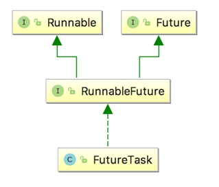
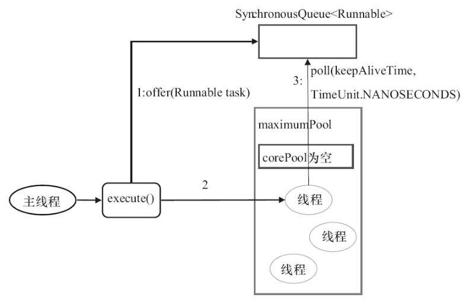
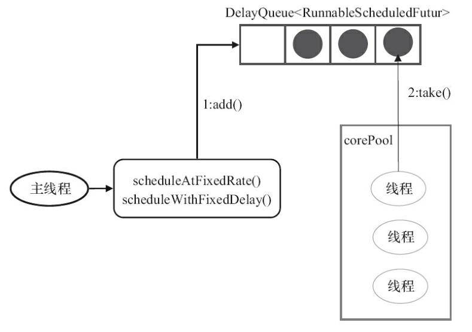

[TOC]

# executor框架成员关系：


`Runable`:




- 说明：
  - **`Executor`** ：执行器接口， 分离了任务和任务的执行。
  
  - **`ExecutorService`** ：在`Executor`的基础上提供了以下增强
  
    1. 关闭执行器，禁止任务的提交；
    2. 监视执行器的状态；
    3. 提供对异步任务的支持；
    4. 提供对批处理任务的支持。
  
    **`ScheduledExecutorService`** 在`ExecutorService`基础上提供了任务的延迟执行/周期执行的功能。
  
  - **`Executors`** 线程池工厂类。
  
  - **`ThreadFactory`**：线程工厂，用于创建单个线程，减少手工创建线程的繁琐工作，同时能够复用工厂的特性。
  
  - **`AbstractExecutorService`** ：`ExecutorService`的抽象实现，为各类执行器类的实现提供基础。
  
  - **`ThreadPoolExecutor`**：线程池执行器，也是最常用的线程池，可以以线程池的方式管理线程。 `JDK`中线程池的具体实现。
  
  - **`ScheduledThreadPoolExecutor`**：在`ThreadPoolExecutor`基础上，增加了对周期任务调度的支持。
  
  - **`ForkJoinPool`**：Fork/Join线程池，在`JDK1.7`时引入，是实现`Fork/Join`框架的核心类。


# executor框架使用示意图：


- 执行任务需要实现的**Runnable接口**或**Callable接口**。 **Runnable接口**或**Callable接口**实现类都可以被**ThreadPoolExecutor**或**ScheduledThreadPoolExecutor**执行。
- 使用步骤：
  - 主线程首先要创建实现`Runnable`或者`Callable`接口的任务对象。
    - 工具类`Executors`可以实现`Runnable`对象和`Callable`对象之间的相互转换。
    - `Runable`：无返回值；`Callable`：有返回值`Future`
  - 然后可以把创建完成的`Runnable`对象直接交给`ExecutorService`执行
    - `ExecutorService.execute`（Runnable command）
    - `ExecutorService.submit`（Runnable task）
    - `ExecutorService.submit`（Callable task）
  - 最后，主线程可以执行`FutureTask.get()`方法来等待任务执行完成。主线程也可以执行`FutureTask.cancel（boolean mayInterruptIfRunning）`来取消此任务的执行。


# 类和接口

## Executors

- 线程池工厂

```java
public class Executors {

    public static ExecutorService newFixedThreadPool(int nThreads) {
        return new ThreadPoolExecutor(nThreads, nThreads,
                                      0L, TimeUnit.MILLISECONDS,
                                      new LinkedBlockingQueue<Runnable>());
    }

    public static ExecutorService newWorkStealingPool(int parallelism) {
        return new ForkJoinPool
            (parallelism,
             ForkJoinPool.defaultForkJoinWorkerThreadFactory,
             null, true);
    }

    //这个工厂方法是Java8引入的，返回一个ForkJoinPool类型的 executor，它的工作方法与其他常见的execuotr稍有不同。与使用一个固定大小的线程池不同，ForkJoinPools使用一个并行因子数来创建，默认值为主机CPU的可用核心数。
    public static ExecutorService newWorkStealingPool() {
        return new ForkJoinPool
            (Runtime.getRuntime().availableProcessors(),
             ForkJoinPool.defaultForkJoinWorkerThreadFactory,
             null, true);
    }

    public static ExecutorService newFixedThreadPool(int nThreads, ThreadFactory threadFactory) {
        return new ThreadPoolExecutor(nThreads, nThreads,
                                      0L, TimeUnit.MILLISECONDS,
                                      new LinkedBlockingQueue<Runnable>(),
                                      threadFactory);
    }

    /*
    * 单线程线程池
    */
    public static ExecutorService newSingleThreadExecutor() {
        return new FinalizableDelegatedExecutorService
            (new ThreadPoolExecutor(1, 1,
                                    0L, TimeUnit.MILLISECONDS,
                                    new LinkedBlockingQueue<Runnable>()));
    }

    public static ExecutorService newSingleThreadExecutor(ThreadFactory threadFactory) {
        return new FinalizableDelegatedExecutorService
            (new ThreadPoolExecutor(1, 1,
                                    0L, TimeUnit.MILLISECONDS,
                                    new LinkedBlockingQueue<Runnable>(),
                                    threadFactory));
    }

    //可变大小线程池，按照任务数来分配线程
    public static ExecutorService newCachedThreadPool() {
        return new ThreadPoolExecutor(0, Integer.MAX_VALUE,
                                      60L, TimeUnit.SECONDS,
                                      new SynchronousQueue<Runnable>());
    }

    public static ExecutorService newCachedThreadPool(ThreadFactory threadFactory) {
        return new ThreadPoolExecutor(0, Integer.MAX_VALUE,
                                      60L, TimeUnit.SECONDS,
                                      new SynchronousQueue<Runnable>(),
                                      threadFactory);
    }

    //适用于需要单个后台线程执行周期任务，同时保证顺序地执行各个任务的应用场景。
    public static ScheduledExecutorService newSingleThreadScheduledExecutor() {
        return new DelegatedScheduledExecutorService
            (new ScheduledThreadPoolExecutor(1));
    }

    public static ScheduledExecutorService newSingleThreadScheduledExecutor(ThreadFactory threadFactory) {
        return new DelegatedScheduledExecutorService
            (new ScheduledThreadPoolExecutor(1, threadFactory));
    }

    public static ScheduledExecutorService newScheduledThreadPool(int corePoolSize) {
        return new ScheduledThreadPoolExecutor(corePoolSize);
    }

    public static ScheduledExecutorService newScheduledThreadPool(
            int corePoolSize, ThreadFactory threadFactory) {
        return new ScheduledThreadPoolExecutor(corePoolSize, threadFactory);
    }
    
    ......
}
```

- Executors使用示例

```java
ExecutorService e = Executors.newCachedThreadPool();
    ExecutorService e = Executors.newSingleThreadExecutor();
    ExecutorService e = Executors.newFixedThreadPool(3);
    // 第一种是可变大小线程池，按照任务数来分配线程，
    // 第二种是单线程池，相当于FixedThreadPool(1)
    // 第三种是固定大小线程池。
    // 然后运行
    e.execute(new MyRunnableImpl());
```

### FixedThreadPool详解

- 源代码中新创建的FixedThreadPool的corePoolSize和maximumPoolSize都被设置为nThreads。


**上图说明：**

1. 如果当前运行的线程数小于corePoolSize，则创建新的线程来执行任务；
2. 当前运行的线程数等于corePoolSize后，将任务加入LinkedBlockingQueue；
3. 线程执行完1中的任务后，会在循环中反复从LinkedBlockingQueue中获取任务来执行；

**FixedThreadPool使用无界队列 LinkedBlockingQueue（队列的容量为Intger.MAX_VALUE）作为线程池的工作队列会对线程池带来如下影响：**

1. 当线程池中的线程数达到corePoolSize后，新任务将在无界队列中等待，因此线程池中的线程数不会超过corePoolSize；
2. 由于1，使用无界队列时maximumPoolSize将是一个无效参数；
3. 由于1和2，使用无界队列时keepAliveTime将是一个无效参数；
4. 运行中的FixedThreadPool（未执行shutdown()或shutdownNow()方法）不会拒绝任务

- 适用场景

  适用于为了满足资源管理需求，而需要限制当前线程数量的应用场景。它适用于负载比较重的服务器；


### SingleThreadExecutor详解


**上图说明;**

1. 如果当前运行的线程数少于corePoolSize，则创建一个新的线程执行任务；
2. 当前线程池中有一个运行的线程后，将任务加入LinkedBlockingQueue
3. 线程执行完1中的任务后，会在循环中反复从LinkedBlockingQueue中获取任务来执行

- 适用场景

  适用于需要保证顺序地执行各个任务并且在任意时间点，不会有多个线程是活动的应用场景。

### CachedThreadPool详解

- CachedThreadPool的corePoolSize被设置为空（0），maximumPoolSize被设置为Integer.MAX.VALUE，即它是无界的，这也就意味着如果主线程提交任务的速度高于maximumPool中线程处理任务的速度时，CachedThreadPool会不断创建新的线程。极端情况下，这样会导致耗尽cpu和内存资源。



**上图说明：**

1. 首先执行SynchronousQueue.offer(Runnable task)。如果当前maximumPool中有闲线程正在执行SynchronousQueue.poll(keepAliveTime,TimeUnit.NANOSECONDS)，那么主线程执行offer操作与空闲线程执行的poll操作配对成功，主线程把任务交给空闲线程执行，execute()方法执行完成，否则执行下面的步骤2；
2. 当初始maximumPool为空，或者maximumPool中没有空闲线程时，将没有线程执行SynchronousQueue.poll(keepAliveTime,TimeUnit.NANOSECONDS)。这种情况下，步骤1将失败，此时CachedThreadPool会创建新线程执行任务，execute方法执行完成；

- 适用场景

  适用于执行很多的短期异步任务的小程序，或者是负载较轻的服务器；


```java
/**
* Runable接口交给ExecutorService接口执行
*/
ExecutorService executor = Executors.newSingleThreadExecutor();
	executor.submit(() -> {
	String threadName = Thread.currentThread().getName();
	System.out.println("Hello " + threadName);
});

//注意：
//	Executors必须显式的停止-否则它们将持续监听新的任务。
//	ExecutorService提供了两个方法来达到这个目的——shutdwon()会等待正在执行的任务执行完而shutdownNow()会终止所有正在执行的任务并立即关闭execuotr。

try {
    System.out.println("attempt to shutdown executor");
    executor.shutdown();
    executor.awaitTermination(5, TimeUnit.SECONDS);
    }
catch (InterruptedException e) {
    System.err.println("tasks interrupted");
}
finally {
    if (!executor.isTerminated()) {
        System.err.println("cancel non-finished tasks");
    }
    executor.shutdownNow();
    System.out.println("shutdown finished");
}
```

```java
/**
*Callable接口交给ExecutorService接口执行
*/
Callable<Integer> task = () -> {
    try {
        TimeUnit.SECONDS.sleep(1);
        return 123;
    }
    catch (InterruptedException e) {
        throw new IllegalStateException("task interrupted", e);
    }
};


ExecutorService executor = Executors.newFixedThreadPool(1);
Future<Integer> future = executor.submit(task);

System.out.println("future done? " + future.isDone());

Integer result = future.get();
//future.get(1, TimeUnit.SECONDS);

System.out.println("future done? " + future.isDone());
System.out.print("result: " + result);
```

- Future与底层的executor service紧密的结合在一起。记住，如果你关闭executor，所有的未中止的future都会抛出异常。

## Executor

```java
public interface Executor {
    void execute(Runnable command);
}
```

## Future

```java
public interface Future<V> {
    
    //取消任务，成功返回true，失败返回false。
    //参数mayInterruptIfRunning表示是否取消正在执行但是没有执行完成的任务，true可以取消，false不取消
    //结果：
    //	如果任务已经完成，无论参数是true或false，都返回false
	//	如果任务正在执行，若参数为true，返回true；若参数为false，返回false；
	//	如果任务还未执行，无论参数是true或false，都返回true。
    boolean cancel(boolean mayInterruptIfRunning);
    
    //任务是否被取消成功。
    boolean isCancelled();
    
    //任务是否已经完成。
    boolean isDone();
    
    //用来获取执行结果，会一直阻塞等到任务执行完成之后返回。
    V get();
    
    //用来获取执行结果，指定时间内获取不到结果，返回null
    V get(long timeout, TimeUnit unit);
    
}
```


## RunnableFuture


```java
public interface RunnableFuture<V> extends Runnable, Future<V> {
    /**
     * Sets this Future to the result of its computation
     * unless it has been cancelled.
     */
    void run();
}
```


## FutureTask

- 是Future接口的唯一实现。
- 一种可以取消的异步的计算任务。
- 它的计算是通过Callable实现的，它等价于可以携带结果的Runnable，并且有三个状态：等待、运行和完成。

```java
public class FutureTask<V> implements RunnableFuture<V> {
    
    public FutureTask(Callable<V> callable);
    
    public FutureTask(Runnable runnable, V result);
    
    public boolean isCancelled();

    public boolean isDone();

    public boolean cancel(boolean mayInterruptIfRunning);
    
    public V get();
    
    public V get(long timeout, TimeUnit unit);
    
    public void run();
```


## ExecutorService

- 源码

```java
public interface ExecutorService extends Executor {

    //关闭已在Executor上调用，因此不会再向DelayedPool添加任何其他任务。但是，已经在队列中提交的任务将被允许完成。
    void shutdown();

    //试图终止当前正在运行的任务，并停止处理排队的任务并返回正在等待执行的List。
    List<Runnable> shutdownNow();

    boolean isShutdown();

    boolean isTerminated();

    boolean awaitTermination(long timeout, TimeUnit unit);

    <T> Future<T> submit(Callable<T> task);

    <T> Future<T> submit(Runnable task, T result);

    Future<?> submit(Runnable task);

    //一次批量提交多个callable。这个方法结果一个callable的集合，然后返回一个future的列表。
    <T> List<Future<T>> invokeAll(Collection<? extends Callable<T>> tasks);

    <T> List<Future<T>> invokeAll(Collection<? extends Callable<T>> tasks,
                                  long timeout, TimeUnit unit);

    //它的工作方式与invokeAll()稍有不同。在等待future对象的过程中，这个方法将会阻塞直到第一个callable中止然后返回这一个callable的结果。
    <T> T invokeAny(Collection<? extends Callable<T>> tasks);

    <T> T invokeAny(Collection<? extends Callable<T>> tasks,
                    long timeout, TimeUnit unit);
}
```

- 使用示例

```java
//批量提交-->invokeAll
ExecutorService executor = Executors.newWorkStealingPool();

List<Callable<String>> callables = Arrays.asList(
        () -> "task1",
        () -> "task2",
        () -> "task3");

executor.invokeAll(callables)
    .stream()
    .map(future -> {
        try {
            return future.get();
        }
        catch (Exception e) {
            throw new IllegalStateException(e);
        }
    })
    .forEach(System.out::println);
```

```java
//批量提交callable --> invokeAny()

Callable<String> callable(String result, long sleepSeconds) {
    return () -> {
        TimeUnit.SECONDS.sleep(sleepSeconds);
        return result;
    };
}

ExecutorService executor = Executors.newWorkStealingPool();

List<Callable<String>> callables = Arrays.asList(
callable("task1", 2),
callable("task2", 1),
callable("task3", 3));

String result = executor.invokeAny(callables);
System.out.println(result);

// => task2
```


## ScheduledExecutorService

调度线程池，支持任务调度，持续执行或者延迟一段时间后执行。

```java
public interface ScheduledExecutorService extends ExecutorService {

    public ScheduledFuture<?> schedule(Runnable command,
                                       long delay, TimeUnit unit);

    public <V> ScheduledFuture<V> schedule(Callable<V> callable,
                                           long delay, TimeUnit unit);

    /**
     * @param command the task to execute
     * @param initialDelay the time to delay first execution
     * @param period the period between successive executions
     * @param unit the time unit of the initialDelay and period parameters
    */
    //以固定频率来执行一个任务
    //这个方法还接收一个初始化延迟，用来指定这个任务首次被执行等待的时长。
    public ScheduledFuture<?> scheduleAtFixedRate(Runnable command,
                                                  long initialDelay,
                                                  long period,
                                                  TimeUnit unit);

    //scheduleWithFixedDelay()在你不能预测调度任务的执行时长时是很有用的。
    //等待时间 period 的应用是在一次任务的结束和下一个任务的开始之间。
    public ScheduledFuture<?> scheduleWithFixedDelay(Runnable command,
                                                     long initialDelay,
                                                     long delay,
                                                     TimeUnit unit);

}
```

```java
public interface ScheduledFuture<V> extends Delayed, Future<V> {
}

public interface Delayed extends Comparable<Delayed> {

    long getDelay(TimeUnit unit);//获得剩余的延迟
}

```


- 使用示例

```java
ScheduledExecutorService executor = Executors.newScheduledThreadPool(1);

Runnable task = () -> System.out.println("Scheduling: " + System.nanoTime());
ScheduledFuture<?> future = executor.schedule(task, 3, TimeUnit.SECONDS);

TimeUnit.MILLISECONDS.sleep(1337);

long remainingDelay = future.getDelay(TimeUnit.MILLISECONDS);
System.out.printf("Remaining Delay: %sms", remainingDelay);
```

- scheduleAtFixedRate()使用

```java
//每分钟一次
ScheduledExecutorService executor = Executors.newScheduledThreadPool(1);

Runnable task = () -> System.out.println("Scheduling: " + System.nanoTime());

int initialDelay = 0;//这个方法还接收一个初始化延迟，用来指定这个任务首次被执行等待的时长。

int period = 1;
executor.scheduleAtFixedRate(task, initialDelay, period, TimeUnit.SECONDS);
```

注意：`scheduleAtFixedRate()`并不考虑任务的实际用时。

- scheduleWithFixedDelay()使用

```java
ScheduledExecutorService executor = Executors.newScheduledThreadPool(1);

Runnable task = () -> {
    try {
        TimeUnit.SECONDS.sleep(2);
        System.out.println("Scheduling: " + System.nanoTime());
    }
    catch (InterruptedException e) {
        System.err.println("task interrupted");
    }
};

executor.scheduleWithFixedDelay(task, 0, 1, TimeUnit.SECONDS);

//这个例子调度了一个任务，并在一次执行的结束和下一次执行的开始之间设置了一个1分钟的固定延迟。初始化延迟为0，任务执行时间为0。
```


## ThreadPoolExecutor

```java
public class ThreadPoolExecutor extends AbstractExecutorService {
    /**
    corePoolSize:池内线程初始值与最小值，就算是空闲状态，也会保持该数量线程。
    maximumPoolSize:线程最大值，线程的增长始终不会超过该值。
    keepAliveTime：当池内线程数高于corePoolSize时，经过多少时间多余的空闲线程才会被回收。回收前处于wait状态
    unit：
    时间单位，可以使用TimeUnit的实例，如TimeUnit.MILLISECONDS　
    workQueue:待入任务（Runnable）的等待场所，该参数主要影响调度策略，如公平与否，是否产生饿死(starving)
    threadFactory:线程工厂类，有默认实现，如果有自定义的需要则需要自己实现ThreadFactory接口并作为参数传入。
    */
    public ThreadPoolExecutor(int corePoolSize,
                                  int maximumPoolSize,
                                  long keepAliveTime,
                                  TimeUnit unit,
                                  BlockingQueue<Runnable> workQueue);

    /**
     * 用给定的初始参数创建一个新的ThreadPoolExecutor。

     * @param keepAliveTime 当线程池中的线程数量大于corePoolSize的时候，如果这时没有新的任务提交，
     *核心线程外的线程不会立即销毁，而是会等待，直到等待的时间超过了keepAliveTime；
     * @param unit  keepAliveTime参数的时间单位
     * @param workQueue 等待队列，当任务提交时，如果线程池中的线程数量大于等于corePoolSize的时候，把该任务封装成一个Worker对象放入等待队列；
     * 
     * @param threadFactory 执行者创建新线程时使用的工厂
     * @param handler RejectedExecutionHandler类型的变量，表示线程池的饱和策略。
     * 如果阻塞队列满了并且没有空闲的线程，这时如果继续提交任务，就需要采取一种策略处理该任务。
     * 线程池提供了4种策略：
        1.AbortPolicy：直接抛出异常，这是默认策略；
        2.CallerRunsPolicy：用调用者所在的线程来执行任务；
        3.DiscardOldestPolicy：丢弃阻塞队列中靠最前的任务，并执行当前任务；
        4.DiscardPolicy：直接丢弃任务；
     */
    public ThreadPoolExecutor(int corePoolSize,
                              int maximumPoolSize,
                              long keepAliveTime,
                              TimeUnit unit,
                              BlockingQueue<Runnable> workQueue,
                              ThreadFactory threadFactory,
                              RejectedExecutionHandler handler);
    
    public void execute(Runnable command);

    //关闭当前服务，当调用此方法时，它将不再接受新的任务，已经提交的任务，还要继续执行完毕。
    public void shutdown();
    
    //关闭当前服务，尚未执行的任务，不再执行；正在执行的任务，通过线程中断thread.interrupt。方法返回等待执行的任务列表。
    public List<Runnable> shutdownNow();
    
    //程序是否已经关闭。
    public boolean isShutdown();
    
    //如果关闭后所有任务都已完成，则返回 true。
    public boolean isTerminating();
    
    //程序是否已经终止。已经关闭并且所有的任务都执行完成，返回true，其他返回false。
    public boolean isTerminated();
    
    //请求关闭、发生超时或者当前线程中断，无论哪一个首先发生之后，都将导致阻塞，直到所有任务完成执行。如果程序终止，返回true，如果超时，返回false，等待时发生中断，抛出异常。
    public boolean awaitTermination(long timeout, TimeUnit unit);
    
    public boolean prestartCoreThread();
    
    public int prestartAllCoreThreads();
    
    public boolean allowsCoreThreadTimeOut();
    
    public void allowCoreThreadTimeOut(boolean value);
    
    public boolean remove(Runnable task);
    
    //Tries to remove from the work queue all
    public void purge();
    
    public int getActiveCount();
    
    public int getLargestPoolSize();
    
    public long getTaskCount();
    
    public long getCompletedTaskCount();
}
```

- `ThreadPoolExecutor`的创建

  - 1.构造方法(官方不推荐)

  - 2.`Executors`工具类

## ScheduledThreadPoolExecutor

- 一个可定时调度任务的**线程池**

- 适用场景

   适用于需要多个后台执行周期任务，同时为了满足资源管理需求而需要限制后台线程的数量的应用场景

- 主要用来在给定的延迟后运行任务，或者定期执行任务。

- 实现：

  ScheduledThreadPoolExecutor使用的任务队列DelayQueue封装了一个PriorityQueue，PriorityQueue会对队列中的任务进行排序，执行所需时间短的放在前面先被执行(ScheduledFutureTask的time变量小的先执行)，如果执行所需时间相同则先提交的任务将被先执行(ScheduledFutureTask的squenceNumber变量小的先执行)。

- ScheduledThreadPoolExecutor和Timer的比较：

  - Timer对系统时钟的变化敏感，ScheduledThreadPoolExecutor不是；

  - Timer只有一个执行线程，因此长时间运行的任务可以延迟其他任务。 ScheduledThreadPoolExecutor可以配置任意数量的线程。 此外，如果你想（通过提供ThreadFactory），你可以完全控制创建的线程;

  - 在TimerTask中抛出的运行时异常会杀死一个线程，从而导致Timer死机:-( ...即计划任务将不再运行。ScheduledThreadExecutor不仅捕获运行时异常，还允许您在需要时处理它们（通过重写afterExecute方法 ThreadPoolExecutor）。抛出异常的任务将被取消，但其他任务将继续运行。

- **综上，在JDK1.5之后，你没有理由再使用Timer进行任务调度了。**

> **备注：** Quartz是一个由java编写的任务调度库，由OpenSymphony组织开源出来。在实际项目开发中使用Quartz的还是居多，比较推荐使用Quartz。因为Quartz理论上能够同时对上万个任务进行调度，拥有丰富的功能特性，包括任务调度、任务持久化、可集群化、插件等等。

- ScheduledThreadPoolExecutor运行机制



- ScheduledThreadPoolExecutor执行周期任务的步骤


> 1.线程1从DelayQueue中获取已到期的ScheduledFutureTask（DelayQueue.take()）。到期任务是指ScheduledFutureTask的time大于等于当前系统的时间；
>
> 2.线程1执行这个ScheduledFutureTask；
>
> 3.线程1修改ScheduledFutureTask的time变量为下次将要被执行的时间；
>
> 4.线程1把这个修改time之后的ScheduledFutureTask放回DelayQueue中（DelayQueue.add())。


```java
public class ScheduledThreadPoolExecutor
        extends ThreadPoolExecutor
        implements ScheduledExecutorService {

	public ScheduledThreadPoolExecutor(int corePoolSize) {
    	    super(corePoolSize, Integer.MAX_VALUE, 0, NANOSECONDS,
        	      new DelayedWorkQueue());
    }
    
    public ScheduledThreadPoolExecutor(int corePoolSize,
                                       ThreadFactory threadFactory);
                                       
    public ScheduledThreadPoolExecutor(int corePoolSize,
                                       RejectedExecutionHandler handler);

	public ScheduledThreadPoolExecutor(int corePoolSize,
                                       ThreadFactory threadFactory,
                                       RejectedExecutionHandler handler);
                                       
    public ScheduledFuture<?> schedule(Runnable command,
                                       long delay,
                                       TimeUnit unit);
                                       
    public <V> ScheduledFuture<V> schedule(Callable<V> callable,
                                           long delay,
                                           TimeUnit unit);
    
    //将延迟视为两个任务开始之间的差异（即定期调用） 
    public ScheduledFuture<?> scheduleAtFixedRate(Runnable command,
                                                  long initialDelay,
                                                  long period,
                                                  TimeUnit unit);
    
    //将延迟视为一个任务结束与下一个任务开始之间的差异
    public ScheduledFuture<?> scheduleWithFixedDelay(Runnable command,
                                                     long initialDelay,
                                                     long delay,
                                                     TimeUnit unit);
    
    public void execute(Runnable command);
    
    public Future<?> submit(Runnable task);
    
    public <T> Future<T> submit(Runnable task, T result);
    
    public <T> Future<T> submit(Callable<T> task);
    
    public void shutdown();
    
    public List<Runnable> shutdownNow();
    
}
```

- 使用示例

```java
/**
 * 使用ScheduledExecutorService和ScheduledThreadPoolExecutor实现的java调度程序示例程序。
 */
public class ScheduledThreadPoolDemo {

    public static void main(String[] args) throws InterruptedException {

        //创建一个ScheduledThreadPoolExecutor对象
        ScheduledExecutorService scheduledThreadPool = Executors.newScheduledThreadPool(5);
        //计划在某段时间后运行
        System.out.println("Current Time = "+new Date());
        for(int i=0; i<3; i++){
            Thread.sleep(1000);
            WorkerThread worker = new WorkerThread("do heavy processing");
            //创建并执行在给定延迟后启用的单次操作。 
            scheduledThreadPool.schedule(worker, 10, TimeUnit.SECONDS);
        }

        //添加一些延迟让调度程序产生一些线程
        Thread.sleep(30000);
        System.out.println("Current Time = "+new Date());
        //关闭线程池
        scheduledThreadPool.shutdown();
        while(!scheduledThreadPool.isTerminated()){
            //等待所有任务完成
        }
        System.out.println("Finished all threads");
    }

}
```

## CompletionService

- 我们可以通过线程池的submit方法提交一个Callable任务，利用返回的Future的get方法来获取任务运行的结果，但是这种方法需要自己循环获取task，而且get方法会阻塞。
- 还可以用CompletionService来实现，CompletionService维护一个保存Future对象的BlockQueue，当Future对象状态是结束的时候，会加入到队列中，可以通过take方法，取出Future对象。

```java
public interface CompletionService<V> {
    
    Future<V> submit(Callable<V> task);
    
    Future<V> submit(Runnable task, V result);

    //获取任务结果。获取并移除表示下一个已完成任务的Future，如果任务不存在，则等待。
    Future<V> take();
    
    //获取任务结果。获取并移除表示下一个已完成任务的Future，如果不存在，则返回null。
    Future<V> poll();
    
    Future<V> poll(long timeout, TimeUnit unit);
}
```

## ExecutorCompletionService

- CompletionService的实现类，实现了上述方法