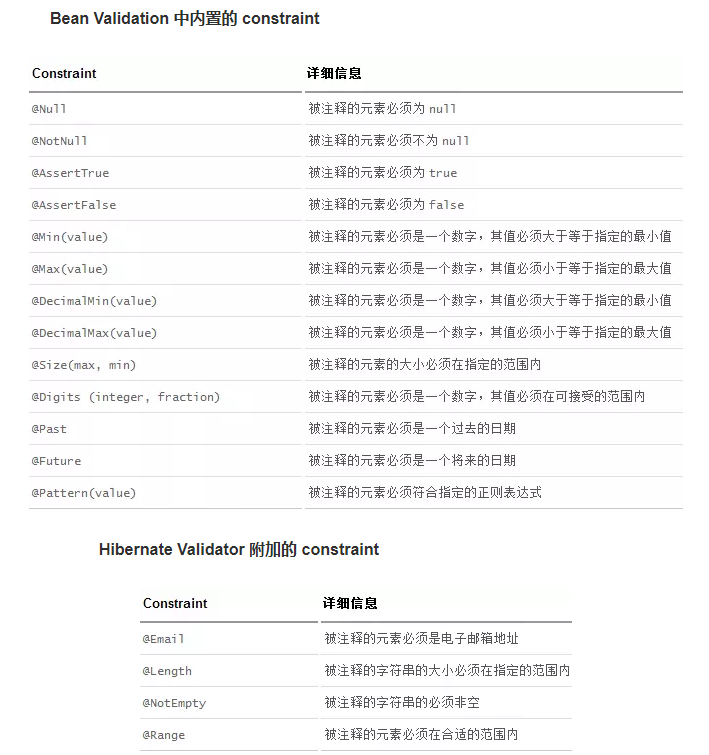

# JSR（Java Specification Requests）

- Java 规范提案。是指向JCP(Java Community Process)提出新增一个标准化技术规范的正式请求。  
	任何人都可以提交JSR，以向Java平台增添新的API和服务。JSR已成为Java界的一个重要标准。

## Web Service技术

	Java Date与Time API ( JSR 310)

	Java API for RESTful Web Services (JAX-RS) 1.1 (JSR 311)

	Implementing Enterprise Web Services 1.3 (JSR 109)

	Java API for XML-Based Web Services (JAX-WS) 2.2 (JSR 224)

	Java Architecture for XML Binding (JAXB) 2.2 (JSR 222)

	Web Services Metadata for the Java Platform (JSR 181)

	Java API for XML-Based RPC (JAX-RPC) 1.1 (JSR 101)

	Java APIs for XML Messaging 1.3 (JSR 67)

	Java API for XML Registries (JAXR) 1.0 (JSR 93)

## Web应用技术
	Java Servlet 3.0 (JSR 315)

	JavaServer Faces 2.0 (JSR 314)

	JavaServer Pages 2.2/Expression Language 2.2 (JSR 245)

	Standard Tag Library for JavaServer Pages (JSTL) 1.2 (JSR 52)

	Debugging Support for Other Languages 1.0 (JSR 45)

## 企业应用技术
	Contexts and Dependency Injection for Java (Web Beans 1.0) (JSR 299)

	Dependency Injection for Java 1.0 (JSR 330)

	Bean Validation 1.0 (JSR 303)

	Enterprise JavaBeans 3.1 (includes Interceptors 1.1) (JSR 318)

	Java EE Connector Architecture 1.6 (JSR 322)

	Java Persistence 2.0 (JSR 317)

	Common Annotations for the Java Platform 1.1 (JSR 250)

	Java Message Service API 1.1 (JSR 914)

	Java Transaction API (JTA) 1.1 (JSR 907)

	JavaMail 1.4 (JSR 919)

## 管理与安全技术
	Java Authentication Service Provider Interface for Containers (JSR 196)

	Java Authorization Contract for Containers 1.3 (JSR 115)

	Java EE Application Deployment 1.2 (JSR 88)

	J2EE Management 1.1 (JSR 77)

## Java SE中与Java EE有关的规范
	JCache API (JSR 107)

	Java Memory Model (JSR 133)

	Concurrency Utilitie (JSR 166)

	Java API for XML Processing (JAXP) 1.3 (JSR 206)

	Java Database Connectivity 4.0 (JSR 221)

	Java Management Extensions (JMX) 2.0 (JSR 255)

	Java Portlet API (JSR 286)

	模块化 ( JSR 294)

	Swing应用框架 (JSR 296)

	JavaBeans Activation Framework (JAF) 1.1 (JSR 925)

	Streaming API for XML (StAX) 1.0 (JSR 173)
	
### JSR-303

	JSR-303 是JAVA EE 6 中的一项子规范，叫做Bean Validation，Hibernate Validator 是 Bean Validation 的参考实现. 
	Hibernate Validator 提供了 JSR 303 规范中所有内置 constraint 的实现，除此之外还有一些附加的 constraint。

