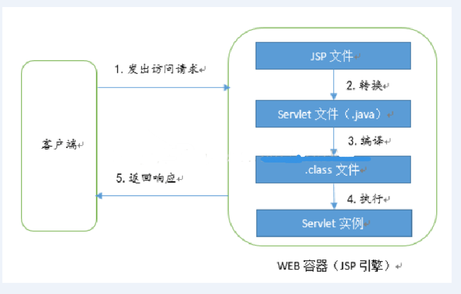
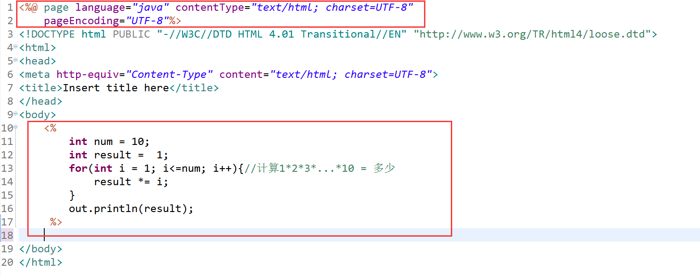
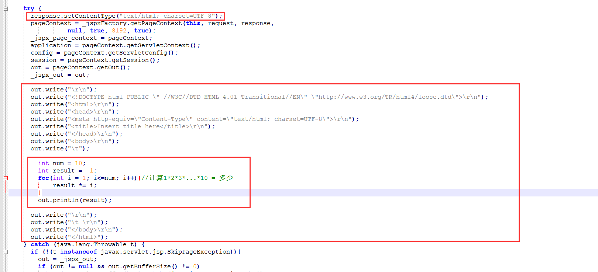

# JSP详解

- 在Servlet中编写一些HTML代码，是很不方便的一件事情，每次都需要out.println(HTML); 因此就出现了JSP，来解决这样的问题，JSP中的内容就是html，但是能够嵌套java语言 

 JSP(Java Server Pages):是以Java语言为基础的动态网页开发技术。


## JSP就是Servlet

- jsp文件生成过程

   https://www.cnblogs.com/whgk/p/6427759.html 


1. tomcat获得JSP文件后，先将JSP转成servlet，变成xxx.java(servlet源码) 。

   在tomcat目录下 `E:\softWore\apache-tomcat-8.5.38\work\Catalina\localhost\springmvc-demo\org\apache\jsp`可以看到 存放着jsp变成的servlet文件.java和编译文件.class。

2.  tomcat将java文件编译成class文件
3.  tomcat运行class文件，并将结果输出到浏览器





## JSP语法


### JSP模版数据

就是JSP中的HTML代码，它的内容给是固定的，无论程序如何运行模版数据输出到客户端浏览器时都不会发生改变，当我们创建一个JSP时，模版就已经固定了。


#### 元素

JSP中的java部分，包括脚本(JavaScript，或者java代码)以及JSP指令(Directive)与JSP标签(Tag)等，元素决定着程序的流程，元素是不会显示到浏览器的。 


### JSP脚本

-  使用<% 编写java代码 %>，中间java代码必须遵循Java语法




 

jsp变为servlet时的代码 





在JSP中JSP指令：

```jsp
<%@ page language="java" contentType="text/html; charset=UTF-8" pageEncoding="UTF-8"%>
```

 这句代码在servlet就变为了

```java
response.setContentType("text/html; charset=UTF-8");
//这句代码的意思就是通知tomcat和浏览器都使用UTF-8码表，并且发送回浏览器的数据类型是text/html。
// 这是有JSP指令中画红色部分代码转变的，而指令中的pageEncoding="UTF-8"的意思是JSP转换为Servlet时采用UTF-8码表编码，因为可能JSP中包含中文。
```


-  使用<%=xxx %>来输出结果 

使用<%=result %>来输出结果，servlet中就会将其转换为out.print(result)进行输出。输出各种类型数据：int、double、boolean、String、Object等 

```jsp
<%=result %>
```


-  JSP中申明方法与属性(全局变量) 

 使用<%! 方法、属性%> 


-  在JSP中可以使用if语句，for循环，whilt循环


## 总结：

 对于JSP模版数据来说，就原封不动的使用out.write()来输出到浏览器 

 而对于JSP元素来说，就会变成普通的java代码，因为在servlet中，就可以直接编写java代码。 


## JSP指令

 指令用来申明JSP页面的一些属性，比如编码方式，文档类型。我们在servlet中也会申明我们使用的编码方式和响应的文档类型的，而JSP就是用指令来申明。 


JSP指令格式：

```jsp
<%@ directive {attribute=value}* %> 
```

directive：指令名称，例如page指令

attribute=value：紧跟指令名称后面的就是各种属性，以键值对的形式书写

*：代表后面能跟0个或多个属性。


### page指令

 用来声明JSP页面的属性等。 

```jsp
<%@ page language="java" contentType="text/html; charset=UTF-8" pageEncoding="UTF-8"%>
```


| **属性**           | **描述**                                            |
| :----------------- | :-------------------------------------------------- |
| buffer             | 指定out对象使用缓冲区的大小                         |
| autoFlush          | 控制out对象的 缓存区                                |
| contentType        | 指定当前JSP页面的MIME类型和字符编码                 |
| errorPage          | 指定当JSP页面发生异常时需要转向的错误处理页面       |
| isErrorPage        | 指定当前页面是否可以作为另一个JSP页面的错误处理页面 |
| extends            | 指定servlet从哪一个类继承                           |
| import             | 导入要使用的Java类                                  |
| info               | 定义JSP页面的描述信息                               |
| isThreadSafe       | 指定对JSP页面的访问是否为线程安全                   |
| language           | 定义JSP页面所用的脚本语言，默认是Java               |
| session            | 指定JSP页面是否使用session                          |
| isELIgnored        | 指定是否执行EL表达式                                |
| isScriptingEnabled | 确定脚本元素能否被使用                              |


### include指令

```jsp
<%@ include file="relativeURL"%>
```

> relativeURL：本应用程序内另一个JSP文件或者HTML文件的路径 

 特点：include指令会将包含页面的源代码添加到使用include指令的页面中来，然后编译成class文件 


```jsp
<jsp:include page="relativeURL">
```

 作用跟include指令一样，但是不同的是，include行为是运行时单独执行包含页面，然后把执行的结果包含到本页面来，属于先运行后包含。 


### taglib指令

```jsp
<%@ taglib uri="http://java.sun.com/jsp/jstl/core" prefix="c"%>
```

用来指明JSP页面内使用的JSP标签库，taglib指令有两个属性，uri为类库的地址，prefix为标签的前缀 


## JSP行为

JSP页面中就两个东西，模块数据和元素。

其中元素有包括脚本，指令，标签。脚本就是JSP中嵌入java代码，指令作用就是申明页面的属性，那标签是干嘛的？

标签分为JSP自带内置的标签，和通过taglib指令来使用JSP标签库，或者自定义标签。


### JSP标签

-  JSP内置的标签就被称为JSP行为(JSP Actions)。 

```jsp
<jsp:elements ｛attribute="value"｝* />
```

jsp：标签的前缀，说明是jsp内置的标签，

elements：行为的名称，

attribute=value：使用键值对来编写属性

*：能指定0个或多个属性对


| **语法**        | **描述**                                                   |
| :-------------- | :--------------------------------------------------------- |
| jsp:include     | 用于在当前页面中包含静态或动态资源                         |
| jsp:useBean     | 寻找和初始化一个JavaBean组件                               |
| jsp:setProperty | 设置 JavaBean组件的值                                      |
| jsp:getProperty | 将 JavaBean组件的值插入到 output中                         |
| jsp:forward     | 从一个JSP文件向另一个文件传递一个包含用户请求的request对象 |
| jsp:plugin      | 用于在生成的HTML页面中包含Applet和JavaBean对象             |
| jsp:element     | 动态创建一个XML元素                                        |
| jsp:attribute   | 定义动态创建的XML元素的属性                                |
| jsp:body        | 定义动态创建的XML元素的主体                                |
| jsp:text        | 用于封装模板数据                                           |


#### <jsp:include />行为 

 include行为用于运行时包含某个文件，如果被包含的文件为JSP程序，则先会执行JSP程序，然后在把执行的结果包含进来。　作用是跟include指令一样的，唯一的区别就在于，include指令是将被包含的文件的源码加入到了本JSP程序中，然后在进行编译，属于静态包含，而include行为只是将被包含的文件的运行结果包含进自己。属于动态包含 


#### Java bean行为

-  一组与Java Bean 相关的行为，包括useBean行为、setProperty行为、getProperty行为等 


##### useBean行为

```jsp
<jsp:useBean id="beanObject" class="className" scope="Value">
```

 作用：在jsp中定义一个java bean对象 

id：指明Java Bean对象的名称，JSP中可以使用该名称引用该Java Bean对象，相当于给new出来的对象取一个变量名

class：Java Bean类的全名

scope：该java bean对象的作用范围，可以写的就四个，也就是JSP的四大作用域，page、request、session、application

> page：只能在当前JSP页面使用，如果不在JSP页面，那么就会失效
>
> request：这个前面学过，A页面请求转发到B页面，那么使用的是同一个request，那么A,B页面都算是request的作用域，也就是通过请求转发的页面都是其作　　　　　　　　　　　　　　　　　　　　　　　用域
>
> session：该作用域在一个web项目下任何位置应该读访问的到，只要cookie不关闭，并且cookie设置　　的访问路径为"/"，
>
> application：其实就是Servlet中的servletContext，服务器下的所有项目都能访问到。


##### setProperty行为

```jsp
<jsp:setProperty name="beanName" property="propertyName" value="">
```

对Java Bean对象进行属性的设置

name：java bean对象的名称，也就是在useBean行为中的id

property：对象中的属性名，

value：要对其属性进行赋值的值


##### getProperty行为

```jsp
<jsp:getProperty name="beanName" property="propertyName" />
```

获取JavaBean对象的某个属性值

name:java bean 对象的名称，也就是在useBean行为中的id

property：对象的属性名


#### <jsp:forward />行为

 实现请求转发功能。Servlet中通过

```java
request.getRequestDispatcher("someServlet").forward(request,response);
```

而在JSP中也能够实现相同的功能，只不过用的是<jsp:forward />行为，实际上forward行为就是对其进行了封装。 


```jsp
<jsp:forward page="someServlet">
	<jsp:param name="param1" value="value1"/>
	<jsp:param name="param2" value="value2"/>
</jsp:forward>
```

page:需要跳转到的页面或者servlet、<jsp:param />参数行为，带一些参数过去，name、value是以键值对的形式带过去的 


#### <jsp:plugin  />行为

 用于在生成的HTML页面中包含Applet和JavaBean对象 


#### <jsp:elements  />行为

```jsp
<jsp:elements ｛attribute="value"｝* />
```

 动态创建一个XML元素 


#### <jsp:attribute  />行为

 定义动态创建的XML元素的属性 


#### <jsp:body />行为

 定义动态创建的XML元素的主体 


#### < jsp:text />行为

 用于封装模板数据 


#### <jsp:directive />行为

 directive行为，就相当于JSP指令，比如`<jsp:directive.page />`相当于`<%@ page %>`指令，等等其它指令是一样的书写格式。　　　　　　　　 


### JSTL

JSP标准标签库（JSTL）是一个JSP标签集合，它封装了JSP应用的通用核心功能。 


#### 核心标签

核心标签是最常用的 JSTL标签。引用核心标签库的语法如下：

```jsp
<%@ taglib prefix="c" uri="http://java.sun.com/jsp/jstl/core" %>
```


| 标签          | 描述                                                         |
| :------------ | :----------------------------------------------------------- |
| <c:out>       | 用于在JSP中显示数据，就像<%= ... >                           |
| <c:set>       | 用于保存数据                                                 |
| <c:remove>    | 用于删除数据                                                 |
| <c:catch>     | 用来处理产生错误的异常状况，并且将错误信息储存起来           |
| <c:if>        | 与我们在一般程序中用的if一样                                 |
| <c:chose>     | 本身只当做<c:when>和<c:otherwise>的父标签                    |
| <c:when>      | <c:choose>的子标签，用来判断条件是否成立                     |
| <c:otherwise> | <c:choose>的子标签，接在<c:when>标签后，当<c:when>标签判断为false时被执行 |
| <c:import>    | 检索一个绝对或相对 URL，然后将其内容暴露给页面               |
| <c:forEach>   | 基础迭代标签，接受多种集合类型                               |
| <c:forTokens> | 根据指定的分隔符来分隔内容并迭代输出                         |
| <c:param>     | 用来给包含或重定向的页面传递参数                             |
| <c:redirect>  | 重定向至一个新的URL.                                         |
| <c:url>       | 使用可选的查询参数来创造一个URL                              |


#### 格式化标签

JSTL格式化标签用来格式化并输出文本、日期、时间、数字。引用格式化标签库的语法如下：

```jsp
<%@ taglib prefix="fmt" uri="http://java.sun.com/jsp/jstl/fmt" %>
```

| 标签                  | 描述                                     |
| :-------------------- | :--------------------------------------- |
| <fmt:formatNumber>    | 使用指定的格式或精度格式化数字           |
| <fmt:parseNumber>     | 解析一个代表着数字，货币或百分比的字符串 |
| <fmt:formatDate>      | 使用指定的风格或模式格式化日期和时间     |
| <fmt:parseDate>       | 解析一个代表着日期或时间的字符串         |
| <fmt:boundle>         | 绑定资源                                 |
| <fmt:setLocal>        | 指定地区                                 |
| <fmt:setBoundle>      | 绑定资源                                 |
| <fmt:timeZone>        | 指定时区                                 |
| <fmt:setTimeZone>     | 指定时区                                 |
| <fmt:message>         | 显示资源配置文件信息                     |
| <fmt:requestEncoding> | 设置request的字符编码                    |


#### SQL标签

JSTL SQL标签库提供了与关系型数据库（Oracle，MySQL，SQL Server等等）进行交互的标签。引用SQL标签库的语法如下：

```jsp
<%@ taglib prefix="sql" uri="http://java.sun.com/jsp/jstl/sql" %>
```

| 标签                | 描述                                                         |
| :------------------ | :----------------------------------------------------------- |
| <sql:setDataSource> | 指定数据源                                                   |
| <sql:query>         | 运行SQL查询语句                                              |
| <sql:update>        | 运行SQL更新语句                                              |
| <sql:param>         | 将SQL语句中的参数设为指定值                                  |
| <sql:datePatam>     | 将SQL语句中的日期参数设为指定的java.util.Date 对象值         |
| <sql:trasaction>    | 在共享数据库连接中提供嵌套的数据库行为元素，将所有语句以一个事务的形式来运行 |


#### XML 标签

JSTL XML标签库提供了创建和操作XML文档的标签。引用XML标签库的语法如下：

```jsp
<%@ taglib prefix="x" uri="http://java.sun.com/jsp/jstl/xml" %>
```

在使用xml标签前，你必须将XML 和 XPath 的相关包拷贝至你的<Tomcat 安装目录>\lib下:

- XercesImpl.jar

  下载地址： http://www.apache.org/dist/xerces/j/

- xalan.jar

  下载地址： http://xml.apache.org/xalan-j/index.html

| 标签          | 描述                                                      |
| :------------ | :-------------------------------------------------------- |
| <x:out>       | 与<%= ... >,类似，不过只用于XPath表达式                   |
| <x:param>     | 解析 XML 数据                                             |
| <x:set>       | 设置XPath表达式                                           |
| <x:if>        | 判断XPath表达式，若为真，则执行本体中的内容，否则跳过本体 |
| <x:forEach>   | 迭代XML文档中的节点                                       |
| <x:choose>    | <x:when>和<x:otherwise>的父标签                           |
| <x:when>      | <x:choose>的子标签，用来进行条件判断                      |
| <x:otherwise> | <x:choose>的子标签，当<x:when>判断为false时被执行         |
| <x:transform> | 将XSL转换应用在XML文档中                                  |
| <x:param>     | 与<x:transform>共同使用，用于设置XSL样式表                |


### JSTL函数

JSTL包含一系列标准函数，大部分是通用的字符串处理函数。引用JSTL函数库的语法如下：

```jsp
<%@ taglib prefix="fn" uri="http://java.sun.com/jsp/jstl/functions" %>
```


## JSP9大内置对象

-  page、config、application、request、response、session、out、exception、pageContext 

```properties
page：page对象代表当前JSP页面，是当前JSP编译后的Servlet类的对象。相当于this。

config：标识Servlet配置，类型：ServletConfig，api跟Servlet中的ServletConfig对象是一样的，能获取该servlet的一些配置信息，能够获取ServletContext

application：标识web应用上下文，类型：ServletContext，详情就看Servlet中的ServletContext的使用

request：请求对象，类型：httpServletRequest

response：响应对象，类型：httpServletResponse

session：表示一次会话，在服务器端记录用户状信息的技术

out：输出响应体 类型：JspWriter

exception 表示发生异常对象，类型 Throwable，在上面我们介绍page指令中的一个errorPage属性时就有说到他

pageContext：表示 jsp页面上下文（jsp管理者） 类型：PageContext
```


## JSP4大作用域

- page、request、session、application


### pageContext

1、获得其它八大内置对象 getXxx()

```java
pageContext.getOut();　　//获得out对象

pageContext.getApplication();　　//获得application对象

//等等....
```

2、对作用域的属性进行操作(四大作用域)

对默认作用域的属性进行操作。page

```java
pageContext.getAttribute(name);　　//获得page作用域数据

pageContext.setAttribute(name,value);　　//给page作用域设置内容

pageContext.removeAttribute(name);　　//给page作用域移除内容
```

3、对指定作用域的属性进行操作

```java
getAttribute(name,scope);　　//获得 指定作用域中的数据

setAttribute(name,value);　　//给指定作用域设置内容

removeAttribute(name ,scope) 移除指定作用域的内容（page/request/session/application）
```

4、提供作用域常量

```java
PageContext.PAGE_SCOPE　　page

PageContext.REQUEST_SCOPE　　request

PageContext.SESSION_SCOPE　　response

PageContext.APPLICATION_SCOPE　　application
```

5、一次获得指定名称内容

```java
findAttribute(name);　　//依次从page、request、session、application 获得内容
```

