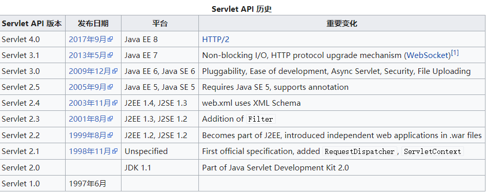
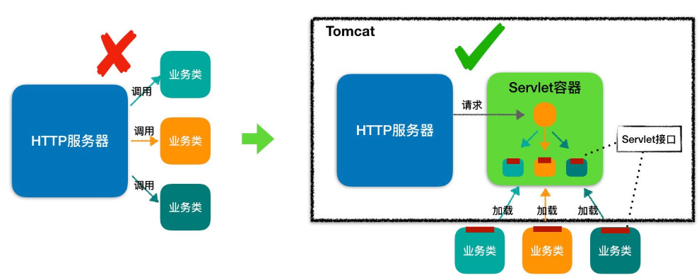
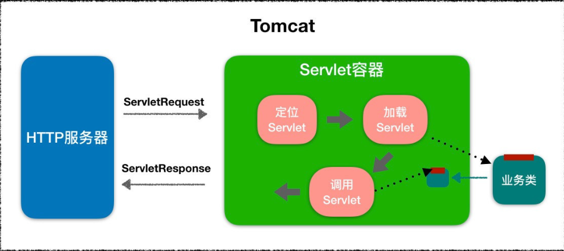
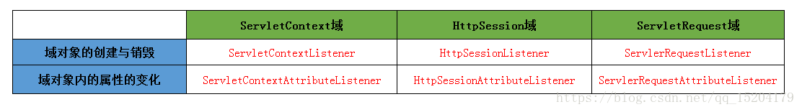

# Servlet详解

Servlet（Server Applet），全称Java Servlet。是用Java编写的服务器程序。其主要功能在于<font color=#00dd00>交互式地浏览和修改数据，生成动态Web内容。</font>狭义的Servlet是指Java语言实现的一个接口，广义的Servlet是指任何实现了这个Servlet接口的类，一般情况下，人们将Servlet理解为后者。 


Servlet运行于支持Java的应用服务器中。从实现上讲，Servlet可以响应任何类型的请求，但绝大多数情况下Servlet只用来扩展基于HTTP协议的Web服务器。 


## 历史




## 生命周期

当servlet被部署在应用服务器中（如Tomcat等）以后，由容器控制servlet的生命周期。除非特殊指定，否则在容器启动的时候，servlet是不会被加载的，servlet只会在第一次请求的时候被加载和实例化。servlet一旦被加载，一般不会从容器中删除，直至应用服务器关闭或重新启动。但当容器做存储器回收动作时，servlet有可能被删除。也正是因为这个原因，第一次访问servlet所用的时间要大大多于以后访问所用的时间。

servlet在服务器的运行生命周期为，在第一次请求（或其实体被内存垃圾回收后再被访问）时被加载并执行一次初始化方法，跟着执行正式运行方法，之后会被常驻并每次被请求时直接执行正式运行方法，直到服务器关闭或被清理时执行一次销毁方法后实体销毁。


## JSP

Java服务器页面JSP是HttpServlet的扩展。由于HttpServlet大多是用来响应HTTP请求，并返回Web页面（例如HTML、XML，所以不可避免地，在编写servlet时会涉及大量的HTML内容，这给servlet的书写效率和可读性带来很大障碍，JSP便是在这个基础上产生的。其功能是使用HTML的书写格式，在适当的地方加入Java代码片段，将程序员从复杂的HTML中解放出来，更专注于servlet本身的内容。

JSP在首次被访问的时候被应用服务器转换为servlet，在以后的运行中，容器直接调用这个servlet，而不再访问JSP页面。JSP的实质仍然是servlet。


# Servlet接口

```properties
Servlet: 这个就不用说了，Servlet的核心，具体Servlet中方法的处理规范可见以上描述的Servlet的生命周期

ServletConfig:  封装了对应的Servlet的相关配置信息，如servlet名字，servlet的初始参数以及Servlet所在的上下文对象，即ServletContext.  ServletConfig中的属性通常在Servlet初始化时进行初始化.

ServletRequest:  封装了所有来自client端的请求信息，如请求参数、cookie、attribute、请求类型、请求方式（安全还是非安全等）等，同时ServletRequest中的还需要明确指定部分属性，如 请求内容的编码（可以自己设定）等.  进一步的解释，可以参照下一章对HttpServletRequest的分析.

ServletResponse:  封装了server端资源到client端的所有相关信息，如 资源传输的buffer信息、响应的url地址信息、资源的编码信息等.

ServletInputStream/BufferedReader:  读取ServletRequest所封装的信息的I/O接口，ServletInputStream,采用字节流的方式读取；BufferedReader,采用字符流的方式读取.

ServletOutputSteam/PrintWriter:  将资源写入到client的I/O接口. ServletOutputSteam,采用字节流的方式进行写入;PrintWriter,采用字符流的方式进行写入.

GenericServlet:  抽象类，它定义了一个Servlet的基本实现，虽然它是Servlet的基本实现，但是它是与协议无关的（即不依赖于http协议，也不依赖于其它应用层协议）.  一般，基于协议的Servlet，如httpservlet，通常会继承该类.

RequestDispatcher: 我们在搭建web应用的过程中，可能会有这样的需求： 在当前servlet中处理完成后，需要导向（forwar）另外一个servlet或静态资源（html或text等），或者 是在当前servlet的处理过程中，需要将其它的资源包含（include）到当前的servlet资源里来。而RequestDisaptcher 接口中的forward和inluce方法就提供了实现以上两个需求的机制.
```


#  @WebServlet

```java
1 @WebServlet(value="/hello",loadOnStartup=1)
```


# ServletConfig和ServletContext

## ServletConfig

- 为servlet配置一些初始化参数(\<init-param>标签).
- 注意(还可以通过注解的方式进行配置)

```java
@WebServlet(name = "testServlet"
        , urlPatterns = {"/testServlet"}
        , initParams = {
        @WebInitParam(name = "driver", value = "com.mysql.jdbc.Driver"),
        @WebInitParam(name = "url", value = "jdbc:mysql://localhost:3306/gbiap"),
        @WebInitParam(name = "user", value = "root"),
        @WebInitParam(name = "pass", value = "gsmrlab"),
        @WebInitParam(name = "initValue", value= "5")})
public class AnnotationServlet extends HttpServlet {
}
```


##  ServletContext

WEB容器在启动时，它会为每个WEB应用程序都创建一个对应的ServletContext对象，它代表当前web应用。
1）ServletContext对象应用1：多个web组件之间使用它实现数据共享.context域对象。

2）通过servletContext对象获取到整个web应用的配置信息

3）通过servletContext对象实现servlet转发

```java
// 由于servlet中的java数据不易设置样式，所以serlvet可以将java数据转发到JSP页面中进行处理
this.getServletContext().setAttribute("data","serlvet数据转发");
RequestDispatcher rd = this.getServletContext().getRequestDispatcher("/viewdata.jsp");
rd.forward(request, response);
```

 4）通过servletContext对象读取资源文件

	在web工程中，我们一般来说，是不能采用传统方式读取配置文件的，因为相对的是jvm的启动
	目录(tomcat的bin目录)，所以我们要使用web绝对目录来获取配置文件的地址
	
	读取资源文件的三种方式：
	
	第一种：使用ServletContext的getResourceAsStream方法：返回资源文件的读取字节流
		
		InputStream in = this.getServletContext().getResourceAsStream("/WEB-INF/classes/db.properties");
		Properties prop = new Properties();  
		prop.load(in);
		String url = prop.getProperty("url");
	
	第二种：使用ServletContext的getRealPath方法，获得文件的完整绝对路径path，再使用字节流读取path下的文件
		
		String path = this.getServletContext().getRealPath("/WEB-INF/classes/db.properties");
		String filename = path.substring(path.lastIndexOf("\\")+1); 
		//相比第一种方法的好处是：除了可以获取数据，还可以获取资源文件的名称
		FileInputStream in = new FileInputStream(path);
		Properties prop = new Properties();
		prop.load(in);
		String url = prop.getProperty("url");
	
	第三种：使用ServletContext的getResource方法，获得一个url对象，调用该类的openStream方法返回一个字节流，读取数据
		
		URL url = this.getServletContext().getResource("/WEB-INF/classes/db.properties");
		InputStream in = url.openStream();
		Properties prop = new Properties();
		prop.load(in);
		String url1 = prop.getProperty("url");

5）web工程中，不同位置的资源文件的读取方式

	一、当资源文件在包下面时
		InputStream in = this.getServletContext().getResourceAsStream("/WEB-INF/classes/cn/itcast/context/db.properties");
		System.out.println(in);
	
	二、资源文件在web-inf下
		in = this.getServletContext().getResourceAsStream("/WEB-INF/db.properties");
		System.out.println(in);
	
	三、资源文件在web工程中
		in = this.getServletContext().getResourceAsStream("/db.properties");
		System.out.println(in);

6）在非servlet程序中如何读取配置文件:用类装载器

	1）用类装载方式读取 
	 in = StudentDao.class.getClassLoader().getResourceAsStream("cn/itcast/context/db.properties");
	2）用类装载方式读取，把资源当作url对待
	 URL url = StudentDao.class.getClassLoader().getResource("db.properties");
	 这样可以获得资源文件名称：String path = url.getPath();
	3）注意：在线程休眠过程中，即使改动了资源文件，获取到的还是原始内容
	解决方案：
	  URL url = StudentDao.class.getClassLoader().getResource("db.properties");
	  String path = url.getPath();
	  
	  FileInputStream in = new FileInputStream(path);
	  Properties prop = new Properties();
	  prop.load(in);
	  System.out.println(prop.getProperty("url"));
	  
	  try {
	   Thread.sleep(1000*15);
	  } catch (InterruptedException e) {
		e.printStackTrace();
	  }
	  in = new FileInputStream(path);
	  prop = new Properties();
	  prop.load(in);
	  System.out.println(prop.getProperty("url"));
	 
	4）注意：用类装载器读取资源文件时，千万要注意，资源文件绝对不能太大，否则极易导致内存溢出


# Servlet Listener

Listener是Servlet的监听器，它可以监听客户端的请求、服务端的操作等。通过监听器，可以自动激发一些操作，比如监听在线的用户的数量。


 Listener监听器就是一个实现特定接口的普通Java程序，这个程序专门用于监听一个java对象的方法调用或属性改变，当被监听对象发生上述事件后，监听器某个方法将立即被执行。 


 简单的说，被监听对象A中，关联着B对象。事件源A类对外提供一个方法，用于设置监听器对象B到A类的某一实例变量中。在需要监听事件源的方法中，方法体的某一处先构造创建一个Event对象，将this即B与相关的动作封装进Event对象中，然后调用监听器B对象的doXXXX(event)方法，将事件对象传入方法实参中。 


## ServletContext监听

ServletContextListener：用于对Servlet整个上下文进行监听（创建、销毁）。

```java
public void contextInitialized(ServletContextEvent sce);//上下文初始化
public void contextDestroyed(ServletContextEvent sce);//上下文销毁
public ServletContext getServletContext();//ServletContextEvent事件：取得一个ServletContext（application）对象
```

ServletContextAttributeListener：对Servlet上下文属性的监听（增删改属性）。

```java
public void attributeAdded(ServletContextAttributeEvent scab);//增加属性
public void attributeRemoved(ServletContextAttributeEvent scab);//属性删除
public void attributeRepalced(ServletContextAttributeEvent scab);//属性替换（第二次设置同一属性）
public String getName();//得到属性名称
public Object getValue();//取得属性的值
```

**例子**

```java
//MyServletContextListener类实现了ServletContextListener接口，因此可以对ServletContext对象的创建和销毁这两个动作进行监听。
public class MyServletContextListener implements ServletContextListener {
    @Override
    public void contextInitialized(ServletContextEvent sce) {
        System.out.println("ServletContext对象创建");
    }

    @Override
    public void contextDestroyed(ServletContextEvent sce) {
        System.out.println("ServletContext对象销毁");
    }
}
```


```xml
//web.xml文件中注册监听器
<?xml version="1.0" encoding="UTF-8"?>
<web-app version="3.0" 
    xmlns="http://java.sun.com/xml/ns/javaee" 
    xmlns:xsi="http://www.w3.org/2001/XMLSchema-instance" 
    xsi:schemaLocation="http://java.sun.com/xml/ns/javaee 
    http://java.sun.com/xml/ns/javaee/web-app_3_0.xsd">
  <display-name></display-name>    
  <welcome-file-list>
    <welcome-file>index.jsp</welcome-file>
  </welcome-file-list>
  
  <!-- 注册针对ServletContext对象进行监听的监听器 -->
  <listener>
      <description>ServletContextListener监听器</description>
      <!--实现了ServletContextListener接口的监听器类 -->
      <listener-class>me.gacl.web.listener.MyServletContextListener</listener-class>
  </listener>
</web-app>
```


这样我们就完成了监听器的编写和注册，Web服务器在启动时，就会自动把在web.xml中配置的监听器注册到ServletContext对象上，这样开发好的MyServletContextListener监听器就可以对ServletContext对象进行监听了。

## Session监听

HttpSessionListener接口：对Session的整体状态的监听。

```java
public void sessionCreated(HttpSessionEvent se);//session创建
public void sessionDestroyed(HttpSessionEvent se);//session销毁
//HttpSessionEvent事件
public HttpSession getSession();//取得当前操作的session
```

HttpSessionAttributeListener接口：对session的属性监听。

```java
public void attributeAdded(HttpSessionBindingEvent se);//增加属性
public void attributeRemoved(HttpSessionBindingEvent se);//删除属性
public void attributeReplaced(HttpSessionBindingEvent se);//替换属性
//HttpSessionBindingEvent事件
public String getName();//取得属性的名称
public Object getValue();//取得属性的值
public HttpSession getSession();//取得当前的session
```

**例子**

```java
//MyHttpSessionListener类实现了HttpSessionListener接口，因此可以对HttpSession对象的创建和销毁这两个动作进行监听。
public class MyHttpSessionListener implements HttpSessionListener {
    @Override
    public void sessionCreated(HttpSessionEvent se) {
        System.out.println( se.getSession() + "创建了！！");
    }

    /* HttpSession的销毁时机需要在web.xml中进行配置，如下：
     * <session-config>
              <session-timeout>1</session-timeout>
          </session-config>
          这样配置就表示session在1分钟之后就被销毁
     */
    @Override
    public void sessionDestroyed(HttpSessionEvent se) {
        System.out.println("session销毁了！！");
    }
}
```


```xml
//web.xml文件中注册监听器
<!--注册针对HttpSession对象进行监听的监听器-->
<listener>
      <description>HttpSessionListener监听器</description>
      <listener-class>me.gacl.web.listener.MyHttpSessionListener</listener-class>
</listener>
<!-- 配置HttpSession对象的销毁时机 -->
<session-config>
      <!--配置HttpSession对象的1分钟之后销毁 -->
      <session-timeout>1</session-timeout>
</session-config>
```


当我们访问jsp页面时，HttpSession对象就会创建，此时就可以在HttpSessionListener观察到HttpSession对象的创建过程了。

## Request监听

ServletRequestListener：用于对Request请求进行监听（创建、销毁）。

```java
public void requestInitialized(ServletRequestEvent sre);//request初始化
public void requestDestroyed(ServletRequestEvent sre);//request销毁
//ServletRequestEvent事件
public ServletRequest getServletRequest();//取得一个ServletRequest对象
public ServletContext getServletContext();//取得一个ServletContext（application）对象
```

ServletRequestAttributeListener：对Request属性的监听（增删改属性）。

```java
public void attributeAdded(ServletRequestAttributeEvent srae);//增加属性
public void attributeRemoved(ServletRequestAttributeEvent srae);//属性删除
public void attributeReplaced(ServletRequestAttributeEvent srae);//属性替换（第二次设置同一属性）
//ServletRequestAttributeEvent事件：能取得设置属性的名称与内容
public String getName();//得到属性名称
public Object getValue();//取得属性的值
```

**例子**

```java
// MyServletRequestListener类实现了ServletRequestListener接口，
// 因此可以对ServletRequest对象的创建和销毁这两个动作进行监听。 
public class MyServletRequestListener implements ServletRequestListener {
    @Override
    public void requestDestroyed(ServletRequestEvent sre) {
        System.out.println(sre.getServletRequest() + "销毁了！！");
    }

    @Override
    public void requestInitialized(ServletRequestEvent sre) {
        System.out.println(sre.getServletRequest() + "创建了！！");
    }
}
```


```xml
//web.xml文件中注册监听器  
<!--注册针对ServletRequest对象进行监听的监听器-->
<listener>
      <description>ServletRequestListener监听器</description>
      <listener-class>me.gacl.web.listener.MyServletRequestListener</listener-class>
</listener>
```


用户每一次访问都会创建request对象，当访问结束后，request对象就会销毁。


---


# Servlet&Tomcat

浏览器发给服务端的是一个 HTTP 格式的请求，HTTP 服务器收到这个请求后，需要调用服务端程序来处理，所谓的服务端程序就是你写的 Java 类，一般来说不同的请求需要由不同的 Java 类来处理。

那么问题来了，HTTP 服务器怎么知道要调用哪个 Java 类的哪个方法呢。最直接的做法是在 HTTP 服务器代码里写一大堆 if else 逻辑判断：如果是 A 请求就调 X 类的 M1 方法，如果是 B 请求就调 Y 类的 M2 方法。但这样做明显有问题，因为 HTTP 服务器的代码跟业务逻辑耦合在一起了，如果新加一个业务方法还要改 HTTP 服务器的代码。

那该怎么解决这个问题呢？我们知道，面向接口编程是解决耦合问题的法宝，于是有一伙人就定义了一个接口，各种业务类都必须实现这个接口，这个接口就叫 Servlet 接口，有时我们也把实现了 Servlet 接口的业务类叫作 Servlet。

但是这里还有一个问题，对于特定的请求，HTTP 服务器如何知道由哪个 Servlet 来处理呢？Servlet 又是由谁来实例化呢？显然 HTTP 服务器不适合做这个工作，否则又和业务类耦合了。

于是，还是那伙人又发明了 Servlet 容器，Servlet 容器用来加载和管理业务类。HTTP 服务器不直接跟业务类打交道，而是把请求交给 Servlet 容器去处理，Servlet 容器会将请求转发到具体的 Servlet，如果这个 Servlet 还没创建，就加载并实例化这个 Servlet，然后调用这个 Servlet 的接口方法。因此 Servlet 接口其实是 Servlet 容器跟具体业务类之间的接口。下面我们通过一张图来加深理解。



图的左边表示 HTTP 服务器直接调用具体业务类，它们是紧耦合的。再看图的右边，HTTP 服务器不直接调用业务类，而是把请求交给容器来处理，容器通过 Servlet 接口调用业务类。因此 Servlet 接口和 Servlet 容器的出现，达到了 HTTP 服务器与业务类解耦的目的。

而 Servlet 接口和 Servlet 容器这一整套规范叫作 Servlet 规范。Tomcat 和 Jetty 都按照 Servlet 规范的要求实现了 Servlet 容器，同时它们也具有 HTTP 服务器的功能。作为 Java 程序员，如果我们要实现新的业务功能，只需要实现一个 Servlet，并把它注册到 Tomcat（Servlet 容器）中，剩下的事情就由 Tomcat 帮我们处理了。

接下来我们来看看 Servlet 接口具体是怎么定义的，以及 Servlet 规范又有哪些要重点关注的地方呢？

## Servlet 接口

```java
public interface Servlet {
    
    void init(ServletConfig config) throws ServletException;

    ServletConfig getServletConfig();

    void service(ServletRequest req, ServletResponse res）throws ServletException, IOException;

    String getServletInfo();

    void destroy();
}
```

其中最重要是的 service 方法，具体业务类在这个方法里实现处理逻辑。这个方法有两个参数：ServletRequest 和 ServletResponse。ServletRequest 用来封装请求信息，ServletResponse 用来封装响应信息，因此本质上这两个类是对通信协议的封装。

比如 HTTP 协议中的请求和响应就是对应了 HttpServletRequest 和 HttpServletResponse 这两个类。你可以通过 HttpServletRequest 来获取所有请求相关的信息，包括请求路径、Cookie、HTTP 头、请求参数等。
你可以看到接口中还有两个跟生命周期有关的方法 init 和 destroy，这是一个比较贴心的设计，Servlet 容器在加载 Servlet 类的时候会调用 init 方法，在卸载的时候会调用 destroy 方法。我们可能会在 init 方法里初始化一些资源，并在 destroy 方法里释放这些资源，比如 Spring MVC 中的 DispatcherServlet，就是在 init 方法里创建了自己的 Spring 容器。

你还会注意到 ServletConfig 这个类，ServletConfig 的作用就是封装 Servlet 的初始化参数。你可以在 web.xml 给 Servlet 配置参数，并在程序里通过 getServletConfig 方法拿到这些参数。

我们知道，有接口一般就有抽象类，抽象类用来实现接口和封装通用的逻辑，因此 Servlet 规范提供了 GenericServlet 抽象类，我们可以通过扩展它来实现 Servlet。虽然 Servlet 规范并不在乎通信协议是什么，但是大多数的 Servlet 都是在 HTTP 环境中处理的，因此 Servet 规范还提供了 HttpServlet 来继承 GenericServlet，并且加入了 HTTP 特性。这样我们通过继承 HttpServlet 类来实现自己的 Servlet。

## Servlet 容器

我在前面提到，为了解耦，HTTP 服务器不直接调用 Servlet，而是把请求交给 Servlet 容器来处理，那 Servlet 容器又是怎么工作的呢？接下来我会介绍 Servlet 容器大体的工作流程，一起来聊聊我们非常关心的两个话题：Web 应用的目录格式是什么样的，以及我该怎样扩展和定制化 Servlet 容器的功能。

## 工作流程

当客户请求某个资源时，HTTP 服务器会用一个 ServletRequest 对象把客户的请求信息封装起来，然后调用 Servlet 容器的 service 方法，Servlet 容器拿到请求后，根据请求的 URL 和 Servlet 的映射关系，找到相应的 Servlet，如果 Servlet 还没有被加载，就用反射机制创建这个 Servlet，并调用 Servlet 的 init 方法来完成初始化，接着调用 Servlet 的 service 方法来处理请求，把 ServletResponse 对象返回给 HTTP 服务器，HTTP 服务器会把响应发送给客户端。同样我通过一张图来帮助你理解。



## Web 应用

Servlet 容器会实例化和调用 Servlet，那 Servlet 是怎么注册到 Servlet 容器中的呢？一般来说，我们是以 Web 应用程序的方式来部署 Servlet 的，而根据 Servlet 规范，Web 应用程序有一定的目录结构，在这个目录下分别放置了 Servlet 的类文件、配置文件以及静态资源，Servlet 容器通过读取配置文件，就能找到并加载 Servlet。Web 应用的目录结构大概是下面这样的：

```xml
| -  MyWebApp
      | -  WEB-INF/web.xml        -- 配置文件，用来配置Servlet等
      | -  WEB-INF/lib/           -- 存放Web应用所需各种JAR包
      | -  WEB-INF/classes/       -- 存放你的应用类，比如Servlet类
      | -  META-INF/              -- 目录存放工程的一些信息
```

Servlet 规范里定义了 ServletContext 这个接口来对应一个 Web 应用。Web 应用部署好后，Servlet 容器在启动时会加载 Web 应用，并为每个 Web 应用创建唯一的 ServletContext 对象。你可以把 ServletContext 看成是一个全局对象，一个 Web 应用可能有多个 Servlet，这些 Servlet 可以通过全局的 ServletContext 来共享数据，这些数据包括 Web 应用的初始化参数、Web 应用目录下的文件资源等。由于 ServletContext 持有所有 Servlet 实例，你还可以通过它来实现 Servlet 请求的转发。

# servlet扩展机制

引入了 Servlet 规范后，你不需要关心 Socket 网络通信、不需要关心 HTTP 协议，也不需要关心你的业务类是如何被实例化和调用的，因为这些都被 Servlet 规范标准化了，你只要关心怎么实现的你的业务逻辑。这对于程序员来说是件好事，但也有不方便的一面。所谓规范就是说大家都要遵守，就会千篇一律，但是如果这个规范不能满足你的业务的个性化需求，就有问题了，因此设计一个规范或者一个中间件，要充分考虑到可扩展性。Servlet 规范提供了两种扩展机制：Filter 和 Listener。

## Filter

 过滤器，这个接口允许你对请求和响应做一些统一的定制化处理，比如你可以根据请求的频率来限制访问，或者根据国家地区的不同来修改响应内容。过滤器的工作原理是这样的：Web 应用部署完成后，Servlet 容器需要实例化 Filter 并把 Filter 链接成一个 FilterChain。当请求进来时，获取第一个 Filter 并调用 doFilter 方法，doFilter 方法负责调用这个 FilterChain 中的下一个 Filter。


### 接口

```java
public interface FilterChain {
    void doFilter(ServletRequest var1, ServletResponse var2) throws IOException, ServletException;
}
```


```java
public interface Filter {
    //由Web容器调用，初始化此Filter
    void init(FilterConfig var1) throws ServletException;

    //具体处理过滤的代码
    void doFilter(ServletRequest var1, ServletResponse var2, FilterChain var3) throws IOException, ServletException;

    //由web容器调用，销毁此Filter
    void destroy();
}
```


```java
public interface FilterConfig {
    String getFilterName();

    ServletContext getServletContext();

    String getInitParameter(String var1);

    Enumeration<String> getInitParameterNames();
}
```


### 部署

方式1.

```xml
<filter>
    <filter-name>testFitler</filter-name>
    <filter-class>org.test.TestFiter</filter-class>
    <init-param>
        <param-name>word_file</param-name>
        <param-value>/WEB-INF/word.txt</param-value>
    </init-param>
</filter>

<filter-mapping>
    <filter-name>testFilter</filter-name>
    <url-pattern>/index.jsp</url-pattern>
    <servlet-name></servlet-name>
    <dispatcher>REQUEST</dispatcher>
    <dispatcher>FORWARD</dispatcher>
</filter-mapping>
```

**dispatcher: **指定过滤器所拦截的资源被Servlet容器调用的方式，可以是REQUEST，INCLUDE，FORWARD，和ERROR之一，默认是REQUEST。用户可以设置多个<dispatcher>子元素用来指定Filter对资源的多种调用方式进行拦截。

> **REQUEST**：当用户直接访问页面时，Web容器将会调用过滤器。如果目标资源是通过RequestDispatcher的include()或forward()方法访问时，那么该过滤器就不会被调用。
>
> **INCLUDE**：如果目标资源是通过RequestDispatcher的include()方法访问时，那么该过滤器将被调用。除此之外，该过滤器不会被调用。
>
> **FORWARD**：如果目标资源是通过RequestDispatcher的forward()方法访问时，那么该过滤器将被调用，除此之外，该过滤器不会被调用。
>
> **ERROR**：如果目标资源是通过声明式异常处理机制调用时，那么该过滤器将被调用。除此之外，过滤器不会被调用。


方式2.

```java
@Target(ElementType.TYPE)
@Retention(RetentionPolicy.RUNTIME)
@Documented
public @interface WebFilter {
    ......
}
```


### 执行顺序

**在实际应用中，要特别注意过滤器链的执行顺序问题，web服务器根据过滤器在web.xml文件中的注册顺序，决定先调用哪个过滤器**


### 使用

```xml
<filter>
    <filter-name>myFilter</filter-name>
    <filter-class>cn.itcast.web.filter.MyFilter</filter-class>
</filter>

<filter-mapping>
    <filter-name>myFilter</filter-name>
    <url-pattern>/demo1</url-pattern>
    <dispatcher>REQUEST</dispatcher>
    <dispatcher>FORWARD</dispatcher>
</filter-mapping>

<servlet>
    <servlet-name>demoServlet</servlet-name>
    <servlet-class>cn.itcast.web.servlet.DemoServlet</servlet-class>
</servlet>
<servlet>
    <servlet-name>Demo1Servlet</servlet-name>
    <servlet-class>cn.itcast.web.servlet.Demo1Servlet</servlet-class>
</servlet>

<servlet-mapping>
    <servlet-name>demoServlet</servlet-name>
    <url-pattern>/demo</url-pattern>
</servlet-mapping>
<servlet-mapping>
    <servlet-name>Demo1Servlet</servlet-name>
    <url-pattern>/demo1</url-pattern>
</servlet-mapping>
```


## Listener

监听器，这是另一种扩展机制。当 Web 应用在 Servlet 容器中运行时，Servlet 容器内部会不断的发生各种事件，如 Web 应用的启动和停止、用户请求到达等。 Servlet 容器提供了一些默认的监听器来监听这些事件，当事件发生时，Servlet 容器会负责调用监听器的方法。当然，你可以定义自己的监听器去监听你感兴趣的事件，将监听器配置在 web.xml 中。比如 Spring 就实现了自己的监听器，来监听 ServletContext 的启动事件，目的是当 Servlet 容器启动时，创建并初始化全局的 Spring 容器。





### Servlet API提供的事件对象

`javax.servlet.AsyncEvent` 

- 在ServletRequest（通过调用ServletRequest#startAsync或ServletRequest#startAsync(ServletRequest,ServletResponse)）启动的异步操作已完成，超时或产生错误时触发的事件。

`javax.servlet.http.HttpSessionBindingEvent` 

- 将此类型的事件发送到实现HttpSessionBindingListener的对象，当该对象从会话绑定或解除绑定时，或者发送到在web.xml中配置的HttpSessionAttributeListener，当绑定任何属性时，在会话中取消绑定或替换。会话通过对HttpSession.setAttribute的调用来绑定对象，并通过调用HttpSession.removeAttribute解除对象的绑定。当对象从会话中删除时，我们可以使用此事件进行清理活动。

`javax.servlet.http.HttpSessionEvent`

- 这是表示Web应用程序中会话更改的事件通知的类。

`javax.servlet.ServletContextAttributeEvent`

- 关于对Web应用程序的ServletContext的属性进行更改的通知的事件类。

`javax.servlet.ServletContextEvent`

- 这是关于Web应用程序的servlet上下文更改的通知的事件类。

`javax.servlet.ServletRequestEvent`

- 此类事件表示ServletRequest的生命周期事件。事件的源代码是这个Web应用程序的ServletContext。

`javax.servlet.ServletRequestAttributeEvent`

- 这是事件类，用于对应用程序中servlet请求的属性进行更改的通知。


### Servlet API提供的监听器接口

`javax.servlet.AsyncListener`

- 如果在添加了侦听器的ServletRequest上启动的异步操作已完成，超时或导致错误，将会通知侦听器。

`javax.servlet.ServletContextListener`

- 用于接收关于ServletContext生命周期更改的通知事件的接口。

`javax.servlet.ServletContextAttributeListener`

- 接收关于ServletContext属性更改的通知事件的接口。

`javax.servlet.ServletRequestListener`

- 用于接收关于进入和超出Web应用程序范围的请求的通知事件的接口。

`javax.servlet.ServletRequestAttributeListener`

- 接收关于ServletRequest属性更改的通知事件的接口。

`javax.servlet.http.HttpSessionListener`

- 接收关于HttpSession生命周期更改的通知事件的接口。

`javax.servlet.http.HttpSessionBindingListener`

- 使对象从会话绑定到绑定或从其绑定时被通知。

`javax.servlet.http.HttpSessionAttributeListener`

- 用于接收关于HttpSession属性更改的通知事件的接口。

`javax.servlet.http.HttpSessionActivationListener`

- 绑定到会话的对象可能会侦听容器事件，通知他们会话将被钝化，该会话将被激活。需要在VM或持久化会话之间迁移会话的容器来通知绑定到实现HttpSessionActivationListener的会话的所有属性。


### 部署

方法1，web.xml：在部署描述符中

```xml
<listener>
    <listener-class>
        com.mysolution.listener.AppContextListener
    </listener-class>
</listener>
```


方法2

```java
@WebListener
public class AppContextListener implements ServletContextListener {
......
}
```

